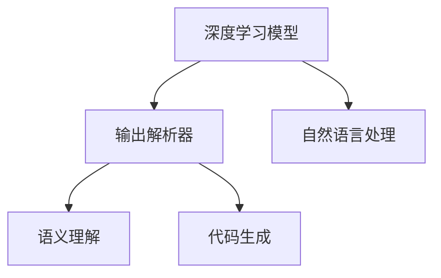
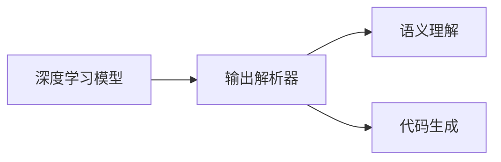
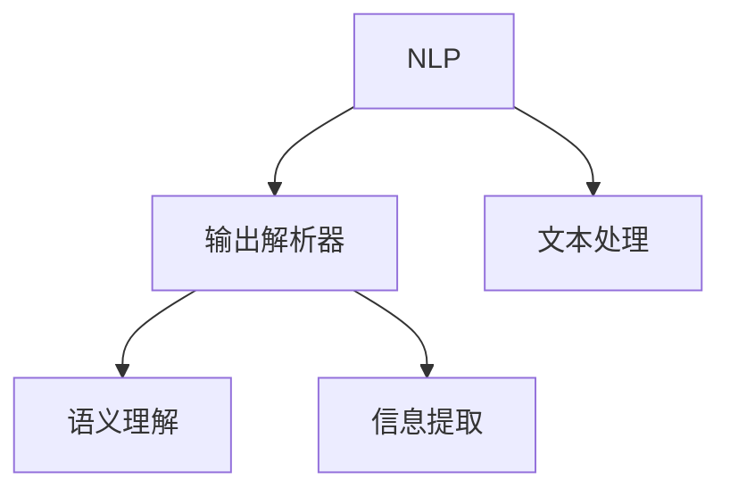
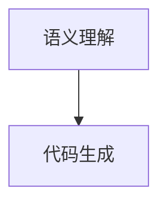
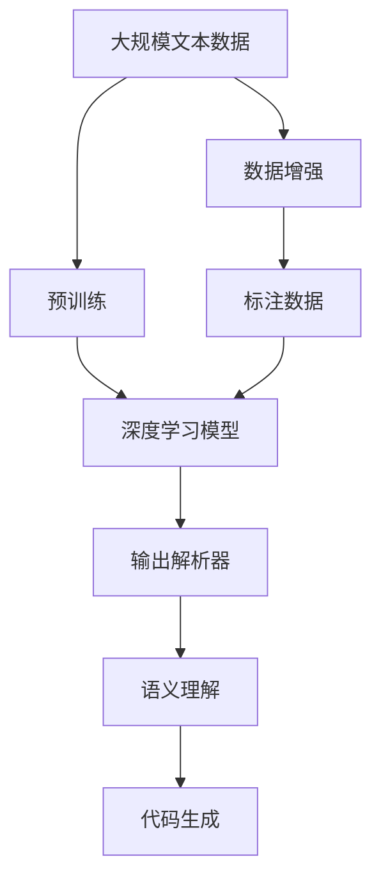

                 

# 【LangChain编程：从入门到实践】输出解析器

> 关键词：
- 输出解析器
- LangChain
- 自然语言处理(NLP)
- 机器学习模型
- 深度学习
- 语义理解
- 代码生成

## 1. 背景介绍

随着人工智能技术的快速发展，自然语言处理(NLP)领域涌现出了大量高效的语言模型，如GPT、BERT等。这些模型通过大量的文本数据预训练，学习了丰富的语言表示，能够在各种任务中展现出强大的能力。然而，这些模型的输出往往需要进一步解析，才能被有效地应用于实际场景中。

### 1.1 问题由来

在NLP应用中，输出解析器（Output Parsing）扮演着重要角色。它负责将模型输出的自然语言文本转换为可操作的结构化信息，如命名实体识别、句法分析、情感分析等。在实际应用中，输出解析器的性能直接影响系统整体的效果，成为NLP应用成败的关键。

传统的输出解析器往往依赖于手工设计的规则和特征工程，耗时长、成本高，且难以应对不断变化的文本结构。而基于深度学习模型的解析器，则能快速适应新场景，无需手动特征提取，从而提高了效率和效果。

### 1.2 问题核心关键点

基于深度学习模型的输出解析器，其核心关键点包括：
- 选择合适的深度学习框架和模型。如PyTorch、TensorFlow、LangChain等，并根据任务需求选择适当的模型。
- 设计合适的输出目标函数。如交叉熵损失、Focal Loss等，根据具体任务优化目标。
- 数据预处理和增强。包括分词、去除停用词、数据增强等，提升数据质量。
- 模型训练和优化。选择合适的优化算法和超参数，如Adam、SGD、学习率、批次大小等，优化模型效果。
- 模型部署和评估。将训练好的模型部署到实际应用中，并在新数据上评估性能。

通过合理设计和优化这些关键点，可以构建高效的输出解析器，提升NLP应用的性能和效果。

## 2. 核心概念与联系

### 2.1 核心概念概述

为更好地理解基于深度学习的输出解析器，本节将介绍几个密切相关的核心概念：

- 输出解析器（Output Parsing）：将深度学习模型输出的自然语言文本转换为可操作的结构化信息的过程。
- 自然语言处理（NLP）：涉及语言理解、生成、翻译、信息提取等任务的计算机科学领域。
- 深度学习模型：通过多层神经网络实现复杂非线性映射的机器学习模型，如CNN、RNN、Transformer等。
- 语义理解（Semantic Understanding）：理解和解释自然语言文本的能力，包括词汇、语法和上下文信息的分析。
- 代码生成（Code Generation）：根据自然语言描述自动生成代码的过程，涉及语言模型和输出解析器。

这些概念之间的联系可以通过以下Mermaid流程图来展示：



这个流程图展示了大语言模型输出解析器的核心概念及其相互关系：
1. 深度学习模型是输出解析器的基础，提供自然语言文本的表示。
2. 输出解析器将模型输出转换为结构化信息，如命名实体、句法结构等。
3. 语义理解是通过模型和解析器完成的，包括词汇、语法和上下文的理解。
4. 代码生成则通过解析器输出进一步实现，将文本转换为代码。

### 2.2 概念间的关系

这些核心概念之间存在着紧密的联系，形成了深度学习在输出解析领域的完整生态系统。下面我们通过几个Mermaid流程图来展示这些概念之间的关系。

#### 2.2.1 深度学习模型和输出解析器



这个流程图展示了大语言模型和输出解析器的基本关系，以及它们在语义理解和代码生成中的应用。

#### 2.2.2 自然语言处理和输出解析器



这个流程图展示了NLP领域和输出解析器之间的关系，以及它们在文本处理、语义理解和信息提取中的应用。

#### 2.2.3 语义理解和代码生成



这个流程图展示了语义理解与代码生成之间的关系，展示了它们在自然语言与代码之间的转换。

### 2.3 核心概念的整体架构

最后，我们用一个综合的流程图来展示这些核心概念在大语言模型输出解析过程中的整体架构：



这个综合流程图展示了从预训练到输出解析器的完整过程。大语言模型首先在大规模文本数据上进行预训练，然后通过输出解析器将模型输出转换为结构化信息，完成语义理解和代码生成。数据增强和标注数据的处理也是不可缺少的环节。通过这些环节，大语言模型可以实现从文本到结构化数据的有效转换，为各种NLP应用提供基础支持。

## 3. 核心算法原理 & 具体操作步骤

### 3.1 算法原理概述

基于深度学习的输出解析器，本质上是一种序列标注任务。其目标是将输入的文本序列标记为预设的类别或标签，从而实现对文本信息的结构化解析。常见的序列标注任务包括命名实体识别、句法分析、情感分析等。

形式化地，假设输入文本序列为 $X=\{x_1, x_2, ..., x_n\}$，其对应的标签序列为 $Y=\{y_1, y_2, ..., y_n\}$。输出解析器的目标是最小化损失函数 $\mathcal{L}$：

$$
\mathcal{L} = \sum_{i=1}^n \ell(y_i, \hat{y}_i)
$$

其中 $\ell$ 为分类损失函数，如交叉熵损失、Focal Loss等，$\hat{y}_i$ 为模型预测的标签。

模型的训练过程通常采用最大似然估计（Maximum Likelihood Estimation, MLE），通过优化目标函数最大化似然概率：

$$
P(Y|X) = \prod_{i=1}^n P(y_i|x_i)
$$

其中 $P(y_i|x_i)$ 为模型对标签 $y_i$ 在文本 $x_i$ 下的预测概率。通过最大化这个似然概率，模型可以学习到最佳的标签序列。

### 3.2 算法步骤详解

基于深度学习的输出解析器一般包括以下关键步骤：

**Step 1: 准备预训练模型和数据集**
- 选择合适的深度学习模型，如BERT、GPT等，作为初始化参数。
- 准备输出解析任务的数据集，划分为训练集、验证集和测试集。数据集应包含标注好的标签，用于模型训练和评估。

**Step 2: 设计输出目标函数**
- 根据具体任务选择合适的损失函数，如交叉熵损失、Focal Loss等。
- 定义模型输出层的结构和激活函数，如线性层、ReLU激活函数等。

**Step 3: 设置模型超参数**
- 选择合适的优化算法及其参数，如Adam、SGD等，设置学习率、批次大小、迭代轮数等。
- 设置正则化技术及强度，包括权重衰减、Dropout等。

**Step 4: 执行梯度训练**
- 将训练集数据分批次输入模型，前向传播计算损失函数。
- 反向传播计算参数梯度，根据设定的优化算法和学习率更新模型参数。
- 周期性在验证集上评估模型性能，根据性能指标决定是否触发 Early Stopping。
- 重复上述步骤直到满足预设的迭代轮数或 Early Stopping 条件。

**Step 5: 测试和部署**
- 在测试集上评估训练好的模型，对比微调前后的精度提升。
- 使用微调后的模型对新样本进行推理预测，集成到实际的应用系统中。

以上是基于深度学习的输出解析器的一般流程。在实际应用中，还需要根据具体任务特点进行优化设计，如改进训练目标函数，引入更多的正则化技术，搜索最优的超参数组合等，以进一步提升模型性能。

### 3.3 算法优缺点

基于深度学习的输出解析器具有以下优点：
1. 模型灵活性高。深度学习模型能够学习复杂的特征表示，适用于各种不同类型的输出解析任务。
2. 鲁棒性强。模型通过大量训练数据进行学习，能够有效抵御噪声和干扰。
3. 自适应能力强。模型能够通过数据增强等技术，适应不同的文本数据分布。

同时，这种解析器也存在以下缺点：
1. 数据需求高。深度学习模型需要大量标注数据进行训练，成本较高。
2. 模型复杂度高。大模型往往包含大量参数，训练和推理过程耗时较长。
3. 黑盒性质。深度学习模型难以解释其内部工作机制，难以进行调试和优化。

尽管存在这些局限性，但深度学习模型解析器在许多实际应用中仍展现出卓越的表现，成为NLP领域的重要技术手段。未来，随着深度学习模型的不断演进，这些问题有望得到进一步解决。

### 3.4 算法应用领域

基于深度学习的输出解析器在NLP领域已经得到了广泛的应用，覆盖了几乎所有常见的任务，例如：

- 命名实体识别（Named Entity Recognition, NER）：识别文本中的人名、地名、机构名等特定实体。
- 句法分析（Part-of-Speech Tagging, POS）：分析文本中的词性，如名词、动词等。
- 情感分析（Sentiment Analysis）：分析文本的情感倾向，如积极、消极或中性。
- 信息抽取（Information Extraction）：从文本中抽取特定信息，如关系抽取、事件抽取等。
- 问答系统（Question Answering, QA）：根据自然语言问题，给出相应的答案。
- 文本摘要（Text Summarization）：将长文本压缩成简短摘要。
- 机器翻译（Machine Translation, MT）：将源语言文本翻译成目标语言。

除了这些经典任务外，输出解析器也被创新性地应用到更多场景中，如可控文本生成、代码生成、文档分类等，为NLP技术带来了全新的突破。随着深度学习模型的不断进步，相信输出解析器将在更广泛的领域发挥重要作用。

## 4. 数学模型和公式 & 详细讲解 & 举例说明

### 4.1 数学模型构建

本节将使用数学语言对基于深度学习的输出解析器进行更加严格的刻画。

记输入文本序列为 $X=\{x_1, x_2, ..., x_n\}$，其对应的标签序列为 $Y=\{y_1, y_2, ..., y_n\}$。假设深度学习模型为 $M_{\theta}$，其中 $\theta$ 为模型参数。输出解析器的目标函数为交叉熵损失：

$$
\mathcal{L}(\theta) = -\sum_{i=1}^n \log P(y_i|x_i)
$$

其中 $P(y_i|x_i)$ 为模型对标签 $y_i$ 在文本 $x_i$ 下的预测概率。

### 4.2 公式推导过程

以下我们以命名实体识别（NER）任务为例，推导交叉熵损失函数及其梯度的计算公式。

假设模型 $M_{\theta}$ 在输入 $x$ 上的输出为 $\hat{y}=M_{\theta}(x)$，表示样本属于实体的概率。真实标签 $y \in \{0,1\}$，其中 0 表示非实体，1 表示实体。则二分类交叉熵损失函数定义为：

$$
\ell(M_{\theta}(x),y) = -y\log \hat{y} - (1-y)\log (1-\hat{y})
$$

将其代入经验风险公式，得：

$$
\mathcal{L}(\theta) = -\frac{1}{N}\sum_{i=1}^N [y_i\log M_{\theta}(x_i)+(1-y_i)\log(1-M_{\theta}(x_i))]
$$

根据链式法则，损失函数对参数 $\theta_k$ 的梯度为：

$$
\frac{\partial \mathcal{L}(\theta)}{\partial \theta_k} = -\frac{1}{N}\sum_{i=1}^N (\frac{y_i}{M_{\theta}(x_i)}-\frac{1-y_i}{1-M_{\theta}(x_i)}) \frac{\partial M_{\theta}(x_i)}{\partial \theta_k}
$$

其中 $\frac{\partial M_{\theta}(x_i)}{\partial \theta_k}$ 可进一步递归展开，利用自动微分技术完成计算。

在得到损失函数的梯度后，即可带入参数更新公式，完成模型的迭代优化。重复上述过程直至收敛，最终得到适应下游任务的最优模型参数 $\theta^*$。

### 4.3 案例分析与讲解

为了更好地理解基于深度学习的输出解析器，我们以BERT模型为例，展示其在命名实体识别（NER）任务上的应用。

首先，定义NER任务的数据处理函数：

```python
from transformers import BertTokenizer
from torch.utils.data import Dataset
import torch

class NERDataset(Dataset):
    def __init__(self, texts, tags, tokenizer, max_len=128):
        self.texts = texts
        self.tags = tags
        self.tokenizer = tokenizer
        self.max_len = max_len
        
    def __len__(self):
        return len(self.texts)
    
    def __getitem__(self, item):
        text = self.texts[item]
        tags = self.tags[item]
        
        encoding = self.tokenizer(text, return_tensors='pt', max_length=self.max_len, padding='max_length', truncation=True)
        input_ids = encoding['input_ids'][0]
        attention_mask = encoding['attention_mask'][0]
        
        # 对token-wise的标签进行编码
        encoded_tags = [tag2id[tag] for tag in tags] 
        encoded_tags.extend([tag2id['O']] * (self.max_len - len(encoded_tags)))
        labels = torch.tensor(encoded_tags, dtype=torch.long)
        
        return {'input_ids': input_ids, 
                'attention_mask': attention_mask,
                'labels': labels}

# 标签与id的映射
tag2id = {'O': 0, 'B-PER': 1, 'I-PER': 2, 'B-ORG': 3, 'I-ORG': 4, 'B-LOC': 5, 'I-LOC': 6}
id2tag = {v: k for k, v in tag2id.items()}

# 创建dataset
tokenizer = BertTokenizer.from_pretrained('bert-base-cased')

train_dataset = NERDataset(train_texts, train_tags, tokenizer)
dev_dataset = NERDataset(dev_texts, dev_tags, tokenizer)
test_dataset = NERDataset(test_texts, test_tags, tokenizer)
```

然后，定义模型和优化器：

```python
from transformers import BertForTokenClassification, AdamW

model = BertForTokenClassification.from_pretrained('bert-base-cased', num_labels=len(tag2id))

optimizer = AdamW(model.parameters(), lr=2e-5)
```

接着，定义训练和评估函数：

```python
from torch.utils.data import DataLoader
from tqdm import tqdm
from sklearn.metrics import classification_report

device = torch.device('cuda') if torch.cuda.is_available() else torch.device('cpu')
model.to(device)

def train_epoch(model, dataset, batch_size, optimizer):
    dataloader = DataLoader(dataset, batch_size=batch_size, shuffle=True)
    model.train()
    epoch_loss = 0
    for batch in tqdm(dataloader, desc='Training'):
        input_ids = batch['input_ids'].to(device)
        attention_mask = batch['attention_mask'].to(device)
        labels = batch['labels'].to(device)
        model.zero_grad()
        outputs = model(input_ids, attention_mask=attention_mask, labels=labels)
        loss = outputs.loss
        epoch_loss += loss.item()
        loss.backward()
        optimizer.step()
    return epoch_loss / len(dataloader)

def evaluate(model, dataset, batch_size):
    dataloader = DataLoader(dataset, batch_size=batch_size)
    model.eval()
    preds, labels = [], []
    with torch.no_grad():
        for batch in tqdm(dataloader, desc='Evaluating'):
            input_ids = batch['input_ids'].to(device)
            attention_mask = batch['attention_mask'].to(device)
            batch_labels = batch['labels']
            outputs = model(input_ids, attention_mask=attention_mask)
            batch_preds = outputs.logits.argmax(dim=2).to('cpu').tolist()
            batch_labels = batch_labels.to('cpu').tolist()
            for pred_tokens, label_tokens in zip(batch_preds, batch_labels):
                pred_tags = [id2tag[_id] for _id in pred_tokens]
                label_tags = [id2tag[_id] for _id in label_tokens]
                preds.append(pred_tags[:len(label_tags)])
                labels.append(label_tags)
                
    print(classification_report(labels, preds))
```

最后，启动训练流程并在测试集上评估：

```python
epochs = 5
batch_size = 16

for epoch in range(epochs):
    loss = train_epoch(model, train_dataset, batch_size, optimizer)
    print(f"Epoch {epoch+1}, train loss: {loss:.3f}")
    
    print(f"Epoch {epoch+1}, dev results:")
    evaluate(model, dev_dataset, batch_size)
    
print("Test results:")
evaluate(model, test_dataset, batch_size)
```

以上就是使用PyTorch对BERT进行命名实体识别（NER）任务微调的完整代码实现。可以看到，得益于Transformers库的强大封装，我们可以用相对简洁的代码完成BERT模型的加载和微调。

## 5. 项目实践：代码实例和详细解释说明

### 5.1 开发环境搭建

在进行输出解析器实践前，我们需要准备好开发环境。以下是使用Python进行PyTorch开发的环境配置流程：

1. 安装Anaconda：从官网下载并安装Anaconda，用于创建独立的Python环境。

2. 创建并激活虚拟环境：
```bash
conda create -n pytorch-env python=3.8 
conda activate pytorch-env
```

3. 安装PyTorch：根据CUDA版本，从官网获取对应的安装命令。例如：
```bash
conda install pytorch torchvision torchaudio cudatoolkit=11.1 -c pytorch -c conda-forge
```

4. 安装Transformers库：
```bash
pip install transformers
```

5. 安装各类工具包：
```bash
pip install numpy pandas scikit-learn matplotlib tqdm jupyter notebook ipython
```

完成上述步骤后，即可在`pytorch-env`环境中开始输出解析器实践。

### 5.2 源代码详细实现

这里我们以命名实体识别（NER）任务为例，给出使用Transformers库对BERT模型进行微调的PyTorch代码实现。

首先，定义NER任务的数据处理函数：

```python
from transformers import BertTokenizer
from torch.utils.data import Dataset
import torch

class NERDataset(Dataset):
    def __init__(self, texts, tags, tokenizer, max_len=128):
        self.texts = texts
        self.tags = tags
        self.tokenizer = tokenizer
        self.max_len = max_len
        
    def __len__(self):
        return len(self.texts)
    
    def __getitem__(self, item):
        text = self.texts[item]
        tags = self.tags[item]
        
        encoding = self.tokenizer(text, return_tensors='pt', max_length=self.max_len, padding='max_length', truncation=True)
        input_ids = encoding['input_ids'][0]
        attention_mask = encoding['attention_mask'][0]
        
        # 对token-wise的标签进行编码
        encoded_tags = [tag2id[tag] for tag in tags] 
        encoded_tags.extend([tag2id['O']] * (self.max_len - len(encoded_tags)))
        labels = torch.tensor(encoded_tags, dtype=torch.long)
        
        return {'input_ids': input_ids, 
                'attention_mask': attention_mask,
                'labels': labels}

# 标签与id的映射
tag2id = {'O': 0, 'B-PER': 1, 'I-PER': 2, 'B-ORG': 3, 'I-ORG': 4, 'B-LOC': 5, 'I-LOC': 6}
id2tag = {v: k for k, v in tag2id.items()}

# 创建dataset
tokenizer = BertTokenizer.from_pretrained('bert-base-cased')

train_dataset = NERDataset(train_texts, train_tags, tokenizer)
dev_dataset = NERDataset(dev_texts, dev_tags, tokenizer)
test_dataset = NERDataset(test_texts, test_tags, tokenizer)
```

然后，定义模型和优化器：

```python
from transformers import BertForTokenClassification, AdamW

model = BertForTokenClassification.from_pretrained('bert-base-cased', num_labels=len(tag2id))

optimizer = AdamW(model.parameters(), lr=2e-5)
```

接着，定义训练和评估函数：

```python
from torch.utils.data import DataLoader
from tqdm import tqdm
from sklearn.metrics import classification_report

device = torch.device('cuda') if torch.cuda.is_available() else torch.device('cpu')
model.to(device)

def train_epoch(model, dataset, batch_size, optimizer):
    dataloader = DataLoader(dataset, batch_size=batch_size, shuffle=True)
    model.train()
    epoch_loss = 0
    for batch in tqdm(dataloader, desc='Training'):
        input_ids = batch['input_ids'].to(device)
        attention_mask = batch['attention_mask'].to(device)
        labels = batch['labels'].to(device)
        model.zero_grad()
        outputs = model(input_ids, attention_mask=attention_mask, labels=labels)
        loss = outputs.loss
        epoch_loss += loss.item()
        loss.backward()
        optimizer.step()
    return epoch_loss / len(dataloader)

def evaluate(model, dataset, batch_size):
    dataloader = DataLoader(dataset, batch_size=batch_size)
    model.eval()
    preds, labels = [], []
    with torch.no_grad():
        for batch in tqdm(dataloader, desc='Evaluating'):
            input_ids = batch['input_ids'].to(device)
            attention_mask = batch['attention_mask'].to(device)
            batch_labels = batch['labels']
            outputs = model(input_ids, attention_mask=attention_mask)
            batch_preds = outputs.logits.argmax(dim=2).to('cpu').tolist()
            batch_labels = batch_labels.to('cpu').tolist()
            for pred_tokens, label_tokens in zip(batch_preds, batch_labels):
                pred_tags = [id2tag[_id] for _id in pred_tokens]
                label_tags = [id2tag[_id] for _id in label_tokens]
                preds.append(pred_tags[:len(label_tags)])
                labels.append(label_tags)
                
    print(classification_report(labels, preds))
```

最后，启动训练流程并在测试集上评估：

```python
epochs = 5
batch_size = 16

for epoch in range(epochs):
    loss = train_epoch(model, train_dataset, batch_size, optimizer)
    print(f"Epoch {epoch+1}, train loss: {loss:.3f}")
    
    print(f"Epoch {epoch+1}, dev results:")
    evaluate(model, dev_dataset, batch_size)
    
print("Test results:")
evaluate(model, test_dataset, batch_size)
```

以上就是使用PyTorch对BERT进行命名实体识别（NER）任务微调的完整代码实现。可以看到，得益于Transformers库的强大封装，我们可以用相对简洁的代码完成BERT模型的加载和微调。

### 5.3 代码解读与分析

让我们再详细解读一下关键代码的实现细节：

**NERDataset类**：
- `__init__`方法：初始化文本、标签、分词器等关键组件。
- `__len__`方法：返回数据集的样本数量。
- `__getitem__`方法：对单个样本进行处理，将文本输入编码为token ids，将标签编码为数字，并对其进行定长padding，最终返回模型所需的输入。

**tag2id和id2tag字典**：
- 定义了标签与数字id之间的映射关系，用于将token-wise的预测结果解码回真实的标签。

**训练和评估函数**：
- 使用PyTorch的DataLoader对数据集进行批次化加载，供模型训练和推理使用。
- 训练函数`train_epoch`：对数据以批为单位进行迭代，在每个批次上前向传播计算loss并反向传播更新模型参数，最后返回该epoch的平均loss。
- 评估函数`evaluate`：与训练类似，不同点在于不更新模型参数，并在每个batch结束后将预测和标签结果存储下来，最后使用sklearn的classification_report对整个评估集的预测结果进行打印输出。

**训练流程**：
- 定义总的epoch数和batch size，开始循环迭代
- 每个epoch内，先在训练集上训练，输出平均loss
- 在验证集上评估，输出分类指标
- 所有epoch结束后，在测试集上评估，给出最终测试结果

可以看到，PyTorch配合Transformers库使得BERT微调的代码实现变得简洁高效。开发者可以将更多精力放在数据处理、模型改进等

