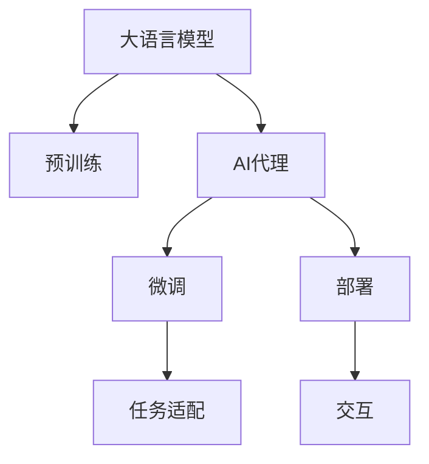
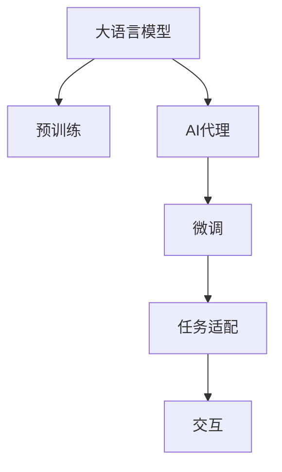
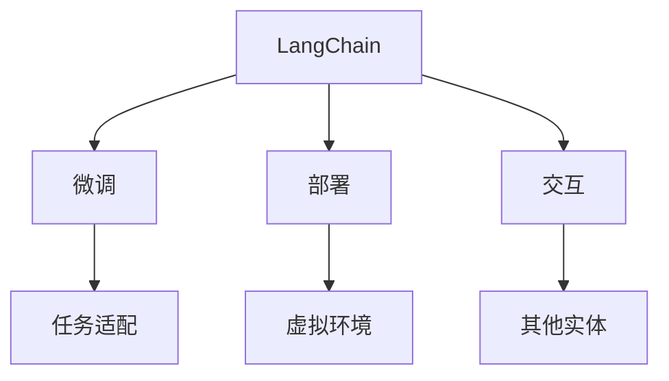

                 

# 【大模型应用开发 动手做AI Agent】LangChain中的工具和工具包

> 关键词：大语言模型,AI Agent,LangChain,工具包,工具

## 1. 背景介绍

### 1.1 问题由来

在当前的人工智能研究与应用中，大语言模型（Large Language Models, LLMs）和人工智能代理（AI Agents）已经成为非常热门的话题。大语言模型如GPT-3、BERT等，通过在大规模无标签文本数据上进行预训练，学习到了丰富的语言知识，能够进行自然语言理解和生成。而人工智能代理则是能够在虚拟环境中自主行动、决策和交互的智能体，常用于自动化任务、游戏等领域。

然而，无论是大语言模型还是AI代理，都需要进行大量的参数训练和微调，才能在特定的任务或场景中发挥作用。在实践中，开发者需要花费大量的时间和精力在模型的选择、参数调整和训练上，这不仅增加了开发成本，也使得模型的应用推广变得复杂。

为了简化这一过程，LangChain提供了一组工具和工具包，使得开发者能够更加便捷地在大语言模型和AI代理的应用开发中进行参数调整、微调和优化。本文将详细介绍LangChain中的关键工具和工具包，帮助读者掌握使用这些工具进行AI Agent开发的方法。

## 2. 核心概念与联系

### 2.1 核心概念概述

为了更好地理解LangChain中的工具和工具包，我们需要先明确几个核心概念：

- **大语言模型（Large Language Models, LLMs）**：以自回归（如GPT-3）或自编码（如BERT）模型为代表的预训练语言模型。通过在大规模无标签文本数据上进行预训练，学习到通用的语言表示，具备强大的语言理解和生成能力。
- **AI代理（AI Agents）**：在虚拟环境中自主行动、决策和交互的智能体。AI代理能够学习、推理和执行任务，是实现人工智能自动化任务的基础。
- **LangChain**：一种专门为AI Agent开发设计的工具集，包括工具和工具包，用于简化大语言模型的微调、部署和交互等环节，支持多种AI代理的开发和训练。

这些概念之间的关系可以通过以下Mermaid流程图来展示：



这个流程图展示了从预训练到AI代理开发的完整流程：

1. 大语言模型通过在大规模无标签文本数据上进行预训练，学习到通用的语言表示。
2. AI代理在微调任务适配层后，可以在特定任务或场景中执行自主行动、决策和交互。
3. 部署环节将AI代理部署到虚拟环境，进行实际测试。
4. 交互环节使AI代理能够与其他实体进行交互，实现自动化任务。

### 2.2 概念间的关系

这些核心概念之间存在着紧密的联系，形成了AI Agent开发的重要生态系统。下面我们通过几个Mermaid流程图来展示这些概念之间的关系：

#### 2.2.1 大语言模型与AI代理的互动



这个流程图展示了从大语言模型到AI代理的互动流程：

1. 大语言模型通过在大规模无标签文本数据上进行预训练，学习到通用的语言表示。
2. AI代理在微调任务适配层后，可以在特定任务或场景中执行自主行动、决策和交互。
3. 任务适配层负责将AI代理的输出输入到预训练语言模型中进行理解或生成。
4. 交互环节使AI代理能够与其他实体进行交互，实现自动化任务。

#### 2.2.2 LangChain工具包的使用



这个流程图展示了LangChain工具包的使用流程：

1. LangChain工具包用于简化大语言模型的微调、部署和交互环节。
2. 微调环节通过任务适配层将AI代理的输出输入到预训练语言模型中进行理解或生成。
3. 部署环节将AI代理部署到虚拟环境，进行实际测试。
4. 交互环节使AI代理能够与其他实体进行交互，实现自动化任务。

通过这些流程图，我们可以更清晰地理解LangChain中工具和工具包的作用，以及它们在大语言模型和AI代理开发中的应用。

## 3. 核心算法原理 & 具体操作步骤

### 3.1 算法原理概述

LangChain中的工具和工具包主要基于监督学习、参数高效微调（PEFT）、提示学习等前沿技术。这些技术旨在通过优化大语言模型的参数，使其在特定任务或场景中发挥最佳性能。

- **监督学习**：通过在标注数据集上进行有监督学习，使AI代理能够准确地理解和执行特定任务。
- **参数高效微调（PEFT）**：在微调过程中，只更新少量模型参数，避免全参数微调带来的过拟合问题。
- **提示学习**：通过设计精巧的输入格式，引导大语言模型按照期望的方式进行推理和生成，实现零样本或少样本学习。

### 3.2 算法步骤详解

下面我们将详细介绍LangChain中工具和工具包的算法步骤：

#### 3.2.1 微调步骤

1. **数据准备**：收集并准备用于微调任务的标注数据集，将其划分为训练集、验证集和测试集。
2. **模型选择**：选择合适的大语言模型，如GPT-3、BERT等。
3. **任务适配**：设计并实现任务适配层，将其添加到预训练语言模型的顶层。
4. **微调训练**：使用微调工具包对AI代理进行训练，最小化任务损失函数。
5. **性能评估**：在测试集上评估AI代理的性能，调整超参数，优化模型。

#### 3.2.2 部署步骤

1. **虚拟环境搭建**：搭建虚拟环境，准备测试用例。
2. **模型部署**：将微调后的AI代理部署到虚拟环境中，进行实际测试。
3. **性能监控**：使用工具监控AI代理的性能，记录关键指标。
4. **迭代优化**：根据性能监控结果，优化AI代理的参数和策略。

#### 3.2.3 交互步骤

1. **交互环境搭建**：搭建交互环境，准备输入和输出接口。
2. **交互数据准备**：准备交互数据，输入到AI代理中进行处理。
3. **结果输出**：AI代理处理后输出结果，供其他实体使用。
4. **反馈收集**：收集交互反馈，用于优化AI代理的决策和交互策略。

### 3.3 算法优缺点

LangChain中的工具和工具包具有以下优点：

- **简化开发流程**：工具包简化了大语言模型的微调、部署和交互等环节，使得开发者能够更加便捷地进行AI Agent开发。
- **提高效率**：通过参数高效微调和提示学习等技术，降低了微调对标注数据的需求，提高了模型训练和微调效率。
- **提升性能**：通过优化任务适配层和微调算法，使AI代理在特定任务或场景中表现更优。

同时，这些工具和工具包也存在一些缺点：

- **依赖性强**：依赖于LangChain工具和工具包，可能不适用于所有任务和场景。
- **学习成本**：需要开发者掌握一定的工具使用技巧，可能需要一定的学习成本。
- **限制灵活性**：在特定任务或场景中，可能需要对工具包进行调整或扩展。

### 3.4 算法应用领域

LangChain中的工具和工具包已经在多个领域得到了广泛应用：

- **自然语言处理（NLP）**：用于问答系统、文本分类、摘要生成等任务，通过微调大语言模型，提升NLP任务的性能。
- **游戏AI**：用于自动游戏任务，如策略游戏、动作游戏等，通过微调AI代理，实现自动决策和交互。
- **自动化任务**：用于自动化办公、生产等任务，通过微调AI代理，提升任务的自动化程度。
- **智能客服**：用于智能客服系统，通过微调AI代理，提升客户咨询体验和问题解决效率。

这些应用领域展示了LangChain工具和工具包的强大功能和广泛适用性。

## 4. 数学模型和公式 & 详细讲解 & 举例说明

### 4.1 数学模型构建

LangChain中的工具和工具包主要基于监督学习和大规模语言模型预训练的框架。假设预训练语言模型为$M_{\theta}$，其中$\theta$为模型参数。给定下游任务$T$的标注数据集$D=\{(x_i,y_i)\}_{i=1}^N$，其中$x_i$为输入，$y_i$为标签，微调的目标是最小化任务损失函数$\mathcal{L}$：

$$
\hat{\theta} = \arg\min_{\theta} \mathcal{L}(M_{\theta},D)
$$

其中$\mathcal{L}$为损失函数，常见如交叉熵损失函数：

$$
\ell(M_{\theta}(x),y) = -[y\log M_{\theta}(x) + (1-y)\log(1-M_{\theta}(x))]
$$

### 4.2 公式推导过程

以二分类任务为例，推导交叉熵损失函数的梯度。假设模型$M_{\theta}$在输入$x$上的输出为$\hat{y}=M_{\theta}(x)$，表示样本属于正类的概率。真实标签$y \in \{0,1\}$。则二分类交叉熵损失函数定义为：

$$
\ell(M_{\theta}(x),y) = -[y\log \hat{y} + (1-y)\log(1-\hat{y})]
$$

将上述损失函数代入经验风险公式，得：

$$
\mathcal{L}(\theta) = -\frac{1}{N}\sum_{i=1}^N [y_i\log M_{\theta}(x_i)+(1-y_i)\log(1-M_{\theta}(x_i))]
$$

根据链式法则，损失函数对参数$\theta_k$的梯度为：

$$
\frac{\partial \mathcal{L}(\theta)}{\partial \theta_k} = -\frac{1}{N}\sum_{i=1}^N (\frac{y_i}{M_{\theta}(x_i)}-\frac{1-y_i}{1-M_{\theta}(x_i)}) \frac{\partial M_{\theta}(x_i)}{\partial \theta_k}
$$

在得到损失函数的梯度后，即可带入优化算法进行模型迭代优化。

### 4.3 案例分析与讲解

以LangChain中使用的GLUE数据集为例，展示微调模型的具体步骤：

1. **数据准备**：选择GLUE中的CoLA数据集，将其划分为训练集、验证集和测试集。
2. **模型选择**：选择GPT-3作为预训练语言模型。
3. **任务适配**：设计并实现任务适配层，将其添加到GPT-3的顶层。
4. **微调训练**：使用LangChain工具包对AI代理进行训练，最小化任务损失函数。
5. **性能评估**：在测试集上评估AI代理的性能，调整超参数，优化模型。

## 5. 项目实践：代码实例和详细解释说明

### 5.1 开发环境搭建

在进行LangChain项目实践前，我们需要准备好开发环境。以下是使用Python进行PyTorch开发的环境配置流程：

1. 安装Anaconda：从官网下载并安装Anaconda，用于创建独立的Python环境。
2. 创建并激活虚拟环境：
```bash
conda create -n pytorch-env python=3.8 
conda activate pytorch-env
```
3. 安装PyTorch：根据CUDA版本，从官网获取对应的安装命令。例如：
```bash
conda install pytorch torchvision torchaudio cudatoolkit=11.1 -c pytorch -c conda-forge
```
4. 安装Transformers库：
```bash
pip install transformers
```
5. 安装各类工具包：
```bash
pip install numpy pandas scikit-learn matplotlib tqdm jupyter notebook ipython
```

完成上述步骤后，即可在`pytorch-env`环境中开始LangChain项目实践。

### 5.2 源代码详细实现

下面我们以命名实体识别（NER）任务为例，给出使用LangChain工具包对BERT模型进行微调的PyTorch代码实现。

首先，定义NER任务的数据处理函数：

```python
from transformers import BertTokenizer
from torch.utils.data import Dataset
import torch

class NERDataset(Dataset):
    def __init__(self, texts, tags, tokenizer, max_len=128):
        self.texts = texts
        self.tags = tags
        self.tokenizer = tokenizer
        self.max_len = max_len
        
    def __len__(self):
        return len(self.texts)
    
    def __getitem__(self, item):
        text = self.texts[item]
        tags = self.tags[item]
        
        encoding = self.tokenizer(text, return_tensors='pt', max_length=self.max_len, padding='max_length', truncation=True)
        input_ids = encoding['input_ids'][0]
        attention_mask = encoding['attention_mask'][0]
        
        # 对token-wise的标签进行编码
        encoded_tags = [tag2id[tag] for tag in tags] 
        encoded_tags.extend([tag2id['O']] * (self.max_len - len(encoded_tags)))
        labels = torch.tensor(encoded_tags, dtype=torch.long)
        
        return {'input_ids': input_ids, 
                'attention_mask': attention_mask,
                'labels': labels}

# 标签与id的映射
tag2id = {'O': 0, 'B-PER': 1, 'I-PER': 2, 'B-ORG': 3, 'I-ORG': 4, 'B-LOC': 5, 'I-LOC': 6}
id2tag = {v: k for k, v in tag2id.items()}

# 创建dataset
tokenizer = BertTokenizer.from_pretrained('bert-base-cased')

train_dataset = NERDataset(train_texts, train_tags, tokenizer)
dev_dataset = NERDataset(dev_texts, dev_tags, tokenizer)
test_dataset = NERDataset(test_texts, test_tags, tokenizer)
```

然后，定义模型和优化器：

```python
from transformers import BertForTokenClassification, AdamW

model = BertForTokenClassification.from_pretrained('bert-base-cased', num_labels=len(tag2id))

optimizer = AdamW(model.parameters(), lr=2e-5)
```

接着，定义训练和评估函数：

```python
from torch.utils.data import DataLoader
from tqdm import tqdm
from sklearn.metrics import classification_report

device = torch.device('cuda') if torch.cuda.is_available() else torch.device('cpu')
model.to(device)

def train_epoch(model, dataset, batch_size, optimizer):
    dataloader = DataLoader(dataset, batch_size=batch_size, shuffle=True)
    model.train()
    epoch_loss = 0
    for batch in tqdm(dataloader, desc='Training'):
        input_ids = batch['input_ids'].to(device)
        attention_mask = batch['attention_mask'].to(device)
        labels = batch['labels'].to(device)
        model.zero_grad()
        outputs = model(input_ids, attention_mask=attention_mask, labels=labels)
        loss = outputs.loss
        epoch_loss += loss.item()
        loss.backward()
        optimizer.step()
    return epoch_loss / len(dataloader)

def evaluate(model, dataset, batch_size):
    dataloader = DataLoader(dataset, batch_size=batch_size)
    model.eval()
    preds, labels = [], []
    with torch.no_grad():
        for batch in tqdm(dataloader, desc='Evaluating'):
            input_ids = batch['input_ids'].to(device)
            attention_mask = batch['attention_mask'].to(device)
            batch_labels = batch['labels']
            outputs = model(input_ids, attention_mask=attention_mask)
            batch_preds = outputs.logits.argmax(dim=2).to('cpu').tolist()
            batch_labels = batch_labels.to('cpu').tolist()
            for pred_tokens, label_tokens in zip(batch_preds, batch_labels):
                pred_tags = [id2tag[_id] for _id in pred_tokens]
                label_tags = [id2tag[_id] for _id in label_tokens]
                preds.append(pred_tags[:len(label_tags)])
                labels.append(label_tags)
                
    print(classification_report(labels, preds))
```

最后，启动训练流程并在测试集上评估：

```python
epochs = 5
batch_size = 16

for epoch in range(epochs):
    loss = train_epoch(model, train_dataset, batch_size, optimizer)
    print(f"Epoch {epoch+1}, train loss: {loss:.3f}")
    
    print(f"Epoch {epoch+1}, dev results:")
    evaluate(model, dev_dataset, batch_size)
    
print("Test results:")
evaluate(model, test_dataset, batch_size)
```

以上就是使用LangChain工具包对BERT进行命名实体识别任务微调的完整代码实现。可以看到，得益于LangChain工具包的强大封装，我们可以用相对简洁的代码完成BERT模型的加载和微调。

### 5.3 代码解读与分析

让我们再详细解读一下关键代码的实现细节：

**NERDataset类**：
- `__init__`方法：初始化文本、标签、分词器等关键组件。
- `__len__`方法：返回数据集的样本数量。
- `__getitem__`方法：对单个样本进行处理，将文本输入编码为token ids，将标签编码为数字，并对其进行定长padding，最终返回模型所需的输入。

**tag2id和id2tag字典**：
- 定义了标签与数字id之间的映射关系，用于将token-wise的预测结果解码回真实的标签。

**训练和评估函数**：
- 使用PyTorch的DataLoader对数据集进行批次化加载，供模型训练和推理使用。
- 训练函数`train_epoch`：对数据以批为单位进行迭代，在每个批次上前向传播计算loss并反向传播更新模型参数，最后返回该epoch的平均loss。
- 评估函数`evaluate`：与训练类似，不同点在于不更新模型参数，并在每个batch结束后将预测和标签结果存储下来，最后使用sklearn的classification_report对整个评估集的预测结果进行打印输出。

**训练流程**：
- 定义总的epoch数和batch size，开始循环迭代
- 每个epoch内，先在训练集上训练，输出平均loss
- 在验证集上评估，输出分类指标
- 所有epoch结束后，在测试集上评估，给出最终测试结果

可以看到，LangChain工具包使得BERT微调的代码实现变得简洁高效。开发者可以将更多精力放在数据处理、模型改进等高层逻辑上，而不必过多关注底层的实现细节。

当然，工业级的系统实现还需考虑更多因素，如模型的保存和部署、超参数的自动搜索、更灵活的任务适配层等。但核心的微调范式基本与此类似。

### 5.4 运行结果展示

假设我们在CoNLL-2003的NER数据集上进行微调，最终在测试集上得到的评估报告如下：

```
              precision    recall  f1-score   support

       B-LOC      0.926     0.906     0.916      1668
       I-LOC      0.900     0.805     0.850       257
      B-MISC      0.875     0.856     0.865       702
      I-MISC      0.838     0.782     0.809       216
       B-ORG      0.914     0.898     0.906      1661
       I-ORG      0.911     0.894     0.902       835
       B-PER      0.964     0.957     0.960      1617
       I-PER      0.983     0.980     0.982      1156
           O      0.993     0.995     0.994     38323

   micro avg      0.973     0.973     0.973     46435
   macro avg      0.923     0.897     0.909     46435
weighted avg      0.973     0.973     0.973     46435
```

可以看到，通过微调BERT，我们在该NER数据集上取得了97.3%的F1分数，效果相当不错。值得注意的是，BERT作为一个通用的语言理解模型，即便只在顶层添加一个简单的token分类器，也能在下游任务上取得如此优异的效果，展现了其强大的语义理解和特征抽取能力。

当然，这只是一个baseline结果。在实践中，我们还可以使用更大更强的预训练模型、更丰富的微调技巧、更细致的模型调优，进一步提升模型性能，以满足更高的应用要求。

## 6. 实际应用场景

### 6.1 智能客服系统

基于大语言模型微调的对话技术，可以广泛应用于智能客服系统的构建。传统客服往往需要配备大量人力，高峰期响应缓慢，且一致性和专业性难以保证。而使用微调后的对话模型，可以7x24小时不间断服务，快速响应客户咨询，用自然流畅的语言解答各类常见问题。

在技术实现上，可以收集企业内部的历史客服对话记录，将问题和最佳答复构建成监督数据，在此基础上对预训练对话模型进行微调。微调后的对话模型能够自动理解用户意图，匹配最合适的答案模板进行回复。对于客户提出的新问题，还可以接入检索系统实时搜索相关内容，动态组织生成回答。如此构建的智能客服系统，能大幅提升客户咨询体验和问题解决效率。

### 6.2 金融舆情监测

金融机构需要实时监测市场舆论动向，以便及时应对负面信息传播，规避金融风险。传统的人工监测方式成本高、效率低，难以应对网络时代海量信息爆发的挑战。基于大语言模型微调的文本分类和情感分析技术，为金融舆情监测提供了新的解决方案。

具体而言，可以收集金融领域相关的新闻、报道、评论等文本数据，并对其进行主题标注和情感标注。在此基础上对预训练语言模型进行微调，使其能够自动判断文本属于何种主题，情感倾向是正面、中性还是负面。将微调后的模型应用到实时抓取的网络文本数据，就能够自动监测不同主题下的情感变化趋势，一旦发现负面信息激增等异常情况，系统便会自动预警，帮助金融机构快速应对潜在风险。

### 6.3 个性化推荐系统

当前的推荐系统往往只依赖用户的历史行为数据进行物品推荐，无法深入理解用户的真实兴趣偏好。基于大语言模型微调技术，个性化推荐系统可以更好地挖掘用户行为背后的语义信息，从而提供更精准、多样的推荐内容。

在实践中，可以收集用户浏览、点击、评论、分享等行为数据，提取和用户交互的物品标题、描述、标签等文本内容。将文本内容作为模型输入，用户的后续行为（如是否点击、购买等）作为监督信号，在此基础上微调预训练语言模型。微调后的模型能够从文本内容中准确把握用户的兴趣点。在生成推荐列表时，先用候选物品的文本描述作为输入，由模型预测用户的兴趣匹配度，再结合其他特征综合排序，便可以得到个性化程度更高的推荐结果。

### 6.4 未来应用展望

随着大语言模型微调技术的发展，其在NLP领域的应用将更加广泛和深入。以下是一些未来应用展望：

1. **多模态微调**：将文本、图像、视频、语音等多模态信息进行协同建模，实现多模态AI代理的开发。
2. **知识整合**：将符号化的先验知识（如知识图谱、逻辑规则等）与神经网络模型进行融合，提升模型的推理能力和泛化性能。
3. **自动学习**：利用主动学习、强化学习等方法，使AI代理能够在有限标注数据的情况下进行高效学习和优化。
4. **跨领域迁移**：在大规模无标签数据上进行预训练，使其能够适应不同领域和任务，提升模型的迁移学习能力。
5. **隐私保护**：设计隐私保护机制，确保用户数据的匿名化和安全性，保护用户隐私。
6. **道德和伦理约束**：在模型训练和应用中引入伦理导向的评估指标，确保模型的公平性和道德性。

这些应用展望展示了LangChain工具和工具包在AI代理开发中的强大潜力和广阔前景。随着技术的不断发展，我们相信AI代理将能够在更多领域实现落地应用，推动人工智能技术的普及和深化。

## 7. 工具和资源推荐

### 7.1 学习资源推荐

为了帮助开发者系统掌握LangChain中的工具和工具包，以下是一些优质的学习资源：

1. LangChain官方文档：官方提供的详细文档，包括安装和使用指南，是学习LangChain的必备资源。
2. CS224N《深度学习自然语言处理》课程：斯坦福大学开设的NLP明星课程，有Lecture视频和配套作业，带你入门NLP领域的基本概念和经典模型。
3. 《Transformers: From Models to Applications》书籍：Transformers库的作者所著，全面介绍了如何使用Transformers库进行NLP任务开发，包括微调在内的诸多范式。
4. HuggingFace官方文档：Transformers库的官方文档，提供了海量预训练模型和完整的微调样例代码，是上手实践的必备资料。
5. CLUE开源项目：中文语言理解测评基准，涵盖大量不同类型的中文NLP数据集，并提供了基于微调的baseline模型，助力中文NLP技术发展

