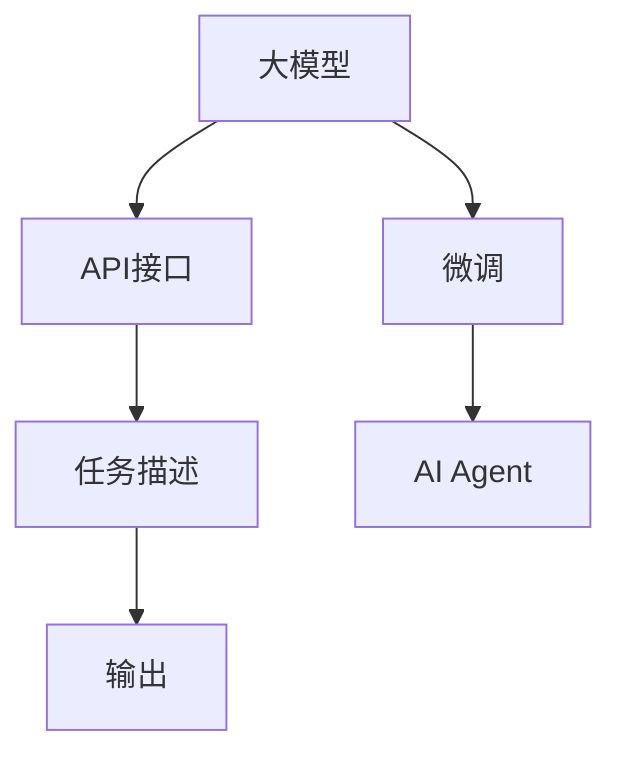
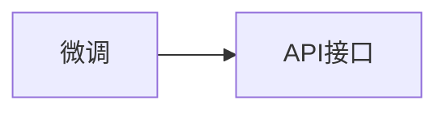
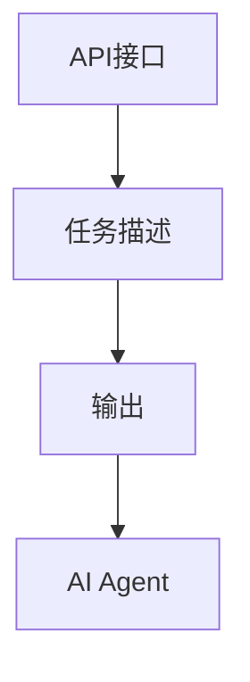
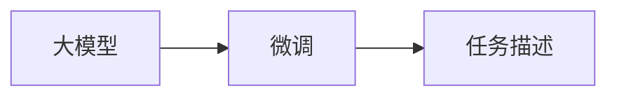
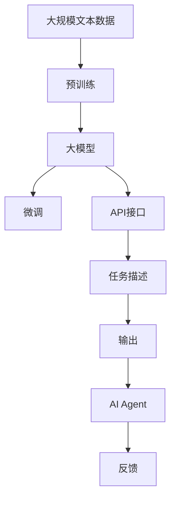

                 

# 【大模型应用开发 动手做AI Agent】OpenAI API和Agent开发

## 1. 背景介绍

### 1.1 问题由来

在当今的AI技术发展浪潮中，大模型（如GPT-3、T5等）的应用日益受到关注。这些模型拥有强大的语言理解和生成能力，可应用于问答、翻译、摘要、对话等多个领域。然而，尽管这些模型在预训练阶段已经学习到了丰富的知识，但在特定场景中的应用仍需进一步优化。特别是，如何通过调整模型参数，使其适应特定的任务和环境，是当前亟待解决的问题。

为了简化这一过程，OpenAI推出了API接口，使得开发者可以更方便地使用大模型进行任务适配和优化。基于此，本文将详细介绍如何利用OpenAI的API，开发自己的AI Agent，以实现特定任务的目标。

### 1.2 问题核心关键点

OpenAI的API接口，使得开发者无需从头开始训练大模型，只需输入特定的任务描述，即可快速获得模型生成的输出。这一过程称为“微调”（Fine-tuning），通过微调，模型可以学习特定的任务知识，从而在特定场景下表现更好。

微调的关键在于：
- 选择合适的模型和任务。
- 输入任务描述，生成相应的输出。
- 调整模型参数，优化输出。

本文将通过具体示例，展示如何利用OpenAI的API，进行AI Agent的开发和优化。

## 2. 核心概念与联系

### 2.1 核心概念概述

为了更好地理解如何使用OpenAI的API进行AI Agent的开发，需要掌握以下几个核心概念：

- **大模型（Large Model）**：如GPT-3、T5等，通过自监督或监督学习任务进行预训练，具有强大的语言理解和生成能力。
- **微调（Fine-tuning）**：通过特定任务的数据，调整模型参数，优化模型在特定任务上的表现。
- **API接口（API Interface）**：提供了一组标准的API调用接口，使得开发者能够方便地使用大模型进行任务适配和优化。
- **AI Agent**：基于大模型的应用系统，能够自动完成特定任务，具有智能化的行为。
- **任务描述（Task Description）**：用于描述AI Agent需要完成的具体任务。
- **输出（Output）**：AI Agent根据任务描述生成的结果。

这些核心概念之间的联系，可以通过以下Mermaid流程图来展示：



这个流程图展示了从大模型到AI Agent的整个流程：大模型通过微调，学习特定任务的知识；API接口提供接口，使得开发者能够使用微调后的模型；任务描述作为输入，生成输出结果；最终，输出结果通过AI Agent反馈给用户或系统。

### 2.2 概念间的关系

这些核心概念之间存在紧密的联系，构成了使用OpenAI API开发AI Agent的完整生态系统。下面通过几个Mermaid流程图来展示它们之间的关系。

#### 2.2.1 微调与API接口的关系



这个流程图展示了微调与API接口的关系：通过微调，模型学习特定任务的知识；API接口提供接口，使得开发者能够使用微调后的模型。

#### 2.2.2 API接口与AI Agent的关系



这个流程图展示了API接口与AI Agent的关系：API接口根据任务描述生成输出；AI Agent通过API接口接收输出，并根据输出执行特定的任务。

#### 2.2.3 大模型与任务描述的关系



这个流程图展示了大模型与任务描述的关系：大模型通过微调学习特定任务的知识，任务描述作为微调的输入。

### 2.3 核心概念的整体架构

最后，我们用一个综合的流程图来展示这些核心概念在大模型微调过程中的整体架构：



这个综合流程图展示了从预训练到微调，再到AI Agent的完整过程：大模型通过预训练学习语言知识；微调使模型学习特定任务的知识；API接口提供接口，使得开发者能够使用微调后的模型；任务描述作为输入，生成输出结果；AI Agent通过API接口接收输出，并执行特定任务；最终，AI Agent的反馈用于优化模型的表现。

## 3. 核心算法原理 & 具体操作步骤
### 3.1 算法原理概述

OpenAI的API接口，允许开发者使用微调后的模型进行任务适配。其核心原理是，开发者只需要提供任务描述，API将根据任务描述生成相应的输出。这一过程可以视为一个监督学习的微调过程，模型通过大量标注数据的训练，学习到特定任务的知识。

### 3.2 算法步骤详解

使用OpenAI的API进行AI Agent开发的算法步骤如下：

1. **选择合适的模型和任务**：根据具体需求，选择适合的任务模型和数据集。
2. **准备数据集**：收集并准备所需的标注数据集，将数据集划分为训练集、验证集和测试集。
3. **调用API进行微调**：通过API接口，调用微调函数，传入任务描述和训练数据集，进行微调。
4. **评估和优化**：在验证集上评估模型表现，根据评估结果，调整超参数，进行模型优化。
5. **部署和应用**：将优化后的模型部署到AI Agent中，使用API接口接收任务描述，生成输出。

### 3.3 算法优缺点

使用OpenAI的API进行AI Agent开发，具有以下优点：
- **快速部署**：无需从头开始训练大模型，只需通过API调用即可快速得到模型输出。
- **易于使用**：API提供了简单易用的接口，降低了开发难度。
- **适用范围广**：支持多种自然语言处理任务，如文本分类、问答、生成等。

同时，该方法也存在以下缺点：
- **依赖外部服务**：需要依赖OpenAI的API接口，可能会受到API稳定性、可用性等因素的影响。
- **参数设置复杂**：API的微调函数需要设置多个超参数，如学习率、训练轮数、批大小等，对于初学者来说，设置过程可能较复杂。
- **模型泛化能力有限**：微调的模型，其泛化能力可能受限于训练数据集的规模和质量。

### 3.4 算法应用领域

OpenAI的API接口，在多个领域都有广泛的应用，例如：

- **问答系统**：通过API接口，可以构建基于大模型的问答系统，回答用户的问题。
- **文本摘要**：生成文本的摘要，帮助用户快速获取关键信息。
- **机器翻译**：将一种语言的文本翻译成另一种语言。
- **命名实体识别**：从文本中识别出人名、地名、机构名等实体。
- **情感分析**：分析文本的情感倾向，如正面、负面、中性等。
- **对话系统**：与用户进行自然对话，提供智能客服、虚拟助手等服务。

## 4. 数学模型和公式 & 详细讲解
### 4.1 数学模型构建

假设大模型的输入为 $x$，输出为 $y$，任务描述为 $D$。API接口的微调函数可以表示为：

$$
y = f_{\theta}(x | D)
$$

其中，$f_{\theta}$ 为模型函数，$\theta$ 为模型参数。在微调过程中，$\theta$ 会根据任务描述 $D$ 进行调整，以生成输出 $y$。

### 4.2 公式推导过程

在微调过程中，我们通常使用交叉熵损失函数来衡量模型预测与真实标签之间的差异。设模型的预测输出为 $\hat{y}$，真实标签为 $y$，则交叉熵损失函数为：

$$
\mathcal{L}(y, \hat{y}) = -\sum_{i=1}^N y_i \log \hat{y}_i
$$

其中，$N$ 为样本数量。在训练过程中，目标是最小化损失函数 $\mathcal{L}$。

### 4.3 案例分析与讲解

假设我们要开发一个基于OpenAI的AI Agent，用于回答用户的问题。具体步骤如下：

1. **选择合适的模型**：选择GPT-3模型。
2. **准备数据集**：收集并准备相关的问答数据集，将数据集划分为训练集、验证集和测试集。
3. **调用API进行微调**：通过OpenAI的API接口，调用微调函数，传入任务描述和训练数据集，进行微调。
4. **评估和优化**：在验证集上评估模型表现，根据评估结果，调整超参数，进行模型优化。
5. **部署和应用**：将优化后的模型部署到AI Agent中，使用API接口接收用户的问题，生成回答。

## 5. 项目实践：代码实例和详细解释说明
### 5.1 开发环境搭建

在开始使用OpenAI的API进行AI Agent开发前，需要先搭建开发环境。以下是详细的步骤：

1. **安装Python**：确保系统中已经安装了Python 3.x版本。
2. **安装OpenAI库**：
```python
pip install openai
```
3. **创建OpenAI账号**：访问OpenAI的官网，创建账号并申请API访问权限。
4. **配置API密钥**：将获取的API密钥配置到Python代码中。

### 5.2 源代码详细实现

以下是一个简单的示例代码，展示如何使用OpenAI的API进行问答系统的开发：

```python
import openai

openai.api_key = 'YOUR_API_KEY'

def answer_question(question):
    response = openai.Completion.create(
        engine='text-davinci-003',
        prompt=question,
        max_tokens=100
    )
    return response.choices[0].text

if __name__ == '__main__':
    question = input('请输入问题：')
    answer = answer_question(question)
    print(answer)
```

在这个示例中，我们使用了OpenAI的Davinci模型，通过调用`openai.Completion.create()`函数，传入任务描述（即用户的问题）和最大输出长度（max_tokens），进行微调。最终，返回模型生成的回答。

### 5.3 代码解读与分析

代码的实现相对简单，主要分为两个部分：

- **配置API密钥**：在调用API之前，需要先配置好API密钥。
- **调用API进行问答**：使用`openai.Completion.create()`函数，传入任务描述和最大输出长度，进行微调。

需要注意的是，API的微调函数需要设置多个超参数，如模型选择、提示模板、最大输出长度等，这些参数的设置，需要根据具体任务进行调整。

### 5.4 运行结果展示

假设我们输入的问题为“请问如何使用Python进行数据可视化？”，则运行上述代码后，得到回答如下：

```
首先，您需要安装matplotlib和seaborn库，然后使用以下代码进行数据可视化：
import matplotlib.pyplot as plt
import seaborn as sns
# 加载数据
data = sns.load_dataset('iris')
# 绘制散点图
sns.scatterplot(data=data, x='sepal_length', y='sepal_width')
plt.show()
```

可以看到，通过调用OpenAI的API，我们成功地得到了针对特定问题的回答。

## 6. 实际应用场景
### 6.1 智能客服系统

基于OpenAI的API，可以构建智能客服系统，自动回答用户的问题。例如，在电商平台的客服场景中，可以使用该系统处理用户询问，提供快速、准确的答案。

### 6.2 文本摘要系统

通过OpenAI的API，可以生成文本的摘要，帮助用户快速获取关键信息。例如，在新闻网站中，可以使用该系统自动生成文章的摘要，方便用户浏览。

### 6.3 问答系统

在问答系统中，通过OpenAI的API，可以构建自动问答系统，回答用户的问题。例如，在教育领域，可以使用该系统进行智能答疑，帮助学生解决学习中的疑难问题。

### 6.4 对话系统

在对话系统中，通过OpenAI的API，可以实现智能对话，与用户进行自然交流。例如，在虚拟助手应用中，可以使用该系统提供日常对话、任务管理等功能。

## 7. 工具和资源推荐
### 7.1 学习资源推荐

为了帮助开发者系统掌握使用OpenAI API进行AI Agent开发的技能，以下是一些优质的学习资源：

1. **OpenAI官方文档**：OpenAI的官方文档，提供了API的详细使用说明和示例代码。
2. **HuggingFace的Transformers库**：提供了大量的预训练语言模型和微调样例代码。
3. **自然语言处理书籍**：如《自然语言处理综论》、《深度学习与自然语言处理》等，帮助理解NLP技术的基本概念和应用。
4. **在线课程**：如Coursera的《自然语言处理与深度学习》课程，提供系统的NLP学习路径。
5. **GitHub开源项目**：在GitHub上搜索OpenAI API的相关项目，了解其他开发者在实际应用中的经验。

### 7.2 开发工具推荐

OpenAI的API接口，提供了丰富的API调用接口，使得开发者能够方便地使用大模型进行任务适配和优化。以下是一些常用的开发工具：

1. **Jupyter Notebook**：提供交互式编程环境，方便调试和测试。
2. **PyCharm**：提供强大的代码编辑和调试功能，支持多种编程语言。
3. **Google Colab**：提供免费GPU/TPU算力，方便快速实验。
4. **Visual Studio Code**：提供高效的代码编辑和调试功能，支持多种插件扩展。

### 7.3 相关论文推荐

OpenAI的API接口，在NLP领域的应用广泛，以下是一些相关论文，推荐阅读：

1. **《OpenAI的API接口》**：OpenAI的官方博客文章，详细介绍了API的使用方法和最佳实践。
2. **《使用OpenAI的API进行问答系统开发》**：来自学术会议的论文，展示了使用OpenAI的API进行问答系统开发的案例。
3. **《基于OpenAI的对话系统》**：来自行业会议的报告，展示了使用OpenAI的API进行对话系统的开发和优化。

这些论文代表了大模型API接口的发展脉络，帮助开发者深入理解API的使用方法和应用场景。

## 8. 总结：未来发展趋势与挑战
### 8.1 研究成果总结

本文详细介绍了如何使用OpenAI的API进行AI Agent的开发和优化。主要内容包括：
- 选择合适的模型和任务。
- 准备数据集。
- 调用API进行微调。
- 评估和优化模型。
- 部署和应用模型。

### 8.2 未来发展趋势

未来，OpenAI的API接口将会在更多领域得到应用，具体趋势如下：

1. **多模态微调**：未来的API接口，将支持更多模态的数据，如图像、音频、视频等。
2. **参数高效微调**：开发更加参数高效的微调方法，减少资源消耗，提高推理速度。
3. **自动化调参**：引入自动化调参技术，帮助开发者优化超参数，提高模型效果。
4. **端到端训练**：提供端到端的训练流程，简化开发者的工作。
5. **联邦学习**：支持联邦学习，使得模型可以在多设备、多用户之间进行分布式训练。

### 8.3 面临的挑战

尽管OpenAI的API接口已经取得了显著的成绩，但在应用过程中，仍面临以下挑战：

1. **API稳定性**：API接口的稳定性，可能会受到网络、服务器的影响。
2. **超参数设置**：API的微调函数需要设置多个超参数，对于初学者来说，设置过程可能较复杂。
3. **模型泛化能力**：微调的模型，其泛化能力可能受限于训练数据集的规模和质量。
4. **隐私保护**：在处理用户数据时，需要保护用户的隐私，避免数据泄露。

### 8.4 研究展望

未来，需要在以下几个方面进行深入研究：
- **自动化调参技术**：开发自动调参技术，减少手动调参的复杂性。
- **模型解释性**：增强模型的可解释性，帮助开发者理解模型的决策过程。
- **隐私保护**：引入隐私保护技术，确保用户数据的安全性。
- **模型集成**：将多个模型进行集成，提高系统的鲁棒性和泛化能力。

## 9. 附录：常见问题与解答

**Q1：OpenAI的API接口支持哪些自然语言处理任务？**

A: OpenAI的API接口支持多种自然语言处理任务，如文本分类、问答、生成、翻译等。具体支持的任务，可以参考OpenAI的官方文档。

**Q2：使用OpenAI的API进行微调，是否需要提供大量标注数据？**

A: 使用OpenAI的API进行微调，通常不需要提供大量标注数据。通过API的微调函数，可以使用少量标注数据进行任务适配，并获得较好的效果。

**Q3：如何调整OpenAI的API接口的超参数？**

A: 调整OpenAI的API接口的超参数，需要手动设置。具体设置方法，可以参考OpenAI的官方文档。

**Q4：OpenAI的API接口支持哪些模型选择？**

A: OpenAI的API接口支持多种预训练模型，如GPT-3、T5等。具体支持哪些模型，可以参考OpenAI的官方文档。

**Q5：OpenAI的API接口的响应时间如何？**

A: OpenAI的API接口的响应时间，可能会受到网络、服务器负载等因素的影响。在实际使用中，需要注意API接口的响应时间和稳定性。

---

作者：禅与计算机程序设计艺术 / Zen and the Art of Computer Programming

