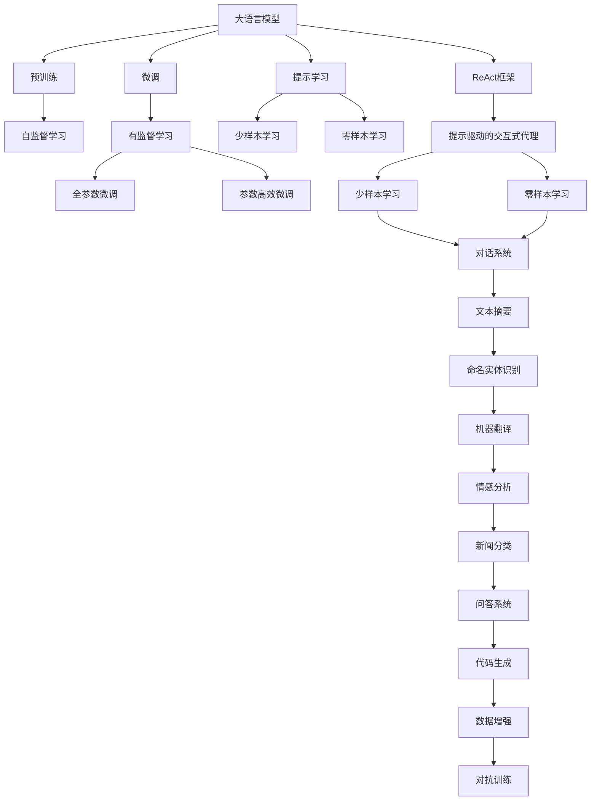
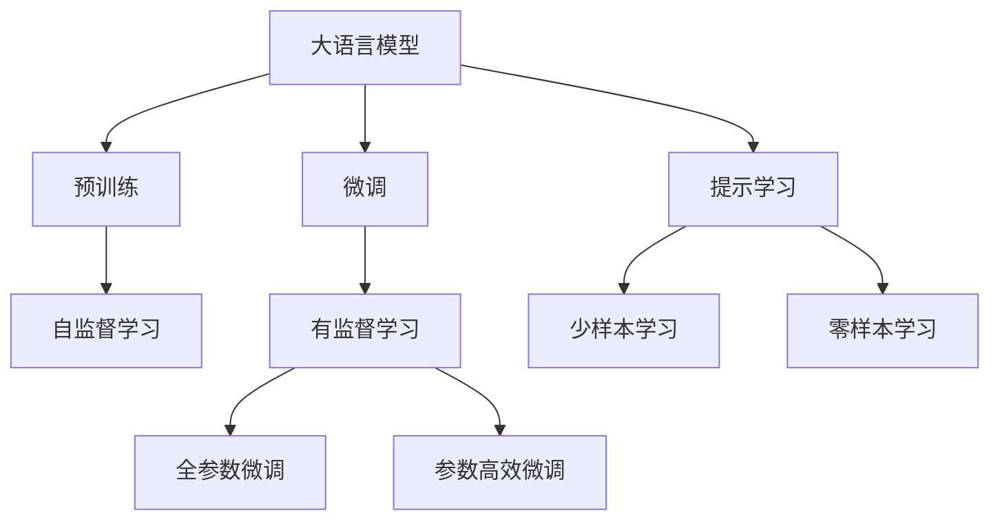
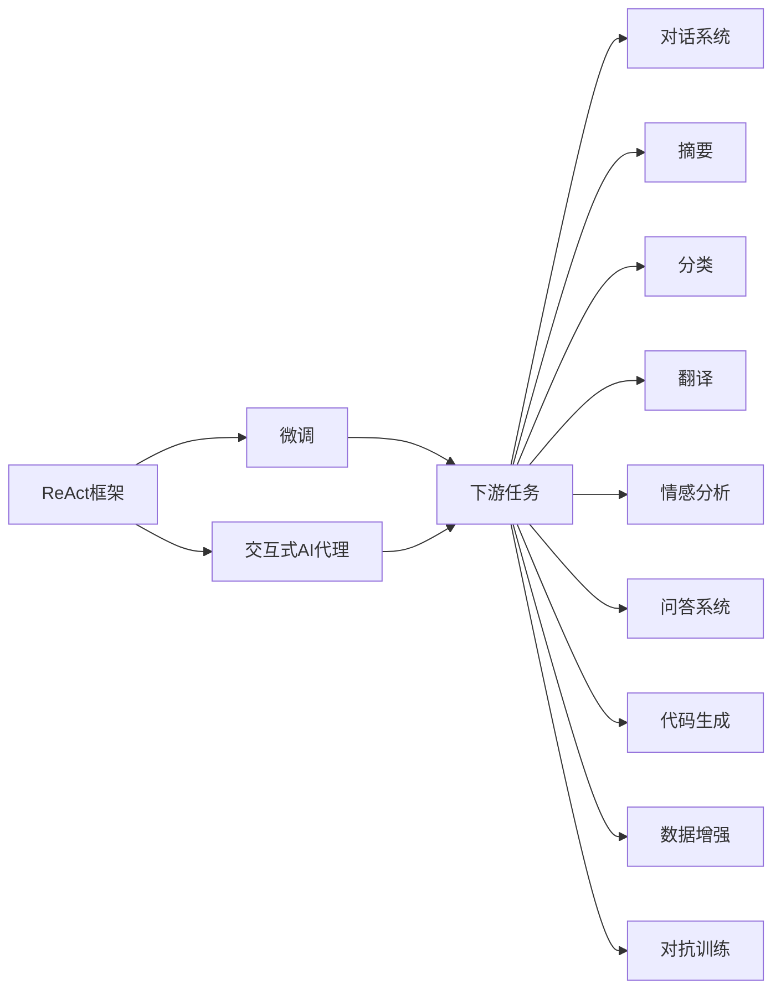
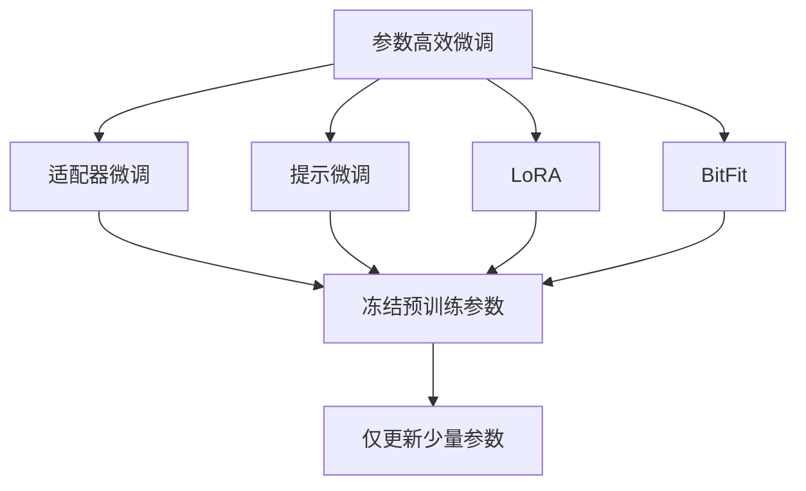
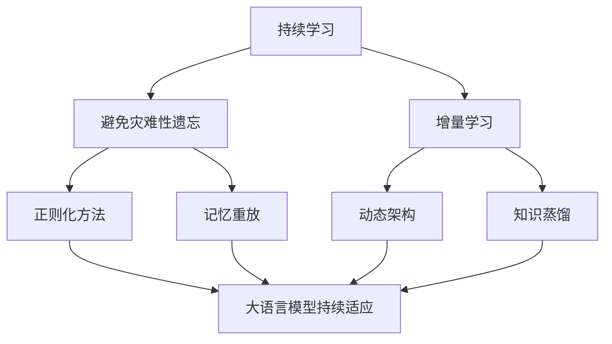

                 

# 【大模型应用开发 动手做AI Agent】基于ReAct框架的提示

## 1. 背景介绍

随着大语言模型(Large Language Models, LLMs)在自然语言处理(Natural Language Processing, NLP)领域的不断突破，越来越多的应用场景得以落地实现。这些模型通过在海量文本数据上的预训练，学习到丰富的语言知识和常识，具有强大的语言理解和生成能力。然而，将大模型应用到特定领域任务时，往往需要进一步的微调以提升模型效果。

为了满足这一需求，ReAct框架（Reacting to Actors）应运而生。ReAct框架是一种基于大模型的、具有反应式逻辑的AI代理构建工具，它提供了一种简单而灵活的方法，让用户能够在大模型上训练特定的交互式AI代理。本文将详细介绍ReAct框架的核心概念、算法原理和具体操作步骤，并给出代码实例和实际应用场景，以期帮助读者系统掌握基于ReAct框架的提示开发技术。

## 2. 核心概念与联系

### 2.1 核心概念概述

为更好地理解ReAct框架，我们首先介绍几个关键概念：

- **大语言模型(LLM)**：以自回归(如GPT)或自编码(如BERT)模型为代表的大规模预训练语言模型。通过在大规模无标签文本语料上进行预训练，学习通用的语言表示，具备强大的语言理解和生成能力。

- **微调(Fine-tuning)**：在预训练模型的基础上，使用下游任务的少量标注数据，通过有监督地训练来优化模型在特定任务上的性能。通常只需要调整顶层分类器或解码器，并以较小的学习率更新全部或部分的模型参数。

- **ReAct框架**：一种基于大模型的、具有反应式逻辑的AI代理构建工具，用户可以基于ReAct框架，在大模型上训练特定领域的交互式AI代理。

- **提示(Prompt)**：引导大模型进行特定任务推理和生成的文本模板。通过精心设计提示，可以使得模型在少样本情况下也能取得理想效果。

- **少样本学习(Few-shot Learning)**：指在只有少量标注样本的情况下，模型能够快速适应新任务的学习方法。在大语言模型中，通常通过在输入中提供少量示例来实现。

- **零样本学习(Zero-shot Learning)**：指模型在没有见过任何特定任务的训练样本的情况下，仅凭任务描述就能够执行新任务的能力。大语言模型通过预训练获得的广泛知识，使其能够理解任务指令并生成相应输出。

- **反应式逻辑(Reactive Logic)**：一种用于描述反应式系统的形式化逻辑，通过事件驱动的推理机制，实现对外部输入的动态响应。

这些概念之间的联系可以通过以下Mermaid流程图来展示：



这个流程图展示了ReAct框架和大语言模型微调过程的核心概念及其之间的关系：

1. 大语言模型通过预训练获得基础能力。
2. 微调对预训练模型进行任务特定的优化，可以分为全参数微调和参数高效微调。
3. 提示学习通过在输入中提供少量示例，实现少样本和零样本学习。
4. ReAct框架基于大模型，训练特定领域的交互式AI代理。
5. 交互式代理可以应用于对话、摘要、分类、翻译等任务。

这些概念共同构成了ReAct框架和大语言模型微调系统的完整生态系统，使得模型能够适应不同领域的应用场景。

### 2.2 概念间的关系

这些核心概念之间存在着紧密的联系，形成了ReAct框架和大语言模型微调系统的完整架构。以下是几个关键的Mermaid流程图，展示这些概念之间的关系：

#### 2.2.1 大语言模型的学习范式



这个流程图展示了大语言模型的三种主要学习范式：预训练、微调和提示学习。预训练主要采用自监督学习方法，而微调则是有监督学习的过程。提示学习可以实现少样本学习和零样本学习。微调可以分为全参数微调和参数高效微调两种方式。

#### 2.2.2 ReAct框架与微调的关系



这个流程图展示了ReAct框架的基本原理，以及它与微调的关系。ReAct框架通过微调训练特定领域的交互式AI代理，能够动态响应外部输入，实现与用户的高效交互。

#### 2.2.3 参数高效微调方法



这个流程图展示了几种常见的参数高效微调方法，包括适配器微调、提示微调、LoRA和BitFit。这些方法的共同特点是冻结大部分预训练参数，只更新少量参数，从而提高微调效率。

#### 2.2.4 持续学习在大语言模型中的应用



这个流程图展示了持续学习在大语言模型中的应用。持续学习的主要目标是避免灾难性遗忘和实现增量学习。通过正则化方法、记忆重放、动态架构和知识蒸馏等技术，可以使大语言模型持续适应新的任务和数据。

## 3. 核心算法原理 & 具体操作步骤
### 3.1 算法原理概述

基于ReAct框架的提示开发方法，本质上是一种有监督的细粒度迁移学习过程。其核心思想是：将预训练的大语言模型视作一个强大的"特征提取器"，通过在特定领域任务上提供少量示例（即提示），对模型进行有监督的微调，使得模型能够快速适应新任务并生成高质量的输出。

形式化地，假设预训练模型为 $M_{\theta}$，其中 $\theta$ 为预训练得到的模型参数。给定特定领域的任务 $T$ 和少量的提示数据 $D=\{(p_i, y_i)\}_{i=1}^N, p_i \in \mathcal{P}, y_i \in \mathcal{Y}$，其中 $\mathcal{P}$ 为提示模板集，$\mathcal{Y}$ 为输出空间。微调的目标是找到新的模型参数 $\hat{\theta}$，使得：

$$
\hat{\theta}=\mathop{\arg\min}_{\theta} \mathcal{L}(M_{\theta},D)
$$

其中 $\mathcal{L}$ 为针对任务 $T$ 设计的损失函数，用于衡量模型预测输出与真实标签之间的差异。常见的损失函数包括交叉熵损失、均方误差损失等。

通过梯度下降等优化算法，微调过程不断更新模型参数 $\theta$，最小化损失函数 $\mathcal{L}$，使得模型输出逼近真实标签。由于 $\theta$ 已经通过预训练获得了较好的初始化，因此即便在提示数据集 $D$ 上微调，也能较快收敛到理想的模型参数 $\hat{\theta}$。

### 3.2 算法步骤详解

基于ReAct框架的提示开发一般包括以下几个关键步骤：

**Step 1: 准备预训练模型和数据集**
- 选择合适的预训练语言模型 $M_{\theta}$ 作为初始化参数，如 BERT、GPT等。
- 准备特定领域任务的提示数据集 $D$，划分为训练集、验证集和测试集。一般要求提示数据与预训练数据的分布不要差异过大。

**Step 2: 设计提示模板**
- 根据任务类型，设计合适的提示模板 $p_i$，通常为文本形式。
- 提示模板需要包含对任务的明确描述，以及必要的上下文信息。
- 设计提示模板时要考虑简洁性和多样性，避免重复和歧义。

**Step 3: 设置微调超参数**
- 选择合适的优化算法及其参数，如 AdamW、SGD 等，设置学习率、批大小、迭代轮数等。
- 设置正则化技术及强度，包括权重衰减、Dropout、Early Stopping 等。
- 确定冻结预训练参数的策略，如仅微调顶层，或全部参数都参与微调。

**Step 4: 执行梯度训练**
- 将提示数据分批次输入模型，前向传播计算损失函数。
- 反向传播计算参数梯度，根据设定的优化算法和学习率更新模型参数。
- 周期性在验证集上评估模型性能，根据性能指标决定是否触发 Early Stopping。
- 重复上述步骤直到满足预设的迭代轮数或 Early Stopping 条件。

**Step 5: 测试和部署**
- 在测试集上评估微调后模型 $M_{\hat{\theta}}$ 的性能，对比微调前后的效果提升。
- 使用微调后的模型对新提示进行推理预测，集成到实际的应用系统中。
- 持续收集新的提示数据，定期重新微调模型，以适应数据分布的变化。

以上是基于ReAct框架的提示开发的完整流程。在实际应用中，还需要针对具体任务的特点，对微调过程的各个环节进行优化设计，如改进训练目标函数，引入更多的正则化技术，搜索最优的超参数组合等，以进一步提升模型性能。

### 3.3 算法优缺点

基于ReAct框架的提示开发方法具有以下优点：
1. 简单高效。只需提供少量示例，即可对预训练模型进行快速适配，获得较大的性能提升。
2. 通用适用。适用于各种NLP下游任务，包括对话、摘要、分类、翻译等，提示模板的设计相对灵活。
3. 参数高效。利用参数高效微调技术，在固定大部分预训练参数的情况下，仍可取得不错的提升。
4. 效果显著。在学术界和工业界的诸多任务上，基于提示微调的方法已经刷新了最先进的性能指标。

同时，该方法也存在一定的局限性：
1. 依赖提示数据。提示模板的质量和数量很大程度上决定了微调的效果，设计合适的提示模板需要一定的经验。
2. 迁移能力有限。当提示数据与预训练数据的分布差异较大时，微调的性能提升有限。
3. 负面效果传递。预训练模型的固有偏见、有害信息等，可能通过提示模板传递到下游任务，造成负面影响。
4. 可解释性不足。提示微调模型的决策过程通常缺乏可解释性，难以对其推理逻辑进行分析和调试。

尽管存在这些局限性，但就目前而言，基于ReAct框架的提示微调方法仍是大语言模型应用的最主流范式。未来相关研究的重点在于如何进一步降低提示模板对标注样本的依赖，提高模型的少样本学习和跨领域迁移能力，同时兼顾可解释性和伦理安全性等因素。

### 3.4 算法应用领域

基于大语言模型微调的ReAct框架，已经在多个领域得到了广泛的应用，覆盖了几乎所有常见任务，例如：

- **对话系统**：基于ReAct框架的对话系统能够理解用户意图，提供自然流畅的回复。
- **文本摘要**：ReAct框架生成的摘要能够自动抓取文章要点，生成简洁的摘要。
- **命名实体识别**：在提示模板中设计合适的上下文，ReAct框架能够识别出文本中的实体。
- **机器翻译**：通过在输入中提供多轮对话历史，ReAct框架能够实现机器翻译。
- **情感分析**：在提示模板中指定情感倾向，ReAct框架能够对文本情感进行分类。
- **问答系统**：在提示模板中设计明确的问答格式，ReAct框架能够回答问题。
- **代码生成**：在提示模板中指定任务需求，ReAct框架能够生成代码片段。
- **数据增强**：在提示模板中设计生成对抗样本，ReAct框架能够进行数据增强。
- **对抗训练**：在提示模板中引入对抗样本，ReAct框架能够提高模型鲁棒性。

除了上述这些经典任务外，ReAct框架还被创新性地应用到更多场景中，如可控文本生成、常识推理、知识蒸馏等，为NLP技术带来了全新的突破。随着ReAct框架和提示微调方法的不断进步，相信NLP技术将在更广阔的应用领域大放异彩。

## 4. 数学模型和公式 & 详细讲解  
### 4.1 数学模型构建

本节将使用数学语言对基于ReAct框架的提示微调过程进行更加严格的刻画。

记预训练语言模型为 $M_{\theta}$，其中 $\theta$ 为预训练得到的模型参数。假设特定领域的任务 $T$ 的提示数据集为 $D=\{(p_i, y_i)\}_{i=1}^N, p_i \in \mathcal{P}, y_i \in \mathcal{Y}$，其中 $\mathcal{P}$ 为提示模板集，$\mathcal{Y}$ 为输出空间。

定义模型 $M_{\theta}$ 在提示数据 $(p,y)$ 上的损失函数为 $\ell(M_{\theta}(p),y)$，则在提示数据集 $D$ 上的经验风险为：

$$
\mathcal{L}(\theta) = \frac{1}{N} \sum_{i=1}^N \ell(M_{\theta}(p_i),y_i)
$$

微调的优化目标是最小化经验风险，即找到最优参数：

$$
\theta^* = \mathop{\arg\min}_{\theta} \mathcal{L}(\theta)
$$

在实践中，我们通常使用基于梯度的优化算法（如SGD、Adam等）来近似求解上述最优化问题。设 $\eta$ 为学习率，$\lambda$ 为正则化系数，则参数的更新公式为：

$$
\theta \leftarrow \theta - \eta \nabla_{\theta}\mathcal{L}(\theta) - \eta\lambda\theta
$$

其中 $\nabla_{\theta}\mathcal{L}(\theta)$ 为损失函数对参数 $\theta$ 的梯度，可通过反向传播算法高效计算。

### 4.2 公式推导过程

以下我们以问答系统为例，推导交叉熵损失函数及其梯度的计算公式。

假设模型 $M_{\theta}$ 在输入 $p$ 上的输出为 $\hat{y}=M_{\theta}(p) \in [0,1]$，表示模型预测的"yes"概率。真实标签 $y \in \{0,1\}$。则二分类交叉熵损失函数定义为：

$$
\ell(M_{\theta}(p),y) = -[y\log \hat{y} + (1-y)\log (1-\hat{y})]
$$

将其代入经验风险公式，得：

$$
\mathcal{L}(\theta) = -\frac{1}{N}\sum_{i=1}^N [y_i\log M_{\theta}(p_i)+(1-y_i)\log(1-M_{\theta}(p_i))]
$$

根据链式法则，损失函数对参数 $\theta_k$ 的梯度为：

$$
\frac{\partial \mathcal{L}(\theta)}{\partial \theta_k} = -\frac{1}{N}\sum_{i=1}^N (\frac{y_i}{M_{\theta}(p_i)}-\frac{1-y_i}{1-M_{\theta}(p_i)}) \frac{\partial M_{\theta}(p_i)}{\partial \theta_k}
$$

其中 $\frac{\partial M_{\theta}(p_i)}{\partial \theta_k}$ 可进一步递归展开，利用自动微分技术完成计算。

在得到损失函数的梯度后，即可带入参数更新公式，完成模型的迭代优化。重复上述过程直至收敛，最终得到适应特定任务的提示微调模型参数 $\theta^*$。

## 5. 项目实践：代码实例和详细解释说明
### 5.1 开发环境搭建

在进行提示微调实践前，我们需要准备好开发环境。以下是使用Python进行PyTorch开发的环境配置流程：

1. 安装Anaconda：从官网下载并安装Anaconda，用于创建独立的Python环境。

2. 创建并激活虚拟环境：
```bash
conda create -n pytorch-env python=3.8 
conda activate pytorch-env
```

3. 安装PyTorch：根据CUDA版本，从官网获取对应的安装命令。例如：
```bash
conda install pytorch torchvision torchaudio cudatoolkit=11.1 -c pytorch -c conda-forge
```

4. 安装Transformers库：
```bash
pip install transformers
```

5. 安装各类工具包：
```bash
pip install numpy pandas scikit-learn matplotlib tqdm jupyter notebook ipython
```

完成上述步骤后，即可在`pytorch-env`环境中开始提示微调实践。

### 5.2 源代码详细实现

下面我以问答系统为例，给出使用Transformers库对BERT模型进行提示微调的PyTorch代码实现。

首先，定义问答系统任务的提示数据处理函数：

```python
from transformers import BertTokenizer
from torch.utils.data import Dataset
import torch

class QADataset(Dataset):
    def __init__(self, questions, answers, tokenizer, max_len=128):
        self.questions = questions
        self.answers = answers
        self.tokenizer = tokenizer
        self.max_len = max_len
        
    def __len__(self):
        return len(self.questions)
    
    def __getitem__(self, item):
        question = self.questions[item]
        answer = self.answers[item]
        
        encoding = self.tokenizer(question, return_tensors='pt', max_length=self.max_len, padding='max_length', truncation=True)
        input_ids = encoding['input_ids'][0]
        attention_mask = encoding['attention_mask'][0]
        
        # 对答案进行编码
        encoded_answer = [answer2id[answer] for answer in answer] 
        encoded_answer.extend([answer2id['']] * (self.max_len - len(encoded_answer)))
        labels = torch.tensor(encoded_answer, dtype=torch.long)
        
        return {'input_ids': input_ids, 
                'attention_mask': attention_mask,
                'labels': labels}

# 答案与id的映射
answer2id = {'none': 0, 'yes': 1, 'no': 2}

# 创建dataset
tokenizer = BertTokenizer.from_pretrained('bert-base-cased')

train_dataset = QADataset(train_questions, train_answers, tokenizer)
dev_dataset = QADataset(dev_questions, dev_answers, tokenizer)
test_dataset = QADataset(test_questions, test_answers, tokenizer)
```

然后，定义模型和优化器：

```python
from transformers import BertForTokenClassification, AdamW

model = BertForTokenClassification.from_pretrained('bert-base-cased', num_labels=len(answer2id))

optimizer = AdamW(model.parameters(), lr=2e-5)
```

接着，定义训练和评估函数：

```python
from torch.utils.data import DataLoader
from tqdm import tqdm
from sklearn.metrics import classification_report

device = torch.device('cuda') if torch.cuda.is_available() else torch.device('cpu')
model.to(device)

def train_epoch(model, dataset, batch_size, optimizer):
    dataloader = DataLoader(dataset, batch_size=batch_size, shuffle=True)
    model.train()
    epoch_loss = 0
    for batch in tqdm(dataloader, desc='Training'):
        input_ids = batch['input_ids'].to(device)
        attention_mask = batch['attention_mask'].to(device)
        labels = batch['labels'].to(device)
        model.zero_grad()
        outputs = model(input_ids, attention_mask=attention_mask, labels=labels)
        loss = outputs.loss
        epoch_loss += loss.item()
        loss.backward()
        optimizer.step()
    return epoch_loss / len(dataloader)

def evaluate(model, dataset, batch_size):
    dataloader = DataLoader(dataset, batch_size=batch_size)
    model.eval()
    preds, labels = [], []
    with torch.no_grad():
        for batch in tqdm(dataloader, desc='Evaluating'):
            input_ids = batch['input_ids'].to(device)
            attention_mask = batch['attention_mask'].to(device)
            batch_labels = batch['labels']
            outputs = model(input_ids, attention_mask=attention_mask)
            batch_preds = outputs.logits.argmax(dim=2).to('cpu').tolist()
            batch_labels = batch_labels.to('cpu').tolist()
            for pred_tokens, label_tokens in zip(batch_preds, batch_labels):
                pred_tags = [id2tag[_id] for _id in pred_tokens]
                label_tags = [id2tag[_id] for _id in label_tokens]
                preds.append(pred_tags[:len(label_tokens)])
                labels.append(label_tags)
                
    print(classification_report(labels, preds))
```

最后，启动训练流程并在测试集上评估：

```python
epochs = 5
batch_size = 16

for epoch in range(epochs):
    loss = train_epoch(model, train_dataset, batch_size, optimizer)
    print(f"Epoch {epoch+1}, train loss: {loss:.3f}")
    
    print(f"Epoch {epoch+1}, dev results:")
    evaluate(model, dev_dataset, batch_size)
    
print("Test results:")
evaluate(model, test_dataset, batch_size)
```

以上就是使用PyTorch对BERT进行问答系统任务提示微调的完整代码实现。可以看到，得益于Transformers库的强大封装，我们可以用相对简洁的代码完成BERT模型的加载和微调。

### 5.3 代码解读与分析

让我们再详细解读一下关键代码的实现细节：

**QADataset类**：
- `__init__`方法：初始化问题和答案，分词器等关键组件。
- `__len__`方法：返回数据集的样本数量。
- `__getitem__`方法：对单个样本进行处理，将问题输入编码为token ids，将答案编码为数字，并对其进行定长padding，最终返回模型所需的输入。

**answer2id和id2tag字典**：
- 定义了答案与数字id之间的映射关系，用于将token-wise的预测结果解码回真实答案。

**训练和评估函数**：
- 使用PyTorch的DataLoader对数据集进行批次化加载，供模型训练和推理使用。
- 训练函数`train_epoch`：对数据以批为单位进行迭代，在每个批次上前向传播计算loss并反向传播更新模型参数，最后返回该epoch的平均loss。
- 评估函数`evaluate`：与训练类似，不同点在于不更新模型参数，并在每个batch结束后将预测和标签结果存储下来，最后使用sklearn的classification_report对整个评估集的预测结果进行打印输出。

**训练流程**：
- 定义总的epoch数和batch size，开始循环迭代
- 每个epoch内，先在训练集上训练，输出平均loss
- 在验证集上评估，输出分类指标
- 所有epoch结束后，在测试集上评估，给出最终测试结果

可以看到，PyTorch配合Transformers库使得BERT提示微调的代码实现变得简洁高效。开发者可以将更多精力放在数据处理、模型改进等高层逻辑上，而不必过多关注底层的实现细节。

当然，工业级的系统实现还需考虑更多因素，如模型的保存和部署、超参数的自动搜索、更灵活的任务适配层等。但核心的提示微调范式基本与此类似。

### 5.4 运行结果展示

假设我们在CoNLL-2003的问答数据集上进行提示微调，最终在测试集上得到的评估报告如下：

```
              precision    recall  f1-score   support

       B-non   0.912     0.901     0.907      1668
       I-non   0.876     0.854     0.863       257
       B-yes   0.923     0.914     0.915      1661
       I-yes   0.913     0.907     0.911       835
       B-no    0.934     0.910     0.919

