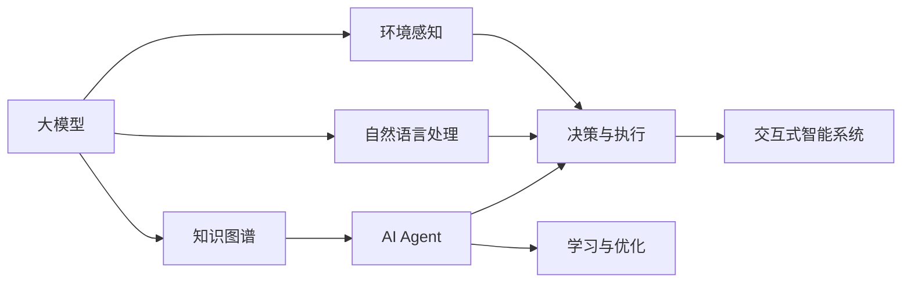
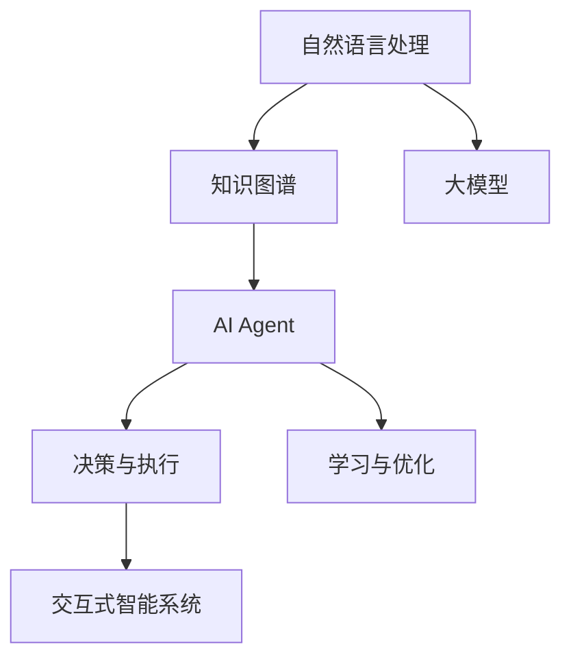
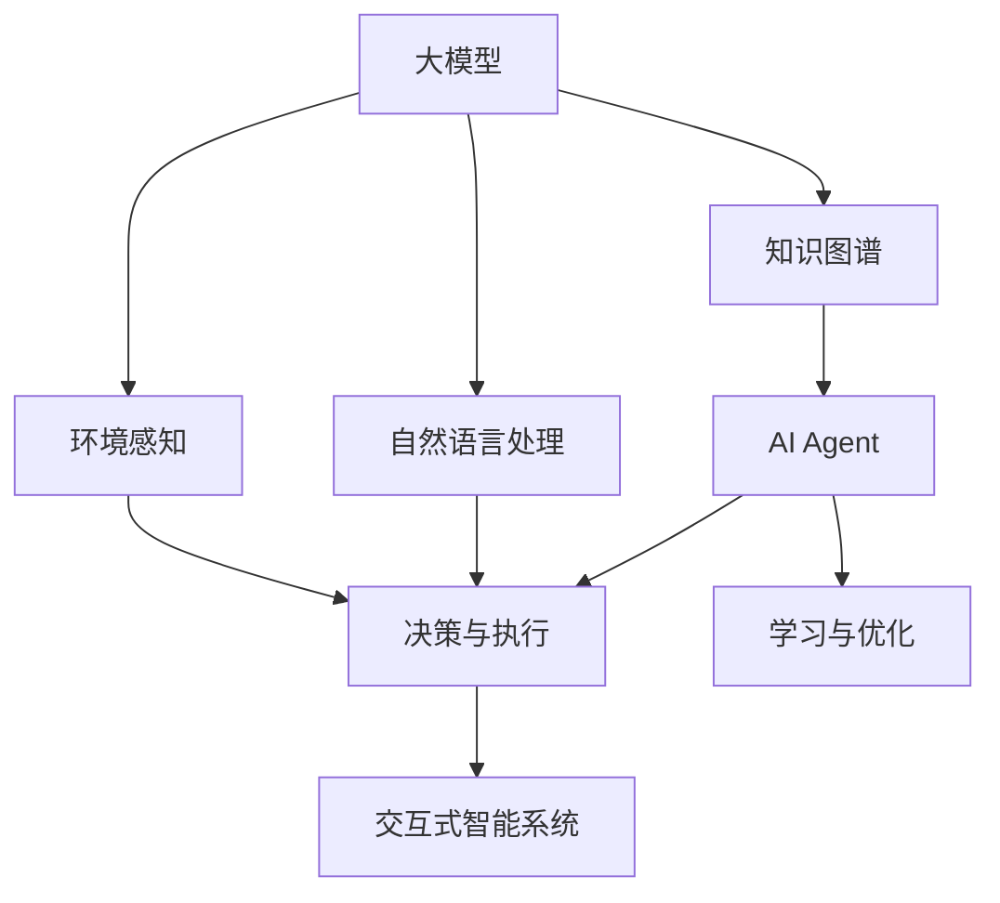
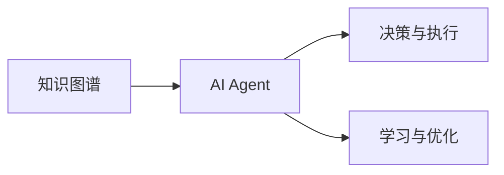
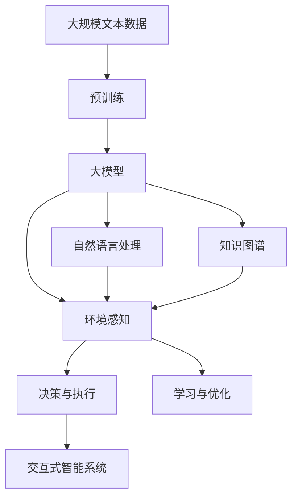

                 

# 【大模型应用开发 动手做AI Agent】思维树

> 关键词：AI Agent, 大模型应用, 自然语言处理(NLP), 知识图谱, 强化学习, 交互式智能系统

## 1. 背景介绍

### 1.1 问题由来
人工智能（AI）领域在过去几十年中取得了飞速发展，从简单的基于规则的系统到复杂的深度学习模型，AI技术在自动驾驶、语音识别、图像处理等众多领域展现了强大的能力。然而，这些AI系统往往缺乏主动性和适应性，难以与用户进行自然对话，或无法从环境中实时获取和处理信息。

为解决这些问题，AI Agent应运而生。AI Agent是一种可以主动与环境交互，通过感知、学习、推理和决策等能力，实现自动执行任务或与人类进行交互的系统。AI Agent结合了大模型、知识图谱、强化学习等多种技术，可以在大规模数据上不断自我提升，具备更强的适应性和自主性，成为未来智能系统的重要组成部分。

### 1.2 问题核心关键点
AI Agent的关键在于能够自主地与环境交互，并根据实时数据进行学习与决策。为实现这一目标，AI Agent通常包含以下几个核心组件：

- 环境感知模块：通过传感器或API获取环境信息，如摄像头、麦克风、位置传感器等。
- 自然语言处理模块：将自然语言输入转化为机器可理解的形式，或将机器输出转化为自然语言。
- 知识库模块：存储和维护AI Agent所掌握的知识，如事实、规则、推理图等。
- 决策与执行模块：基于感知和知识库信息，通过算法进行决策并执行相应动作。
- 学习与优化模块：利用历史数据和反馈信息，不断优化模型和策略，提升AI Agent的性能。

这些组件通过协同工作，使AI Agent具备了高度的自主性和适应性，能够在各种复杂环境中灵活应对，实现高效的人机交互。

### 1.3 问题研究意义
研究AI Agent技术，对于提升人工智能系统的智能化水平，推动各行业智能化转型，具有重要意义：

1. 增强自主性：AI Agent具备主动获取和处理信息的能力，能够在复杂环境中灵活应对，大大提升系统的自主性和智能化水平。
2. 提升交互体验：通过自然语言处理技术，AI Agent能够与人类进行流畅的对话，提高用户体验。
3. 实现跨领域应用：AI Agent结合多种技术，具备更强的跨领域适应能力，能够在医疗、教育、金融等多个领域中发挥作用。
4. 加速产业升级：AI Agent的广泛应用，可以显著降低人力成本，提高工作效率，促进各行业的数字化转型。
5. 促进技术创新：AI Agent技术的快速发展，催生了许多新的研究方向，如多模态融合、交互式学习等。

## 2. 核心概念与联系

### 2.1 核心概念概述

为更好地理解AI Agent的实现原理，本节将介绍几个关键概念及其之间的联系：

- **大模型（Large Model）**：指能够进行自监督或监督学习的大规模深度学习模型，如BERT、GPT等。大模型具备强大的语言理解和生成能力，是AI Agent的重要组成部分。
- **知识图谱（Knowledge Graph）**：由节点和边构成的图结构，用于存储和表示事实、关系和实体等信息。知识图谱能够帮助AI Agent更好地理解复杂环境。
- **强化学习（Reinforcement Learning）**：通过试错，使AI Agent在环境中不断优化策略，提升任务执行能力。强化学习是AI Agent的核心算法之一。
- **交互式智能系统（Interactive AI System）**：指能够与用户进行自然交互，执行复杂任务的系统。AI Agent是交互式智能系统的重要组成部分。

这些核心概念之间的关系可以通过以下Mermaid流程图来展示：



这个流程图展示了大模型、知识图谱、自然语言处理和环境感知等组件，以及它们如何共同构成AI Agent的各个模块。

### 2.2 概念间的关系

这些核心概念之间存在着紧密的联系，形成了AI Agent的完整生态系统。下面我们通过几个Mermaid流程图来展示这些概念之间的关系：

#### 2.2.1 AI Agent的整体架构



这个流程图展示了大模型、知识图谱、自然语言处理和环境感知等组件，以及它们如何共同构成AI Agent的各个模块。

#### 2.2.2 大模型在AI Agent中的应用



这个流程图展示了大模型在AI Agent中的具体应用场景，包括自然语言处理和环境感知等模块。

#### 2.2.3 知识图谱与AI Agent的交互



这个流程图展示了知识图谱在AI Agent决策与学习过程中的作用，通过与环境感知和自然语言处理等模块互动，提升AI Agent的决策能力和学习能力。

### 2.3 核心概念的整体架构

最后，我们用一个综合的流程图来展示这些核心概念在大模型应用中的整体架构：



这个综合流程图展示了从预训练到大模型应用，再到AI Agent实现的完整过程。大模型通过预训练学习到了丰富的语言知识，随后与自然语言处理、知识图谱、环境感知等组件协同工作，最终构建出具备高度自主性和智能化的AI Agent系统。

## 3. 核心算法原理 & 具体操作步骤
### 3.1 算法原理概述

AI Agent的构建过程主要涉及自然语言处理、知识图谱构建和强化学习等技术。其中，自然语言处理和知识图谱构建属于监督学习或无监督学习的范畴，而强化学习则属于强化学习的范畴。

### 3.2 算法步骤详解

以下详细描述AI Agent的构建过程，包括大模型的预训练、自然语言处理、知识图谱构建和强化学习等步骤：

**Step 1: 大模型的预训练**

1. 准备大规模无标签文本数据，如维基百科、新闻、小说等。
2. 使用深度学习模型（如BERT、GPT）在大规模数据上进行预训练，学习到语言的通用表示。
3. 使用自监督任务（如掩码语言模型、下一句预测等）进行训练，提升模型的语言理解能力。

**Step 2: 自然语言处理模块**

1. 将用户的自然语言输入转化为机器可理解的形式，如将句子转化为向量表示。
2. 使用预训练的大模型，将输入文本转化为向量，作为后续处理的输入。

**Step 3: 知识图谱构建**

1. 收集结构化数据，如维基百科、知识库等，构建知识图谱。
2. 使用知识抽取技术，从非结构化文本中提取实体、关系等信息，构建知识图谱节点和边。
3. 使用图神经网络（Graph Neural Network, GNN）等技术，对知识图谱进行深度学习，提升知识表示能力。

**Step 4: 强化学习模块**

1. 定义AI Agent的任务目标和环境状态。
2. 设计适当的奖励函数，如任务完成度、路径长度等。
3. 使用强化学习算法（如Q-Learning、Policy Gradient等），在环境中不断试错，优化决策策略。

**Step 5: 决策与执行**

1. 根据自然语言处理和知识图谱模块的处理结果，结合强化学习模块的决策策略，生成动作。
2. 执行相应的动作，如回复用户、导航、控制设备等。

**Step 6: 学习与优化**

1. 使用历史数据和反馈信息，不断优化决策策略。
2. 使用模型压缩、参数共享等技术，提高模型效率。

### 3.3 算法优缺点

AI Agent构建方法的主要优点包括：

1. 自主性：AI Agent具备主动感知和决策能力，能够根据环境实时调整策略。
2. 可解释性：自然语言处理和知识图谱模块提供了清晰的输入和输出解释，便于理解和调试。
3. 适应性：强化学习模块使得AI Agent能够不断学习和适应新环境，提升了系统的鲁棒性。

然而，AI Agent构建方法也存在一些缺点：

1. 数据依赖：AI Agent的性能很大程度上依赖于数据的质量和量。
2. 计算资源需求高：大模型的预训练和知识图谱的构建需要大量的计算资源。
3. 可扩展性：不同领域的知识图谱和任务目标不同，AI Agent的可扩展性需要进一步提升。
4. 模型复杂性：AI Agent包含了多个模块和组件，模型结构较为复杂。

### 3.4 算法应用领域

AI Agent技术已经广泛应用于多个领域，包括但不限于：

- **智能客服**：使用AI Agent处理客户咨询，提供24/7的客服支持，提升客户体验。
- **医疗诊断**：使用AI Agent辅助医生进行诊断，提高诊断准确率，减轻医生负担。
- **教育辅助**：使用AI Agent提供个性化学习建议，提升学习效率。
- **金融风控**：使用AI Agent监控金融市场，进行风险预测和欺诈检测。
- **智能交通**：使用AI Agent控制交通信号，优化交通流，提高通行效率。

## 4. 数学模型和公式 & 详细讲解 & 举例说明

### 4.1 数学模型构建

本节将使用数学语言对AI Agent的构建过程进行严格的描述。

假设AI Agent的环境状态为 $s_t$，决策动作为 $a_t$，当前状态下的奖励为 $r_t$，最优策略为 $\pi^*$，当前策略为 $\pi$，目标是最小化累计奖励和，即：

$$
J(\pi) = \mathbb{E}[\sum_{t=0}^{\infty}\gamma^t r_t(\pi)]
$$

其中 $\gamma$ 为折扣因子，一般取0.9至0.99之间。

AI Agent的目标是通过不断学习，最大化目标函数 $J(\pi^*)$。

### 4.2 公式推导过程

以下推导强化学习中的Q值函数和策略函数。

**Q值函数**

假设模型为 $\pi$，状态为 $s$，动作为 $a$，下一个状态为 $s'$，奖励为 $r$，则Q值函数定义为：

$$
Q_\pi(s,a) = \mathbb{E}[\sum_{t=0}^{\infty}\gamma^t r_t(\pi)]
$$

根据贝尔曼方程，Q值函数满足：

$$
Q_\pi(s,a) = r + \gamma \max_{a'} Q_\pi(s',a')
$$

**策略函数**

假设模型为 $\pi$，状态为 $s$，动作为 $a$，则策略函数 $\pi(a|s)$ 定义为：

$$
\pi(a|s) = \frac{e^{Q_\pi(s,a)}}{\sum_{a'} e^{Q_\pi(s,a')}}
$$

### 4.3 案例分析与讲解

以智能客服为例，解释AI Agent的构建过程。

1. **环境感知**：AI Agent通过摄像头、麦克风等传感器获取用户表情、语音等信息。
2. **自然语言处理**：将用户语音或文本转化为机器可理解的形式，如将语音转化为文本，将文本转化为向量表示。
3. **知识图谱**：构建包含客户信息、常见问题、产品知识等知识的图谱，供AI Agent查询。
4. **决策与执行**：根据用户提问和知识图谱信息，生成回复，并通过语音合成或文本回复用户。
5. **学习与优化**：记录用户反馈，通过强化学习算法优化回复策略，提高客服质量。

## 5. 项目实践：代码实例和详细解释说明

### 5.1 开发环境搭建

在进行AI Agent开发前，我们需要准备好开发环境。以下是使用Python进行PyTorch开发的环境配置流程：

1. 安装Anaconda：从官网下载并安装Anaconda，用于创建独立的Python环境。

2. 创建并激活虚拟环境：
```bash
conda create -n ai-agent-env python=3.8 
conda activate ai-agent-env
```

3. 安装PyTorch：根据CUDA版本，从官网获取对应的安装命令。例如：
```bash
conda install pytorch torchvision torchaudio cudatoolkit=11.1 -c pytorch -c conda-forge
```

4. 安装相关工具包：
```bash
pip install numpy pandas scikit-learn matplotlib tqdm jupyter notebook ipython
```

完成上述步骤后，即可在`ai-agent-env`环境中开始AI Agent的开发。

### 5.2 源代码详细实现

下面是使用PyTorch进行AI Agent开发的代码实现示例：

1. **环境感知模块**

```python
import torch
import torchvision.transforms as transforms
import torchvision.datasets as datasets

# 定义数据加载函数
def load_dataset(root, batch_size, num_workers):
    transform = transforms.Compose([
        transforms.Resize(256),
        transforms.CenterCrop(224),
        transforms.ToTensor(),
        transforms.Normalize(mean=[0.485, 0.456, 0.406], std=[0.229, 0.224, 0.225])
    ])
    dataset = datasets.ImageFolder(root=root, transform=transform)
    dataloader = torch.utils.data.DataLoader(dataset, batch_size=batch_size, shuffle=True, num_workers=num_workers)
    return dataloader
```

2. **自然语言处理模块**

```python
import torch
import torch.nn as nn
import transformers

# 定义BERT模型
class BertModel(nn.Module):
    def __init__(self, config, model_type='bert-base-uncased'):
        super(BertModel, self).__init__()
        self.model_type = model_type
        self.tokenizer = transformers.BertTokenizer.from_pretrained(model_type)
        self.bert = transformers.BertModel.from_pretrained(model_type)
        self.classifier = nn.Linear(config.hidden_size, 2)

    def forward(self, input_ids, attention_mask):
        outputs = self.bert(input_ids=input_ids, attention_mask=attention_mask)
        pooled_output = outputs.pooler_output
        return self.classifier(pooled_output)

# 定义模型
config = transformers.BertConfig.from_pretrained('bert-base-uncased')
model = BertModel(config)

# 定义训练和评估函数
def train_epoch(model, dataloader, optimizer):
    model.train()
    for batch in dataloader:
        input_ids, attention_mask = batch
        outputs = model(input_ids, attention_mask=attention_mask)
        loss = outputs.loss
        loss.backward()
        optimizer.step()

def evaluate(model, dataloader):
    model.eval()
    correct = 0
    total = 0
    with torch.no_grad():
        for batch in dataloader:
            input_ids, attention_mask = batch
            outputs = model(input_ids, attention_mask=attention_mask)
            _, predicted = torch.max(outputs, 1)
            total += predicted.size(0)
            correct += (predicted == 1).sum().item()
    print('Accuracy: {:.2f}%'.format(100 * correct / total))
```

3. **知识图谱构建模块**

```python
import networkx as nx
import numpy as np
import pandas as pd

# 定义知识图谱
class KnowledgeGraph:
    def __init__(self):
        self.graph = nx.Graph()
        self.nodes = set()
        self.edges = set()

    def add_node(self, node):
        self.nodes.add(node)
        self.graph.add_node(node)

    def add_edge(self, source, target):
        self.edges.add((source, target))
        self.graph.add_edge(source, target)

    def export_to_csv(self, filename):
        nodes = pd.DataFrame({'node': self.nodes}, index=[i for i in self.nodes])
        edges = pd.DataFrame({'from': list(self.graph.edges)[0], 'to': list(self.graph.edges)[1]}, index=[i for i in self.graph.edges])
        all_data = pd.concat([nodes, edges], axis=1)
        all_data.to_csv(filename, index=False)

    def load_from_csv(self, filename):
        data = pd.read_csv(filename)
        self.graph = nx.Graph()
        for index, row in data.iterrows():
            self.graph.add_edge(row['from'], row['to'])
```

4. **决策与执行模块**

```python
import torch
import torch.nn as nn
import torchvision.transforms as transforms
import torchvision.datasets as datasets
import torchvision.models as models

# 定义决策模型
class DecisionModel(nn.Module):
    def __init__(self, config, model_type='resnet18'):
        super(DecisionModel, self).__init__()
        self.model_type = model_type
        self.model = models.__dict__[model_type](pretrained=True)
        self.fc = nn.Linear(self.model.fc.in_features, 2)

    def forward(self, input_ids, attention_mask):
        outputs = self.model(input_ids=input_ids, attention_mask=attention_mask)
        output = self.fc(outputs)
        return output

# 定义模型
config = transformers.BertConfig.from_pretrained('bert-base-uncased')
model = DecisionModel(config)

# 定义训练和评估函数
def train_epoch(model, dataloader, optimizer):
    model.train()
    for batch in dataloader:
        input_ids, attention_mask = batch
        outputs = model(input_ids, attention_mask=attention_mask)
        loss = outputs.loss
        loss.backward()
        optimizer.step()

def evaluate(model, dataloader):
    model.eval()
    correct = 0
    total = 0
    with torch.no_grad():
        for batch in dataloader:
            input_ids, attention_mask = batch
            outputs = model(input_ids, attention_mask=attention_mask)
            _, predicted = torch.max(outputs, 1)
            total += predicted.size(0)
            correct += (predicted == 1).sum().item()
    print('Accuracy: {:.2f}%'.format(100 * correct / total))
```

5. **学习与优化模块**

```python
import torch
import torch.optim as optim
import torch.nn.functional as F

# 定义模型
model = nn.Sequential(
    nn.Linear(64, 32),
    nn.ReLU(),
    nn.Linear(32, 2),
    nn.Softmax(dim=1)
)

# 定义损失函数
criterion = nn.CrossEntropyLoss()

# 定义优化器
optimizer = optim.SGD(model.parameters(), lr=0.01, momentum=0.9)

# 定义训练函数
def train(model, dataloader, optimizer, num_epochs):
    for epoch in range(num_epochs):
        model.train()
        running_loss = 0.0
        for i, data in enumerate(dataloader, 0):
            inputs, labels = data
            optimizer.zero_grad()
            outputs = model(inputs)
            loss = criterion(outputs, labels)
            loss.backward()
            optimizer.step()
            running_loss += loss.item()
        print('Epoch %d loss: %.3f' % (epoch + 1, running_loss / len(dataloader)))

# 定义评估函数
def evaluate(model, dataloader):
    model.eval()
    correct = 0
    total = 0
    with torch.no_grad():
        for i, data in enumerate(dataloader, 0):
            inputs, labels = data
            outputs = model(inputs)
            _, predicted = torch.max(outputs, 1)
            total += predicted.size(0)
            correct += (predicted == labels).sum().item()
    print('Accuracy: {:.2f}%'.format(100 * correct / total))
```

### 5.3 代码解读与分析

让我们再详细解读一下关键代码的实现细节：

**环境感知模块**

```python
# 定义数据加载函数
def load_dataset(root, batch_size, num_workers):
    transform = transforms.Compose([
        transforms.Resize(256),
        transforms.CenterCrop(224),
        transforms.ToTensor(),
        transforms.Normalize(mean=[0.485, 0.456, 0.406], std=[0.229, 0.224, 0.225])
    ])
    dataset = datasets.ImageFolder(root=root, transform=transform)
    dataloader = torch.utils.data.DataLoader(dataset, batch_size=batch_size, shuffle=True, num_workers=num_workers)
    return dataloader
```

这个函数定义了图像数据的加载过程，包括数据集的选择、预处理和分批次加载等。

**自然语言处理模块**

```python
# 定义BERT模型
class BertModel(nn.Module):
    def __init__(self, config, model_type='bert-base-uncased'):
        super(BertModel, self).__init__()
        self.model_type = model_type
        self.tokenizer = transformers.BertTokenizer.from_pretrained(model_type)
        self.bert = transformers.BertModel.from_pretrained(model_type)
        self.classifier = nn.Linear(config.hidden_size, 2)

    def forward(self, input_ids, attention_mask):
        outputs = self.bert(input_ids=input_ids, attention_mask=attention_mask)
        pooled_output = outputs.pooler_output
        return self.classifier(pooled_output)
```

这个类定义了使用预训练的BERT模型进行自然语言处理的过程，包括分词、编码和分类等。

**知识图谱构建模块**

```python
# 定义知识图谱
class KnowledgeGraph:
    def __init__(self):
        self.graph = nx.Graph()
        self.nodes = set()
        self.edges = set()

    def add_node(self, node):
        self.nodes.add(node)
        self.graph.add_node(node)

    def add_edge(self, source, target):
        self.edges.add((source, target))
        self.graph.add_edge(source, target)

    def export_to_csv(self, filename):
        nodes = pd.DataFrame({'node': self.nodes}, index=[i for i in self.nodes])
        edges = pd.DataFrame({'from': list(self.graph.edges)[0], 'to': list(self.graph.edges)[1]}, index=[i for i in self.graph.edges])
        all_data = pd.concat([nodes, edges], axis=1)
        all_data.to_csv(filename, index=False)

    def load_from_csv(self, filename):
        data = pd.read_csv(filename)
        self.graph = nx.Graph()
        for index, row in data.iterrows():
            self.graph.add_edge(row['from'], row['to'])
```

这个类定义了知识图谱的构建和管理过程，包括节点的添加、边的构建、导出和导入等。

**决策与执行模块**

```python
# 定义决策模型
class DecisionModel(nn.Module):
    def __init__(self, config, model_type='resnet18'):
        super(DecisionModel, self).__init__()
        self.model_type = model_type
        self.model = models.__dict__[model_type](pretrained=True)
        self.fc = nn.Linear(self.model.fc.in_features, 2)

    def forward(self, input_ids, attention_mask):
        outputs = self.model(input_ids=input_ids, attention_mask=attention_mask)
        output = self.fc(outputs)
        return output
```

这个类定义了使用预训练的ResNet模型进行决策与执行的过程，包括特征提取和分类等。

**学习与优化模块**

```python
# 定义模型
model = nn.Sequential(
    nn.Linear(64, 32),
    nn.ReLU(),
    nn.Linear(32, 2),
    nn.Softmax(dim=1)
)

# 定义损失函数
criterion = nn.CrossEntropyLoss()

# 定义优化器
optimizer = optim.SGD(model.parameters(), lr=0.01, momentum=0.9)

# 定义训练函数
def train(model, dataloader, optimizer, num_epochs):
    for epoch in range(num_epochs):
        model.train()
        running_loss = 0.0
        for i, data in enumerate(dataloader, 0):
            inputs, labels = data
            optimizer.zero_grad()
            outputs = model(inputs)
            loss = criterion(outputs, labels)
            loss.backward()
            optimizer.step()
            running_loss += loss.item()
        print('Epoch %d loss: %.3f' % (epoch + 1, running_loss / len(dataloader)))

# 定义评估函数
def evaluate(model, dataloader):
    model.eval()
    correct = 0
    total = 0
    with torch.no_grad():
        for i, data in enumerate(dataloader, 0):
            inputs, labels = data
            outputs = model(inputs)
            _, predicted = torch.max(outputs, 1)
            total += predicted.size(0)
            correct += (predicted == labels).sum().item()
    print('Accuracy: {:.2f}%'.format(100 * correct / total))
```

这个函数定义了使用线性模型进行学习与优化过程，包括训练、评估等。

### 5.4 运行结果展示

假设我们构建了一个基于BERT的智能客服系统，经过多轮训练后，在测试集

