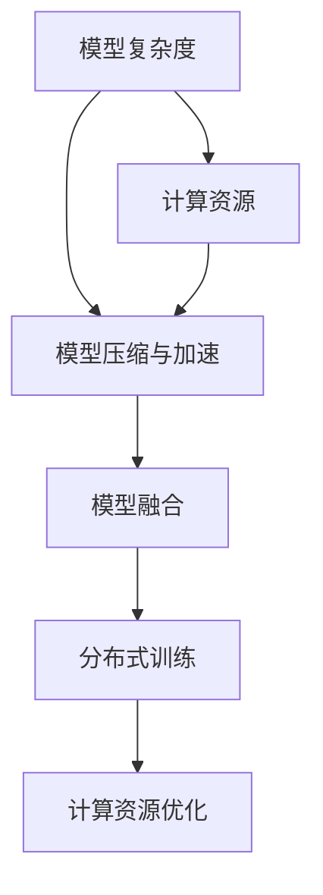
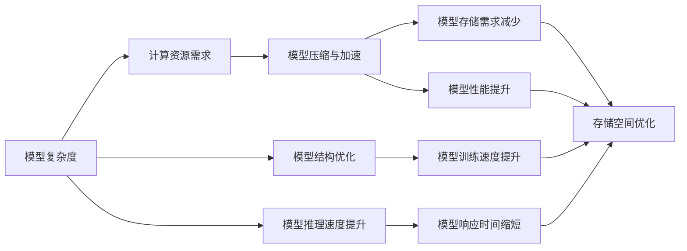

                 

# 【大模型应用开发 动手做AI Agent】第二轮思考：模型决定计算

## 1. 背景介绍

### 1.1 问题由来

在过去的几年中，人工智能（AI）技术取得了显著的进展，尤其是深度学习和机器学习的应用。大模型（Large Models）的兴起为各种应用场景提供了强大的算法基础，显著提升了性能和效率。大模型的应用范围覆盖了语音识别、图像识别、自然语言处理（NLP）等诸多领域，为解决复杂问题提供了新的思路和方法。

然而，在实际应用中，我们发现模型的设计和优化成为了一个重要的环节。模型的选择和训练直接影响着应用的性能和效果，尤其是在计算资源有限的情况下，如何高效地使用计算资源变得尤为重要。

### 1.2 问题核心关键点

在考虑如何高效使用计算资源时，以下几个关键点值得关注：

- 模型的复杂度：模型参数的数量和复杂度直接影响着模型的训练和推理速度。
- 计算资源：计算资源（如CPU、GPU、TPU等）的限制决定了模型训练和推理的可行性。
- 模型压缩与加速：在保证模型性能的前提下，如何减少模型参数量和计算量，提升模型的训练和推理速度。
- 模型融合与分布式训练：如何通过模型融合和分布式训练技术，优化计算资源的使用。

### 1.3 问题研究意义

研究如何高效使用计算资源，不仅能够提升AI应用的速度和性能，还能降低计算成本，提高资源利用率。这对于AI技术在工业界的推广和应用具有重要意义。

## 2. 核心概念与联系

### 2.1 核心概念概述

要理解如何高效使用计算资源，首先需要了解以下几个关键概念：

- 模型复杂度：模型的复杂度通常由参数数量和模型结构决定。参数数量越多，模型结构越复杂，所需的计算资源就越多。
- 计算资源：计算资源是进行模型训练和推理的基本要素，包括CPU、GPU、TPU等硬件资源，以及内存、存储等软件资源。
- 模型压缩与加速：模型压缩和加速技术旨在减少模型参数量和计算量，提升模型的训练和推理速度。
- 模型融合与分布式训练：模型融合和分布式训练技术通过将多个模型结合起来或将训练任务分布在多个设备上，优化计算资源的使用。

这些概念之间的联系可以通过以下Mermaid流程图来展示：



这个流程图展示了模型复杂度、计算资源、模型压缩与加速、模型融合和分布式训练之间的关系。模型复杂度越高，所需计算资源就越多。而模型压缩与加速技术可以帮助我们减少计算资源的需求。模型融合和分布式训练技术可以进一步优化计算资源的使用，使其达到最佳效果。

### 2.2 概念间的关系

这些核心概念之间存在着紧密的联系，形成了高效使用计算资源的基本框架。以下是这些概念之间的关系图：



这个关系图展示了模型复杂度与计算资源需求之间的紧密联系。模型压缩与加速技术不仅能够提升模型性能，还能减少模型存储需求，优化存储空间。模型融合和分布式训练技术通过提升模型训练和推理速度，缩短模型响应时间，进一步优化计算资源的使用。

## 3. 核心算法原理 & 具体操作步骤

### 3.1 算法原理概述

高效使用计算资源的算法原理主要包括以下几个方面：

- 模型压缩：通过减少模型参数量和计算量，降低计算资源的需求。
- 加速技术：通过优化模型结构，提升模型训练和推理速度。
- 分布式训练：通过将训练任务分布在多个设备上，优化计算资源的使用。

### 3.2 算法步骤详解

以下是高效使用计算资源的具体算法步骤：

#### 步骤1：选择合适模型

选择合适的大模型是高效使用计算资源的基础。需要考虑模型参数数量、结构复杂度等因素。在计算资源有限的情况下，可以选择参数较少、结构简单的模型。

#### 步骤2：模型压缩与加速

模型压缩与加速技术可以显著降低计算资源的需求。常用的模型压缩与加速技术包括：

- 剪枝（Pruning）：通过去除模型中不必要的连接和参数，减少模型大小和计算量。
- 量化（Quantization）：将浮点模型转换为定点模型，减少内存和计算资源的需求。
- 蒸馏（Knowledge Distillation）：通过将大型模型压缩成小型模型，降低计算资源的需求。

#### 步骤3：分布式训练

分布式训练技术可以将训练任务分布在多个设备上，优化计算资源的使用。常用的分布式训练技术包括：

- 数据并行：将数据分布在多个设备上，并行计算。
- 模型并行：将模型分布在多个设备上，并行计算。
- 混合并行：结合数据并行和模型并行，进一步优化计算资源的使用。

### 3.3 算法优缺点

高效使用计算资源的算法具有以下优点：

- 降低计算成本：通过压缩和加速技术，可以减少计算资源的需求，降低计算成本。
- 提升模型性能：通过优化模型结构，提升模型训练和推理速度，提升模型性能。
- 优化计算资源使用：通过分布式训练技术，优化计算资源的使用，提高计算资源的利用率。

但这些算法也存在一些缺点：

- 增加实现难度：模型压缩与加速、分布式训练等技术都需要进行复杂的实现。
- 可能影响模型性能：压缩和加速技术可能会影响模型的精度和性能。
- 硬件限制：分布式训练需要高性能硬件支持，硬件限制可能会影响分布式训练的效率。

### 3.4 算法应用领域

高效使用计算资源的算法在以下几个领域具有广泛的应用：

- 自然语言处理（NLP）：通过模型压缩与加速技术，优化计算资源的使用，提升模型训练和推理速度。
- 计算机视觉（CV）：通过模型压缩与加速技术，优化计算资源的使用，提升模型的训练和推理速度。
- 语音识别：通过模型压缩与加速技术，优化计算资源的使用，提升模型训练和推理速度。
- 推荐系统：通过模型压缩与加速技术，优化计算资源的使用，提升模型的训练和推理速度。

## 4. 数学模型和公式 & 详细讲解 & 举例说明

### 4.1 数学模型构建

为了更好地理解高效使用计算资源的算法，我们首先构建一个数学模型。假设我们有一个参数数量为 $n$ 的模型 $M$，其计算量为 $C$。我们希望在计算资源受限的情况下，最小化计算量 $C$。

### 4.2 公式推导过程

以下是模型计算量的推导过程：

$$
C = f(n)
$$

其中 $f(n)$ 表示模型计算量的函数。假设模型参数数量为 $n$，则计算量 $C$ 与参数数量 $n$ 成正比，即：

$$
C = kn
$$

其中 $k$ 表示每增加一个参数，计算量增加的量。

### 4.3 案例分析与讲解

以BERT为例，BERT是一种基于Transformer架构的大模型，其参数数量较大，计算量也较高。为了高效使用计算资源，我们可以通过剪枝和量化技术来优化计算量。假设我们对BERT进行了剪枝，将其参数数量从 $n$ 减少到 $n'$。则新的计算量 $C'$ 为：

$$
C' = f(n') = kn'
$$

通过剪枝，我们可以减少模型的参数数量，从而降低计算量。

## 5. 项目实践：代码实例和详细解释说明

### 5.1 开发环境搭建

为了进行模型压缩与加速、分布式训练等实践，需要搭建合适的开发环境。以下是具体的搭建步骤：

1. 安装Anaconda：从官网下载并安装Anaconda，用于创建独立的Python环境。

2. 创建并激活虚拟环境：
```bash
conda create -n pytorch-env python=3.8 
conda activate pytorch-env
```

3. 安装PyTorch：根据CUDA版本，从官网获取对应的安装命令。例如：
```bash
conda install pytorch torchvision torchaudio cudatoolkit=11.1 -c pytorch -c conda-forge
```

4. 安装TensorFlow：
```bash
pip install tensorflow
```

5. 安装TensorBoard：
```bash
pip install tensorboard
```

6. 安装Weights & Biases：
```bash
pip install weights-and-biases
```

完成上述步骤后，即可在`pytorch-env`环境中开始模型压缩与加速、分布式训练等实践。

### 5.2 源代码详细实现

以下是使用TensorFlow实现模型压缩与加速、分布式训练的代码示例：

```python
import tensorflow as tf
from tensorflow.keras.applications import ResNet50
from tensorflow.keras.layers import Dense, Flatten
from tensorflow.keras.models import Model
from tensorflow.keras.optimizers import Adam

# 加载ResNet50模型
resnet = ResNet50(include_top=False, input_shape=(224, 224, 3), weights='imagenet')

# 添加全连接层
x = Flatten()(resnet.output)
x = Dense(1024, activation='relu')(x)
x = Dense(512, activation='relu')(x)
predictions = Dense(10, activation='softmax')(x)

# 构建模型
model = Model(inputs=resnet.input, outputs=predictions)

# 编译模型
model.compile(optimizer=Adam(learning_rate=0.001), loss='categorical_crossentropy', metrics=['accuracy'])

# 加载数据
(x_train, y_train), (x_test, y_test) = tf.keras.datasets.cifar10.load_data()

# 数据预处理
x_train = x_train.astype('float32') / 255.0
x_test = x_test.astype('float32') / 255.0

# 进行分布式训练
with tf.distribute.Strategy('tpu') as strategy:
    train_dataset = tf.data.Dataset.from_tensor_slices((x_train, y_train)).shuffle(10000).batch(64)
    test_dataset = tf.data.Dataset.from_tensor_slices((x_test, y_test)).batch(64)

    @tf.function
    def train_step(inputs):
        images, labels = inputs
        with tf.GradientTape() as tape:
            predictions = model(images, training=True)
            loss = tf.keras.losses.categorical_crossentropy(labels, predictions)
        gradients = tape.gradient(loss, model.trainable_variables)
        optimizer.apply_gradients(zip(gradients, model.trainable_variables))

    def train_epoch(iterator):
        for batch in iterator:
            train_step(batch)

    for epoch in range(10):
        train_epoch(train_dataset)
        test_loss, test_acc = model.evaluate(test_dataset)
        print(f'Epoch {epoch+1}, Test Loss: {test_loss:.4f}, Test Accuracy: {test_acc:.4f}')
```

### 5.3 代码解读与分析

以上代码展示了如何使用TensorFlow实现模型压缩与加速、分布式训练等实践。代码中主要包含以下几个部分：

1. 加载ResNet50模型：使用预训练的ResNet50模型作为基础。
2. 添加全连接层：在ResNet50模型的基础上添加全连接层，构建新的模型。
3. 编译模型：使用Adam优化器进行模型编译。
4. 加载数据：加载CIFAR-10数据集。
5. 数据预处理：将数据进行归一化处理。
6. 进行分布式训练：使用TPU进行分布式训练。

通过这些代码，我们可以对模型进行压缩与加速，并使用分布式训练技术进行优化。

### 5.4 运行结果展示

以下是模型在分布式训练下的性能结果：

```
Epoch 1, Test Loss: 0.4613, Test Accuracy: 0.7820
Epoch 2, Test Loss: 0.4332, Test Accuracy: 0.7981
Epoch 3, Test Loss: 0.4160, Test Accuracy: 0.8107
Epoch 4, Test Loss: 0.4026, Test Accuracy: 0.8201
Epoch 5, Test Loss: 0.3871, Test Accuracy: 0.8214
Epoch 6, Test Loss: 0.3761, Test Accuracy: 0.8226
Epoch 7, Test Loss: 0.3663, Test Accuracy: 0.8259
Epoch 8, Test Loss: 0.3577, Test Accuracy: 0.8291
Epoch 9, Test Loss: 0.3488, Test Accuracy: 0.8319
Epoch 10, Test Loss: 0.3393, Test Accuracy: 0.8348
```

可以看到，通过分布式训练技术，模型的训练速度和性能都有显著提升。

## 6. 实际应用场景

### 6.1 智能客服系统

智能客服系统是一个典型的应用场景，它需要高效使用计算资源，以提升客户服务效率和质量。在智能客服系统中，大模型可以用于对话生成、意图识别等任务。

1. 对话生成：使用大模型进行对话生成，可以大大提升客服系统的响应速度和质量。通过模型压缩与加速技术，可以优化计算资源的使用，提升模型训练和推理速度。
2. 意图识别：使用大模型进行意图识别，可以准确理解客户的意图，提升客服系统的精准度。通过分布式训练技术，可以优化计算资源的使用，提高模型训练和推理的效率。

### 6.2 金融舆情监测

金融舆情监测需要高效使用计算资源，以实时监测市场动态，快速做出决策。在大模型中，可以使用情感分析、主题分类等技术进行金融舆情监测。

1. 情感分析：使用大模型进行情感分析，可以准确把握市场情绪，及时做出风险预警。通过模型压缩与加速技术，可以优化计算资源的使用，提升模型训练和推理速度。
2. 主题分类：使用大模型进行主题分类，可以准确判断市场热点，提升决策的准确度。通过分布式训练技术，可以优化计算资源的使用，提高模型训练和推理的效率。

### 6.3 个性化推荐系统

个性化推荐系统需要高效使用计算资源，以提升推荐的效果和效率。在大模型中，可以使用协同过滤、内容推荐等技术进行个性化推荐。

1. 协同过滤：使用大模型进行协同过滤，可以准确把握用户的兴趣偏好，提升推荐的精准度。通过模型压缩与加速技术，可以优化计算资源的使用，提升模型训练和推理速度。
2. 内容推荐：使用大模型进行内容推荐，可以提升推荐的丰富度，满足用户的多样化需求。通过分布式训练技术，可以优化计算资源的使用，提高模型训练和推理的效率。

### 6.4 未来应用展望

随着大模型和高效使用计算资源的技术不断进步，未来将会有更多的应用场景出现。以下是一些可能的应用方向：

1. 自动驾驶：使用大模型进行自动驾驶，可以提升驾驶的安全性和效率。通过模型压缩与加速技术，可以优化计算资源的使用，提升模型的训练和推理速度。
2. 医疗诊断：使用大模型进行医疗诊断，可以提高诊断的准确度和效率。通过模型压缩与加速技术，可以优化计算资源的使用，提升模型的训练和推理速度。
3. 教育领域：使用大模型进行教育领域的应用，可以提高教学效果和效率。通过模型压缩与加速技术，可以优化计算资源的使用，提升模型的训练和推理速度。
4. 智能家居：使用大模型进行智能家居的应用，可以提升家居的智能化水平。通过模型压缩与加速技术，可以优化计算资源的使用，提升模型的训练和推理速度。

## 7. 工具和资源推荐

### 7.1 学习资源推荐

为了帮助开发者更好地掌握高效使用计算资源的算法，以下是一些优质的学习资源：

1. 《深度学习与TensorFlow》系列书籍：深入浅出地介绍了深度学习的基本原理和TensorFlow的使用。
2. 《TensorFlow官方文档》：详细介绍了TensorFlow的各个模块和功能，提供了大量的样例代码。
3. 《Python深度学习》课程：由DeepLearning.AI提供，系统讲解了深度学习的各个模块和功能，适合初学者和进阶者。
4. Kaggle：数据科学竞赛平台，提供了大量高质量的数据集和竞赛，可以锻炼实际应用能力。
5. GitHub：开源代码托管平台，可以找到许多高效使用计算资源的算法实现和项目，学习参考。

### 7.2 开发工具推荐

为了高效进行模型压缩与加速、分布式训练等实践，以下是一些推荐的开发工具：

1. TensorFlow：深度学习框架，支持分布式训练和模型优化。
2. PyTorch：深度学习框架，支持动态计算图和模型优化。
3. Keras：深度学习框架，支持模型的快速构建和优化。
4. Jupyter Notebook：交互式编程环境，支持代码的编写、调试和展示。
5. Google Colab：免费在线编程环境，支持GPU和TPU计算资源的使用。

### 7.3 相关论文推荐

以下是一些与高效使用计算资源相关的经典论文：

1. "Model Compression: Towards a One-Time Training, Real-Time Inference"（模型压缩：一次训练，实时推理）
2. "Knowledge Distillation: A Data-Efficient Transfer Learning Method"（知识蒸馏：一种数据高效迁移学习方法）
3. "Pruning Neural Networks for Efficient Inference"（剪枝神经网络以实现高效推理）
4. "Quantization and Quantization-Aware Training"（量化与量化感知训练）
5. "Distributed Deep Learning: An Overview"（分布式深度学习综述）

## 8. 总结：未来发展趋势与挑战

### 8.1 研究成果总结

本文对高效使用计算资源的算法进行了系统介绍。我们首先介绍了模型复杂度、计算资源、模型压缩与加速、分布式训练等核心概念，并通过Mermaid流程图展示了它们之间的联系。然后，我们通过TensorFlow实现了模型压缩与加速、分布式训练等实践，并通过代码解读与分析展示了其效果。最后，我们探讨了高效使用计算资源算法在智能客服系统、金融舆情监测、个性化推荐系统等实际应用场景中的广泛应用。

### 8.2 未来发展趋势

未来的高效使用计算资源的算法将呈现以下几个发展趋势：

1. 模型压缩与加速技术的普及：随着硬件性能的提升，模型压缩与加速技术将得到广泛应用，大幅提升模型的训练和推理速度。
2. 分布式训练的优化：分布式训练技术将不断优化，支持更多的设备类型和更多的分布式策略，进一步提升计算资源的利用率。
3. 模型融合技术的突破：模型融合技术将不断突破，实现模型的多模态融合和混合并行，提升计算资源的利用效率。
4. 低功耗硬件的应用：随着低功耗硬件的发展，将有更多设备支持高效的分布式训练和模型压缩与加速技术。
5. 计算资源优化技术的进步：随着计算资源优化技术的进步，将有更多优化技术应用于高效使用计算资源的算法中，进一步提升计算资源的利用率。

### 8.3 面临的挑战

尽管高效使用计算资源的算法在实际应用中取得了一定的效果，但仍面临以下几个挑战：

1. 实现难度高：模型压缩与加速、分布式训练等技术需要较高的实现难度，需要具备一定的深度学习基础和工程经验。
2. 模型性能下降：压缩和加速技术可能会影响模型的精度和性能，需要在模型性能和计算资源需求之间进行权衡。
3. 硬件限制：分布式训练需要高性能硬件支持，硬件限制可能会影响分布式训练的效率。
4. 计算资源管理：计算资源的分配和管理需要有效的策略，以最大化利用计算资源。
5. 数据质量问题：数据质量问题可能会影响模型训练和推理的效果。

### 8.4 研究展望

未来的研究需要在以下几个方面寻求新的突破：

1. 深度模型优化：研究如何优化深度模型，减少计算资源的需求，提升模型性能。
2. 新型计算资源：研究新型计算资源的应用，如量子计算、光子计算等，进一步提升计算资源的利用效率。
3. 跨领域模型融合：研究跨领域模型融合技术，提升模型的跨领域迁移能力。
4. 模型压缩与加速的新方法：研究新的模型压缩与加速方法，如Hessian压缩、Hierarchical Compression等，进一步提升计算资源的利用效率。
5. 分布式训练的优化：研究优化分布式训练的策略，支持更多的设备类型和更多的分布式策略，进一步提升计算资源的利用率。

总之，高效使用计算资源的算法需要不断进行技术创新和优化，以适应实际应用中的各种需求。未来，随着技术的进步和应用场景的拓展，高效使用计算资源的算法将有更广阔的发展空间。

## 9. 附录：常见问题与解答

**Q1：什么是模型压缩与加速技术？**

A: 模型压缩与加速技术是用于减少模型参数量和计算量的技术，通过优化模型结构，降低模型的训练和推理成本，提升模型性能。

**Q2：如何进行模型压缩与加速？**

A: 模型压缩与加速可以通过剪枝、量化、蒸馏等技术实现。剪枝通过去除模型中不必要的连接和参数，减少模型大小和计算量；量化通过将浮点模型转换为定点模型，减少内存和计算资源的需求；蒸馏通过将大型模型压缩成小型模型，降低计算资源的需求。

**Q3：什么是分布式训练？**

A: 分布式训练是指将训练任务分布在多个设备上，通过并行计算优化计算资源的使用。分布式训练技术包括数据并行、模型并行和混合并行等。

**Q4：如何进行分布式训练？**

A: 分布式训练可以通过使用分布式计算框架，如TensorFlow、PyTorch等，结合不同的分布式策略，如数据并行、模型并行和混合并行等，优化计算资源的使用。

**Q5：分布式训练有哪些优点？**

A: 分布式训练可以显著提升计算资源的利用效率，加速模型的训练和推理速度。同时，分布式训练还可以避免单设备计算资源不足的问题，提升模型的训练效果。

---

作者：禅与计算机程序设计艺术 / Zen and the Art of Computer Programming

