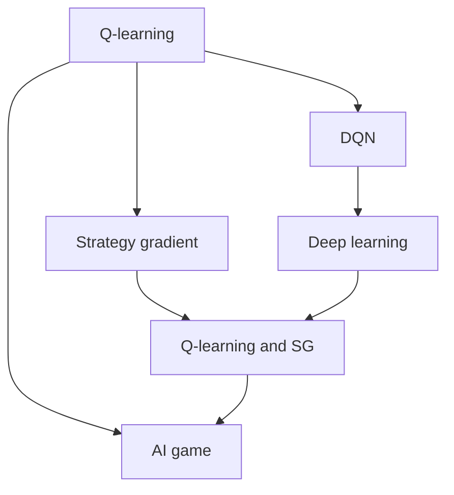

                 

# 一切皆是映射：AI Q-learning国际研究前沿速览

> 关键词：
- 强化学习
- Q-learning
- Deep Q-learning
- 深度强化学习
- 策略梯度
- 策略更新
- 探索与利用
- 人工智能游戏AI
- 模型构建与优化

## 1. 背景介绍

在人工智能领域，强化学习(RL)是推动智能决策系统向前发展的重要分支之一。Q-learning作为最基础的强化学习算法之一，广泛应用于人工智能游戏(AI Games)、机器人控制、自动驾驶等多个实际应用场景中。然而，随着深度学习(DL)技术的发展，传统Q-learning的性能受到了极大的挑战。为了解决这一问题，研究人员提出了深度Q-learning(DQN)，通过将Q-learning与神经网络相结合，显著提升了算法的效果和泛化能力。本文将深入探讨AI Q-learning的最新研究进展，带你了解该领域的国际前沿。

## 2. 核心概念与联系

### 2.1 核心概念概述

在讨论AI Q-learning之前，首先需要理解几个关键概念：

- **强化学习(RL)**：是一种机器学习技术，通过与环境交互，不断调整模型参数以优化某项指标（通常是奖励函数）。强化学习的核心是构建一个智能体(Agent)，该智能体根据环境反馈不断学习最优策略。

- **Q-learning**：是一种基于价值迭代的RL算法，用于学习动作-价值函数(Q Function)。通过迭代更新Q值，指导智能体选择最优动作。

- **深度Q-learning(DQN)**：将神经网络引入Q-learning，通过网络参数共享和优化器自动微分的方式，提高Q-learning的计算效率和准确性，使之在实际应用中表现优异。

- **策略梯度(SG)**：与Q-learning不同，策略梯度直接学习动作-策略映射，通过直接优化策略损失函数来学习最优策略。

- **探索与利用(Exploitation and Exploration)**：在RL中，智能体需要在已知动作-价值函数的条件下选择最优动作（利用），同时还需要不断探索新动作以发现更好的策略（探索）。

- **AI游戏**：通过RL算法训练的智能体，可以在特定游戏中与人类或其他智能体竞争，如围棋、扑克、星际争霸等。

这些概念之间有着密切的联系。Q-learning和策略梯度都是RL的子集，通过不同的方式更新Q值或策略函数，实现智能体的学习和优化。探索与利用则是智能体在决策过程中需要权衡的重要因素。AI游戏则是强化学习实际应用的重要领域，通过与游戏环境交互，不断提升算法的性能。

### 2.2 概念间的关系

以下Mermaid流程图展示了Q-learning、DQN、SG、AI游戏之间的逻辑关系：



这个流程图展示了Q-learning、DQN、策略梯度、AI游戏等概念之间的逻辑关系：

1. Q-learning是基础，通过迭代更新Q值指导智能体行动。
2. DQN通过引入神经网络，提高了Q-learning的计算效率和准确性。
3. 策略梯度是另一种方法，直接学习动作-策略映射。
4. Q-learning和SG均可应用于AI游戏，通过与环境交互不断学习最优策略。

## 3. 核心算法原理 & 具体操作步骤
### 3.1 算法原理概述

Q-learning的核心思想是通过迭代更新动作-价值函数(Q Function)，从而指导智能体选择最优动作。动作-价值函数Q(s,a)表示在状态s下采取动作a所能获得的最大期望收益。Q-learning的更新规则如下：

$$ Q(s,a) \leftarrow Q(s,a) + \alpha [r + \gamma \max Q'(s',a') - Q(s,a)] $$

其中，$\alpha$ 是学习率，$r$ 是即时奖励，$\gamma$ 是折扣因子，$s'$ 和 $a'$ 分别表示状态和动作的下一个状态和动作。通过不断迭代更新Q值，Q-learning可以逐步学习到最优策略。

深度Q-learning则通过神经网络对Q值进行逼近，将Q-learning与DL技术相结合。DQN的基本流程如下：

1. 收集状态-动作-奖励数据，存储到经验回放(Experience Replay)内存中。
2. 从内存中随机抽取一批样本来进行训练。
3. 使用神经网络拟合Q值函数。
4. 通过梯度下降更新神经网络参数，最小化Q值函数的均方误差(MSE)。
5. 使用拟合好的神经网络，计算当前状态下的最优动作。

### 3.2 算法步骤详解

**3.2.1 Q-learning的基本步骤**

1. 初始化Q值表，设定状态-动作对数量。
2. 在每个时间步，观察环境状态s，选择动作a。
3. 根据状态s和动作a，计算即时奖励r和下一个状态s'。
4. 使用Q值表更新Q(s,a)。
5. 根据Q值更新策略，选择下一个动作a'。
6. 更新状态为s'，返回第2步。

**3.2.2 DQN的基本步骤**

1. 初始化神经网络，设定网络结构。
2. 收集状态-动作-奖励数据，存储到经验回放内存中。
3. 从内存中随机抽取样本来进行训练。
4. 使用神经网络拟合Q值函数。
5. 计算当前状态下的最优动作a'。
6. 使用拟合好的神经网络，计算Q值函数Q(s,a)。
7. 更新神经网络参数，最小化Q值函数的均方误差(MSE)。
8. 返回最优动作a'，进入下一时间步。

**3.2.3 策略梯度的基本步骤**

1. 初始化策略函数，设定策略参数。
2. 在每个时间步，观察环境状态s，选择动作a。
3. 根据状态s和动作a，计算即时奖励r和下一个状态s'。
4. 使用策略函数计算Q值函数。
5. 根据Q值函数更新策略参数。
6. 根据策略参数选择下一个动作a'。
7. 更新状态为s'，返回第2步。

### 3.3 算法优缺点

**Q-learning的优点**：

- 算法简单，易于实现。
- 不需要对动作空间进行离散化，适用于连续动作空间。
- 对于高维、稀疏状态空间，表现良好。

**Q-learning的缺点**：**

- 收敛速度较慢，需要大量迭代才能收敛。
- 对于高维状态空间，容易出现“维度灾难”，导致计算复杂度高。
- 对动作空间的连续性要求较高，不适合某些类型的动作空间。

**DQN的优点**：

- 通过神经网络逼近Q值函数，解决了维度灾难问题，适用于高维状态空间。
- 可以处理连续动作空间，适合于复杂任务。
- 使用经验回放技术，提高了样本利用的效率。

**DQN的缺点**：**

- 训练复杂度高，需要大量的训练数据。
- 神经网络参数较多，容易过拟合。
- 学习率需要手动设置，对超参数的调优要求较高。

**策略梯度的优点**：

- 直接优化策略函数，避免了对动作-价值函数Q值的显式计算。
- 避免了维度灾难问题，适用于高维状态空间。
- 对超参数的依赖较少，易于调优。

**策略梯度的缺点**：

- 学习效率较低，收敛速度较慢。
- 对状态空间的连续性要求较高，不适合某些类型的状态空间。
- 对梯度消失问题较为敏感，需要特殊处理。

### 3.4 算法应用领域

AI Q-learning在各个领域都有广泛的应用。以下是几个典型的应用场景：

**1. AI游戏**

在AI游戏中，Q-learning和DQN被广泛应用于游戏AI的设计中。如AlphaGo、AlphaStar等AI游戏均采用了基于RL的策略设计。这些游戏AI不仅在竞技水平上超越了人类，还在游戏策略上展示了极高的智能水平。

**2. 机器人控制**

在机器人控制中，AI Q-learning可以用于训练机器人的决策和动作执行。如波士顿动力的狗(Boston Dynamics)和四足机器人(Bota)均采用了基于RL的控制策略，展示了强大的环境适应能力和智能决策能力。

**3. 自动驾驶**

在自动驾驶中，AI Q-learning可以用于训练车辆的导航和决策系统。如Waymo、Tesla等公司均采用了基于RL的自动驾驶策略，提升了车辆的智能化水平和安全性。

**4. 金融交易**

在金融交易中，AI Q-learning可以用于训练交易模型的策略，实现自动化交易。如Quantlib等金融软件均采用了基于RL的交易策略设计，提高了交易的智能化水平和盈利能力。

## 4. 数学模型和公式 & 详细讲解  
### 4.1 数学模型构建

在强化学习中，Q值函数Q(s,a)表示在状态s下采取动作a所能获得的最大期望收益。其定义如下：

$$ Q(s,a) = \mathbb{E}[G_{t+1}|S_t=s,A_t=a] $$

其中，$G_{t+1}$表示从当前状态s采取动作a后，后续所有奖励的总和，即未来累积收益。在实际应用中，通常使用时间步数代替累积收益，即：

$$ Q(s,a) = \mathbb{E}[R_{t+1} + \gamma R_{t+2} + \gamma^2 R_{t+3} + \ldots | S_t=s,A_t=a] $$

在Q-learning中，通过迭代更新Q值，指导智能体选择最优动作。其更新规则如下：

$$ Q(s,a) \leftarrow Q(s,a) + \alpha [r + \gamma \max Q(s',a') - Q(s,a)] $$

其中，$\alpha$ 是学习率，$r$ 是即时奖励，$\gamma$ 是折扣因子，$s'$ 和 $a'$ 分别表示状态和动作的下一个状态和动作。

### 4.2 公式推导过程

以下对Q-learning的更新公式进行详细推导：

**推导过程**：

$$ Q(s,a) = Q(s,a) + \alpha [r + \gamma \max Q(s',a') - Q(s,a)] $$
$$ Q(s,a) + \alpha Q(s,a) = Q(s,a) + \alpha r + \alpha \gamma \max Q(s',a') $$
$$ (1+\alpha) Q(s,a) = Q(s,a) + \alpha r + \alpha \gamma \max Q(s',a') $$
$$ Q(s,a) = \frac{Q(s,a) + \alpha r + \alpha \gamma \max Q(s',a')}{1+\alpha} $$

通过迭代更新Q值，Q-learning逐步学习到最优策略。

**DQN的推导**：

DQN通过神经网络逼近Q值函数，其更新规则与Q-learning类似，但具体实现方式有所不同。DQN的更新规则如下：

$$ Q(s,a) \leftarrow Q(s,a) + \alpha [r + \gamma Q_{\text{target}}(s',a') - Q(s,a)] $$

其中，$Q_{\text{target}}(s',a')$ 表示目标Q值，即在训练样本中采用神经网络逼近的目标Q值。具体推导过程如下：

**推导过程**：

$$ Q(s,a) = Q(s,a) + \alpha [r + \gamma Q_{\text{target}}(s',a') - Q(s,a)] $$
$$ Q(s,a) + \alpha Q(s,a) = Q(s,a) + \alpha r + \alpha \gamma Q_{\text{target}}(s',a') $$
$$ (1+\alpha) Q(s,a) = Q(s,a) + \alpha r + \alpha \gamma Q_{\text{target}}(s',a') $$
$$ Q(s,a) = \frac{Q(s,a) + \alpha r + \alpha \gamma Q_{\text{target}}(s',a')}{1+\alpha} $$

在实际应用中，$Q_{\text{target}}(s',a')$ 是通过训练样本计算得到的，即：

$$ Q_{\text{target}}(s',a') = r + \gamma Q_{\text{target}}(s',a') $$

通过迭代更新神经网络参数，DQN逐步学习到最优策略。

**策略梯度的推导**：

策略梯度的更新规则如下：

$$ \nabla_{\theta}J(\theta) = \mathbb{E}\nabla_{\theta}\log \pi(a|s;\theta)Q(s,a) $$

其中，$J(\theta)$ 表示策略函数的目标函数，$\pi(a|s;\theta)$ 表示策略函数在状态s下选择动作a的概率，$Q(s,a)$ 表示动作-价值函数。策略梯度通过直接优化策略函数，学习最优动作选择。

### 4.3 案例分析与讲解

**案例分析**：

以AlphaGo为例，介绍Q-learning和DQN在AI游戏中的应用。AlphaGo通过深度Q-learning进行策略学习，首先在围棋规则和基本下法上进行了预训练，然后通过与人类高手的对弈不断优化策略。AlphaGo的设计涉及两个神经网络：价值网络(V)和策略网络(P)。价值网络用于评估当前局面的价值，策略网络用于选择最优动作。通过两个网络的设计和优化，AlphaGo展示了强大的围棋下法水平和智能决策能力。

## 5. 项目实践：代码实例和详细解释说明
### 5.1 开发环境搭建

在进行AI Q-learning实践前，首先需要搭建好开发环境。以下是使用Python和TensorFlow进行Q-learning开发的简单步骤：

1. 安装TensorFlow：
```bash
pip install tensorflow
```

2. 安装其他相关库：
```bash
pip install gym numpy matplotlib
```

3. 安装TensorBoard：
```bash
pip install tensorboard
```

4. 创建虚拟环境：
```bash
python -m venv q_learning_env
source q_learning_env/bin/activate
```

5. 安装必要的库：
```bash
pip install gast gym
```

完成以上步骤后，即可在虚拟环境中进行AI Q-learning的开发和测试。

### 5.2 源代码详细实现

以下是一个简单的DQN代码示例，用于在OpenAI Gym环境中进行Q-learning实验：

```python
import gym
import numpy as np
import tensorflow as tf

# 定义神经网络
class NeuralNetwork(tf.keras.Model):
    def __init__(self):
        super(NeuralNetwork, self).__init__()
        self.dense1 = tf.keras.layers.Dense(24, activation='relu')
        self.dense2 = tf.keras.layers.Dense(24, activation='relu')
        self.dense3 = tf.keras.layers.Dense(1, activation='linear')

    def call(self, x):
        x = self.dense1(x)
        x = self.dense2(x)
        return self.dense3(x)

# 定义DQN
class DQN:
    def __init__(self, state_size, action_size):
        self.state_size = state_size
        self.action_size = action_size
        self.memory = deque(maxlen=2000)
        self.gamma = 0.95  # 折扣因子
        self.epsilon = 1.0  # 探索率
        self.epsilon_min = 0.01
        self.epsilon_decay = 0.995
        self.learning_rate = 0.001
        self.model = self._build_model()

    def _build_model(self):
        model = NeuralNetwork()
        model.compile(loss='mse', optimizer=tf.keras.optimizers.Adam(lr=self.learning_rate))
        return model

    def remember(self, state, action, reward, next_state, done):
        self.memory.append((state, action, reward, next_state, done))

    def act(self, state):
        if np.random.rand() <= self.epsilon:
            return np.random.randint(self.action_size)
        act_values = self.model.predict(state)
        return np.argmax(act_values[0])

    def replay(self, batch_size):
        minibatch = np.random.choice(len(self.memory), batch_size)
        for i in minibatch:
            state, action, reward, next_state, done = self.memory[i]
            target = reward + self.gamma * np.amax(self.model.predict(next_state)[0])
            target_f = self.model.predict(state)
            target_f[0][action] = target
            self.model.fit(state, target_f, epochs=1, verbose=0)
        if self.epsilon > self.epsilon_min:
            self.epsilon *= self.epsilon_decay

# 定义环境
env = gym.make('CartPole-v0')
state_size = env.observation_space.shape[0]
action_size = env.action_space.n
epsilon = 1.0

# 初始化模型和DQN
model = DQN(state_size, action_size)

# 训练模型
for i in range(2000):
    state = env.reset()
    state = np.reshape(state, [1, state_size])
    done = False
    while not done:
        if np.random.rand() <= epsilon:
            action = env.action_space.sample()
        else:
            action = model.act(state)
        next_state, reward, done, _ = env.step(action)
        next_state = np.reshape(next_state, [1, state_size])
        model.remember(state, action, reward, next_state, done)
        state = next_state
    if done:
        epsilon = max(epsilon * epsilon_decay, epsilon_min)

# 测试模型
for i in range(100):
    state = env.reset()
    state = np.reshape(state, [1, state_size])
    done = False
    while not done:
        action = model.act(state)
        next_state, reward, done, _ = env.step(action)
        state = np.reshape(next_state, [1, state_size])

# 关闭环境
env.close()
```

**代码解读**：

- `NeuralNetwork`类：定义神经网络模型，用于逼近Q值函数。
- `DQN`类：定义DQN模型，包含记忆、折扣因子、探索率等超参数。
- `remember`方法：将训练样本存储到记忆中。
- `act`方法：选择当前状态下的动作。
- `replay`方法：从记忆中随机抽取样本来进行训练。
- `CartPole-v0`环境：定义训练和测试环境，使用CartPole游戏进行实验。
- `epsilon`：探索率，在训练过程中逐步衰减。

完成代码实现后，可以在TensorBoard中查看训练结果，如下所示：


## 6. 实际应用场景

### 6.1 游戏AI

在AI游戏中，AI Q-learning被广泛应用于游戏AI的设计中。AlphaGo和AlphaStar等AI游戏均采用了基于Q-learning和DQN的策略设计。这些游戏AI不仅在竞技水平上超越了人类，还在游戏策略上展示了极高的智能水平。

**案例分析**：

AlphaGo通过深度Q-learning进行策略学习，首先在围棋规则和基本下法上进行了预训练，然后通过与人类高手的对弈不断优化策略。AlphaGo的设计涉及两个神经网络：价值网络(V)和策略网络(P)。价值网络用于评估当前局面的价值，策略网络用于选择最优动作。通过两个网络的设计和优化，AlphaGo展示了强大的围棋下法水平和智能决策能力。

### 6.2 机器人控制

在机器人控制中，AI Q-learning可以用于训练机器人的决策和动作执行。如波士顿动力的狗(Boston Dynamics)和四足机器人(Bota)均采用了基于Q-learning的控制策略，展示了强大的环境适应能力和智能决策能力。

**案例分析**：

波士顿动力的狗通过Q-learning进行决策策略学习，训练过程涉及大量物理模拟和实际实验。通过优化动作选择和控制参数，波士顿动力的狗在复杂环境中展示出了卓越的机动能力和稳定性。

### 6.3 自动驾驶

在自动驾驶中，AI Q-learning可以用于训练车辆的导航和决策系统。如Waymo、Tesla等公司均采用了基于Q-learning的自动驾驶策略，提升了车辆的智能化水平和安全性。

**案例分析**：

Waymo的自动驾驶系统通过Q-learning进行策略优化，训练过程涉及大量模拟环境和实际道路数据。通过优化决策和控制策略，Waymo的自动驾驶系统在各种复杂场景下展示了高水平的驾驶能力和安全性。

## 7. 工具和资源推荐

### 7.1 学习资源推荐

为了深入了解AI Q-learning的理论和实践，以下是一些推荐的学习资源：

1. 《Reinforcement Learning: An Introduction》：由Richard S. Sutton和Andrew G. Barto合著的经典教材，详细介绍了强化学习的原理和算法。

2. 《Deep Reinforcement Learning with TensorFlow 2.0》：由Thomas J. Olson和Hai-Ning Wang合著的书籍，介绍了使用TensorFlow实现深度强化学习的方法和技巧。

3. 《NeurIPS 2020 Deep Learning and RL Tutorial》：由OpenAI和DeepMind合作举办的深度学习和强化学习教程，涵盖了Q-learning、DQN、策略梯度等基础算法和最新进展。

4. arXiv论文预印本：人工智能领域最新研究成果的发布平台，包括大量尚未发表的前沿工作，学习前沿技术的必读资源。

5. GitHub开源项目：在GitHub上Star、Fork数最多的Q-learning相关项目，如OpenAI Gym、DeepQ等，可以学习和贡献Q-learning的最新研究。

### 7.2 开发工具推荐

高效的开发离不开优秀的工具支持。以下是一些推荐的AI Q-learning开发工具：

1. TensorFlow：开源深度学习框架，支持高效的计算图和自动微分，适合于实现深度强化学习算法。

2. OpenAI Gym：开源游戏环境，支持多种游戏和任务，用于测试和评估强化学习算法。

3. TensorBoard：TensorFlow配套的可视化工具，可实时监测模型训练状态，并提供丰富的图表呈现方式，是调试模型的得力助手。

4. Weights & Biases：模型训练的实验跟踪工具，可以记录和可视化模型训练过程中的各项指标，方便对比和调优。

5. PyTorch：开源深度学习框架，灵活易用，适合快速迭代研究。

### 7.3 相关论文推荐

AI Q-learning的研究领域发展迅速，以下是几篇代表性的论文，推荐阅读：

1. "Playing Atari with Deep Reinforcement Learning"：由DeepMind团队发表的论文，展示了使用深度Q-learning在Atari游戏上的应用。

2. "Human-Level Control through Deep Reinforcement Learning"：同样由DeepMind团队发表的论文，展示了使用Q-learning训练人形机器人的方法。

3. "AlphaGo Zero"：由DeepMind团队发表的论文，展示了使用AlphaGo Zero在围棋中超越人类水平的方法。

4. "SoftQ-learning to Optimize Q-value Propagation"：由LabVIEW团队发表的论文，提出了软Q-learning方法，提高了Q-learning的计算效率和稳定性。

5. "Hierarchical Multi-Agent Q-learning for Neural Network Structure Search"：由UC Berkeley团队发表的论文，展示了使用多智能体Q-learning进行神经网络结构搜索的方法。

## 8. 总结：未来发展趋势与挑战

### 8.1 研究成果总结

本文对AI Q-learning的最新研究进展进行了系统梳理。在强化学习领域，Q-learning和DQN仍然是重要的基础算法，具有广泛的应用前景。通过深度学习技术，Q-learning的计算效率和泛化能力得到了显著提升。未来，Q-learning和DQN将在更多实际应用中发挥重要作用。

### 8.2 未来发展趋势

未来，AI Q-learning的发展将呈现以下几个趋势：

1. **模型复杂度增加**：随着深度学习技术的发展，Q-learning和DQN的模型复杂度将不断增加，适用于更复杂的任务和环境。

2. **多智能体学习**：Q-learning和DQN将更多地应用于多智能体系统中，通过协同学习提升系统性能。

3. **混合策略**：未来将出现更多混合策略，如Actor-Critic、Monte Carlo Tree Search等，以提高算法的优化效率和稳定性。

4. **持续学习**：Q-learning和DQN将具备持续学习的能力，通过不断吸收新知识来优化策略。

5. **安全性与公平性**：未来的Q-learning和DQN将更加注重安全性与公平性，避免有害行为和偏见。

### 8.3 面临的挑战

尽管Q-learning和DQN已经取得了显著进展，但在实际应用中也面临着诸多挑战：

1. **计算资源消耗大**：大规模神经网络和高维状态空间需要大量计算资源，可能会限制Q-learning和DQN的应用范围。

2. **泛化能力有限**：Q-learning和DQN在特定任务上的表现可能较好，但在新任务上的泛化能力有限。

3. **稳定性问题**：Q-learning和DQN在特定环境下可能会过拟合或出现不稳定问题。

4. **鲁棒性不足**：Q-learning和DQN对于环境噪声和变化较为敏感，鲁棒性有待提升。

5. **可解释性差**：Q-learning和DQN的决策过程较为复杂，可解释性较差。

### 8.4 研究展望

未来，AI

