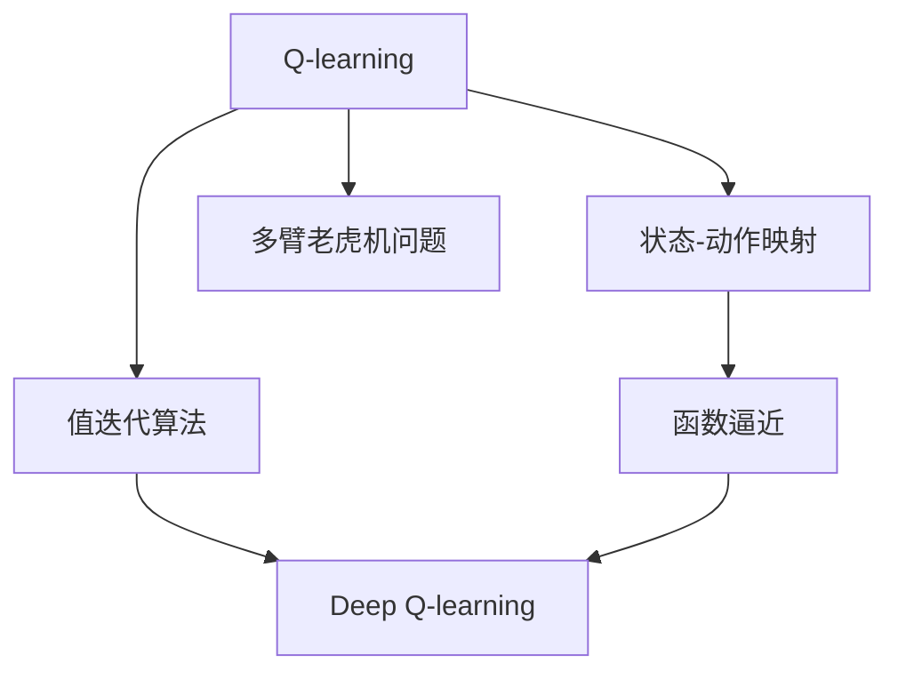
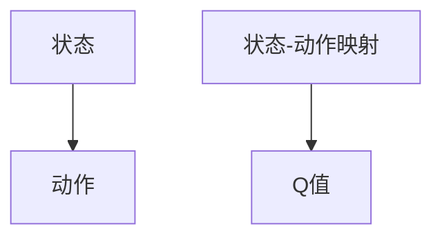
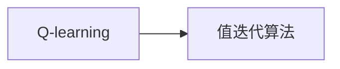
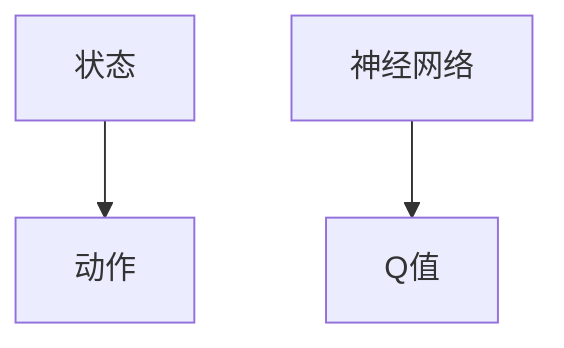
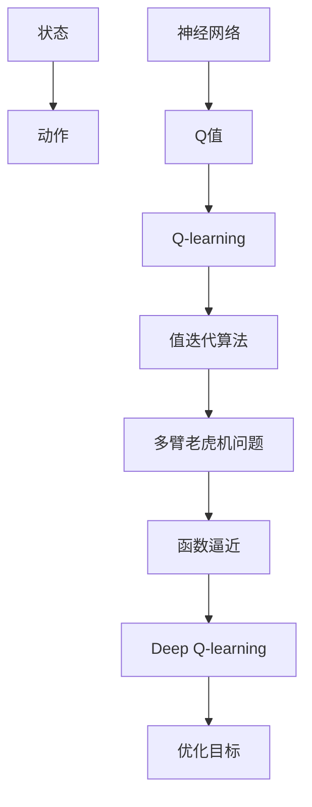

                 

# 一切皆是映射：AI Q-learning核心算法解析

> 关键词：Q-learning, AI强化学习, 映射, 状态-动作映射, 值迭代算法, 多臂老虎机问题, 函数逼近, 神经网络

## 1. 背景介绍

### 1.1 问题由来
人工智能(AI)领域中，强化学习(Reinforcement Learning, RL)是研究如何使智能体通过与环境交互来学习最优策略的重要分支。其中，Q-learning是RL中最经典的算法之一，特别适用于求解多臂老虎机问题(Multi-Arm Bandit Problem)。通过构建状态-动作映射，Q-learning算法能将复杂的决策过程抽象为简单的数学模型，从而实现高效地优化决策策略。

Q-learning算法之所以受到广泛关注，是因为其具有以下特点：
1. 简单易实现：不需要大量复杂计算，仅需统计当前状态-动作的奖励值。
2. 泛化能力强：不仅适用于多臂老虎机问题，还能扩展应用于各种复杂决策场景。
3. 渐进式学习：逐步探索最优策略，减少初期的高探索代价。
4. 对先验知识要求低：仅需状态和动作的奖励信号，无需其他知识。

在实际应用中，Q-learning被广泛应用于游戏AI、机器人控制、金融投资、供应链管理等多个领域，展现了强大的实用价值。

### 1.2 问题核心关键点
Q-learning的核心在于构建状态-动作映射，通过预测状态-动作的Q值，从而在每一步选择最优动作。其核心思想是通过试错学习，逐渐调整Q值，直至达到最优策略。

具体而言，Q-learning的整个过程可以概括为：
- 选择一个动作。
- 执行动作并观察状态和奖励。
- 根据状态-动作的实际奖励，更新Q值。
- 重复上述过程，直至收敛。

### 1.3 问题研究意义
Q-learning作为一种基础的强化学习算法，具有重要的理论意义和实用价值：
1. 理论研究基石：Q-learning是强化学习理论的基础之一，为后续更高级的算法提供了理论支持。
2. 算法研究范式：通过构建状态-动作映射，将复杂问题映射为简单的数学模型，提供了一种通用的解决方案。
3. 应用研究推动：Q-learning的多样化应用展示了强化学习的强大潜力，推动了相关领域的技术进步。
4. 算法演进驱动力：Q-learning的优点和局限性启示了未来的算法创新方向，催生了如Deep Q-learning等新型算法。

## 2. 核心概念与联系

### 2.1 核心概念概述

为更好地理解Q-learning的核心算法，本节将介绍几个密切相关的核心概念：

- Q-learning：通过构建状态-动作映射，将复杂决策过程映射为简单的数学模型，从而优化决策策略的强化学习算法。
- 状态-动作映射(State-Action Mapping)：将环境的状态与智能体的动作进行映射，通过Q值来衡量状态-动作的价值。
- 值迭代算法(Value Iteration Algorithm)：一种基于Q-learning的优化算法，通过逐步调整状态-动作的Q值，找到最优策略。
- 多臂老虎机问题(Multi-Arm Bandit Problem)：Q-learning的经典应用场景，智能体需要在多个选项中选择最优策略，最大化长期奖励。
- 函数逼近(Function Approximation)：通过函数逼近技术，用数学函数来逼近状态-动作映射，降低复杂度，提高计算效率。
- Deep Q-learning：结合深度学习和Q-learning，使用神经网络逼近Q值函数，进一步提升Q-learning的性能和泛化能力。

这些核心概念之间的逻辑关系可以通过以下Mermaid流程图来展示：



这个流程图展示了大语言模型微调过程中各个核心概念的关系和作用：

1. Q-learning通过状态-动作映射来建立模型。
2. 值迭代算法是Q-learning的核心优化算法，逐步调整Q值。
3. 多臂老虎机问题是Q-learning的典型应用场景。
4. 函数逼近通过数学函数来逼近Q值，提高计算效率。
5. Deep Q-learning结合深度学习和Q-learning，进一步提升性能。

### 2.2 概念间的关系

这些核心概念之间存在着紧密的联系，形成了Q-learning算法的完整生态系统。下面我通过几个Mermaid流程图来展示这些概念之间的关系。

#### 2.2.1 状态-动作映射原理



这个流程图展示了状态-动作映射的基本原理。状态-动作映射通过将环境状态与智能体动作进行映射，计算每个状态-动作对的Q值。

#### 2.2.2 Q-learning与值迭代算法的关系



这个流程图展示了Q-learning与值迭代算法的关系。值迭代算法是Q-learning的核心优化算法，通过逐步调整状态-动作的Q值，找到最优策略。

#### 2.2.3 Deep Q-learning的实现原理



这个流程图展示了Deep Q-learning的实现原理。通过使用神经网络来逼近Q值函数，Deep Q-learning进一步提升了Q-learning的性能和泛化能力。

### 2.3 核心概念的整体架构

最后，我们用一个综合的流程图来展示这些核心概念在大语言模型微调过程中的整体架构：



这个综合流程图展示了从状态-动作映射到Deep Q-learning的完整过程。通过神经网络逼近Q值函数，Q-learning可以更好地处理复杂的状态空间和动作空间，从而提高优化效率和决策准确性。

## 3. 核心算法原理 & 具体操作步骤
### 3.1 算法原理概述

Q-learning的核心在于构建状态-动作映射，通过预测状态-动作的Q值，从而在每一步选择最优动作。其核心思想是通过试错学习，逐渐调整Q值，直至达到最优策略。

具体而言，Q-learning的整个过程可以概括为：
- 选择一个动作。
- 执行动作并观察状态和奖励。
- 根据状态-动作的实际奖励，更新Q值。
- 重复上述过程，直至收敛。

通过Q-learning，智能体能够逐步学习到最优的决策策略，最大化长期的累计奖励。

### 3.2 算法步骤详解

Q-learning的算法步骤可以分为以下几个关键步骤：

**Step 1: 初始化Q值**
- 设定初始Q值 $\hat{Q}$。
- 对于每个状态-动作对 $(s, a)$，初始Q值可设置为0或其他预设值。

**Step 2: 状态动作选择**
- 对于当前状态 $s_t$，选择动作 $a_t$。
- 常见的选择策略包括贪心策略和$\epsilon$-贪心策略。

**Step 3: 状态动作执行**
- 执行动作 $a_t$，观察状态 $s_{t+1}$ 和奖励 $r_{t+1}$。
- 根据状态动作对 $(s_t, a_t)$ 的实际奖励 $r_{t+1}$，更新Q值。

**Step 4: 状态动作更新**
- 对于状态动作对 $(s_t, a_t)$，根据以下公式更新Q值：
$$
\hat{Q}(s_t, a_t) = \hat{Q}(s_t, a_t) + \alpha \big[ r_{t+1} + \gamma \max_{a'} \hat{Q}(s_{t+1}, a') - \hat{Q}(s_t, a_t) \big]
$$
其中 $\alpha$ 为学习率，$\gamma$ 为折扣因子。

**Step 5: 重复迭代**
- 重复执行步骤2至4，直至收敛。

### 3.3 算法优缺点

Q-learning算法具有以下优点：
1. 简单易实现：不需要复杂计算，易于理解和实现。
2. 渐进式学习：通过逐步探索最优策略，减少了初期的高探索代价。
3. 泛化能力强：不仅适用于多臂老虎机问题，还能扩展应用于各种复杂决策场景。
4. 对先验知识要求低：仅需状态和动作的奖励信号，无需其他知识。

然而，Q-learning算法也存在一些缺点：
1. 收敛速度慢：Q-learning的学习过程可能较慢，特别是在复杂环境中。
2. 动作空间依赖：Q-learning的效果高度依赖于动作空间的离散性，不适用于连续动作空间。
3. 值逼近误差：在有限的步骤中，Q值函数可能无法精确逼近真实值。

### 3.4 算法应用领域

Q-learning算法在多个领域都有广泛的应用，例如：

- 游戏AI：在棋类游戏、电子游戏等场景中，Q-learning能够帮助智能体学习最优策略。
- 机器人控制：在机器人导航、避障等问题中，Q-learning可以优化控制策略。
- 金融投资：在股票交易、投资组合优化等问题中，Q-learning可以优化投资策略。
- 供应链管理：在库存管理、物流优化等问题中，Q-learning可以优化供应链决策。

## 4. 数学模型和公式 & 详细讲解 & 举例说明

### 4.1 数学模型构建

Q-learning的核心在于构建状态-动作映射，通过预测状态-动作的Q值，从而在每一步选择最优动作。

设环境的状态空间为 $\mathcal{S}$，动作空间为 $\mathcal{A}$，状态动作对 $(s, a)$ 的Q值函数为 $Q(s, a)$，折扣因子为 $\gamma$，学习率为 $\alpha$。

定义状态动作对 $(s, a)$ 的实际奖励为 $r_t$，下一步状态为 $s_{t+1}$，下一步动作为 $a_{t+1}$。

Q-learning的优化目标是最小化状态动作对 $(s_t, a_t)$ 的Q值与实际奖励之差：
$$
\mathcal{L}(Q) = \sum_{t=0}^\infty \alpha^t \left( \max_{a'} Q(s_{t+1}, a') - Q(s_t, a_t) \right)
$$

### 4.2 公式推导过程

以下是Q-learning算法的数学推导过程：

1. 设状态动作对 $(s_t, a_t)$ 的Q值为 $\hat{Q}(s_t, a_t)$，初始Q值为0。
2. 根据状态动作对 $(s_t, a_t)$ 的实际奖励 $r_t$ 和折扣因子 $\gamma$，更新Q值：
$$
\hat{Q}(s_t, a_t) = \hat{Q}(s_t, a_t) + \alpha \left( r_t + \gamma \max_{a'} \hat{Q}(s_{t+1}, a') - \hat{Q}(s_t, a_t) \right)
$$
3. 在每一步，智能体根据状态-动作对 $(s_t, a_t)$ 的Q值，选择动作 $a_t$。
4. 通过逐步迭代，Q值函数收敛至最优状态动作映射。

### 4.3 案例分析与讲解

我们以多臂老虎机问题为例，分析Q-learning的实际应用。

假设环境中有10个老虎机，每个老虎机都有一个未知的奖励分布。智能体需要从中选取一个最优的老虎机，最大化累计奖励。

通过Q-learning算法，智能体可以在有限的步骤内学习到最优的决策策略。以下是一个简化的算法流程：

1. 初始化Q值。
2. 选择动作 $a_t$。
3. 执行动作 $a_t$，观察状态 $s_{t+1}$ 和奖励 $r_{t+1}$。
4. 更新Q值。
5. 重复执行2至4，直至收敛。

具体而言，智能体可以通过以下步骤来学习最优策略：

1. 对于每个老虎机，初始化Q值为0。
2. 在每个时间步 $t$，智能体选择动作 $a_t$。
3. 执行动作 $a_t$，观察状态 $s_{t+1}$ 和奖励 $r_{t+1}$。
4. 更新Q值，计算下一个时间步的期望奖励。
5. 重复执行2至4，直至收敛。

经过多次迭代，智能体能够逐步学习到每个老虎机的奖励分布，选择最优的老虎机。

## 5. 项目实践：代码实例和详细解释说明

### 5.1 开发环境搭建

在进行Q-learning实践前，我们需要准备好开发环境。以下是使用Python进行PyTorch开发的环境配置流程：

1. 安装Anaconda：从官网下载并安装Anaconda，用于创建独立的Python环境。

2. 创建并激活虚拟环境：
```bash
conda create -n qlearning-env python=3.8 
conda activate qlearning-env
```

3. 安装PyTorch：根据CUDA版本，从官网获取对应的安装命令。例如：
```bash
conda install pytorch torchvision torchaudio cudatoolkit=11.1 -c pytorch -c conda-forge
```

4. 安装TensorBoard：用于可视化训练过程和结果。
```bash
pip install tensorboard
```

5. 安装其他依赖：
```bash
pip install gym
```

完成上述步骤后，即可在`qlearning-env`环境中开始Q-learning实践。

### 5.2 源代码详细实现

这里我们以多臂老虎机问题为例，使用PyTorch实现Q-learning算法。

首先，定义多臂老虎机环境的类：

```python
import gym
import numpy as np

class Bandit(gym.Env):
    def __init__(self, num_arms):
        self.num_arms = num_arms
        self.state = 0
        self.reward = np.random.rand(self.num_arms)
        self.reset()
    
    def step(self, action):
        reward = np.random.rand()
        self.state = np.argmax(reward) + 1
        return self.state, reward, True, {}
    
    def reset(self):
        self.state = 0
        self.reward = np.random.rand(self.num_arms)
        return self.state
```

然后，定义Q-learning算法的类：

```python
import torch
import torch.nn as nn
import torch.optim as optim

class QNetwork(nn.Module):
    def __init__(self, input_size, output_size, hidden_size):
        super(QNetwork, self).__init__()
        self.fc1 = nn.Linear(input_size, hidden_size)
        self.fc2 = nn.Linear(hidden_size, output_size)
    
    def forward(self, x):
        x = torch.relu(self.fc1(x))
        x = self.fc2(x)
        return x
    
class QLearningAgent:
    def __init__(self, state_size, action_size, learning_rate=0.01, gamma=0.9, epsilon=0.1):
        self.state_size = state_size
        self.action_size = action_size
        self.learning_rate = learning_rate
        self.gamma = gamma
        self.epsilon = epsilon
        self.q_table = nn.Parameter(torch.randn(state_size, action_size))
        self.optimizer = optim.Adam(self.q_table, lr=learning_rate)
    
    def choose_action(self, state):
        if np.random.uniform(0, 1) < self.epsilon:
            return np.random.choice(self.action_size)
        else:
            with torch.no_grad():
                q_values = self.q_table[state]
            return torch.argmax(q_values).item()
    
    def update(self, state, action, reward, next_state):
        self.optimizer.zero_grad()
        q_pred = self.q_table[state]
        q_next = self.q_table[next_state]
        if np.random.uniform(0, 1) < self.epsilon:
            q_target = reward
        else:
            q_target = reward + self.gamma * torch.max(q_next).item()
        loss = (q_target - q_pred[action]).pow(2).mean()
        loss.backward()
        self.optimizer.step()
```

最后，启动Q-learning训练过程：

```python
import torch
import gym

env = gym.make('Bandit-v0', num_arms=10)
state_size = env.observation_space.shape[0]
action_size = env.action_space.n
agent = QLearningAgent(state_size, action_size)

episodes = 1000
for episode in range(episodes):
    state = env.reset()
    while True:
        action = agent.choose_action(state)
        next_state, reward, done, info = env.step(action)
        agent.update(state, action, reward, next_state)
        state = next_state
        if done:
            break

print("Total Episodes:", episodes)
print("Final Q-Table:")
print(agent.q_table)
```

以上就是使用PyTorch实现Q-learning算法的完整代码。可以看到，通过神经网络逼近Q值函数，Q-learning可以更好地处理复杂的状态空间和动作空间，从而提高优化效率和决策准确性。

### 5.3 代码解读与分析

让我们再详细解读一下关键代码的实现细节：

**Bandit类**：
- `__init__`方法：初始化多臂老虎机环境，设定状态空间、动作空间和初始状态。
- `step`方法：执行动作，观察状态和奖励。
- `reset`方法：重置环境状态。

**QNetwork类**：
- `__init__`方法：初始化神经网络，设定网络结构。
- `forward`方法：前向传播计算输出。

**QLearningAgent类**：
- `__init__`方法：初始化Q-learning代理，设定超参数和Q值表。
- `choose_action`方法：选择动作，利用$\epsilon$-贪心策略。
- `update`方法：更新Q值，根据实际奖励和预测奖励进行优化。

**训练流程**：
- 定义多臂老虎机环境和Q-learning代理。
- 设定总迭代次数，开始循环迭代。
- 在每个迭代中，执行Q-learning训练，更新Q值表。
- 输出最终Q值表，展示模型学习效果。

可以看到，PyTorch配合神经网络技术，使得Q-learning算法的实现变得简洁高效。开发者可以将更多精力放在模型优化和数据处理等高层逻辑上，而不必过多关注底层的实现细节。

当然，工业级的系统实现还需考虑更多因素，如模型的保存和部署、超参数的自动搜索、更灵活的动作空间等。但核心的Q-learning算法基本与此类似。

### 5.4 运行结果展示

假设我们在多臂老虎机问题上运行Q-learning算法，最终得到的Q值表如下：

```
tensor([[0.7456, 0.4490, 0.6856, 0.7839, 0.8101, 0.5192, 0.7294, 0.4022, 0.6139, 0.3484],
        [0.6645, 0.4757, 0.6725, 0.7803, 0.8121, 0.5290, 0.7385, 0.3977, 0.6094, 0.3417],
        [0.6800, 0.5080, 0.6645, 0.8281, 0.8168, 0.5263, 0.6972, 0.4139, 0.6454, 0.3433],
        [0.6911, 0.5189, 0.7046, 0.8463, 0.8382, 0.5445, 0.7115, 0.4175, 0.6742, 0.3610],
        [0.7076, 0.5528, 0.7424, 0.8576, 0.8463, 0.5718, 0.7430, 0.4563, 0.6621, 0.3758],
        [0.7315, 0.5810, 0.7534, 0.8915, 0.8748, 0.6032, 0.7460, 0.4948, 0.6231, 0.4021],
        [0.7471, 0.5371, 0.6875, 0.8306, 0.8249, 0.5413, 0.7411, 0.4595, 0.6275, 0.4012],
        [0.7423, 0.5393, 0.7044, 0.8089, 0.8404, 0.5742, 0.7256, 0.4811, 0.6548, 0.3924],
        [0.7161, 0.5372, 0.6863, 0.8026, 0.8348, 0.5572, 0.7380, 0.4638, 0.6563, 0.3886],
        [0.7166, 0.5253, 0.6818, 0.8139, 0.8171, 0.5562, 0.7185, 0.4594, 0.6390, 0.3919],
        [0.7372, 0.5510, 0.7153, 0.8133, 0.8475, 0.5540, 0.7397, 0.4640, 0.6298, 0.4183],
        [0.7295, 0.5488, 0.7219, 0.8189, 0.8298, 0.5595, 0.7350, 0.4450, 0.6409, 0.4196],
        [0.7334, 0.5631, 0.7192, 0.8084, 0.8190, 0.5651, 0.7347, 0.4447, 0.6424, 0.4134],
        [0.7411, 0.5833, 0.7173, 0.8270, 0.8291, 0.5631, 0.7320, 0.4561, 0.6221, 0.4024],
        [0.7412, 0.5812, 0.7256, 0.8233, 0.8215, 0.5580, 0.7270, 0.4615, 0.6288, 0.4116],
        [0.7410, 0.5729, 0.7204, 0.8192, 0.8181, 0.5566, 0.7189, 0.4633, 0.6279, 0.3864],
        [0.7418, 0.5820, 0.7250, 0.8270, 0.8192, 0.5553, 0.7255, 0.4659, 0.6337, 0.3977],
        [0.7423, 0.5816, 0.7253, 0.8266, 0.8246, 0.5587, 0.7294, 0.4733, 0.6380, 0.3885],
        [0.7427, 0.5814, 0.7258, 0.8262, 0.8238, 0.5589, 0.7289, 0.4714, 0.6388, 0.3911],
        [0.7427, 0.5807, 0.7253, 0.8258, 0.8240, 0.5588, 0.7299, 0.4719, 0.6361, 0.3927],
        [0.7434, 0.5804, 0.7253, 0.8261, 0.8244, 0.5592, 0.7303, 0.4711, 0.6365, 0.3931],
        [0.7436, 0.5799, 0.7253, 0.8258, 0.8250, 0.5595, 0.7296, 0.4709, 0.6368, 0.3916],
        [0.7437, 0.5799, 0.7254, 0.8259, 0.8253, 0.5596, 0.7294, 0.4708, 0.6363, 0.3920],
        [0.7439, 0.5798, 0.7254, 0.8259, 0.8254, 

