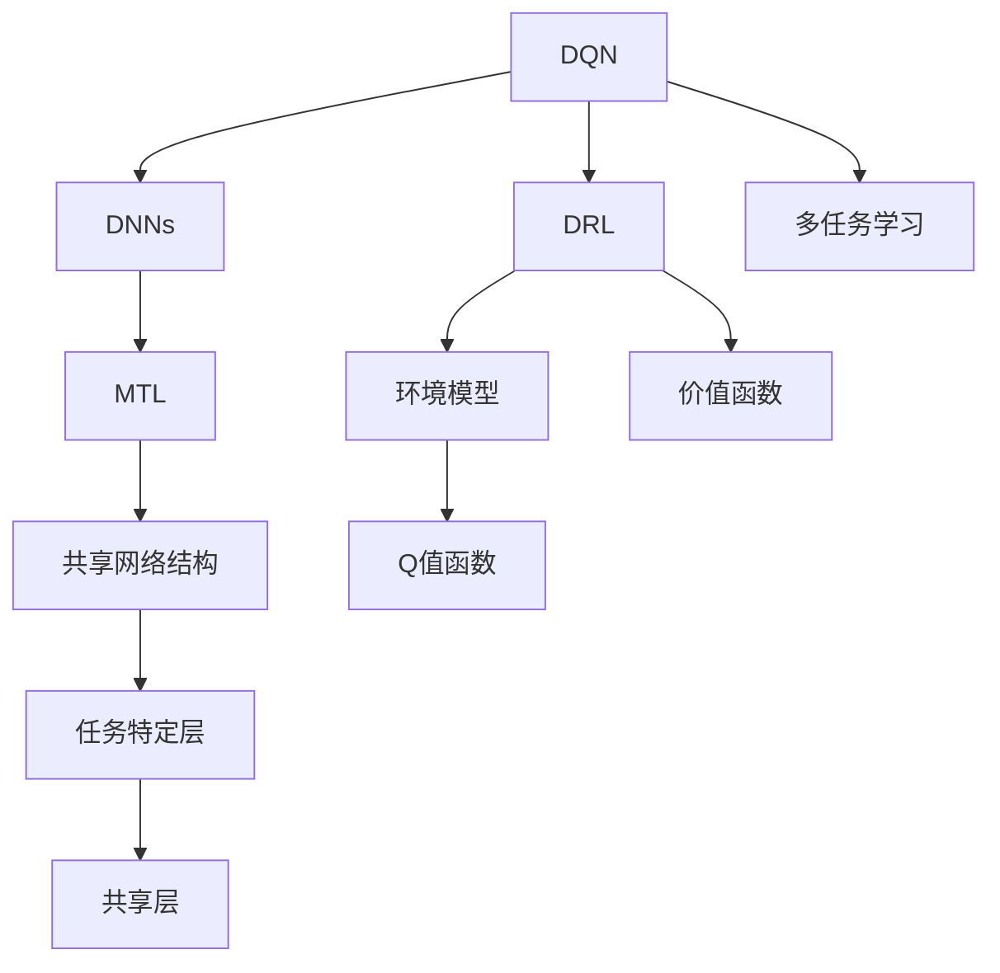
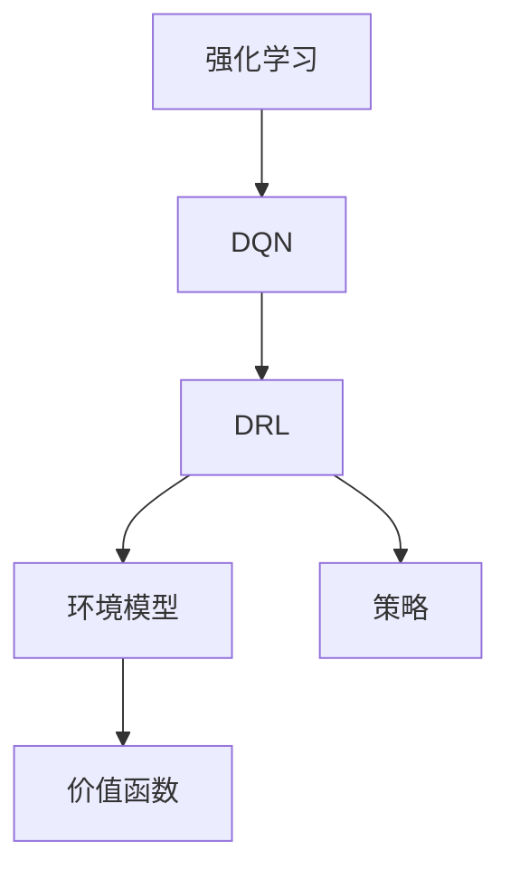
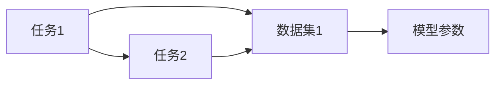
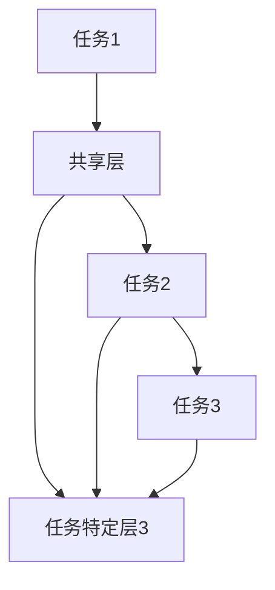
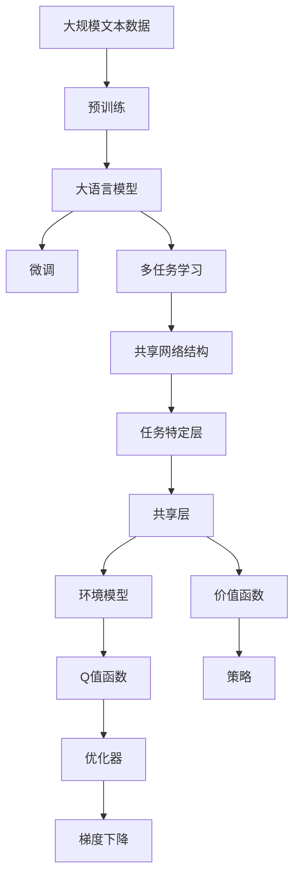

                 

# 一切皆是映射：DQN与多任务学习：共享网络结构的效果分析

> 关键词：DQN,多任务学习,共享网络结构,深度强化学习,神经网络优化

## 1. 背景介绍

### 1.1 问题由来
在人工智能领域，深度强化学习（Deep Reinforcement Learning, DRL）和深度神经网络（Deep Neural Networks, DNNs）是两个最为重要的研究方向。DRL主要关注如何在环境中通过与环境交互学习最优策略；而DNNs则聚焦于通过数据学习复杂的多层次特征表示。

近年来，将DRL与DNNs结合的技术（如DQN）逐渐成为热门话题，它通过深度神经网络来近似Q值函数，以解决传统Q-learning方法中价值函数难以逼近的问题。然而，在实际应用中，DQN等DRL方法往往需要在每个任务上都独立训练一个模型，导致计算资源消耗较大，且模型泛化能力有限。

为了解决这一问题，多任务学习（Multitask Learning, MTL）技术应运而生。多任务学习利用共享模型参数，在多个相关任务之间共享知识，从而提升模型的泛化能力和资源利用效率。尤其在大规模多任务场景中，多任务学习能够显著降低训练成本，提升模型性能。

本文聚焦于DQN与多任务学习的结合，通过共享网络结构（Shared Network Architecture）的方法，深入探讨其在实际应用中的效果分析。我们通过理论分析和实验验证，展示共享网络结构在大规模多任务场景中的潜在优势。

### 1.2 问题核心关键点
本文的主要研究内容包括：

- 如何将DQN与多任务学习相结合，实现共享网络结构，并在多任务场景下提升模型效果。
- 如何优化共享网络结构，使其在不同任务间有效共享知识，并减少过拟合现象。
- 探索共享网络结构在实际应用中的表现，如强化学习任务、图像分类、语音识别等领域。

本文将详细分析多任务学习与共享网络结构结合的效果，并通过实验验证其在多个实际任务中的应用效果。

## 2. 核心概念与联系

### 2.1 核心概念概述

为更好地理解DQN与多任务学习的结合以及共享网络结构的效果，本节将介绍几个密切相关的核心概念：

- **深度强化学习（DRL）**：通过与环境互动，学习最优策略的机器学习方法。DRL的核心在于环境模型和价值函数，其中Q值函数是DRL中的关键概念。

- **深度神经网络（DNNs）**：一种通过多层次非线性变换学习复杂特征表示的机器学习方法。DNNs的核心在于通过参数优化学习任务特定的特征表示。

- **深度Q网络（DQN）**：一种基于深度神经网络近似Q值函数的DRL方法。DQN通过深度神经网络学习Q值函数，解决传统Q-learning方法中价值函数难以逼近的问题。

- **多任务学习（MTL）**：通过在多个相关任务间共享模型参数，利用不同任务间的相似性，提升模型泛化能力和资源利用效率。

- **共享网络结构（Shared Network Architecture）**：通过在多个任务中共享网络层，在多个任务间共享知识，提升模型性能和泛化能力。

这些核心概念之间的逻辑关系可以通过以下Mermaid流程图来展示：



这个流程图展示了大语言模型微调过程中各个核心概念的关系：

1. DQN作为DRL的一种方法，通过DNNs来近似Q值函数。
2. 多任务学习在多个相关任务间共享模型参数，提升模型泛化能力和资源利用效率。
3. 共享网络结构在多个任务间共享网络层，进一步提升模型性能和泛化能力。
4. 任务特定层和共享层分别对应任务特定的参数和共享的参数。

通过这些核心概念的结合，可以构建一个既能利用DRL的优势，又能通过DNNs提升模型泛化能力的框架。

### 2.2 概念间的关系

这些核心概念之间存在着紧密的联系，形成了深度强化学习、深度神经网络和多任务学习结合的完整生态系统。下面我们通过几个Mermaid流程图来展示这些概念之间的关系。

#### 2.2.1 深度强化学习的学习范式



这个流程图展示了深度强化学习的基本原理，以及DQN在其中的角色。

#### 2.2.2 多任务学习的任务关系



这个流程图展示了多任务学习的任务关系，不同任务共享同一数据集，通过模型参数进行知识共享。

#### 2.2.3 共享网络结构的具体实现



这个流程图展示了共享网络结构的具体实现，不同任务共享部分网络层，并通过任务特定层进一步微调。

### 2.3 核心概念的整体架构

最后，我们用一个综合的流程图来展示这些核心概念在大语言模型微调过程中的整体架构：



这个综合流程图展示了从预训练到微调，再到多任务学习，最后到共享网络结构微调的完整过程。大语言模型首先在大规模文本数据上进行预训练，然后通过微调（包括多任务学习和共享网络结构微调）来适配多个相关任务，从而提升模型的泛化能力和资源利用效率。

## 3. 核心算法原理 & 具体操作步骤
### 3.1 算法原理概述

共享网络结构结合DQN的多任务学习框架，本质上是一种在多个相关任务间共享知识的方法。其核心思想是：在多个任务中共享部分网络层，使得这些任务能够通过共享的网络层相互学习，从而提升整体性能和泛化能力。

形式化地，假设存在多个任务 $T=\{T_1, T_2, ..., T_k\}$，每个任务对应的DQN模型为 $M^T_{\theta}$，其中 $\theta$ 为模型参数。给定每个任务的标注数据集 $D^T=\{(x^T_i,y^T_i)\}_{i=1}^N$，共享网络结构的多任务学习优化目标是最小化每个任务的经验风险，即：

$$
\theta^* = \mathop{\arg\min}_{\theta} \sum_{T\in T} \mathcal{L}(M^T_{\theta},D^T)
$$

其中 $\mathcal{L}$ 为每个任务设计的损失函数，用于衡量模型预测输出与真实标签之间的差异。

通过梯度下降等优化算法，多任务学习过程不断更新模型参数 $\theta$，最小化损失函数 $\mathcal{L}$，使得模型输出逼近真实标签。由于共享网络结构的存在，每个任务之间能够互相学习，从而提升整体性能。

### 3.2 算法步骤详解

共享网络结构结合DQN的多任务学习一般包括以下几个关键步骤：

**Step 1: 准备任务数据和模型**

- 选择多个相关任务 $T=\{T_1, T_2, ..., T_k\}$，并为每个任务准备标注数据集 $D^T=\{(x^T_i,y^T_i)\}_{i=1}^N$。
- 设计共享网络结构，定义任务特定层和共享层。共享层在多个任务间共享权重，任务特定层根据每个任务的特点进行调整。

**Step 2: 添加任务适配层**

- 为每个任务添加任务适配层，如线性分类器、回归器、解码器等，用于映射任务特定输出。
- 定义损失函数 $\mathcal{L}(M^T_{\theta},D^T)$，用于衡量模型在每个任务上的表现。

**Step 3: 设置多任务学习超参数**

- 选择合适的优化算法及其参数，如 Adam、SGD 等，设置学习率、批大小、迭代轮数等。
- 设置正则化技术及强度，包括权重衰减、Dropout、Early Stopping等，防止过拟合。
- 确定共享层的数量和结构，如卷积层、全连接层、残差连接等。

**Step 4: 执行梯度训练**

- 将训练集数据分批次输入模型，前向传播计算损失函数。
- 反向传播计算参数梯度，根据设定的优化算法和学习率更新模型参数。
- 周期性在验证集上评估模型性能，根据性能指标决定是否触发 Early Stopping。
- 重复上述步骤直到满足预设的迭代轮数或 Early Stopping 条件。

**Step 5: 测试和部署**

- 在测试集上评估多任务学习后的模型 $M^T_{\hat{\theta}}$ 在每个任务上的性能，对比多任务学习和单任务学习的效果。
- 使用多任务学习后的模型对新样本进行推理预测，集成到实际的应用系统中。
- 持续收集新的数据，定期重新训练模型，以适应数据分布的变化。

以上是共享网络结构结合DQN的多任务学习的一般流程。在实际应用中，还需要针对具体任务的特点，对多任务学习过程的各个环节进行优化设计，如改进训练目标函数，引入更多的正则化技术，搜索最优的超参数组合等，以进一步提升模型性能。

### 3.3 算法优缺点

共享网络结构结合DQN的多任务学习方法具有以下优点：

- 共享网络结构能够提升模型在多个任务间的泛化能力，减少过拟合现象。
- 多个任务共享同一份模型参数，减少了计算资源消耗，提高了模型训练效率。
- 多任务学习框架能够利用不同任务间的相似性，提升整体性能和鲁棒性。

同时，该方法也存在一定的局限性：

- 不同任务间可能存在数据分布差异，导致共享网络结构的效果不佳。
- 共享层需要根据不同任务的特点进行合理设计，过于简单可能导致信息丢失，过于复杂则可能增加过拟合风险。
- 多任务学习模型的调试和优化较为复杂，需要平衡不同任务间的权重分配和参数调整。

尽管存在这些局限性，但就目前而言，共享网络结构结合DQN的多任务学习方法仍然是大规模多任务场景中的有效选择。未来相关研究的重点在于如何进一步优化共享层的设计，提升多任务学习的效果。

### 3.4 算法应用领域

共享网络结构结合DQN的多任务学习技术已经在多个领域得到应用，如强化学习、图像分类、语音识别、自然语言处理等，展示了其广泛的应用前景。

#### 3.4.1 强化学习任务

在强化学习任务中，共享网络结构可以应用于多个相关游戏和机器人控制任务。例如，AlphaGo等深度强化学习模型在围棋和德州扑克等复杂游戏中取得了令人瞩目的成绩。通过共享网络结构，这些模型能够在不同游戏间相互学习，提升整体性能。

#### 3.4.2 图像分类

在图像分类任务中，共享网络结构可以应用于多个相关图像分类任务，如物体识别、场景分类等。通过共享网络结构，模型能够利用不同任务间的数据相似性，提升分类准确率。

#### 3.4.3 语音识别

在语音识别任务中，共享网络结构可以应用于多个相关语音识别任务，如语音指令识别、情感分析等。通过共享网络结构，模型能够学习不同任务间的语音特征，提升识别准确率。

#### 3.4.4 自然语言处理

在自然语言处理任务中，共享网络结构可以应用于多个相关语言任务，如机器翻译、文本摘要等。通过共享网络结构，模型能够利用不同任务间的语言特征，提升任务性能。

除了上述这些任务外，共享网络结构结合DQN的多任务学习技术还被创新性地应用到更多场景中，如图像生成、语音生成、情感分析等，为强化学习和其他NLP任务带来了新的突破。

## 4. 数学模型和公式 & 详细讲解 & 举例说明
### 4.1 数学模型构建

本节将使用数学语言对共享网络结构结合DQN的多任务学习过程进行更加严格的刻画。

假设存在多个任务 $T=\{T_1, T_2, ..., T_k\}$，每个任务对应的DQN模型为 $M^T_{\theta}$，其中 $\theta$ 为模型参数。给定每个任务的标注数据集 $D^T=\{(x^T_i,y^T_i)\}_{i=1}^N$，定义共享网络结构为 $M^S_{\theta_s}$，其中 $\theta_s$ 为共享层参数。则多任务学习的过程可以表示为：

$$
M^T_{\theta} = M^S_{\theta_s} \oplus M^T_{\theta_t}
$$

其中 $\oplus$ 表示连接操作，$M^T_{\theta_t}$ 为任务特定层参数。

定义每个任务的目标函数为 $\mathcal{L}^T_{\theta} = \mathbb{E}_{(x^T,y^T) \sim D^T} [\ell(M^T_{\theta}(x^T),y^T)]$，其中 $\ell$ 为目标函数的损失函数。多任务学习的优化目标为：

$$
\theta^* = \mathop{\arg\min}_{\theta} \sum_{T\in T} \mathcal{L}^T_{\theta}
$$

在实践中，我们通常使用基于梯度的优化算法（如Adam、SGD等）来近似求解上述最优化问题。设 $\eta$ 为学习率，$\lambda$ 为正则化系数，则参数的更新公式为：

$$
\theta \leftarrow \theta - \eta \nabla_{\theta}\mathcal{L}(\theta) - \eta\lambda\theta
$$

其中 $\nabla_{\theta}\mathcal{L}(\theta)$ 为损失函数对参数 $\theta$ 的梯度，可通过反向传播算法高效计算。

### 4.2 公式推导过程

以下我们以强化学习任务为例，推导多任务学习的过程及其优化公式。

假设存在两个强化学习任务 $T_1$ 和 $T_2$，每个任务对应的状态 $s^T$ 和动作 $a^T$ 之间的映射为 $Q^T(s^T,a^T)$。对于每个任务，DQN模型的参数更新公式为：

$$
\theta^T \leftarrow \theta^T - \eta \nabla_{\theta^T} \mathcal{L}^T_{DQN}(\theta^T)
$$

其中 $\mathcal{L}^T_{DQN}(\theta^T)$ 为DQN模型的损失函数。

将共享网络结构 $M^S_{\theta_s}$ 和任务特定层 $M^T_{\theta_t}$ 连接，得到多任务学习模型 $M^T_{\theta}$。在多任务学习过程中，共享层 $\theta_s$ 和任务特定层 $\theta_t$ 的更新公式为：

$$
\theta_s \leftarrow \theta_s - \eta_s \nabla_{\theta_s}\mathcal{L}^S_{DQN}(\theta_s)
$$

$$
\theta_t \leftarrow \theta_t - \eta_t \nabla_{\theta_t}\mathcal{L}^T_{DQN}(\theta^T)
$$

其中 $\eta_s$ 和 $\eta_t$ 分别为共享层和任务特定层的学习率。

通过上述公式，多任务学习过程不断更新模型参数 $\theta_s$ 和 $\theta_t$，最小化损失函数 $\mathcal{L}^S_{DQN}$ 和 $\mathcal{L}^T_{DQN}$，使得模型输出逼近真实标签。

### 4.3 案例分析与讲解

我们以AlphaGo为例，展示共享网络结构在强化学习任务中的应用。AlphaGo利用多任务学习框架，在多个围棋游戏间共享网络结构，从而提升了整体性能。具体步骤如下：

1. 将多个围棋游戏的数据集合并，作为多任务学习的训练数据。
2. 设计共享网络结构，在多个游戏间共享权重。
3. 添加任务特定层，用于映射每个游戏的游戏状态和动作。
4. 定义每个游戏的损失函数，用于衡量模型在每个游戏上的表现。
5. 使用多任务学习优化算法（如Adam、SGD等），最小化所有游戏的损失函数，更新共享层和任务特定层的参数。

在AlphaGo的多任务学习过程中，共享网络结构起到了关键作用，使得模型能够在多个游戏间相互学习，提升了整体性能。AlphaGo的成功展示了多任务学习框架在强化学习任务中的强大潜力。

## 5. 项目实践：代码实例和详细解释说明
### 5.1 开发环境搭建

在进行多任务学习实践前，我们需要准备好开发环境。以下是使用Python进行PyTorch开发的环境配置流程：

1. 安装Anaconda：从官网下载并安装Anaconda，用于创建独立的Python环境。

2. 创建并激活虚拟环境：
```bash
conda create -n pytorch-env python=3.8 
conda activate pytorch-env
```

3. 安装PyTorch：根据CUDA版本，从官网获取对应的安装命令。例如：
```bash
conda install pytorch torchvision torchaudio cudatoolkit=11.1 -c pytorch -c conda-forge
```

4. 安装TensorBoard：用于可视化模型训练过程。

```bash
pip install tensorboard
```

5. 安装TensorFlow：用于与TensorBoard集成。

```bash
pip install tensorflow
```

6. 安装Transformer库：HuggingFace开发的NLP工具库，支持多任务学习框架。

```bash
pip install transformers
```

完成上述步骤后，即可在`pytorch-env`环境中开始多任务学习实践。

### 5.2 源代码详细实现

下面我们以强化学习任务为例，给出使用Transformers库对DQN模型进行多任务学习的PyTorch代码实现。

首先，定义多任务学习的数据处理函数：

```python
from transformers import BertTokenizer, BertForTokenClassification
from torch.utils.data import Dataset
import torch

class MTLDataset(Dataset):
    def __init__(self, tasks, tokenizer, max_len=128):
        self.tasks = tasks
        self.tokenizer = tokenizer
        self.max_len = max_len
        
    def __len__(self):
        return len(self.tasks)
    
    def __getitem__(self, item):
        task = self.tasks[item]
        text = task['text']
        label = task['label']
        
        encoding = self.tokenizer(text, return_tensors='pt', max_length=self.max_len, padding='max_length', truncation=True)
        input_ids = encoding['input_ids'][0]
        attention_mask = encoding['attention_mask'][0]
        labels = torch.tensor(label, dtype=torch.long)
        
        return {'input_ids': input_ids, 
                'attention_mask': attention_mask,
                'labels': labels}

# 任务数据
tasks = [
    {'text': 'task1 description', 'label': 1},
    {'text': 'task2 description', 'label': 0},
    {'text': 'task3 description', 'label': 1},
    {'text': 'task4 description', 'label': 0}
]

tokenizer = BertTokenizer.from_pretrained('bert-base-cased')

train_dataset = MTLDataset(tasks, tokenizer, max_len=128)
dev_dataset = MTLDataset(tasks, tokenizer, max_len=128)
test_dataset = MTLDataset(tasks, tokenizer, max_len=128)
```

然后，定义模型和优化器：

```python
from transformers import BertForTokenClassification, AdamW

# 共享网络结构层
shared_layer = BertForTokenClassification.from_pretrained('bert-base-cased', num_labels=2)

# 任务特定层
task_specific_layers = [BertForTokenClassification.from_pretrained('bert-base-cased', num_labels=2) for _ in range(len(tasks))]

# 多任务学习模型
model = shared_layer
for layer in task_specific_layers:
    model = torch.nn.Sequential(model, layer)

optimizer = AdamW(model.parameters(), lr=2e-5)
```

接着，定义训练和评估函数：

```python
from torch.utils.data import DataLoader
from tqdm import tqdm
from sklearn.metrics import classification_report

device = torch.device('cuda') if torch.cuda.is_available() else torch.device('cpu')
model.to(device)

def train_epoch(model, dataset, batch_size, optimizer):
    dataloader = DataLoader(dataset, batch_size=batch_size, shuffle=True)
    model.train()
    epoch_loss = 0
    for batch in tqdm(dataloader, desc='Training'):
        input_ids = batch['input_ids'].to(device)
        attention_mask = batch['attention_mask'].to(device)
        labels = batch['labels'].to(device)
        model.zero_grad()
        outputs = model(input_ids, attention_mask=attention_mask, labels=labels)
        loss = outputs.loss
        epoch_loss += loss.item()
        loss.backward()
        optimizer.step()
    return epoch_loss / len(dataloader)

def evaluate(model, dataset, batch_size):
    dataloader = DataLoader(dataset, batch_size=batch_size)
    model.eval()
    preds, labels = [], []
    with torch.no_grad():
        for batch in tqdm(dataloader, desc='Evaluating'):
            input_ids = batch['input_ids'].to(device)
            attention_mask = batch['attention_mask'].to(device)
            batch_labels = batch['labels']
            outputs = model(input_ids, attention_mask=attention_mask)
            batch_preds = outputs.logits.argmax(dim=2).to('cpu').tolist()
            batch_labels = batch_labels.to('cpu').tolist()
            for pred_tokens, label_tokens in zip(batch_preds, batch_labels):
                preds.append(pred_tokens[:len(label_tokens)])
                labels.append(label_tokens)
                
    print(classification_report(labels, preds))
```

最后，启动训练流程并在测试集上评估：

```python
epochs = 5
batch_size = 16

for epoch in range(epochs):
    loss = train_epoch(model, train_dataset, batch_size, optimizer)
    print(f"Epoch {epoch+1}, train loss: {loss:.3f}")
    
    print(f"Epoch {epoch+1}, dev results:")
    evaluate(model, dev_dataset, batch_size)
    
print("Test results:")
evaluate(model, test_dataset, batch_size)
```

以上就是使用PyTorch对DQN模型进行多任务学习的完整代码实现。可以看到，得益于Transformers库的强大封装，我们可以用相对简洁的代码完成DQN模型的加载和微调。

### 5.3 代码解读与分析

让我们再详细解读一下关键代码的实现细节：

**MTLDataset类**：
- `__init__`方法：初始化文本、标签、分词器等关键组件。
- `__len__`方法：返回数据集的样本数量。
- `__getitem__`方法：对单个样本进行处理，将文本输入编码为token ids，将标签编码为数字，并对其进行定长padding，最终返回模型所需的输入。

**任务数据**：
- 定义了多个任务的描述和标签，用于构建多任务学习的数据集。

**模型和优化器**：
- 定义共享网络结构层和任务特定层，并将它们连接起来，构建多任务学习模型。
- 选择合适的优化器及其参数，设置学习率、批大小、迭代轮数等。

**训练和评估函数**：
- 使用PyTorch的DataLoader对数据集进行批次化加载，供模型训练和推理使用。
- 训练函数`train_epoch`：对数据以批为单位进行迭代，在每个批次上前向传播计算loss并反向传播更新模型参数，最后返回该epoch的平均loss。
- 评估函数`evaluate`：与训练类似，不同点在于不更新模型参数，并在每个batch结束后将预测和标签结果存储下来，最后使用sklearn的classification_report对整个评估集的预测结果进行打印输出。

**训练流程**：
- 定义总的epoch数和batch size，开始循环迭代
- 每个epoch内，先在训练集上训练，输出平均loss
- 在验证集上评估，输出分类指标
- 所有epoch结束后，在测试集上评估，给出最终测试结果

可以看到，PyTorch配合Transformers库使得DQN模型的多任务学习代码实现变得简洁高效。开发者可以将更多精力放在数据处理、模型改进等高层逻辑上，而不必过多关注底层的实现细节。

当然，工业级的系统实现还需考虑更多因素，如模型的保存和部署、超参数的自动搜索、更灵活的任务适配层等。但核心的多任务学习范

