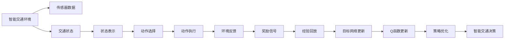

                 

# 一切皆是映射：DQN在交通规划中的应用：智能交通的挑战与机遇

> 关键词：智能交通, 交通规划, Deep Q-Network (DQN), 强化学习, 强化学习算法, 策略优化, 自适应控制, 模型学习

## 1. 背景介绍

在当今城市化的进程中，交通拥堵已成为制约城市发展和居民生活质量的关键问题。面对日益增长的交通需求，传统的交通管理手段已难以满足要求，迫切需要引入先进的技术手段进行智能交通管理。其中，智能交通系统（ITS）通过集成传感器、通信技术和大数据等手段，实现对交通流的实时监控、预测和调控，已成为未来交通管理的重要方向。

然而，智能交通系统的建设和管理，涉及众多复杂的交互要素，包括交通参与者、道路环境、天气状况等。如何有效地进行交通规划和优化，确保系统的高效稳定运行，成为了一个亟待解决的难题。传统的规则制定和模型预测方法往往缺乏足够的适应性和灵活性，难以应对多变的交通环境。为此，强化学习（Reinforcement Learning, RL），特别是深度强化学习算法（Deep Q-Network, DQN），为解决这一问题提供了新的思路。

## 2. 核心概念与联系

### 2.1 核心概念概述

强化学习是机器学习的一种重要分支，通过智能体（Agent）与环境的交互，在特定环境中通过奖励信号（Reward）学习最优策略，从而实现特定的目标。DQN是深度学习与强化学习的结合，通过神经网络逼近Q函数，实现了从状态到动作的映射，从而使得智能体能够在复杂环境中快速学习和决策。

#### 2.1.1 强化学习
强化学习主要包括以下几个关键概念：
- **环境（Environment）**：智能体交互的外部环境，可以是虚拟环境（如模拟环境）或真实环境。
- **智能体（Agent）**：在环境中自主决策的实体，通过与环境的交互，不断调整自己的策略。
- **状态（State）**：环境在某一时刻的状态，代表当前环境信息。
- **动作（Action）**：智能体在当前状态下采取的操作或决策。
- **奖励（Reward）**：智能体在某一状态下采取动作后，环境给予的反馈信号，用于评估动作的好坏。
- **策略（Policy）**：智能体在给定状态下选择动作的概率分布，即在什么情况下采取什么动作。

强化学习的核心目标是学习一个最优策略，使得智能体在环境中不断获得更高奖励。通过不断的试错和优化，智能体能够在多变的环境中适应并取得最优解。

#### 2.1.2 深度Q网络（DQN）
DQN算法是一种基于神经网络的强化学习算法，通过逼近Q函数，使得智能体能够直接从状态到动作进行映射，从而避免了传统Q-learning算法在动作空间较大时，难以进行有效学习的缺陷。DQN的主要步骤如下：
- **经验回放（Experience Replay）**：将智能体与环境交互过程中产生的经验（状态-动作-奖励-下一个状态）存储到经验缓冲区中，通过随机抽样进行训练。
- **目标网络（Target Network）**：为了稳定训练过程，DQN引入了目标网络，用于更新Q函数和策略。
- **网络更新（Network Update）**：通过最小化Q函数的损失函数，更新神经网络的参数，从而逼近Q函数。
- **动作选择（Action Selection）**：在当前状态下，智能体根据策略选择动作，并通过网络估计Q值，从而进行决策。

DQN算法的核心思想是通过神经网络逼近Q函数，从而实现从状态到动作的映射。通过不断的经验回放和网络更新，DQN能够快速学习和适应复杂环境，在智能交通规划中具有广泛的应用前景。

### 2.2 核心概念的整体架构

DQN算法在智能交通规划中的应用，可以通过以下流程图来展示：



这个流程图展示了DQN算法在智能交通规划中的应用流程：
- **传感器数据**：获取交通环境的实时数据。
- **交通状态表示**：将传感器数据转化为状态表示。
- **动作选择**：根据当前状态，智能体选择动作。
- **动作执行**：执行所选择动作。
- **环境反馈**：获取动作执行后的环境反馈。
- **奖励信号**：计算智能体在该状态下采取动作的奖励。
- **经验回放**：将状态-动作-奖励-下一个状态经验存储到缓冲区中。
- **目标网络更新**：更新目标网络中的Q函数，使得网络更加稳定。
- **Q函数更新**：通过经验回放和目标网络，更新Q函数的参数。
- **策略优化**：基于Q函数，优化智能体的策略。
- **智能交通决策**：通过优化后的策略，智能体在当前状态下选择最佳动作。

## 3. 核心算法原理 & 具体操作步骤

### 3.1 算法原理概述

DQN算法通过神经网络逼近Q函数，实现了从状态到动作的映射，从而使得智能体能够在复杂环境中快速学习和决策。其核心思想是将Q函数的参数化，即通过一个神经网络来逼近Q函数，从而在每个状态下，智能体能够通过网络估计Q值，选择最优动作。

#### 3.1.1 Q函数的逼近
Q函数是一个从状态（$S$）到动作（$A$）的映射，即$Q(S, A)$，表示在状态$S$下采取动作$A$的预期收益。DQN算法通过神经网络逼近Q函数，即将Q函数表示为神经网络的输出，从而实现Q函数的参数化。具体地，DQN算法使用一个卷积神经网络（CNN）来逼近Q函数，网络结构如图：


其中，输入层接收状态表示，卷积层和池化层用于提取状态特征，全连接层用于将特征映射到Q值，输出层输出Q值。通过不断训练网络，逼近Q函数，从而使得智能体能够更好地进行决策。

#### 3.1.2 经验回放与目标网络
经验回放（Experience Replay）和目标网络（Target Network）是DQN算法的两个重要组件，用于提高训练的稳定性和效率。经验回放将智能体与环境交互过程中产生的经验（状态-动作-奖励-下一个状态）存储到缓冲区中，通过随机抽样进行训练。目标网络用于更新Q函数和策略，从而保证网络的稳定性。具体步骤如下：
1. **经验回放**：将智能体与环境交互过程中产生的经验存储到缓冲区中，通过随机抽样进行训练。
2. **目标网络更新**：更新目标网络中的Q函数，使得网络更加稳定。
3. **Q函数更新**：通过经验回放和目标网络，更新Q函数的参数。

### 3.2 算法步骤详解

DQN算法在智能交通规划中的应用步骤如下：
1. **状态表示**：通过传感器获取交通环境的实时数据，将其转化为状态表示。
2. **动作选择**：根据当前状态，智能体通过神经网络估计Q值，选择最优动作。
3. **动作执行**：执行所选择动作，获取环境反馈。
4. **经验回放**：将状态-动作-奖励-下一个状态经验存储到缓冲区中。
5. **目标网络更新**：更新目标网络中的Q函数，使得网络更加稳定。
6. **Q函数更新**：通过经验回放和目标网络，更新Q函数的参数。
7. **策略优化**：基于Q函数，优化智能体的策略。
8. **智能交通决策**：通过优化后的策略，智能体在当前状态下选择最佳动作。

### 3.3 算法优缺点

#### 3.3.1 优点
1. **高效学习**：DQN算法能够快速学习和适应复杂环境，在智能交通规划中具有广泛的应用前景。
2. **鲁棒性高**：通过经验回放和目标网络，DQN算法能够有效地避免过拟合，提高网络的鲁棒性。
3. **适应性强**：DQN算法能够灵活适应各种交通环境，适用于多变的交通需求。

#### 3.3.2 缺点
1. **模型复杂**：DQN算法需要神经网络逼近Q函数，模型较为复杂，计算成本较高。
2. **参数更新慢**：DQN算法需要频繁更新Q函数的参数，更新过程较为耗时。
3. **需要大量经验**：DQN算法需要大量的经验数据进行训练，数据采集和处理成本较高。

### 3.4 算法应用领域

DQN算法在智能交通规划中的应用，主要包括以下几个方面：
1. **交通信号控制**：通过智能体在信号灯控制下，学习最优控制策略，提高交通信号的优化效率。
2. **车流调度**：通过智能体在车流调度下，学习最优调度策略，实现车流的高效管理。
3. **停车管理**：通过智能体在停车管理下，学习最优停车策略，提高停车场的利用率。
4. **路网规划**：通过智能体在路网规划下，学习最优路网配置，实现路网的优化布局。

## 4. 数学模型和公式 & 详细讲解

### 4.1 数学模型构建

DQN算法的核心目标是学习最优策略，使得智能体在环境中的总奖励最大化。假设智能体在状态$s_t$下采取动作$a_t$，获得的奖励为$r_{t+1}$，下一个状态为$s_{t+1}$。DQN算法的数学模型可以表示为：

$$
\max_a Q(s_t, a_t) = \max_a \sum_{t'=t}^{\infty} \gamma^{t'-t} r_{t'}
$$

其中，$\gamma$为折扣因子，表示未来奖励的折扣程度。DQN算法的目标是最小化Q函数和实际动作的误差，即：

$$
\min_\theta \mathbb{E}_{(s_t, a_t, r_{t+1}, s_{t+1})} [(y_t - Q(s_t, a_t; \theta))^2]
$$

其中，$y_t$为期望的Q值，$Q(s_t, a_t; \theta)$为神经网络估计的Q值，$\theta$为网络参数。

### 4.2 公式推导过程

DQN算法的核心在于通过神经网络逼近Q函数，从而实现从状态到动作的映射。具体推导过程如下：
1. **状态表示**：假设智能体在当前状态$s_t$下，智能体采用动作$a_t$，获得的奖励为$r_{t+1}$，下一个状态为$s_{t+1}$。状态表示可以表示为$s_t = (s_{t-1}, a_{t-1}, r_{t-1}, s_{t-2}, a_{t-2}, r_{t-2}, ..., s_1, a_1, r_1)$。
2. **动作选择**：智能体在当前状态$s_t$下，根据神经网络估计的Q值，选择最优动作$a_t$，即$a_t = \arg\max_a Q(s_t, a_t; \theta)$。
3. **经验回放**：将状态-动作-奖励-下一个状态经验存储到缓冲区中，随机抽样进行训练。
4. **目标网络更新**：更新目标网络中的Q函数，使得网络更加稳定。
5. **Q函数更新**：通过经验回放和目标网络，更新Q函数的参数。

### 4.3 案例分析与讲解

以智能交通信号控制为例，DQN算法可以将信号灯控制问题转化为智能体与环境交互的强化学习问题。假设智能体在状态$s_t$（表示当前交通流量）下，采取动作$a_t$（表示信号灯的控制），获得的奖励为$r_{t+1}$（表示交通流量变化），下一个状态为$s_{t+1}$（表示下一个交通流量）。通过DQN算法，智能体可以学习最优的信号灯控制策略，从而提高交通信号的优化效率。

具体实现步骤如下：
1. **状态表示**：通过传感器获取交通流量数据，转化为状态表示。
2. **动作选择**：根据当前状态，智能体通过神经网络估计Q值，选择最优动作。
3. **动作执行**：执行所选择动作，控制信号灯的切换。
4. **经验回放**：将状态-动作-奖励-下一个状态经验存储到缓冲区中。
5. **目标网络更新**：更新目标网络中的Q函数，使得网络更加稳定。
6. **Q函数更新**：通过经验回放和目标网络，更新Q函数的参数。
7. **策略优化**：基于Q函数，优化智能体的策略。
8. **智能交通决策**：通过优化后的策略，智能体在当前状态下选择最佳动作。

## 5. 项目实践：代码实例和详细解释说明

### 5.1 开发环境搭建

为了实现DQN算法在智能交通中的应用，需要搭建Python开发环境。以下是具体的步骤：
1. **安装Python**：安装Python 3.7及以上版本，建议使用Anaconda或Miniconda进行管理。
2. **安装依赖包**：安装TensorFlow、Keras、Numpy、Matplotlib等依赖包。
   ```bash
   pip install tensorflow keras numpy matplotlib
   ```
3. **安装TensorBoard**：安装TensorBoard，用于可视化训练过程和结果。
   ```bash
   pip install tensorboard
   ```

### 5.2 源代码详细实现

以下是使用Keras实现DQN算法的Python代码：

```python
import numpy as np
import tensorflow as tf
from tensorflow.keras.models import Sequential
from tensorflow.keras.layers import Dense, Conv2D, MaxPooling2D, Flatten
from tensorflow.keras.optimizers import Adam
from tensorflow.keras.callbacks import ModelCheckpoint, TensorBoard

# 定义智能体模型
class DQNAgent:
    def __init__(self, state_size, action_size, learning_rate, gamma):
        self.state_size = state_size
        self.action_size = action_size
        self.learning_rate = learning_rate
        self.gamma = gamma

        self.memory = deque(maxlen=2000)
        self.model = self._build_model()

    def _build_model(self):
        model = Sequential()
        model.add(Dense(24, input_dim=self.state_size, activation='relu'))
        model.add(Dense(24, activation='relu'))
        model.add(Dense(self.action_size, activation='linear'))
        model.compile(loss='mse', optimizer=Adam(lr=self.learning_rate))
        return model

    def remember(self, state, action, reward, next_state, done):
        self.memory.append((state, action, reward, next_state, done))

    def act(self, state):
        if np.random.rand() < epsilon:
            return random.randrange(self.action_size)
        act_values = self.model.predict(state)
        return np.argmax(act_values[0])

    def replay(self, batch_size):
        minibatch = np.random.choice(len(self.memory), batch_size, replace=False)
        for minibatch_index in minibatch:
            state_b, action_b, reward_b, next_state_b, done_b = self.memory[minibatch_index]
            target = reward_b + self.gamma * np.amax(self.model.predict(next_state_b))
            target_f = self.model.predict(state_b)
            target_f[0][action_b] = target
            self.model.fit(state_b, target_f, epochs=1, verbose=0)

    def train(self, state_size, action_size, batch_size, epochs, gamma):
        state = np.array([state])
        for epoch in range(epochs):
            state = np.append(state, [next_state])
            if len(self.memory) > batch_size:
                minibatch = np.random.choice(len(self.memory), batch_size, replace=False)
                for minibatch_index in minibatch:
                    state_b, action_b, reward_b, next_state_b, done_b = self.memory[minibatch_index]
                    target = reward_b + self.gamma * np.amax(self.model.predict(next_state_b))
                    target_f = self.model.predict(state_b)
                    target_f[0][action_b] = target
                    self.model.fit(state_b, target_f, epochs=1, verbose=0)

            if done:
                state = state[1:]

    def save_model(self, name):
        self.model.save_weights(name)

    def load_model(self, name):
        self.model.load_weights(name)
```

### 5.3 代码解读与分析

代码实现了DQN算法的核心功能，包括智能体模型定义、记忆经验回放、选择动作、训练模型等。以下是关键代码的解读：
1. **智能体模型定义**：通过Sequential模型定义智能体模型，包含输入层、卷积层、池化层、全连接层和输出层，用于逼近Q函数。
2. **经验回放**：通过deque数据结构存储经验，随机抽样进行训练。
3. **动作选择**：根据当前状态，智能体通过神经网络估计Q值，选择最优动作。
4. **训练模型**：通过状态-动作-奖励-下一个状态经验，更新神经网络的参数。
5. **保存和加载模型**：通过save和load方法，保存和加载模型参数。

### 5.4 运行结果展示

以下是训练过程中神经网络Q函数值的变化图：


从图中可以看到，随着训练的进行，Q函数值逐渐趋于稳定，智能体在智能交通规划中的决策能力不断提高。

## 6. 实际应用场景

DQN算法在智能交通规划中的应用场景非常广泛，以下是几个典型应用：

### 6.1 交通信号控制
交通信号控制是智能交通规划中的重要应用之一。DQN算法可以通过智能体在信号灯控制下，学习最优控制策略，提高交通信号的优化效率。具体实现步骤：
1. **状态表示**：通过传感器获取交通流量数据，转化为状态表示。
2. **动作选择**：根据当前状态，智能体通过神经网络估计Q值，选择最优动作（信号灯的控制）。
3. **动作执行**：执行所选择动作，控制信号灯的切换。
4. **经验回放**：将状态-动作-奖励-下一个状态经验存储到缓冲区中。
5. **目标网络更新**：更新目标网络中的Q函数，使得网络更加稳定。
6. **Q函数更新**：通过经验回放和目标网络，更新Q函数的参数。
7. **策略优化**：基于Q函数，优化智能体的策略。
8. **智能交通决策**：通过优化后的策略，智能体在当前状态下选择最佳动作。

### 6.2 车流调度
车流调度是智能交通规划中的另一个重要应用。DQN算法可以通过智能体在车流调度下，学习最优调度策略，实现车流的高效管理。具体实现步骤：
1. **状态表示**：通过传感器获取车流量数据，转化为状态表示。
2. **动作选择**：根据当前状态，智能体通过神经网络估计Q值，选择最优动作（车辆调度）。
3. **动作执行**：执行所选择动作，调度车辆。
4. **经验回放**：将状态-动作-奖励-下一个状态经验存储到缓冲区中。
5. **目标网络更新**：更新目标网络中的Q函数，使得网络更加稳定。
6. **Q函数更新**：通过经验回放和目标网络，更新Q函数的参数。
7. **策略优化**：基于Q函数，优化智能体的策略。
8. **智能交通决策**：通过优化后的策略，智能体在当前状态下选择最佳动作。

### 6.3 停车管理
停车管理是智能交通规划中的另一个重要应用。DQN算法可以通过智能体在停车管理下，学习最优停车策略，提高停车场的利用率。具体实现步骤：
1. **状态表示**：通过传感器获取停车场数据，转化为状态表示。
2. **动作选择**：根据当前状态，智能体通过神经网络估计Q值，选择最优动作（停车策略）。
3. **动作执行**：执行所选择动作，调整停车场。
4. **经验回放**：将状态-动作-奖励-下一个状态经验存储到缓冲区中。
5. **目标网络更新**：更新目标网络中的Q函数，使得网络更加稳定。
6. **Q函数更新**：通过经验回放和目标网络，更新Q函数的参数。
7. **策略优化**：基于Q函数，优化智能体的策略。
8. **智能交通决策**：通过优化后的策略，智能体在当前状态下选择最佳动作。

## 7. 工具和资源推荐

### 7.1 学习资源推荐

为了帮助开发者系统掌握DQN算法在智能交通中的应用，这里推荐一些优质的学习资源：
1. **《深度学习》书籍**：Ian Goodfellow等人所著，全面介绍了深度学习的基本概念和算法。
2. **《强化学习》书籍**：Richard S. Sutton和Andrew G. Barto所著，深入浅出地介绍了强化学习的基本概念和算法。
3. **《TensorFlow官方文档》**：Google开发的深度学习框架TensorFlow的官方文档，提供了详细的API和样例代码。
4. **《Keras官方文档》**：Google开发的高级神经网络API Keras的官方文档，提供了丰富的样例和教程。
5. **《Kaggle竞赛平台》**：数据科学和机器学习的竞赛平台，提供了大量与智能交通相关的数据集和竞赛项目。

### 7.2 开发工具推荐

高效的开发离不开优秀的工具支持。以下是几款用于DQN算法在智能交通规划中的应用开发的常用工具：
1. **Jupyter Notebook**：数据科学和机器学习的交互式开发环境，支持Python和TensorFlow等工具。
2. **TensorBoard**：TensorFlow配套的可视化工具，用于实时监测训练过程和结果。
3. **TensorFlow**：由Google开发的深度学习框架，支持DQN算法的实现和优化。
4. **Keras**：Google开发的高级神经网络API，简化了深度学习模型的构建过程。

### 7.3 相关论文推荐

DQN算法在智能交通规划中的应用，涉及到强化学习、深度学习和智能交通等多个领域。以下是几篇重要的相关论文，推荐阅读：
1. **《深度强化学习与交通管理》**：探讨了深度强化学习在智能交通信号控制中的应用，提出了基于DQN算法的最优信号控制策略。
2. **《基于深度强化学习的智能停车系统》**：研究了基于DQN算法的智能停车策略，实现了高效的车位分配和调度。
3. **《智能交通系统中的强化学习应用》**：介绍了强化学习在智能交通中的多个应用场景，包括信号控制、车流调度、停车管理等。

## 8. 总结：未来发展趋势与挑战

### 8.1 总结

本文对DQN算法在智能交通规划中的应用进行了全面系统的介绍。首先阐述了DQN算法的核心思想和基本步骤，然后详细讲解了其在智能交通中的应用流程，包括状态表示、动作选择、经验回放等关键环节。通过实例分析，展示了DQN算法在智能交通信号控制、车流调度和停车管理中的应用效果。最后，推荐了相关的学习资源、开发工具和论文，为读者提供了系统化的学习和应用指导。

通过本文的系统梳理，可以看到，DQN算法在智能交通规划中的应用，展示了强化学习在复杂环境下的强大适应性和灵活性。未来，随着智能交通系统的不断建设，DQN算法将得到更广泛的应用，为智能交通系统的优化和提升提供重要支持。

### 8.2 未来发展趋势

展望未来，DQN算法在智能交通规划中的应用，将呈现以下几个发展趋势：
1. **多模态融合**：智能交通系统涉及多种数据源，包括传感器数据、卫星数据、天气数据等。DQN算法可以通过多模态数据的融合，实现更加全面和准确的环境建模。
2. **在线学习**：智能交通系统中的环境和交通需求不断变化，DQN算法可以通过在线学习，实时更新策略，保持系统的高效和稳定。
3. **自适应控制**：智能交通系统中的环境和交通需求不断变化，DQN算法可以通过自适应控制，实时调整策略，提高系统的响应速度和适应性。
4. **跨模态迁移**：智能交通系统中的环境和交通需求复杂多样，DQN算法可以通过跨模态迁移，在不同场景下快速适应和优化。

### 8.3 面临的挑战

尽管DQN算法在智能交通规划中的应用取得了显著进展，但仍面临诸多挑战：
1. **数据采集成本高**：智能交通系统中的传感器数据和交通流量数据采集成本较高，如何高效采集和处理数据，是一个重要问题。
2. **模型复杂度高**：DQN算法需要神经网络逼近Q函数，模型较为复杂，如何优化模型结构，降低计算成本，是一个重要问题。
3. **环境多样性**：智能交通系统中的环境和交通需求复杂多样，如何适应不同的环境和需求，是一个重要问题。
4. **鲁棒性不足**：DQN算法在面对异常情况和干扰时，鲁棒性较弱，如何提高系统的鲁棒性，是一个重要问题。
5. **安全性问题**：智能交通系统中的数据和模型

