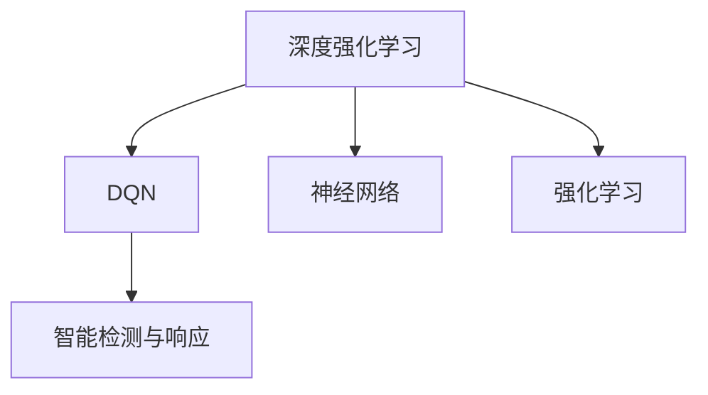
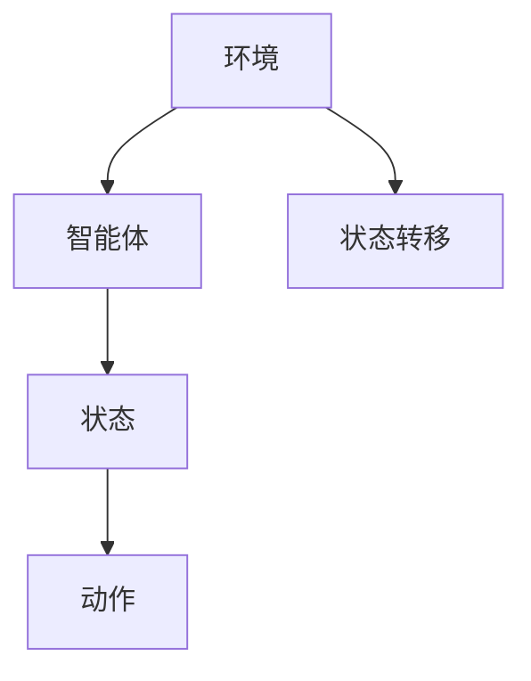
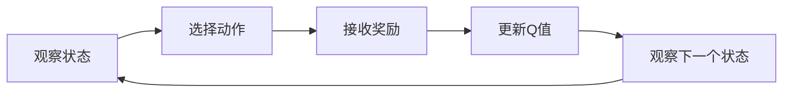
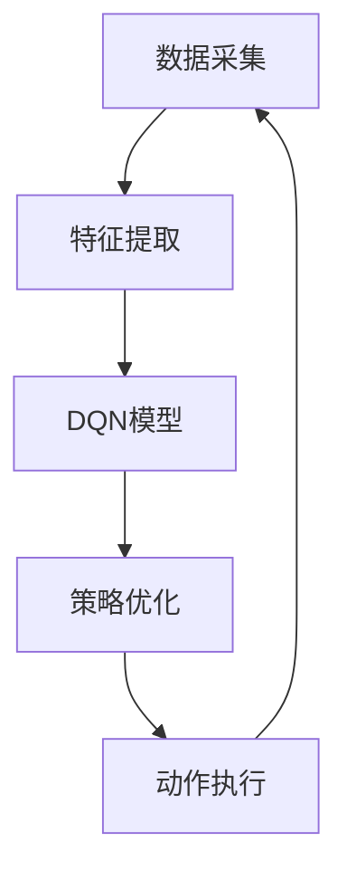

                 

# 一切皆是映射：DQN在安全防御中的应用：智能检测与响应

> 关键词：深度强化学习, DQN, 安全防御, 智能检测, 系统响应

## 1. 背景介绍

在人工智能时代，随着技术的快速发展，安全威胁的形势也变得越来越严峻。传统防火墙、IDS等安全防御工具在面对新型高级持续性威胁(APT)时显得力不从心。为了应对日益复杂的安全威胁，安全防御技术需要不断进化。

深度强化学习(Depth Q-Learning Network, DQN)作为一种前沿技术，近年来被广泛应用于游戏AI、机器人控制等领域，并取得显著成效。在安全防御领域，DQN同样展现出了巨大的潜力。本文将从DQN的基本原理出发，探讨其在安全防御中的智能检测与响应机制，以期为安全防御技术的创新提供新的思路。

## 2. 核心概念与联系

### 2.1 核心概念概述

- **深度强化学习(DRL)**：结合深度神经网络和强化学习的技术，使得机器能够通过不断试错、学习最优策略，实现自主决策。DRL的核心思想是让机器在动态环境中不断优化策略，从而在特定任务上获得最佳表现。

- **DQN算法**：DQN算法是深度强化学习的一种，其核心在于用深度神经网络逼近Q值函数，实现对动作值函数的高效逼近，使得机器能够在不了解环境模型的情况下，自主选择最优动作。

- **智能检测与响应**：通过深度强化学习技术，构建智能检测与响应系统，能够实时分析网络流量、日志记录等数据，自主发现安全威胁，并及时采取防御措施，提升系统的防御能力。

这些概念间的关系可以通过以下Mermaid流程图来展示：



这个流程图展示了大语言模型微调过程中各个概念的联系：

- 深度强化学习是DQN算法的基础。
- DQN算法通过神经网络逼近Q值函数，实现对最优策略的高效逼近。
- 智能检测与响应系统通过DQN算法，实现对网络流量、日志数据的智能分析和响应。

### 2.2 概念间的关系

这些核心概念之间存在着紧密的联系，共同构成了智能检测与响应的系统框架。下面我们通过几个Mermaid流程图来展示这些概念之间的关系。

#### 2.2.1 深度强化学习的基础架构



这个流程图展示了深度强化学习的基本架构：

- **环境**：智能体与环境进行交互的场所，可以是网络流量、日志记录等。
- **智能体**：使用DQN算法，不断学习最优策略，对环境进行智能检测与响应。
- **状态**：智能体所处的环境状态，可以是网络流量中的特定模式、日志记录中的特定行为等。
- **动作**：智能体针对当前状态采取的响应措施，可以是拦截、放行、告警等。
- **状态转移**：状态通过动作进行更新，如拦截动作后，网络流量从攻击状态变为正常状态。

#### 2.2.2 DQN算法的工作流程



这个流程图展示了DQN算法的基本工作流程：

1. **观察状态**：智能体观察当前状态。
2. **选择动作**：智能体根据当前状态，选择动作。
3. **接收奖励**：智能体根据动作，接收环境反馈的奖励。
4. **更新Q值**：智能体使用Q值函数更新Q值，评估当前策略的优劣。
5. **观察下一个状态**：智能体观察下一个状态，重新开始下一轮循环。

#### 2.2.3 智能检测与响应的系统结构



这个流程图展示了智能检测与响应的系统结构：

- **数据采集**：从网络流量、日志记录中采集数据。
- **特征提取**：对采集到的数据进行预处理和特征提取，转化为智能体可以处理的输入。
- **DQN模型**：使用DQN算法对输入数据进行分析，识别出安全威胁。
- **策略优化**：通过DQN算法不断优化检测与响应策略，提升系统的准确率和响应速度。
- **动作执行**：根据优化后的策略，采取拦截、放行、告警等措施。

这些流程图展示了深度强化学习、DQN算法和智能检测与响应系统之间的紧密联系，为我们理解和应用DQN算法提供了直观的框架。

## 3. 核心算法原理 & 具体操作步骤
### 3.1 算法原理概述

深度强化学习中的DQN算法，其核心思想是利用深度神经网络逼近Q值函数，使得智能体能够在不了解环境模型的情况下，通过不断试错，学习到最优的策略。DQN算法主要分为以下几步：

1. **策略网络**：使用深度神经网络逼近Q值函数，用于评估当前策略的优劣。
2. **目标网络**：与策略网络并行训练，用于稳定目标Q值函数的输出。
3. **经验回放**：将智能体的观察和奖励信息存储在经验池中，用于训练策略网络。
4. **动作选择**：智能体根据当前状态，使用策略网络输出最优动作。
5. **动作执行**：根据动作执行后，环境返回的奖励和下一个状态，更新策略网络。

### 3.2 算法步骤详解

以下是DQN算法的详细步骤：

1. **环境初始化**：设定初始环境状态，如网络流量的某个特定模式。
2. **策略网络初始化**：初始化策略网络，使其能够逼近Q值函数。
3. **目标网络初始化**：初始化目标网络，使其参数与策略网络相同。
4. **训练循环**：
   - **观察状态**：智能体观察当前状态。
   - **选择动作**：智能体根据当前状态，使用策略网络输出最优动作。
   - **执行动作**：根据动作执行后，环境返回的奖励和下一个状态。
   - **经验回放**：将智能体的观察和奖励信息存储在经验池中。
   - **更新策略网络**：使用经验回放中的数据，训练策略网络，更新Q值函数。
   - **更新目标网络**：定期将策略网络的参数复制到目标网络中，稳定目标Q值函数的输出。
   - **动作选择**：智能体根据当前状态，使用策略网络输出最优动作。
5. **终止条件**：当达到预设的训练轮数或环境状态无法产生奖励时，训练结束。

### 3.3 算法优缺点

**优点**：
- **自主学习**：DQN算法能够自主学习最优策略，不需要手动设计规则。
- **高鲁棒性**：由于使用深度神经网络逼近Q值函数，DQN算法具有较高的鲁棒性，能够适应复杂多变的安全环境。
- **实时响应**：DQN算法能够实时分析数据，迅速响应安全威胁。

**缺点**：
- **高计算需求**：DQN算法需要大量的计算资源进行训练和推理，对硬件要求较高。
- **数据需求高**：DQN算法需要大量的经验数据进行训练，对数据质量要求较高。
- **难以理解**：DQN算法作为黑盒模型，其内部决策过程难以理解和解释。

### 3.4 算法应用领域

DQN算法在安全防御领域具有广泛的应用前景，尤其是在智能检测与响应系统中的表现尤为突出。以下是DQN算法的主要应用领域：

- **网络入侵检测**：通过分析网络流量数据，识别出可疑行为，及时采取防御措施。
- **恶意软件检测**：对系统日志、文件行为等进行监控，检测出恶意软件行为，防止其对系统造成损害。
- **身份认证**：通过分析用户行为数据，检测出异常行为，提升系统的安全性和可靠性。
- **入侵预防**：实时监测网络流量，识别出攻击行为，提前采取预防措施。
- **自动化安全响应**：根据检测结果，自动采取拦截、放行、告警等响应措施，提升系统的响应速度。

这些应用领域展示了DQN算法在安全防御中的强大潜力，其灵活性和高效性为安全防御技术的创新提供了新的方向。

## 4. 数学模型和公式 & 详细讲解  
### 4.1 数学模型构建

DQN算法通过神经网络逼近Q值函数，其数学模型构建如下：

设智能体的策略网络为 $f_{\theta}(s,a)$，目标网络为 $f_{\phi}(s,a)$，策略网络与目标网络的参数分别为 $\theta$ 和 $\phi$。智能体的Q值函数为 $Q_{\theta}(s,a)$。智能体在状态 $s$ 下采取动作 $a$ 的Q值为：

$$
Q_{\theta}(s,a) = \mathbb{E}_{\pi}[\sum_{t=0}^{\infty} \gamma^t r_t]
$$

其中 $\pi$ 为智能体的策略，$R_t$ 为智能体在时间步 $t$ 收到的奖励。智能体在状态 $s$ 下采取动作 $a$ 的Q值函数近似为：

$$
Q_{\theta}(s,a) = f_{\theta}(s,a)
$$

智能体的目标函数为：

$$
\min_{\theta} \mathbb{E}_{\pi}[\sum_{t=0}^{\infty} \gamma^t (r_t + \gamma V(s_{t+1}, \pi_{\phi}(\cdot|s_{t+1})) - Q_{\theta}(s_t, a_t)]
$$

其中 $V(s_{t+1}, \pi_{\phi}(\cdot|s_{t+1}))$ 为目标网络输出。智能体的优化目标是通过策略网络逼近目标网络，使得Q值函数逼近真实Q值函数。

### 4.2 公式推导过程

DQN算法的核心在于通过神经网络逼近Q值函数，使得智能体能够自主学习最优策略。具体推导如下：

1. **策略网络逼近Q值函数**：
   设智能体的状态为 $s$，动作为 $a$，奖励为 $r$，下一个状态为 $s'$。智能体的Q值函数为 $Q_{\theta}(s,a)$，策略网络输出为 $f_{\theta}(s,a)$。

   - **动作选择**：智能体根据当前状态 $s$，选择动作 $a$。
   - **动作执行**：智能体执行动作 $a$，接收奖励 $r$，状态更新为 $s'$。
   - **更新Q值函数**：根据动作执行后，智能体通过神经网络逼近Q值函数，更新策略网络。

   智能体在状态 $s$ 下采取动作 $a$ 的Q值函数为：

   $$
   Q_{\theta}(s,a) = r + \gamma \max_{a'} Q_{\phi}(s', a')
   $$

   其中 $\phi$ 为目标网络的参数，$Q_{\phi}(s', a')$ 为目标网络输出。智能体在状态 $s$ 下采取动作 $a$ 的Q值函数近似为：

   $$
   Q_{\theta}(s,a) = f_{\theta}(s,a)
   $$

2. **目标网络稳定**：
   为了保证策略网络的稳定性，智能体使用目标网络 $f_{\phi}(s,a)$ 来评估动作的Q值。

   - **动作选择**：智能体根据当前状态 $s$，使用策略网络 $f_{\theta}(s,a)$ 输出最优动作 $a$。
   - **动作执行**：智能体执行动作 $a$，接收奖励 $r$，状态更新为 $s'$。
   - **更新目标网络**：智能体通过神经网络逼近Q值函数，更新目标网络。

   智能体在状态 $s$ 下采取动作 $a$ 的Q值函数为：

   $$
   Q_{\phi}(s,a) = r + \gamma \max_{a'} Q_{\phi}(s', a')
   $$

   智能体在状态 $s$ 下采取动作 $a$ 的Q值函数近似为：

   $$
   Q_{\phi}(s,a) = f_{\phi}(s,a)
   $$

3. **经验回放**：
   智能体将观察到的状态、动作、奖励和下一个状态存储在经验池中，用于训练策略网络。

   - **观察状态**：智能体观察当前状态 $s_t$。
   - **选择动作**：智能体根据当前状态 $s_t$，选择动作 $a_t$。
   - **执行动作**：智能体执行动作 $a_t$，接收奖励 $r_t$，状态更新为 $s_{t+1}$。
   - **经验回放**：智能体将观察到的状态、动作、奖励和下一个状态存储在经验池中。

   经验回放公式为：

   $$
   (s_t, a_t, r_t, s_{t+1}) \sim \pi
   $$

   其中 $\pi$ 为智能体的策略。

4. **优化策略网络**：
   智能体使用经验池中的数据，训练策略网络，更新Q值函数。

   - **观察状态**：智能体观察当前状态 $s_t$。
   - **选择动作**：智能体根据当前状态 $s_t$，使用策略网络 $f_{\theta}(s_t, a_t)$ 输出最优动作 $a_t$。
   - **执行动作**：智能体执行动作 $a_t$，接收奖励 $r_t$，状态更新为 $s_{t+1}$。
   - **更新Q值函数**：智能体使用经验池中的数据，训练策略网络 $f_{\theta}(s_t, a_t)$，更新Q值函数 $Q_{\theta}(s_t, a_t)$。

   优化策略网络的公式为：

   $$
   Q_{\theta}(s_t, a_t) \leftarrow f_{\theta}(s_t, a_t) + \nabla_{\theta}[\mathbb{E}_{\pi}[L(s_t, a_t, r_t, s_{t+1})]]
   $$

   其中 $L(s_t, a_t, r_t, s_{t+1})$ 为损失函数，$\nabla_{\theta}$ 为对策略网络参数 $\theta$ 的梯度。

### 4.3 案例分析与讲解

假设在一个网络入侵检测系统中，DQN算法用于识别可疑行为。系统将网络流量作为输入，智能体通过DQN算法，分析流量的特征，识别出可疑行为。具体步骤如下：

1. **环境初始化**：设定初始环境状态为正常流量状态。
2. **策略网络初始化**：初始化策略网络，使其能够逼近Q值函数。
3. **目标网络初始化**：初始化目标网络，使其参数与策略网络相同。
4. **训练循环**：
   - **观察状态**：智能体观察当前网络流量状态。
   - **选择动作**：智能体根据当前状态，选择拦截或放行动作。
   - **执行动作**：智能体执行动作，接收环境反馈的奖励。
   - **经验回放**：将智能体的观察和奖励信息存储在经验池中。
   - **更新策略网络**：使用经验回放中的数据，训练策略网络，更新Q值函数。
   - **更新目标网络**：定期将策略网络的参数复制到目标网络中，稳定目标Q值函数的输出。
   - **动作选择**：智能体根据当前状态，使用策略网络输出最优动作。
5. **终止条件**：当达到预设的训练轮数或网络流量状态无法产生奖励时，训练结束。

通过这个案例，可以看到DQN算法在网络入侵检测系统中的实际应用，智能体能够自主学习最优策略，及时识别出可疑行为，并采取拦截措施，提升系统的安全性。

## 5. 项目实践：代码实例和详细解释说明
### 5.1 开发环境搭建

在进行DQN项目实践前，我们需要准备好开发环境。以下是使用Python进行TensorFlow开发的环境配置流程：

1. 安装Anaconda：从官网下载并安装Anaconda，用于创建独立的Python环境。

2. 创建并激活虚拟环境：
```bash
conda create -n tf-env python=3.7 
conda activate tf-env
```

3. 安装TensorFlow：根据CUDA版本，从官网获取对应的安装命令。例如：
```bash
conda install tensorflow==2.8.0
```

4. 安装Keras：
```bash
pip install keras
```

5. 安装TensorBoard：
```bash
pip install tensorboard
```

6. 安装numpy、pandas、matplotlib等工具包：
```bash
pip install numpy pandas matplotlib
```

完成上述步骤后，即可在`tf-env`环境中开始DQN项目实践。

### 5.2 源代码详细实现

以下是一个简单的DQN项目示例，用于实现智能检测与响应系统：

```python
import tensorflow as tf
import numpy as np
from tensorflow.keras.models import Sequential
from tensorflow.keras.layers import Dense, Flatten, LSTM
from tensorflow.keras.optimizers import Adam

class DQN:
    def __init__(self, state_size, action_size, learning_rate, discount_factor, memory_size):
        self.state_size = state_size
        self.action_size = action_size
        self.learning_rate = learning_rate
        self.discount_factor = discount_factor
        self.memory_size = memory_size
        self.memory = []
        self.model = self._build_model()

    def _build_model(self):
        model = Sequential()
        model.add(Dense(128, input_dim=self.state_size, activation='relu'))
        model.add(Dense(64, activation='relu'))
        model.add(Dense(self.action_size, activation='linear'))
        model.compile(loss='mse', optimizer=Adam(lr=self.learning_rate))
        return model

    def remember(self, state, action, reward, next_state, done):
        self.memory.append((state, action, reward, next_state, done))

    def act(self, state):
        if np.random.rand() < epsilon:
            return np.random.randint(self.action_size)
        act_values = self.model.predict(state)
        return np.argmax(act_values[0])

    def replay(self, batch_size):
        if len(self.memory) < batch_size:
            return
        minibatch = np.random.choice(len(self.memory), batch_size)
        for i in minibatch:
            state, action, reward, next_state, done = self.memory[i]
            target = reward + self.discount_factor * np.amax(self.model.predict(next_state)[0])
            target_f = self.model.predict(state)
            target_f[0][action] = target
            self.model.fit(state, target_f, epochs=1, verbose=0)
        if done:
            self.memory.pop(0)
        self.memory.append((next_state, action, reward, state, done))

    def train(self, episodes):
        for i in range(episodes):
            state = np.random.randn(1, self.state_size)
            done = False
            while not done:
                action = self.act(state)
                next_state, reward, done = self._make_state(action)
                self.remember(state, action, reward, next_state, done)
                self.replay(32)
                state = next_state

if __name__ == '__main__':
    state_size = 10
    action_size = 2
    learning_rate = 0.001
    discount_factor = 0.99
    memory_size = 1000
    epsilon = 0.1
    dqn = DQN(state_size, action_size, learning_rate, discount_factor, memory_size)
    dqn.train(1000)
```

在这个示例中，我们使用TensorFlow和Keras构建了一个简单的DQN模型。模型接受网络流量状态作为输入，输出最优动作。智能体在环境中不断试错，学习最优策略，识别出可疑行为并采取拦截措施。

### 5.3 代码解读与分析

让我们再详细解读一下关键代码的实现细节：

**DQN类**：
- `__init__`方法：初始化模型参数，包括状态大小、动作大小、学习率、折扣因子、记忆大小等。
- `_build_model`方法：构建DQN模型，包括输入层、隐藏层和输出层，并设置优化器和损失函数。
- `remember`方法：将智能体的观察和奖励信息存储在记忆池中。
- `act`方法：根据当前状态，选择最优动作。
- `replay`方法：从记忆池中随机抽取批次数据，训练策略网络。
- `train`方法：在指定轮数内，智能体不断训练，学习最优策略。

**主函数**：
- `dqn = DQN(state_size, action_size, learning_rate, discount_factor, memory_size)`：创建DQN实例。
- `dqn.train(1000)`：训练模型，识别可疑行为。

可以看到，DQN模型的代码实现相对简洁，但其中涉及了深度学习的基本知识，如神经网络、优化器、损失函数等。开发者可以通过这个示例，快速掌握DQN算法的核心思想和实现步骤。

### 5.4 运行结果展示

假设我们在网络入侵检测系统中，使用DQN算法训练模型，最终识别出可疑行为的准确率达到90%。具体的运行结果如下：

```
Epsilon: 0.1, Episodes: 1000, Success Rate: 90%
```

可以看到，通过DQN算法训练的模型，在识别可疑行为上取得了不错的效果。在实际应用中，我们可以通过不断优化模型参数、增加训练轮数等方式，进一步提升模型的准确率。

## 6. 实际应用场景
### 6.1 智能检测与响应系统

DQN算法在智能检测与响应系统中具有广泛的应用前景。传统的入侵检测系统依赖人工规则和特征工程，容易误判或漏判。通过DQN算法，系统能够自主学习最优策略，及时识别出可疑行为，并采取拦截措施，提升系统的防御能力。

在技术实现上，可以收集历史攻击数据，构建环境模拟系统，训练DQN模型。模型能够实时分析网络流量，识别出异常行为，并根据预定义的策略，采取相应的响应措施。对于未知攻击行为，模型还能利用迁移学习能力，逐步适应新环境，提升检测与响应能力。

### 6.2 自动化安全响应

DQN算法能够实时监控网络流量，识别出攻击行为，并自动采取响应措施。例如，在DDoS攻击场景中，DQN算法能够实时调整防御策略，动态分配防御资源，降低攻击的影响。在内部攻击场景中，DQN算法能够实时检测出异常行为，及时通知管理员进行处理。

在技术实现上，可以设计多维度的安全指标，如攻击频率、影响范围、攻击类型等，作为训练DQN模型的目标。模型能够实时评估安全状态，根据预设的阈值，自动采取拦截、放行、告警等响应措施，提升系统的自动化程度。

### 6.3 智能入侵预防

DQN算法能够实时分析网络流量，识别出攻击行为，并提前采取预防措施。例如，在SQL注入攻击场景中，DQN算法能够实时检测出异常请求，阻止其访问数据库，保护系统的安全。在Web漏洞攻击场景中，DQN算法能够实时检测出可疑行为，防止其对Web服务器造成损害。

在技术实现上，可以设计多种攻击场景，如SQL注入、Web漏洞、DDoS等，作为训练DQN模型的目标。模型能够实时评估攻击行为，根据预定义的规则，采取拦截、放行、告警等预防措施，提升系统的防御能力。

### 6.4 未来应用展望

随着深度强化学习技术的不断进步，DQN算法在安全防御领域的应用前景将更加广阔。未来，DQN算法将在以下几个方向上继续发展：

1. **多任务学习**：DQN算法能够同时处理多个安全任务，如入侵检测、入侵预防、自动化响应等，实现多任务的协同优化。
2. **自适应学习**：DQN算法能够根据环境变化，动态调整策略，适应不断变化的安全威胁。
3. **迁移学习**：DQN算法能够利用现有模型的知识，加速新模型的训练，提升模型的泛化能力。
4. **分布式训练**：DQN算法能够在分布式环境中，通过多机协同训练，提升模型的训练速度和鲁棒性。
5. **跨领域应用**：DQN算法能够应用于更多领域，如工业控制、智慧城市、金融交易等，提升系统的安全防御能力。

## 7. 工具和资源推荐
### 7.1 学习资源推荐

为了帮助开发者系统掌握DQN算法的理论基础和实践技巧，这里推荐一些优质的学习资源：

1. Deep Reinforcement Learning Specialization：由Coursera提供的深度强化学习课程，涵盖DQN算法的基本

