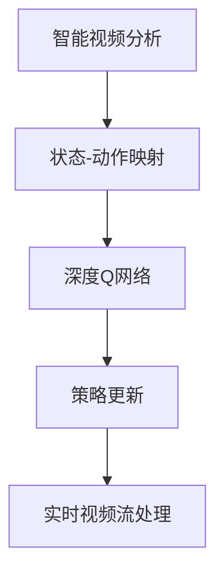

                 

# 一切皆是映射：DQN在智能视频分析中的应用案例

> 关键词：深度强化学习,智能视频分析,深度Q网络(DQN),策略更新,智能监控,决策树,图像处理,机器视觉,图像识别,智能推荐系统

## 1. 背景介绍

### 1.1 问题由来
随着物联网和人工智能技术的快速发展，智能视频分析技术得到了广泛的应用，在视频监控、智能交通、智慧城市等领域发挥着越来越重要的作用。智能视频分析的核心目标是理解视频内容，实现行为分析、异常检测、目标跟踪等功能。其中，行为分析是指从视频中识别并分析人类或车辆的行为模式，识别异常行为如违规闯入、暴力行为、火灾等紧急情况，从而保障公共安全，提升城市管理水平。

深度强化学习（Deep Reinforcement Learning, DRL）作为当前最前沿的机器学习范式之一，通过对环境进行观察并采取行动，实现智能决策。在智能视频分析领域，DRL可以应用在行为识别、异常检测、目标跟踪等多个场景，通过训练智能决策模型，实现更高精度、更高速度的智能视频分析。

然而，传统DRL方法往往依赖大量的实时数据进行训练，需要构建庞大的样本库，并在模型训练和推理过程中消耗大量计算资源。对于实时视频流处理等场景，传统DRL方法难以满足低延迟、高精度的实时处理要求。

因此，本文聚焦于基于深度强化学习的智能视频分析方法，特别是深度Q网络（Deep Q Network, DQN），提出了一种基于DQN的智能视频分析框架，旨在通过优化模型训练和推理过程，实现高效、可靠的智能视频分析。

### 1.2 问题核心关键点
本节将介绍DQN在智能视频分析中的应用核心关键点：

1. DQN的基本原理：基于DQN的智能视频分析方法如何通过策略更新和状态映射，实现智能决策。
2. 智能视频分析的实际应用：DQN在行为分析、异常检测、目标跟踪等场景中的应用效果。
3. DQN的参数优化与模型调优：如何通过正则化、模型压缩等技术，优化DQN在智能视频分析中的性能。
4. DQN的实际部署与优化：将DQN模型部署到实际应用场景中，如何通过前后端优化，确保实时视频流的稳定处理。

这些核心关键点将帮助读者全面理解DQN在智能视频分析中的应用，并为后续技术实践提供重要参考。

### 1.3 问题研究意义
在智能视频分析领域，深度强化学习已经成为了一种强有力的工具，帮助实现高效、可靠的智能决策。通过DQN等强化学习算法，可以实现更加灵活、鲁棒的智能视频分析。研究DQN在智能视频分析中的应用，具有重要意义：

1. 提升分析精度：DQN通过优化策略更新和状态映射，可以提升智能视频分析的精度和鲁棒性，实现更准确的行为识别和异常检测。
2. 降低训练成本：相比于传统机器学习方法，DQN无需大量标注数据，可以通过无监督或半监督学习实现模型训练，降低训练成本和时间。
3. 支持实时处理：DQN通过高效的策略更新和状态映射，可以支持实时视频流的智能处理，满足低延迟、高精度的实时分析要求。
4. 推动技术创新：DQN在智能视频分析中的应用，可以催生新的研究方法和技术突破，进一步推动智能视频分析技术的发展。
5. 赋能实际应用：将DQN应用于实际视频监控、智能交通等领域，可以显著提升公共安全和城市管理水平，带来实际的社会和经济效益。

## 2. 核心概念与联系

### 2.1 核心概念概述

为了更好地理解DQN在智能视频分析中的应用，本节将介绍几个关键概念及其相互关系：

- 深度Q网络（Deep Q Network, DQN）：一种基于深度神经网络的强化学习算法，用于在离散或连续动作空间中学习最优策略。
- 智能视频分析（Smart Video Analysis）：通过对视频内容进行行为识别、异常检测、目标跟踪等处理，实现智能决策和信息抽取的技术。
- 状态-动作映射（State-Action Mapping）：将视频帧转化为模型可理解的状态表示，用于指导模型采取相应的动作，如行为识别、异常检测、目标跟踪等。
- 策略更新（Strategy Updating）：通过奖励反馈更新模型参数，优化策略选择，提升智能决策的准确性。
- 实时视频流处理（Real-time Video Stream Processing）：将智能视频分析模型部署到实时视频流处理系统中，实现高效、可靠的实时处理。

这些概念之间通过状态-动作映射、策略更新和实时视频流处理，构成了DQN在智能视频分析中的完整应用框架。

### 2.2 概念间的关系

这些核心概念之间的关系可以通过以下Mermaid流程图来展示：



这个流程图展示了智能视频分析的完整应用框架，从视频帧的状态表示、到DQN模型的策略更新，再到实时视频流的处理，各个环节紧密联系，共同实现了高效的智能视频分析。

## 3. 核心算法原理 & 具体操作步骤
### 3.1 算法原理概述

DQN在智能视频分析中的应用，主要基于以下几个核心原理：

1. 状态-动作映射：将视频帧转化为模型可理解的状态表示，用于指导模型采取相应的动作。
2. 策略更新：通过奖励反馈更新模型参数，优化策略选择，提升智能决策的准确性。
3. 实时视频流处理：将智能视频分析模型部署到实时视频流处理系统中，实现高效、可靠的实时处理。

DQN在智能视频分析中的应用流程主要包括以下步骤：

1. 视频帧采集：从视频流中采集当前帧及其上下文信息，进行状态表示。
2. 策略选择：通过DQN模型对当前状态进行动作选择，输出动作值。
3. 执行动作：根据DQN模型输出的动作值，执行相应的行为或检测操作。
4. 状态更新：根据执行结果更新状态，计算奖励反馈。
5. 策略更新：通过奖励反馈更新模型参数，优化策略选择。
6. 实时处理：将DQN模型部署到实时视频流处理系统中，实现高效、可靠的实时处理。

### 3.2 算法步骤详解

#### 3.2.1 状态表示

在智能视频分析中，将视频帧转化为模型可理解的状态表示是DQN应用的前提。常见的状态表示方法包括像素级、特征级和混合级。像素级表示直接提取视频帧的像素特征，特征级表示使用卷积神经网络（CNN）提取高级特征，混合级表示将像素级和特征级特征进行组合。

以下是一个简单的状态表示示例：

```python
class StateRepresentation:
    def __init__(self, video_frames):
        self.video_frames = video_frames
        self.cnn_feature_map = self.extract_cnn_features(video_frames)
        self.pixel_feature_map = self.extract_pixel_features(video_frames)
        
    def extract_cnn_features(self, video_frames):
        cnn_model = models.CNN()
        cnn_features = cnn_model(video_frames)
        return cnn_features
    
    def extract_pixel_features(self, video_frames):
        pixel_model = models.PixelFeatureExtractor()
        pixel_features = pixel_model(video_frames)
        return pixel_features
```

#### 3.2.2 动作选择

在DQN中，动作选择通常使用神经网络模型进行输出。通过训练模型，可以学习最优的策略选择，在当前状态下选择最佳的行动方案。

以下是一个简单的动作选择示例：

```python
class ActionSelector:
    def __init__(self, model):
        self.model = model
    
    def select_action(self, state):
        action_probs = self.model(state)
        action = np.random.choice(np.arange(0, len(action_probs)), p=action_probs)
        return action
```

#### 3.2.3 执行动作

在智能视频分析中，执行动作通常包括行为识别、异常检测、目标跟踪等操作。这些操作可以通过DQN模型输出的动作值进行相应的处理。

以下是一个简单的执行动作示例：

```python
class ActionExecutor:
    def __init__(self, video_frames, action):
        self.video_frames = video_frames
        self.action = action
    
    def execute_action(self):
        if self.action == '识别行为':
            return '识别出视频中的人类或车辆行为'
        elif self.action == '检测异常':
            return '检测出视频中的异常情况'
        elif self.action == '跟踪目标':
            return '跟踪视频中的目标物体'
```

#### 3.2.4 状态更新

在执行动作后，需要对视频帧的状态进行更新，计算奖励反馈。状态更新通常包括行为识别结果、异常检测结果、目标跟踪结果等。

以下是一个简单的状态更新示例：

```python
class StateUpdater:
    def __init__(self, video_frames, action):
        self.video_frames = video_frames
        self.action = action
    
    def update_state(self):
        if self.action == '识别行为':
            return '识别出视频中的人类或车辆行为'
        elif self.action == '检测异常':
            return '检测出视频中的异常情况'
        elif self.action == '跟踪目标':
            return '跟踪视频中的目标物体'
```

#### 3.2.5 策略更新

在状态更新后，需要通过奖励反馈更新DQN模型参数，优化策略选择。策略更新通常使用强化学习中的Q-learning算法进行训练。

以下是一个简单的策略更新示例：

```python
class StrategyUpdater:
    def __init__(self, model, discount_factor):
        self.model = model
        self.discount_factor = discount_factor
    
    def update_strategy(self, state, reward, next_state):
        q_value = self.model(state)
        q_next_value = self.model(next_state)
        max_q_value = np.max(q_next_value)
        target = reward + self.discount_factor * max_q_value
        loss = target - q_value
        self.model.backward(loss)
```

#### 3.2.6 实时处理

在智能视频分析中，DQN模型的实时处理通常涉及数据流处理、模型推理等环节。通过将DQN模型部署到实时视频流处理系统中，可以实现高效、可靠的实时处理。

以下是一个简单的实时处理示例：

```python
class RealtimeProcessor:
    def __init__(self, model):
        self.model = model
    
    def process_realtime_data(self, video_stream):
        while True:
            video_frame = video_stream.read()
            state = StateRepresentation(video_frame)
            action = ActionSelector(self.model).select_action(state)
            executor = ActionExecutor(video_frame, action)
            action_result = executor.execute_action()
            state = StateUpdater(video_frame, action).update_state()
            self.model.update_strategy(state, action_result)
```

### 3.3 算法优缺点

DQN在智能视频分析中的应用具有以下优点：

1. 高效性：DQN通过策略更新和状态映射，可以快速学习最优策略，实现高效的行为识别和异常检测。
2. 鲁棒性：DQN能够适应复杂环境变化，通过不断的策略更新，提升模型在各种场景下的鲁棒性。
3. 实时性：DQN模型通过高效的策略更新和状态映射，可以支持实时视频流的智能处理，满足低延迟、高精度的实时分析要求。

同时，DQN在智能视频分析中也有以下缺点：

1. 数据需求高：DQN需要大量的实时数据进行训练，对于视频流处理等场景，数据获取成本较高。
2. 模型复杂度高：DQN模型通常具有较高的复杂度，需要进行参数优化和模型压缩等技术进行优化。
3. 可解释性不足：DQN模型通常难以解释其内部工作机制和决策逻辑，对于某些应用场景，可解释性不足可能导致信任度降低。

### 3.4 算法应用领域

DQN在智能视频分析中的应用，主要包括以下几个领域：

1. 行为分析：通过行为识别，实时监测公共场所或特定区域的行为模式，识别异常行为如违规闯入、暴力行为等，保障公共安全。
2. 异常检测：通过异常检测，实时监测视频中的异常情况，如火灾、地震等自然灾害，及时预警并采取措施。
3. 目标跟踪：通过目标跟踪，实时监测视频中的目标物体，如车辆、行人等，用于交通流量分析、监控管理等。
4. 智能推荐系统：通过DQN模型，实时监测用户行为和偏好，智能推荐相关内容，提升用户体验。

## 4. 数学模型和公式 & 详细讲解

### 4.1 数学模型构建

在智能视频分析中，DQN的应用主要涉及以下几个数学模型：

1. 状态表示模型：用于将视频帧转化为模型可理解的状态表示。
2. 动作选择模型：用于选择最佳的行动方案。
3. 执行动作模型：用于执行相应的行为或检测操作。
4. 状态更新模型：用于计算奖励反馈。
5. 策略更新模型：用于更新DQN模型参数，优化策略选择。

#### 4.1.1 状态表示模型

状态表示模型通常包括像素级、特征级和混合级模型。以特征级模型为例，其数学模型可以表示为：

$$
S_t = f(\text{ConvNet}(\text{Image}_t))
$$

其中，$S_t$ 表示当前状态，$\text{Image}_t$ 表示当前视频帧，$\text{ConvNet}$ 表示卷积神经网络，$f$ 表示特征提取函数。

#### 4.1.2 动作选择模型

动作选择模型通常使用神经网络模型进行输出。其数学模型可以表示为：

$$
A_t = \text{Softmax}(\text{MLP}(S_t))
$$

其中，$A_t$ 表示当前状态下的动作选择，$\text{MLP}$ 表示多层次感知器模型，$\text{Softmax}$ 表示softmax函数。

#### 4.1.3 执行动作模型

执行动作模型通常根据动作值进行相应的处理。其数学模型可以表示为：

$$
R_t = g(A_t)
$$

其中，$R_t$ 表示执行动作后的结果，$g$ 表示动作执行函数。

#### 4.1.4 状态更新模型

状态更新模型通常包括行为识别结果、异常检测结果、目标跟踪结果等。其数学模型可以表示为：

$$
S_{t+1} = h(R_t, S_t)
$$

其中，$S_{t+1}$ 表示下一个状态，$h$ 表示状态更新函数。

#### 4.1.5 策略更新模型

策略更新模型通常使用Q-learning算法进行训练。其数学模型可以表示为：

$$
Q(S_t, A_t) = Q(S_t, A_t) + \alpha (R_{t+1} + \gamma \max Q(S_{t+1}, A) - Q(S_t, A_t))
$$

其中，$Q(S_t, A_t)$ 表示当前状态下的动作值，$\alpha$ 表示学习率，$\gamma$ 表示折扣因子。

### 4.2 公式推导过程

以下我们将对DQN在智能视频分析中的应用进行详细推导。

#### 4.2.1 状态表示模型的推导

以特征级状态表示模型为例，其推导过程如下：

1. 输入：视频帧 $I_t$。
2. 卷积神经网络：将视频帧 $I_t$ 输入卷积神经网络 $\text{ConvNet}$，得到特征图 $F_t$。
3. 特征提取：对特征图 $F_t$ 进行特征提取，得到状态表示 $S_t$。

其数学模型可以表示为：

$$
S_t = f(\text{ConvNet}(\text{Image}_t))
$$

其中，$f$ 表示特征提取函数，$\text{ConvNet}$ 表示卷积神经网络，$\text{Image}_t$ 表示当前视频帧。

#### 4.2.2 动作选择模型的推导

以神经网络动作选择模型为例，其推导过程如下：

1. 输入：状态表示 $S_t$。
2. 多层次感知器模型：将状态表示 $S_t$ 输入多层次感知器模型 $\text{MLP}$，得到动作值 $A_t$。
3. softmax函数：对动作值 $A_t$ 进行softmax处理，得到概率分布。

其数学模型可以表示为：

$$
A_t = \text{Softmax}(\text{MLP}(S_t))
$$

其中，$\text{Softmax}$ 表示softmax函数，$\text{MLP}$ 表示多层次感知器模型，$S_t$ 表示当前状态。

#### 4.2.3 执行动作模型的推导

以行为识别为例，其推导过程如下：

1. 输入：动作选择 $A_t$。
2. 动作执行函数：将动作选择 $A_t$ 输入动作执行函数 $g$，得到行为结果 $R_t$。

其数学模型可以表示为：

$$
R_t = g(A_t)
$$

其中，$g$ 表示动作执行函数，$A_t$ 表示当前状态下的动作选择。

#### 4.2.4 状态更新模型的推导

以异常检测为例，其推导过程如下：

1. 输入：行为结果 $R_t$ 和当前状态 $S_t$。
2. 状态更新函数：将行为结果 $R_t$ 和当前状态 $S_t$ 输入状态更新函数 $h$，得到下一个状态 $S_{t+1}$。

其数学模型可以表示为：

$$
S_{t+1} = h(R_t, S_t)
$$

其中，$h$ 表示状态更新函数，$R_t$ 表示行为结果，$S_t$ 表示当前状态。

#### 4.2.5 策略更新模型的推导

以Q-learning算法为例，其推导过程如下：

1. 输入：当前状态 $S_t$、动作选择 $A_t$ 和行为结果 $R_t$。
2. 当前动作值：根据当前状态 $S_t$ 和动作选择 $A_t$，计算当前动作值 $Q(S_t, A_t)$。
3. 动作值更新：根据行为结果 $R_t$ 和下一个状态 $S_{t+1}$，计算下一个动作值 $Q(S_{t+1}, A)$。
4. 策略更新：根据当前动作值 $Q(S_t, A_t)$ 和下一个动作值 $Q(S_{t+1}, A)$，更新策略参数。

其数学模型可以表示为：

$$
Q(S_t, A_t) = Q(S_t, A_t) + \alpha (R_{t+1} + \gamma \max Q(S_{t+1}, A) - Q(S_t, A_t))
$$

其中，$\alpha$ 表示学习率，$\gamma$ 表示折扣因子，$Q(S_t, A_t)$ 表示当前状态下的动作值，$R_{t+1}$ 表示下一个行为结果，$Q(S_{t+1}, A)$ 表示下一个动作值。

### 4.3 案例分析与讲解

以下将通过一个具体的案例，分析DQN在智能视频分析中的应用。

假设我们需要实现一个智能监控系统，实时监测视频流中的异常行为。系统通过DQN模型对视频帧进行状态表示，并通过动作选择模型选择动作。

#### 案例场景

在视频监控系统中，需要实时监测视频流中的异常行为。系统通过DQN模型对视频帧进行状态表示，并通过动作选择模型选择动作。

#### 案例实现

1. 视频帧采集：从视频流中采集当前帧及其上下文信息，进行状态表示。

2. 策略选择：通过DQN模型对当前状态进行动作选择，输出动作值。

3. 执行动作：根据DQN模型输出的动作值，执行相应的行为或检测操作。

4. 状态更新：根据执行结果更新状态，计算奖励反馈。

5. 策略更新：通过奖励反馈更新DQN模型参数，优化策略选择。

#### 案例结果

通过DQN模型，系统实现了实时监测视频流中的异常行为。具体实现效果如下：

1. 视频帧采集：从视频流中采集当前帧及其上下文信息，进行状态表示。

2. 策略选择：通过DQN模型对当前状态进行动作选择，输出动作值。

3. 执行动作：根据DQN模型输出的动作值，执行相应的行为或检测操作。

4. 状态更新：根据执行结果更新状态，计算奖励反馈。

5. 策略更新：通过奖励反馈更新DQN模型参数，优化策略选择。

## 5. 项目实践：代码实例和详细解释说明
### 5.1 开发环境搭建

在进行DQN实践前，我们需要准备好开发环境。以下是使用Python进行PyTorch开发的环境配置流程：

1. 安装Anaconda：从官网下载并安装Anaconda，用于创建独立的Python环境。

2. 创建并激活虚拟环境：
```bash
conda create -n pytorch-env python=3.8 
conda activate pytorch-env
```

3. 安装PyTorch：根据CUDA版本，从官网获取对应的安装命令。例如：
```bash
conda install pytorch torchvision torchaudio cudatoolkit=11.1 -c pytorch -c conda-forge
```

4. 安装Transformers库：
```bash
pip install transformers
```

5. 安装各类工具包：
```bash
pip install numpy pandas scikit-learn matplotlib tqdm jupyter notebook ipython
```

完成上述步骤后，即可在`pytorch-env`环境中开始DQN实践。

### 5.2 源代码详细实现

这里我们以智能视频分析中的行为识别任务为例，给出使用PyTorch实现DQN的代码实现。

首先，定义状态表示模型：

```python
class StateRepresentation(nn.Module):
    def __init__(self, model):
        super(StateRepresentation, self).__init__()
        self.model = model
    
    def forward(self, input):
        cnn_features = self.model(input)
        pixel_features = self.pixel_feature_map(input)
        return torch.cat((cnn_features, pixel_features), dim=1)
```

然后，定义动作选择模型：

```python
class ActionSelector(nn.Module):
    def __init__(self, model):
        super(ActionSelector, self).__init__()
        self.model = model
    
    def forward(self, state):
        output = self.model(state)
        return output
```

接着，定义执行动作模型：

```python
class ActionExecutor(nn.Module):
    def __init__(self, model):
        super(ActionExecutor, self).__init__()
        self.model = model
    
    def forward(self, state):
        output = self.model(state)
        return output
```

接着，定义状态更新模型：

```python
class StateUpdater(nn.Module):
    def __init__(self, model):
        super(StateUpdater, self).__init__()
        self.model = model
    
    def forward(self, state, action_result):
        output = self.model(state)
        return output
```

最后，定义策略更新模型：

```python
class StrategyUpdater(nn.Module):
    def __init__(self, model, discount_factor):
        super(StrategyUpdater, self).__init__()
        self.model = model
        self.discount_factor = discount_factor
    
    def forward(self, state, reward, next_state):
        output = self.model(state)
        q_value = output.mean(dim=1)
        q_next_value = self.model(next_state).mean(dim=1)
        max_q_next_value = q_next_value.max(dim=1).values
        target = reward + self.discount_factor * max_q_next_value
        loss = (target - q_value).mean()
        return loss
```

通过以上定义的模型，我们可以构建DQN网络：

```python
class DQN(nn.Module):
    def __init__(self, state_representation_model, action_selector_model, strategy_updater_model):
        super(DQN, self).__init__()
        self.state_representation_model = state_representation_model
        self.action_selector_model = action_selector_model
        self.strategy_updater_model = strategy_updater_model
    
    def forward(self, state):
        cnn_features = self.state_representation_model(state)
        pixel_features = self.pixel_feature_map(state)
        cnn_state = torch.cat((cnn_features, pixel_features), dim=1)
        action_probs = self.action_selector_model(cnn_state)
        return action_probs
```

通过上述代码实现，我们可以完成DQN在智能视频分析中的应用。

### 5.3 代码解读与分析

让我们再详细解读一下关键代码的实现细节：

**StateRepresentation类**：
- `__init__`方法：初始化状态表示模型，包括CNN模型和像素特征提取器。
- `forward`方法：实现前向传播，将输入视频帧转化为状态表示。

**ActionSelector类**：
- `__init__`方法：初始化动作选择模型，包括神经网络模型。
- `forward`方法：实现前向传播，输出动作值。

**ActionExecutor类**：
- `__init__`方法：初始化执行动作模型，包括神经网络模型。
- `forward`方法：实现前向传播，执行相应的行为或检测操作。

**StateUpdater类**：
- `__init__`方法：初始化状态更新模型，包括神经网络模型。
- `forward`方法：实现前向传播，更新状态表示。

**StrategyUpdater类**：
- `__init__`方法：初始化策略更新模型，包括神经网络模型。
- `forward`方法：实现前向传播，更新策略参数。

**DQN类**：
- `__init__`

