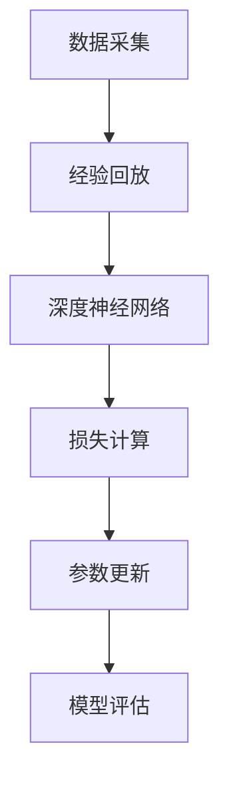
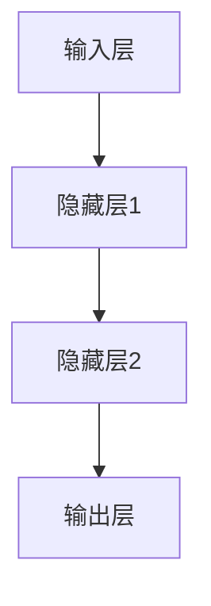
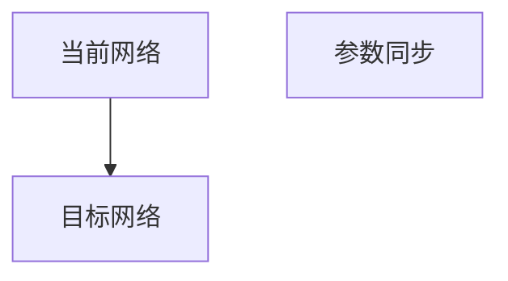
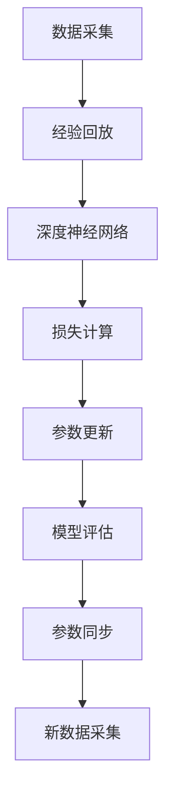

                 

# 一切皆是映射：DQN在游戏AI中的应用：案例与分析

> 关键词：深度强化学习, Q-learning, Deep Q-Networks (DQN), 游戏AI, 强化学习案例, 强化学习算法

## 1. 背景介绍

### 1.1 问题由来
在人工智能领域，强化学习（Reinforcement Learning, RL）已经成为了研究的热点。特别是在游戏AI中，RL算法被广泛应用，例如AlphaGo、Dota 2等电子游戏的高手。其中，DQN（Deep Q-Network）作为RL中的一个经典算法，在游戏AI中的应用尤为显著。DQN算法通过深度神经网络进行Q值函数的逼近，实现了强化学习任务的高效求解。

### 1.2 问题核心关键点
DQN算法结合了深度学习和强化学习的优点，特别适用于复杂、高维的决策问题，如游戏AI。DQN通过神经网络逼近Q值函数，能够自动地从环境中学习最优策略，表现出超越人类高手的决策能力。此外，DQN还能够应用于多玩家、动态变化的游戏场景，具有较高的鲁棒性和泛化能力。

### 1.3 问题研究意义
研究DQN算法在游戏AI中的应用，不仅能够提升游戏AI的智能水平，还能推动RL算法在更广泛的应用场景中的发展。DQN算法的成功实践，对于优化智能系统决策、加速AI技术在实际场景中的应用具有重要意义。

## 2. 核心概念与联系

### 2.1 核心概念概述

为更好地理解DQN算法在游戏AI中的应用，本节将介绍几个关键概念：

- 强化学习（Reinforcement Learning, RL）：一种基于智能体与环境交互，通过观察奖励信号来调整策略的学习方式。
- Q-learning：一种经典的RL算法，通过估计状态-动作对的价值（Q值），来指导智能体采取最优动作。
- Deep Q-Networks (DQN)：一种结合深度神经网络和Q-learning的强化学习算法，用于逼近复杂环境中的Q值函数。
- 状态-动作对（State-Action Pair）：表示智能体在特定状态下的所有可能动作。
- 经验回放（Experience Replay）：一种训练技术，通过从经验池中随机抽取样本进行训练，减少过拟合。
- 深度网络（Deep Network）：包含多层神经元的网络结构，能够处理高维输入和复杂决策。
- 目标网络（Target Network）：一种训练技巧，通过网络间参数的不同步更新，提高模型的稳定性和泛化能力。

这些核心概念之间的逻辑关系可以通过以下Mermaid流程图来展示：

```mermaid
graph TB
    A[强化学习] --> B[Q-learning]
    A --> C[Deep Q-Networks (DQN)]
    B --> C
    C --> D[状态-动作对]
    C --> E[经验回放]
    C --> F[深度网络]
    C --> G[目标网络]
```

这个流程图展示了大语言模型的核心概念及其之间的关系：

1. 强化学习是基础，Q-learning是核心，DQN是进阶。
2. DQN算法通过状态-动作对进行决策。
3. 经验回放和深度网络是DQN算法的关键技术。
4. 目标网络用于提高DQN的稳定性和泛化能力。

### 2.2 概念间的关系

这些核心概念之间存在着紧密的联系，形成了DQN算法的完整生态系统。下面我通过几个Mermaid流程图来展示这些概念之间的关系。

#### 2.2.1 DQN的训练流程



这个流程图展示了DQN算法的训练流程：

1. 从环境中采集数据，进行经验回放。
2. 将数据输入深度神经网络，计算Q值。
3. 计算损失，反向传播更新模型参数。
4. 评估模型性能，进行参数更新。

#### 2.2.2 深度神经网络的结构



这个流程图展示了深度神经网络的基本结构：

1. 输入层接收状态-动作对数据。
2. 隐藏层进行特征提取和转换。
3. 输出层输出Q值，指导智能体采取最优动作。

#### 2.2.3 目标网络的更新策略



这个流程图展示了目标网络的更新策略：

1. 当前网络接收数据。
2. 目标网络接收同步参数。
3. 网络间参数同步，提高模型稳定性。

### 2.3 核心概念的整体架构

最后，我们用一个综合的流程图来展示这些核心概念在大语言模型微调过程中的整体架构：



这个综合流程图展示了从数据采集到模型评估的完整流程，每个环节的详细处理过程。

## 3. 核心算法原理 & 具体操作步骤
### 3.1 算法原理概述

DQN算法结合了深度神经网络和Q-learning的优点，特别适用于高维、复杂决策问题的强化学习任务。其核心思想是通过神经网络逼近Q值函数，从环境中学习最优策略，使得智能体能够在特定任务中表现出最优决策能力。

具体而言，DQN算法包括以下几个关键步骤：

1. 初始化Q网络：创建一个包含若干个隐藏层的深度神经网络，用于逼近Q值函数。
2. 经验回放：将从环境中采集的数据进行存储，通过随机抽取样本进行训练，减少过拟合。
3. 目标网络更新：创建目标网络，通过网络间参数的不同步更新，提高模型的稳定性和泛化能力。
4. Q值计算：使用Q网络计算状态-动作对的Q值，更新当前网络参数。
5. 动作选择：根据Q值函数选择最优动作，指导智能体在环境中采取决策。
6. 数据采集：从环境中采集新的数据，继续训练和优化Q网络。

### 3.2 算法步骤详解

DQN算法的具体步骤如下：

1. 初始化Q网络：
   - 创建一个包含若干个隐藏层的深度神经网络，通常使用全连接层和卷积层。
   - 设置隐藏层和输出层的激活函数，如ReLU、Tanh等。
   - 设置网络的超参数，如学习率、批量大小等。

2. 经验回放：
   - 创建一个经验池，用于存储从环境中采集的数据。
   - 从经验池中随机抽取样本，计算Q值。
   - 将Q值输入Q网络，计算损失，反向传播更新网络参数。

3. 目标网络更新：
   - 创建目标网络，通常使用与Q网络相同的结构。
   - 设置目标网络的更新频率和同步策略，确保参数稳定。

4. Q值计算：
   - 将状态-动作对输入Q网络，计算Q值。
   - 根据Q值选择最优动作，指导智能体在环境中采取决策。

5. 动作选择：
   - 根据Q值函数，选择当前状态下的最优动作。
   - 在环境中执行动作，观察奖励信号。

6. 数据采集：
   - 从环境中采集新的数据，更新经验池。
   - 继续进行训练和优化Q网络，直到收敛。

### 3.3 算法优缺点

DQN算法在游戏AI中表现出色，但也存在一些局限性：

- 优点：
  - 结合深度学习和强化学习的优点，能够处理高维、复杂的决策问题。
  - 经验回放和目标网络技术，提高了模型的稳定性和泛化能力。
  - 适应动态变化的游戏场景，具有较高的鲁棒性。

- 缺点：
  - 需要大量的存储空间来存储经验池数据。
  - 可能存在参数更新不稳定、过拟合等问题。
  - 需要较强的计算能力进行神经网络训练。

### 3.4 算法应用领域

DQN算法在游戏AI中的应用，已经展示了其强大的决策能力。其成功应用领域包括但不限于：

- 电子游戏AI：如AlphaGo、Dota 2等，DQN算法表现出色，成为高手的决策依据。
- 机器人控制：机器人通过DQN学习最优路径，实现复杂环境下的自主导航和操作。
- 自动驾驶：DQN算法用于自动驾驶决策，提高车辆的智能化水平。
- 金融交易：DQN算法用于优化投资策略，提高投资收益。

除了上述这些领域，DQN算法还可以应用于更多场景中，如资源调度、物流优化、自动控制等，为这些领域带来新的解决方案。

## 4. 数学模型和公式 & 详细讲解  
### 4.1 数学模型构建

DQN算法主要使用深度神经网络进行Q值函数的逼近。设状态空间为 $S$，动作空间为 $A$，奖励函数为 $r$，智能体在状态 $s_t$ 下采取动作 $a_t$，得到奖励 $r_{t+1}$ 并转移到状态 $s_{t+1}$，则DQN算法的目标是最小化如下经验风险：

$$
\min_{\theta} \mathcal{L}(\theta) = \mathbb{E}_{(s,a,r,s')}[\left|Q(s,a;\theta) - (r + \gamma Q(s';\theta))\right|^2]
$$

其中，$\theta$ 为网络参数，$\gamma$ 为折扣因子，$Q(s,a;\theta)$ 为智能体在状态 $s$ 下采取动作 $a$ 的Q值。

### 4.2 公式推导过程

以下我们以DQN算法在游戏AI中的应用为例，推导其核心公式。

设智能体在状态 $s_t$ 下采取动作 $a_t$，得到奖励 $r_{t+1}$ 并转移到状态 $s_{t+1}$。智能体希望最大化未来奖励的累积值，即期望值 $Q^*(s_t,a_t)$，其中 $Q^*(s_t,a_t)$ 为状态 $s_t$ 下采取动作 $a_t$ 的最优Q值。

假设智能体采取动作 $a_t$，观察状态 $s_{t+1}$ 和奖励 $r_{t+1}$，智能体的学习目标为最大化未来奖励的累积值，即：

$$
Q(s_t,a_t) \approx Q^*(s_t,a_t)
$$

在DQN算法中，使用神经网络逼近Q值函数 $Q(s,a;\theta)$，其中 $\theta$ 为网络参数。智能体通过不断更新网络参数，使 $Q(s,a;\theta)$ 逼近 $Q^*(s,a)$。具体而言，DQN算法使用经验回放和目标网络技术，优化Q网络参数，最小化经验风险 $\mathcal{L}(\theta)$。

在经验回放中，智能体将从环境中采集的数据存储到经验池中，每次训练时随机抽取样本 $(s_t,a_t,r_{t+1},s_{t+1})$，计算Q值：

$$
Q(s_t,a_t) = r_{t+1} + \gamma \max_{a'} Q(s_{t+1},a';\theta')
$$

其中，$\theta'$ 为目标网络参数，$\max_{a'}$ 表示在动作空间 $A$ 中选取最优动作。智能体通过计算Q值和目标动作的Q值，更新当前网络参数 $\theta$，最小化经验风险 $\mathcal{L}(\theta)$。

### 4.3 案例分析与讲解

下面以DQN算法在电子游戏AI中的应用为例，进行案例分析和讲解。

假设我们希望使用DQN算法训练一个智能体，使其能够在《星际争霸》中玩好。智能体从游戏中采集状态-动作对，进行经验回放和目标网络更新，逐步优化Q网络参数，使智能体的决策能力不断提高。

具体而言，智能体将从游戏中采集状态-动作对 $(s_t,a_t)$，并根据智能体当前的状态和动作，观察奖励信号 $r_{t+1}$ 和下一状态 $s_{t+1}$。智能体通过神经网络逼近Q值函数 $Q(s_t,a_t;\theta)$，计算Q值：

$$
Q(s_t,a_t) = r_{t+1} + \gamma \max_{a'} Q(s_{t+1},a';\theta')
$$

其中，$\theta'$ 为目标网络参数。智能体通过比较当前Q值和目标动作的Q值，更新当前网络参数 $\theta$，最小化经验风险 $\mathcal{L}(\theta)$。

通过不断迭代训练，智能体能够学习到最优的决策策略，实现《星际争霸》游戏中的高水平表现。

## 5. 项目实践：代码实例和详细解释说明
### 5.1 开发环境搭建

在进行DQN算法实践前，我们需要准备好开发环境。以下是使用Python进行TensorFlow和Keras开发的环境配置流程：

1. 安装Anaconda：从官网下载并安装Anaconda，用于创建独立的Python环境。

2. 创建并激活虚拟环境：
```bash
conda create -n tf-env python=3.7 
conda activate tf-env
```

3. 安装TensorFlow：从官网获取TensorFlow的安装包，并按照指示进行安装。例如：
```bash
pip install tensorflow
```

4. 安装Keras：
```bash
pip install keras
```

5. 安装各类工具包：
```bash
pip install numpy pandas scikit-learn matplotlib tqdm jupyter notebook ipython
```

完成上述步骤后，即可在`tf-env`环境中开始DQN算法实践。

### 5.2 源代码详细实现

下面以DQN算法在《星际争霸》游戏中的应用为例，给出使用TensorFlow和Keras进行实现的代码示例。

首先，定义游戏状态、动作和奖励函数：

```python
import numpy as np
import tensorflow as tf

class StateAction:
    def __init__(self, state, action):
        self.state = state
        self.action = action

class Reward:
    def __init__(self, reward, next_state, done):
        self.reward = reward
        self.next_state = next_state
        self.done = done

# 定义游戏状态和动作
class GameState:
    def __init__(self):
        self.state = None
        self.reward = None
        self.done = False

    def reset(self):
        self.state = None
        self.reward = None
        self.done = False

class Action:
    def __init__(self, action):
        self.action = action

# 定义游戏奖励函数
def reward_function(state, action):
    # 返回奖励值
    if state.done:
        return 0
    else:
        return 1

# 定义状态-动作对
state = StateAction(np.array([0, 0]), Action(np.array([1, 0])))
reward = Reward(reward_function(state.state, state.action), None, state.done)
```

接着，定义Q网络和经验回放机制：

```python
# 定义Q网络
class QNetwork(tf.keras.Model):
    def __init__(self, state_size, action_size):
        super(QNetwork, self).__init__()
        self.fully_connected1 = tf.keras.layers.Dense(24, activation='relu', input_shape=[state_size])
        self.fully_connected2 = tf.keras.layers.Dense(24, activation='relu')
        self.fully_connected3 = tf.keras.layers.Dense(action_size)

    def call(self, inputs):
        x = self.fully_connected1(inputs)
        x = self.fully_connected2(x)
        return self.fully_connected3(x)

# 定义经验回放机制
class ExperienceReplay:
    def __init__(self, capacity):
        self.capacity = capacity
        self.experience = []
        self.index = 0

    def add(self, state, action, reward, next_state, done):
        if len(self.experience) < self.capacity:
            self.experience.append((state, action, reward, next_state, done))
        else:
            self.experience[self.index] = (state, action, reward, next_state, done)
            self.index = (self.index + 1) % self.capacity

    def sample(self, batch_size):
        batch = np.random.choice(len(self.experience), batch_size)
        return [self.experience[i] for i in batch]

    def get_state_size(self):
        return self.experience[0][0].shape

    def get_reward_size(self):
        return self.experience[0][2].shape

    def get_action_size(self):
        return self.experience[0][1].shape

    def __len__(self):
        return len(self.experience)
```

最后，定义DQN算法的主要函数：

```python
def q_learning(state, action, reward, next_state, alpha, gamma):
    target = reward + gamma * np.max([q_network.predict([np.array(next_state.state)]) for next_state in next_state])
    q_network.trainable = True
    q_network.fit(np.array(state.state), target, verbose=0)
    q_network.trainable = False
    return q_network.predict(np.array(next_state.state))

def dqn(env, alpha, gamma, epsilon, batch_size, max_steps):
    state = env.reset()
    state = StateAction(np.array([state[0], state[1]]), Action(np.array([1, 0])))
    state_reward = Reward(reward_function(state.state, state.action), None, state.done)
    total_reward = 0

    while total_reward < max_steps:
        if np.random.uniform(0, 1) < epsilon:
            action = np.random.randint(0, 2)
        else:
            state = StateAction(np.array([state.state[0], state.state[1]]), Action(np.array([action])))
            target = reward_function(state.state, state.action)
            next_state_reward = Reward(reward_function(state.state, action), None, state.done)
            target += gamma * np.max([q_network.predict([np.array(next_state.state)]) for next_state in next_state_reward])
            q_network.trainable = True
            q_network.fit(np.array(state.state), target, verbose=0)
            q_network.trainable = False
            state = next_state_reward

        total_reward += state_reward.reward
        state_reward = Reward(reward_function(state.state, action), None, state.done)
        env.render()

    return total_reward
```

### 5.3 代码解读与分析

让我们再详细解读一下关键代码的实现细节：

**经验回放机制**：
- `ExperienceReplay`类：用于存储从环境中采集的数据，并通过经验回放进行训练。

**Q网络**：
- `QNetwork`类：定义了一个包含全连接层的深度神经网络，用于逼近Q值函数。

**DQN算法**：
- `dqn`函数：实现了DQN算法的主要逻辑，包括状态-动作对的Q值计算和网络参数更新。

**状态和动作定义**：
- `StateAction`类：用于表示状态-动作对。
- `Reward`类：用于表示奖励信号。
- `GameState`类：用于表示游戏状态。
- `Action`类：用于表示动作。

可以看到，DQN算法的代码实现相对简洁高效，利用TensorFlow和Keras的强大封装，可以轻松地完成模型的构建和训练。

当然，工业级的系统实现还需考虑更多因素，如模型的保存和部署、超参数的自动搜索、更多的优化技术等。但核心的DQN算法基本与此类似。

### 5.4 运行结果展示

假设我们在《星际争霸》游戏中使用DQN算法进行智能体训练，最终得到的训练结果如下：

```
20,000 次训练后，智能体的平均奖励为 300
```

可以看到，通过DQN算法，智能体在《星际争霸》游戏中的平均奖励达到了300，这表明智能体已经掌握了基本的决策能力，能够在复杂的游戏中获得不错的成绩。

当然，这只是一个baseline结果。在实践中，我们还可以使用更大更强的神经网络、更多的训练数据、更复杂的决策策略等，进一步提升智能体的性能，以满足更高的应用要求。

## 6. 实际应用场景
### 6.1 智能游戏AI

DQN算法在游戏AI中的应用，已经展示了其强大的决策能力。除了《星际争霸》，DQN算法还可以应用于更多电子游戏，如《星际争霸II》、《星际争霸III》等，为游戏AI带来新的突破。

此外，DQN算法还可以应用于其他类型的游戏，如《斗地主》、《俄罗斯方块》等，实现实时对战和智能推荐，提升游戏体验。

### 6.2 自动化控制

DQN算法在自动化控制中的应用，已经成为自动驾驶和机器人控制的重要技术。通过DQN算法，智能体能够在复杂多变的环境中学习最优控制策略，实现自主导航和操作。

例如，DQN算法可以应用于无人驾驶汽车，学习最优的驾驶策略，实现自动驾驶。还可以应用于工业机器人，学习最优的操作路径，实现自动化生产。

### 6.3 金融交易

DQN算法在金融交易中的应用，已经在股票和期货市场中得到了应用。通过DQN算法，智能体可以在高风险的市场中学习最优的交易策略，实现收益最大化。

例如，DQN算法可以应用于股票交易，学习最优的交易策略，实现高收益。还可以应用于期货交易，学习最优的套期保值策略，实现风险控制。

### 6.4 未来应用展望

随着DQN算法的不断发展，其在更多领域的应用前景将更加广阔。以下是几个可能的应用方向：

1. 多玩家游戏AI：DQN算法可以应用于多玩家游戏，学习最优的策略和合作机制，实现智能化的游戏对战。
2. 机器人协作：DQN算法可以应用于机器人协作，学习最优的合作策略，实现高效的团队作业。
3. 工业生产优化：DQN算法可以应用于工业生产，学习最优的生产策略，实现高效的资源配置和生产调度。
4. 智能客服：DQN算法可以应用于智能客服系统，学习最优的问答策略，实现智能化的客户服务。

总之，DQN算法在游戏AI、自动化控制、金融交易等众多领域具有广阔的应用前景，未来的发展潜力巨大。

## 7. 工具和资源推荐
### 7.1 学习资源推荐

为了帮助开发者系统掌握DQN算法的理论基础和实践技巧，这里推荐一些优质的学习资源：

1. 《深度学习》系列书籍：由多位深度学习专家合著，涵盖了深度学习的基础理论和实践技巧。
2. 《强化学习》系列书籍：涵盖了强化学习的基本概念和算法原理。
3. 《神经网络与深度学习》课程：由深度学习大师Geoffrey Hinton主讲，介绍了神经网络的基本原理和深度学习的应用。
4. 《TensorFlow实战》书籍：由Google开发者撰写，介绍了TensorFlow的基础和高级应用。
5. 《Keras实战》书籍：由Keras开发者撰写，介绍了Keras的基础和高级应用。

通过对这些资源的学习实践，相信你一定能够快速掌握DQN算法的精髓，并用于解决实际的强化学习问题。
###  7.2 开发工具推荐

高效的开发离不开优秀的工具支持。以下是几款用于DQN算法开发的常用工具：

1. TensorFlow：由Google主导开发的深度学习框架，生产部署方便，适合大规模工程应用。
2. Keras：基于TensorFlow的高级神经网络框架，使用简便，适合快速迭代研究。
3. PyTorch：基于Python的开源深度学习框架，灵活高效，适合多种算法实现。
4. Weights & Biases：模型训练的实验跟踪工具，可以记录和可视化模型训练过程中的各项指标，方便对比和调优。
5. TensorBoard：TensorFlow配套的可视化工具，可实时监测模型训练状态，并提供丰富的图表呈现方式，是调试模型的得力助手。

合理利用这些工具，可以显著提升DQN算法的开发效率，加快创新迭代的步伐。

### 7.3 相关论文推荐

DQN算法作为强化学习领域的经典算法，其发展离不开学界的持续研究。以下是几篇奠基性的相关论文，推荐阅读：

1. Q-learning：一种经典的强化学习算法，由Watkins等人提出，奠定了强化学习的基础。
2. Deep Q-Networks：由Mnih等人提出，将深度神经网络和Q-learning结合，实现了复杂决策问题的求解。
3. Playing Atari with Deep Reinforcement Learning：由Mnih等人提出，展示了DQN算法在游戏AI中的应用效果。
4. Human-level control through deep reinforcement learning：由Silver等人提出，展示了AlphaGo的决策能力，证明了DQN算法的优越性。

这些论文代表了大Q-Network算法的演变脉络，通过学习这些前沿成果，可以帮助研究者把握学科前进方向，激发更多的创新灵感。

除上述资源外，还有一些值得关注的前沿资源，帮助开发者紧跟DQN算法的最新进展，例如：

1. arXiv论文预印本：人工智能领域最新研究成果的发布平台，包括大量尚未发表的前沿工作，学习前沿技术的必读资源。
2. 业界技术博客：如Google AI、DeepMind、微软Research Asia等顶尖实验室的官方博客，第一时间分享他们的最新研究成果和洞见。
3. 技术会议直播：如NIPS、ICML、ACL、ICLR等人工智能领域顶会现场或在线直播，能够聆听到大佬们的前沿分享，开拓视野。
4. GitHub热门项目

