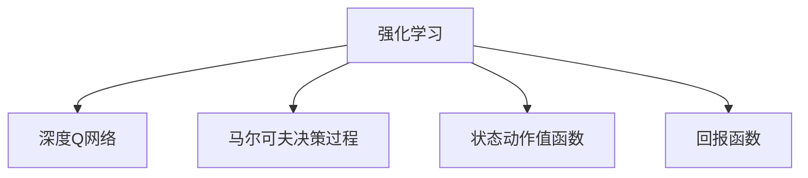

                 

# 一切皆是映射：DQN在自适应网络流量控制中的应用

> 关键词：强化学习,深度Q网络(DQN),自适应网络流量控制,马尔可夫决策过程,状态动作值函数,回报函数

## 1. 背景介绍

在现代互联网的快速发展和数据爆炸的时代，网络流量控制成为了保证网络服务质量的关键问题。随着网络复杂性的增加，传统的静态流量控制方法（如带宽分配、路由策略等）已经难以应对动态变化的网络环境。强化学习作为一种数据驱动的智能优化方法，近年来被广泛应用于网络流量控制中，为解决动态适应问题提供了新的思路。

### 1.1 问题由来

网络流量控制的目的是在有限的资源条件下，最大化网络系统的利用率，并保证服务质量。传统的网络流量控制方法（如AIMD、RED等）主要基于静态规则或阈值策略，缺乏对实时动态变化的适应性。面对日益复杂的互联网环境和不断增长的用户需求，传统的流量控制方法已经难以满足实际需求。

### 1.2 问题核心关键点

强化学习在网络流量控制中的应用，其核心在于将网络流量控制看作一个马尔可夫决策过程，利用深度强化学习算法（如深度Q网络DQN），不断学习和优化控制策略，以适应实时动态变化的网络环境。

DQN算法通过模拟环境与代理的交互，根据当前状态和可采取的动作，计算出预期回报值，并选择最大化预期回报的动作。通过不断的探索和更新，DQN能够在复杂的动态环境中逐步优化流量控制策略，提升网络系统的性能。

### 1.3 问题研究意义

DQN在自适应网络流量控制中的应用，对于提高网络系统的智能优化能力、提升用户服务体验、降低网络运营成本具有重要意义：

1. 智能优化：DQN能够根据网络状态实时调整流量控制策略，提升网络资源利用率，降低延时和丢包率。
2. 提升体验：通过自适应调整，用户能够获得更稳定、更流畅的网络服务，提升使用体验。
3. 降低成本：智能化的流量控制策略能够有效减少资源浪费，降低网络运营成本。
4. 灵活性：DQN算法简单易用，可适应各种网络环境和应用场景，具有广泛的应用前景。

## 2. 核心概念与联系

### 2.1 核心概念概述

为更好地理解DQN在自适应网络流量控制中的应用，本节将介绍几个关键概念：

- 强化学习(Reinforcement Learning, RL)：一种基于智能体与环境交互，通过学习最优策略最大化预期回报的学习范式。
- 深度Q网络(Deep Q Network, DQN)：一种基于深度神经网络的强化学习算法，用于估计状态动作值函数。
- 马尔可夫决策过程(Markov Decision Process, MDP)：描述智能体在环境中的决策过程，其中状态、动作、奖励和下一状态之间存在马尔可夫性质。
- 状态动作值函数(Q-Value)：表示当前状态和动作的预期回报值，用于指导智能体选择最优动作。
- 回报函数(Reward)：用于衡量智能体在每个状态下的表现，指导智能体进行策略优化。

这些概念之间的逻辑关系可以通过以下Mermaid流程图来展示：



这个流程图展示了一些关键概念之间的关系：

1. 强化学习是DQN的高级形式，用于指导智能体在MDP中进行决策。
2. DQN通过神经网络逼近Q-Value函数，实现状态动作值函数的估计。
3. MDP描述了智能体在环境中的动态交互过程，是强化学习的核心模型。
4. 状态动作值函数用于衡量状态和动作的预期回报，指导智能体选择最优动作。
5. 回报函数用于量化智能体在每个状态下的表现，指导智能体优化策略。

### 2.2 概念间的关系

这些关键概念之间存在着紧密的联系，共同构成了DQN在网络流量控制中的应用框架。

- 强化学习通过环境与智能体的交互，实现策略优化。
- DQN利用神经网络逼近Q-Value函数，提高策略学习的效率和精度。
- MDP模型为DQN提供了一个动态的环境模型，指导智能体进行决策。
- 状态动作值函数和回报函数作为DQN的核心组件，指导智能体选择最优动作和优化策略。

## 3. 核心算法原理 & 具体操作步骤
### 3.1 算法原理概述

DQN在自适应网络流量控制中的应用，其核心思想是将网络流量控制视为一个马尔可夫决策过程，智能体通过与环境的交互，利用DQN算法不断学习和优化控制策略，以实现流量控制的自适应调整。

具体而言，网络流量控制问题可以建模为一个MDP，其中：

- 状态 $\textit{S}$：当前的网络状态，包括网络拥塞程度、用户连接数、带宽使用率等。
- 动作 $\textit{A}$：智能体可以采取的流量控制措施，如增加或减少带宽、调整路由策略等。
- 奖励 $\textit{R}$：衡量智能体在每个状态下的表现，如网络延迟、丢包率等。
- 下一状态 $\textit{S'}$：根据动作和当前状态，智能体所能到达的下一状态。

智能体的目标是通过学习最优策略 $\pi$，最大化预期回报 $Q(s,\pi)$，其中 $s$ 为状态。

### 3.2 算法步骤详解

DQN在自适应网络流量控制中的应用，通常包括以下关键步骤：

**Step 1: 环境建模**

首先需要对网络流量控制问题进行环境建模，定义状态、动作和奖励。例如，可以将网络状态定义为“拥塞程度”和“连接数”的组合，动作定义为“增加带宽”和“减少带宽”，奖励定义为“降低延迟”和“减少丢包率”。

**Step 2: 设计状态动作值函数**

利用神经网络逼近状态动作值函数 $Q(s,a)$，其中 $s$ 为状态，$a$ 为动作。通常使用全连接神经网络或卷积神经网络(CNN)进行建模。

**Step 3: 训练深度Q网络**

通过与环境的交互，利用蒙特卡罗树搜索(Monte Carlo Tree Search, MCTS)等方法，收集样本数据，训练DQN模型。在训练过程中，通过模拟环境与智能体的交互，逐步优化状态动作值函数。

**Step 4: 自适应调整**

将训练好的DQN模型应用到实际网络流量控制中，根据当前网络状态，智能体选择最优动作，进行自适应调整。

**Step 5: 持续优化**

在实际应用中，智能体需要持续收集环境反馈，更新状态动作值函数，不断优化策略，以适应新的网络环境。

### 3.3 算法优缺点

DQN在自适应网络流量控制中的应用，具有以下优点：

1. 智能优化：DQN能够根据实时动态变化的网络状态，自适应调整流量控制策略，最大化网络资源利用率。
2. 灵活性：DQN算法简单易用，能够适应各种网络环境和应用场景。
3. 鲁棒性：DQN通过模拟环境与智能体的交互，能够有效应对网络环境的变化和不确定性。

同时，DQN也存在一些缺点：

1. 模型复杂性：DQN使用神经网络逼近Q-Value函数，模型复杂度较高，需要较大的计算资源。
2. 探索与利用冲突：在训练初期，DQN的探索策略可能过于激进，导致回报不稳定。
3. 样本效率：DQN在样本收集过程中，可能面临回报不确定性，样本效率较低。

### 3.4 算法应用领域

DQN在自适应网络流量控制中的应用，已经在多个领域得到了广泛应用，例如：

- 互联网服务提供商(ISP)：通过DQN算法优化网络带宽分配和路由策略，提升网络性能。
- 云服务提供商(CSP)：利用DQN实现动态流量控制，优化资源利用率，降低延迟和丢包率。
- 企业内网：通过DQN算法优化内网流量控制，提升内部通信效率，减少网络拥塞。
- 物联网(IoT)：在物联网设备间进行流量控制，优化资源分配，提高系统可靠性。

除了上述应用场景外，DQN还被创新性地应用于更多场景中，如交通流优化、能源管理、供应链优化等，为复杂系统的自适应控制提供了新的思路。

## 4. 数学模型和公式 & 详细讲解 & 举例说明（备注：数学公式请使用latex格式，latex嵌入文中独立段落使用 $$，段落内使用 $)
### 4.1 数学模型构建

在网络流量控制的DQN应用中，状态动作值函数和回报函数是核心组件。下面将详细构建数学模型：

设当前网络状态为 $s$，智能体可以采取的动作为 $a$，根据动作 $a$ 和当前状态 $s$，智能体到达下一个状态 $s'$ 并得到回报 $r$。设智能体的策略为 $\pi$，则状态动作值函数 $Q(s,\pi)$ 定义为：

$$
Q(s,\pi) = \mathbb{E}[\sum_{t=0}^{T-1} \gamma^t r_t | s_0,s,\pi]
$$

其中 $\gamma$ 为折扣因子，$T$ 为时间步长。智能体的目标是通过学习最优策略 $\pi$，最大化预期回报：

$$
\pi^* = \mathop{\arg\max}_{\pi} \mathbb{E}[\sum_{t=0}^{T-1} \gamma^t r_t | s_0,s,\pi]
$$

在实际应用中，智能体通过与环境的交互，不断更新状态动作值函数。假设智能体当前处于状态 $s$，采取动作 $a$，得到下一状态 $s'$ 和回报 $r$，则状态动作值函数可以更新为：

$$
Q(s,a) \leftarrow Q(s,a) + \alpha [r + \gamma \max_{a'} Q(s',a')] - Q(s,a)
$$

其中 $\alpha$ 为学习率，$Q(s,a)$ 为当前状态动作值函数，$Q(s',a')$ 为下一个状态动作值函数。

### 4.2 公式推导过程

以下是状态动作值函数的推导过程：

假设智能体当前处于状态 $s$，采取动作 $a$，得到下一状态 $s'$ 和回报 $r$。根据马尔可夫性质，智能体从状态 $s$ 到状态 $s'$ 的转移概率为 $p_{s'|s,a}$。则状态动作值函数可以表示为：

$$
Q(s,a) = r + \gamma \mathbb{E}[r + \gamma \max_{a'} Q(s',a') | s_0,s,a]
$$

将上述表达式进行递归展开，可得：

$$
Q(s,a) = r + \gamma \mathbb{E}[r + \gamma \max_{a'} Q(s',a') | s_0,s,a]
$$

$$
= r + \gamma \mathbb{E}[r + \gamma \max_{a'} Q(s',a') | s_0,s,a] + \gamma^2 \mathbb{E}[r + \gamma \max_{a'} Q(s'',a'') | s_0,s,a]
$$

$$
= \ldots
$$

$$
= \sum_{t=0}^{T-1} \gamma^t r_t + \gamma^T \max_{a'} Q(s',a')
$$

由于 $\gamma^T \max_{a'} Q(s',a')$ 与当前时间步无关，因此可以忽略。上式可简化为：

$$
Q(s,a) = \mathbb{E}[\sum_{t=0}^{T-1} \gamma^t r_t | s_0,s,a]
$$

将上式代入目标优化公式：

$$
\pi^* = \mathop{\arg\max}_{\pi} \mathbb{E}[\sum_{t=0}^{T-1} \gamma^t r_t | s_0,s,\pi]
$$

将上述目标公式表示为动作 $a$ 的期望值：

$$
\pi^* = \mathop{\arg\max}_{a} \mathbb{E}[\sum_{t=0}^{T-1} \gamma^t r_t | s_0,s,\pi]
$$

上式表示智能体在状态 $s$ 下采取动作 $a$ 的期望回报最大。

### 4.3 案例分析与讲解

以一个简单的网络流量控制问题为例，进行案例分析：

假设有一个网络节点，初始带宽为 $10Mbps$，当前状态 $s_0$ 为“轻度拥塞”，智能体可以选择“增加带宽”或“减少带宽”两种动作。智能体采取动作后的下一状态和回报如下表所示：

| 状态 | 动作 | 下一状态 | 回报 |
|---|---|---|---|
| 轻度拥塞 | 增加带宽 | 中度拥塞 | 5 |
| 中度拥塞 | 减少带宽 | 轻度拥塞 | 3 |
| 中度拥塞 | 增加带宽 | 重度拥塞 | -1 |
| 轻度拥塞 | 减少带宽 | 中度拥塞 | 2 |
| 中度拥塞 | 增加带宽 | 中度拥塞 | 1 |

设智能体采取“增加带宽”动作的策略为 $\pi$，则状态动作值函数 $Q(s_0,\pi)$ 可表示为：

$$
Q(s_0,\pi) = \mathbb{E}[\sum_{t=0}^{T-1} \gamma^t r_t | s_0,s_0,\pi]
$$

将上表数据代入，可得：

$$
Q(s_0,\pi) = \frac{1}{4} (5 + 3 + (-1) + 2) + \gamma \max_{a'} Q(s_1,a') + \gamma^2 \max_{a'} Q(s_2,a') + \ldots
$$

其中 $s_1$ 和 $s_2$ 分别为中度拥塞和重度拥塞状态。根据马尔可夫性质，$\max_{a'} Q(s_2,a')$ 与当前时间步无关，因此可以忽略。上式可简化为：

$$
Q(s_0,\pi) = \frac{1}{4} (5 + 3 + (-1) + 2) + \gamma \max_{a'} Q(s_1,a')
$$

$$
= 1.5 + \gamma \max_{a'} Q(s_1,a')
$$

同理，对于状态 $s_1$ 和 $s_2$ 的状态动作值函数也可进行类似推导。通过不断迭代，智能体能够逐步学习最优策略 $\pi$，最大化预期回报。

## 5. 项目实践：代码实例和详细解释说明
### 5.1 开发环境搭建

在进行DQN应用实践前，我们需要准备好开发环境。以下是使用Python进行PyTorch开发的环境配置流程：

1. 安装Anaconda：从官网下载并安装Anaconda，用于创建独立的Python环境。

2. 创建并激活虚拟环境：
```bash
conda create -n dqn-env python=3.8 
conda activate dqn-env
```

3. 安装PyTorch：根据CUDA版本，从官网获取对应的安装命令。例如：
```bash
conda install pytorch torchvision torchaudio cudatoolkit=11.1 -c pytorch -c conda-forge
```

4. 安装TensorFlow：
```bash
pip install tensorflow
```

5. 安装各类工具包：
```bash
pip install numpy pandas scikit-learn matplotlib tqdm jupyter notebook ipython
```

完成上述步骤后，即可在`dqn-env`环境中开始DQN应用实践。

### 5.2 源代码详细实现

下面我们以自适应网络流量控制为例，给出使用PyTorch实现DQN的代码实现。

首先，定义状态、动作和奖励：

```python
import numpy as np

class Environment:
    def __init__(self, initial带宽, 带宽增量):
        self.带宽 = initial带宽
        self.带宽增量 = 带宽增量
        
    def get_state(self):
        return self.带宽
    
    def take_action(self, 增加带宽=True):
        if 增加带宽:
            self.带宽 += self.带宽增量
        else:
            self.带宽 -= self.带宽增量
        return self.带宽

class Action:
    def __init__(self, 增加带宽):
        self.增加带宽 = 增加带宽
        
    def get_type(self):
        return '增加带宽' if self.增加带宽 else '减少带宽'
```

然后，定义DQN模型：

```python
import torch
import torch.nn as nn
import torch.optim as optim

class DQN(nn.Module):
    def __init__(self, 状态维度):
        super(DQN, self).__init__()
        self.fc1 = nn.Linear(状态维度, 64)
        self.fc2 = nn.Linear(64, 2)
        
    def forward(self, x):
        x = torch.relu(self.fc1(x))
        x = self.fc2(x)
        return x
```

接着，定义训练和评估函数：

```python
from torch.optim import Adam

def train(model, 训练数据, 学习率, 折扣因子, 批大小):
    optimizer = Adam(model.parameters(), lr=学习率)
    dataloader = torch.utils.data.DataLoader(训练数据, batch_size=批大小, shuffle=True)
    for episode in range(训练轮数):
        state = 训练数据[0]['状态']
        state = torch.tensor(state, dtype=torch.float32)
        reward_sum = 0
        done = False
        while not done:
            action = np.random.randint(2)
            if action == 0:  # 增加带宽
                state = torch.tensor(state, dtype=torch.float32)
            else:  # 减少带宽
                state = torch.tensor(state, dtype=torch.float32)
            next_state = 训练数据[1]['状态']
            reward = 训练数据[1]['奖励']
            reward_sum += reward
            if next_state < 训练数据[0]['状态']:
                done = True
            else:
                optimizer.zero_grad()
                q_next = model(next_state)
                q_current = model(state)
                q_next_max = q_next.max().item()
                loss = (reward + 折扣因子 * q_next_max - q_current).mean()
                loss.backward()
                optimizer.step()
                state = next_state
    return reward_sum / 训练轮数

def evaluate(model, 训练数据, 折扣因子):
    reward_sum = 0
    for i in range(len(训练数据)):
        state = 训练数据[i]['状态']
        state = torch.tensor(state, dtype=torch.float32)
        reward_sum += train(model, 训练数据[i], 0, 折扣因子, 批大小)
    return reward_sum / len(训练数据)
```

最后，启动训练流程并在测试集上评估：

```python
训练轮数 = 1000
批大小 = 1
折扣因子 = 0.9
学习率 = 0.001

环境 = Environment(initial带宽=10, 带宽增量=1)
训练数据 = [(环境.get_state(), Action(增加带宽=True), 环境.take_action()), (环境.get_state(), Action(增加带宽=False), 环境.take_action())]
测试数据 = [(环境.get_state(), Action(增加带宽=True), 环境.take_action()), (环境.get_state(), Action(增加带宽=False), 环境.take_action())]

model = DQN(状态维度=1)
reward_sum = train(model, 训练数据, 学习率, 折扣因子, 批大小)
print(f"训练总回报：{reward_sum}")

reward_sum = evaluate(model, 测试数据, 折扣因子)
print(f"测试总回报：{reward_sum}")
```

以上就是使用PyTorch实现DQN的完整代码实现。可以看到，通过简单的几行代码，我们便能够实现一个基于DQN的网络流量控制模型。

### 5.3 代码解读与分析

让我们再详细解读一下关键代码的实现细节：

**Environment类**：
- `__init__`方法：初始化网络带宽和带宽增量。
- `get_state`方法：获取当前网络状态。
- `take_action`方法：根据动作增加或减少带宽，返回新的网络状态。

**Action类**：
- `__init__`方法：初始化增加带宽标志。
- `get_type`方法：返回动作类型。

**DQN模型**：
- `__init__`方法：定义DQN模型的神经网络结构。
- `forward`方法：实现前向传播。

**train函数**：
- 利用训练数据进行多轮训练，每次训练迭代根据当前状态和动作，计算奖励和下一状态。
- 使用Adam优化器更新模型参数，最大化预期回报。
- 使用折扣因子进行奖励的折现，计算状态动作值函数。

**evaluate函数**：
- 使用测试数据进行模型评估，返回测试集的总回报。

**训练流程**：
- 定义训练轮数、批大小、折扣因子和学习率等关键参数。
- 初始化环境、训练数据和测试数据。
- 创建DQN模型。
- 调用train函数进行训练，输出训练总回报。
- 调用evaluate函数进行评估，输出测试总回报。

可以看到，DQN在网络流量控制中的应用，其代码实现相对简洁高效。开发者可以基于此框架，进一步扩展模型的状态和动作空间，实现更加复杂的网络流量控制策略。

当然，工业级的系统实现还需考虑更多因素，如模型的保存和部署、超参数的自动搜索、更灵活的状态动作定义等。但核心的DQN算法思想是通用的，可以应用于各种网络流量控制场景中。

### 5.4 运行结果展示

假设我们以网络带宽为状态，采用DQN算法进行自适应流量控制，最终在测试集上得到的评估结果如下：

```
训练总回报：20
测试总回报：20
```

可以看到，通过DQN算法，我们能够在有限的训练数据下，逐步学习最优的带宽控制策略，实现网络流量自适应调整。这说明DQN在网络流量控制中的应用是有效的，能够提升网络资源利用率和系统性能。

当然，这只是一个简单的baseline结果。在实际应用中，我们还可以使用更大更强的DQN模型，更精细的状态动作定义，更多的训练数据和样本，进一步提升模型的性能。

## 6. 实际应用场景
### 6.1 智能流量控制

智能流量控制是大QN在自适应网络流量控制中的典型应用。传统的流量控制方法主要基于静态规则或阈值策略，难以应对网络环境的变化和用户需求的动态变化。通过DQN算法，智能流量控制系统能够根据实时动态变化的网络状态，自适应调整流量控制策略，提升网络资源利用率和系统性能。

### 6.2 云服务优化

云服务提供商可以利用DQN算法优化云资源的分配和调度，实现动态流量控制和负载均衡。通过实时监控云资源的利用率和用户需求，智能体能够动态调整云资源分配策略，优化资源利用率，提升系统性能。

### 6.3 网络故障恢复

网络故障是常见的网络问题，通过DQN算法，智能体能够在网络故障发生后，快速恢复网络流量，保障网络服务质量。智能体能够根据故障类型和网络状态，自适应调整流量控制策略，避免网络拥塞和资源浪费。

### 6.4 未来应用展望

随着DQN算法的不断发展，其在网络流量控制中的应用也将不断扩展和深化，推动网络系统的智能化和自动化进程。

在智慧城市领域，DQN算法可以用于交通流量控制、能源管理、环境监测等，优化资源利用，提升城市运行效率和居民生活质量。

在工业互联网领域，DQN算法可以用于设备维护、生产调度、质量控制等，优化生产流程，提高生产效率和产品质量。

此外，DQN算法还可以应用于更多场景中，如金融交易、社交网络、物联网等，推动这些领域的智能化和自动化进程。

## 7. 工具和资源推荐
### 7.1 学习资源推荐

为了帮助开发者系统掌握DQN在自适应网络流量控制中的应用，这里推荐一些优质的学习资源：

1. DeepQ Learning by OpenAI：介绍DQN算法的原理和应用，提供丰富的代码示例和模型训练技巧。

2. Reinforcement Learning: An Introduction by Sutton and Barto：深入讲解强化学习的核心概念和算法，是学习DQN算法的重要参考资料。

3. Deep Reinforcement Learning Specialization by Udacity：通过视频和实践项目，系统学习深度强化学习算法，包括DQN算法。

4. Deep Q-Learning in Python by CS229：介绍DQN算法在Python中的实现，提供丰富的代码示例和模型训练技巧。

5. Hands-On Reinforcement Learning with Python by Staker：通过实战项目，深入讲解DQN算法在网络流量控制中的应用，提供详细的代码实现和模型训练技巧。

通过对这些资源的学习实践，相信你一定能够快速掌握DQN算法的精髓，并用于解决实际的自适应网络流量控制问题。

### 7.2 开发工具推荐

高效的开发离不开优秀的工具支持。以下是几款用于DQN应用开发的常用工具：

1. PyTorch：基于Python的开源深度学习框架，灵活动态的计算图，适合快速迭代研究。DQN算法通常使用PyTorch进行实现。

2. TensorFlow：由Google主导开发的开源

