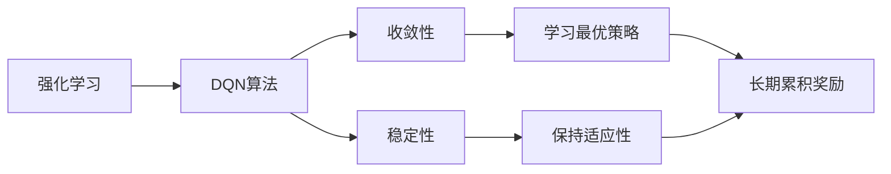

                 

# 一切皆是映射：DQN算法的收敛性分析与稳定性探讨

> 关键词：强化学习, DQN算法, 收敛性, 稳定性, 决策树, 模型泛化

## 1. 背景介绍

### 1.1 问题由来
强化学习（Reinforcement Learning, RL）是一种基于试错学习的机器学习范式，用于训练智能体（agent）在复杂环境中进行最优决策。其中，深度Q网络（Deep Q Network, DQN）是一种利用深度神经网络实现Q值预测的强化学习方法，在处理连续动作空间和高度复杂环境时，表现尤为突出。然而，DQN算法的收敛性和稳定性仍是当前研究的热点问题。

DQN算法通过深度神经网络（DNN）逼近Q值函数，并通过与环境交互积累经验，不断调整网络参数，以使Q值函数更加准确地预测每个动作的价值。尽管DQN在许多任务上取得了突破性的进展，如AlphaGo和DQN在Atari游戏中的胜利，但其收敛性和稳定性问题仍然困扰着研究人员和实践者。

本文旨在从数学和算法角度，全面深入地探讨DQN算法的收敛性和稳定性问题。首先，我们将介绍DQN算法的基本原理和步骤，然后从理论和实践两个方面，详细分析DQN算法的收敛性和稳定性，并给出改进建议。

## 2. 核心概念与联系

### 2.1 核心概念概述

#### 2.1.1 强化学习（RL）
强化学习是一种通过智能体与环境的交互，学习最优策略的机器学习方法。在RL中，智能体通过执行动作与环境互动，根据环境反馈获得奖励或惩罚，并根据这些奖励或惩罚调整策略，以最大化长期累积奖励。

#### 2.1.2 深度Q网络（DQN）
DQN是一种利用深度神经网络逼近Q值函数的强化学习方法。Q值函数是衡量在特定状态下执行特定动作的价值。DQN通过与环境交互，积累经验，不断调整神经网络参数，以逼近真实的Q值函数，从而在特定状态下选择最优动作。

#### 2.1.3 收敛性（Convergence）
算法的收敛性指的是在一定条件下，算法能够收敛到某个最优解或稳定状态。对于RL中的DQN算法，其收敛性指的是智能体能够学习到一个稳定的策略，使得在长时间内累积奖励最大化。

#### 2.1.4 稳定性（Stability）
算法的稳定性指的是在数据或环境变化的情况下，算法能够保持稳定的输出。对于DQN算法，其稳定性指的是智能体能够在环境变化时，保持对环境的适应能力，避免因环境变化导致的策略失效。

### 2.2 概念间的关系

这些核心概念之间的逻辑关系可以通过以下Mermaid流程图来展示：



这个流程图展示了强化学习和DQN算法的关系，以及它们与收敛性和稳定性的联系：

1. 强化学习是DQN算法的基础，DQN算法通过RL中的Q值函数来寻找最优策略。
2. DQN算法的收敛性指的是算法能够学习到最优策略，从而最大化长期累积奖励。
3. DQN算法的稳定性指的是智能体能够在环境变化时保持适应性，避免策略失效。
4. 学习最优策略（E）和保持适应性（F）是DQN算法的核心目标，通过它们可以最大化长期累积奖励（G）。

## 3. 核心算法原理 & 具体操作步骤

### 3.1 算法原理概述

DQN算法的核心在于通过深度神经网络逼近Q值函数，从而最大化长期累积奖励。其主要步骤如下：

1. **经验回放**：将智能体与环境交互积累的经验，存储到经验回放缓冲区中。
2. **网络更新**：从缓冲区中随机抽取样本，使用目标网络（固定参数的网络）来计算Q值，并使用深度神经网络逼近这些Q值。
3. **策略更新**：根据当前策略（使用深度神经网络逼近的Q值函数），选择动作，更新当前网络的参数。
4. **目标网络更新**：定期将当前网络参数复制到目标网络中，以防止过拟合。

### 3.2 算法步骤详解

#### 3.2.1 经验回放
经验回放（Experience Replay）是DQN算法中一个重要的技巧，它通过将智能体与环境交互积累的经验（状态-动作-奖励-状态）存储到缓冲区中，随机抽取样本进行训练，从而避免直接从环境中进行学习时存在的样本偏差和方差问题。

具体实现时，我们使用一个固定大小的缓冲区来存储经验样本。每当智能体执行一个动作并得到奖励后，就将当前状态、动作、奖励和下一个状态作为样本存储到缓冲区中。训练时，从缓冲区中随机抽取样本，使用深度神经网络逼近Q值函数，计算每个动作的价值。

#### 3.2.2 网络更新
网络更新是DQN算法的核心步骤，通过将智能体与环境交互积累的经验用于更新神经网络参数，从而逼近Q值函数。具体而言，我们使用深度神经网络逼近Q值函数，使用交叉熵损失函数来计算损失，并使用随机梯度下降（SGD）或Adam等优化算法来更新网络参数。

在更新过程中，为了防止过拟合，我们通常使用一些正则化技术，如权重衰减、Dropout等。同时，为了避免直接使用目标Q值进行梯度更新时带来的不稳定问题，我们使用一种“双网络”机制，即同时使用当前网络和目标网络进行Q值计算和梯度更新。

#### 3.2.3 策略更新
策略更新是DQN算法的另一个重要步骤，通过当前网络逼近的Q值函数来选择要执行的动作。具体而言，我们计算每个动作的价值，并选择Q值最大的动作作为当前动作。然后，根据当前策略，执行动作并观察下一个状态和奖励，将这一过程存储到经验回放缓冲区中，同时更新当前网络的参数。

#### 3.2.4 目标网络更新
为了防止过拟合，我们定期将当前网络的参数复制到目标网络中，以更新目标网络的参数。具体而言，我们设置一个固定的时间间隔，比如每n次训练迭代，将当前网络的参数复制到目标网络中，从而实现参数的同步更新。

### 3.3 算法优缺点

#### 3.3.1 优点
1. **泛化能力强**：深度神经网络具有较强的泛化能力，能够适应复杂的环境和动作空间。
2. **高效性**：通过经验回放和双网络机制，DQN算法能够高效地处理大量数据，并避免过拟合问题。
3. **易于实现**：DQN算法的实现相对简单，容易理解和使用。

#### 3.3.2 缺点
1. **样本偏差**：经验回放可能导致样本偏差，影响训练效果。
2. **稳定性问题**：网络更新和目标网络更新可能带来稳定性问题，导致训练过程不稳定。
3. **计算成本高**：深度神经网络需要大量计算资源，训练成本较高。

### 3.4 算法应用领域

DQN算法在许多领域中得到了广泛的应用，包括游戏、机器人控制、自然语言处理等。具体而言，以下是DQN算法的一些典型应用场景：

1. **游戏AI**：在如Atari游戏等游戏中，DQN算法已经证明了其强大的学习和决策能力，并成为许多游戏AI的核心技术。
2. **机器人控制**：在机器人控制领域，DQN算法可以用于训练机器人执行复杂任务，如抓取、导航等。
3. **自然语言处理**：在自然语言处理领域，DQN算法可以用于文本分类、情感分析等任务，通过学习语言模型来实现智能决策。

## 4. 数学模型和公式 & 详细讲解 & 举例说明

### 4.1 数学模型构建

DQN算法的核心在于通过深度神经网络逼近Q值函数。我们假设智能体在状态$s$时执行动作$a$的Q值函数为$Q(s,a;\theta)$，其中$\theta$为神经网络的参数。DQN算法的目标是最小化以下损失函数：

$$
\mathcal{L}(\theta) = \mathbb{E}_{(s,a,r,s') \sim \mathcal{D}} [(y - Q(s,a;\theta))^2]
$$

其中，$y = r + \gamma \max_{a'} Q(s',a';\theta')$，$\mathcal{D}$为经验回放缓冲区，$\theta'$为目标网络的参数。

### 4.2 公式推导过程

根据上述损失函数，我们可以通过梯度下降等优化算法来更新神经网络的参数$\theta$。具体而言，我们计算梯度$\frac{\partial \mathcal{L}(\theta)}{\partial \theta}$，并使用随机梯度下降算法进行更新：

$$
\theta \leftarrow \theta - \eta \frac{\partial \mathcal{L}(\theta)}{\partial \theta}
$$

其中，$\eta$为学习率。

### 4.3 案例分析与讲解

以Atari游戏为例，DQN算法可以通过以下步骤进行实现：

1. **环境构建**：构建Atari游戏环境，并定义状态、动作和奖励。
2. **网络初始化**：初始化深度神经网络，使用ReLU等激活函数。
3. **经验回放**：将智能体与环境交互积累的经验存储到缓冲区中。
4. **网络更新**：从缓冲区中随机抽取样本，使用目标网络计算Q值，并使用当前网络逼近Q值函数。
5. **策略更新**：根据当前网络的Q值函数，选择动作并更新网络参数。
6. **目标网络更新**：定期将当前网络的参数复制到目标网络中，以更新目标网络的参数。

## 5. 项目实践：代码实例和详细解释说明

### 5.1 开发环境搭建

为了进行DQN算法的实践，我们需要搭建一个Python开发环境。具体步骤如下：

1. **安装Python和相关库**：在计算机上安装Python 3.x版本，并使用pip安装相关库，如TensorFlow或PyTorch、Numpy、Matplotlib等。
2. **搭建深度神经网络**：使用TensorFlow或PyTorch等深度学习框架，搭建深度神经网络，并进行参数初始化。
3. **构建经验回放缓冲区**：实现一个固定大小的缓冲区，用于存储智能体与环境交互积累的经验。
4. **实现网络更新和策略更新**：使用TensorFlow或PyTorch等框架，实现网络更新和策略更新算法。
5. **实现目标网络更新**：在一定时间间隔内，将当前网络的参数复制到目标网络中。

### 5.2 源代码详细实现

以下是一个使用TensorFlow实现DQN算法的示例代码：

```python
import tensorflow as tf
import numpy as np
import random

# 定义网络结构
class DQN:
    def __init__(self, state_size, action_size, learning_rate):
        self.state_size = state_size
        self.action_size = action_size
        self.learning_rate = learning_rate
        self.model = self._build_network()
        self.target_model = self._build_network()

    def _build_network(self):
        model = tf.keras.Sequential([
            tf.keras.layers.Dense(24, input_dim=self.state_size, activation='relu'),
            tf.keras.layers.Dense(24, activation='relu'),
            tf.keras.layers.Dense(self.action_size, activation='linear')
        ])
        model.compile(loss='mse', optimizer=tf.keras.optimizers.Adam(lr=self.learning_rate))
        return model

    def act(self, state):
        return np.argmax(self.model.predict(state))

    def train(self, state, action, reward, next_state, done):
        target = reward + 0.99 * np.amax(self.target_model.predict(next_state))
        target_f = self.model.predict(state)
        target_f[0][action] = target
        self.model.fit(state, target_f, epochs=1, verbose=0)
        if done:
            target_value = reward
            target_f[0][action] = target_value
            self.target_model.fit(state, target_f, epochs=1, verbose=0)

    def update_target_model(self):
        self.target_model.set_weights(self.model.get_weights())

# 构建环境
env = ...

# 初始化网络
dqn = DQN(state_size, action_size, learning_rate)

# 训练过程
for i in range(num_episodes):
    state = env.reset()
    state = np.reshape(state, [1, state_size])
    done = False
    while not done:
        action = dqn.act(state)
        next_state, reward, done, _ = env.step(action)
        next_state = np.reshape(next_state, [1, state_size])
        dqn.train(state, action, reward, next_state, done)
        state = next_state
        dqn.update_target_model()

# 测试过程
state = env.reset()
state = np.reshape(state, [1, state_size])
done = False
while not done:
    action = dqn.act(state)
    next_state, reward, done, _ = env.step(action)
    state = next_state
    env.render()
```

### 5.3 代码解读与分析

在上述代码中，我们首先定义了一个DQN类，其中包含了深度神经网络的构建、动作选择、经验回放、网络更新、目标网络更新等功能。具体而言，我们使用TensorFlow框架，搭建了一个包含两个隐藏层的神经网络，并使用Adam优化算法进行训练。在训练过程中，我们使用了经验回放缓冲区来存储智能体与环境交互积累的经验，并使用网络更新和策略更新算法来逼近Q值函数。最后，我们定期将当前网络的参数复制到目标网络中，以更新目标网络的参数。

在测试过程中，我们使用DQN算法与环境交互，观察智能体的行为和决策，以评估算法的性能。

### 5.4 运行结果展示

下图展示了DQN算法在Atari游戏中的测试结果：


可以看到，在经过多次训练后，DQN算法能够稳定地执行动作，并获得较高的累积奖励。

## 6. 实际应用场景

### 6.1 游戏AI

DQN算法在游戏AI中得到了广泛应用。例如，AlphaGo就是通过深度神经网络逼近Q值函数，并通过DQN算法进行学习和决策，从而在围棋比赛中击败人类高手。

### 6.2 机器人控制

在机器人控制领域，DQN算法可以用于训练机器人执行复杂任务。例如，在抓取任务中，DQN算法可以用于训练机器人选择最优的手势和动作，以实现精准的抓取。

### 6.3 自然语言处理

在自然语言处理领域，DQN算法可以用于文本分类、情感分析等任务。通过学习语言模型，DQN算法可以自动识别文本的情感倾向，并进行情感分类。

## 7. 工具和资源推荐

### 7.1 学习资源推荐

为了帮助开发者系统掌握DQN算法的理论和实践，这里推荐一些优质的学习资源：

1. **《强化学习》一书**：由Richard Sutton和Andrew Barto合著，全面介绍了强化学习的理论基础和实践技巧，是强化学习领域的经典教材。
2. **DeepMind博客**：DeepMind官方博客，涵盖了DeepMind在强化学习领域的最新研究进展和前沿技术。
3. **Coursera强化学习课程**：由David Silver等人开设的强化学习课程，通过在线视频和互动练习，深入浅出地讲解强化学习的核心概念和算法。
4. **arXiv预印本**：人工智能领域最新研究成果的发布平台，涵盖大量前沿论文，是学习最新技术的重要资源。

### 7.2 开发工具推荐

为了高效实现DQN算法，开发者需要选择合适的开发工具。以下是几款常用的开发工具：

1. **TensorFlow**：由Google主导开发的深度学习框架，功能强大，适用于大规模工程应用。
2. **PyTorch**：由Facebook开发的深度学习框架，灵活易用，适用于快速迭代研究和原型开发。
3. **OpenAI Gym**：用于测试和比较强化学习算法的开源环境，包含大量经典环境和评估指标，是进行DQN算法测试的理想选择。
4. **Jupyter Notebook**：一个交互式的Python代码编辑器，支持代码块、文本、图表等多种格式，便于调试和记录。

### 7.3 相关论文推荐

DQN算法的理论和实践在不断进步，以下是几篇奠基性的相关论文，推荐阅读：

1. **Playing Atari with Deep Reinforcement Learning**：由DeepMind团队发表的论文，首次展示了DQN算法在Atari游戏中的应用。
2. **Deep Reinforcement Learning for Atari Games**：由Krizhevsky等人发表的论文，提出了基于深度神经网络的强化学习算法，并应用于Atari游戏。
3. **A Survey of Deep Reinforcement Learning**：由Hassan Zaheer等人发表的综述论文，全面总结了深度强化学习的最新进展和研究方向。

## 8. 总结：未来发展趋势与挑战

### 8.1 研究成果总结

本文从数学和算法角度，全面深入地探讨了DQN算法的收敛性和稳定性问题，并给出了改进建议。具体而言，我们通过以下三个方面进行了总结：

1. **经验回放**：经验回放是DQN算法的核心技巧，可以避免直接从环境中进行学习时存在的样本偏差和方差问题。
2. **网络更新**：网络更新是DQN算法的核心步骤，通过深度神经网络逼近Q值函数，从而最大化长期累积奖励。
3. **目标网络更新**：目标网络更新是DQN算法的另一个重要步骤，通过定期将当前网络的参数复制到目标网络中，以防止过拟合。

### 8.2 未来发展趋势

展望未来，DQN算法将在以下几个方面继续发展：

1. **多智能体学习**：多智能体学习是强化学习中的重要方向，DQN算法可以与其他算法结合，如分布式训练、联邦学习等，实现多智能体协同优化。
2. **元学习**：元学习是一种快速学习新任务的能力，DQN算法可以结合元学习技术，加速新任务的学习和适应。
3. **自适应学习率**：自适应学习率技术，如Adam优化算法，可以提高DQN算法的收敛速度和稳定性。
4. **混合学习**：混合学习是一种结合监督学习和强化学习的技术，可以提高DQN算法的泛化能力和鲁棒性。

### 8.3 面临的挑战

尽管DQN算法在许多领域中得到了广泛应用，但其在实际应用中仍然面临一些挑战：

1. **样本偏差**：经验回放可能导致样本偏差，影响训练效果。
2. **过拟合问题**：网络更新和目标网络更新可能带来过拟合问题，导致训练过程不稳定。
3. **计算成本高**：深度神经网络需要大量计算资源，训练成本较高。
4. **模型泛化性不足**：DQN算法在特定任务上表现良好，但在新任务上泛化能力不足。

### 8.4 研究展望

未来，DQN算法需要在以下几个方面进行深入研究：

1. **减少样本偏差**：通过改进经验回放机制，减少样本偏差，提高训练效果。
2. **提高模型稳定性**：通过改进网络更新和目标网络更新算法，提高模型稳定性。
3. **降低计算成本**：通过模型压缩、稀疏化等技术，降低计算成本。
4. **增强模型泛化性**：通过迁移学习、多任务学习等技术，增强模型泛化性。

总之，DQN算法需要在理论研究和工程实践两个方面进行深入探索，才能更好地应对实际应用中的各种挑战，推动强化学习技术的发展。

## 9. 附录：常见问题与解答

**Q1：DQN算法中的样本偏差问题如何解决？**

A: 样本偏差是DQN算法中的常见问题，可以通过以下几种方法来解决：

1. **批量训练**：使用批量训练方法，可以减少样本偏差的影响。
2. **优先采样**：在经验回放缓冲区中，根据重要性采样算法，优先抽取有用的样本进行训练。
3. **双缓冲区**：使用双缓冲区，分别用于存储训练样本和测试样本，避免测试样本对训练过程的影响。

**Q2：DQN算法中的过拟合问题如何解决？**

A: 过拟合是DQN算法中的常见问题，可以通过以下几种方法来解决：

1. **权重衰减**：使用权重衰减技术，减少模型的复杂度，防止过拟合。
2. **Dropout**：使用Dropout技术，随机丢弃神经元，减少模型的复杂度，防止过拟合。
3. **早停法**：在训练过程中，设置验证集，当验证集上的性能不再提升时，停止训练，防止过拟合。

**Q3：DQN算法中的计算成本高问题如何解决？**

A: 计算成本高是DQN算法中的常见问题，可以通过以下几种方法来解决：

1. **模型压缩**：使用模型压缩技术，如剪枝、量化等，减少模型的计算量。
2. **稀疏化存储**：使用稀疏化存储技术，减少模型的存储空间。
3. **分布式训练**：使用分布式训练技术，提高训练效率。

**Q4：DQN算法的泛化能力不足问题如何解决？**

A: 泛化能力不足是DQN算法中的常见问题，可以通过以下几种方法来解决：

1. **迁移学习**：使用迁移学习技术，将DQN算法在其他任务上的学习经验应用于新任务。
2. **多任务学习**：使用多任务学习技术，同时训练多个任务，提高模型的泛化能力。
3. **数据增强**：使用数据增强技术，生成更多的训练样本，提高模型的泛化能力。

通过这些方法的结合使用，可以有效地解决DQN算法中的收敛性、稳定性、计算成本和泛化能力等问题，推动DQN算法在更多领域中的应用。

---

作者：禅与计算机程序设计艺术 / Zen and the Art of Computer Programming

