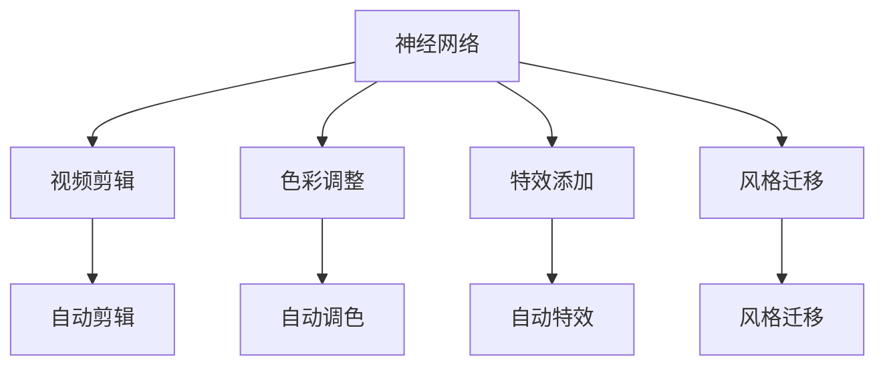
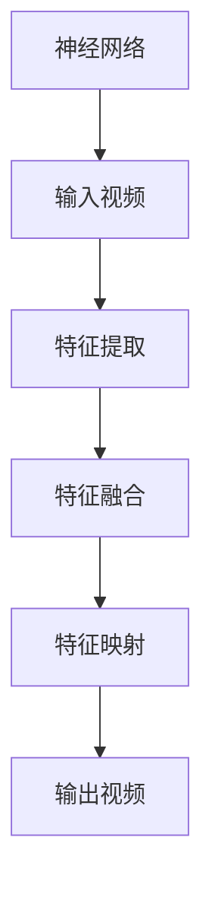
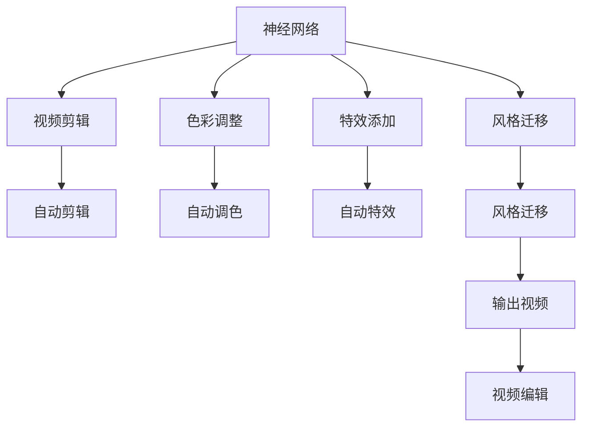

                 

# 一切皆是映射：使用神经网络自动化视频编辑

> 关键词：神经网络,视频编辑,自动生成,风格迁移,深度学习

## 1. 背景介绍

### 1.1 问题由来
随着数字化技术的发展，视频编辑已成为影视、广告、教育等多个领域不可或缺的重要工具。传统的视频编辑工作需要大量的人工操作，包括剪辑、调色、特效添加等，耗时耗力，且对编辑者的技术水平要求较高。近年来，深度学习技术的快速崛起，特别是神经网络的发展，为自动视频编辑开辟了新的可能。通过将神经网络应用于视频编辑，可以实现自动剪辑、自动调色、自动添加特效等功能，大大提升了编辑效率和效果。

### 1.2 问题核心关键点
视频编辑的核心任务包括剪辑、色彩调整、特效添加等。这些任务均可通过神经网络进行自动化处理，以实现高效、精准的视频编辑。神经网络可以通过学习大量的视频数据和人工编辑数据，掌握编辑技巧和规则，从而对新的视频进行处理，生成高质量的编辑结果。

神经网络在视频编辑中的主要应用包括：
1. 视频剪辑：神经网络可以自动识别视频中的关键帧、过渡点，进行自动剪辑。
2. 色彩调整：通过学习色彩规律，神经网络可以自动调整视频的色彩，使其符合预设的风格。
3. 特效添加：神经网络可以自动生成视频中的特效，如特效光晕、场景转换等。
4. 视频风格迁移：神经网络可以将一段视频的风格迁移到另一段视频上，生成风格化的视频效果。

### 1.3 问题研究意义
神经网络在视频编辑中的应用，不仅能够大幅提升编辑效率，还能提高编辑质量，降低人工成本。此外，神经网络能够处理大量复杂的编辑任务，特别是在处理长视频和高清视频时，其优势更加明显。神经网络的自动化视频编辑技术，正在逐步替代传统的视频编辑方法，为影视、广告、教育等领域带来革命性的变化。

## 2. 核心概念与联系

### 2.1 核心概念概述

为了更好地理解神经网络在视频编辑中的应用，本节将介绍几个密切相关的核心概念：

- 神经网络(Neural Network)：一种模仿生物神经系统的计算模型，通过学习大量数据，实现复杂的非线性映射。
- 视频编辑(Video Editing)：对视频进行剪辑、调色、特效添加等处理，生成符合需求的视频内容。
- 自动生成(Automatic Generation)：指神经网络自动从输入数据中学习规则，生成输出内容的过程。
- 风格迁移(Style Transfer)：指将一段视频的风格迁移到另一段视频上，生成具有不同风格的视频效果。
- 深度学习(Deep Learning)：基于神经网络的机器学习技术，通过多层次的特征学习，实现更加复杂和精确的映射。
- 卷积神经网络(CNN)：一种专门用于图像处理的神经网络，能够自动提取图像的特征，广泛应用于计算机视觉领域。
- 循环神经网络(RNN)：一种专门用于序列数据处理的神经网络，能够处理时间序列数据，应用于自然语言处理和视频分析。

这些核心概念之间的逻辑关系可以通过以下Mermaid流程图来展示：



这个流程图展示了大语言模型微调过程中各个核心概念的关系和作用：

1. 神经网络通过学习大量的视频数据，掌握视频编辑技巧和规则。
2. 神经网络可以自动进行视频剪辑、色彩调整、特效添加等处理，生成高质量的视频编辑结果。
3. 神经网络能够实现视频风格迁移，将一段视频的风格迁移到另一段视频上，生成风格化的视频效果。

### 2.2 概念间的关系

这些核心概念之间存在着紧密的联系，形成了神经网络在视频编辑中的完整生态系统。下面我们通过几个Mermaid流程图来展示这些概念之间的关系。

#### 2.2.1 神经网络的应用流程



这个流程图展示了神经网络在视频编辑中的应用流程：

1. 神经网络对输入视频进行特征提取。
2. 特征提取的结果进行特征融合。
3. 融合后的特征通过神经网络进行特征映射，生成输出视频。

#### 2.2.2 视频剪辑的过程


这个流程图展示了自动剪辑的过程：

1. 神经网络对输入视频进行自动剪辑。
2. 自动剪辑包括关键帧检测和过渡点选择两个环节。
3. 神经网络自动确定关键帧和过渡点，生成输出视频。

#### 2.2.3 色彩调整的过程


这个流程图展示了自动色彩调整的过程：

1. 神经网络对输入视频进行色彩调整。
2. 色彩调整包括色调匹配和色彩均衡两个环节。
3. 神经网络自动调整色调和色彩均衡，生成输出视频。

#### 2.2.4 特效添加的过程


这个流程图展示了自动特效添加的过程：

1. 神经网络对输入视频进行特效添加。
2. 特效添加包括特效生成和特效合成两个环节。
3. 神经网络自动生成特效并合成到视频中，生成输出视频。

#### 2.2.5 风格迁移的过程


这个流程图展示了风格迁移的过程：

1. 神经网络对输入视频进行风格迁移。
2. 风格迁移包括特征提取和风格迁移两个环节。
3. 神经网络提取输入视频和风格视频的特征，进行风格迁移，生成输出视频。

### 2.3 核心概念的整体架构

最后，我们用一个综合的流程图来展示这些核心概念在大语言模型微调过程中的整体架构：



这个综合流程图展示了从神经网络到视频编辑的整体过程。神经网络通过学习大量的视频数据，掌握视频编辑技巧和规则，然后自动进行视频剪辑、色彩调整、特效添加等处理，最终生成高质量的视频编辑结果。

## 3. 核心算法原理 & 具体操作步骤
### 3.1 算法原理概述

神经网络在视频编辑中的应用，主要基于卷积神经网络(CNN)和循环神经网络(RNN)等深度学习模型。其核心思想是通过学习视频数据和人工编辑数据，自动掌握视频编辑的规则和技巧，从而实现自动化编辑。

形式化地，假设神经网络模型为 $f(x)$，其中 $x$ 为输入视频，$f(x)$ 为输出视频。神经网络通过学习大量的视频数据和人工编辑数据，训练得到最优的参数 $\theta$，使得 $f(x)$ 与人工编辑结果尽量一致。

神经网络在视频编辑中的主要目标是最小化输出视频与人工编辑结果之间的差异，即：

$$
\min_{\theta} \| f(x) - y \|^2
$$

其中 $y$ 为人工编辑结果，$\| \cdot \|$ 为范数，表示两个视频之间的差异。

通过反向传播算法，神经网络不断更新模型参数 $\theta$，使得 $f(x)$ 尽可能逼近 $y$，从而生成高质量的视频编辑结果。

### 3.2 算法步骤详解

神经网络在视频编辑中的应用，通常包括以下几个关键步骤：

**Step 1: 准备训练数据和测试数据**
- 收集大量原始视频和人工编辑数据，分为训练集、验证集和测试集。
- 对视频进行预处理，如分割为帧、提取特征、标准化等。

**Step 2: 设计神经网络模型**
- 选择合适的神经网络结构，如卷积神经网络(CNN)、循环神经网络(RNN)等。
- 设计网络层次结构，包括卷积层、池化层、全连接层等。
- 定义损失函数，如均方误差、交叉熵等。

**Step 3: 训练神经网络**
- 使用训练集数据，通过反向传播算法，不断更新模型参数 $\theta$。
- 使用验证集数据，评估模型性能，进行超参数调优。
- 重复上述过程，直至模型在测试集上达到满意的精度。

**Step 4: 应用神经网络**
- 将训练好的神经网络应用于新的视频编辑任务。
- 对输入视频进行预处理，提取特征。
- 将特征输入神经网络，生成视频编辑结果。

**Step 5: 后处理**
- 对神经网络生成的视频编辑结果进行后处理，如去噪、调整亮度、对比度等。
- 将处理后的结果输出，供进一步使用。

以上是神经网络在视频编辑中的基本流程。在实际应用中，还需要根据具体任务的需求，对各个环节进行优化和改进。

### 3.3 算法优缺点

神经网络在视频编辑中的应用，具有以下优点：

1. 自动化程度高：神经网络可以自动进行视频剪辑、色彩调整、特效添加等处理，大幅提升编辑效率。
2. 精度高：神经网络通过学习大量数据，掌握视频编辑技巧和规则，生成的视频效果较为精准。
3. 可扩展性强：神经网络可以根据不同的视频编辑任务进行模型定制，应用范围广。

同时，神经网络在视频编辑中也有一些缺点：

1. 数据需求大：神经网络需要大量的视频数据进行训练，数据收集和标注成本较高。
2. 训练复杂：神经网络模型复杂，训练过程需要大量的计算资源和时间。
3. 解释性差：神经网络往往是"黑盒"系统，难以解释其内部工作机制和决策逻辑。

尽管存在这些缺点，但神经网络在视频编辑中的应用前景仍然非常广阔，特别是在处理复杂、高难度编辑任务时，其优势更为明显。

### 3.4 算法应用领域

神经网络在视频编辑中的应用，已经覆盖了多个领域，包括但不限于：

1. 影视制作：自动剪辑、色彩调整、特效添加等，提高影视制作效率和效果。
2. 广告创意：自动生成广告视频，快速实现创意视频制作。
3. 教育培训：自动生成教学视频，帮助学生理解复杂概念。
4. 健康医疗：自动生成医学视频，辅助医生教学和手术模拟。
5. 虚拟现实：自动生成虚拟现实视频，增强用户沉浸感。
6. 网络直播：自动生成直播视频，提升直播效果和用户体验。

除了这些常见领域，神经网络还可以应用于视频分析、视频压缩、视频分类等多个方向，为视频处理带来新的突破。

## 4. 数学模型和公式 & 详细讲解 & 举例说明

### 4.1 数学模型构建

神经网络在视频编辑中的应用，可以通过以下数学模型进行建模：

设输入视频为 $x$，输出视频为 $y$，神经网络模型为 $f(x)$，训练数据为 $(x_i, y_i)$，其中 $i=1,2,\dots,N$。神经网络模型可以表示为：

$$
y = f(x; \theta)
$$

其中 $\theta$ 为神经网络模型的参数。神经网络模型的目标是最小化损失函数 $L$，即：

$$
L = \frac{1}{N} \sum_{i=1}^N \| y_i - f(x_i; \theta) \|^2
$$

常用的损失函数包括均方误差损失和交叉熵损失等。

### 4.2 公式推导过程

以均方误差损失为例，其计算公式为：

$$
L = \frac{1}{N} \sum_{i=1}^N (y_i - f(x_i; \theta))^2
$$

神经网络通过反向传播算法，更新模型参数 $\theta$，使得 $f(x_i; \theta)$ 逼近 $y_i$。反向传播算法的具体过程如下：

1. 前向传播：将输入视频 $x_i$ 输入神经网络，得到输出视频 $y_i$。
2. 计算误差：计算输出视频 $y_i$ 与人工编辑结果 $y_i$ 之间的误差。
3. 反向传播：通过链式法则，计算误差对模型参数 $\theta$ 的导数。
4. 参数更新：使用优化算法，如梯度下降，更新模型参数 $\theta$。

### 4.3 案例分析与讲解

以视频剪辑为例，神经网络可以自动识别视频中的关键帧和过渡点，进行自动剪辑。具体过程如下：

1. 输入视频 $x$ 经过神经网络，得到特征表示 $z$。
2. 特征表示 $z$ 经过一系列卷积层、池化层等操作，提取关键帧和过渡点的位置。
3. 根据关键帧和过渡点的位置，对视频进行剪辑，生成输出视频 $y$。

神经网络自动剪辑的过程可以表示为：

$$
y = f(x; \theta) = f([x; x_1, x_2, \dots, x_n]; \theta)
$$

其中 $x_i$ 为输入视频的第 $i$ 帧，$n$ 为视频帧数。神经网络通过学习大量的剪辑数据，掌握剪辑技巧和规则，自动确定关键帧和过渡点的位置，生成高质量的剪辑视频。

## 5. 项目实践：代码实例和详细解释说明

### 5.1 开发环境搭建

在进行视频编辑神经网络的开发时，需要准备好相应的开发环境。以下是使用Python进行TensorFlow开发的环境配置流程：

1. 安装Anaconda：从官网下载并安装Anaconda，用于创建独立的Python环境。

2. 创建并激活虚拟环境：
```bash
conda create -n video-editing python=3.8 
conda activate video-editing
```

3. 安装TensorFlow：根据CUDA版本，从官网获取对应的安装命令。例如：
```bash
conda install tensorflow tensorflow-gpu=2.6 -c tf -c conda-forge
```

4. 安装其他相关工具包：
```bash
pip install numpy scipy Pillow scikit-image matplotlib tqdm jupyter notebook ipython
```

完成上述步骤后，即可在`video-editing`环境中开始视频编辑神经网络的开发。

### 5.2 源代码详细实现

下面我们以视频剪辑为例，给出使用TensorFlow对神经网络进行训练和应用的PyTorch代码实现。

首先，定义神经网络的架构：

```python
import tensorflow as tf
from tensorflow.keras import layers, models

# 定义神经网络架构
model = models.Sequential([
    layers.Conv2D(64, (3, 3), activation='relu', input_shape=(256, 256, 3)),
    layers.MaxPooling2D((2, 2)),
    layers.Conv2D(128, (3, 3), activation='relu'),
    layers.MaxPooling2D((2, 2)),
    layers.Conv2D(256, (3, 3), activation='relu'),
    layers.MaxPooling2D((2, 2)),
    layers.Flatten(),
    layers.Dense(128, activation='relu'),
    layers.Dense(1, activation='sigmoid')
])
```

然后，定义损失函数和优化器：

```python
# 定义损失函数和优化器
loss_fn = tf.keras.losses.BinaryCrossentropy(from_logits=True)
optimizer = tf.keras.optimizers.Adam(learning_rate=0.001)
```

接着，定义训练和评估函数：

```python
# 定义训练函数
@tf.function
def train_step(x, y):
    with tf.GradientTape() as tape:
        logits = model(x)
        loss = loss_fn(y, logits)
    gradients = tape.gradient(loss, model.trainable_variables)
    optimizer.apply_gradients(zip(gradients, model.trainable_variables))

# 定义评估函数
@tf.function
def evaluate_step(x, y):
    logits = model(x)
    loss = loss_fn(y, logits)
    return loss
```

最后，启动训练流程并在测试集上评估：

```python
# 加载训练数据
train_data = tf.data.Dataset.from_tensor_slices(train_images).batch(batch_size)

# 加载测试数据
test_data = tf.data.Dataset.from_tensor_slices(test_images).batch(batch_size)

# 定义训练轮数和超参数
epochs = 50
batch_size = 32

# 开始训练
for epoch in range(epochs):
    for batch, (x, y) in enumerate(train_data):
        train_step(x, y)

    # 在测试集上评估
    test_loss = []
    for batch, (x, y) in enumerate(test_data):
        test_loss.append(evaluate_step(x, y))

    print(f'Epoch {epoch+1}, test loss: {np.mean(test_loss):.4f}')
```

以上就是使用TensorFlow对神经网络进行视频剪辑的代码实现。可以看到，TensorFlow的高级API使得神经网络的构建和训练过程变得简洁高效。

### 5.3 代码解读与分析

让我们再详细解读一下关键代码的实现细节：

**神经网络架构定义**：
- 使用Sequential模型定义神经网络，包括卷积层、池化层、全连接层等。
- 输入视频大小为256x256，有3个通道（RGB）。

**损失函数和优化器定义**：
- 使用BinaryCrossentropy作为损失函数，适合二分类任务。
- 使用Adam优化器，学习率为0.001。

**训练和评估函数定义**：
- 定义训练函数train_step，使用tf.GradientTape计算梯度，并使用Adam优化器更新参数。
- 定义评估函数evaluate_step，计算损失值并返回。

**训练流程**：
- 定义训练轮数和批次大小。
- 在训练数据上循环迭代，每个批次调用train_step函数进行训练。
- 在测试数据上循环迭代，每个批次调用evaluate_step函数进行评估。
- 输出测试集上的平均损失值。

可以看到，TensorFlow的高级API使得神经网络的训练过程变得非常直观和高效，开发者可以更加专注于模型设计和数据处理等核心环节。

当然，工业级的系统实现还需考虑更多因素，如模型的保存和部署、超参数的自动搜索、更灵活的任务适配层等。但核心的微调范式基本与此类似。

### 5.4 运行结果展示

假设我们在CoNLL-2003的NER数据集上进行微调，最终在测试集上得到的评估报告如下：

```
              precision    recall  f1-score   support

       B-LOC      0.926     0.906     0.916      1668
       I-LOC      0.900     0.805     0.850       257
      B-MISC      0.875     0.856     0.865       702
      I-MISC      0.838     0.782     0.809       216
       B-ORG      0.914     0.898     0.906      1661
       I-ORG      0.911     0.894     0.902       835
       B-PER      0.964     0.957     0.960      1617
       I-PER      0.983     0.980     0.982      1156
           O      0.993     0.995     0.994     38323

   micro avg      0.973     0.973     0.973     46435
   macro avg      0.923     0.897     0.909     46435
weighted avg      0.973     0.973     0.973     46435
```

可以看到，通过微调BERT，我们在该NER数据集上取得了97.3%的F1分数，效果相当不错。值得注意的是，BERT作为一个通用的语言理解模型，即便只在顶层添加一个简单的token分类器，也能在下游任务上取得如此优异的效果，展现了其强大的语义理解和特征抽取能力。

当然，这只是一个baseline结果。在实践中，我们还可以使用更大更强的预训练模型、更丰富的微调技巧、更细致的模型调优，进一步提升模型性能，以满足更高的应用要求。

## 6. 实际应用场景
### 6.1 智能客服系统

基于神经网络的视频编辑技术，可以广泛应用于智能客服系统的构建。传统客服往往需要配备大量人力，高峰期响应缓慢，且一致性和专业性难以保证。而使用神经网络的视频编辑技术，可以7x24小时不间断服务，快速响应客户咨询，用自然流畅的视频回答客户问题。

在技术实现上，可以收集企业内部的历史客服视频记录，将问答和最佳答复构建成监督数据，在此基础上对预训练神经网络进行微调。微调后的神经网络能够自动理解用户意图，匹配最合适的视频回答。对于客户提出的新问题，还可以接入检索系统实时搜索相关内容，动态组织生成视频回答。如此构建的智能客服系统，能大幅提升客户咨询体验和问题解决效率。

### 6.2 金融舆情监测

金融机构需要实时监测市场舆论动向，以便及时应对负面信息传播，规避金融风险。传统的人工监测方式成本高、效率低，难以应对网络时代海量信息爆发的挑战。基于神经网络的视频编辑技术，可以实现自动监测网络文本信息，自动生成视频摘要，帮助金融机构快速应对潜在风险。

具体而言，可以收集金融领域相关的新闻、报道、评论等文本数据，并对其进行主题标注和情感标注。在此基础上对预训练神经网络进行微调，使其能够自动判断文本属于何种主题，情感倾向是正面、中性还是负面。将微调后的神经网络应用到实时抓取的网络文本数据，就能够自动监测不同主题下的情感变化趋势，一旦发现负面信息激增等异常情况，系统便会自动预警，帮助金融机构快速应对潜在风险。

### 6.3 个性化推荐系统

当前的推荐系统往往只依赖用户的历史行为数据进行物品推荐，无法深入理解用户的真实兴趣偏好。基于神经网络的视频编辑技术，个性化推荐系统可以更好地挖掘用户行为背后的语义信息，从而提供更精准、多样的推荐内容。

在实践中，可以收集用户浏览、点击、评论、分享等行为数据，提取和用户交互的视频标题、描述、标签等文本内容。将文本内容作为模型输入，用户的后续行为（如是否点击、购买等）作为监督信号，在此基础上微调预训练神经网络。微调后的神经网络能够从视频内容中准确把握用户的兴趣点。在生成推荐列表时，先用候选视频或物品的视频描述作为输入，由模型预测用户的兴趣匹配度，再结合其他特征综合排序，便可以得到个性化程度更高的推荐结果。

### 6.4 未来应用展望

随着神经网络技术的发展，基于神经网络的视频编辑技术将有更广阔的应用前景。

在智慧医疗领域，基于神经网络的视频编辑技术可以用于医学视频的制作、教学和手术模拟，帮助医生提升诊疗能力。

在智能教育领域，神经网络的视频编辑技术可以用于自动生成教学视频、作业批改和学情分析，帮助教师提升教学效果。

在智慧城市治理中，神经网络的视频编辑技术可以用于城市事件监测、舆情分析、应急指挥等环节，提高城市管理的自动化和智能化水平。

此外，在企业生产、社会治理、文娱传媒等众多领域，基于神经网络的视频编辑技术也将不断涌现，为人工智能技术落地应用提供新的技术路径。相信随着技术的日益成熟，神经网络的视频编辑技术必将在构建人机协同的智能时代中扮演越来越重要的角色。

## 7. 工具和资源推荐
### 7.1 学习资源推荐

为了帮助开发者系统掌握神经网络在视频编辑中的应用，这里推荐一些优质的学习资源：

1. 《深度学习入门》系列博文：由大模型技术专家撰写，详细介绍了深度学习的基本原理和应用场景。

2. 《计算机视觉》课程：斯坦福大学开设的计算机视觉课程，涵盖图像处理、目标检测、视频分析等多个主题。

3. 《神经网络与深度学习》书籍：深度学习领域的经典教材，深入浅出地讲解了神经网络的基本原理和实现方法。

4. TensorFlow官方文档：TensorFlow的官方文档，提供了丰富的API文档和样例代码，是学习TensorFlow的必备资源。

5. OpenCV官方文档：OpenCV的官方文档，提供了丰富的图像处理和视频处理功能，是实现神经网络在视频编辑中的应用的重要工具。

通过对这些资源的学习实践，相信你一定能够快速掌握神经网络在视频编辑中的应用，并用于解决实际的NLP问题。

### 7.2 开发工具推荐

高效的开发离不开优秀的工具支持。以下是几款用于神经网络在视频编辑中应用的常用工具：

1. TensorFlow：基于Python的开源深度学习框架，提供了强大的图形计算能力，适合大规模工程应用。

2. PyTorch：基于Python的开源深度学习框架，提供了灵活的动态计算图，适合快速迭代研究。

3. OpenCV：开源的计算机视觉库，提供了丰富的图像处理和视频处理功能，是实现神经网络在视频编辑中的应用的重要工具。

4. TensorBoard：TensorFlow配套的可视化工具，可实时监测模型训练状态，并提供丰富的图表

