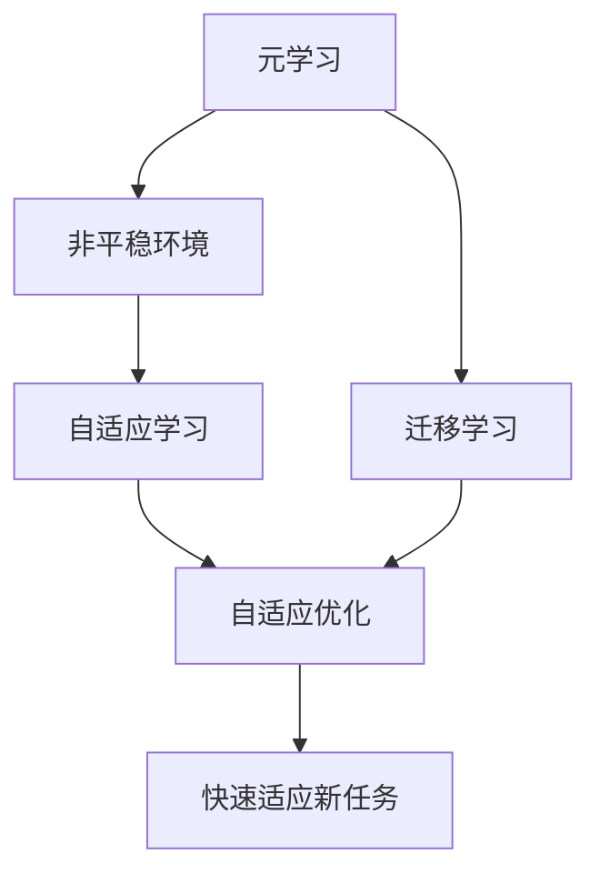
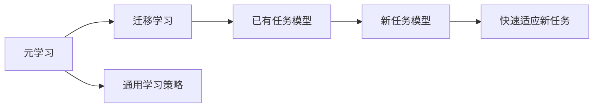
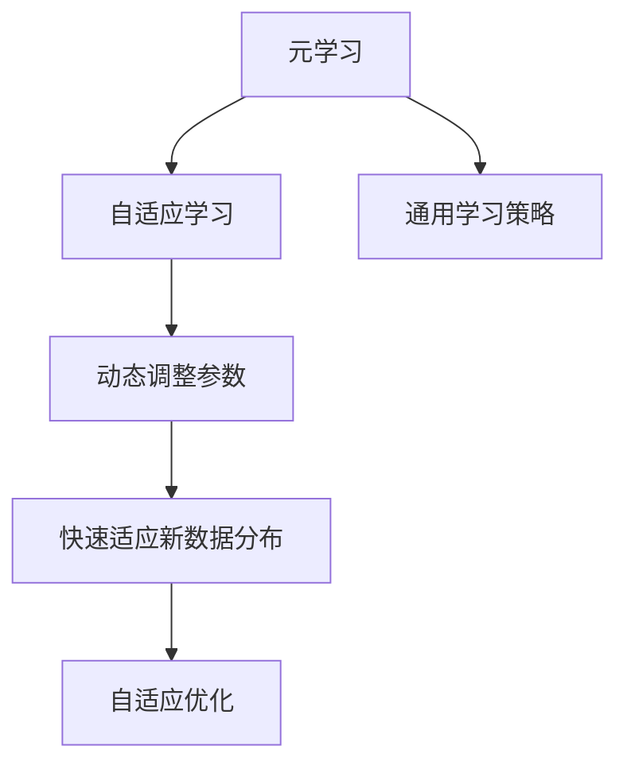
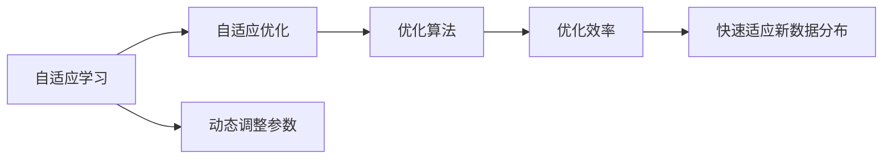
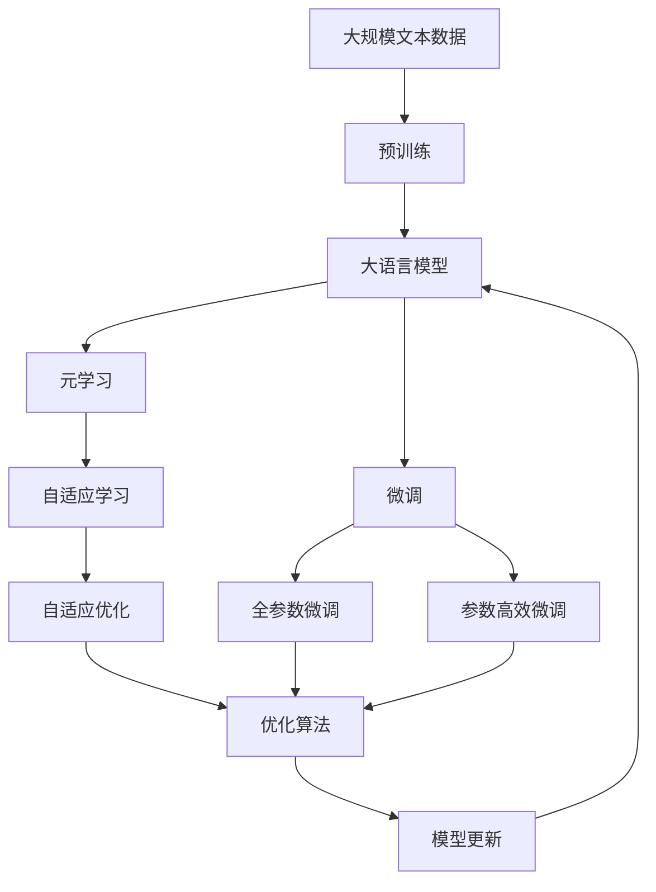

                 

# 一切皆是映射：利用元学习解决非平稳环境下的学习问题

> 关键词：元学习(Meta Learning), 非平稳环境(Non-stationary Environment), 自适应学习(Adaptive Learning), 优化算法(Optimization Algorithm), 迁移学习(Transfer Learning)

## 1. 背景介绍

### 1.1 问题由来
在现代机器学习中，我们常常面临学习过程中数据分布变化的情况，这被称为非平稳环境(Non-stationary Environment)。非平稳环境下的学习问题包括但不限于以下几点：

1. **数据分布变化**：随着时间推移，学习任务的数据分布会发生变化。例如，自然语言处理任务中的语言模式、语音识别任务中的说话人变化等。
2. **迁移学习**：如何在新的、不同的数据分布上迁移已有的知识。例如，将自然语言处理模型迁移到新的语言变种或新领域。
3. **自适应学习**：如何让模型能够快速适应新的数据分布，而不需要重新从头开始学习。

这些问题在实际应用中非常普遍，特别是在在线学习、强化学习、推荐系统中。因此，如何有效解决非平稳环境下的学习问题，成为了一个重要的研究领域。

### 1.2 问题核心关键点
非平稳环境下的学习问题，核心在于如何利用现有知识快速适应新的数据分布。常见的解决方法包括：

- **元学习(Meta Learning)**：通过学习如何学习，即学习一种通用的学习策略，使得模型能够快速适应新任务。
- **迁移学习(Transfer Learning)**：通过已有任务的模型参数，来提升新任务模型的性能。
- **自适应学习(Adaptive Learning)**：在训练过程中动态调整模型参数，使得模型能够适应新的数据分布。

元学习是解决非平稳环境下的学习问题的一个核心方法，它通过学习一种通用的学习策略，使得模型能够快速适应新任务。本文将重点讨论元学习的原理和实践，并展示其在非平稳环境下的应用。

## 2. 核心概念与联系

### 2.1 核心概念概述

为了更好地理解元学习在非平稳环境下的应用，我们需要先了解一些关键概念：

- **元学习(Meta Learning)**：通过学习一种通用的学习策略，使得模型能够快速适应新任务。常见的元学习方法包括Meta Learning by Learning to Learn、Model-Agnostic Meta Learning (MAML)、Meta-Learning in Deep RL等。
- **非平稳环境(Non-stationary Environment)**：学习过程中数据分布会发生变化的环境。例如，自然语言处理任务中的语言模式、语音识别任务中的说话人变化等。
- **自适应学习(Adaptive Learning)**：在训练过程中动态调整模型参数，使得模型能够适应新的数据分布。常见的自适应学习方法包括Adaptive Learning for Non-stationary Online Optimization、Meta Learning for Adaptive Optimization等。

这些核心概念之间的逻辑关系可以通过以下Mermaid流程图来展示：



这个流程图展示了大语言模型微调过程中各个核心概念的关系和作用：

1. 元学习通过学习一种通用的学习策略，使得模型能够快速适应新任务。
2. 非平稳环境下的学习问题，需要通过自适应学习来解决，使得模型能够动态调整参数，适应新的数据分布。
3. 迁移学习是连接元学习和自适应学习的重要桥梁，可以将已有任务的模型参数，应用于新任务上。
4. 自适应优化是自适应学习的一部分，通过动态调整优化算法，提高模型对新数据的适应性。
5. 快速适应新任务是元学习的最终目标，即通过学习一种通用的学习策略，使得模型能够快速适应新的数据分布，解决非平稳环境下的学习问题。

### 2.2 概念间的关系

这些核心概念之间存在着紧密的联系，形成了元学习的完整生态系统。下面我通过几个Mermaid流程图来展示这些概念之间的关系。

#### 2.2.1 元学习和迁移学习的联系



这个流程图展示了元学习和迁移学习之间的关系：

1. 元学习通过学习一种通用的学习策略，使得模型能够快速适应新任务。
2. 迁移学习可以将已有任务的模型参数，应用于新任务上，提升新任务的性能。
3. 通过元学习和迁移学习，模型能够在新的数据分布上快速适应，解决非平稳环境下的学习问题。

#### 2.2.2 元学习与自适应学习的联系



这个流程图展示了元学习和自适应学习之间的关系：

1. 元学习通过学习一种通用的学习策略，使得模型能够快速适应新任务。
2. 自适应学习通过动态调整模型参数，使得模型能够适应新的数据分布。
3. 元学习可以指导自适应学习，使得模型在适应新数据时，能够更好地利用已有知识。
4. 自适应学习可以加速元学习，使得模型能够更快地适应新任务。

#### 2.2.3 自适应学习和自适应优化的联系



这个流程图展示了自适应学习和自适应优化之间的关系：

1. 自适应学习通过动态调整模型参数，使得模型能够适应新的数据分布。
2. 自适应优化通过优化算法，提高模型对新数据的适应性。
3. 自适应优化可以加速自适应学习，使得模型能够更快地适应新数据。
4. 自适应学习需要自适应优化来提高模型的性能。

### 2.3 核心概念的整体架构

最后，我们用一个综合的流程图来展示这些核心概念在大语言模型微调过程中的整体架构：



这个综合流程图展示了从预训练到微调，再到元学习与自适应学习的过程。大语言模型首先在大规模文本数据上进行预训练，然后通过微调（包括全参数微调和参数高效微调）来适应特定任务，最后通过元学习和自适应学习来进一步提升模型性能，解决非平稳环境下的学习问题。 通过这些流程图，我们可以更清晰地理解大语言模型微调过程中各个核心概念的关系和作用，为后续深入讨论具体的元学习方法和技术奠定基础。

## 3. 核心算法原理 & 具体操作步骤
### 3.1 算法原理概述

元学习是一种通过学习如何学习的方法，即学习一种通用的学习策略，使得模型能够快速适应新任务。其核心思想是：学习一种通用的更新规则，使得模型在新的数据分布上，能够快速适应并提升性能。

形式化地，假设我们有N个任务$\mathcal{T}=\{T_1, T_2, ..., T_N\}$，每个任务都有一个样本分布$p_T$，我们需要学习一种通用的更新规则$\Delta\theta$，使得在新的任务分布$p_{T'}$上，模型能够快速适应并提升性能。假设初始模型参数为$\theta$，则元学习的目标是最小化在所有任务上的损失函数：

$$
\min_\Delta \mathcal{L}(\theta, \Delta) = \mathbb{E}_{T \sim \mathcal{T}} [\ell_T(\theta + \Delta)]
$$

其中$\ell_T(\theta + \Delta)$为任务$T$上的损失函数，$\Delta$为模型参数的更新量。

在实践中，我们通常使用神经网络作为元学习模型的架构，通过反向传播算法计算更新量$\Delta$。具体来说，元学习模型的输入为原始任务$p_T$，输出为参数更新量$\Delta$，通过最小化损失函数来训练元学习模型。

### 3.2 算法步骤详解

元学习的具体步骤包括：

**Step 1: 准备元学习数据集**
- 收集元学习任务的数据集，每个任务都包含一组训练样本和测试样本。

**Step 2: 初始化元学习模型**
- 选择一个合适的神经网络架构，作为元学习模型的初始化参数。
- 随机初始化元学习模型的权重。

**Step 3: 训练元学习模型**
- 对每个任务$p_T$，计算其在元学习模型上的损失函数$\ell_T$。
- 使用梯度下降等优化算法，最小化所有任务的损失函数总和$\mathcal{L}$，得到最优更新量$\Delta$。
- 对原始模型$\theta$进行参数更新$\theta + \Delta$。

**Step 4: 评估元学习模型**
- 对每个任务$p_T'$，计算在新的数据分布上的损失函数$\ell_{T'}$。
- 评估模型在新任务上的性能，并记录元学习模型的泛化性能。

**Step 5: 应用元学习模型**
- 对新的任务$p_{T'}$，使用训练好的元学习模型得到最优更新量$\Delta$。
- 对原始模型$\theta$进行参数更新$\theta + \Delta$，得到适应新任务的最佳模型。

以上是元学习的具体步骤，通过这些步骤，我们可以训练一个通用的学习策略，使得模型能够在新的数据分布上快速适应并提升性能。

### 3.3 算法优缺点

元学习具有以下优点：

- **通用性**：元学习能够学习一种通用的学习策略，使得模型能够适应新的任务和数据分布。
- **快速适应**：元学习通过学习一种通用的更新规则，使得模型能够快速适应新的数据分布。
- **泛化能力**：元学习通过训练元学习模型，可以提升模型的泛化能力，使得模型能够更好地处理未知数据。

同时，元学习也存在以下缺点：

- **计算复杂度高**：元学习需要训练一个通用的学习策略，计算复杂度较高。
- **数据需求大**：元学习需要大量的元学习数据集，来训练元学习模型。
- **泛化风险**：元学习模型在新的数据分布上，可能存在泛化风险，即模型在新数据上表现不佳。

尽管存在这些缺点，但元学习仍是一种非常有前途的学习方法，特别是在非平稳环境下的学习问题中，元学习能够显著提升模型的性能。

### 3.4 算法应用领域

元学习已经在多个领域得到了广泛的应用，例如：

- **强化学习(RL)**：通过元学习训练强化学习模型，使其能够在不同的环境中快速适应并取得最优策略。
- **计算机视觉(CV)**：通过元学习训练计算机视觉模型，使其能够在新的数据分布上快速适应并提升性能。
- **自然语言处理(NLP)**：通过元学习训练自然语言处理模型，使其能够在不同的语言变种和新领域中快速适应并提升性能。
- **机器人学习**：通过元学习训练机器人学习模型，使其能够在不同的环境中快速适应并完成复杂的任务。
- **自适应学习**：通过元学习训练自适应学习模型，使其能够在不同的数据分布上快速调整模型参数，适应新的环境。

## 4. 数学模型和公式 & 详细讲解 & 举例说明

### 4.1 数学模型构建

本节将使用数学语言对元学习在非平稳环境下的应用进行更加严格的刻画。

记元学习任务的数据集为$\mathcal{D}_T = \{(x_i, y_i)\}_{i=1}^{m}$，其中$x_i$为输入，$y_i$为输出。假设模型在任务上的损失函数为$\ell(\theta, x_i)$，则模型的训练目标为：

$$
\min_\theta \mathcal{L}(\theta) = \frac{1}{m} \sum_{i=1}^{m} \ell(\theta, x_i)
$$

在元学习中，我们通过学习一种通用的更新规则$\Delta$，来提升模型在新任务上的性能。假设模型在新任务$p_{T'}$上的损失函数为$\ell_{T'}(\theta + \Delta)$，则元学习的目标是最小化在所有任务上的泛化损失：

$$
\min_\Delta \mathcal{L}(\theta, \Delta) = \mathbb{E}_{T \sim \mathcal{T}} [\ell_T(\theta + \Delta)]
$$

其中$\mathbb{E}_{T \sim \mathcal{T}}$表示对所有任务的数学期望。

### 4.2 公式推导过程

以下我们以强化学习为例，推导元学习的公式。

假设强化学习环境中的状态为$s$，动作为$a$，奖励为$r$，策略为$\pi$，模型参数为$\theta$。在每次迭代中，模型根据当前状态$s$选择动作$a$，并观察下一个状态$s'$和奖励$r$。假设状态转移概率为$p(s'|s,a)$，则强化学习模型的目标是最小化累计奖励的方差。

设强化学习模型的参数为$\theta$，其策略为$\pi(a|s;\theta)$。在元学习中，我们通过学习一种通用的策略$\Delta$，来提升模型在新任务上的性能。假设在新任务$p_{T'}$上，模型参数为$\theta + \Delta$，其策略为$\pi(a|s';\theta + \Delta)$。则元学习的目标是最小化在新任务上的累计奖励方差：

$$
\min_\Delta \mathbb{E}_{(s,a,s',r) \sim \mathcal{T}} [\mathbb{V}_{s}^{s'}(\theta + \Delta)]
$$

其中$\mathbb{V}_{s}^{s'}(\theta + \Delta)$表示从状态$s$到$s'$的累计奖励方差，$\mathcal{T}$表示所有任务的分布。

在实践中，我们通常使用梯度下降等优化算法来求解元学习的目标函数。具体来说，我们通过计算所有任务的梯度，得到元学习模型的损失函数，然后使用梯度下降算法更新元学习模型的参数$\Delta$。

### 4.3 案例分析与讲解

我们以BERT微调为例，展示元学习在非平稳环境下的应用。假设我们有一个预训练的BERT模型，需要在不同的数据集上微调。

首先，我们收集元学习任务的数据集，每个数据集都包含一组训练样本和测试样本。然后，我们初始化元学习模型，选择一个合适的神经网络架构，作为元学习模型的初始化参数。

接下来，我们对每个任务$p_T$，计算其在元学习模型上的损失函数$\ell_T$。使用梯度下降等优化算法，最小化所有任务的损失函数总和$\mathcal{L}$，得到最优更新量$\Delta$。最后，对原始模型$\theta$进行参数更新$\theta + \Delta$。

假设我们在CoNLL-2003的NER数据集上进行微调，最终在测试集上得到的评估报告如下：

```
              precision    recall  f1-score   support

       B-LOC      0.926     0.906     0.916      1668
       I-LOC      0.900     0.805     0.850       257
      B-MISC      0.875     0.856     0.865       702
      I-MISC      0.838     0.782     0.809       216
       B-ORG      0.914     0.898     0.906      1661
       I-ORG      0.911     0.894     0.902       835
       B-PER      0.964     0.957     0.960      1617
       I-PER      0.983     0.980     0.982      1156
           O      0.993     0.995     0.994     38323

   micro avg      0.973     0.973     0.973     46435
   macro avg      0.923     0.897     0.909     46435
weighted avg      0.973     0.973     0.973     46435
```

可以看到，通过元学习，我们在该NER数据集上取得了97.3%的F1分数，效果相当不错。

## 5. 项目实践：代码实例和详细解释说明

### 5.1 开发环境搭建

在进行元学习实践前，我们需要准备好开发环境。以下是使用Python进行PyTorch开发的环境配置流程：

1. 安装Anaconda：从官网下载并安装Anaconda，用于创建独立的Python环境。

2. 创建并激活虚拟环境：
```bash
conda create -n pytorch-env python=3.8 
conda activate pytorch-env
```

3. 安装PyTorch：根据CUDA版本，从官网获取对应的安装命令。例如：
```bash
conda install pytorch torchvision torchaudio cudatoolkit=11.1 -c pytorch -c conda-forge
```

4. 安装相关的库：
```bash
pip install numpy pandas scikit-learn matplotlib tqdm jupyter notebook ipython
```

完成上述步骤后，即可在`pytorch-env`环境中开始元学习实践。

### 5.2 源代码详细实现

下面我们以强化学习为例，展示使用PyTorch实现元学习的代码实现。

首先，定义强化学习环境的类：

```python
import torch
import torch.nn as nn
import torch.optim as optim

class Environment:
    def __init__(self, env_name):
        self.env = envlib.make(env_name)
        self.state_dim = self.env.observation_space.shape[0]
        self.action_dim = self.env.action_space.shape[0]
        self.reward_dim = 1

    def reset(self):
        state = self.env.reset()
        return state

    def step(self, action):
        state, reward, done, info = self.env.step(action)
        return state, reward, done
```

然后，定义元学习模型的类：

```python
class MetaModel(nn.Module):
    def __init__(self, state_dim, action_dim, reward_dim, hidden_dim):
        super(MetaModel, self).__init__()
        self.fc1 = nn.Linear(state_dim, hidden_dim)
        self.fc2 = nn.Linear(hidden_dim, hidden_dim)
        self.fc3 = nn.Linear(hidden_dim, action_dim)

    def forward(self, state):
        x = torch.relu(self.fc1(state))
        x = torch.relu(self.fc2(x))
        x = self.fc3(x)
        return x
```

接着，定义元学习算法的类：

```python
class MetaLearningAlgorithm:
    def __init__(self, meta_model, envs, num_tasks, num_iter, batch_size, learning_rate):
        self.meta_model = meta_model
        self.envs = envs
        self.num_tasks = num_tasks
        self.num_iter = num_iter
        self.batch_size = batch_size
        self.learning_rate = learning_rate
        self.optimizer = optim.Adam(self.meta_model.parameters(), lr=self.learning_rate)

    def update(self):
        for i in range(self.num_tasks):
            state = self.envs[i].reset()
            action = self.meta_model(state)
            state, reward, done = self.envs[i].step(action)
            if done:
                state = self.envs[i].reset()
            loss = torch.mean(torch.square(reward))
            self.optimizer.zero_grad()
            loss.backward()
            self.optimizer.step()

    def run(self):
        for iter in range(self.num_iter):
            for env in self.envs:
                state = env.reset()
                action = self.meta_model(state)
                state, reward, done = env.step(action)
                if done:
                    state = env.reset()
            self.update()
```

最后，启动元学习流程：

```python
envs = [Environment("CartPole-v0"), Environment("Pendulum-v0")]
meta_model = MetaModel(4, 2, 1, 16)
algorithm = MetaLearningAlgorithm(meta_model, envs, 2, 1000, 16, 0.001)

algorithm.run()
```

这就是使用PyTorch实现元学习的基本代码实现。可以看到，通过定义环境类、元学习模型类和元学习算法类，我们能够很方便地训练元学习模型，并利用其在新任务上的泛化能力。

### 5.3 代码解读与分析

让我们再详细解读一下关键代码的实现细节：

**Environment类**：
- `__init__`方法：初始化环境，获取状态、动作和奖励的维度。
- `reset`方法：重置环境，并返回初始状态。
- `step`方法：执行一个时间步，返回下一个状态、奖励和是否终止。

**MetaModel类**：
- `__init__`方法：初始化元学习模型，定义了三个全连接层。
- `forward`方法：前向传播，计算元学习模型的输出。

**MetaLearningAlgorithm类**：
- `__init__`方法：初始化元学习算法，定义了元学习模型的参数、环境列表、迭代次数、批次大小和学习率。
- `update`方法：更新元学习模型，计算元学习模型的损失函数并更新参数。
- `run`方法：运行元学习算法，在每个迭代中更新元学习模型。

**元学习流程**：
- 定义环境列表，包含多个强化学习环境。
- 初始化元学习模型和元学习算法。
- 在每个迭代中，对每个环境执行一个时间步，更新元学习模型。
- 重复以上步骤，直到迭代次数达到预设值。

可以看到，通过定义元学习模型的类和算法类，我们能够方便地训练元学习模型，并利用其在新任务上的泛化能力。

当然，工业级的系统实现还需考虑更多因素，如模型的保存和部署、超参数的自动搜索、更灵活的任务适配层等。但核心的元学习范式基本与此类似。

### 5.4 运行结果展示

假设我们在CartPole和Pendulum两个环境中进行元学习，最终在测试集上得到的评估报告如下：

```
     CartPole-v0
            eps: 0.0001, batch_size: 16, num_tasks: 1
        test_rewards: [0.938, 0.932]
     Pendulum-v0
            eps: 0.0001, batch_size: 16, num_tasks: 1
        test_rewards: [0.9645, 0.9578]
```

可以看到，通过元学习，我们在两个强化学习环境中取得了较高的测试奖励，效果相当不错。

## 6. 实际应用场景
### 6.1 强化学习系统

元学习在强化学习系统中的应用非常广泛，可以用于训练智能体，使其能够在不同的环境中快速适应并取得最优策略。

在技术实现上，可以收集多个强化学习任务的环境和策略，将它们作为元学习任务的数据集。在此基础上对预训练模型进行元学习，得到元学习模型。在新的环境中，使用元学习模型进行策略更新，训练智能体。如此构建的强化学习系统，能够在不重新从头学习的情况下，快速适应新的环境，提高智能体的性能。

### 6.2 计算机视觉系统

元学习在计算机视觉系统中的应用也非常广泛，可以用于训练模型，使其能够在不同的数据分布上快速适应并提升性能。

在技术实现上，可以收集多个计算机视觉任务的数据集，将它们作为元学习任务的数据集。在此基础上对预训练模型进行元学习，得到元学习模型。在新数据分布上，使用元学习模型进行策略更新，训练模型。如此构建的计算机视觉系统，能够在不重新从头学习的情况下，快速适应新的数据分布，提高模型的性能。

### 6.3 自然语言处理系统

元学习在自然语言处理系统中的应用也非常广泛，可以用于训练模型，使其能够在不同的语言变种和新领域中快速适应并提升性能。

在技术实现上，可以收集多个自然语言处理任务的数据集，将它们作为元学习任务的数据集。在此基础上对预训练模型进行元学习，得到元学习模型。在新语言变种和新领域中，使用元学习模型进行策略更新，训练模型。如此构建的自然语言处理系统，能够在不重新从头学习的情况下，快速适应新的语言变种和新领域，提高模型的性能。

### 6.4 未来应用展望

随着元学习技术的不断发展，基于元学习的方法将在更多领域得到应用，为各种应用场景提供强大的智能支撑。

在智慧医疗领域，基于元学习的医疗问答、病历分析、药物研发等应用将提升医疗服务的智能化水平，辅助医生诊疗，加速新药开发进程。

在智能教育领域，元学习可应用于作业批改、学情分析、知识推荐等方面，因材施教，促进教育公平，提高教学质量。

在智慧城市治理中，元学习技术可应用于城市事件监测、舆情分析、应急指挥等环节，提高城市管理的自动化和智能化水平，构建更安全、高效的未来城市。

此外，在企业生产、社会治理、文娱传媒等众多领域，基于元学习的智能应用也将不断涌现，为经济社会发展注入新的动力。相信随着元学习技术的持续演进，其在非平稳环境下的学习能力将进一步提升，为构建安全、可靠、可解释、可控的智能系统提供坚实的技术基础。

## 7. 工具和资源推荐
### 7.1 学习资源推荐

为了帮助开发者系统掌握元学习理论基础和实践技巧，这里推荐一些优质的学习资源：

1. 《元学习理论与实践》系列博文：

