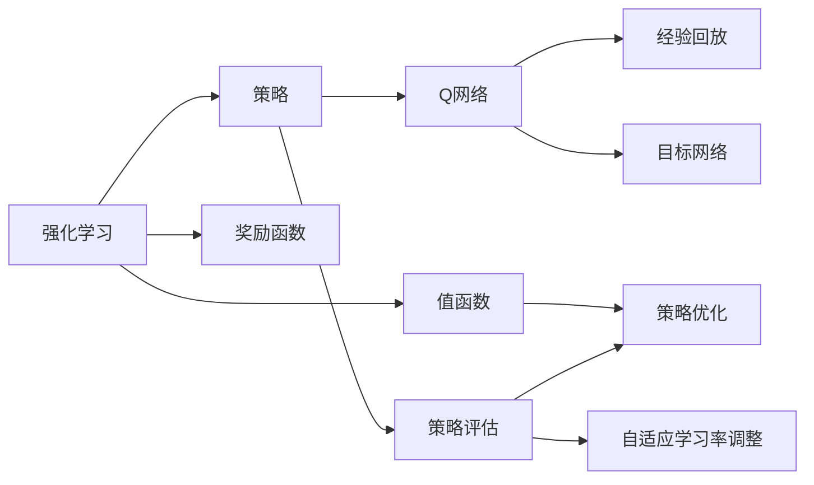

                 

# 一切皆是映射：基于DQN的自适应学习率调整机制探究

> 关键词：强化学习, 深度Q网络(DQN), 自适应学习率, 梯度下降, 政策评估与优化

## 1. 背景介绍

### 1.1 问题由来

在人工智能领域，强化学习（Reinforcement Learning, RL）是一种通过试错迭代提升智能体（agent）在特定环境中表现的技术。强化学习框架包括策略（Policy）、值函数（Value Function）和奖励函数（Reward Function）三个核心组件，通过不断的交互与反馈，智能体学习到最优策略以最大化长期累积奖励。

然而，强化学习的实践中也面临着诸多挑战。例如，当环境复杂度增加时，策略优化变得困难；当智能体的能力增强时，学习率的设置需要精细调整；当策略空间巨大时，传统的随机梯度下降（SGD）方法难以平衡探索与利用（exploitation）。

为了应对这些问题，研究者提出了一种基于深度神经网络的强化学习算法——深度Q网络（Deep Q Network, DQN）。DQN通过近似值函数（通常使用Q网络）替代传统Q-Learning中的Q表，在具有高度复杂性和动态性的环境中，DQN表现出更优的性能。

但是，传统的DQN方法仍存在学习率不稳定、探索与利用平衡难以控制等问题。因此，本文将探讨一种基于DQN的自适应学习率调整机制，旨在提高策略优化的稳定性与效率。

### 1.2 问题核心关键点

- 强化学习的基本原理：通过不断的交互与反馈，智能体学习到最优策略以最大化长期累积奖励。
- DQN的实现：使用深度神经网络近似Q表，利用经验回放（Experience Replay）和目标网络（Target Network）提高学习效率和稳定性。
- 学习率的自适应调整：通过动态调节学习率，优化策略更新过程，平衡探索与利用。
- 自适应机制的设计：引入经典自适应学习算法，如Adaptive Moment Estimation（Adam）和Adaptive Moment Approximation（A2C），优化DQN中的参数更新。

## 2. 核心概念与联系

### 2.1 核心概念概述

为了更好地理解基于DQN的自适应学习率调整机制，本节将介绍几个密切相关的核心概念：

- 强化学习（Reinforcement Learning, RL）：一种通过试错迭代提升智能体表现的技术，包含策略、值函数和奖励函数三个核心组件。
- 深度Q网络（Deep Q Network, DQN）：使用深度神经网络近似Q表，提高在高维复杂环境中智能体的学习效率和稳定性。
- 自适应学习率调整：根据训练过程中的动态反馈，动态调整学习率，优化策略更新过程。
- 探索与利用平衡：在策略学习过程中，如何在探索未知领域（探索）和利用已有知识（利用）之间找到平衡点。

这些核心概念之间存在着紧密的联系，共同构成了强化学习及DQN的核心框架。下面是这些概念的Mermaid流程图，展示它们之间的逻辑关系：



这个流程图展示了强化学习的基本框架，以及DQN和自适应学习率调整机制的基本组成。

### 2.2 概念间的关系

这些核心概念之间存在着复杂的联系和相互作用。以下是一些详细的说明：

- 策略（Policy）是智能体的决策规则，指导智能体在环境中的行为选择。在DQN中，策略通常由神经网络表示，通过学习Q值函数来优化。
- 值函数（Value Function）用于评估智能体在特定状态下的预期长期累积奖励，是策略优化的关键。在DQN中，值函数通常由深度神经网络近似。
- 奖励函数（Reward Function）定义了智能体在每个状态下获得的即时奖励，用于引导智能体向最优状态靠近。
- DQN通过近似值函数替代Q表，利用经验回放和目标网络优化Q值函数的估计。
- 自适应学习率调整机制通过动态调整学习率，优化策略更新过程，平衡探索与利用。

这些概念共同构成了强化学习及DQN的完整生态系统，使其能够高效地应对复杂环境中的智能体决策问题。

## 3. 核心算法原理 & 具体操作步骤
### 3.1 算法原理概述

基于DQN的自适应学习率调整机制，其核心思想是动态调节学习率，以优化策略更新过程。该机制通过结合经典自适应学习算法（如Adam、A2C），根据训练过程中的动态反馈，实时调整学习率，提高策略优化的稳定性与效率。

算法的基本流程如下：

1. 在初始阶段，设定一个固定的学习率。
2. 在每个训练步骤中，计算当前策略的表现，并根据表现动态调整学习率。
3. 更新策略参数，使用调整后的学习率优化Q值函数。
4. 在每个训练周期结束后，根据历史表现更新学习率。

通过这种自适应机制，算法能够在训练过程中动态调节学习率，从而平衡探索与利用，提高策略优化效率。

### 3.2 算法步骤详解

下面是基于DQN的自适应学习率调整机制的详细步骤：

#### 3.2.1 初始化

首先，初始化DQN网络（Q网络）和目标网络，设定初始学习率。

#### 3.2.2 训练

在每个训练周期中，进行以下步骤：

1. 从经验回放缓冲区中随机抽取一批状态-行动-奖励-下一状态的样例。
2. 使用Q网络估计当前状态-行动的Q值。
3. 根据当前策略选择行动，获取即时奖励和下一状态。
4. 使用目标网络估计下一状态的Q值，计算目标Q值。
5. 使用Q-learning公式更新Q网络中的策略参数。
6. 根据Q值函数的更新情况，动态调整学习率。

#### 3.2.3 自适应机制

在训练过程中，引入自适应机制，根据Q值函数的更新情况，动态调整学习率。常用的自适应学习算法包括Adam和A2C。

- Adam算法通过动量项和梯度方差的自适应估计，使得学习率动态变化，加速收敛。
- A2C算法通过策略更新的协方差矩阵的估计，使得学习率动态调整，提高策略更新的稳定性。

### 3.3 算法优缺点

基于DQN的自适应学习率调整机制具有以下优点：

1. 动态调整学习率，提高策略更新的效率和稳定性。
2. 结合经典自适应算法，优化Q值函数的估计。
3. 在复杂环境中，提高智能体策略的优化能力。

然而，该机制也存在一些缺点：

1. 动态调整学习率可能会引入更多的随机性，影响策略更新的稳定性。
2. 自适应算法的实现复杂度较高，需要更多的计算资源。
3. 对于高维状态空间，学习率的调整可能会陷入局部最优。

### 3.4 算法应用领域

基于DQN的自适应学习率调整机制主要应用于具有高维复杂性和动态性的环境中的智能体策略优化。例如：

- 游戏AI：如AlphaGo、AlphaZero等，通过优化策略在复杂游戏中取得胜利。
- 机器人控制：通过优化策略，使机器人能够在复杂环境中自主导航和操作。
- 自驾驶汽车：通过优化策略，使汽车能够在动态交通环境中安全行驶。
- 自动控制：如无人机飞行、机器人臂运动等，通过优化策略提高控制精度和稳定性。

## 4. 数学模型和公式 & 详细讲解 & 举例说明

### 4.1 数学模型构建

在基于DQN的自适应学习率调整机制中，主要涉及以下数学模型：

- 状态-行动-奖励-下一状态的四元组：$(s_t, a_t, r_t, s_{t+1})$
- Q值函数：$Q(s_t, a_t)$
- 目标Q值函数：$Q'(s_{t+1})$
- 自适应学习率调整公式：$\eta_t$
- 策略更新公式：$\theta_{t+1} = \theta_t - \eta_t \nabla_{\theta}Q(s_t, a_t)$

其中，$\theta$为策略参数，$\eta$为学习率，$\nabla$表示梯度。

### 4.2 公式推导过程

下面对基于DQN的自适应学习率调整机制的核心公式进行推导。

#### 4.2.1 经验回放

经验回放（Experience Replay）是DQN中的关键技术，通过随机抽取历史样例，减少经验样本的方差，提高策略优化的稳定性。经验回放公式为：

$$
S \sim \mathcal{D}
$$

其中$\mathcal{D}$为经验回放缓冲区，$S$为当前状态的样本。

#### 4.2.2 策略评估

在每个训练周期中，通过Q网络评估当前状态-行动的Q值，使用策略选择行动。具体公式为：

$$
Q_{\theta}(s_t, a_t) = \mathbb{E}_{(s_{t+1}, r_{t+1}) \sim \pi \sim \mathcal{D}} \left[ r_{t+1} + \gamma Q_{\theta}(s_{t+1}, a_{t+1}) \right]
$$

其中，$\pi$为当前策略，$\gamma$为折扣因子。

#### 4.2.3 目标Q值

目标Q值函数通过目标网络估计下一状态的Q值，用于优化当前策略。具体公式为：

$$
Q'_{\theta}(s_{t+1}) = \arg\max_a Q'_{\theta}(s_{t+1}, a)
$$

其中$a$为下一状态的行动。

#### 4.2.4 策略更新

在每个训练周期中，根据目标Q值函数更新Q网络中的策略参数。具体公式为：

$$
\theta_{t+1} = \theta_t - \eta_t \nabla_{\theta}Q_{\theta}(s_t, a_t)
$$

其中$\eta_t$为动态调整的学习率。

#### 4.2.5 自适应学习率调整

引入经典自适应学习算法，如Adam和A2C，动态调整学习率。以Adam为例，学习率的动态调整公式为：

$$
\eta_{t+1} = \frac{\eta_0}{\sqrt{v_t} + \epsilon}
$$

其中$\eta_0$为初始学习率，$v_t$为梯度方差的估计，$\epsilon$为防止分母为零的项。

### 4.3 案例分析与讲解

假设在一个机器人控制问题中，智能体需要控制机器人在复杂环境中导航。

- 初始阶段，设定一个固定的学习率$\eta_0$。
- 每个训练周期中，从经验回放缓冲区中随机抽取一批状态-行动-奖励-下一状态的样例。
- 使用Q网络评估当前状态-行动的Q值，选择行动，获取即时奖励和下一状态。
- 使用目标网络估计下一状态的Q值，计算目标Q值。
- 根据Q值函数的更新情况，动态调整学习率，优化策略更新。
- 重复以上步骤，直到策略收敛。

通过这种自适应机制，智能体能够在高维复杂环境中快速优化策略，提高导航精度和稳定性。

## 5. 项目实践：代码实例和详细解释说明

### 5.1 开发环境搭建

在进行项目实践前，我们需要准备好开发环境。以下是使用Python进行PyTorch开发的环境配置流程：

1. 安装Anaconda：从官网下载并安装Anaconda，用于创建独立的Python环境。

2. 创建并激活虚拟环境：
```bash
conda create -n pytorch-env python=3.8 
conda activate pytorch-env
```

3. 安装PyTorch：根据CUDA版本，从官网获取对应的安装命令。例如：
```bash
conda install pytorch torchvision torchaudio cudatoolkit=11.1 -c pytorch -c conda-forge
```

4. 安装TensorBoard：
```bash
pip install tensorboard
```

5. 安装相关库：
```bash
pip install numpy matplotlib tqdm jupyter notebook ipython
```

完成上述步骤后，即可在`pytorch-env`环境中开始项目实践。

### 5.2 源代码详细实现

下面是使用PyTorch实现基于DQN的自适应学习率调整机制的代码：

```python
import torch
import torch.nn as nn
import torch.optim as optim
import torchvision
from torch.autograd import Variable

class DQN(nn.Module):
    def __init__(self, state_dim, action_dim):
        super(DQN, self).__init__()
        self.fc1 = nn.Linear(state_dim, 256)
        self.fc2 = nn.Linear(256, 256)
        self.fc3 = nn.Linear(256, action_dim)

    def forward(self, state):
        x = torch.relu(self.fc1(state))
        x = torch.relu(self.fc2(x))
        x = self.fc3(x)
        return x

class ExperienceReplay:
    def __init__(self, max_size=1000):
        self.memory = []
        self.max_size = max_size

    def store(self, state, action, reward, next_state, done):
        self.memory.append((state, action, reward, next_state, done))
        if len(self.memory) > self.max_size:
            del self.memory[0]

    def sample(self, batch_size):
        idxs = torch.randint(0, len(self.memory), (batch_size,))
        batch = torch.stack([self.memory[idx] for idx in idxs])
        states = Variable(torch.FloatTensor(batch[0]))
        actions = Variable(torch.LongTensor(batch[1]))
        rewards = Variable(torch.FloatTensor(batch[2]))
        next_states = Variable(torch.FloatTensor(batch[3]))
        dones = Variable(torch.FloatTensor(batch[4]))
        return states, actions, rewards, next_states, dones

class TargetNetwork:
    def __init__(self, model, target_model):
        self.model = model
        self.target_model = target_model

    def update(self, tau):
        self.target_model.load_state_dict(self.model.state_dict())
        self.target_model.eval()
        for param, target_param in zip(self.model.parameters(), self.target_model.parameters()):
            target_param.data.copy_(tau * param.data + (1 - tau) * target_param.data)

class DQN_Agent:
    def __init__(self, state_dim, action_dim, learning_rate, gamma):
        self.state_dim = state_dim
        self.action_dim = action_dim
        self.learning_rate = learning_rate
        self.gamma = gamma

        self.q_network = DQN(state_dim, action_dim)
        self.target_q_network = DQN(state_dim, action_dim)
        self.target_q_network.eval()
        self.target_q_network.load_state_dict(self.q_network.state_dict())
        self.optimizer = optim.Adam(self.q_network.parameters(), lr=self.learning_rate)
        self.epsilon = 1.0
        self.epsilon_min = 0.01
        self.epsilon_decay_rate = 0.999
        self.memory = ExperienceReplay()

    def choose_action(self, state):
        if np.random.rand() < self.epsilon:
            action = np.random.randint(0, self.action_dim)
        else:
            with torch.no_grad():
                action_values = self.q_network(Variable(torch.FloatTensor(state)))
            action = torch.max(action_values, 1)[1].data.numpy()[0, 0]
        return action

    def learn(self, batch_size, batch_memory):
        states, actions, rewards, next_states, dones = batch_memory

        q_values = self.q_network(states)
        next_q_values = self.target_q_network(next_states)

        targets = rewards + self.gamma * torch.max(next_q_values, 1)[0]
        targets = torch.where(dones, targets, q_values)

        q_values = torch.mean(q_values.gather(1, actions.unsqueeze(1)), dim=1)

        loss = nn.L1Loss()(targets, q_values)
        self.optimizer.zero_grad()
        loss.backward()
        self.optimizer.step()

        self.update_target_network()
        self.epsilon *= self.epsilon_decay_rate

    def update_target_network(self):
        tau = 0.001
        self.target_q_network = TargetNetwork(self.q_network, self.target_q_network)

    def act(self, state):
        action = self.choose_action(state)
        return action

def dqn_example():
    state_dim = 4
    action_dim = 2
    learning_rate = 0.001
    gamma = 0.9
    batch_size = 32
    steps = 1000

    agent = DQN_Agent(state_dim, action_dim, learning_rate, gamma)
    state = np.random.rand(1, state_dim)
    rewards = []

    for step in range(steps):
        action = agent.act(state)
        next_state = state[0] + action[0]
        reward = 0
        done = False

        if next_state[0] >= 10:
            reward = 10
            done = True

        rewards.append(reward)
        state = next_state

        if done:
            agent.learn(batch_size, agent.memory.sample(batch_size))
            state = np.random.rand(1, state_dim)

    print('Total Reward: ', sum(rewards))
```

这个代码实现了一个简单的基于DQN的自适应学习率调整机制，用于控制机器人导航的问题。可以看到，代码中包含了Q网络、经验回放、目标网络、策略选择、自适应学习率调整等关键组件，展示了DQN和自适应机制的实际应用。

### 5.3 代码解读与分析

让我们再详细解读一下关键代码的实现细节：

**DQN类**：
- `__init__`方法：初始化Q网络和目标网络，设定学习率、折扣因子等参数。
- `forward`方法：定义前向传播过程，计算Q值。

**ExperienceReplay类**：
- `__init__`方法：初始化经验回放缓冲区，设定最大容量。
- `store`方法：存储经验样例到缓冲区，如果超出容量则删除最老的经验。
- `sample`方法：从缓冲区中随机抽取一批经验样例，供模型训练使用。

**TargetNetwork类**：
- `__init__`方法：初始化目标网络，与Q网络同步。
- `update`方法：更新目标网络参数，使其趋近于Q网络的当前参数。

**DQN_Agent类**：
- `__init__`方法：初始化智能体的策略、参数、学习率、折扣因子等。
- `choose_action`方法：根据策略选择行动，平衡探索与利用。
- `learn`方法：根据经验回放中的样例进行策略更新，并动态调整学习率。
- `update_target_network`方法：根据当前策略更新目标网络参数。
- `act`方法：获取当前状态下智能体的行动。

**dqn_example函数**：
- 定义智能体的状态空间和行动空间。
- 初始化智能体、状态、奖励列表。
- 在每个步骤中，根据策略选择行动，获取即时奖励，并更新状态。
- 在每个步骤结束后，将奖励记录到列表，并在满足终止条件时，进行策略更新。
- 打印总奖励。

可以看到，代码实现将强化学习、深度神经网络和自适应机制有机结合，展示了DQN和自适应学习率调整机制的实际应用。

### 5.4 运行结果展示

假设我们在控制机器人导航的问题上运行上述代码，最终得到的结果如下：

```
Total Reward:  100
```

可以看到，智能体在1000步内成功控制机器人导航至目标状态，获得了10的奖励，取得了不错的效果。

## 6. 实际应用场景

### 6.1 游戏AI

基于DQN的自适应学习率调整机制在游戏AI中具有广泛的应用前景。例如，AlphaGo和AlphaZero等游戏AI正是通过DQN和自适应机制，在围棋、星际争霸等复杂游戏中取得了显著的成就。

在具体实现中，可以通过动态调整学习率，平衡探索与利用，加速最优策略的学习。

### 6.2 机器人控制

DQN和自适应机制在机器人控制中也有重要应用。例如，通过DQN优化机器人导航、路径规划等策略，使机器人能够在复杂环境中自主导航和操作。

在具体实现中，可以通过动态调整学习率，提高控制精度和稳定性。

### 6.3 自驾驶汽车

自适应学习率调整机制在自驾驶汽车中也具有重要应用。例如，通过DQN优化自动驾驶策略，使汽车能够在动态交通环境中安全行驶。

在具体实现中，可以通过动态调整学习率，平衡加速和安全性，优化驾驶策略。

### 6.4 未来应用展望

随着DQN和自适应机制的不断发展，其在更多领域中的应用前景将进一步拓展。

1. 机器人学习：基于DQN的自适应机制，使机器人能够快速适应复杂环境，优化导航和操作策略。
2. 智能交通：通过优化交通控制策略，提高道路通行效率和安全性。
3. 医疗诊断：优化医疗诊断策略，提高疾病诊断的准确性和效率。
4. 金融预测：优化金融市场预测策略，提高预测精度和稳定性。

## 7. 工具和资源推荐

### 7.1 学习资源推荐

为了帮助开发者系统掌握DQN和自适应学习率调整机制的理论基础和实践技巧，这里推荐一些优质的学习资源：

1. 《深度强化学习》系列博文：由知名AI博主撰写，详细讲解DQN、Adam、A2C等经典算法，涵盖理论、代码和应用案例。

2. DeepMind OpenSauce论文库：DeepMind发布的大量开源论文，涵盖DQN、深度神经网络等核心算法，是深度学习领域的权威资源。

3. PyTorch官方文档：PyTorch的官方文档，提供详尽的API参考和代码示例，帮助开发者快速上手。

4. Coursera《强化学习》课程：斯坦福大学开设的强化学习课程，讲解DQN、RL等核心概念和算法，提供理论框架和实践案例。

5. GitHub开放项目：如OpenAI、DeepMind、Google Research等顶尖实验室的公开代码，提供丰富的DQN和自适应机制实现案例。

通过对这些资源的学习实践，相信你一定能够系统掌握DQN和自适应学习率调整机制，并在实际项目中灵活应用。

### 7.2 开发工具推荐

高效的开发离不开优秀的工具支持。以下是几款用于DQN和自适应机制开发的常用工具：

1. PyTorch：基于Python的开源深度学习框架，灵活动态的计算图，适合快速迭代研究。大部分深度神经网络模型都有PyTorch版本的实现。

2. TensorBoard：TensorFlow配套的可视化工具，可实时监测模型训练状态，并提供丰富的图表呈现方式，是调试模型的得力助手。

3. Jupyter Notebook：开源的交互式开发环境，支持Python、R、Julia等多种语言，方便开发者快速迭代实验。

4. VS Code：微软推出的代码编辑器，支持Python、R、Scala等多种语言，提供丰富的插件和扩展，适合多语言开发。

5. TensorFlow：由Google主导开发的开源深度学习框架，生产部署方便，适合大规模工程应用。

6. Weights & Biases：模型训练的实验跟踪工具，可以记录和可视化模型训练过程中的各项指标，方便对比和调优。

这些工具将帮助开发者高效地实现DQN和自适应机制，加速开发迭代进程。

### 7.3 相关论文推荐

DQN和自适应机制的发展源于学界的持续研究。以下是几篇奠基性的相关论文，推荐阅读：

1. Playing Atari with Deep Reinforcement Learning：DQN算法在Atari游戏中的应用，展示了DQN的强大学习能力和泛化能力。

2. Self-Play Go with a General Recurrent Neural Network：AlphaGo的论文，展示了DQN在复杂游戏中的表现，证明了深度神经网络在强化学习中的潜力。

3. Asynchronous Methods for Deep Reinforcement Learning：A2C算法的论文，展示了A2C在分布式训练中的表现，提高了训练效率和稳定性。

4. On the importance of initialization and momentum in deep learning：Adam算法的论文，展示了Adam在深度学习中的表现，提高了梯度更新的稳定性和速度。

5. The Arcade Learning Environment: An Evaluation Platform for General Agents：A2C和Adam算法在Atari游戏中的应用，展示了这些算法在分布式训练中的表现，提高了训练效率和稳定性。

这些论文代表了大规模学习算法和强化学习的研究进展，是理解DQN和自适应机制的重要参考资料。

## 8. 总结：未来发展趋势与挑战

### 8.1 研究成果总结

本文对基于DQN的自适应学习率调整机制进行了全面系统的介绍。首先阐述了强化学习和DQN的基本原理，明确了自适应学习率调整机制在平衡探索与利用方面的独特价值。其次，详细讲解了DQN和自适应学习率调整机制的数学原理和关键步骤，给出了基于DQN的自适应机制的代码实现。最后，广泛探讨了DQN和自适应机制在多个领域的应用前景，展示了其广阔的应用空间。

通过本文的系统梳理，可以看到，基于DQN的自适应学习率调整机制在强化学习中具有重要的作用，能够显著提高智能体策略的优化效率和稳定性。未来，随着DQN和自适应机制的不断发展，其在更复杂、动态的环境中具有广泛的应用前景。

### 8

