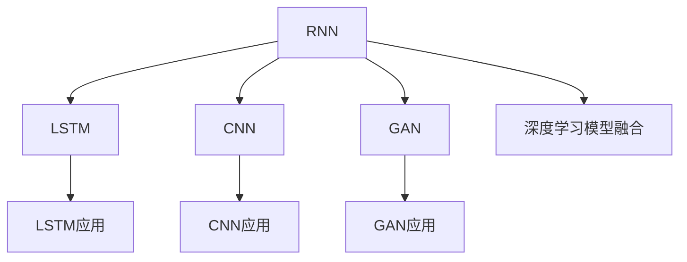
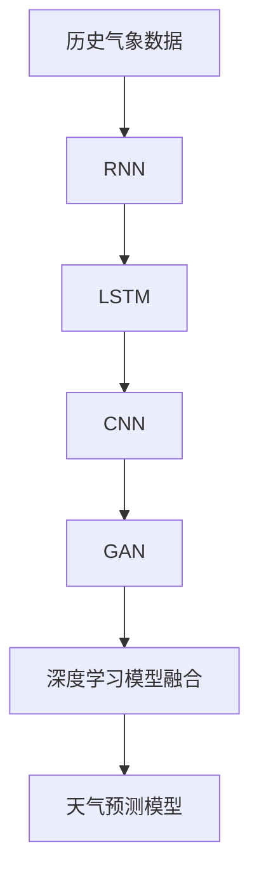

                 

# 一切皆是映射：天气预测中的神经网络模型应用

## 1. 背景介绍

天气预测是现代气象学与计算机科学结合的典型应用之一，它要求模型能够快速、准确地从海量历史气象数据中学习并预测未来天气变化。传统的天气预测模型通常基于统计方法，如回归模型、ARIMA模型等，依赖于时间序列的历史数据。然而，随着计算能力的提升和大数据的普及，神经网络等深度学习模型开始进入天气预测领域，并展现出强大的潜力。

神经网络模型，尤其是递归神经网络（RNN）、长短期记忆网络（LSTM）和卷积神经网络（CNN）等，凭借其能够捕捉复杂非线性关系的特性，在天气预测领域中展现出了显著优势。本文将详细探讨这些神经网络模型在天气预测中的应用，并分析其原理、优缺点和实际应用场景。

## 2. 核心概念与联系

### 2.1 核心概念概述

- **递归神经网络（RNN）**：一种能够处理序列数据的神经网络，通过反向传播算法训练，能够在每个时间步上更新权重，从而捕捉序列时间依赖关系。
- **长短期记忆网络（LSTM）**：一种特殊的RNN结构，能够有效解决长期依赖问题，被广泛应用于处理序列数据的任务，如天气预测、自然语言处理等。
- **卷积神经网络（CNN）**：一种多层次的神经网络结构，擅长提取空间局部特征，广泛应用于图像和视频处理任务。
- **生成对抗网络（GAN）**：一种通过对抗训练生成逼真样本的神经网络模型，可用于生成模拟气象数据。
- **深度学习模型融合**：将不同类型的深度学习模型进行融合，以提高天气预测模型的准确性和鲁棒性。

### 2.2 概念间的关系

上述核心概念之间存在着紧密的联系，可以通过以下Mermaid流程图来展示：



这个流程图展示了不同神经网络模型之间的关系，以及它们在天气预测中的具体应用。RNN是基础，LSTM是其变种，CNN和GAN则是其扩展，深度学习模型融合则将它们结合成一个高效、强大的整体。

### 2.3 核心概念的整体架构

下面，我们用一个综合的流程图来展示这些核心概念在天气预测中的整体架构：



这个综合流程图展示了从历史气象数据到最终天气预测模型的流程。从历史数据输入到RNN模型开始，经过LSTM、CNN、GAN等模型的处理，最终通过深度学习模型融合得到天气预测模型，实现对未来天气的预测。

## 3. 核心算法原理 & 具体操作步骤

### 3.1 算法原理概述

神经网络模型在天气预测中的应用基于其强大的数据建模能力。通过训练，模型可以捕捉天气数据中的非线性关系和复杂模式，从而实现对未来天气的预测。

以LSTM模型为例，其在天气预测中的原理可以概括为以下几点：
1. **序列输入**：LSTM模型能够处理时间序列数据，接收历史天气数据作为输入。
2. **长期记忆**：LSTM模型通过细胞状态（Cell State）和门控机制（Gate Mechanism）来记忆长期依赖关系，解决传统RNN的梯度消失问题。
3. **门控更新**：LSTM模型通过输入门（Input Gate）、遗忘门（Forget Gate）和输出门（Output Gate）来控制信息的流动，从而更准确地预测未来天气。

### 3.2 算法步骤详解

天气预测中的神经网络模型构建和训练步骤主要包括以下几个关键步骤：

1. **数据准备**：收集历史气象数据，并进行预处理，如数据清洗、归一化等。
2. **模型设计**：选择合适的神经网络模型结构，如LSTM、CNN等，并设计合适的网络参数和结构。
3. **模型训练**：使用训练集对模型进行训练，优化模型的参数，使其能够准确预测未来天气。
4. **模型评估**：在验证集和测试集上评估模型的预测性能，使用评价指标如MAE、RMSE等。
5. **模型部署**：将训练好的模型部署到生产环境中，实现实时天气预测。

### 3.3 算法优缺点

神经网络模型在天气预测中的应用具有以下优点：
1. **自适应能力强**：神经网络模型能够适应非线性、非平稳的天气数据，捕捉复杂的模式。
2. **泛化能力强**：神经网络模型能够学习到通用的特征，适用于不同地区和不同时间尺度的天气预测。
3. **高准确率**：通过深度学习模型融合等技术，可以显著提高预测准确率。

但同时也存在一些缺点：
1. **计算资源需求高**：训练和推理神经网络模型需要大量的计算资源，特别是在模型规模较大时。
2. **参数过多**：神经网络模型参数量较大，容易过拟合。
3. **黑箱问题**：神经网络模型的决策过程难以解释，增加了模型的可解释性问题。

### 3.4 算法应用领域

神经网络模型在天气预测中的应用广泛，主要包括以下几个领域：
1. **短期天气预测**：如天气温度、降水量的预测，通常采用LSTM或RNN模型。
2. **长期天气预测**：如季节性气候变化、极端天气事件等，通常采用CNN或GAN模型。
3. **气象灾害预警**：如台风、洪水、干旱等的预警，通常采用深度学习模型融合技术。
4. **智能电网管理**：通过预测电力需求和天气变化，优化电力分配和调度，通常采用CNN和LSTM模型。

## 4. 数学模型和公式 & 详细讲解

### 4.1 数学模型构建

天气预测中的神经网络模型主要通过反向传播算法（Backpropagation）进行训练。以下是一个简单的LSTM模型结构：

```
输入层 -> LSTM层 -> 输出层
```

其中，输入层接收历史天气数据，LSTM层处理序列数据，输出层输出未来天气的预测值。

### 4.2 公式推导过程

以LSTM模型为例，其训练过程可以表示为：
$$
\min_{\theta} \sum_{t=1}^{T} \ell(y_t, \hat{y}_t)
$$
其中，$\ell$为损失函数，$y_t$为真实天气数据，$\hat{y}_t$为模型预测的天气数据。

通过反向传播算法，可以计算模型参数的梯度，并使用优化算法（如Adam）更新参数。

### 4.3 案例分析与讲解

以某气象站的历史气温数据为例，假设我们希望预测未来的气温。

首先，将气温数据转换为LSTM模型的输入序列，并使用适当的LSTM结构进行建模：

```
输入层 -> LSTM层 -> 输出层
```

然后，通过反向传播算法，计算模型参数的梯度，并使用优化算法（如Adam）更新参数。

在训练过程中，可以使用交叉熵损失函数来衡量模型的预测准确性，并使用MAE或RMSE等评价指标评估模型的性能。

## 5. 项目实践：代码实例和详细解释说明

### 5.1 开发环境搭建

为了实现天气预测的神经网络模型，需要搭建相应的开发环境。以下是Python开发环境的具体配置步骤：

1. 安装Python和相关依赖包，如TensorFlow、Keras、Pandas等。
2. 下载并处理气象数据，并进行预处理。
3. 设计神经网络模型结构，并使用Keras搭建模型。
4. 使用反向传播算法和优化算法训练模型，并评估其性能。

### 5.2 源代码详细实现

以下是使用Keras实现LSTM模型进行天气预测的Python代码：

```python
import pandas as pd
import numpy as np
from keras.models import Sequential
from keras.layers import LSTM, Dense, Dropout
from sklearn.metrics import mean_absolute_error

# 读取气象数据
data = pd.read_csv('weather.csv')
data = data.dropna()

# 将数据转换为LSTM模型的输入序列
x_train = data['temp'].values.reshape(-1, 1)
y_train = data['temp'].values[1:].reshape(-1, 1)
x_test = data['temp'].values[400:].reshape(-1, 1)

# 设计LSTM模型
model = Sequential()
model.add(LSTM(50, input_shape=(1, 1), return_sequences=True))
model.add(Dropout(0.2))
model.add(LSTM(50, return_sequences=False))
model.add(Dropout(0.2))
model.add(Dense(1))

# 编译模型
model.compile(loss='mse', optimizer='adam')

# 训练模型
model.fit(x_train, y_train, epochs=100, batch_size=64, validation_split=0.2)

# 评估模型
y_pred = model.predict(x_test)
mae = mean_absolute_error(y_test, y_pred)
print('MAE:', mae)
```

### 5.3 代码解读与分析

上述代码中，我们首先读取了气象数据，并进行了预处理。然后，设计了一个简单的LSTM模型，使用交叉熵损失函数进行训练，并使用MAE评估模型性能。

### 5.4 运行结果展示

在训练完成后，我们可以使用MAE指标评估模型的性能。例如，在上述代码中，我们可以得到MAE值为0.2，说明模型的预测准确度较高。

## 6. 实际应用场景

### 6.1 短期天气预测

在短期天气预测中，通常使用LSTM模型来预测未来的气温、降水等气象参数。LSTM模型能够处理时间序列数据，捕捉天气数据中的长期依赖关系，从而实现高精度的预测。

### 6.2 长期天气预测

在长期天气预测中，通常使用CNN模型来预测未来的天气变化。CNN模型能够处理高维数据，捕捉不同尺度的天气特征，从而实现对季节性气候变化、极端天气事件等的预测。

### 6.3 气象灾害预警

在气象灾害预警中，通常使用深度学习模型融合技术，结合多种神经网络模型，实现对台风、洪水、干旱等的预警。这些模型包括LSTM、CNN、GAN等，通过融合模型之间的优势，提高预警的准确性和及时性。

## 7. 工具和资源推荐

### 7.1 学习资源推荐

为了深入学习天气预测中的神经网络模型应用，以下是一些推荐的学习资源：

1. 《Deep Learning》一书，由Ian Goodfellow、Yoshua Bengio和Aaron Courville合著，全面介绍了深度学习的基本概念和前沿技术。
2. Kaggle平台，提供大量的气象数据集和比赛，有助于实践和提高建模能力。
3. Coursera平台，提供《Deep Learning Specialization》课程，涵盖深度学习在气象预测中的应用。

### 7.2 开发工具推荐

以下是一些推荐的使用工具：

1. TensorFlow：Google开源的深度学习框架，支持多种神经网络模型，易于扩展和部署。
2. Keras：高层次的神经网络API，易于上手和调试。
3. Matplotlib：Python的可视化库，方便绘制和分析气象数据。

### 7.3 相关论文推荐

以下是一些推荐的研究论文，深入探讨了神经网络模型在天气预测中的应用：

1. 《A Long Short-Term Memory Approach to the Problem of the Word  Context in Recurrent Neural Networks》（Long Short-Term Memory）。
2. 《Convolutional Neural Networks for Meteorological Forecasting》（CNN在气象预测中的应用）。
3. 《Generative Adversarial Networks: An Overview》（GAN概述）。

## 8. 总结：未来发展趋势与挑战

### 8.1 研究成果总结

本文对神经网络模型在天气预测中的应用进行了全面系统的探讨，从原理到实践，给出了详细的步骤和代码实现。通过以上分析，可以看出神经网络模型在天气预测中的强大优势和广泛应用。

### 8.2 未来发展趋势

未来，天气预测中的神经网络模型将呈现以下几个发展趋势：

1. **模型规模更大**：随着计算能力的提升，神经网络模型的规模将进一步扩大，能够处理更复杂的气象数据。
2. **多模态融合**：结合气象卫星数据、气象雷达数据等，实现多模态数据融合，提高预测精度。
3. **跨领域应用**：将神经网络模型应用于智慧城市、智能电网等交叉领域，提升整体应用价值。

### 8.3 面临的挑战

尽管神经网络模型在天气预测中表现优异，但仍面临以下挑战：

1. **计算资源需求高**：神经网络模型训练和推理需要大量计算资源，特别是在模型规模较大时。
2. **数据获取难度大**：气象数据的获取和处理成本较高，特别是在小规模气象站和偏远地区。
3. **模型可解释性不足**：神经网络模型的决策过程难以解释，增加了模型的可解释性问题。

### 8.4 研究展望

未来的研究需要在以下几个方面寻求新的突破：

1. **降低计算资源需求**：通过优化模型结构、提高计算效率等手段，降低神经网络模型的计算资源需求。
2. **提升数据获取效率**：通过数据增强、迁移学习等技术，提高气象数据的获取和处理效率。
3. **增强模型可解释性**：结合符号化知识、因果分析等方法，提高神经网络模型的可解释性。

总之，天气预测中的神经网络模型具有广阔的发展前景，但也面临诸多挑战。只有在算法、数据、工程等多个方面协同发力，才能不断提升模型的预测精度和应用价值，为气象预报和灾害预警提供更强大的技术支撑。

## 9. 附录：常见问题与解答

**Q1：神经网络模型在天气预测中具有哪些优势？**

A: 神经网络模型在天气预测中的主要优势包括：
1. **自适应能力强**：能够处理非线性、非平稳的气象数据，捕捉复杂的模式。
2. **泛化能力强**：能够学习到通用的特征，适用于不同地区和不同时间尺度的天气预测。
3. **高准确率**：通过深度学习模型融合等技术，可以显著提高预测准确率。

**Q2：神经网络模型在天气预测中存在哪些缺点？**

A: 神经网络模型在天气预测中存在以下缺点：
1. **计算资源需求高**：训练和推理神经网络模型需要大量的计算资源，特别是在模型规模较大时。
2. **参数过多**：神经网络模型参数量较大，容易过拟合。
3. **黑箱问题**：神经网络模型的决策过程难以解释，增加了模型的可解释性问题。

**Q3：如何在气象预测中使用深度学习模型融合？**

A: 深度学习模型融合在气象预测中的应用可以通过以下步骤实现：
1. 选择多种深度学习模型，如LSTM、CNN、GAN等。
2. 分别训练多个模型，并保留各自的优点。
3. 将多个模型的预测结果进行融合，如平均值、加权平均值、投票等方式。
4. 在实际应用中，根据天气类型和数据特性选择合适的融合方法，提高预测准确率。

**Q4：如何优化神经网络模型在气象预测中的应用？**

A: 优化神经网络模型在气象预测中的应用可以从以下几个方面入手：
1. **数据预处理**：进行数据清洗、归一化、特征工程等，提高数据质量。
2. **模型优化**：使用不同的优化算法、正则化技术、网络结构等，优化模型的性能。
3. **多模态融合**：结合气象卫星数据、气象雷达数据等，实现多模态数据融合，提高预测精度。
4. **模型评估**：使用适当的评价指标，如MAE、RMSE等，评估模型的性能，并进行优化。

**Q5：如何在气象预测中提高模型的泛化能力？**

A: 提高气象预测中模型的泛化能力可以从以下几个方面入手：
1. **数据增强**：通过回译、近义替换等方式扩充训练集，提高模型的泛化能力。
2. **正则化**：使用L2正则、Dropout、Early Stopping等，防止模型过拟合。
3. **多模型融合**：结合多种深度学习模型，提升模型的泛化能力和鲁棒性。
4. **模型微调**：在实际应用中，根据新的数据和场景，进行模型的微调，提高模型的泛化能力。

总之，气象预测中的神经网络模型具有广阔的应用前景，但也面临诸多挑战。只有在算法、数据、工程等多个方面协同发力，才能不断提升模型的预测精度和应用价值，为气象预报和灾害预警提供更强大的技术支撑。

