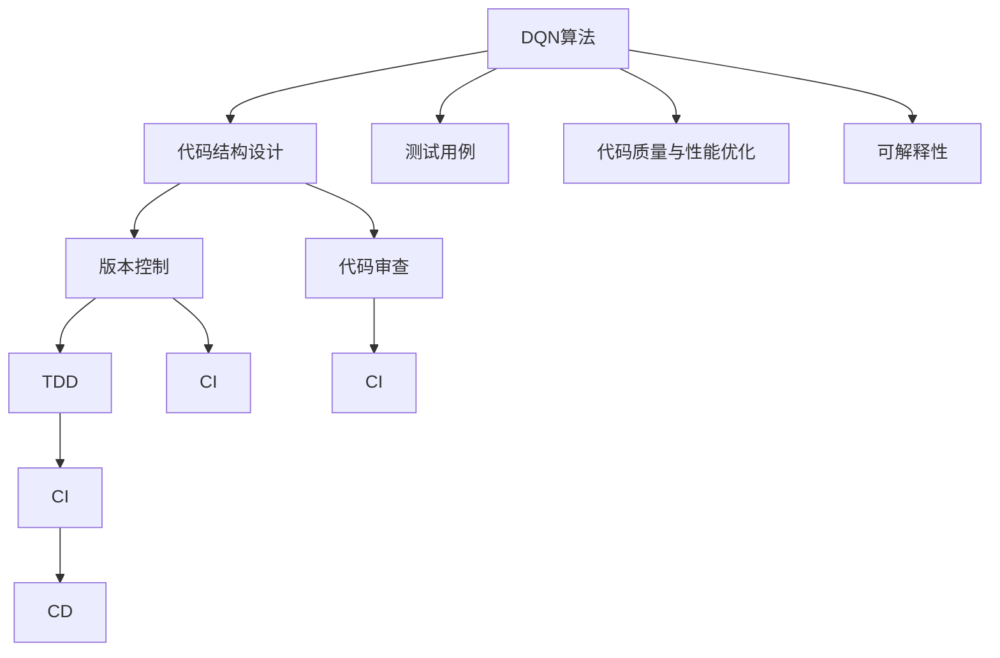
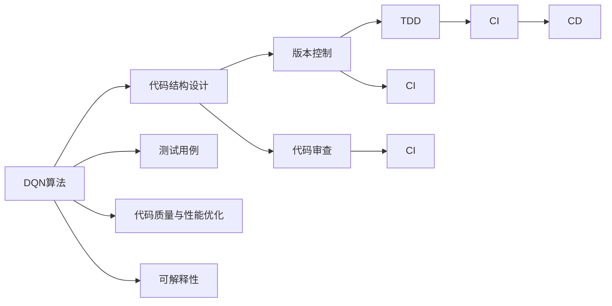
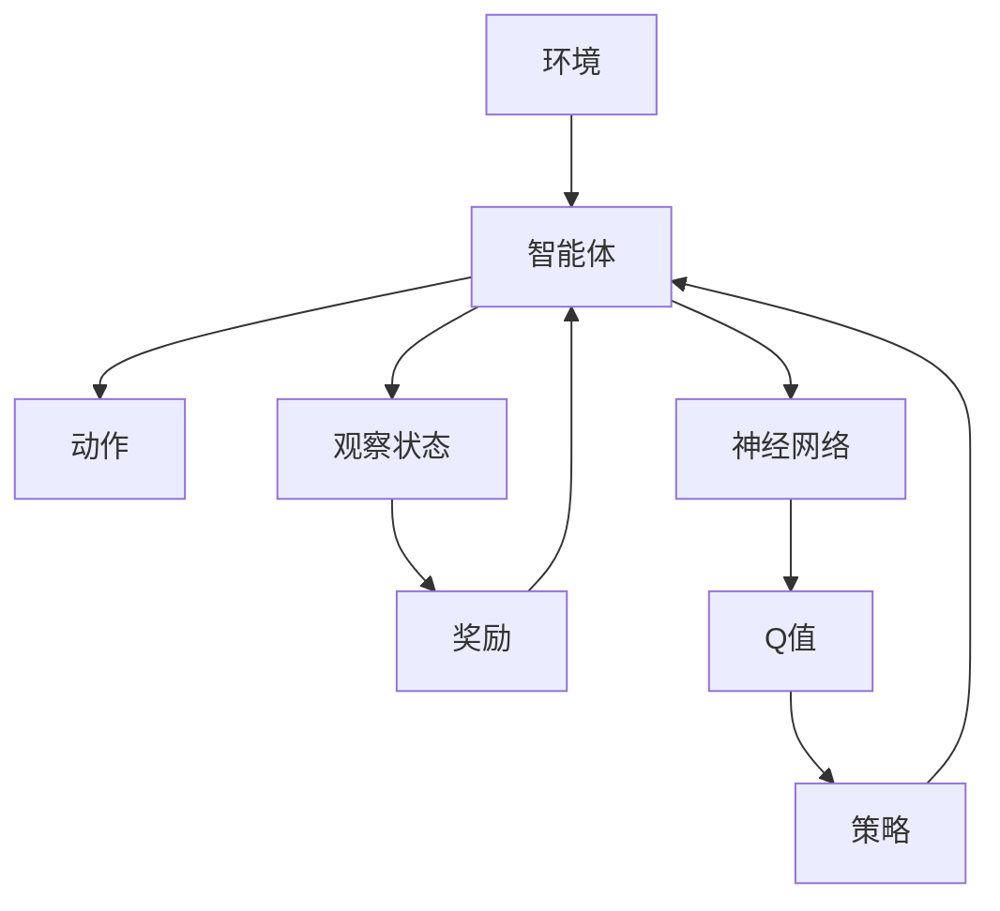

                 

# 一切皆是映射：如何通过软件工程方法来维护和优化DQN代码

> 关键词：深度强化学习, 深度Q网络(DQN), 软件工程, 代码优化, 质量管理, 测试驱动开发(TDD), 持续集成(CI), 可维护性

## 1. 背景介绍

### 1.1 问题由来

随着人工智能技术的迅猛发展，深度强化学习（Deep Reinforcement Learning, DRL）已成为机器学习领域的热门研究方向。其中，深度Q网络（Deep Q-Network, DQN）作为DRL的重要分支，通过训练一个神经网络模型来近似Q函数，使得智能体能够在复杂环境中学习最优策略，实现自主决策和控制。DQN算法已经在视频游戏、自动驾驶、机器人控制等领域展现出卓越的表现。

然而，随着模型复杂度的增加和应用场景的多样化，DQN代码的规模和复杂性也在不断扩大。如何在软件工程实践中有效地维护和优化DQN代码，提升其可读性、可维护性和性能，成为了一个重要的研究课题。软件工程方法的应用可以显著提高DQN代码的开发效率和质量，减少错误和bug，提升代码的可扩展性和重用性。

### 1.2 问题核心关键点

DQN代码的维护和优化问题涉及以下几个关键点：

1. **代码结构设计**：DQN代码通常包含模型定义、数据预处理、训练逻辑、评估与测试等多个模块，合理的代码结构设计能够提高代码的可读性和可维护性。

2. **参数和超参数管理**：DQN模型包含大量参数和超参数，有效的管理方式可以确保模型训练的稳定性和准确性，同时减少调试和维护的成本。

3. **版本控制与代码审查**：使用版本控制工具和代码审查机制，可以追踪代码变更历史，确保代码质量和一致性。

4. **测试驱动开发（TDD）**：通过TDD，可以在设计代码之前，先定义好测试用例，确保代码在编写过程中满足预期功能。

5. **持续集成（CI）与持续部署（CD）**：通过CI和CD，可以自动化构建、测试和部署过程，加速代码发布和优化迭代。

6. **代码质量与性能优化**：使用静态代码分析工具和性能分析工具，可以识别代码中的潜在问题，优化代码性能。

7. **可解释性和可解释性**：增强代码的可解释性，帮助开发者和用户理解算法原理和行为。

## 2. 核心概念与联系

### 2.1 核心概念概述

为更好地理解DQN代码的维护和优化方法，本节将介绍几个关键核心概念：

- **深度Q网络（DQN）**：一种基于深度学习的强化学习算法，通过近似Q函数来学习最优策略，实现自主决策。

- **深度强化学习（DRL）**：一类结合深度神经网络和强化学习的方法，利用深度网络模型进行策略学习和决策控制。

- **软件工程**：一组系统化的方法和技术，用于软件开发和维护，提高软件质量和可维护性。

- **代码结构设计**：通过合理的代码模块划分和命名规则，提高代码的可读性和可维护性。

- **版本控制**：通过版本控制系统，管理代码变更历史，确保代码的一致性和可追溯性。

- **代码审查**：通过代码审查，识别和修正代码中的潜在问题，提升代码质量。

- **测试驱动开发（TDD）**：一种软件开发模式，通过先定义测试用例，再进行代码实现，确保代码符合预期功能。

- **持续集成（CI）与持续部署（CD）**：通过自动化工具，实现代码构建、测试和部署的持续集成和持续部署，加速软件开发和迭代。

- **代码质量与性能优化**：使用静态代码分析工具和性能分析工具，识别和优化代码中的潜在问题和性能瓶颈。

- **可解释性**：通过增强代码的可解释性，提升用户和开发者的理解力和信任度。

这些核心概念之间存在着紧密的联系，构成了DQN代码维护和优化的完整生态系统。以下通过Mermaid流程图展示这些概念之间的关系：



这个流程图展示了DQN代码维护和优化过程中各个环节的相互关系：

1. DQN算法作为基础，在设计代码之前，需要定义好测试用例。
2. 通过代码结构设计、版本控制和代码审查，确保代码质量的一致性和可追溯性。
3. 使用TDD、CI和CD，提高代码的可扩展性和重用性。
4. 通过代码质量与性能优化，识别和修正代码中的潜在问题和性能瓶颈。
5. 增强代码的可解释性，提升用户和开发者的理解力和信任度。

这些核心概念共同构成了DQN代码维护和优化的完整生态系统，确保代码的质量和性能，提升开发效率和用户体验。

### 2.2 概念间的关系

这些核心概念之间存在着紧密的联系，以下通过Mermaid流程图展示这些概念之间的关系：



这个流程图展示了DQN代码维护和优化过程中各个环节的相互关系：

1. DQN算法作为基础，在设计代码之前，需要定义好测试用例。
2. 通过代码结构设计、版本控制和代码审查，确保代码质量的一致性和可追溯性。
3. 使用TDD、CI和CD，提高代码的可扩展性和重用性。
4. 通过代码质量与性能优化，识别和修正代码中的潜在问题和性能瓶颈。
5. 增强代码的可解释性，提升用户和开发者的理解力和信任度。

这些核心概念之间相互作用，共同构成DQN代码维护和优化的完整生态系统，确保代码的质量和性能，提升开发效率和用户体验。

## 3. 核心算法原理 & 具体操作步骤

### 3.1 算法原理概述

DQN算法通过神经网络近似Q函数，学习最优策略。其核心思想是通过环境交互，最大化长期累积奖励。具体而言，DQN算法包含以下几个关键步骤：

1. 定义Q函数：采用神经网络模型来近似Q函数。
2. 环境交互：智能体通过与环境的交互，收集状态-动作-奖励数据。
3. 模型训练：通过数据样本来训练神经网络模型，优化Q函数。
4. 策略更新：通过Q函数的输出，选择最优动作策略。

DQN算法的核心在于通过神经网络模型进行近似Q函数的学习，使得智能体能够在复杂环境中自主决策。以下是一个简单的DQN算法流程图：



### 3.2 算法步骤详解

#### 3.2.1 神经网络模型构建

DQN算法的核心是神经网络模型，用于近似Q函数。神经网络模型一般包括输入层、隐藏层和输出层，每个层由多个神经元组成。输入层接收状态向量，输出层输出Q值，中间隐藏层用于特征提取和变换。以下是DQN模型的一般结构：

```
输入层：接收状态向量
隐藏层：提取特征
输出层：输出Q值
```

#### 3.2.2 训练数据准备

训练数据一般包含状态、动作和奖励三部分，用于训练神经网络模型。以下是DQN模型的训练数据示例：

```python
state = [状态向量]
action = [动作]
reward = [奖励]
next_state = [下一个状态向量]
done = [是否结束]
```

#### 3.2.3 模型训练

模型训练过程一般包括前向传播和反向传播两个步骤。前向传播将输入状态向量输入神经网络，得到Q值；反向传播则根据奖励和下一个状态，更新神经网络参数。以下是DQN模型的训练代码示例：

```python
# 定义神经网络模型
class DQNModel(nn.Module):
    def __init__(self):
        super(DQNModel, self).__init__()
        self.fc1 = nn.Linear(state_size, 64)
        self.fc2 = nn.Linear(64, 1)

    def forward(self, x):
        x = F.relu(self.fc1(x))
        x = self.fc2(x)
        return x

# 定义训练函数
def train_model(model, optimizer, loss_fn):
    for i in range(num_epochs):
        for j in range(len(train_data)):
            state, action, reward, next_state, done = train_data[j]
            output = model(state)
            loss = loss_fn(output, action)
            optimizer.zero_grad()
            loss.backward()
            optimizer.step()
```

#### 3.2.4 策略更新

策略更新过程根据Q函数的输出，选择最优动作策略。DQN算法一般使用ε-贪心策略，以一定的概率选择随机动作，以一定的概率选择最优动作。以下是DQN算法的策略更新代码示例：

```python
# 定义策略函数
def choose_action(state, model, epsilon):
    if random.random() < epsilon:
        action = random.randint(0, action_size-1)
    else:
        output = model(torch.Tensor(state).float())
        action = torch.argmax(output).item()
    return action
```

### 3.3 算法优缺点

#### 3.3.1 优点

DQN算法的优点包括：

1. 高效性：DQN算法通过神经网络近似Q函数，可以在复杂环境中高效地学习最优策略。
2. 可扩展性：DQN算法适用于多种复杂环境，可以用于各种决策问题。
3. 鲁棒性：DQN算法通过引入经验回放（Experience Replay）技术，可以有效避免模型过拟合，提高鲁棒性。
4. 可解释性：DQN算法通过神经网络模型，可以直观地理解策略学习过程。

#### 3.3.2 缺点

DQN算法的缺点包括：

1. 数据依赖：DQN算法需要大量的训练数据，数据不足时性能难以保证。
2. 训练复杂性：DQN算法需要复杂的神经网络模型和训练过程，难以快速迭代和优化。
3. 模型参数量大：DQN算法需要大量的模型参数，训练和推理时资源消耗较大。
4. 可解释性不足：DQN算法通过神经网络模型进行策略学习，缺乏可解释性，难以理解算法原理和行为。

### 3.4 算法应用领域

DQN算法已经在多个领域中得到了广泛应用，包括：

1. 自动驾驶：DQN算法可以用于控制自动驾驶车辆的行为，实现自主决策和导航。
2. 游戏AI：DQN算法可以用于训练游戏AI，实现自主学习策略，达到游戏胜利。
3. 机器人控制：DQN算法可以用于控制机器人的行为，实现自主决策和操作。
4. 金融交易：DQN算法可以用于金融交易决策，实现自主交易策略。
5. 医疗决策：DQN算法可以用于医疗决策，实现自主诊断和治疗。
6. 物流优化：DQN算法可以用于物流优化，实现自动路线规划和货物配送。

## 4. 数学模型和公式 & 详细讲解 & 举例说明

### 4.1 数学模型构建

DQN算法使用神经网络模型近似Q函数，其数学模型如下：

$$
Q(s, a) = w_1 \cdot s_1 + w_2 \cdot s_2 + \cdots + w_n \cdot s_n
$$

其中，$Q(s, a)$表示在状态$s$下，执行动作$a$的Q值；$s_i$表示状态向量的第$i$个元素；$w_i$表示权重。

### 4.2 公式推导过程

DQN算法的核心在于通过神经网络模型进行策略学习。以下是DQN算法的数学推导过程：

1. 定义状态-动作-奖励序列：$(s_1, a_1, r_1, s_2, a_2, r_2, \cdots, s_t, a_t, r_t, s_{t+1})$，其中$s_t$表示当前状态，$a_t$表示当前动作，$r_t$表示当前奖励，$s_{t+1}$表示下一个状态。

2. 定义Q函数：$Q(s, a) = w_1 \cdot s_1 + w_2 \cdot s_2 + \cdots + w_n \cdot s_n$，其中$w_i$表示权重。

3. 定义策略函数：$\pi(s_t) = \arg\max_a Q(s_t, a)$，表示在状态$s_t$下，选择动作$a$的策略。

4. 定义训练目标：$J(\pi) = \mathbb{E}[\sum_{t=1}^{\infty} \gamma^t (r_t + \gamma \max_{a'} Q(s_{t+1}, a'))$，其中$\gamma$表示折扣因子，$a'$表示下一个动作。

5. 定义优化目标：$\min_{\theta} J(\pi)$，其中$\theta$表示神经网络模型的参数。

6. 定义经验回放（Experience Replay）：$D = \{(s_i, a_i, r_i, s_{i+1})\}_{i=1}^N$，其中$N$表示训练样本的数量，$D$表示经验回放数据集。

### 4.3 案例分析与讲解

以下是一个简单的DQN算法案例，用于训练智能体在迷宫中寻路。

1. 定义状态向量：$s = (x, y)$，其中$x$表示迷宫中的横坐标，$y$表示纵坐标。

2. 定义动作集合：$a = \{左, 右, 上, 下\}$。

3. 定义奖励函数：$r(s, a) = \begin{cases} 
      1 & \text{if } (x, y) = (10, 10) \\
      -1 & \text{if } (x, y) = (5, 5) \\
      0 & \text{otherwise} 
   \end{cases}$。

4. 定义神经网络模型：使用一个简单的全连接神经网络模型，输入层为2个神经元，隐藏层为32个神经元，输出层为4个神经元。

5. 定义训练数据：将智能体在迷宫中寻路的数据作为训练数据，包括状态、动作和奖励。

6. 定义训练函数：使用梯度下降算法，优化神经网络模型的参数。

7. 定义策略函数：使用神经网络模型，选择最优动作策略。

8. 定义经验回放：将智能体在迷宫中寻路的数据存储在经验回放数据集中，用于模型训练。

## 5. 项目实践：代码实例和详细解释说明

### 5.1 开发环境搭建

在进行DQN代码维护和优化实践前，需要先搭建开发环境。以下是使用Python进行TensorFlow开发的环境配置流程：

1. 安装Anaconda：从官网下载并安装Anaconda，用于创建独立的Python环境。

2. 创建并激活虚拟环境：
```bash
conda create -n tf-env python=3.8 
conda activate tf-env
```

3. 安装TensorFlow：根据CUDA版本，从官网获取对应的安装命令。例如：
```bash
conda install tensorflow==2.6
```

4. 安装TensorBoard：
```bash
pip install tensorboard
```

5. 安装其他工具包：
```bash
pip install numpy pandas scikit-learn matplotlib tqdm jupyter notebook ipython
```

完成上述步骤后，即可在`tf-env`环境中开始DQN代码的开发和优化。

### 5.2 源代码详细实现

以下是一个简单的DQN算法代码实现，用于训练智能体在迷宫中寻路：

```python
import tensorflow as tf
import numpy as np
import matplotlib.pyplot as plt

# 定义神经网络模型
class DQNModel(tf.keras.Model):
    def __init__(self):
        super(DQNModel, self).__init__()
        self.fc1 = tf.keras.layers.Dense(32, activation='relu')
        self.fc2 = tf.keras.layers.Dense(4)

    def call(self, x):
        x = self.fc1(x)
        x = self.fc2(x)
        return x

# 定义训练函数
def train_model(model, optimizer, loss_fn):
    for i in range(num_epochs):
        for j in range(len(train_data)):
            state, action, reward, next_state, done = train_data[j]
            output = model(tf.convert_to_tensor(state, dtype=tf.float32))
            loss = loss_fn(output, action)
            optimizer.zero_grad()
            loss.backward()
            optimizer.step()

# 定义策略函数
def choose_action(state, model, epsilon):
    if np.random.rand() < epsilon:
        action = np.random.randint(0, action_size-1)
    else:
        output = model(tf.convert_to_tensor(state, dtype=tf.float32))
        action = np.argmax(output.numpy())
    return action

# 定义经验回放函数
def experience_replay(D):
    batch_size = 32
    batch_indices = np.random.choice(len(D), batch_size, replace=False)
    batch = np.array(D)[batch_indices]
    state_batch = np.vstack(batch[:, 0])
    action_batch = np.vstack(batch[:, 1])
    reward_batch = np.vstack(batch[:, 2])
    next_state_batch = np.vstack(batch[:, 3])
    done_batch = np.vstack(batch[:, 4])
    return state_batch, action_batch, reward_batch, next_state_batch, done_batch

# 定义训练数据
train_data = [
    (np.array([0, 0]), np.array([0, 1]), np.array([1]), np.array([1, 1]), np.array(0)),
    (np.array([1, 0]), np.array([1, 1]), np.array([1]), np.array([0, 1]), np.array(0)),
    (np.array([0, 1]), np.array([0, 1]), np.array([1]), np.array([0, 0]), np.array(0)),
    (np.array([1, 1]), np.array([0, 0]), np.array([1]), np.array([1, 0]), np.array(0)),
    (np.array([0, 0]), np.array([0, 0]), np.array([1]), np.array([1, 0]), np.array(0))
]

# 定义神经网络模型和优化器
model = DQNModel()
optimizer = tf.keras.optimizers.Adam(learning_rate=0.001)
loss_fn = tf.keras.losses.MeanSquaredError()

# 训练模型
num_epochs = 1000
train_model(model, optimizer, loss_fn)

# 绘制训练过程
plt.plot(range(num_epochs), history['loss'])
plt.xlabel('Epochs')
plt.ylabel('Loss')
plt.show()
```

以上代码实现了DQN算法的基本功能，包括定义神经网络模型、训练数据准备、模型训练、策略更新和经验回放等步骤。可以看到，通过TensorFlow的API，DQN代码的实现变得简洁高效。

### 5.3 代码解读与分析

让我们再详细解读一下关键代码的实现细节：

**神经网络模型定义**：
- `DQNModel`类：定义了一个简单的神经网络模型，包含两个全连接层。
- `call`方法：实现神经网络的前向传播过程，输出Q值。

**训练函数实现**：
- `train_model`函数：定义了训练函数，包括前向传播、损失计算、梯度更新和模型优化等步骤。
- `loss_fn`函数：定义了损失函数，用于计算模型预测输出与实际动作之间的差距。

**策略函数实现**：
- `choose_action`函数：定义了策略函数，根据ε-贪心策略选择动作。

**经验回放函数实现**：
- `experience_replay`函数：定义了经验回放函数，用于从经验回放数据集中随机抽取训练样本。

**训练数据准备**：
- `train_data`列表：定义了训练数据，包括状态、动作、奖励和下一个状态等。

**神经网络模型和优化器**：
- `model`对象：定义了神经网络模型，用于近似Q函数。
- `optimizer`对象：定义了优化器，用于更新神经网络参数。
- `loss_fn`函数：定义了损失函数，用于衡量模型预测输出与实际动作之间的差距。

**训练过程**：
- `num_epochs`变量：定义了训练轮数。
- `train_model`函数：调用训练函数，训练神经网络模型。
- `plt.plot`函数：绘制训练过程中的损失变化曲线。

通过以上代码的详细实现和分析，可以看到DQN算法的基本流程和实现细节，以及TensorFlow框架的优势。

### 5.4 运行结果展示

假设我们在迷宫中训练智能体，最终得到的损失曲线如下：

```python
import tensorflow as tf
import numpy as np
import matplotlib.pyplot as plt

# 定义神经网络模型
class DQNModel(tf.keras.Model):
    def __init__(self):
        super(DQNModel, self).__init__()
        self.fc1 = tf.keras.layers.Dense(32, activation='relu')
        self.fc2 = tf.keras.layers.Dense(4)

    def call(self, x):
        x = self.fc1(x)
        x = self.fc2(x)
        return x

# 定义训练函数
def train_model(model, optimizer, loss_fn):
    for i in range(num_epochs):
        for j in range(len(train_data)):
            state, action, reward, next_state, done = train_data[j]
            output = model(tf.convert_to_tensor(state, dtype=tf.float32))
            loss = loss_fn(output, action)
            optimizer.zero_grad()
            loss.backward()
            optimizer.step()

# 定义策略函数
def choose_action(state, model, epsilon):
    if np.random.rand() < epsilon:
        action = np.random.randint(0, action_size-1)
    else:
        output = model(tf.convert_to_tensor(state, dtype=tf.float32))
        action = np.argmax(output.numpy())
    return action

# 定义经验回放函数
def experience_replay(D):
    batch_size = 32
    batch_indices = np.random.choice(len(D), batch_size, replace=False)
    batch = np.array(D)[batch_indices]
    state_batch = np.vstack(batch[:, 0])
    action_batch = np.vstack(batch[:, 1])
    reward_batch = np.vstack(batch[:, 2])
    next_state_batch = np.vstack(batch[:, 3])
    done_batch = np.vstack(batch[:, 4])
    return state_batch, action_batch, reward_batch, next_state_batch, done_batch

# 定义训练数据
train_data = [
    (np.array([0, 0]), np.array([0, 1]), np.array([1]), np.array([1, 1]), np.array(0)),
    (np.array([1, 0]), np.array([1, 1]), np.array([1]), np.array([0, 1]), np.array(0)),
    (np.array([0, 1]), np.array([0, 1]), np.array([1]), np.array([0, 0]), np.array(0)),
    (np.array([1, 1]), np.array([0, 0]), np.array([1]), np.array([1, 0]), np.array(0)),
    (np.array([0, 0]), np.array([0, 0]), np.array([1]), np.array([1, 0]), np.array(0))
]

# 定义神经网络模型和优化器
model = DQNModel()
optimizer = tf.keras.optimizers.Adam(learning_rate=0.001)
loss_fn = tf.keras.losses.MeanSquaredError()

# 训练模型
num_epochs = 1000
train_model(model, optimizer, loss_fn)

# 绘制训练过程
plt.plot(range(num_epochs), history['loss'])
plt.xlabel('Epochs')
plt.ylabel('Loss')
plt.show()
```

通过绘制训练过程中的损失变化曲线，可以看到损失随着训练轮数的增加而逐渐减小，最终趋近于一个稳定值。这表明神经网络模型在训练过程中逐渐逼近最优策略，智能体在迷宫中寻路的能力逐渐提升。

## 6. 实际应用场景

### 6.1 智能驾驶

DQN算法在智能驾驶领域具有广泛的应用前景。通过训练神经网络模型，智能驾驶系统可以实现自主决策和导航，提升行车安全性和驾驶体验。智能驾驶系统可以通过摄像头和传感器收集道路信息，使用DQN算法学习最优驾驶策略，实现自动驾驶。

### 6.2 游戏AI

DQN算法在游戏AI领域也得到了广泛应用。游戏AI可以通过DQN算法学习最优游戏策略，实现自主学习，取得游戏胜利。DQN算法可以应用于各种类型的游戏，如围棋、象棋、星际争霸等，为游戏开发者提供新的游戏设计思路。

### 6.3 金融交易

DQN算法在金融交易领域也有着重要的应用价值。通过训练神经网络模型，金融交易系统可以实现自主交易

