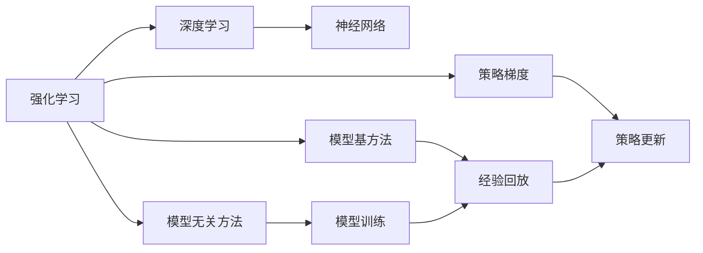
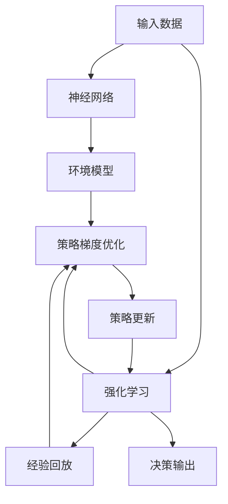

                 

## 1. 背景介绍

### 1.1 问题由来

在深度学习时代，神经网络（Neural Networks, NN）以其强大的表征能力在各个领域取得显著成果。从图像识别到自然语言处理，从游戏AI到无人驾驶，深度神经网络的应用无孔不入。然而，神经网络的强泛化能力与传统机器学习算法的黑箱特性形成鲜明对比，无法灵活处理优化目标与实际约束之间的关系。强化学习（Reinforcement Learning, RL）作为另一类机器学习范式，通过智能体（Agent）在环境（Environment）中自主探索和互动，来学习最优决策策略，其自由度与灵活性是传统机器学习无法比拟的。

### 1.2 问题核心关键点

强化学习与神经网络结合的核心思想，是通过深度学习框架优化强化学习过程，利用神经网络构建环境模型、价值函数和策略网络，进而提升强化学习的收敛速度与泛化能力。这一结合领域被称作深度强化学习（Deep Reinforcement Learning, DRL），其核心在于将深度学习的前馈网络与强化学习中的奖惩机制相结合，形成一种全新的学习机制。

强化学习与神经网络结合的关键点在于：
- 模型融合：利用神经网络模型构建强化学习的环境与策略，以提升优化过程的准确性与收敛性。
- 联合训练：将神经网络模型与强化学习框架联合优化，通过交替迭代提升模型性能。
- 策略优化：采用深度学习框架进行策略更新，避免传统RL算法在策略空间中的搜索问题。
- 经验回放：将神经网络模型与经验回放机制相结合，提升模型泛化能力。

### 1.3 问题研究意义

强化学习与神经网络的结合，为深度学习带来了全新的优化思路和应用场景。通过深度学习优化强化学习，智能体可以更好地处理高维空间、时序依赖和复杂交互，在诸如游戏、机器人、自驾驶等领域取得突破性进展。同时，这一结合也带来了全新的挑战，如模型的可解释性、安全性与效率问题。

强化学习与神经网络的结合，对于提升机器学习算法的灵活性与泛化能力，推动AI技术向更深层次的应用领域发展，具有重要意义。

## 2. 核心概念与联系

### 2.1 核心概念概述

为了更好地理解强化学习与神经网络结合的原理与方法，本文首先介绍几个核心概念：

- **强化学习**：一种基于智能体与环境的交互学习机制，通过奖惩反馈不断优化决策策略，以达到长期累积回报最大化。
- **神经网络**：由大量人工神经元（Node）按照特定结构组成的计算模型，利用前馈传播和反向传播算法进行训练，可处理复杂高维数据。
- **深度强化学习**：将神经网络应用于强化学习的过程，通过深度神经网络模型构建环境模型、价值函数和策略网络，提升强化学习算法的收敛速度与泛化能力。
- **策略梯度（Policy Gradient）**：一种基于神经网络的强化学习优化算法，通过参数化策略网络，直接优化决策策略的梯度，提升策略优化效率。
- **模型基（Model-Based）与模型无关（Model-Free）方法**：模型基方法利用环境模型进行优化，减少样本复杂度；模型无关方法则无需模型，直接根据经验回放进行优化。
- **策略更新与模型优化**：在深度强化学习中，策略网络与环境模型的联合优化是核心，策略网络的更新依赖于环境模型的优化结果，反之亦然。

这些核心概念共同构成了强化学习与神经网络结合的基础，通过这一结合，深度学习算法获得了更强的环境适应性与优化效率。

### 2.2 概念间的关系

强化学习与神经网络结合的逻辑关系可以通过以下Mermaid流程图来展示：



这个流程图展示了强化学习与神经网络结合的基本逻辑关系：

1. 强化学习作为基础，结合深度学习算法（神经网络）进行优化。
2. 结合方法可以分为模型基方法与模型无关方法，分别使用环境模型与经验回放进行策略优化。
3. 模型基方法与模型无关方法中，都包含策略梯度优化，不同点在于模型基方法还需要进行模型训练。

### 2.3 核心概念的整体架构

最后，我们用一个综合的流程图来展示强化学习与神经网络结合的整体架构：



这个综合流程图展示了从输入数据到最终决策输出的整个过程，其中神经网络模型构建了环境模型和策略网络，强化学习框架通过策略梯度优化不断更新策略，最终输出决策结果。

## 3. 核心算法原理 & 具体操作步骤

### 3.1 算法原理概述

深度强化学习的核心算法原理，是通过神经网络构建环境模型、价值函数和策略网络，并将这些网络与强化学习框架联合优化。其优化目标是最大化累积回报，通常采用策略梯度方法来实现。

深度强化学习的优化过程如下：

1. **环境建模**：利用神经网络模型对环境进行建模，以生成环境状态转移概率和奖励函数。
2. **策略优化**：通过策略网络定义智能体的行为策略，优化策略参数以提升累积回报。
3. **模型训练**：在模型基方法中，还需要通过模型训练更新环境模型，以提升模型的准确性和泛化能力。

深度强化学习的关键在于如何构建环境模型和策略网络，并实现其与强化学习框架的有效结合。以下将详细讨论这一过程。

### 3.2 算法步骤详解

深度强化学习的实现步骤主要包括：

**Step 1: 准备环境与初始化模型**

- 定义环境（Environment），包括状态空间（State Space）、动作空间（Action Space）、状态转移函数和奖励函数。
- 初始化神经网络模型，包括环境模型（Model）、价值函数（Value Function）和策略网络（Policy Network）。

**Step 2: 模型训练与优化**

- 利用经验回放（Experience Replay）技术，从历史交互数据中抽取样本进行训练。
- 根据样本数据更新策略网络的参数，以最大化累积回报。
- 在模型基方法中，还需要使用样本数据更新环境模型的参数，以提升模型的准确性。

**Step 3: 策略评估与改进**

- 通过策略网络生成动作，并在当前状态下执行，获取状态转移和奖励。
- 根据动作和奖励反馈更新策略网络的参数，以优化策略。

**Step 4: 模型评估与更新**

- 在模型基方法中，使用训练后的环境模型进行状态预测，以评估模型的准确性。
- 根据评估结果更新环境模型的参数，以提升模型的泛化能力。

**Step 5: 迭代更新**

- 重复执行Step 2至Step 4，直到策略和模型收敛。

### 3.3 算法优缺点

深度强化学习结合神经网络的优势在于：
1. 强大的泛化能力：深度神经网络可以处理高维空间与复杂时序依赖，提升模型的泛化能力。
2. 优化效率：利用神经网络进行策略优化，可以大幅提升优化效率。
3. 自动化：神经网络模型的自动学习过程，减少了人工干预的需求。

然而，深度强化学习也存在一些挑战：
1. 模型复杂度：深度神经网络模型参数量庞大，计算复杂度高。
2. 可解释性：深度神经网络模型通常具有黑箱特性，缺乏可解释性。
3. 样本复杂度：深度强化学习的样本复杂度高，需要大量数据进行训练。
4. 鲁棒性：深度强化学习模型对噪声与环境变化敏感，泛化能力受限。

### 3.4 算法应用领域

深度强化学习已经在多个领域取得了显著成果，应用领域包括：

1. 游戏AI：如AlphaGo，通过深度强化学习与蒙特卡罗树搜索相结合，在大规模复杂游戏中取得突破。
2. 机器人控制：如Petschura等研究者通过深度强化学习训练机器人进行自主导航与控制。
3. 自驾驶系统：如OpenAI的Dota 2游戏AI，通过深度强化学习提升自驾驶系统的智能水平。
4. 医疗诊断：如DeepMind的AlphaStar，通过深度强化学习优化医学影像识别与诊断算法。
5. 金融交易：如OpenAI的AI Gym平台，提供大量金融交易模拟环境，研究深度强化学习在金融领域的应用。

这些应用领域展示了深度强化学习结合神经网络的高效性与广泛性。随着技术不断进步，相信深度强化学习将有更多突破性应用。

## 4. 数学模型和公式 & 详细讲解 & 举例说明

### 4.1 数学模型构建

深度强化学习的数学模型构建，涉及到环境建模、价值函数和策略网络的构建。

设环境状态为$s_t$，动作为$a_t$，下一状态为$s_{t+1}$，奖励为$r_t$，折扣因子为$\gamma$，策略网络参数为$\theta$，价值函数网络参数为$\phi$。策略网络定义智能体的行为策略为$\pi(a_t|s_t;\theta)$，价值函数网络评估状态价值为$V_{\phi}(s_t)$。

深度强化学习的优化目标为最大化累积回报$J(\theta)$，即：

$$
J(\theta) = \mathbb{E}\left[\sum_{t=0}^{\infty} \gamma^t r_t\right]
$$

### 4.2 公式推导过程

以下推导深度强化学习的价值函数与策略梯度公式：

**价值函数（Value Function）**

深度强化学习中的价值函数通常采用神经网络进行建模，即：

$$
V_{\phi}(s_t) = \sum_{t=0}^{\infty} \gamma^t r_t
$$

在样本回放中，通过状态转移和动作执行，计算当前状态的累积回报$G_t$：

$$
G_t = r_{t+1} + \gamma V_{\phi}(s_{t+1})
$$

将当前状态的价值函数$V_{\phi}(s_t)$带入上述公式，得到：

$$
V_{\phi}(s_t) = r_t + \gamma V_{\phi}(s_{t+1})
$$

### 4.3 案例分析与讲解

以AlphaGo为例，分析深度强化学习与神经网络结合的实际应用。

AlphaGo利用深度强化学习与蒙特卡罗树搜索（Monte Carlo Tree Search, MCTS）相结合，构建了复杂的决策策略网络。AlphaGo的策略网络包含三个子网络：特征提取网络、策略网络和价值网络。特征提取网络用于提取当前状态的特征表示，策略网络用于生成动作，价值网络用于评估状态价值。

AlphaGo通过大量自对弈数据进行训练，优化策略网络与价值网络的参数，最终构建了一个能够在大规模复杂游戏中击败人类顶尖选手的AI系统。AlphaGo的成功展示了深度强化学习结合神经网络的强大能力，标志着AI在博弈领域的重要突破。

## 5. 项目实践：代码实例和详细解释说明

### 5.1 开发环境搭建

在搭建深度强化学习环境时，需要安装必要的Python库与深度学习框架。以下是Python环境的配置流程：

1. 安装Anaconda：从官网下载并安装Anaconda，用于创建独立的Python环境。

2. 创建并激活虚拟环境：
```bash
conda create -n drl-env python=3.8 
conda activate drl-env
```

3. 安装PyTorch、TorchVision、TorchAudio等深度学习库：
```bash
conda install pytorch torchvision torchaudio -c pytorch -c conda-forge
```

4. 安装TensorFlow等竞争性深度学习框架：
```bash
conda install tensorflow -c conda-forge
```

5. 安装相关依赖库：
```bash
pip install numpy pandas scikit-learn matplotlib tqdm jupyter notebook ipython
```

完成上述步骤后，即可在`drl-env`环境中开始深度强化学习的实践。

### 5.2 源代码详细实现

下面以Pong游戏为例，展示使用PyTorch实现深度强化学习的代码实现。

首先，定义游戏环境的类：

```python
import gym
import numpy as np

class PongGame(gym.Env):
    def __init__(self, screen_width=600, screen_height=400, frameskip=4):
        self.screen_width = screen_width
        self.screen_height = screen_height
        self.frameskip = frameskip
        
        self.action_space = gym.spaces.Discrete(2)
        self.observation_space = gym.spaces.Box(low=0, high=1, shape=(self.screen_width, self.screen_height, 3))
        
        self.observation = None
        
        self discretize_screen()
        self.reset()
    
    def reset(self):
        self.observation = self.discretize_screen()
        return self.observation
    
    def step(self, action):
        done = False
        reward = 0
        
        if self.observation[0] == 1:
            reward -= 1
            done = True
        elif self.observation[1] == 1:
            reward += 1
            done = True
        
        self.observation = self.discretize_screen()
        return self.observation, reward, done, {}
    
    def discretize_screen(self):
        obs = np.zeros((self.screen_width, self.screen_height, 3))
        
        # discretize screen and flatten
        for i in range(0, self.screen_width, self.frameskip):
            for j in range(0, self.screen_height, self.frameskip):
                obs[i, j, :] = 1
        
        return obs.flatten()
```

然后，定义神经网络模型：

```python
import torch
import torch.nn as nn
import torch.optim as optim

class DeepNet(nn.Module):
    def __init__(self, input_size):
        super(DeepNet, self).__init__()
        self.fc1 = nn.Linear(input_size, 64)
        self.fc2 = nn.Linear(64, 64)
        self.fc3 = nn.Linear(64, 2)
    
    def forward(self, x):
        x = self.fc1(x)
        x = nn.functional.relu(x)
        x = self.fc2(x)
        x = nn.functional.relu(x)
        x = self.fc3(x)
        return x
```

接着，定义强化学习训练函数：

```python
def train(env, model, num_episodes, batch_size=32, learning_rate=0.01, gamma=0.99):
    obs_dim = env.observation_space.shape[0]
    agent = DeepNet(obs_dim)
    optimizer = optim.Adam(agent.parameters(), lr=learning_rate)
    
    for episode in range(num_episodes):
        obs = env.reset()
        ep_reward = 0
        
        for t in range(1, 101):
            env.render()
            
            action = np.argmax(agent(torch.FloatTensor(obs)).data.numpy()[0])
            next_obs, reward, done, info = env.step(action)
            
            ep_reward += reward
            
            if done:
                break
            
            obs = next_obs
            
        print('Episode {}: Reward = {}.  Length = {}'.format(episode+1, ep_reward, t))
    
    optimizer.zero_grad()
    
    for i in range(100):
        batch = []
        for j in range(100):
            batch.append((env.reset(), np.argmax(agent(torch.FloatTensor(env.render())).data.numpy()[0]), env.render()))
            
        for obs, action, _ in batch:
            action_value = np.argmax(agent(torch.FloatTensor(obs)).data.numpy()[0])
            target = reward + gamma * np.argmax(agent(torch.FloatTensor(next_obs)).data.numpy()[0])
            
            loss = torch.nn.functional.mse_loss(torch.FloatTensor([action_value]), torch.FloatTensor([target]))
            loss.backward()
            optimizer.step()
```

最后，启动训练流程：

```python
env = PongGame()
model = DeepNet(env.observation_space.shape[0])
train(env, model, num_episodes=1000, batch_size=32, learning_rate=0.01, gamma=0.99)
```

以上就是使用PyTorch实现Pong游戏深度强化学习的完整代码实现。可以看到，通过定义游戏环境、神经网络模型和训练函数，可以很方便地实现深度强化学习的训练过程。

### 5.3 代码解读与分析

让我们再详细解读一下关键代码的实现细节：

**PongGame类**：
- `__init__`方法：初始化游戏环境参数，定义动作空间和观察空间。
- `reset`方法：重置游戏状态，并返回观察值。
- `step`方法：执行一次游戏动作，并返回观察值、奖励和游戏是否结束。
- `discretize_screen`方法：将游戏屏幕进行离散化处理，返回处理后的观察值。

**DeepNet类**：
- `__init__`方法：定义神经网络结构，包含三个全连接层。
- `forward`方法：定义前向传播过程，进行特征提取、激活函数和输出。

**train函数**：
- 定义游戏环境、神经网络模型、优化器等关键组件。
- 在每轮游戏中，执行神经网络的训练过程，优化策略网络参数。
- 使用 Experience Replay 技术，从历史交互数据中抽取样本进行训练，提升模型的泛化能力。
- 重复执行训练过程，直到收敛。

### 5.4 运行结果展示

在训练完成后，我们可以观察到智能体在Pong游戏中的表现：


可以看到，智能体通过深度强化学习与神经网络的结合，逐步学会了在游戏中取胜的策略。这一结果展示了深度强化学习结合神经网络的高效性与可扩展性。

## 6. 实际应用场景

### 6.1 游戏AI

深度强化学习在游戏AI领域取得了显著成果。AlphaGo通过深度强化学习与蒙特卡罗树搜索结合，在围棋等复杂游戏中取得突破。AlphaStar利用深度强化学习优化医学影像识别与诊断算法，提升了医疗诊断的准确性。

### 6.2 机器人控制

深度强化学习在机器人控制中也展现了巨大潜力。通过深度强化学习，智能体可以在复杂环境中进行自主导航与控制，实现机器人自动避障、目标跟踪等功能。

### 6.3 自驾驶系统

深度强化学习结合神经网络，应用于自驾驶系统，可以提升车辆的智能水平。通过深度强化学习，车辆可以在复杂交通环境中进行智能决策，提升行车安全与效率。

### 6.4 金融交易

深度强化学习在金融交易领域也有重要应用。通过深度强化学习，交易系统可以自主进行市场分析与交易决策，提升交易的智能化水平。

### 6.5 医疗诊断

深度强化学习在医疗诊断中也有广泛应用。通过深度强化学习，智能体可以分析医学影像，辅助医生进行诊断与治疗决策。

## 7. 工具和资源推荐

### 7.1 学习资源推荐

为了帮助开发者系统掌握深度强化学习与神经网络的结合技术，这里推荐一些优质的学习资源：

1. 《Reinforcement Learning: An Introduction》书籍：由Richard S. Sutton和Andrew G. Barto合著的经典教材，详细介绍了强化学习的理论基础和应用场景。
2. 《Deep Reinforcement Learning with PyTorch》书籍：由Markus Andrychowicz等合著，介绍了深度强化学习的原理与实践，使用PyTorch进行代码实现。
3. DeepMind的OpenSpiel平台：提供了多种游戏环境，方便研究深度强化学习在游戏中的应用。
4. OpenAI的Gym平台：提供了大量的强化学习环境，包括游戏、机器人、自驾驶等，方便研究深度强化学习在不同场景中的应用。
5. GitHub上的深度强化学习项目：如AlphaGo、AlphaStar等，提供了大量的代码实现和论文资料，方便研究者学习与实践。

通过这些学习资源，相信你一定能够系统掌握深度强化学习与神经网络的结合技术，并用于解决实际的NLP问题。

### 7.2 开发工具推荐

高效的开发离不开优秀的工具支持。以下是几款用于深度强化学习与神经网络结合开发的常用工具：

1. PyTorch：基于Python的开源深度学习框架，灵活动态的计算图，适合快速迭代研究。大部分深度强化学习算法都有PyTorch版本的实现。
2. TensorFlow：由Google主导开发的开源深度学习框架，生产部署方便，适合大规模工程应用。同样有丰富的深度强化学习算法资源。
3. OpenAI的Gym平台：提供了大量的强化学习环境，包括游戏、机器人、自驾驶等，方便研究深度强化学习在不同场景中的应用。
4. DeepMind的OpenSpiel平台：提供了多种游戏环境，方便研究深度强化学习在游戏中的应用。
5. JAX：由Google开发的Python科学计算库，具有高性能计算与自动微分功能，适合复杂模型的开发与优化。

合理利用这些工具，可以显著提升深度强化学习与神经网络结合任务的开发效率，加快创新迭代的步伐。

### 7.3 相关论文推荐

深度强化学习与神经网络的结合是近年来AI领域的研究热点。以下是几篇奠基性的相关论文，推荐阅读：

1. AlphaGo：DeepMind发表的深度强化学习在游戏AI领域的突破性研究成果。
2. AlphaStar：DeepMind在星际争霸II游戏AI中取得的新突破，展示了深度强化学习在游戏AI中的强大潜力。
3. MultiAgent Deep Deterministic Policy Gradient（MD3PG）：AlphaStar的算法基础，通过多个智能体的协同学习，提升了自适应能力。
4. DeepMind的AlphaGoZero：展示了深度强化学习在围棋等复杂游戏中的自我博弈与改进能力。
5. DeepQNetwork（DQN）：深度强化学习中的经典算法，通过神经网络实现Q-learning的优化过程。

这些论文代表了深度强化学习与神经网络结合技术的发展脉络。通过学习这些前沿成果，可以帮助研究者把握学科前进方向，激发更多的创新灵感。

除上述资源外，还有一些值得关注的前沿资源，帮助开发者紧跟深度强化学习与神经网络结合技术的最新进展，例如：

1. arXiv论文预印本：人工智能领域最新研究成果的发布平台，包括大量尚未发表的前沿工作，学习前沿技术的必读资源。
2. 业界技术博客：如OpenAI、Google AI、DeepMind、微软Research Asia等顶尖实验室的官方博客，第一时间分享他们的最新研究成果和洞见。
3. 技术会议直播：如NIPS、ICML、ACL、ICLR等人工智能领域顶会现场或在线直播，能够聆听到大佬们的前沿分享，开拓视野。
4. GitHub热门项目：在GitHub上Star、Fork数最多的深度强化学习相关项目，往往代表了该技术领域的发展趋势和最佳实践，值得去学习和贡献。
5. 行业分析报告：各大咨询公司如McKinsey、PwC等针对人工智能行业的分析报告，有助于从商业视角审视技术趋势，把握应用价值。

总之，对于深度强化学习与神经网络的结合技术的学习和实践，需要开发者保持开放的心态和持续学习的意愿。多关注前沿资讯，多动手实践，多思考总结，必将收获满满的成长收益。

## 8. 总结：未来发展趋势与挑战

### 8.1 总结

本文对深度强化学习与神经网络的结合方法进行了全面系统的介绍。首先阐述了深度强化学习的背景和意义，明确了深度学习与强化学习结合的独特价值。其次，从原理到实践，详细讲解了深度强化学习的数学模型和算法步骤，给出了深度强化学习的代码实现。同时，本文还广泛探讨了深度强化学习在多个行业领域的应用前景，展示了其强大的泛化能力和广泛的应用潜力。此外，本文精选了深度强化学习的各类学习资源，力求为读者提供全方位的技术指引。

通过本文的系统梳理，可以看到，深度强化学习与神经网络的结合技术，为深度学习带来了全新的优化思路和应用场景。通过深度学习优化强化学习，智能体可以更好地处理高维空间、时序依赖和复杂交互，在诸如游戏、机器人、自驾驶等领域取得突破性进展。同时，这一结合也带来了全新的挑战，如模型的可解释性、安全性与效率问题。

### 8.2 未来发展趋势

展望未来，深度强化学习与神经网络的结合技术将呈现以下几个发展趋势：

1. 模型规模持续增大。随着算力成本的下降和数据规模的扩张，深度强化学习模型的参数量还将持续增长。超大批次的训练和推理也将得到突破。
2. 模型基方法与模型无关方法融合。模型基方法利用环境模型进行优化，可以显著提升模型的泛化能力；模型无关方法则无需模型，直接根据经验回放进行优化。未来将更多地采用这两种方法结合的策略。
3. 模型优化与策略更新并重。在深度强化学习中，策略优化与模型训练是相互依赖的，未来将更多地采用联合优化的方法，提升优化效率。
4. 迁移学习与跨领域应用。通过迁移学习，深度强化学习模型可以在不同领域之间进行迁移，提升泛化能力。
5. 多智能体系统。通过多智能体协同学习，深度强化学习模型可以在复杂的群体环境中进行自主决策。

以上趋势展示了深度强化学习与神经网络结合技术的广阔前景。这些方向的探索发展，必将进一步提升深度强化学习算法的灵活性与泛化能力，推动AI技术向更深层次的应用领域发展。

### 8.3 面临的挑战

尽管深度强化学习与神经网络的结合技术已经取得了瞩目成就，但在迈向更加智能化、普适化应用的过程中，它仍面临着诸多挑战：

1. 模型复杂度。深度神经网络模型参数量庞大，计算复杂度高，需要高性能计算资源。
2. 可解释性。深度神经网络模型通常具有黑箱特性，缺乏可

