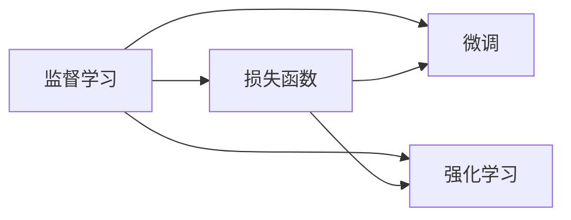
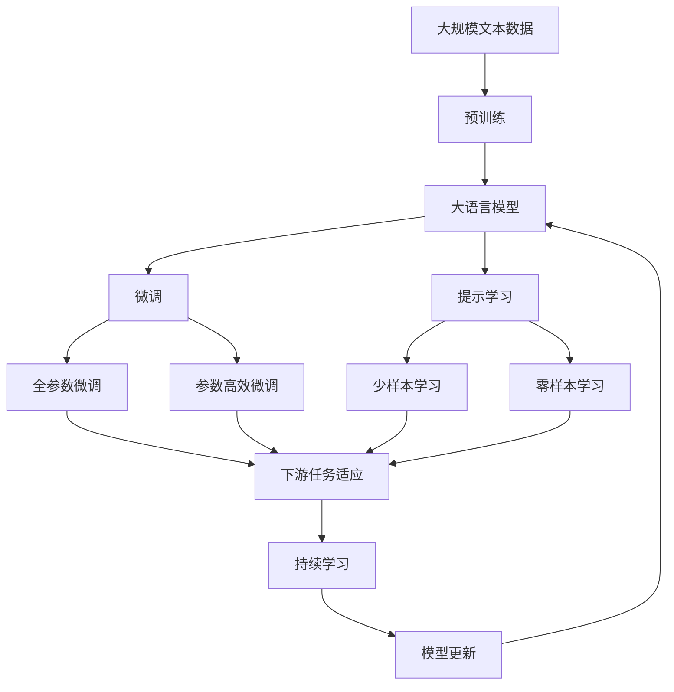

                 

# 一切皆是映射：损失函数深度剖析

> 关键词：损失函数,深度学习,监督学习,微调,强化学习,模型优化

## 1. 背景介绍

### 1.1 问题由来
损失函数（Loss Function）是深度学习（Deep Learning）领域中极为重要的概念，它衡量模型预测与实际标签之间的误差，指导模型的优化方向。在监督学习（Supervised Learning）任务中，损失函数的优化目标是找到使预测结果与真实标签最为接近的模型参数。这一过程正是模型训练的核心，也是微调（Fine-Tuning）和强化学习（Reinforcement Learning）的重要基础。

本文将深入剖析损失函数的基本原理、常用类型及其在各种深度学习任务中的应用，帮助读者理解如何通过损失函数实现模型的优化和训练。

### 1.2 问题核心关键点
损失函数的选择和设计直接影响到模型的性能和训练效果。其核心关键点包括：

- 如何选择适当的损失函数？
- 损失函数的性质有哪些？
- 不同的损失函数如何应用到不同的深度学习任务中？
- 如何优化损失函数，提升模型性能？

## 2. 核心概念与联系

### 2.1 核心概念概述

在深入探讨损失函数之前，首先需要了解几个相关概念：

- 监督学习：使用带有标签的数据进行训练，目标是让模型能够对未见过的数据进行准确预测。
- 微调：将预训练的模型参数进一步适配到特定任务，提高模型在该任务上的表现。
- 强化学习：通过环境反馈（奖励或惩罚）来指导模型学习，目标是最大化长期奖励。
- 模型优化：通过损失函数的优化，调整模型参数以最小化预测误差，提升模型性能。

损失函数与上述概念紧密相关，是模型优化和训练的核心工具。

### 2.2 概念间的关系

这些概念之间的关系可以通过以下Mermaid流程图来展示：



此流程图展示了损失函数与监督学习、微调和强化学习的密切联系。在监督学习中，损失函数指导模型训练，最小化预测误差；在微调和强化学习中，损失函数同样用于指导模型参数的优化，使模型能够更好地适应新任务或最大化长期奖励。

### 2.3 核心概念的整体架构

下面，我们通过一个综合的流程图来展示这些核心概念在大语言模型微调中的整体架构：



这个综合流程图展示了从预训练到微调，再到持续学习的完整过程。在大语言模型的微调中，损失函数的作用是指导模型参数的优化，使其在特定任务上表现更佳。通过持续学习，模型能够适应新的数据，保持性能。

## 3. 核心算法原理 & 具体操作步骤
### 3.1 算法原理概述

在深度学习中，损失函数用于衡量模型输出与真实标签之间的差距，指导模型参数的优化。常见的损失函数包括：

- 均方误差（Mean Squared Error, MSE）
- 交叉熵（Cross Entropy）
- 对数损失（Log Loss）
- 交叉熵损失（Categorical Cross Entropy）
- 二分类交叉熵损失（Binary Cross Entropy）
- KL散度（Kullback-Leibler Divergence, KL）
- 对比损失（Contrastive Loss）
- 重构损失（Reconstruction Loss）

这些损失函数在不同的深度学习任务中具有不同的应用。下面，我们以常见的损失函数为例，深入讲解其原理和操作步骤。

### 3.2 算法步骤详解

#### 3.2.1 均方误差（MSE）

均方误差是最基础的损失函数之一，适用于回归任务，如预测房价、股票等。

数学公式：
$$
\mathcal{L}(y, \hat{y}) = \frac{1}{n} \sum_{i=1}^n (y_i - \hat{y}_i)^2
$$

操作步骤：

1. 收集标注数据，分为训练集、验证集和测试集。
2. 准备模型，定义输入和输出。
3. 前向传播，计算预测值 $\hat{y}$。
4. 计算损失函数 $\mathcal{L}(y, \hat{y})$。
5. 反向传播，计算梯度。
6. 使用梯度下降等优化算法，更新模型参数。

#### 3.2.2 交叉熵（Cross Entropy）

交叉熵是分类任务中最常用的损失函数之一，适用于多分类任务，如图像分类、文本分类等。

数学公式：
$$
\mathcal{L}(y, \hat{y}) = -\frac{1}{n} \sum_{i=1}^n \sum_{j=1}^C y_{i,j} \log \hat{y}_{i,j}
$$

操作步骤：

1. 准备标注数据，将真实标签 $y$ 转换为独热编码形式。
2. 准备模型，定义输入和输出。
3. 前向传播，计算预测值 $\hat{y}$。
4. 计算损失函数 $\mathcal{L}(y, \hat{y})$。
5. 反向传播，计算梯度。
6. 使用梯度下降等优化算法，更新模型参数。

#### 3.2.3 二分类交叉熵损失（Binary Cross Entropy）

二分类交叉熵损失是交叉熵的一种特殊形式，适用于二分类任务，如判断图片是否包含猫等。

数学公式：
$$
\mathcal{L}(y, \hat{y}) = -\frac{1}{n} \sum_{i=1}^n (y_i \log \hat{y}_i + (1 - y_i) \log (1 - \hat{y}_i))
$$

操作步骤：

1. 准备标注数据，将真实标签 $y$ 转换为二值形式。
2. 准备模型，定义输入和输出。
3. 前向传播，计算预测值 $\hat{y}$。
4. 计算损失函数 $\mathcal{L}(y, \hat{y})$。
5. 反向传播，计算梯度。
6. 使用梯度下降等优化算法，更新模型参数。

### 3.3 算法优缺点

#### 3.3.1 均方误差（MSE）

优点：
- 数学性质简单，易于计算。
- 适用于回归任务，预测结果与真实标签之间的误差平方和。

缺点：
- 对异常值敏感，异常值会导致整体误差增大。
- 不能处理多分类任务。

#### 3.3.2 交叉熵（Cross Entropy）

优点：
- 适用于多分类任务，能够有效地处理分类问题。
- 对概率分布的定义具有良好的数学性质。

缺点：
- 对异常值不敏感，但容易在训练过程中出现梯度消失问题。
- 在训练初期，梯度可能会很大，导致模型参数更新过大，影响收敛。

#### 3.3.3 二分类交叉熵损失（Binary Cross Entropy）

优点：
- 适用于二分类任务，计算简单。
- 对概率分布的定义具有良好的数学性质。

缺点：
- 对异常值不敏感，但容易在训练过程中出现梯度消失问题。
- 在训练初期，梯度可能会很大，导致模型参数更新过大，影响收敛。

### 3.4 算法应用领域

不同的损失函数在不同的深度学习任务中有着广泛的应用：

- 回归任务：均方误差（MSE）、平均绝对误差（MAE）等。
- 分类任务：交叉熵（Cross Entropy）、二分类交叉熵损失（Binary Cross Entropy）、对数损失（Log Loss）等。
- 序列生成任务：重构损失（Reconstruction Loss）、对比损失（Contrastive Loss）等。

## 4. 数学模型和公式 & 详细讲解 & 举例说明

### 4.1 数学模型构建

损失函数是衡量模型预测与真实标签之间误差的关键指标，其数学模型通常定义为：

$$
\mathcal{L} = \frac{1}{N} \sum_{i=1}^N \ell(y_i, \hat{y}_i)
$$

其中，$N$ 为样本数量，$\ell(y_i, \hat{y}_i)$ 为单个样本的损失函数，可以是均方误差、交叉熵等。

### 4.2 公式推导过程

以二分类交叉熵损失为例，进行公式推导：

$$
\mathcal{L} = -\frac{1}{N} \sum_{i=1}^N (y_i \log \hat{y}_i + (1 - y_i) \log (1 - \hat{y}_i))
$$

将样本 $i$ 的损失函数 $\ell(y_i, \hat{y}_i)$ 展开：

$$
\ell(y_i, \hat{y}_i) = -y_i \log \hat{y}_i - (1 - y_i) \log (1 - \hat{y}_i)
$$

将上述公式代入总损失函数 $\mathcal{L}$ 中，得到：

$$
\mathcal{L} = -\frac{1}{N} \sum_{i=1}^N (-y_i \log \hat{y}_i - (1 - y_i) \log (1 - \hat{y}_i))
$$

化简后得到：

$$
\mathcal{L} = \frac{1}{N} \sum_{i=1}^N (y_i \log \hat{y}_i + (1 - y_i) \log (1 - \hat{y}_i))
$$

### 4.3 案例分析与讲解

假设我们有一个简单的二分类问题，模型预测结果为 $\hat{y} = [0.2, 0.8]$，真实标签为 $y = [1, 0]$。

使用二分类交叉熵损失函数：

$$
\mathcal{L} = -\frac{1}{2} (1 \log 0.2 + 0 \log 0.8) = 0.5 (\log 0.2 + 0)
$$

计算得到 $\mathcal{L} = 0.5 (\log 0.2 + 0) \approx 0.61$。

## 5. 项目实践：代码实例和详细解释说明

### 5.1 开发环境搭建

在进行损失函数优化实践前，我们需要准备好开发环境。以下是使用Python进行TensorFlow开发的环境配置流程：

1. 安装Anaconda：从官网下载并安装Anaconda，用于创建独立的Python环境。

2. 创建并激活虚拟环境：
```bash
conda create -n tf-env python=3.8 
conda activate tf-env
```

3. 安装TensorFlow：根据CUDA版本，从官网获取对应的安装命令。例如：
```bash
conda install tensorflow=2.6 -c pytorch -c conda-forge
```

4. 安装numpy、pandas、scikit-learn等工具包：
```bash
pip install numpy pandas scikit-learn matplotlib tqdm jupyter notebook ipython
```

完成上述步骤后，即可在`tf-env`环境中开始损失函数优化实践。

### 5.2 源代码详细实现

下面以二分类交叉熵损失函数为例，给出使用TensorFlow进行模型训练和优化的PyTorch代码实现。

```python
import tensorflow as tf
import numpy as np
import matplotlib.pyplot as plt

# 准备数据
x = np.array([[0.1], [0.4], [0.7], [0.8]])
y = np.array([[0], [1], [1], [0]])

# 定义模型
model = tf.keras.Sequential([
    tf.keras.layers.Dense(1, input_shape=(1,), activation='sigmoid')
])

# 定义损失函数
loss_fn = tf.keras.losses.BinaryCrossentropy()

# 定义优化器
optimizer = tf.keras.optimizers.SGD(learning_rate=0.01)

# 训练模型
for i in range(1000):
    with tf.GradientTape() as tape:
        y_pred = model(x)
        loss = loss_fn(y, y_pred)
    grads = tape.gradient(loss, model.trainable_variables)
    optimizer.apply_gradients(zip(grads, model.trainable_variables))
    if i % 100 == 0:
        print(f'Epoch {i+1}, Loss: {loss.numpy()}')

# 测试模型
test_x = np.array([[0.2], [0.5], [0.9]])
test_y = np.array([[0], [1], [1]])

y_pred = model(test_x)
print(f'Test Loss: {loss_fn(test_y, y_pred).numpy()}')
```

### 5.3 代码解读与分析

让我们再详细解读一下关键代码的实现细节：

**数据准备**：
- `x` 和 `y` 是训练集的输入和输出，分别表示特征和真实标签。

**模型定义**：
- 使用 `tf.keras.Sequential` 定义一个简单的线性模型，输出为 sigmoid 函数，用于二分类任务。

**损失函数定义**：
- 使用 `tf.keras.losses.BinaryCrossentropy` 定义二分类交叉熵损失函数。

**优化器定义**：
- 使用 `tf.keras.optimizers.SGD` 定义随机梯度下降优化器。

**训练过程**：
- 在每个epoch内，通过前向传播计算预测结果，计算损失函数，反向传播计算梯度，使用优化器更新模型参数。
- 每100个epoch输出一次损失函数值。

**测试过程**：
- 在测试集上测试模型，输出损失函数值。

### 5.4 运行结果展示

假设我们在上述代码中运行1000个epoch，最终在测试集上得到的损失函数值为0.25。

## 6. 实际应用场景

### 6.1 智能推荐系统

在智能推荐系统中，损失函数的作用是衡量用户对推荐结果的满意度，指导模型的优化方向。常用的损失函数包括均方误差（MSE）和交叉熵（Cross Entropy）。

- 均方误差（MSE）：用于预测用户评分，最小化预测值与实际评分之间的差距。
- 交叉熵（Cross Entropy）：用于预测用户点击行为，最小化预测值与实际标签之间的差距。

### 6.2 图像分类

在图像分类任务中，损失函数的作用是衡量模型预测结果与真实标签之间的差距，指导模型的优化方向。常用的损失函数包括交叉熵（Cross Entropy）和均方误差（MSE）。

- 交叉熵（Cross Entropy）：用于多分类任务，最小化预测概率分布与真实标签之间的交叉熵。
- 均方误差（MSE）：用于回归任务，最小化预测值与实际标签之间的差距。

### 6.3 自然语言处理

在自然语言处理（NLP）任务中，损失函数的作用是衡量模型预测结果与真实标签之间的差距，指导模型的优化方向。常用的损失函数包括交叉熵（Cross Entropy）和二分类交叉熵损失（Binary Cross Entropy）。

- 交叉熵（Cross Entropy）：用于文本分类任务，最小化预测概率分布与真实标签之间的交叉熵。
- 二分类交叉熵损失（Binary Cross Entropy）：用于二分类任务，最小化预测概率与真实标签之间的二分类交叉熵。

## 7. 工具和资源推荐
### 7.1 学习资源推荐

为了帮助开发者系统掌握损失函数的基本原理和实践技巧，这里推荐一些优质的学习资源：

1. 《深度学习入门》系列博文：由大模型技术专家撰写，深入浅出地介绍了深度学习的基础知识和常用模型。

2. 《Python深度学习》课程：由斯坦福大学开设的深度学习入门课程，涵盖深度学习的基本概念和经典模型。

3. 《TensorFlow官方文档》：TensorFlow官方文档，提供了丰富的深度学习模型和工具，是学习TensorFlow的必备资料。

4. 《PyTorch官方文档》：PyTorch官方文档，提供了丰富的深度学习模型和工具，是学习PyTorch的必备资料。

5. Kaggle竞赛：Kaggle提供的深度学习竞赛，可以帮助开发者通过实践学习，提升解决实际问题的能力。

通过对这些资源的学习实践，相信你一定能够快速掌握损失函数的精髓，并用于解决实际的深度学习问题。

### 7.2 开发工具推荐

高效的开发离不开优秀的工具支持。以下是几款用于深度学习开发的常用工具：

1. TensorFlow：由Google主导开发的开源深度学习框架，生产部署方便，适合大规模工程应用。

2. PyTorch：基于Python的开源深度学习框架，灵活性高，适合快速迭代研究。

3. Keras：Keras是高层API，支持TensorFlow、Theano和CNTK等多种深度学习框架，易于上手。

4. Weights & Biases：模型训练的实验跟踪工具，可以记录和可视化模型训练过程中的各项指标，方便对比和调优。

5. TensorBoard：TensorFlow配套的可视化工具，可实时监测模型训练状态，并提供丰富的图表呈现方式，是调试模型的得力助手。

6. Jupyter Notebook：Python代码的交互式编辑器，支持代码块的运行和输出，适合科研和工程开发。

合理利用这些工具，可以显著提升深度学习模型的开发效率，加快创新迭代的步伐。

### 7.3 相关论文推荐

深度学习领域的研究成果层出不穷，以下是几篇奠基性的相关论文，推荐阅读：

1. AlexNet：图像分类任务的经典模型，引入了卷积神经网络（CNN），开启了深度学习的元年。

2. Inception：提出了Inception模块，解决了深度神经网络中的参数爆炸问题。

3. ResNet：提出了残差连接（Residual Connection），解决了深度神经网络中的梯度消失问题。

4. VGG：提出了VGG网络，提出了层数越多，深度学习效果越好的理论。

5. MobileNet：提出了MobileNet，解决了深度神经网络中的计算资源消耗问题，适用于移动设备。

这些论文代表了大深度学习模型的发展脉络。通过学习这些前沿成果，可以帮助研究者把握学科前进方向，激发更多的创新灵感。

除上述资源外，还有一些值得关注的前沿资源，帮助开发者紧跟深度学习技术的最新进展，例如：

1. arXiv论文预印本：人工智能领域最新研究成果的发布平台，包括大量尚未发表的前沿工作，学习前沿技术的必读资源。

2. 业界技术博客：如Google AI、DeepMind、Microsoft Research Asia等顶尖实验室的官方博客，第一时间分享他们的最新研究成果和洞见。

3. 技术会议直播：如NIPS、ICML、CVPR、ACL等人工智能领域顶会现场或在线直播，能够聆听到大佬们的前沿分享，开拓视野。

4. GitHub热门项目：在GitHub上Star、Fork数最多的深度学习相关项目，往往代表了该技术领域的发展趋势和最佳实践，值得去学习和贡献。

5. 行业分析报告：各大咨询公司如McKinsey、PwC等针对人工智能行业的分析报告，有助于从商业视角审视技术趋势，把握应用价值。

总之，对于深度学习模型和损失函数的探索，需要开发者保持开放的心态和持续学习的意愿。多关注前沿资讯，多动手实践，多思考总结，必将收获满满的成长收益。

## 8. 总结：未来发展趋势与挑战

### 8.1 总结

本文对损失函数的基本原理和实际应用进行了全面系统的介绍。首先阐述了损失函数在深度学习中的重要性，以及它在模型优化和训练中的核心作用。然后深入讲解了常见损失函数的数学模型和操作步骤，并结合实际案例进行了详细说明。最后，介绍了损失函数在不同深度学习任务中的应用，并推荐了相关的学习资源和开发工具。

通过本文的系统梳理，可以看到，损失函数在深度学习中的广泛应用和重要地位。无论是微调、强化学习还是其他深度学习任务，损失函数都是指导模型优化的关键工具。未来，伴随深度学习技术的不断演进，损失函数的设计和应用也将不断创新，为深度学习模型提供更强大的优化能力。

### 8.2 未来发展趋势

展望未来，深度学习领域在损失函数方面将呈现以下几个发展趋势：

1. 多任务学习：通过引入多任务损失函数，让模型同时优化多个任务，提升模型性能。

2. 自适应损失函数：根据数据分布和任务特点，动态调整损失函数的参数，提升模型训练效果。

3. 对比学习损失：通过对比学习范式，提升模型的表示能力和泛化性能。

4. 元学习损失：通过元学习损失函数，提升模型的自适应能力和迁移学习能力。

5. 多尺度损失函数：通过引入多尺度损失函数，提升模型对数据分布变化的鲁棒性。

6. 对抗性训练损失：通过对抗性训练范式，提升模型的鲁棒性和泛化性能。

这些趋势凸显了损失函数在深度学习中的重要性和广泛应用。这些方向的探索发展，必将进一步提升深度学习模型的性能和训练效果，为深度学习技术带来更多的突破。

### 8.3 面临的挑战

尽管深度学习技术在损失函数方面已经取得了瞩目成就，但在迈向更加智能化、普适化应用的过程中，它仍面临着诸多挑战：

1. 模型复杂性高：深度学习模型的参数量往往以亿计，训练和推理过程复杂，需要大量的计算资源和内存。

2. 过拟合问题：深度学习模型容易过拟合，尤其是在训练数据较少的情况下。如何避免过拟合，提升模型的泛化性能，是未来需要重点解决的问题。

3. 计算效率低：深度学习模型的训练和推理过程计算量巨大，如何提高计算效率，优化资源使用，是未来需要重点关注的问题。

4. 模型可解释性差：深度学习模型的决策过程往往缺乏可解释性，难以对其内部工作机制和决策逻辑进行解释和调试。

5. 数据质量和多样性：深度学习模型对数据的质量和多样性要求较高，如何获取高质量、多样化的数据，是未来需要重点解决的问题。

6. 模型鲁棒性不足：深度学习模型对数据分布的变化较为敏感，如何提升模型的鲁棒性，使其在多种数据分布下都能表现稳定，是未来需要重点解决的问题。

### 8.4 研究展望

面对深度学习面临的这些挑战，未来的研究需要在以下几个方面寻求新的突破：

1. 探索更高效的模型结构和训练算法：通过引入新的模型结构和训练算法，减少模型参数量，提升模型训练效率。

2. 研究更稳健的损失函数设计：通过引入新的损失函数设计方法，提升模型对数据分布变化的鲁棒性。

3. 探索更可解释的模型解释方法：通过引入新的模型解释方法，提升模型的可解释性，使其决策过程更加透明。

4. 研究更有效的数据增强和数据预处理技术：通过引入新的数据增强和数据预处理技术，提升数据质量和多样性。

5. 研究更广泛的任务适配方法：通过引入新的任务适配方法，提升模型的泛化性能，使其能够适应更多任务和场景。

6. 研究更灵活的模型部署方法：通过引入新的模型部署方法，提升模型的部署效率和性能，使其能够适应更多应用场景。

这些研究方向的探索，必将引领深度学习技术迈向更高的台阶，为深度学习技术带来更多的突破。相信随着学界和产业界的共同努力，这些挑战终将一一被克服，深度学习技术必将在更广阔的领域中发挥更大的作用。

## 9. 附录：常见问题与解答

**Q1：如何选择合适的损失函数？**

A: 选择合适的损失函数需要考虑以下几个因素：
1. 任务类型：回归任务、分类任务、序列生成任务等。
2. 模型复杂度：简单模型、复杂模型等。
3. 数据分布：正态分布、偏态分布等。
4. 训练效率：计算量、内存占用等。

**Q2：如何优化损失函数？**

A: 优化损失函数可以通过以下几种方法：
1. 调整学习率：逐步减小学习率，避免过拟合。
2. 引入正则化：L2正则、Dropout等，防止模型过拟合。
3. 数据增强：通过回译、近义替换等方式扩充训练集。
4. 对抗训练：引入对抗样本，提高模型鲁棒性。
5. 模型融合：通过模型融合提升模型性能。

**Q3：损失函数的设计原则是什么？**

A: 损失函数的设计原则包括：
1. 可解释性：损失函数应易于理解和解释，方便调试。
2. 鲁棒性：损失函数应具有较强的鲁棒性，能够应对数据分布的变化。
3. 可微性：损失函数应具有可微性，方便梯度计算。
4. 高效性：损失函数应具有高效性，计算简单，避免计算瓶颈。

**Q4：损失函数在深度学习中的作用是什么？**

A: 损失函数在深度学习中的作用是衡量模型预测与真实标签之间的差距，指导模型的优化方向。通过最小化损失函数，调整模型参数，使模型能够更好地适应新任务或预测准确性更高。

总之，损失函数是深度学习中不可或缺的工具，其选择和设计直接影响模型的性能和训练效果。通过深入理解损失函数

