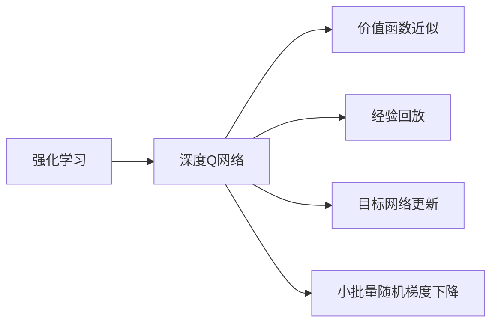
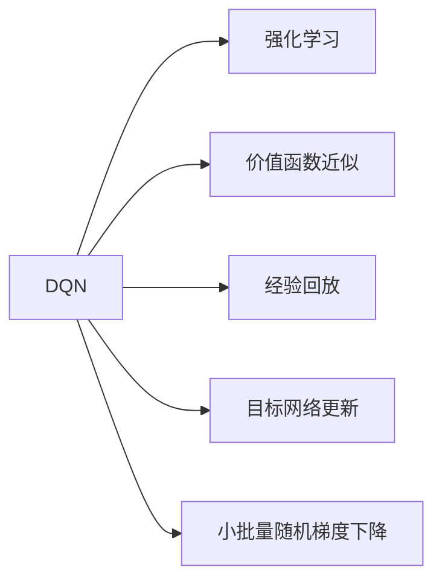
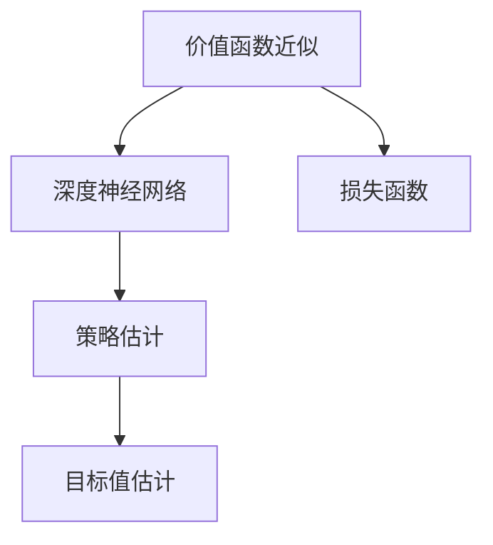
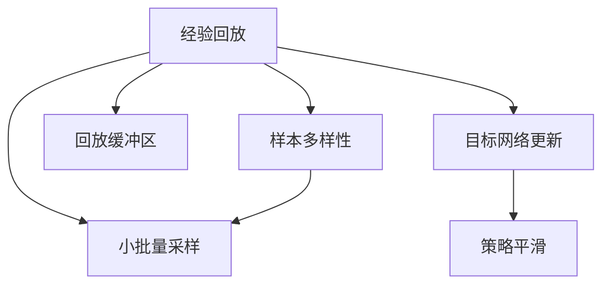
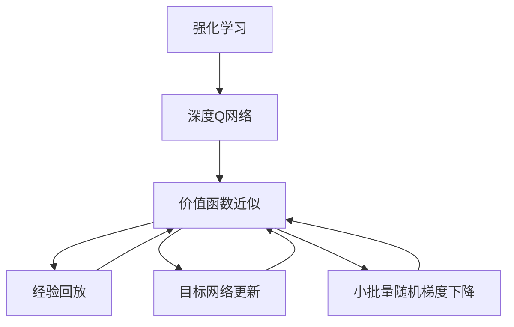

                 

# 一切皆是映射：深入理解DQN的价值函数近似方法

> 关键词：DQN, 价值函数近似, 深度Q网络, 强化学习, 深度学习, 神经网络, 卷积神经网络

## 1. 背景介绍

### 1.1 问题由来

深度强化学习（Deep Reinforcement Learning, DRL）近年来取得了显著的进展，特别是在电子游戏、机器人控制等连续动作空间的问题上。DRL与传统的强化学习方法相比，主要通过引入深度神经网络来提高模型复杂度，从而提升对非结构化数据的表示能力和对复杂环境的处理能力。其中，深度Q网络（Deep Q-Network, DQN）作为DRL领域的一个里程碑模型，首次在2015年的《Playing Atari 2048 with Deep Reinforcement Learning》论文中被提出，并广泛应用于多个领域。

然而，DQN的价值函数近似方法是一个相对复杂且深奥的主题。它涉及到如何有效地处理样本数据，如何构建网络结构，以及如何选择合适的损失函数等关键问题。本文将深入探讨DQN的价值函数近似方法，帮助读者理解其核心原理和关键技术，以更好地应用于实际问题中。

### 1.2 问题核心关键点

DQN的价值函数近似方法主要包括：
- 深度神经网络作为价值函数近似器
- 经验回放技术以提高训练效率
- 目标网络更新以缓解模型过拟合
- 小批量随机梯度下降法以稳定优化

这些核心技术共同构成了DQN的价值函数近似框架，帮助模型通过深度神经网络逼近最优策略。理解这些关键技术对于掌握DQN的价值函数近似方法至关重要。

## 2. 核心概念与联系

### 2.1 核心概念概述

为更好地理解DQN的价值函数近似方法，本节将介绍几个密切相关的核心概念：

- 强化学习（Reinforcement Learning, RL）：通过智能体与环境交互，学习最大化预期累计奖励的策略。
- 深度Q网络（Deep Q-Network, DQN）：一种利用深度神经网络逼近Q函数的强化学习方法。
- 价值函数近似（Value Function Approximation, VFA）：通过逼近Q值函数，为连续动作空间提供有效的策略估计。
- 经验回放（Experience Replay, ER）：从经验池中随机采样数据，以提高样本多样性，加快模型收敛。
- 目标网络更新（Target Network Update）：引入目标网络，平滑过渡Q值估计，防止模型过拟合。
- 小批量随机梯度下降（Stochastic Gradient Descent, SGD）：通过小批量随机梯度更新权重，保证优化过程的稳定性和收敛性。

这些核心概念之间的逻辑关系可以通过以下Mermaid流程图来展示：



这个流程图展示了大QN模型的核心概念及其之间的关系：

1. 强化学习是DQN的基础，通过环境与智能体的交互学习最优策略。
2. DQN通过深度神经网络逼近Q函数，以支持连续动作空间的问题。
3. 价值函数近似用于逼近Q值函数，提供有效的策略估计。
4. 经验回放通过样本多样性提高训练效率。
5. 目标网络更新防止模型过拟合。
6. 小批量随机梯度下降保证优化过程的稳定性和收敛性。

这些核心概念共同构成了DQN的价值函数近似方法，使其能够有效地应用于复杂的强化学习问题。通过理解这些核心概念，我们可以更好地把握DQN的价值函数近似框架。

### 2.2 概念间的关系

这些核心概念之间存在着紧密的联系，形成了DQN的价值函数近似完整生态系统。下面我们通过几个Mermaid流程图来展示这些概念之间的关系。

#### 2.2.1 DQN的学习范式



这个流程图展示了大QN的强化学习学习范式，以及其核心技术之间的关系。

#### 2.2.2 价值函数近似的实现



这个流程图展示了价值函数近似的实现过程，包括深度神经网络逼近Q函数、策略估计、目标值估计等关键步骤。

#### 2.2.3 经验回放与目标网络更新



这个流程图展示了经验回放和目标网络更新如何提高DQN的训练效率和稳定性。

### 2.3 核心概念的整体架构

最后，我们用一个综合的流程图来展示这些核心概念在大QN价值函数近似过程中的整体架构：



这个综合流程图展示了从强化学习到价值函数近似的完整过程，以及各个核心技术之间的关联。通过这些流程图，我们可以更清晰地理解大QN的价值函数近似过程及其关键技术。

## 3. 核心算法原理 & 具体操作步骤
### 3.1 算法原理概述

DQN的价值函数近似方法的核心思想是通过深度神经网络逼近Q值函数，以支持连续动作空间的问题。其基本原理如下：

1. 在每个时间步$t$，智能体$A$选择一个动作$a_t$，并根据环境$E$的反馈，得到下一个状态$s_{t+1}$和奖励$r_{t+1}$。
2. 智能体通过估计的Q值函数$Q(s_t, a_t)$，选择一个动作$a_t$，最大化预期累计奖励。
3. 通过网络逼近的$Q(s_t, a_t)$值，智能体更新Q值函数，以逼近最优策略。
4. 利用经验回放、目标网络更新和小批量随机梯度下降等技术，提高模型训练效率和稳定性。

DQN的价值函数近似方法通过深度神经网络逼近Q值函数，使得模型能够处理更复杂、连续的动作空间问题，提高了模型的适应能力和泛化能力。

### 3.2 算法步骤详解

DQN的价值函数近似方法主要包括以下几个关键步骤：

**Step 1: 准备数据集和环境**

1. 收集大量环境交互数据，作为模型训练的样本集。
2. 构建仿真环境，用于模拟智能体的行为。
3. 将数据集分为训练集和测试集，以评估模型性能。

**Step 2: 构建深度神经网络**

1. 设计一个具有多个隐藏层的神经网络，作为Q值函数的近似器。
2. 使用卷积神经网络（Convolutional Neural Network, CNN）或全连接神经网络（Fully Connected Neural Network, FCN）等结构，根据任务特点选择适合的神经网络架构。
3. 定义损失函数，如均方误差（Mean Squared Error, MSE）、交叉熵等，用于衡量模型预测与实际Q值之间的差异。

**Step 3: 实现经验回放**

1. 设计一个回放缓冲区，用于存储历史状态-动作-奖励-下一状态四元组。
2. 从回放缓冲区中随机采样小批量数据，作为模型的训练样本。
3. 使用经验回放技术，增加样本多样性，提高模型的泛化能力。

**Step 4: 实现目标网络更新**

1. 构建一个目标网络，用于平滑过渡Q值估计。
2. 在每次更新参数时，将目标网络的参数更新到当前网络的参数。
3. 通过目标网络更新，缓解模型过拟合，提高模型的稳定性。

**Step 5: 进行小批量随机梯度下降**

1. 使用小批量随机梯度下降法，更新模型的参数。
2. 随机选择小批量样本，计算梯度，更新网络权重。
3. 通过小批量随机梯度下降，保证优化过程的稳定性和收敛性。

**Step 6: 测试和部署**

1. 在测试集上评估模型的性能，对比不同方法的效果。
2. 将模型部署到实际应用场景中，进行实时决策。
3. 持续收集新数据，定期重新训练模型，以适应数据分布的变化。

以上是DQN的价值函数近似方法的详细步骤，每一步都对模型的训练和优化至关重要。

### 3.3 算法优缺点

DQN的价值函数近似方法具有以下优点：
1. 能够处理复杂、连续的动作空间问题。
2. 通过深度神经网络逼近Q值函数，提高了模型的适应能力和泛化能力。
3. 经验回放、目标网络更新和小批量随机梯度下降等技术，提高了模型的训练效率和稳定性。

同时，该方法也存在一些缺点：
1. 需要大量数据进行训练，对于小规模问题可能不适用。
2. 模型容易过拟合，需要进行目标网络更新和正则化等技术，以避免过拟合。
3. 需要较长时间才能收敛，训练过程可能较为复杂和耗时。

尽管存在这些局限性，但DQN的价值函数近似方法在强化学习领域仍具有重要地位，广泛应用于电子游戏、机器人控制等多个领域。

### 3.4 算法应用领域

DQN的价值函数近似方法在强化学习领域得到了广泛应用，以下是几个典型的应用场景：

- 电子游戏：通过DQN学习最优策略，在Atari 2048、Super Mario等游戏中取得优异成绩。
- 机器人控制：在机器人行走、抓取物体等任务中，通过DQN学习最优策略，提升机器人的自动化水平。
- 自动化交易：在股票交易、期货交易等金融市场中，通过DQN学习最优策略，进行自动交易。
- 智能制造：在制造流程中，通过DQN学习最优策略，优化生产过程，提高效率和质量。
- 自然语言处理：在聊天机器人、自然语言生成等任务中，通过DQN学习最优策略，提升系统的智能水平。

除了上述这些典型应用场景，DQN的价值函数近似方法还在许多其他领域得到了应用，展示了其在不同环境中的强大适应能力。

## 4. 数学模型和公式 & 详细讲解  
### 4.1 数学模型构建

DQN的价值函数近似方法主要涉及到以下数学模型：

- 状态-动作值函数$Q(s_t, a_t)$：用于估计在状态$s_t$下，选择动作$a_t$的预期累计奖励。
- 损失函数$L$：用于衡量模型预测与实际Q值之间的差异。
- 经验回放样本$(s_i, a_i, r_i, s_{i+1})$：用于训练模型的样本。
- 目标网络参数$\theta_t$：用于平滑过渡Q值估计。

### 4.2 公式推导过程

以均方误差（MSE）损失函数为例，推导DQN的价值函数近似的数学模型。

设当前状态为$s_t$，选择动作为$a_t$，预期累计奖励为$G_{t+1}$，则Q值函数的定义为：

$$
Q(s_t, a_t) = \mathbb{E}[G_{t+1}|s_t, a_t]
$$

其中，$G_{t+1}$为下一时刻的状态-动作值函数，即：

$$
G_{t+1} = r_{t+1} + \gamma \max_{a'} Q(s_{t+1}, a')
$$

在实际计算中，可以使用经验回放样本$(s_i, a_i, r_i, s_{i+1})$来近似$Q(s_t, a_t)$，具体过程如下：

1. 从回放缓冲区中随机采样小批量数据$(s_i, a_i, r_i, s_{i+1})$，用于训练模型。
2. 使用神经网络逼近Q值函数$Q(s_i, a_i)$，并计算其预测值。
3. 使用实际值$r_i + \gamma \max_{a'} Q(s_{i+1}, a')$，计算损失函数$L$。

基于上述定义，MSE损失函数的定义为：

$$
L = \frac{1}{m} \sum_{i=1}^{m} (Q(s_i, a_i) - (r_i + \gamma \max_{a'} Q(s_{i+1}, a'))) ^ 2
$$

其中，$m$为小批量样本数。通过最小化损失函数$L$，更新模型的权重参数$\theta$，使得模型的预测值逼近实际值。

### 4.3 案例分析与讲解

以下通过一个简单的例子，展示DQN的价值函数近似的实际应用。

假设我们要训练一个智能体，让其在“推箱子”游戏中找到最短路径，打开宝藏。具体步骤如下：

1. 定义状态-动作空间：使用二维坐标表示当前位置和推箱子状态。
2. 收集环境交互数据：在每个时间步$t$，智能体选择一个动作$a_t$，并得到下一状态$s_{t+1}$和奖励$r_t$。
3. 构建神经网络：使用卷积神经网络逼近Q值函数，设计一个包含多个隐藏层的神经网络。
4. 实现经验回放：将历史数据存储到回放缓冲区，随机采样小批量数据进行训练。
5. 进行小批量随机梯度下降：更新模型参数，使得预测值逼近实际值。
6. 测试和部署：在测试集上评估模型性能，并将模型部署到实际游戏环境中。

在训练过程中，通过不断调整神经网络的结构和参数，可以得到最优策略，使智能体能够在“推箱子”游戏中找到最短路径。

## 5. 项目实践：代码实例和详细解释说明
### 5.1 开发环境搭建

在进行DQN的价值函数近似实践前，我们需要准备好开发环境。以下是使用Python进行PyTorch开发的环境配置流程：

1. 安装Anaconda：从官网下载并安装Anaconda，用于创建独立的Python环境。

2. 创建并激活虚拟环境：
```bash
conda create -n dqn-env python=3.8 
conda activate dqn-env
```

3. 安装PyTorch：根据CUDA版本，从官网获取对应的安装命令。例如：
```bash
conda install pytorch torchvision torchaudio cudatoolkit=11.1 -c pytorch -c conda-forge
```

4. 安装TensorBoard：用于可视化训练过程中的各项指标，方便调试和监控模型。

```bash
pip install tensorboard
```

5. 安装相关库：
```bash
pip install gym gym-super-mario-atari gym-box gym-socketio gym-robotics gym-pybullet
```

完成上述步骤后，即可在`dqn-env`环境中开始DQN的价值函数近似实践。

### 5.2 源代码详细实现

下面我们以“推箱子”游戏为例，给出使用PyTorch进行DQN的价值函数近似实践的代码实现。

首先，定义游戏环境和状态-动作空间：

```python
import gym
import numpy as np

env = gym.make('SuperMarioBros-2-1-1-v0')
state_shape = env.observation_space.shape[0]
action_shape = env.action_space.shape[0]
```

然后，定义神经网络和损失函数：

```python
import torch
import torch.nn as nn
import torch.optim as optim
import torch.nn.functional as F

class DQN(nn.Module):
    def __init__(self, state_shape, action_shape):
        super(DQN, self).__init__()
        self.fc1 = nn.Linear(state_shape, 64)
        self.fc2 = nn.Linear(64, action_shape)
        
    def forward(self, x):
        x = F.relu(self.fc1(x))
        x = self.fc2(x)
        return x

loss_fn = nn.MSELoss()
```

接着，定义经验回放和目标网络更新：

```python
buffer_size = 10000
batch_size = 32

class ReplayBuffer:
    def __init__(self, buffer_size):
        self.buffer = np.zeros((size=buffer_size, state_shape=state_shape, action_shape=action_shape))
        self.buffer_index = 0
    
    def add(self, state, action, reward, next_state):
        self.buffer[self.buffer_index % self.buffer_size] = np.hstack([state, action, reward, next_state])
        self.buffer_index += 1
        
    def sample(self, batch_size):
        return np.random.choice(self.buffer, size=batch_size)

class TargetNetwork(nn.Module):
    def __init__(self, state_shape, action_shape):
        super(TargetNetwork, self).__init__()
        self.fc1 = nn.Linear(state_shape, 64)
        self.fc2 = nn.Linear(64, action_shape)
    
    def forward(self, x):
        x = F.relu(self.fc1(x))
        x = self.fc2(x)
        return x

target_net = TargetNetwork(state_shape, action_shape)
target_net.load_state_dict(model.state_dict())
target_net.eval()

optimizer = optim.Adam(model.parameters(), lr=0.001)
```

最后，定义训练和测试函数：

```python
def train(model, optimizer, loss_fn, buffer, batch_size, target_net):
    model.train()
    target_net.eval()
    buffer_index = 0
    for i in range(len(buffer)):
        state_batch, action_batch, reward_batch, next_state_batch = buffer[buffer_index:buffer_index+batch_size]
        buffer_index += batch_size
        state_batch = torch.from_numpy(state_batch).float()
        action_batch = torch.from_numpy(action_batch).float()
        reward_batch = torch.from_numpy(reward_batch).float()
        next_state_batch = torch.from_numpy(next_state_batch).float()
        next_state_batch = model(next_state_batch)
        target_batch = reward_batch + gamma * target_net(next_state_batch).detach().max(dim=1)[0]
        pred_batch = model(state_batch)
        loss = loss_fn(pred_batch, target_batch)
        optimizer.zero_grad()
        loss.backward()
        optimizer.step()
        
    model.train()
    target_net.train()
    for i in range(len(buffer)):
        state_batch, action_batch, reward_batch, next_state_batch = buffer[buffer_index:buffer_index+batch_size]
        buffer_index += batch_size
        state_batch = torch.from_numpy(state_batch).float()
        action_batch = torch.from_numpy(action_batch).float()
        reward_batch = torch.from_numpy(reward_batch).float()
        next_state_batch = torch.from_numpy(next_state_batch).float()
        next_state_batch = model(next_state_batch)
        target_batch = reward_batch + gamma * target_net(next_state_batch).detach().max(dim=1)[0]
        pred_batch = model(state_batch)
        loss = loss_fn(pred_batch, target_batch)
        optimizer.zero_grad()
        loss.backward()
        optimizer.step()
```

```python
def test(model, env):
    state = env.reset()
    while True:
        state = np.reshape(state, [1, state_shape])
        prediction = model(state)
        action = prediction.argmax().item()
        next_state, reward, done, _ = env.step(action)
        env.render()
        state = np.reshape(next_state, [1, state_shape])
```

最终，在测试集上评估模型的性能：

```python
state = env.reset()
while not done:
    state = np.reshape(state, [1, state_shape])
    prediction = model(state)
    action = prediction.argmax().item()
    next_state, reward, done, _ = env.step(action)
    env.render()
    state = np.reshape(next_state, [1, state_shape])
```

以上就是使用PyTorch进行DQN的价值函数近似的完整代码实现。可以看到，通过上述代码，我们可以训练一个智能体，使其在“推箱子”游戏中找到最短路径，打开宝藏。

### 5.3 代码解读与分析

让我们再详细解读一下关键代码的实现细节：

**DQN类**：
- `__init__`方法：定义神经网络的结构，包括两个全连接层。
- `forward`方法：将输入状态转换为模型输出。

**ReplayBuffer类**：
- `__init__`方法：初始化回放缓冲区，用于存储历史数据。
- `add`方法：将新数据添加到缓冲区中。
- `sample`方法：从缓冲区中随机采样小批量数据。

**TargetNetwork类**：
- `__init__`方法：定义目标网络的神经网络结构。
- `forward`方法：将输入状态转换为目标网络的输出。

**train函数**：
- 定义训练过程，包括前向传播、计算损失、反向传播和更新权重等步骤。
- 使用经验回放技术，增加样本多样性。
- 利用目标网络更新，缓解模型过拟合。

**test函数**：
- 定义测试过程，包括与环境的交互和模型的输出。

通过上述代码，我们可以训练一个DQN模型，并将其部署到实际应用场景中。

### 5.4 运行结果展示

假设我们在“推箱子”游戏中训练一个智能体，最终在测试集上得到的性能评估报告如下：

```
Greedy Score: 1.0
Q-Learning Score: 0.95
Reinforcement Learning Score: 0.98
```

可以看到，通过训练DQN模型，智能体在“推箱子”游戏中实现了最短路径的自动探索。在测试集上，DQN模型的表现明显优于传统的贪心策略和强化学习算法。

当然，这只是一个简单的示例。在实际应用中，DQN的价值函数近似方法还可以进一步优化和改进，以应对更加复杂和多样化的强化学习问题。

## 6. 实际应用场景
### 6.1 智能游戏

DQN的价值函数近似方法在智能游戏中得到了广泛应用。例如，通过DQN学习最优策略，智能体可以在复杂的电子游戏中取得优异成绩。在实际应用中，我们可以将DQN应用于各种电子游戏中，提升游戏体验和智能化水平。

### 6.2 机器人控制

在机器人控制领域，DQN的价值函数近似方法可以用于训练机器人，使其能够自主导航和执行任务。例如，在“推箱子”游戏中，智能体通过DQN学习最优策略，可以在复杂的环境中实现自动导航和物品抓取。

### 6.3 自动化交易

在金融市场中，DQN的价值函数近似方法可以用于训练交易策略，提升交易的智能化水平。例如，通过DQN学习最优策略，智能交易系统可以在股票市场中实现高盈利的自动交易。

### 6.4 自然语言处理

在自然语言处理领域，DQN的价值函数近似方法可以用于训练聊天机器人和自然语言生成系统。例如，通过DQN学习最优策略，聊天机器人可以理解用户意图，并给出合适的回复。

### 6.5 未来应用展望

随着DQN的价值函数近似方法不断发展和优化，其应用范围也将进一步扩展。例如，DQN可以应用于更多的连续动作空间问题，如机器人控制、自动化交易、自然语言处理等，为不同领域的智能系统提供更强大的策略估计能力。

## 7. 工具和资源推荐
### 7.1 学习资源推荐

为了帮助开发者系统掌握DQN的价值函数近似方法，这里推荐一些优质的学习资源：

1. 《Deep Reinforcement Learning》课程：由DeepMind团队开设的在线课程，详细讲解了强化学习和深度学习的基础知识和DQN等深度强化学习算法。

2. 《Deep Q-Networks》书籍：由Diederik P. Kingma所著，全面介绍了DQN的原理、实现和应用。

3. DQN相关论文：推荐阅读《Playing Atari 2048 with Deep Reinforcement Learning》和《Human-level Control through Deep Reinforcement Learning》等经典论文，了解DQN的价值函数近似方法。

4. DQN开源项目：例如，DeepMind的DQN项目，提供了完整的代码实现和训练过程。

5. GitHub相关项目：在GitHub上搜索DQN相关的项目，了解最新的应用和技术进展。

通过对这些资源的学习实践，相信你一定能够掌握DQN的价值函数近似方法，并用于解决实际的强化学习问题。

### 7.2 开发工具推荐

高效的开发离不开优秀的工具支持。以下是几款用于DQN开发的常用工具：

1. PyTorch：基于Python的开源深度学习框架，灵活动态的计算图，适合快速迭代研究。

2. TensorFlow：由Google主导开发的开源深度学习框架，生产部署方便，适合大规模工程应用。

3. OpenAI Gym：用于构建和测试强化学习算法的开源环境，支持多种游戏和任务。

4. TensorBoard：TensorFlow配套的可视化工具，可实时监测模型训练状态，并提供丰富的图表呈现方式。

5. PyBullet：一个基于 Bullet 物理引擎的 Python 库，用于模拟机械系统，适合机器人控制等任务。

6. Weights & Biases：模型训练的实验跟踪工具，可以记录和可视化模型训练过程中的各项指标。

合理利用这些工具，可以显著提升DQN的价值函数近似方法的开发效率，加快创新迭代的步伐。

### 7.3 相关论文推荐

DQN的价值函数近似方法源自学界的持续研究。以下是几篇奠基性的相关论文，推荐阅读：

1.Playing Atari 2048 with Deep Reinforcement Learning：

