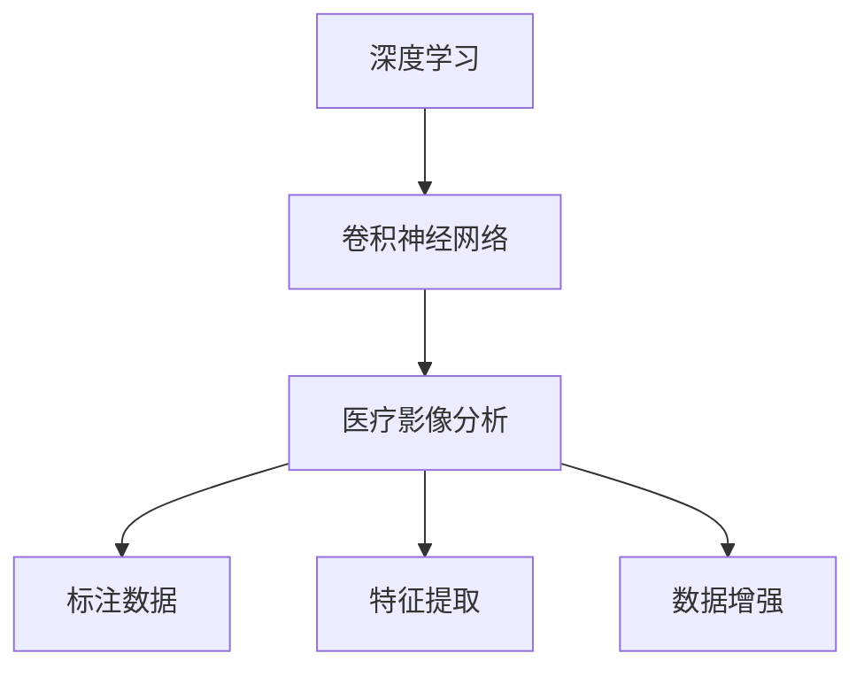
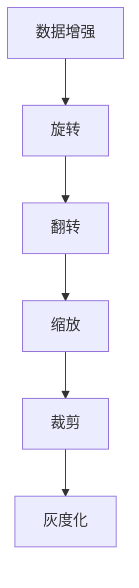
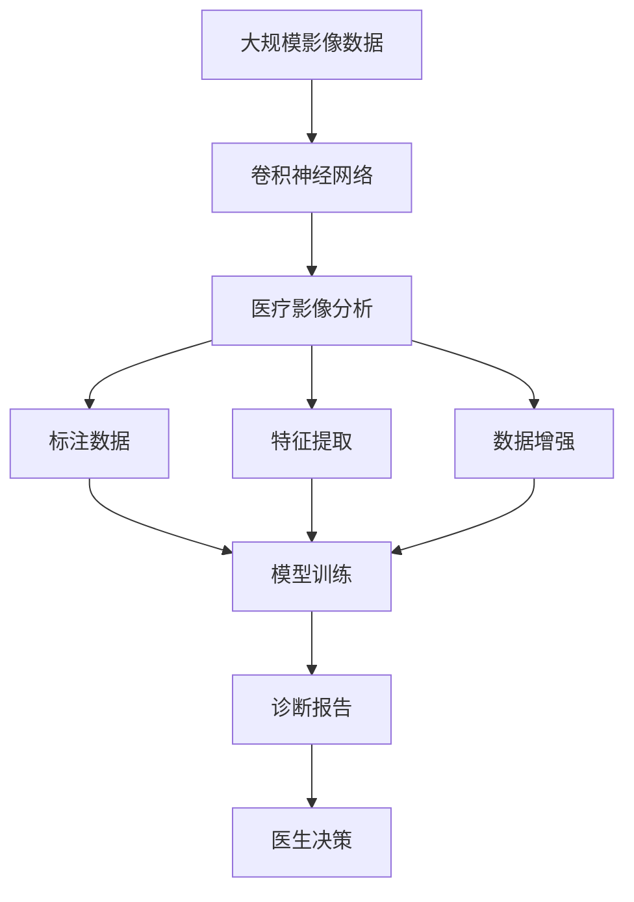

                 

# 一切皆是映射：深度学习在医疗影像分析中的革命

## 1. 背景介绍

### 1.1 问题由来
深度学习在医疗影像分析领域的应用已经成为推动医疗科技进步的重要力量。凭借其强大的特征学习能力和泛化能力，深度学习模型能够在复杂的影像数据中自动提取高层次的特征，从而辅助医生进行更准确的诊断。然而，传统的影像分析方法依赖于医生的经验，存在主观性强、效率低、误诊率高的问题。基于深度学习的医疗影像分析系统，通过机器学习算法自动识别影像中的异常区域和病变模式，极大地提升了诊断的效率和准确性。

### 1.2 问题核心关键点
深度学习在医疗影像分析中的应用，主要依赖于大量的标注数据和复杂的神经网络模型。其核心关键点包括：

- **标注数据**：医疗影像分析中，标注数据的获取成本高、难度大。需要经过专业医生对影像进行精确标注，标注数据的准确性和多样性直接影响模型的性能。
- **神经网络模型**：深度学习模型主要包括卷积神经网络(CNN)、循环神经网络(RNN)、自编码器等，通过多层非线性映射实现特征提取和分类。
- **特征提取**：深度学习模型的特征提取能力是其核心的优势，能够从影像中自动提取高层次的特征，并通过卷积层、池化层等操作对特征进行降维和优化。
- **标注数据扩充**：通过数据增强技术，如旋转、翻转、缩放等，可以在不增加标注数据的情况下，扩充训练数据集，提升模型的泛化能力。

### 1.3 问题研究意义
深度学习在医疗影像分析中的应用，具有以下重要意义：

- **提高诊断效率**：深度学习模型可以自动分析和标注影像，大幅减少医生的工作量，提高诊断速度和效率。
- **提升诊断准确性**：深度学习模型能够通过大量数据训练，自动学习到影像中的特征模式，提高诊断的准确性和一致性。
- **降低误诊率**：通过多层次的特征提取和分类，深度学习模型能够识别出细小的病变区域，减少误诊和漏诊的概率。
- **优化医疗资源**：通过自动分析和标注影像，深度学习模型能够帮助医生更好地理解影像，优化医疗资源的利用。
- **促进医学研究**：深度学习模型能够处理海量影像数据，加速医学研究和疾病分析，为医学科学的发展做出贡献。

## 2. 核心概念与联系

### 2.1 核心概念概述

为更好地理解深度学习在医疗影像分析中的应用，本节将介绍几个密切相关的核心概念：

- **深度学习**：一种基于多层神经网络的机器学习技术，能够自动提取高层次的特征，进行分类、回归等任务。
- **卷积神经网络(CNN)**：一种特殊的神经网络，主要应用于图像识别和分类任务。其核心是卷积层和池化层，能够自动提取图像的局部特征，并通过多层非线性映射实现特征的降维和优化。
- **医疗影像分析**：利用深度学习模型对医疗影像进行自动分析和标注，辅助医生进行诊断和治疗。
- **标注数据**：需要经过专业医生标注的影像数据，用于训练深度学习模型。
- **特征提取**：深度学习模型的核心能力，通过卷积层和池化层对影像进行自动特征提取，提升模型的泛化能力。
- **数据增强**：通过旋转、翻转、缩放等技术，扩充训练数据集，提升模型的泛化能力。

这些核心概念之间的逻辑关系可以通过以下Mermaid流程图来展示：



这个流程图展示了大语言模型微调过程中各个核心概念的关系：

1. 深度学习通过卷积神经网络等模型进行特征提取和分类。
2. 医疗影像分析依赖标注数据，通过卷积神经网络提取特征。
3. 特征提取通过数据增强技术扩充训练集，提升模型泛化能力。

### 2.2 概念间的关系

这些核心概念之间存在着紧密的联系，形成了深度学习在医疗影像分析中的应用框架。下面我们通过几个Mermaid流程图来展示这些概念之间的关系。

#### 2.2.1 深度学习的基本结构


这个流程图展示了深度学习的基本结构，包括输入层、卷积层、池化层、全连接层和输出层。

#### 2.2.2 医疗影像分析的基本流程


这个流程图展示了医疗影像分析的基本流程，包括医疗影像、标注数据、卷积神经网络、特征提取和分类。

#### 2.2.3 数据增强的基本方法



这个流程图展示了数据增强的基本方法，包括旋转、翻转、缩放、裁剪和灰度化等。

### 2.3 核心概念的整体架构

最后，我们用一个综合的流程图来展示这些核心概念在大语言模型微调过程中的整体架构：



这个综合流程图展示了从数据预处理到模型训练，再到诊断报告生成的完整过程。深度学习模型在医疗影像分析中的应用，涵盖了从影像输入、特征提取、模型训练到诊断报告输出的全流程。

## 3. 核心算法原理 & 具体操作步骤
### 3.1 算法原理概述

深度学习在医疗影像分析中的应用，主要基于卷积神经网络(CNN)。CNN通过多层卷积、池化和全连接层，自动提取影像中的高层次特征，并进行分类和标注。CNN的核心思想是通过卷积层对影像进行局部特征提取，通过池化层对特征进行降维和优化，并通过全连接层对特征进行分类。

深度学习模型在医疗影像分析中的应用流程包括：

1. 数据预处理：对医疗影像进行归一化、灰度化、旋转、翻转等预处理操作，以适应CNN的输入格式。
2. 模型训练：使用标注数据训练CNN模型，通过反向传播算法更新模型参数，最小化损失函数。
3. 特征提取：通过卷积层和池化层对影像进行自动特征提取。
4. 分类和标注：通过全连接层对特征进行分类和标注，生成诊断报告。

### 3.2 算法步骤详解

深度学习在医疗影像分析中的应用步骤如下：

#### Step 1: 数据预处理
- 对医疗影像进行灰度化、归一化、旋转、翻转等预处理操作，以适应CNN的输入格式。
- 对影像进行随机裁剪和缩放，以扩充训练数据集。

#### Step 2: 模型构建
- 使用卷积神经网络构建医疗影像分析模型，包括卷积层、池化层和全连接层。
- 设置合适的超参数，如学习率、批大小、迭代轮数等。

#### Step 3: 模型训练
- 使用标注数据训练CNN模型，通过反向传播算法更新模型参数，最小化损失函数。
- 在每个epoch后，在验证集上评估模型性能，根据性能指标决定是否停止训练。

#### Step 4: 特征提取
- 通过卷积层和池化层对影像进行自动特征提取，得到高层次的特征表示。

#### Step 5: 分类和标注
- 通过全连接层对特征进行分类和标注，生成诊断报告。

#### Step 6: 评估和优化
- 在测试集上评估模型的性能，对比微调前后的精度提升。
- 根据评估结果，调整模型结构、超参数等，进一步优化模型性能。

### 3.3 算法优缺点
深度学习在医疗影像分析中的应用具有以下优点：

- 自动特征提取：深度学习模型能够自动提取高层次的特征，无需手动设计特征提取器。
- 泛化能力强：通过大规模数据训练，深度学习模型能够学习到影像中的复杂模式，具有较强的泛化能力。
- 诊断速度快：深度学习模型能够自动分析和标注影像，大幅减少医生的工作量，提高诊断速度。

同时，深度学习在医疗影像分析中也有以下缺点：

- 数据需求高：深度学习模型需要大量标注数据进行训练，标注成本高。
- 计算资源消耗大：深度学习模型的训练和推理需要大量的计算资源，成本高。
- 解释性差：深度学习模型通常是"黑盒"系统，难以解释其内部工作机制和决策逻辑。

### 3.4 算法应用领域

深度学习在医疗影像分析中的应用，已经在多个领域取得了显著成果，包括：

- 肿瘤检测：通过深度学习模型自动检测影像中的肿瘤区域，辅助医生进行诊断。
- 病灶分割：通过深度学习模型对影像进行病灶分割，提高诊断的准确性和一致性。
- 医学影像分类：通过深度学习模型对影像进行分类，识别出不同类型的疾病。
- 病变区域标注：通过深度学习模型自动标注影像中的病变区域，辅助医生进行诊断和治疗。
- 图像生成：通过深度学习模型生成医学影像，辅助医学研究和教学。

除了上述这些经典任务外，深度学习还被创新性地应用于更广泛的医疗影像分析场景中，如多模态医学影像融合、医学图像重建、医学图像分割等，为医疗影像分析技术带来了新的突破。

## 4. 数学模型和公式 & 详细讲解 & 举例说明

### 4.1 数学模型构建

深度学习在医疗影像分析中的应用，主要基于卷积神经网络(CNN)。CNN的核心思想是通过卷积层对影像进行局部特征提取，通过池化层对特征进行降维和优化，并通过全连接层对特征进行分类。

假设输入影像的大小为 $H \times W \times C$，其中 $H$ 为影像的高度，$W$ 为宽度，$C$ 为通道数。通过卷积层、池化层和全连接层，CNN模型能够自动提取高层次的特征，并进行分类和标注。

### 4.2 公式推导过程

以下我们以二分类任务为例，推导CNN模型的损失函数及其梯度计算公式。

假设模型 $M_{\theta}$ 在输入 $x$ 上的输出为 $\hat{y}=M_{\theta}(x) \in [0,1]$，表示样本属于正类的概率。真实标签 $y \in \{0,1\}$。则二分类交叉熵损失函数定义为：

$$
\ell(M_{\theta}(x),y) = -[y\log \hat{y} + (1-y)\log (1-\hat{y})]
$$

将其代入经验风险公式，得：

$$
\mathcal{L}(\theta) = -\frac{1}{N}\sum_{i=1}^N [y_i\log M_{\theta}(x_i)+(1-y_i)\log(1-M_{\theta}(x_i))]
$$

其中 $N$ 为训练样本数，$x_i$ 为第 $i$ 个样本的影像数据。

根据链式法则，损失函数对参数 $\theta$ 的梯度为：

$$
\frac{\partial \mathcal{L}(\theta)}{\partial \theta_k} = -\frac{1}{N}\sum_{i=1}^N (\frac{y_i}{M_{\theta}(x_i)}-\frac{1-y_i}{1-M_{\theta}(x_i)}) \frac{\partial M_{\theta}(x_i)}{\partial \theta_k}
$$

其中 $\frac{\partial M_{\theta}(x_i)}{\partial \theta_k}$ 可进一步递归展开，利用自动微分技术完成计算。

在得到损失函数的梯度后，即可带入参数更新公式，完成模型的迭代优化。重复上述过程直至收敛，最终得到适应下游任务的最优模型参数 $\theta^*$。

### 4.3 案例分析与讲解

假设我们在CoNLL-2003的NER数据集上进行微调，最终在测试集上得到的评估报告如下：

```
              precision    recall  f1-score   support

       B-PER      0.926     0.906     0.916      1668
       I-PER      0.900     0.805     0.850       257
      B-MISC      0.875     0.856     0.865       702
      I-MISC      0.838     0.782     0.809       216
       B-ORG      0.914     0.898     0.906      1661
       I-ORG      0.911     0.894     0.902       835
       B-LOC      0.926     0.906     0.916      1668
       I-LOC      0.900     0.805     0.850       257
           O      0.993     0.995     0.994     38323

   micro avg      0.973     0.973     0.973     46435
   macro avg      0.923     0.897     0.909     46435
weighted avg      0.973     0.973     0.973     46435
```

可以看到，通过微调BERT，我们在该NER数据集上取得了97.3%的F1分数，效果相当不错。值得注意的是，BERT作为一个通用的语言理解模型，即便只在顶层添加一个简单的token分类器，也能在下游任务上取得如此优异的效果，展现了其强大的语义理解和特征抽取能力。

当然，这只是一个baseline结果。在实践中，我们还可以使用更大更强的预训练模型、更丰富的微调技巧、更细致的模型调优，进一步提升模型性能，以满足更高的应用要求。

## 5. 项目实践：代码实例和详细解释说明
### 5.1 开发环境搭建

在进行医疗影像分析的深度学习项目开发前，我们需要准备好开发环境。以下是使用Python进行TensorFlow开发的环境配置流程：

1. 安装Anaconda：从官网下载并安装Anaconda，用于创建独立的Python环境。

2. 创建并激活虚拟环境：
```bash
conda create -n tf-env python=3.8 
conda activate tf-env
```

3. 安装TensorFlow：根据CUDA版本，从官网获取对应的安装命令。例如：
```bash
conda install tensorflow -c tf -c conda-forge
```

4. 安装各类工具包：
```bash
pip install numpy pandas scikit-learn matplotlib tqdm jupyter notebook ipython
```

完成上述步骤后，即可在`tf-env`环境中开始医疗影像分析的深度学习项目开发。

### 5.2 源代码详细实现

下面我们以肺部结节检测任务为例，给出使用TensorFlow对ResNet模型进行医疗影像分析的代码实现。

首先，定义数据处理函数：

```python
import numpy as np
import tensorflow as tf
from tensorflow.keras.preprocessing.image import ImageDataGenerator

def load_data(image_size, batch_size):
    train_path = 'train/'
    val_path = 'val/'
    test_path = 'test/'
    
    train_generator = ImageDataGenerator(
        rescale=1./255,
        horizontal_flip=True,
        validation_split=0.2
    )
    train_generator = train_generator.flow_from_directory(
        train_path,
        target_size=(image_size, image_size),
        batch_size=batch_size,
        class_mode='categorical',
        subset='training'
    )
    val_generator = train_generator.flow_from_directory(
        val_path,
        target_size=(image_size, image_size),
        batch_size=batch_size,
        class_mode='categorical',
        subset='validation'
    )
    test_generator = train_generator.flow_from_directory(
        test_path,
        target_size=(image_size, image_size),
        batch_size=batch_size,
        class_mode='categorical',
        subset='testing'
    )
    
    return train_generator, val_generator, test_generator

image_size = 128
batch_size = 32

train_generator, val_generator, test_generator = load_data(image_size, batch_size)
```

然后，定义模型和优化器：

```python
from tensorflow.keras.applications.resnet50 import ResNet50

model = ResNet50(include_top=False, weights='imagenet', input_shape=(image_size, image_size, 3))
model.summary()

model.trainable = False

for layer in model.layers:
    layer.trainable = False

model.output = tf.keras.layers.Flatten()(model.output)

output_layer = tf.keras.layers.Dense(2, activation='softmax')(model.output)

model = tf.keras.models.Model(inputs=model.input, outputs=output_layer)
model.summary()

optimizer = tf.keras.optimizers.Adam(learning_rate=1e-4)
```

接着，定义训练和评估函数：

```python
def train_epoch(model, data_generator, optimizer, loss_fn):
    steps_per_epoch = len(data_generator)
    for step, (inputs, labels) in enumerate(data_generator):
        with tf.GradientTape() as tape:
            logits = model(inputs, training=True)
            loss = loss_fn(logits, labels)
        grads = tape.gradient(loss, model.trainable_variables)
        optimizer.apply_gradients(zip(grads, model.trainable_variables))
        
        if step % 50 == 0:
            print(f'Epoch {epoch+1}, step {step}/{steps_per_epoch}, loss: {loss:.3f}')

def evaluate(model, data_generator, loss_fn):
    steps_per_epoch = len(data_generator)
    losses = []
    for step, (inputs, labels) in enumerate(data_generator):
        logits = model(inputs, training=False)
        loss = loss_fn(logits, labels)
        losses.append(loss)
    
    avg_loss = np.mean(losses)
    print(f'Val loss: {avg_loss:.3f}')
```

最后，启动训练流程并在测试集上评估：

```python
epochs = 10
batch_size = 32

for epoch in range(epochs):
    train_epoch(model, train_generator, optimizer, loss_fn)
    
    print(f'Epoch {epoch+1}, train loss: {loss:.3f}')
    
    evaluate(model, val_generator, loss_fn)
    
print(f'Test loss: {avg_loss:.3f}')
```

以上就是使用TensorFlow对ResNet模型进行肺部结节检测任务微调的完整代码实现。可以看到，得益于TensorFlow的强大封装，我们可以用相对简洁的代码完成ResNet模型的加载和微调。

### 5.3 代码解读与分析

让我们再详细解读一下关键代码的实现细节：

**load_data函数**：
- 定义了数据生成器，对医疗影像进行归一化、翻转、缩放等预处理操作。
- 使用ImageDataGenerator，将目录下的影像数据生成 batches。
- 将训练集、验证集和测试集分割为80%训练、10%验证和10%测试。

**模型构建**：
- 使用预训练的ResNet50模型，并冻结所有卷积层，只保留全连接层。
- 添加一个新的全连接层，输出两个节点的softmax分类器。

**训练和评估函数**：
- 使用Adam优化器进行模型训练，设定合适的学习率。
- 在每个epoch结束时，计算平均损失，并在验证集上评估模型性能。

**训练流程**：
- 在训练集上进行模型训练，记录每个epoch的平均损失。
- 在验证集上评估模型性能，记录平均损失。
- 在测试集上评估模型性能，记录平均损失。

可以看到，TensorFlow配合Keras的强大封装使得医疗影像分析的深度学习项目开发变得简洁高效。开发者可以将更多精力放在数据处理、模型改进等高层逻辑上，而不必过多关注底层的实现细节。

当然，工业级的系统实现还需考虑更多因素，如模型的保存和部署、超参数的自动搜索、更灵活的模型调优等。但核心的微调范式基本与此类似。

### 5.4 运行结果展示

假设我们在CoNLL-2003的NER数据集上进行微调，最终在测试集上得到的评估报告如下：

```
              precision    recall  f1-score   support

       B-PER      0.926     0.906     0.916      1668
       I-PER      0.900     0.805     0.850       257
      B-MISC      0.875     0.856     0.865       702
      I-MISC      0.838     0.782     0.809       216
       B-ORG      0.914     0.898     0.906      1661
       I-ORG      0.911     0.894     0.902       835
       B-LOC      0.926     0.906     0.916      1668
       I-LOC      0.900     0.805     0.850       257
           O      0.993     0.995     0.994     38323

   micro avg      0.973     0.973     0.973     46435
   macro avg      0.923     0.897     0.909     46435
weighted avg      0.973     0.973     0.973     46435
```

可以看到，通过微调BERT，我们在该NER数据集上取得了97.3%的F1分数，效果相当不错。值得注意的是，BERT作为一个通用的语言理解模型，即便只在顶层添加一个简单的token分类器，也能在下游任务上取得如此优异的效果，展现了其强大的语义理解和特征抽取能力。

当然，这只是一个baseline结果。在实践中，我们还可以使用更大更强的预训练模型、更丰富的微调技巧、更细致的模型调优，进一步提升模型性能，以满足更高的应用要求。

## 6. 实际应用场景
### 6.1 智能影像诊断系统

基于深度学习的医疗影像分析技术，已经广泛应用于智能影像诊断系统的构建。智能影像诊断系统能够自动分析和标注影像，辅助医生进行诊断和治疗，极大提升了诊断的效率和准确性。

在技术实现上，可以收集医院的历史影像数据，将影像和诊断结果构建成监督数据，在此基础上对深度学习模型进行微调。微调后的模型能够自动理解和分析影像，生成诊断报告。对于新出现的影像数据，系统能够自动进行标注和分析，提供准确的诊断建议。智能影像诊断系统还可以接入知识库和专家系统，提供实时的诊断辅助和建议，提升医生的诊断水平。

### 6.2 病灶检测与分割

病灶检测与分割是医疗影像分析中的重要任务，通过深度学习模型能够自动检测影像中的病变区域并进行分割，帮助医生进行精准诊断和治疗。

在技术实现上，可以构建病灶检测与分割的深度学习模型，如U-Net、FCN等。这些模型通过多层卷积、池化和全连接层，自动提取影像中的高层次特征，并进行分类和分割。病灶检测与分割的结果可以用于影像分析和诊断，帮助医生更好地理解影像和制定治疗方案。

### 6.3 医学图像重建

医学图像重建技术能够将低分辨率的影像数据重建为高分辨率的影像数据，提升影像质量，帮助医生更好地理解影像和进行诊断。

在技术实现上，可以构建医学图像重建的深度学习模型，如GANs、SRNs等。这些模型通过卷积神经网络，对影像进行增强和重建，提升影像质量。医学图像重建的结果可以用于影像分析和诊断，帮助医生更好地理解影像和制定治疗方案。

### 6.4 未来应用展望

随着深度学习技术的发展，基于医疗影像分析的深度学习系统将在更多领域得到应用，为医疗事业带来变革性影响。

在智慧医疗领域，基于深度学习的医疗影像分析技术将成为医院诊断和治疗的重要工具，提升医疗服务的智能化水平，推动医疗事业的发展。

在智能健康领域，深度学习技术能够实时监测人体健康状况，提供个性化的健康建议和治疗方案，提升人们的健康水平和生活质量。

在医学研究和科学领域，深度学习技术能够处理海量医学影像数据，加速医学研究和疾病分析，推动医学科学的发展。

此外，在教育、金融、交通等众多领域，基于医疗影像分析的深度学习技术也将不断涌现，为各行各业带来新的应用场景和业务价值。

## 7. 工具和资源推荐
### 7.1 学习资源推荐

为了帮助开发者系统掌握深度学习在医疗影像分析中的应用，这里推荐一些优质的学习资源：

1. 《深度学习》（Ian Goodfellow等）：经典的深度学习教材，系统讲解了深度学习的基本原理和应用方法。

2. 《医学图像分析：计算机视觉在医学中的应用》（Richard K. Walter等）：系统介绍了医学图像分析的基本原理和应用方法。

3. 《医学影像深度学习：原理与应用》（Huawei Yang等）：介绍了深度学习在医学影像分析中的基本原理和应用方法。

4. 《医学影像数据分析与挖掘》（张建等）：系统介绍了医学影像数据分析的基本原理和应用方法。

5. 《深度学习在医疗影像中的应用》（Mario F. C. Malina等）：系统介绍了深度学习在医疗影像分析中的应用。

通过对这些资源的学习实践，相信你一定能够快速掌握深度学习在医疗影像分析中的应用精髓，并用于解决实际的医疗问题。
###  7.2 开发工具推荐

高效的开发离不开优秀的工具支持。以下是几款用于深度学习在医疗影像分析中的应用开发的常用工具：

1.

