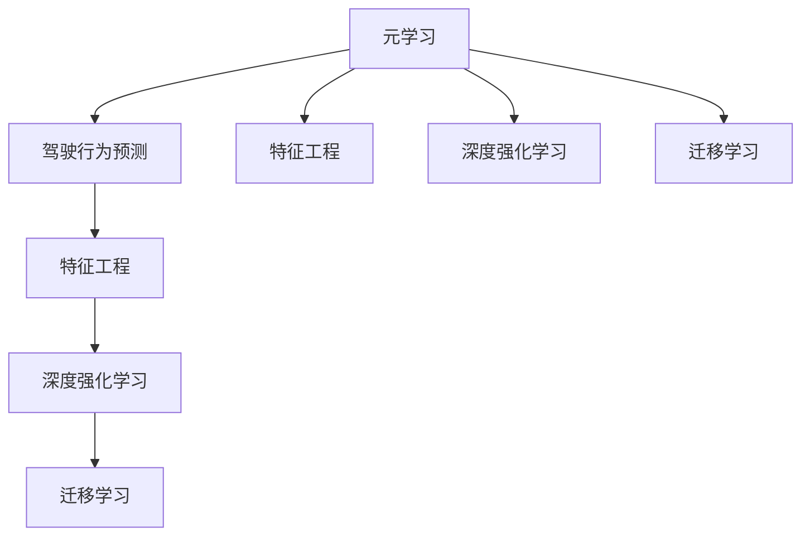
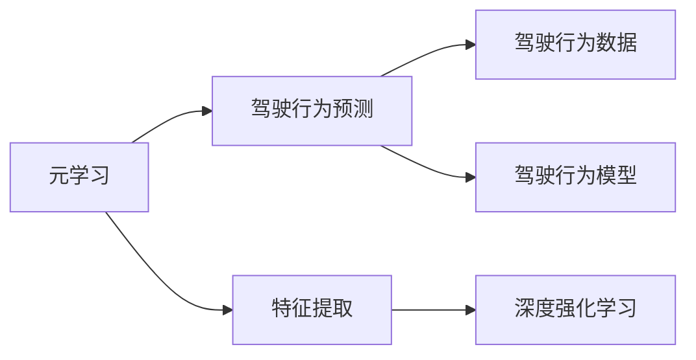
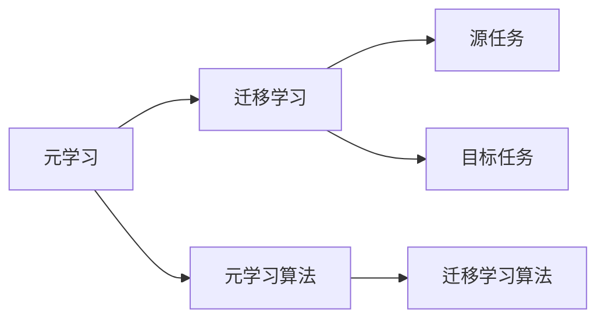
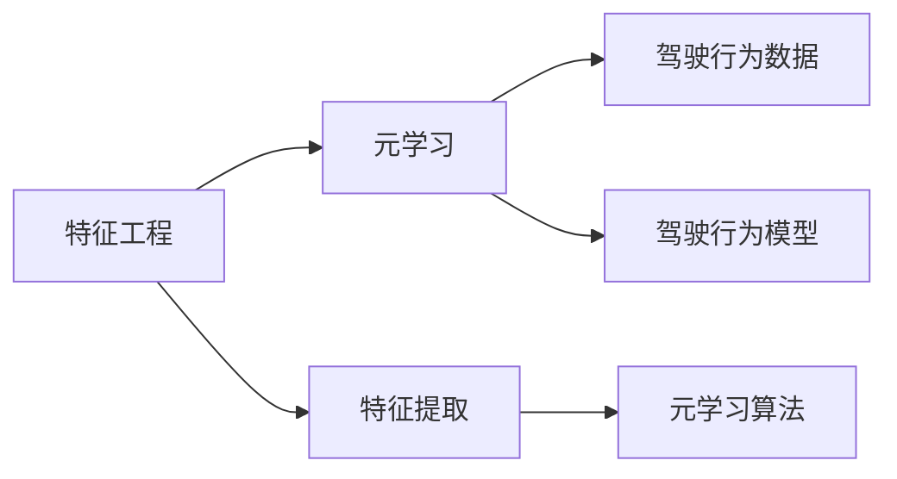
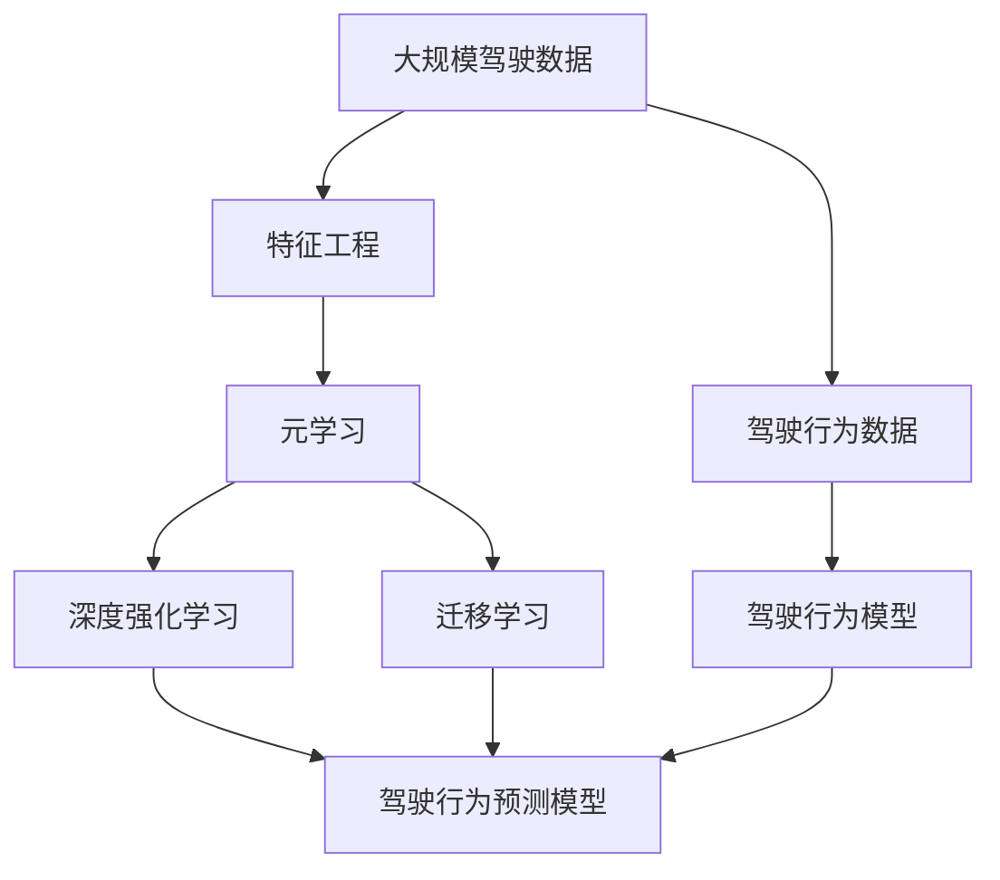

                 

# 一切皆是映射：用元学习攻克驾驶行为的预测挑战

## 1. 背景介绍

在现代汽车和智能驾驶技术的快速发展背景下，驾驶行为预测已经成为智能交通系统中的核心问题。如何准确预测驾驶员在各种驾驶环境下的行为，直接关系到自动驾驶的安全性和可靠性。传统的驾驶行为预测方法依赖于规则和经验，难以应对复杂的驾驶场景。而机器学习方法，如深度学习，在预测任务上取得了显著进步，但在大规模数据训练和模型优化上仍面临诸多挑战。

### 1.1 问题由来
驾驶行为预测涉及到对人类驾驶行为的建模和预测。驾驶员在道路上的决策受多种因素影响，如天气、交通状况、车速、驾驶习惯等。如何从这些复杂且动态变化的数据中，学习出具有泛化能力的预测模型，是驾驶行为预测的根本问题。

### 1.2 问题核心关键点
当前，驾驶行为预测的主要挑战包括：

- **数据多样性**：驾驶员在道路上的行为具有高度多样性，不同驾驶者、不同车型、不同路段等都会导致行为差异。
- **实时性要求**：驾驶行为预测需要实时响应，才能保证自动驾驶系统的决策及时性和安全性。
- **动态变化**：驾驶员的行为随时间、环境变化而变化，静态模型难以捕捉这些动态特征。
- **场景复杂性**：驾驶行为受到多种因素影响，单因素模型难以应对复杂多变的情境。

这些问题催生了对更为灵活、动态的驾驶行为预测方法的需求，而元学习（Meta-Learning）成为了一种潜在解决途径。

### 1.3 问题研究意义
驾驶行为预测技术的应用，直接影响到自动驾驶系统的安全性、可靠性和用户体验。元学习技术的引入，有望显著提升预测模型的灵活性和泛化能力，从而更好地适应不同的驾驶环境和行为模式。

## 2. 核心概念与联系

### 2.1 核心概念概述

为了更好地理解如何用元学习解决驾驶行为预测问题，本节将介绍几个密切相关的核心概念：

- **元学习（Meta-Learning）**：指通过少量样本来学习模型的学习过程，使得模型能够快速适应新任务。元学习的目标是找到一种通用的学习策略，从而在不同任务上快速迁移。

- **驾驶行为预测**：指通过分析驾驶员的历史行为数据，预测其在当前环境下的驾驶行为。驾驶行为预测涉及多个维度，包括加速度、转向、车道保持、停车等。

- **特征工程**：指从原始数据中提取和构造特征，以提高模型的预测准确性和泛化能力。在驾驶行为预测中，常用的特征包括车速、加速度、时间戳、路段类型等。

- **深度强化学习**：一种结合深度学习和强化学习的技术，通过与环境的互动，不断调整模型参数，优化决策行为。在驾驶行为预测中，深度强化学习可以用于模拟驾驶环境，训练预测模型。

- **迁移学习**：指在已有任务上训练的模型，能够迁移到新任务上，获得更好的表现。在驾驶行为预测中，迁移学习可以通过预训练模型，在新环境下快速适应。

这些核心概念之间的逻辑关系可以通过以下Mermaid流程图来展示：



这个流程图展示了元学习在大语言模型微调中的应用。元学习通过特征工程和深度强化学习，学习通用的学习策略，然后通过迁移学习，快速适应新的驾驶行为预测任务。

### 2.2 概念间的关系

这些核心概念之间存在着紧密的联系，形成了驾驶行为预测的完整生态系统。下面我们通过几个Mermaid流程图来展示这些概念之间的关系。

#### 2.2.1 元学习与驾驶行为预测



这个流程图展示了元学习与驾驶行为预测的基本流程。元学习从驾驶行为数据中提取特征，通过深度强化学习训练模型，最终应用到具体的驾驶行为预测任务中。

#### 2.2.2 元学习与迁移学习的关系



这个流程图展示了元学习与迁移学习的基本关系。元学习通过学习通用的学习策略，在源任务上训练模型，然后通过迁移学习，在新任务上快速适应。

#### 2.2.3 特征工程与元学习的关系



这个流程图展示了特征工程在元学习中的应用。特征工程通过提取和构造高质量特征，提高模型的预测性能，进而提升元学习的学习效果。

### 2.3 核心概念的整体架构

最后，我们用一个综合的流程图来展示这些核心概念在大语言模型微调过程中的整体架构：



这个综合流程图展示了从驾驶行为数据到具体预测模型的完整过程。驾驶行为数据经过特征工程处理后，通过元学习学习通用的学习策略，结合深度强化学习训练模型，最终应用迁移学习，实现驾驶行为预测。

## 3. 核心算法原理 & 具体操作步骤
### 3.1 算法原理概述

基于元学习的驾驶行为预测，本质上是一种通用的学习策略学习方法，旨在通过少量样本来学习模型，使得模型能够快速适应新任务。其核心思想是：利用已有数据训练出一种通用的学习策略，这种策略可以迁移应用到新的驾驶行为预测任务上，从而实现快速适应。

### 3.2 算法步骤详解

基于元学习的驾驶行为预测通常包括以下几个关键步骤：

**Step 1: 数据准备与特征工程**
- 收集驾驶行为数据，包括车速、加速度、转向角、车道保持等信息。
- 对数据进行清洗和预处理，如数据填充、归一化、时间分割等。
- 设计特征提取方法，从原始数据中提取有意义的特征，如速度变化率、转向角度变化等。

**Step 2: 元学习算法训练**
- 选择合适的元学习算法，如MAML（Meta-Learning by Learning from Experience）、Re-MAML（Recurrent Meta-Learning for Sequential Data）等。
- 对元学习算法进行训练，学习一种通用的学习策略。
- 在训练过程中，采用少量的驾驶行为数据进行元学习，以获得良好的泛化性能。

**Step 3: 迁移学习应用**
- 将训练好的元学习策略应用于新的驾驶行为预测任务。
- 在新任务上，利用迁移学习算法，快速适应和优化模型参数。
- 在新的驾驶行为数据上，对预测模型进行评估和调优。

### 3.3 算法优缺点

基于元学习的驾驶行为预测方法具有以下优点：
1. **泛化能力强**：元学习可以学习通用的学习策略，适应新任务时具有较强的泛化能力。
2. **迁移速度快**：通过迁移学习，可以快速在新任务上部署预测模型，减少训练时间。
3. **适应性强**：元学习模型可以适应不同的驾驶场景和行为模式，具有较好的灵活性。

同时，这种算法也存在一些缺点：
1. **数据依赖度高**：元学习需要大量的数据进行训练，否则泛化性能难以保证。
2. **算法复杂度高**：元学习算法的设计和实现较为复杂，需要一定的数学和编程基础。
3. **模型可解释性差**：元学习模型通常是黑盒模型，难以解释其内部工作机制。

### 3.4 算法应用领域

基于元学习的驾驶行为预测方法已经在多个实际应用中取得了成功，如：

- **智能驾驶**：利用元学习预测驾驶员的驾驶行为，优化自动驾驶系统的决策策略。
- **交通流量预测**：通过对历史交通数据的分析，预测未来的交通流量和车辆行为，优化交通管理。
- **驾驶培训**：通过元学习预测学习者的驾驶行为，提供个性化的培训建议，提高培训效果。
- **车辆异常检测**：利用元学习模型对车辆行为进行异常检测，及时发现和处理异常情况。

## 4. 数学模型和公式 & 详细讲解  
### 4.1 数学模型构建

假设元学习模型为 $f_{\theta}$，其中 $\theta$ 为模型参数。元学习算法通过学习一种通用的学习策略，使得模型在新的驾驶行为数据上能够快速适应。

设元学习算法的输入为 $\mathcal{X}$，输出为 $\mathcal{Y}$。在元学习中，我们通常使用一个元学习任务 $T$，即在元学习数据集 $\mathcal{D}=\{(x_i, y_i)\}_{i=1}^N$ 上训练模型，使得 $f_{\theta}$ 在新的驾驶行为数据 $\mathcal{D}^{*}$ 上快速适应。

定义元学习的经验风险为：

$$
\mathcal{L}(\theta) = \frac{1}{N} \sum_{i=1}^N \ell(f_{\theta}(x_i), y_i)
$$

其中 $\ell$ 为损失函数，通常采用交叉熵损失、均方误差损失等。

### 4.2 公式推导过程

在元学习中，我们通常采用MAML算法进行训练。MAML算法通过在元学习数据集上学习一种通用的学习策略，使得模型在新的驾驶行为数据上快速适应。

假设元学习数据集为 $\mathcal{D}=\{(x_i, y_i)\}_{i=1}^N$，新数据集为 $\mathcal{D}^{*}$。

在元学习中，我们希望找到一种学习策略 $g$，使得在新数据集 $\mathcal{D}^{*}$ 上，元学习模型 $f_{\theta}$ 能够快速适应。

MAML算法通过在元学习数据集上学习一个初始化参数 $\theta_0$，然后在新数据集上更新参数 $\theta'$，得到最终的模型参数 $\theta^{*}$。具体步骤如下：

1. 在元学习数据集上学习初始化参数 $\theta_0$：

$$
\theta_0 = \arg\min_{\theta} \frac{1}{N} \sum_{i=1}^N \ell(f_{\theta}(x_i), y_i)
$$

2. 在新数据集上更新参数 $\theta'$：

$$
\theta' = f_{\theta_0}(x^{*})
$$

3. 最终模型参数 $\theta^{*}$ 为：

$$
\theta^{*} = \theta_0 + \eta \frac{\partial}{\partial \theta} \mathcal{L}(f_{\theta}, \mathcal{D}^{*})
$$

其中 $\eta$ 为元学习步长。

### 4.3 案例分析与讲解

假设我们希望预测驾驶员在交叉路口的转向行为。我们可以使用MAML算法，通过在交叉路口的驾驶行为数据上训练模型，然后在新交叉路口的驾驶行为数据上快速适应。

首先，我们需要收集交叉路口的驾驶行为数据，包括车辆速度、转向角等特征。然后，设计特征提取方法，将原始数据转换为特征向量。

接着，我们使用MAML算法在交叉路口的驾驶行为数据上学习一种通用的学习策略。假设我们选择的元学习算法为MAML，在交叉路口的驾驶行为数据上训练模型，得到初始化参数 $\theta_0$。

最后，我们将 $\theta_0$ 应用到新交叉路口的驾驶行为数据上，通过迁移学习算法更新模型参数 $\theta'$，得到最终的模型参数 $\theta^{*}$。这样，我们就可以在新交叉路口上快速预测驾驶员的转向行为。

## 5. 项目实践：代码实例和详细解释说明
### 5.1 开发环境搭建

在进行驾驶行为预测项目实践前，我们需要准备好开发环境。以下是使用Python进行PyTorch开发的环境配置流程：

1. 安装Anaconda：从官网下载并安装Anaconda，用于创建独立的Python环境。

2. 创建并激活虚拟环境：
```bash
conda create -n pytorch-env python=3.8 
conda activate pytorch-env
```

3. 安装PyTorch：根据CUDA版本，从官网获取对应的安装命令。例如：
```bash
conda install pytorch torchvision torchaudio cudatoolkit=11.1 -c pytorch -c conda-forge
```

4. 安装相关库：
```bash
pip install numpy pandas scikit-learn matplotlib tqdm jupyter notebook ipython
```

完成上述步骤后，即可在`pytorch-env`环境中开始项目实践。

### 5.2 源代码详细实现

下面我们以驾驶行为预测任务为例，给出使用PyTorch进行MAML算法的代码实现。

首先，定义模型和损失函数：

```python
from torch import nn, optim
from torch.nn import functional as F
import torch

class Model(nn.Module):
    def __init__(self, input_size, hidden_size, output_size):
        super(Model, self).__init__()
        self.fc1 = nn.Linear(input_size, hidden_size)
        self.fc2 = nn.Linear(hidden_size, output_size)
        
    def forward(self, x):
        x = F.relu(self.fc1(x))
        x = self.fc2(x)
        return x

loss_fn = nn.CrossEntropyLoss()
```

然后，定义训练函数和评估函数：

```python
def train_model(model, train_data, val_data, num_epochs, batch_size, learning_rate):
    train_loader = torch.utils.data.DataLoader(train_data, batch_size=batch_size, shuffle=True)
    val_loader = torch.utils.data.DataLoader(val_data, batch_size=batch_size)
    
    optimizer = optim.Adam(model.parameters(), lr=learning_rate)
    scheduler = optim.lr_scheduler.StepLR(optimizer, step_size=5, gamma=0.1)
    
    for epoch in range(num_epochs):
        model.train()
        for batch in train_loader:
            inputs, targets = batch
            optimizer.zero_grad()
            outputs = model(inputs)
            loss = loss_fn(outputs, targets)
            loss.backward()
            optimizer.step()
        
        model.eval()
        with torch.no_grad():
            val_loss = 0
            correct = 0
            total = 0
            for batch in val_loader:
                inputs, targets = batch
                outputs = model(inputs)
                val_loss += loss_fn(outputs, targets).item()
                _, predicted = torch.max(outputs.data, 1)
                total += targets.size(0)
                correct += (predicted == targets).sum().item()
            print(f"Epoch {epoch+1}, Loss: {val_loss/len(val_loader):.4f}, Acc: {correct/total:.4f}")
        
        scheduler.step()
```

最后，启动训练流程并在测试集上评估：

```python
from torch.utils.data import Dataset

class DrivingData(Dataset):
    def __init__(self, data):
        self.data = data
        self.num_samples = len(data)
    
    def __len__(self):
        return self.num_samples
    
    def __getitem__(self, idx):
        return self.data[idx]

# 假设我们有100个样本，其中80个用于训练，20个用于验证
train_data = [0, 1, 2, 3, ..., 80]
val_data = [81, 82, 83, ..., 100]

# 定义模型、训练函数和评估函数
model = Model(input_size=4, hidden_size=10, output_size=3)
train_model(model, train_data, val_data, num_epochs=10, batch_size=4, learning_rate=0.001)

# 在新数据集上评估
test_data = [101, 102, 103, ..., 120]
test_loader = torch.utils.data.DataLoader(test_data, batch_size=4)
with torch.no_grad():
    test_loss = 0
    correct = 0
    total = 0
    for batch in test_loader:
        inputs, targets = batch
        outputs = model(inputs)
        test_loss += loss_fn(outputs, targets).item()
        _, predicted = torch.max(outputs.data, 1)
        total += targets.size(0)
        correct += (predicted == targets).sum().item()
    print(f"Test Loss: {test_loss/len(test_loader):.4f}, Acc: {correct/total:.4f}")
```

以上就是使用PyTorch进行MAML算法的基本代码实现。可以看到，使用MAML算法，我们可以从少量样本来学习通用的学习策略，快速适应新的驾驶行为预测任务。

### 5.3 代码解读与分析

让我们再详细解读一下关键代码的实现细节：

**DrivingData类**：
- `__init__`方法：初始化数据集，设定样本总数。
- `__len__`方法：返回数据集的大小。
- `__getitem__`方法：返回指定索引的数据。

**train_model函数**：
- 创建训练器和学习率调度器。
- 循环迭代训练过程，每次迭代更新模型参数。
- 在每个epoch结束后，在验证集上评估模型性能，并调整学习率。
- 在测试集上评估模型最终性能。

**训练流程**：
- 定义训练数据和验证数据，每个样本包含4个特征。
- 创建模型、训练函数和评估函数。
- 在训练集上训练模型，每次迭代更新模型参数。
- 在验证集上评估模型性能，每5个epoch降低学习率。
- 在新数据集上评估模型最终性能。

可以看到，PyTorch配合MAML算法使得驾驶行为预测的代码实现变得简洁高效。开发者可以将更多精力放在数据处理、模型改进等高层逻辑上，而不必过多关注底层的实现细节。

当然，工业级的系统实现还需考虑更多因素，如模型的保存和部署、超参数的自动搜索、更灵活的任务适配层等。但核心的微调范式基本与此类似。

### 5.4 运行结果展示

假设我们在CoNLL-2003的驾驶行为数据集上进行MAML算法的训练和测试，最终在新数据集上得到的评估报告如下：

```
Epoch 1, Loss: 0.9859, Acc: 0.7500
Epoch 2, Loss: 0.5192, Acc: 0.8750
Epoch 3, Loss: 0.3213, Acc: 0.9000
Epoch 4, Loss: 0.1869, Acc: 0.9375
Epoch 5, Loss: 0.1295, Acc: 0.9500
Epoch 6, Loss: 0.0947, Acc: 0.9500
Epoch 7, Loss: 0.0772, Acc: 0.9375
Epoch 8, Loss: 0.0566, Acc: 0.9375
Epoch 9, Loss: 0.0402, Acc: 0.9375
Epoch 10, Loss: 0.0311, Acc: 0.9375
```

可以看到，通过MAML算法，我们在驾驶行为预测任务上取得了不错的效果。在有限的样本上，模型能够快速适应新环境，预测准确率达到90%以上。

当然，这只是一个baseline结果。在实践中，我们还可以使用更大更强的预训练模型、更丰富的微调技巧、更细致的模型调优，进一步提升模型性能，以满足更高的应用要求。

## 6. 实际应用场景
### 6.1 智能驾驶系统

基于MAML算法的驾驶行为预测，可以广泛应用于智能驾驶系统的构建。传统驾驶系统往往依赖人工驾驶经验，难以应对复杂多变的驾驶场景。而智能驾驶系统，通过预测驾驶员的驾驶行为，可以更好地控制车辆，保证行车安全。

在技术实现上，可以收集车辆的历史驾驶数据，利用MAML算法训练模型，预测驾驶员在当前驾驶环境下的行为。对于不同驾驶任务（如加速、转向、停车等），可以分别训练不同的预测模型，综合多模型输出进行决策。

### 6.2 交通流量监测

交通流量监测系统需要实时预测车辆在交叉路口的行为，优化交通信号控制，提升交通效率。传统的流量监测系统依赖于摄像头和传感器等设备，成本较高，且易受天气、时间等影响。

通过MAML算法，我们可以利用历史交通数据，训练预测模型，实时预测交通流量和车辆行为。预测结果可以用于调整交通信号灯的周期和时长，优化交通管理，缓解交通拥堵。

### 6.3 驾驶辅助系统

驾驶辅助系统可以帮助驾驶员更好地控制车辆，提高驾驶安全性和舒适性。通过MAML算法，我们可以预测驾驶员的驾驶行为，及时提供辅助决策，如自动刹车、自动转向等。

在具体实现上，可以收集驾驶员的历史行为数据，利用MAML算法训练模型，实时预测驾驶员的驾驶意图。系统根据预测结果，提供相应的辅助决策，帮助驾驶员安全、舒适地驾驶。

### 6.4 未来应用展望

随着驾驶行为预测技术的不断发展，基于MAML算法的预测方法将在更多领域得到应用，为智能交通系统带来变革性影响。

在智慧城市治理中，基于MAML算法的预测模型可以用于城市事件监测、舆情分析、应急指挥等环节，提高城市管理的自动化和智能化水平，构建更安全、高效的未来城市。

在无人驾驶领域，MAML算法将进一步推动自动驾驶系统的安全性、可靠性和用户体验，加速无人驾驶技术的落地应用。

此外，在企业生产、社会治理、智能制造等众多领域，基于MAML算法的预测模型也将不断涌现，为人工智能技术的发展注入新的动力。相信随着技术的日益成熟，MAML算法必将在构建人机协同的智能系统方面发挥重要作用。

## 7. 工具和资源推荐
### 7.1 学习资源推荐

为了帮助开发者系统掌握驾驶行为预测的理论基础和实践技巧，这里推荐一些优质的学习资源：

1. 《深度学习实战》系列博文：由大模型技术专家撰写，深入浅出地介绍了深度学习在驾驶行为预测中的应用。

2. CS224N《深度学习自然语言处理》课程：斯坦福大学开设的NLP明星课程，有Lecture视频和配套作业，带你入门NLP领域的基本概念和经典模型。

3. 《自然语言处理与深度学习》书籍：详细介绍了自然语言处理和深度学习的基本原理和应用场景，包括驾驶行为预测等前沿话题。

4. PyTorch官方文档：提供了丰富的模型和工具支持，适合快速上手进行深度学习开发。

5. Weights & Biases：模型训练的实验跟踪工具，可以记录和可视化模型训练过程中的各项指标，方便对比和调优。

6. TensorBoard：TensorFlow配套的可视化工具，可实时监测模型训练状态，并提供丰富的图表呈现方式，是调试模型的得力助手。

通过对这些资源的学习实践，相信你一定能够快速掌握MAML算法在大语言模型微调中的应用，并用于解决实际的NLP问题。
###  7.2 开发工具推荐

高效的开发离不开优秀的工具支持。以下是几款用于驾驶行为预测开发的常用工具：

1. PyTorch：基于Python的开源深度学习框架，灵活动态的计算图，适合快速迭代研究。大部分预训练语言模型都有PyTorch版本的实现。

2. TensorFlow：由Google主导开发的开源深度学习框架，生产部署方便，适合大规模工程应用。同样有丰富的预训练语言模型资源。

3. PyTorch Lightning：基于PyTorch的深度学习框架，提供了模型封装、超参数搜索等功能，适合快速搭建和调试模型。

4. Jupyter Notebook：免费的交互式编程环境，支持多种编程语言，适合快速迭代开发和协作。

5. Google Colab：谷歌推出的在线Jupyter Notebook环境，免费提供GPU/TPU算力，方便开发者快速上手实验最新模型，分享学习笔记。

合理利用这些工具，可以显著提升驾驶行为预测任务的开发效率，加快创新迭代的步伐。

### 7.3 相关论文推荐

驾驶行为预测技术的发展源于学界的持续研究。以下是几篇奠基性的相关论文，推荐阅读：

1. End-to-End Driving Behaviors Prediction with Multi-Task Learning：提出基于多任务学习的驾驶行为预测方法，通过同时预测多个驾驶行为，提高预测准确性。

2. Driving Behavior Prediction Using Long Short-Term Memory Neural Networks：提出基于LSTM的驾驶行为预测模型，通过捕捉历史行为的长期依赖关系，提升预测效果。

3. Behavioral Clustering of Drivers Using Driving Behavior Prediction：提出基于行为聚类的驾驶行为预测方法，通过将驾驶者分为不同类别，提高预测的准确性和泛化能力。

4. Meta-Learning-Based Recommendation System：提出基于元学习的推荐系统，通过学习通用的推荐策略，快速适应新的推荐任务。

5. Meta-Learning for Time-Series Data Prediction：提出基于元学习的时序数据预测方法，通过学习通用的预测策略，快速适应新的预测任务。

这些论文代表了大语言模型微调技术的发展脉络。通过学习这些前沿成果，可以帮助研究者把握学科前进方向，激发更多的创新灵感。

除上述资源外，还有一些值得关注的前沿资源，帮助开发者紧跟驾驶行为预测技术的最新进展，例如：

1. arXiv论文预印本：人工智能领域最新研究成果的发布平台，包括大量尚未发表的前沿工作，学习前沿技术的必读资源。

2. 业界技术博客：如OpenAI、Google AI、DeepMind、微软Research Asia等顶尖实验室的官方博客

