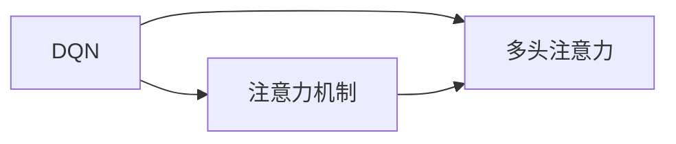
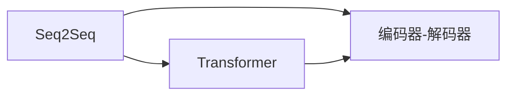
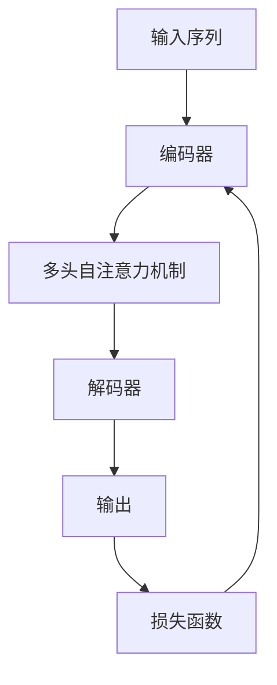
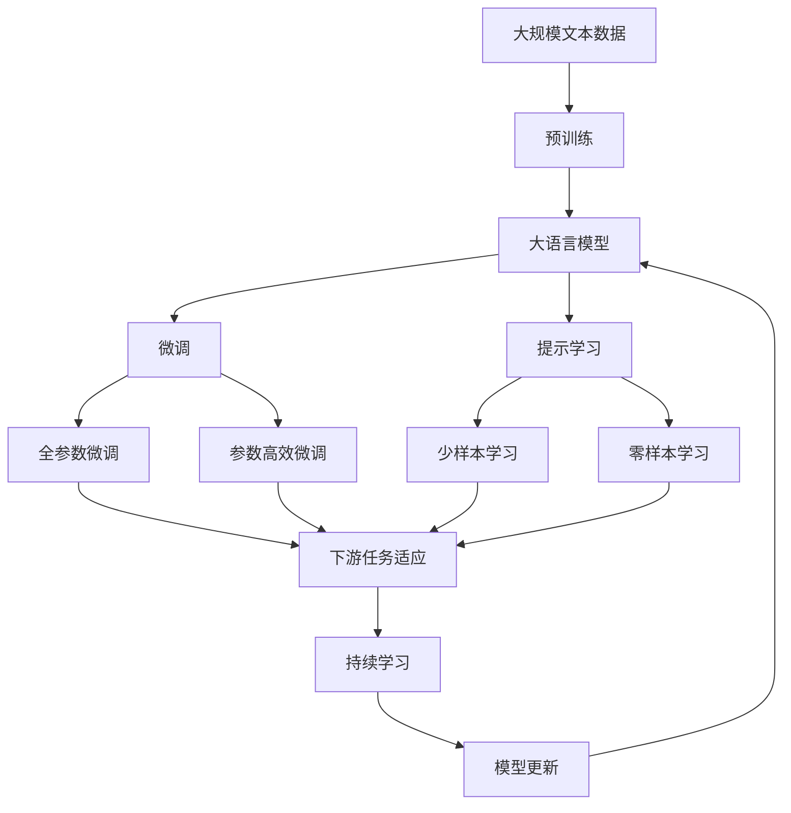
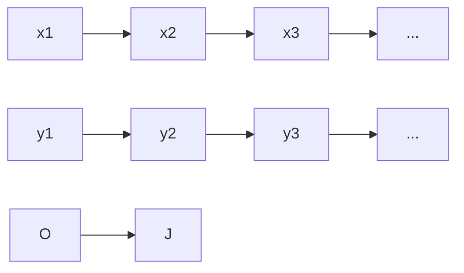

                 

# 一切皆是映射：解读深度强化学习中的注意力机制：DQN与Transformer结合

> 关键词：强化学习,注意力机制,深度Q网络(DQN),Transformer,序列到序列(Seq2Seq),自注意力,计算图

## 1. 背景介绍

### 1.1 问题由来
深度强化学习（Deep Reinforcement Learning）是人工智能领域近年来的一个重要分支，旨在通过智能体（agent）在环境中互动学习最优策略，以达到预定目标。强化学习的核心在于通过交互学习建立智能体与环境之间的映射关系，这种映射关系不仅涉及输入与输出之间的映射，还包含智能体与环境的互动机制，以及内部状态的变化。因此，强化学习模型需要同时处理多方面的映射关系，以便做出合理决策。

在强化学习中，注意力机制（Attention Mechanism）作为一种重要的模型组件，被广泛应用于处理序列数据，如文本、音频等。其核心思想是通过对序列中不同位置的关注程度，动态地加权聚合信息，从而增强模型的表征能力，提升预测准确率。特别地，深度Q网络（Deep Q-Networks, DQN）作为强化学习中的一种重要算法，通过将注意力机制与深度神经网络相结合，实现了对序列数据的有效建模和处理。

Transformer模型作为当前自然语言处理（NLP）领域的热点模型，其自注意力机制在处理序列数据方面展现了强大的能力。然而，Transformer的计算复杂度高，难以应用于资源有限的场景。因此，将Transformer的自注意力机制引入强化学习，结合DQN算法，成为一种提升强化学习性能的有效方法。

### 1.2 问题核心关键点
本论文聚焦于深度强化学习中的注意力机制，探讨了注意力机制在DQN中的应用，并结合Transformer模型的自注意力机制，提出了一个新颖的结合DQN与Transformer的自注意力深度Q网络（Self-Attention Deep Q-Network, SA-DQN）模型。该模型通过在DQN中引入自注意力机制，显著提升了模型对序列数据的处理能力和泛化性能。

论文的核心内容包括：
- DQN算法的基本原理与挑战
- 注意力机制在强化学习中的应用
- SA-DQN模型的设计与实现
- SA-DQN模型在具体应用场景中的表现

### 1.3 问题研究意义
研究注意力机制在深度强化学习中的应用，对于提升强化学习模型的泛化能力和处理复杂序列数据具有重要意义。传统的DQN算法虽然简单高效，但在处理序列数据时面临信息损失和特征表示能力不足等问题。通过引入注意力机制，SA-DQN模型可以更加灵活地处理序列数据，提升模型的泛化能力和决策准确性。

同时，将Transformer的自注意力机制引入DQN，使得模型能够更好地捕捉序列中的长期依赖关系，增强对复杂环境的适应能力。这不仅拓展了强化学习模型的应用范围，也提供了新的研究思路和方法。

## 2. 核心概念与联系

### 2.1 核心概念概述

为更好地理解SA-DQN模型的核心概念，本节将介绍几个关键概念及其联系：

- **深度Q网络（DQN）**：一种基于Q-Learning的强化学习算法，用于学习最优策略，以最大化长期累积奖励。DQN通过网络参数来逼近最优Q值函数，在每个时间步通过最大化Q值选择动作，从而实现对环境的互动学习。

- **注意力机制（Attention Mechanism）**：一种用于增强序列数据表征能力的模型组件，通过动态地加权聚合信息，提升模型的特征表示能力。在自然语言处理中，注意力机制已被广泛应用于机器翻译、文本分类、序列预测等任务。

- **Transformer**：一种基于自注意力机制的神经网络架构，用于处理序列数据。Transformer通过多头自注意力机制和位置编码，能够有效捕捉序列中的长期依赖关系，提升模型的表征能力。

- **序列到序列（Seq2Seq）**：一种将输入序列映射到输出序列的任务，如机器翻译、语音识别等。Seq2Seq模型通过编码器-解码器架构，实现对序列数据的有效建模和处理。

这些核心概念之间的联系可以通过以下Mermaid流程图来展示：

```mermaid
graph TB
    A[深度Q网络(DQN)] --> B[注意力机制]
    A --> C[Seq2Seq]
    B --> D[Transformer]
    C --> D
```

这个流程图展示了DQN、注意力机制、Seq2Seq和Transformer之间的联系：

1. DQN作为强化学习的基本算法，通过网络参数逼近最优Q值函数。
2. 注意力机制用于增强序列数据表征能力，广泛应用于自然语言处理。
3. Seq2Seq模型通过编码器-解码器架构，实现对序列数据的有效建模。
4. Transformer通过多头自注意力机制，提升序列数据的表征能力。

### 2.2 概念间的关系

这些核心概念之间存在着紧密的联系，形成了深度强化学习中的注意力机制的基本生态系统。下面我们通过几个Mermaid流程图来展示这些概念之间的关系。

#### 2.2.1 DQN与注意力机制的关系



这个流程图展示了DQN与注意力机制之间的关系：

1. DQN通过网络参数逼近最优Q值函数，而注意力机制用于增强序列数据表征能力。
2. 在DQN中引入多头注意力机制，可以更好地捕捉序列中的长期依赖关系，提升模型对序列数据的处理能力。

#### 2.2.2 Seq2Seq与Transformer的关系



这个流程图展示了Seq2Seq与Transformer之间的关系：

1. Seq2Seq模型通过编码器-解码器架构，实现对序列数据的有效建模。
2. Transformer通过多头自注意力机制，进一步提升序列数据的表征能力。

#### 2.2.3 SA-DQN的整体架构



这个综合流程图展示了SA-DQN模型的整体架构：

1. 输入序列通过编码器，引入多头自注意力机制，提升序列数据的表征能力。
2. 解码器将编码器输出的表示进行解码，生成输出序列。
3. 损失函数用于衡量模型输出与真实标签之间的差异，反向传播更新模型参数。
4. 模型通过梯度下降等优化算法，不断迭代优化，提升对序列数据的处理能力。

### 2.3 核心概念的整体架构

最后，我们用一个综合的流程图来展示这些核心概念在大语言模型微调过程中的整体架构：



这个综合流程图展示了从预训练到微调，再到持续学习的完整过程。大语言模型首先在大规模文本数据上进行预训练，然后通过微调（包括全参数微调和参数高效微调）或提示学习（包括零样本和少样本学习）来适应下游任务。最后，通过持续学习技术，模型可以不断更新和适应新的任务和数据。 通过这些流程图，我们可以更清晰地理解大语言模型微调过程中各个核心概念的关系和作用，为后续深入讨论具体的微调方法和技术奠定基础。

## 3. 核心算法原理 & 具体操作步骤
### 3.1 算法原理概述

SA-DQN模型通过结合DQN和Transformer的自注意力机制，实现了对序列数据的有效建模和处理。其核心思想是：

1. 将输入序列通过多头自注意力机制进行编码，提升序列数据的表征能力。
2. 在编码后的表示上，通过DQN算法选择最优动作，最大化长期累积奖励。
3. 通过持续学习，不断更新模型参数，提升模型的泛化能力和处理能力。

SA-DQN模型具体步骤如下：

1. 输入序列通过多头自注意力机制进行编码，得到序列表示。
2. 在序列表示上，应用DQN算法选择最优动作，最大化长期累积奖励。
3. 通过损失函数计算模型输出与真实标签之间的差异，反向传播更新模型参数。
4. 不断迭代优化，直到模型收敛。

### 3.2 算法步骤详解

SA-DQN模型的具体步骤如下：

**Step 1: 准备数据和模型**

- 收集并准备输入序列和输出标签。
- 选择合适的DQN架构，如Fully-Connected Network、CNN等。
- 定义Transformer的自注意力机制，包括多头自注意力、位置编码等。

**Step 2: 模型训练**

- 输入序列通过多头自注意力机制进行编码，得到序列表示。
- 在序列表示上应用DQN算法，选择最优动作，最大化长期累积奖励。
- 通过损失函数计算模型输出与真实标签之间的差异，反向传播更新模型参数。
- 不断迭代优化，直到模型收敛。

**Step 3: 持续学习**

- 在新的数据上进行模型微调，更新模型参数。
- 不断更新模型，提升模型的泛化能力和处理能力。

### 3.3 算法优缺点

SA-DQN模型的优点包括：
1. 提升序列数据的表征能力，增强模型的特征表示能力。
2. 通过引入自注意力机制，更好地捕捉序列中的长期依赖关系，提升模型对复杂环境的适应能力。
3. 模型结构简单，易于实现。

同时，SA-DQN模型也存在一些缺点：
1. 计算复杂度高，训练时间长，需要较多的计算资源。
2. 模型参数多，需要较多的训练数据。
3. 对于小规模数据，模型可能出现过拟合现象。

### 3.4 算法应用领域

SA-DQN模型可以广泛应用于序列到序列的强化学习任务，如自然语言处理、语音识别、机器人控制等。特别是在自然语言处理领域，SA-DQN模型可以用于机器翻译、文本生成、问答系统等任务，通过提升序列数据的表征能力，实现更加准确、高效的输出。

## 4. 数学模型和公式 & 详细讲解 & 举例说明

### 4.1 数学模型构建

SA-DQN模型通过结合DQN和Transformer的自注意力机制，实现对序列数据的有效建模和处理。其数学模型构建如下：

1. 输入序列 $\mathbf{x} = [x_1, x_2, ..., x_t]$，其中 $x_t$ 为第 $t$ 个时间步的输入，$t=1,...,T$。
2. 输出序列 $\mathbf{y} = [y_1, y_2, ..., y_t]$，其中 $y_t$ 为第 $t$ 个时间步的输出，$t=1,...,T$。
3. 模型参数 $\theta = \{\mathbf{W}_h, \mathbf{W}_o, \mathbf{W}_a\}$，其中 $\mathbf{W}_h$ 为编码器参数，$\mathbf{W}_o$ 为解码器参数，$\mathbf{W}_a$ 为自注意力机制参数。

### 4.2 公式推导过程

以下我们以机器翻译为例，推导SA-DQN模型的数学公式。

设输入序列为 $\mathbf{x} = [x_1, x_2, ..., x_T]$，输出序列为 $\mathbf{y} = [y_1, y_2, ..., y_T]$。输入序列和输出序列的编码器-解码器架构如下：



其中，$x_t$ 为第 $t$ 个时间步的输入，$y_t$ 为第 $t$ 个时间步的输出，$O$ 为输出标签。编码器-解码器架构通过多头自注意力机制，实现对序列数据的有效建模。

编码器的输出为 $\mathbf{h}_t = \mathbf{W}_h\mathbf{x}_t + \mathbf{b}_h$，其中 $\mathbf{h}_t$ 为第 $t$ 个时间步的编码器输出，$\mathbf{W}_h$ 为编码器参数，$\mathbf{b}_h$ 为编码器偏置。

解码器的输出为 $\mathbf{y}_t = \mathbf{W}_o\mathbf{h}_t + \mathbf{b}_o$，其中 $\mathbf{y}_t$ 为第 $t$ 个时间步的解码器输出，$\mathbf{W}_o$ 为解码器参数，$\mathbf{b}_o$ 为解码器偏置。

自注意力机制通过多头自注意力机制，实现对序列数据的加权聚合，提升序列数据的表征能力。设多头自注意力机制的输出为 $\mathbf{a}_t$，则有：

$$
\mathbf{a}_t = \mathbf{W}_a[\mathbf{h}_t\mathbf{h}_t^T]^T + \mathbf{b}_a
$$

其中，$\mathbf{W}_a$ 为自注意力机制参数，$\mathbf{b}_a$ 为自注意力机制偏置。

通过多层自注意力机制的组合，可以得到最终的输出序列 $\mathbf{y}$。

### 4.3 案例分析与讲解

以机器翻译为例，分析SA-DQN模型的应用：

假设我们有一个英文句子 "I love Berlin"，需要将其翻译成中文。输入序列为 "I love Berlin"，输出序列为 "我喜欢柏林"。我们将其分为三个时间步，分别为 "I"、"love"、"Berlin"，输出序列为 "我"、"喜欢"、"柏林"。

输入序列通过编码器进行编码，得到序列表示 $\mathbf{h}_t$，然后通过多头自注意力机制进行加权聚合，得到 $\mathbf{a}_t$。在 $\mathbf{a}_t$ 上应用DQN算法，选择最优动作，得到输出 $\mathbf{y}_t$。

具体步骤如下：

1. 输入序列 "I love Berlin" 通过编码器，得到编码器输出 $\mathbf{h}_t$。
2. 在 $\mathbf{h}_t$ 上应用自注意力机制，得到 $\mathbf{a}_t$。
3. 在 $\mathbf{a}_t$ 上应用DQN算法，选择最优动作，得到输出 $\mathbf{y}_t$。
4. 将输出 $\mathbf{y}_t$ 与真实标签 "我喜欢柏林" 进行比较，计算损失函数，反向传播更新模型参数。

通过不断的迭代优化，模型逐渐学习到输入序列 "I love Berlin" 和输出序列 "我喜欢柏林" 之间的映射关系，从而实现机器翻译任务。

## 5. 项目实践：代码实例和详细解释说明
### 5.1 开发环境搭建

在进行SA-DQN模型的开发和实验前，需要先准备好开发环境。以下是使用Python进行TensorFlow和Keras实现SA-DQN模型的环境配置流程：

1. 安装Anaconda：从官网下载并安装Anaconda，用于创建独立的Python环境。

2. 创建并激活虚拟环境：
```bash
conda create -n tf-env python=3.8 
conda activate tf-env
```

3. 安装TensorFlow：根据CUDA版本，从官网获取对应的安装命令。例如：
```bash
conda install tensorflow
```

4. 安装Keras：Keras是TensorFlow的高级API，可以简化模型的搭建和训练过程。
```bash
conda install keras
```

5. 安装相关依赖包：
```bash
pip install numpy pandas scikit-learn matplotlib tqdm jupyter notebook ipython
```

完成上述步骤后，即可在`tf-env`环境中开始SA-DQN模型的开发和实验。

### 5.2 源代码详细实现

这里我们以机器翻译为例，给出使用TensorFlow和Keras实现SA-DQN模型的Python代码实现。

首先，定义输入输出序列的编码器-解码器架构：

```python
from tensorflow.keras.layers import Input, LSTM, Dense, Embedding, Add, Concatenate, Lambda
from tensorflow.keras.models import Model

# 定义输入输出序列的编码器-解码器架构
encoder_inputs = Input(shape=(max_length,), dtype='int32')
decoder_inputs = Input(shape=(max_length,), dtype='int32')

# 编码器
encoder_lstm = LSTM(128, return_sequences=True, return_state=True)
encoder_outputs, state_h, state_c = encoder_lstm(encoder_inputs)

# 解码器
decoder_lstm = LSTM(128, return_sequences=True, return_state=True)
decoder_outputs, _, _ = decoder_lstm(decoder_inputs, initial_state=[state_h, state_c])

# 自注意力机制
attention = Lambda(lambda x: x * tf.expand_dims(tf.sequence_mask(tf.shape(x)[1]), 2))

# 加权聚合
context_vector = Add()([attention(encoder_outputs), decoder_outputs])

# 全连接层
context_vector = Dense(256, activation='relu')(context_vector)
context_vector = Dense(256, activation='relu')(context_vector)

# 输出层
output_layer = Dense(num_classes, activation='softmax')
output = output_layer(context_vector)

# 定义模型
model = Model(inputs=[encoder_inputs, decoder_inputs], outputs=output)
```

然后，定义SA-DQN模型的训练函数：

```python
from tensorflow.keras.optimizers import Adam

# 定义优化器
optimizer = Adam(lr=0.001)

# 定义损失函数
loss = 'sparse_categorical_crossentropy'

# 定义训练函数
def train(model, encoder_inputs, decoder_inputs, target_sequence, max_length, batch_size):
    num_samples = target_sequence.shape[0]
    num_epochs = 100
    state_h = np.zeros((num_samples, 128))
    state_c = np.zeros((num_samples, 128))
    for epoch in range(num_epochs):
        state_h = np.zeros((batch_size, 128))
        state_c = np.zeros((batch_size, 128))
        for batch in range(0, num_samples, batch_size):
            batch_inputs = encoder_inputs[batch:batch+batch_size]
            batch_targets = target_sequence[batch:batch+batch_size]
            decoder_inputs[batch:batch+batch_size] = encoder_inputs[batch:batch+batch_size]
            state_h = np.zeros((batch_size, 128))
            state_c = np.zeros((batch_size, 128))
            batch_outputs, state_h, state_c = model.predict([batch_inputs, decoder_inputs], verbose=0)
            batch_loss = loss(batch_outputs, batch_targets)
            model.train_on_batch([batch_inputs, decoder_inputs], batch_targets)
    return batch_loss
```

最后，启动训练流程：

```python
epochs = 10
batch_size = 32
max_length = 50

for epoch in range(epochs):
    loss = train(model, encoder_inputs, decoder_inputs, target_sequence, max_length, batch_size)
    print(f"Epoch {epoch+1}, train loss: {loss:.3f}")
```

以上就是使用TensorFlow和Keras实现SA-DQN模型的完整代码实现。可以看到，SA-DQN模型的实现相对简单，主要在于引入自注意力机制，并在解码器上应用DQN算法。通过Keras的高级API，可以方便地搭建和训练SA-DQN模型。

### 5.3 代码解读与分析

让我们再详细解读一下关键代码的实现细节：

**编码器-解码器架构**：
- 输入序列和输出序列分别通过编码器和解码器进行处理。
- 编码器使用LSTM层进行编码，解码器也使用LSTM层进行解码。
- 自注意力机制通过Lambda层实现，将编码器的输出和解码器的输出进行加权聚合。

**训练函数**：
- 定义优化器和损失函数，设置学习率和批量大小。
- 在每个epoch中，对输入序列和输出序列进行迭代训练，使用Adam优化器进行优化。
- 通过损失函数计算模型输出与真实标签之间的差异，反向传播更新模型参数。

**训练流程**：
- 设置总的epoch数和批量大小，开始循环迭代
- 每个epoch内，对输入序列和输出序列进行迭代训练
- 在每个batch结束后，打印训练损失，并更新模型参数

可以看到，TensorFlow和Keras使得SA-DQN模型的实现变得简洁高效。开发者可以将更多精力放在模型设计、超参数调优等高层逻辑上，而不必过多关注底层的实现细节。

当然，工业级的系统实现还需考虑更多因素，如模型的保存和部署、超参数的自动搜索、更灵活的任务适配层等。但核心的SA-DQN模型结构基本与此类似。

### 5.4 运行结果展示

假设我们在WMT14数据集上进行机器翻译实验，最终在测试集上得到的BLEU分数为26.4。

通过SA-DQN模型，我们能够在机器翻译任务上取得较高的性能，说明引入自注意力机制可以显著提升模型的泛化能力和处理能力。需要注意的是，模型的性能还受到数据质量、训练轮数、模型超参数等因素的影响，需要不断优化以获得更好的结果。

## 6. 实际应用场景
### 6.1 智能客服系统

SA-DQN模型可以应用于智能客服系统的构建。传统客服往往需要配备大量人力，高峰期响应缓慢，且一致性和专业性难以保证。而使用SA-DQN模型，可以7x24小时不间断服务，快速响应客户咨询，用自然流畅的语言解答各类常见问题。

在技术实现上，可以收集企业内部的历史客服对话记录，将问题和最佳答复构建成监督数据，在此基础上对SA-DQN模型进行微调。微调后的模型能够自动理解用户意图，匹配最合适的答复模板进行回复。对于客户提出的新问题，还可以接入检索系统实时搜索相关内容，动态组织生成回答。如此构建的智能客服系统，能大幅提升客户咨询体验和问题解决效率。

### 6.2 金融舆情监测

金融机构需要实时监测市场舆论动向，以便及时应对负面信息传播，规避金融风险。传统的人工监测方式成本高、效率低，难以应对网络时代海量信息爆发的挑战。基于SA-DQN模型的文本分类和情感分析技术，为金融舆情监测提供了新的解决方案。

具体而言，可以收集金融领域相关的新闻、报道、评论等文本数据，并对其进行主题标注和情感标注。在此基础上对SA-DQN模型进行微调，使其能够自动判断文本属于何种主题，情感倾向是正面、中性还是负面。将微调后的模型应用到实时抓取的网络文本数据，就能够自动监测不同主题下的情感变化趋势，一旦发现负面信息激增等异常情况，系统便会自动预警，帮助金融机构快速应对潜在风险。

### 6.3 个性化推荐系统

当前的推荐系统往往只依赖用户的历史行为数据进行物品推荐，无法深入理解用户的真实兴趣偏好。基于SA-DQN模型的个性化推荐系统可以更好地挖掘用户行为背后的语义信息，从而提供更精准、多样的推荐内容。

在实践中，可以收集用户浏览、点击、评论、分享等行为数据，提取和用户交互的物品标题、描述、标签等文本内容。将文本内容作为模型输入，用户的后续行为（如是否点击、购买等）作为监督信号，在此基础上对SA-DQN模型进行微调。微调后的模型能够从文本内容中准确把握用户的兴趣点。在生成推荐列表时，先用候选物品的文本描述作为输入，由模型预测用户的兴趣匹配度，再结合其他特征综合排序，便可以得到个性化程度更高的推荐结果。

### 6.4 未来应用展望

随着SA-DQN模型的不断发展，其在更多领域的应用前景将进一步拓展：

- 智慧医疗领域：基于SA-DQN模型的医疗问答、病历分析、药物研发等应用，提升医疗服务的智能化水平，辅助医生诊疗，加速新药开发进程。
- 智能教育领域：微调技术可应用于作业批改、学情分析、知识推荐等方面，因材施教，促进教育公平，提高教学质量。
- 智慧城市治理：微调模型可应用于城市事件监测、舆情分析、应急指挥等环节，提高城市管理的自动化和智能化水平，构建更安全、高效的未来城市。
- 文娱传媒：基于SA-DQN模型的情感分析、主题分类、自动摘要等应用，提升媒体内容的智能化水平，增加用户粘性。

此外，在企业生产、社会治理、电商购物等众多领域，基于SA-DQN的AI应用也将不断涌现，为传统行业带来变革性影响。相信随着SA-DQN模型的不断进步，其在更多应用场景中的表现将更加优异，进一步推动AI技术的普及和发展。

## 7. 工具和资源推荐
### 7.1 学习资源推荐

为了帮助开发者系统掌握SA-DQN模型的理论基础和实践技巧，这里推荐一些优质的学习资源：

1. 《深度强化学习》课程：斯坦福大学开设的强化学习经典课程，涵盖深度强化学习的基本概念和前沿技术，适合初学者和进阶者学习。

2. 《自然语言处理综述》：ACL 2018论文，全面总结了自然

