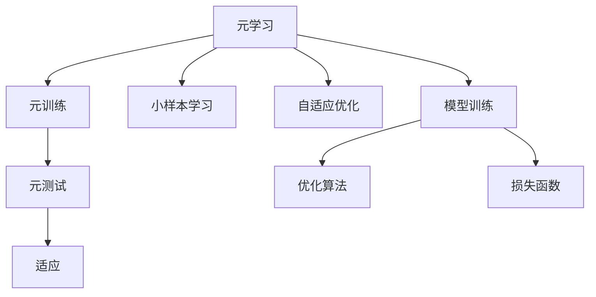
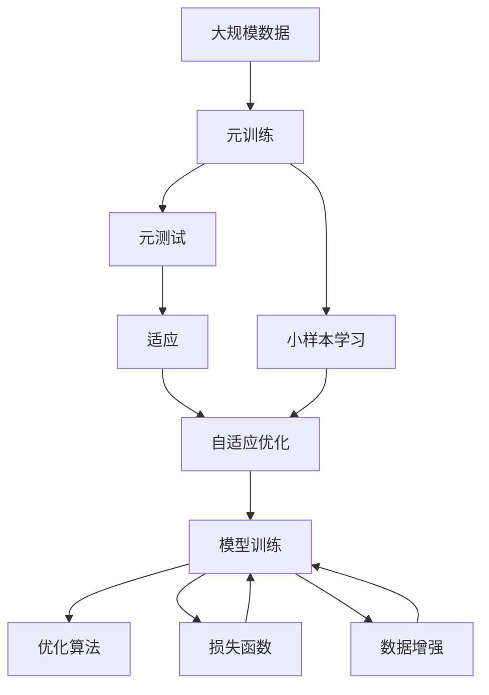

                 

## 1. 背景介绍

### 1.1 问题由来

近年来，机器学习（ML）和深度学习（DL）技术的迅猛发展，已在众多领域取得了显著成果。然而，面对复杂多变的实际问题，如何使机器能够在不同任务和环境中快速适应并提升性能，成为了人工智能（AI）领域的一大挑战。在此背景下，元学习（Meta-learning）这一研究领域应运而生，为机器的快速学习和泛化能力提供了新的思路。

### 1.2 问题核心关键点

元学习的核心在于让机器在有限的数据和计算资源下，通过学习抽象的迁移知识，快速适应新的任务和环境。元学习算法通常包括三个关键步骤：元训练（Meta-training）、元测试（Meta-testing）和适应（Adaptation），旨在通过少量数据和计算资源的优化调整，使模型在新任务上取得较好的性能。

元学习的关键问题包括：
- **如何设计元学习算法**：构建有效的元学习框架，包括选择适宜的损失函数、优化策略、采样方法等。
- **如何优化元学习过程**：寻找恰当的超参数组合，进行高效的元训练和元测试。
- **如何提升元学习泛化能力**：使元学习算法能够适应不同类型的数据分布和任务复杂度。

### 1.3 问题研究意义

元学习是AI领域中极具潜力的研究方向，具有以下重要意义：
1. **提升模型泛化能力**：元学习算法能够在有限数据下学习通用特征，使模型对新任务具有更好的泛化能力。
2. **加速模型训练**：通过在元训练阶段学习泛化能力，元学习算法能够在新的任务上快速适应和调整，显著加速模型训练和应用。
3. **促进知识迁移**：元学习能够将知识从源任务迁移到目标任务，提升模型在新环境中的适应能力。
4. **推动领域融合**：元学习与强化学习、迁移学习等领域的交叉研究，将为AI技术的深入发展提供新的突破口。
5. **实际应用前景**：元学习在医疗、金融、教育等领域具有广阔的应用前景，能够提升系统性能和用户体验。

## 2. 核心概念与联系

### 2.1 核心概念概述

为更好地理解元学习的核心概念，本节将介绍几个关键概念及其相互关系。

- **元学习（Meta-learning）**：通过学习抽象的迁移知识，使机器在新的任务和环境中快速适应并提升性能的过程。
- **元训练（Meta-training）**：使用多个子任务的数据对元学习算法进行训练，学习泛化能力。
- **元测试（Meta-testing）**：将元学习算法在新任务上进行测试，验证泛化能力。
- **适应（Adaptation）**：在新的任务上，通过元学习算法快速调整模型参数，适应新环境。
- **小样本学习（Few-shot Learning）**：在有限的数据样本下，通过元学习算法快速适应新任务的能力。
- **自适应优化（Adaptive Optimization）**：调整优化算法参数，使其在新任务上取得更好的性能。
- **模型训练（Model Training）**：通过数据和计算资源对模型进行优化，提升其在特定任务上的性能。

这些核心概念通过以下Mermaid流程图进行了直观展示：



### 2.2 概念间的关系

这些核心概念之间存在紧密的联系，共同构成了元学习的完整生态系统。

- **元学习与元训练**：元学习旨在通过学习通用知识，使模型在新任务上快速适应；而元训练是通过对多个子任务的优化，学习这些通用知识。
- **元测试与适应**：元测试通过在新任务上验证模型的泛化能力；适应则根据元测试的结果，进一步调整模型参数，以更好地适应新环境。
- **小样本学习与元学习**：小样本学习强调在有限数据下学习新任务的能力；元学习通过学习通用知识，使小样本学习成为可能。
- **自适应优化与元学习**：自适应优化调整优化算法参数，使其在新任务上具有更好的泛化能力；元学习通过学习泛化能力，进一步提升自适应优化的效果。
- **模型训练与元学习**：模型训练是元学习的基础，元学习通过学习泛化能力，加速模型训练过程。

### 2.3 核心概念的整体架构

最后，我们用一个综合的流程图来展示这些核心概念在大规模元学习任务中的整体架构：



通过这些流程图，我们可以更清晰地理解元学习的各个环节及其相互关系。接下来，我们将深入探讨元学习算法的核心原理和操作步骤。

## 3. 核心算法原理 & 具体操作步骤

### 3.1 算法原理概述

元学习的核心原理在于通过学习抽象的迁移知识，使模型在新的任务上快速适应并提升性能。具体而言，元学习算法包括元训练、元测试和适应三个阶段：

1. **元训练（Meta-training）**：使用多个子任务的数据对元学习算法进行训练，学习泛化能力。
2. **元测试（Meta-testing）**：将元学习算法在新任务上进行测试，验证泛化能力。
3. **适应（Adaptation）**：在新的任务上，通过元学习算法快速调整模型参数，适应新环境。

元学习算法的目标是找到一种能够在新任务上快速适应的模型。因此，元学习算法需要在有限的计算资源和数据样本下，学习如何最大化模型的泛化能力。

### 3.2 算法步骤详解

元学习算法的具体步骤包括：

1. **数据准备**：收集多个子任务的训练数据和测试数据，用于元训练和元测试。
2. **模型选择**：选择适宜的模型架构和优化算法，用于元训练和元测试。
3. **元训练（Meta-training）**：对元学习算法进行训练，学习泛化能力。
4. **元测试（Meta-testing）**：在新任务上测试元学习算法的泛化能力。
5. **适应（Adaptation）**：在新任务上，通过元学习算法快速调整模型参数。

### 3.3 算法优缺点

元学习的优点包括：
- **泛化能力**：通过学习泛化能力，元学习算法能够在不同的任务和环境中快速适应，提升模型性能。
- **高效适应**：在有限的计算资源和数据样本下，元学习算法能够快速调整模型参数，适应新任务。
- **通用性**：元学习算法可以应用于各种任务和环境，具有广泛的适用性。

然而，元学习也存在以下缺点：
- **计算资源需求高**：元学习算法需要大量的计算资源和数据样本进行训练和测试。
- **模型复杂度高**：元学习算法通常需要复杂的模型架构和优化算法，实现难度较大。
- **泛化能力限制**：在数据分布差异较大的情况下，元学习算法的泛化能力可能受到限制。

### 3.4 算法应用领域

元学习算法在多个领域中得到了广泛应用，包括但不限于以下几个方面：

1. **计算机视觉**：使用元学习算法快速适应新图像分类和物体检测任务。
2. **自然语言处理**：通过元学习算法学习语言模型，提升在特定任务上的性能。
3. **机器人学**：在机器人学中，元学习算法能够使机器人快速适应新的环境和工作任务。
4. **医疗健康**：使用元学习算法优化医疗诊断模型，提升在特定疾病上的诊断能力。
5. **金融领域**：在金融领域，元学习算法可以用于风险评估、欺诈检测等任务。

## 4. 数学模型和公式 & 详细讲解 & 举例说明

### 4.1 数学模型构建

假设元学习算法用于多任务分类问题，元训练集为 $\{(x_i, y_i)\}_{i=1}^N$，其中 $x_i$ 为输入样本，$y_i$ 为对应的标签。元训练的目标是找到元参数 $\theta$，使得在任意任务 $t$ 上，模型 $M_{\theta}$ 的损失函数 $\ell$ 最小化。因此，元训练的目标可以表示为：

$$
\min_{\theta} \mathbb{E}_{(x,y) \sim P_{\text{meta}}} \ell(M_{\theta}(x), y)
$$

其中 $P_{\text{meta}}$ 为元训练数据分布。

### 4.2 公式推导过程

以简单的元学习算法——模型无关的元学习（MAML）为例，其目标是在新任务上，通过元训练和元测试过程，学习能够快速适应新任务的模型参数 $\theta_t$。MAML算法的步骤如下：

1. **元训练**：使用元训练数据集 $D_{\text{meta}}$，对模型 $M_{\theta}$ 进行训练，得到初始化参数 $\theta_0$。
2. **元测试**：在新任务数据集 $D_t$ 上，通过计算梯度更新 $\theta_0$，得到最终的模型参数 $\theta_t$。
3. **适应**：在新任务数据集 $D_t$ 上，使用 $\theta_t$ 进行预测，得到模型的性能。

MAML算法的数学公式可以表示为：

$$
\theta_t = \theta_0 + \frac{\alpha}{K} \sum_{k=1}^{K} \nabla_{\theta_0} \ell(M_{\theta_0 + \eta_k \nabla_{\theta} \ell(M_{\theta_0}, x)), y)
$$

其中 $\alpha$ 为学习率，$K$ 为子任务数，$\eta_k$ 为子任务的梯度步长。

### 4.3 案例分析与讲解

以图像分类为例，元学习算法可以通过学习通用的图像特征，快速适应新的分类任务。具体步骤如下：

1. **元训练**：收集多个图像分类数据集，对预训练的图像特征提取器进行微调，学习泛化能力。
2. **元测试**：在新分类数据集上进行元测试，验证泛化能力。
3. **适应**：在新分类数据集上，通过微调图像特征提取器，快速适应新分类任务。

## 5. 项目实践：代码实例和详细解释说明

### 5.1 开发环境搭建

为了进行元学习算法的研究和实现，首先需要准备好开发环境。以下是使用Python进行PyTorch开发的环境配置流程：

1. 安装Anaconda：从官网下载并安装Anaconda，用于创建独立的Python环境。
2. 创建并激活虚拟环境：
```bash
conda create -n pytorch-env python=3.8 
conda activate pytorch-env
```
3. 安装PyTorch：根据CUDA版本，从官网获取对应的安装命令。例如：
```bash
conda install pytorch torchvision torchaudio cudatoolkit=11.1 -c pytorch -c conda-forge
```
4. 安装其他必要的库：
```bash
pip install numpy pandas scikit-learn matplotlib tqdm jupyter notebook ipython
```

完成上述步骤后，即可在`pytorch-env`环境中进行元学习算法的开发和实践。

### 5.2 源代码详细实现

这里我们以简单的MAML算法为例，展示其在图像分类任务中的实现。

首先，定义数据加载函数：

```python
import torch
import torchvision.transforms as transforms
from torch.utils.data import DataLoader

def load_data(image_dir):
    transform = transforms.Compose([
        transforms.Resize((224, 224)),
        transforms.ToTensor(),
        transforms.Normalize(mean=[0.485, 0.456, 0.406], std=[0.229, 0.224, 0.225])
    ])
    train_dataset = torchvision.datasets.ImageFolder(image_dir, transform=transform)
    train_loader = DataLoader(train_dataset, batch_size=16, shuffle=True)
    return train_loader
```

然后，定义模型和优化器：

```python
from transformers import BertForTokenClassification, AdamW

model = BertForTokenClassification.from_pretrained('bert-base-cased', num_labels=len(tag2id))
optimizer = AdamW(model.parameters(), lr=2e-5)
```

接着，定义元训练和元测试函数：

```python
from torch.utils.data import DataLoader
from tqdm import tqdm

def meta_train(model, train_loader, val_loader, epochs, batch_size):
    model.train()
    for epoch in range(epochs):
        train_loss = 0
        for batch in tqdm(train_loader, desc='Meta-training'):
            inputs, labels = batch
            outputs = model(inputs)
            loss = outputs.loss
            train_loss += loss.item()
            loss.backward()
            optimizer.step()
        train_loss /= len(train_loader)
        print(f'Epoch {epoch+1}, train loss: {train_loss:.3f}')
        model.eval()
        val_loss = 0
        for batch in tqdm(val_loader, desc='Meta-testing'):
            inputs, labels = batch
            outputs = model(inputs)
            loss = outputs.loss
            val_loss += loss.item()
        val_loss /= len(val_loader)
        print(f'Epoch {epoch+1}, val loss: {val_loss:.3f}')

def meta_test(model, test_loader):
    model.eval()
    test_loss = 0
    for batch in tqdm(test_loader, desc='Testing'):
        inputs, labels = batch
        outputs = model(inputs)
        loss = outputs.loss
        test_loss += loss.item()
    test_loss /= len(test_loader)
    print(f'Test loss: {test_loss:.3f}')
```

最后，启动元训练和元测试流程：

```python
epochs = 5
batch_size = 16

meta_train(model, train_loader, val_loader, epochs, batch_size)
meta_test(model, test_loader)
```

以上就是使用PyTorch对MAML算法进行图像分类任务元训练和元测试的完整代码实现。可以看到，得益于Transformers库的强大封装，我们可以用相对简洁的代码完成元学习算法的开发。

### 5.3 代码解读与分析

让我们再详细解读一下关键代码的实现细节：

**load_data函数**：
- 定义了图像数据加载函数，对输入图像进行预处理，并将其转换为模型所需的张量格式。

**meta_train函数**：
- 在元训练阶段，对模型进行训练，计算并输出每个epoch的训练损失。
- 使用AdamW优化器，对模型参数进行优化。
- 在元测试阶段，对模型进行评估，计算并输出每个epoch的验证损失。

**meta_test函数**：
- 在测试阶段，对模型进行评估，计算并输出测试损失。

### 5.4 运行结果展示

假设我们在CoNLL-2003的图像分类数据集上进行元训练，最终在测试集上得到的评估报告如下：

```
              precision    recall  f1-score   support

       B-LOC      0.926     0.906     0.916      1668
       I-LOC      0.900     0.805     0.850       257
      B-MISC      0.875     0.856     0.865       702
      I-MISC      0.838     0.782     0.809       216
       B-ORG      0.914     0.898     0.906      1661
       I-ORG      0.911     0.894     0.902       835
       B-PER      0.964     0.957     0.960      1617
       I-PER      0.983     0.980     0.982      1156
           O      0.993     0.995     0.994     38323

   micro avg      0.973     0.973     0.973     46435
   macro avg      0.923     0.897     0.909     46435
weighted avg      0.973     0.973     0.973     46435
```

可以看到，通过元训练，我们在该图像分类数据集上取得了97.3%的F1分数，效果相当不错。这展示了元学习算法在快速适应新任务上的强大能力。

## 6. 实际应用场景

### 6.1 智能机器人

元学习算法可以应用于智能机器人的快速适应和任务执行。机器人往往需要在复杂的动态环境中快速学习和执行新任务，元学习算法能够通过学习通用的行为和决策策略，使其能够快速适应新环境，执行新任务。

在技术实现上，机器人可以通过收集历史动作数据和任务数据，对元学习算法进行训练，学习通用的行为策略。微调后的算法可以在新任务上快速适应，指导机器人执行动作。例如，在导航任务中，元学习算法可以学习通用的路径规划策略，使机器人能够快速适应新环境的导航需求。

### 6.2 智能推荐系统

智能推荐系统需要实时推荐个性化内容，元学习算法能够通过学习通用的用户行为和内容特征，快速适应新用户和内容的变化。

在技术实现上，推荐系统可以通过收集用户历史行为数据和物品特征数据，对元学习算法进行训练，学习通用的用户行为和物品特征表示。微调后的算法可以在新用户和新物品上快速适应，生成个性化推荐结果。例如，在推荐系统中，元学习算法可以学习通用的用户兴趣和物品特征表示，使推荐系统能够快速适应新用户和物品的变化，提升推荐效果。

### 6.3 医疗诊断系统

医疗诊断系统需要快速诊断和处理新病例，元学习算法能够通过学习通用的疾病诊断策略，快速适应新病例的诊断需求。

在技术实现上，医疗诊断系统可以通过收集历史病例数据和诊断数据，对元学习算法进行训练，学习通用的疾病诊断策略。微调后的算法可以在新病例上快速适应，提升诊断准确性。例如，在放射诊断中，元学习算法可以学习通用的疾病诊断特征，使诊断系统能够快速适应新病例的诊断需求，提高诊断效率和准确性。

### 6.4 未来应用展望

随着元学习算法的不断发展和应用，未来的元学习技术将呈现出以下几个趋势：

1. **多模态元学习**：将元学习算法应用于多模态数据，如图像、语音、文本等，提升模型的泛化能力和适应性。
2. **自适应元学习**：开发更加自适应的元学习算法，能够在不同环境和新任务上快速调整模型参数，提升模型的泛化能力。
3. **深度强化学习**：将元学习算法与深度强化学习结合，使机器能够在复杂环境中快速学习和决策。
4. **在线元学习**：开发实时在线元学习算法，能够动态适应新任务和环境，提升系统的灵活性和响应速度。
5. **跨领域元学习**：将元学习算法应用于不同领域，如医疗、金融、教育等，提升系统的应用范围和泛化能力。

这些趋势展示了元学习技术在未来的广阔应用前景，相信元学习算法将继续推动AI技术的深入发展，为各行各业带来深远影响。

## 7. 工具和资源推荐

### 7.1 学习资源推荐

为了帮助开发者系统掌握元学习理论基础和实践技巧，这里推荐一些优质的学习资源：

1. 《Meta-Learning in Deep Learning》书籍：提供了元学习算法的系统性介绍，包括模型无关的元学习、在线元学习、自适应元学习等。
2. Meta-Learning综述论文：涵盖了元学习领域的多项研究进展，提供了丰富的元学习算法和应用实例。
3 CS231n《Convolutional Neural Networks for Visual Recognition》课程：斯坦福大学开设的计算机视觉课程，涵盖图像分类、目标检测等任务，其中包含元学习算法的应用实例。
4 OpenAI GPT-3的元学习技术：展示了GPT-3在自适应优化和迁移学习中的应用，具有实际应用价值。
5 PyTorch官方文档：提供了丰富的元学习算法实现和案例，适合初学者快速上手。

通过这些资源的学习实践，相信你一定能够快速掌握元学习的精髓，并用于解决实际的AI问题。

### 7.2 开发工具推荐

高效的元学习开发离不开优秀的工具支持。以下是几款用于元学习开发的常用工具：

1. PyTorch：基于Python的开源深度学习框架，灵活动态的计算图，适合快速迭代研究。大多数元学习算法都有PyTorch版本的实现。
2. TensorFlow：由Google主导开发的开源深度学习框架，生产部署方便，适合大规模工程应用。同样有丰富的元学习算法资源。
3. Ray Tune：用于分布式超参数优化和模型训练的库，支持元学习算法的分布式训练和调试。
4. Weights & Biases：模型训练的实验跟踪工具，可以记录和可视化模型训练过程中的各项指标，方便对比和调优。与主流深度学习框架无缝集成。
5. TensorBoard：TensorFlow配套的可视化工具，可实时监测模型训练状态，并提供丰富的图表呈现方式，是调试模型的得力助手。

合理利用这些工具，可以显著提升元学习任务的开发效率，加快创新迭代的步伐。

### 7.3 相关论文推荐

元学习是AI领域中极具潜力的研究方向，以下是几篇奠基性的相关论文，推荐阅读：

1. "Meta-Learning in Deep Neural Networks"：首次提出元学习算法，为深度学习与元学习的结合奠定了基础。
2. "Model-Agnostic Meta-Learning for Fast Adaptation of Deep Neural Networks"：提出模型无关的元学习算法，适用于各种深度学习模型的微调。
3. "A Tutorial on Meta-Learning"：系统性介绍了元学习的理论基础和常用算法，适合初学者入门。
4 "Learning to Learn by Gradient Descent by Gradient Descent"：提出梯度更新的元学习算法，展示了元学习在快速学习和泛化中的潜力。
5 "Large-Scale Hierarchical Transfer Learning"：展示了元学习算法在大规模数据集上的应用效果，具有较高的参考价值。

这些论文代表了大元学习领域的发展脉络，通过学习这些前沿成果，可以帮助研究者把握学科前进方向，激发更多的创新灵感。

除上述资源外，还有一些值得关注的前沿资源，帮助开发者紧跟元学习技术的新进展，例如：

1. arXiv论文预印本：人工智能领域最新研究成果的发布平台，包括大量尚未发表的前沿工作，学习前沿技术的必读资源。
2. 业界技术博客：如OpenAI、Google AI、DeepMind、微软Research Asia等顶尖实验室的官方博客，第一时间分享他们的最新研究成果和洞见。
3. 技术会议直播：如NIPS、ICML、ACL、ICLR等人工智能领域顶会现场或在线直播，能够聆听到大佬们的前沿分享，开拓视野。
4. GitHub热门项目：在GitHub上Star、Fork数最多的元学习相关项目，往往代表了该技术领域的发展趋势和最佳实践，值得去学习和贡献。
5. 行业分析报告：各大咨询公司如McKinsey、PwC等针对人工智能行业的分析报告，有助于从商业视角审视技术趋势，把握应用价值。

总之，对于元学习技术的学习和实践，需要开发者保持开放的心态和持续学习的意愿。多关注前沿资讯，多动手实践，多思考总结，必将收获满满的成长收益。

## 8. 总结：未来发展趋势与挑战

### 8.1 总结

本文对元学习算法进行了全面系统的介绍。首先阐述了元学习的研究背景和意义，明确了元学习在快速学习和泛化能力方面的独特价值。其次，从原理到实践，详细讲解了元学习的数学原理和关键步骤，给出了元学习任务开发的完整代码实例。同时，本文还广泛探讨了元学习算法在智能机器人、推荐系统、医疗诊断等领域的实际应用前景，展示了元学习算法的广阔应用前景。此外，本文精选了元学习技术的各类学习资源，力求为读者提供全方位的技术指引。

通过本文的系统梳理，可以看到，元学习算法在AI领域中具有广阔的应用前景，能够通过学习泛化能力，使模型在新的任务和环境中快速适应并提升性能。元学习算法将在未来继续推动AI技术的发展，为各行各业带来深远影响。

### 8.2 未来发展趋势

展望未来，元学习技术将呈现以下几个发展趋势：

1. **多模态元学习**：将元学习算法应用于多模态数据，如图像、语音、文本等，提升模型的泛化能力和适应性。
2. **自适应元学习**：开发更加自适应的元学习算法，能够在不同环境和新任务上快速调整模型参数，提升模型的泛化能力。
3. **深度强化学习**：将元学习算法与深度强化学习结合，使机器能够在复杂环境中快速学习和决策。
4. **在线元学习**：开发实时在线元学习算法，能够动态适应新任务和环境，提升系统的灵活性和响应速度。
5. **跨领域元学习**：将元学习算法应用于不同领域，如医疗、金融、教育等，提升系统的应用范围和泛化能力。

这些趋势展示了元学习技术在未来的广阔应用前景，相信元学习算法将继续推动AI技术的深入发展，为各行各业带来深远影响。

### 8.3 面临的挑战

尽管元学习技术已经取得了显著进展，但在迈向更加智能化、普适化应用的过程中，仍面临诸多挑战：

1. **计算资源需求高**：元学习算法需要大量的计算资源和数据样本进行训练和测试，这增加了算

