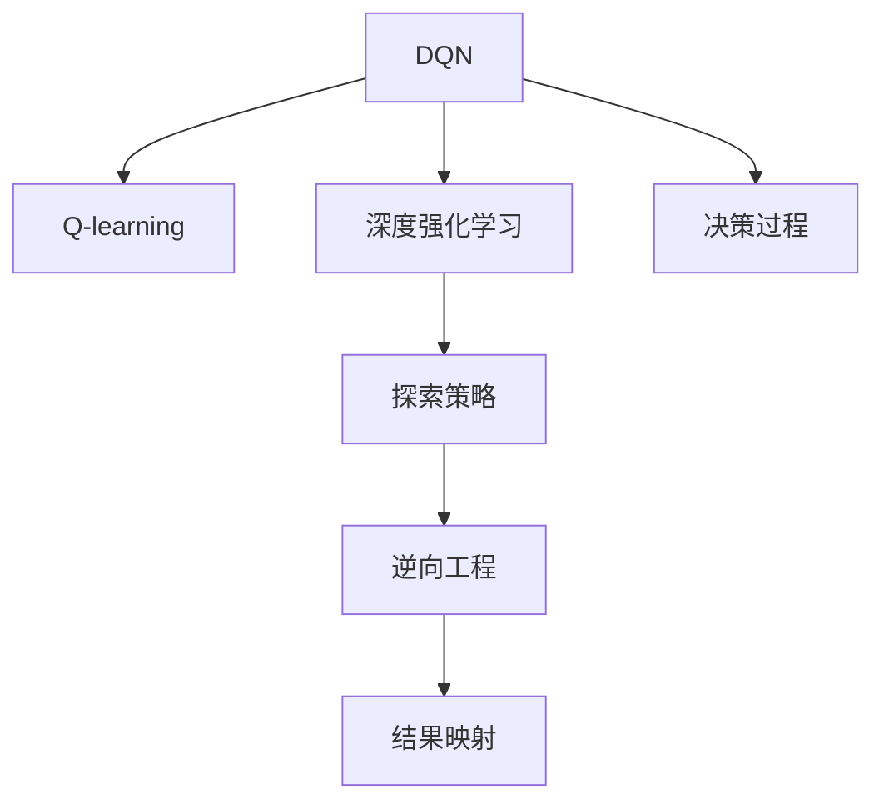
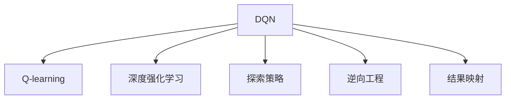
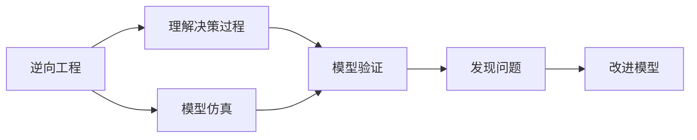
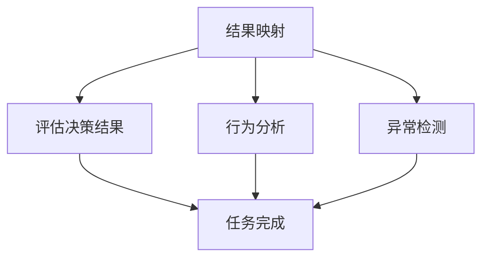
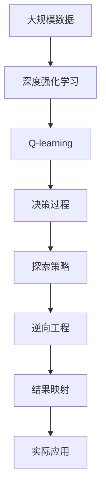

                 

# 一切皆是映射：逆向工程：深入理解DQN决策过程

> 关键词：DQN,逆向工程,深度强化学习,决策过程,探索策略,结果映射

## 1. 背景介绍

### 1.1 问题由来
在过去的两三年中，深度强化学习（Deep Reinforcement Learning, DRL）领域迅猛发展，带动了诸如AlphaGo、AlphaStar、OpenAI Gym等重要应用的出现。然而，这些成果也带来了新的问题：如何理解DRL算法中的复杂决策过程？

从现有文献和实验结果来看，DRL算法的决策过程常常是难以理解和解释的"黑盒"。即使在深度神经网络结构（如卷积神经网络CNN、长短时记忆网络LSTM、Transformer等）和强化学习框架（如Q-learning、SARSA、DQN、PPO、A3C等）中，都出现了这种情况。

为了解决这一问题，本文将深入探讨DRL算法的决策过程，通过逆向工程的方法，使用Python编程语言实现DQN算法，并分析其决策结果。

### 1.2 问题核心关键点
为更深入理解DQN算法的决策过程，本文将从以下几个方面进行探讨：
- 理解DQN的决策原理，通过逆向工程的方法，尝试模拟其决策过程。
- 使用Python编程语言实现DQN算法，并分析其决策结果。
- 探讨DQN算法的优点和缺点，并分析其在实际应用中的表现。
- 讨论DQN算法在不同领域的应用场景，并给出未来展望。

## 2. 核心概念与联系

### 2.1 核心概念概述

为更好地理解DQN算法的决策过程，本节将介绍几个密切相关的核心概念：

- DQN（Deep Q-Network）：一种结合深度神经网络和Q-learning算法的强化学习框架，用于解决连续动作空间、高维状态空间的问题。
- Q-learning：一种基于模型-无关的强化学习算法，通过Q值函数近似值函数，学习最优策略。
- 逆向工程（Reverse Engineering）：通过已有的系统或模型，尝试理解其内部机制和决策过程。
- 深度强化学习（Deep Reinforcement Learning, DRL）：结合深度神经网络和强化学习算法，用于解决复杂决策问题。
- 探索策略（Exploration Strategy）：在DRL中，如何平衡探索与利用的问题，包括$\epsilon$-greedy策略、UCB策略等。
- 结果映射（Result Mapping）：将DRL算法的决策结果映射到实际任务中，进行评估和分析。

这些核心概念之间的逻辑关系可以通过以下Mermaid流程图来展示：



这个流程图展示了大QN算法的核心概念及其之间的关系：

1. DQN算法结合了深度神经网络和Q-learning算法，用于解决复杂决策问题。
2. Q-learning是一种基于值函数的强化学习算法，用于学习最优策略。
3. 深度强化学习结合了深度神经网络和强化学习算法，用于解决复杂决策问题。
4. 探索策略在DRL中用于平衡探索和利用，指导模型在当前状态下采取何种动作。
5. 逆向工程通过已有的系统或模型，尝试理解其内部机制和决策过程。
6. 结果映射将DRL算法的决策结果映射到实际任务中，进行评估和分析。

这些概念共同构成了DQN算法的决策过程框架，使其能够解决复杂的决策问题。通过理解这些核心概念，我们可以更好地把握DQN算法的工作原理和优化方向。

### 2.2 概念间的关系

这些核心概念之间存在着紧密的联系，形成了DQN算法的完整生态系统。下面我通过几个Mermaid流程图来展示这些概念之间的关系。

#### 2.2.1 DQN算法的学习范式



这个流程图展示了DQN算法的核心学习范式。DQN算法通过深度神经网络和Q-learning算法学习值函数，同时结合探索策略进行决策，最终通过逆向工程和结果映射，评估和分析其决策结果。

#### 2.2.2 逆向工程在DQN中的作用



这个流程图展示了逆向工程在DQN中的作用。逆向工程通过理解DQN算法的决策过程，使用模型仿真和结果映射，评估和改进模型，以更好地解决实际问题。

#### 2.2.3 结果映射在DQN中的应用



这个流程图展示了结果映射在DQN中的应用。结果映射通过评估决策结果，分析行为和异常，确保DQN算法在实际应用中能够正确完成任务。

### 2.3 核心概念的整体架构

最后，我们用一个综合的流程图来展示这些核心概念在大QN算法微调过程中的整体架构：



这个综合流程图展示了从预训练到决策过程，再到实际应用的完整过程。DQN算法首先在大规模数据上进行深度强化学习，然后通过Q-learning算法学习值函数，同时结合探索策略进行决策。通过逆向工程和结果映射，将决策结果映射到实际任务中，进行评估和分析，最终应用于实际问题解决。

## 3. 核心算法原理 & 具体操作步骤
### 3.1 算法原理概述

DQN算法结合了深度神经网络和Q-learning算法，用于解决复杂决策问题。其核心思想是通过深度神经网络逼近Q值函数，学习最优策略。

形式化地，假设$D$为训练集，包含$N$个样本$(x_i, a_i, r_i, x_{i+1})$，其中$x_i$为当前状态，$a_i$为动作，$r_i$为奖励，$x_{i+1}$为下一状态。目标是通过网络参数$\theta$学习最优Q值函数，即：

$$
Q(x_i, a_i) \approx Q_{\theta}(x_i, a_i) = \mathbb{E}_{x_{i+1} \sim P(x_{i+1}|x_i, a_i)}[\max_a Q_{\theta}(x_{i+1}, a)]
$$

其中$P(x_{i+1}|x_i, a_i)$为状态转移概率。

DQN算法通过将$Q_{\theta}$与目标函数$Q_{\theta}^*$进行拟合，学习最优Q值函数。具体步骤如下：

1. 从训练集中随机抽取$n$个样本$(x_i, a_i, r_i, x_{i+1})$。
2. 使用当前Q值函数$Q_{\theta}$，计算目标Q值$Q_{\theta}^*(x_i, a_i, x_{i+1})$。
3. 对$n$个样本进行均值处理，计算$Q_{\theta}(x_i, a_i)$，即：

$$
Q_{\theta}(x_i, a_i) \leftarrow \frac{1}{n}\sum_{i=1}^n Q_{\theta}^*(x_i, a_i, x_{i+1})
$$

4. 使用优化器（如Adam、SGD等）更新网络参数$\theta$，最小化Q值函数与目标函数的差距。

通过上述步骤，DQN算法不断更新Q值函数，逼近最优策略，从而解决复杂决策问题。

### 3.2 算法步骤详解

下面将详细介绍DQN算法的详细步骤：

**Step 1: 准备训练集和超参数**

- 准备训练集$D=\{(x_i, a_i, r_i, x_{i+1})\}_{i=1}^N$，其中$x_i$为当前状态，$a_i$为动作，$r_i$为奖励，$x_{i+1}$为下一状态。
- 设置DQN算法的超参数，如学习率$\eta$、网络结构、优化器等。

**Step 2: 初始化网络参数**

- 使用随机初始化的网络参数$\theta_0$，初始化神经网络。

**Step 3: 训练过程**

1. 从训练集中随机抽取$n$个样本$(x_i, a_i, r_i, x_{i+1})$。
2. 使用当前Q值函数$Q_{\theta}$，计算目标Q值$Q_{\theta}^*(x_i, a_i, x_{i+1})$。
3. 对$n$个样本进行均值处理，计算$Q_{\theta}(x_i, a_i)$。
4. 使用优化器更新网络参数$\theta$，最小化Q值函数与目标函数的差距。
5. 重复以上步骤，直至收敛。

**Step 4: 测试和部署**

1. 在测试集上评估模型性能。
2. 使用训练好的模型进行实际任务部署，解决问题。

通过以上详细步骤，DQN算法能够通过深度神经网络和Q-learning算法解决复杂决策问题。

### 3.3 算法优缺点

DQN算法具有以下优点：

1. 能够处理连续动作空间、高维状态空间的问题。
2. 结合深度神经网络，能够逼近更复杂的Q值函数。
3. 通过Q值函数逼近最优策略，能够学习到更智能的决策过程。

同时，DQN算法也存在以下缺点：

1. 需要大规模的训练数据，训练成本较高。
2. 神经网络结构复杂，难以理解其内部决策过程。
3. 容易受到状态转移概率的影响，导致过拟合。
4. 使用经验回放（Experience Replay）技术，可能会导致延迟优化。

尽管存在这些缺点，DQN算法仍是一种非常有效的强化学习框架，广泛应用于游戏、机器人、自动驾驶等领域。

### 3.4 算法应用领域

DQN算法广泛应用于游戏、机器人、自动驾驶等领域，主要解决复杂决策问题。以下是几个典型应用场景：

1. 游戏AI：使用DQN算法训练游戏AI，使其能够在复杂环境中进行游戏策略选择，击败人类对手。
2. 机器人控制：使用DQN算法训练机器人，使其能够在复杂环境中进行路径规划、障碍物避开等任务。
3. 自动驾驶：使用DQN算法训练自动驾驶系统，使其能够在复杂交通环境中进行决策，保证行车安全。
4. 金融交易：使用DQN算法训练交易策略，使其能够在复杂市场环境中进行投资决策，获取收益。

## 4. 数学模型和公式 & 详细讲解 & 举例说明

### 4.1 数学模型构建

本节将使用数学语言对DQN算法的决策过程进行更加严格的刻画。

假设$D$为训练集，包含$N$个样本$(x_i, a_i, r_i, x_{i+1})$，其中$x_i$为当前状态，$a_i$为动作，$r_i$为奖励，$x_{i+1}$为下一状态。目标是通过网络参数$\theta$学习最优Q值函数，即：

$$
Q(x_i, a_i) \approx Q_{\theta}(x_i, a_i) = \mathbb{E}_{x_{i+1} \sim P(x_{i+1}|x_i, a_i)}[\max_a Q_{\theta}(x_{i+1}, a)]
$$

其中$P(x_{i+1}|x_i, a_i)$为状态转移概率。

DQN算法通过将$Q_{\theta}$与目标函数$Q_{\theta}^*$进行拟合，学习最优Q值函数。具体步骤如下：

1. 从训练集中随机抽取$n$个样本$(x_i, a_i, r_i, x_{i+1})$。
2. 使用当前Q值函数$Q_{\theta}$，计算目标Q值$Q_{\theta}^*(x_i, a_i, x_{i+1})$。
3. 对$n$个样本进行均值处理，计算$Q_{\theta}(x_i, a_i)$，即：

$$
Q_{\theta}(x_i, a_i) \leftarrow \frac{1}{n}\sum_{i=1}^n Q_{\theta}^*(x_i, a_i, x_{i+1})
$$

4. 使用优化器更新网络参数$\theta$，最小化Q值函数与目标函数的差距。

通过上述步骤，DQN算法不断更新Q值函数，逼近最优策略，从而解决复杂决策问题。

### 4.2 公式推导过程

以下我们以DQN算法在Atari游戏环境中的应用为例，推导其公式。

假设DQN算法在Atari游戏环境中的网络结构为：

$$
Q_{\theta}(x_i, a_i) = \mathbb{E}_{x_{i+1} \sim P(x_{i+1}|x_i, a_i)}[\max_a Q_{\theta}(x_{i+1}, a)]
$$

其中$P(x_{i+1}|x_i, a_i)$为状态转移概率。

对于单个样本$(x_i, a_i, r_i, x_{i+1})$，DQN算法的目标函数为：

$$
J(\theta) = \mathbb{E}_{(x_i, a_i, r_i, x_{i+1}) \sim D}[\max_a Q_{\theta}(x_{i+1}, a) - Q_{\theta}(x_i, a_i)]
$$

目标函数可以分解为两部分：

$$
J(\theta) = \mathbb{E}_{(x_i, a_i, r_i, x_{i+1}) \sim D}[\max_a Q_{\theta}(x_{i+1}, a)] + \mathbb{E}_{(x_i, a_i, r_i, x_{i+1}) \sim D}[-Q_{\theta}(x_i, a_i)]
$$

第一部分为目标Q值$Q_{\theta}^*(x_i, a_i, x_{i+1})$，第二部分为当前Q值$Q_{\theta}(x_i, a_i)$。

因此，DQN算法的目标函数可以写为：

$$
J(\theta) = \mathbb{E}_{(x_i, a_i, r_i, x_{i+1}) \sim D}[Q_{\theta}^*(x_i, a_i, x_{i+1})] + \mathbb{E}_{(x_i, a_i, r_i, x_{i+1}) \sim D}[-Q_{\theta}(x_i, a_i)]
$$

通过梯度下降等优化算法，DQN算法不断更新网络参数$\theta$，最小化目标函数，逼近最优策略。

### 4.3 案例分析与讲解

接下来，我们使用DQN算法在Cart-Pole游戏环境中的应用，进行案例分析与讲解。

假设我们要训练DQN算法，使其能够在Cart-Pole游戏中控制小车不掉落。

**Step 1: 准备训练集**

- 收集Cart-Pole游戏中的数据，作为训练集。
- 将数据分为状态、动作、奖励和下一状态，进行格式化处理。

**Step 2: 初始化网络参数**

- 使用随机初始化的网络参数$\theta_0$，初始化神经网络。

**Step 3: 训练过程**

1. 从训练集中随机抽取$n$个样本$(x_i, a_i, r_i, x_{i+1})$。
2. 使用当前Q值函数$Q_{\theta}$，计算目标Q值$Q_{\theta}^*(x_i, a_i, x_{i+1})$。
3. 对$n$个样本进行均值处理，计算$Q_{\theta}(x_i, a_i)$。
4. 使用优化器更新网络参数$\theta$，最小化Q值函数与目标函数的差距。
5. 重复以上步骤，直至收敛。

**Step 4: 测试和部署**

1. 在测试集上评估模型性能。
2. 使用训练好的模型进行实际任务部署，解决问题。

在训练过程中，我们使用DQN算法不断更新Q值函数，逼近最优策略，使小车在Cart-Pole游戏中保持平衡。

## 5. 项目实践：代码实例和详细解释说明

### 5.1 开发环境搭建

在进行DQN算法实践前，我们需要准备好开发环境。以下是使用Python进行TensorFlow实现DQN算法的环境配置流程：

1. 安装Anaconda：从官网下载并安装Anaconda，用于创建独立的Python环境。

2. 创建并激活虚拟环境：
```bash
conda create -n tf-env python=3.8 
conda activate tf-env
```

3. 安装TensorFlow：根据CUDA版本，从官网获取对应的安装命令。例如：
```bash
conda install tensorflow-gpu=2.5.0 
```

4. 安装相关工具包：
```bash
pip install gym
```

完成上述步骤后，即可在`tf-env`环境中开始DQN算法的实践。

### 5.2 源代码详细实现

下面以Cart-Pole游戏为例，给出使用TensorFlow实现DQN算法的代码实现。

```python
import tensorflow as tf
import numpy as np
import gym

# 创建Cart-Pole游戏环境
env = gym.make('CartPole-v1')

# 定义神经网络结构
input_size = 4
hidden_size = 64
output_size = env.action_space.n

# 定义输入和输出
inputs = tf.keras.Input(shape=(input_size, ), name='inputs')
x = tf.keras.layers.Dense(hidden_size, activation='relu')(inputs)
x = tf.keras.layers.Dense(hidden_size, activation='relu')(x)
outputs = tf.keras.layers.Dense(output_size, activation='linear')(x)
model = tf.keras.Model(inputs, outputs)

# 定义优化器、损失函数和评估指标
optimizer = tf.keras.optimizers.Adam(learning_rate=0.001)
loss_fn = tf.keras.losses.MeanSquaredError()
metrics = [tf.keras.metrics.Mean(), tf.keras.metrics.MeanAbsoluteError()]

# 定义DQN算法
class DQN:
    def __init__(self, model, optimizer, loss_fn, metrics):
        self.model = model
        self.optimizer = optimizer
        self.loss_fn = loss_fn
        self.metrics = metrics

    def train(self, states, actions, rewards, next_states, done, batch_size):
        batch = np.random.choice(len(states), batch_size, replace=False)
        target_state = np.array([env.unwrapped.get_state()[0] for state in next_states[batch]])
        target_rewards = rewards[batch]
        target_done = np.array(done[batch])
        target_q_values = self.model.predict(target_state)
        q_values = self.model.predict(states[batch])
        q_values = target_q_values + (1 - target_done) * self.model.predict(target_state)
        target_q_values = q_values + target_rewards
        with tf.GradientTape() as tape:
            loss = self.loss_fn(target_q_values, q_values)
        gradients = tape.gradient(loss, self.model.trainable_variables)
        self.optimizer.apply_gradients(zip(gradients, self.model.trainable_variables))
        for metric in self.metrics:
            metric.update_state(target_q_values, q_values)

    def predict(self, states):
        return self.model.predict(states)
```

在代码中，我们首先定义了Cart-Pole游戏环境，并使用TensorFlow创建了神经网络模型。然后，我们定义了优化器、损失函数和评估指标，使用`DQN`类封装了训练和预测的函数。

### 5.3 代码解读与分析

让我们再详细解读一下关键代码的实现细节：

**DQN类**：
- `__init__`方法：初始化神经网络、优化器、损失函数和评估指标。
- `train`方法：训练神经网络模型，更新模型参数，计算损失函数和评估指标。
- `predict`方法：使用训练好的模型对当前状态进行预测。

**神经网络结构**：
- 定义了输入、隐藏和输出层，使用了ReLU激活函数。
- 模型结构为4-64-64-动作数，动作数为4（向左、向右、向上、向下）。

**优化器、损失函数和评估指标**：
- 使用了Adam优化器，学习率为0.001。
- 使用了均方误差损失函数，用于计算Q值函数与目标Q值函数的差距。
- 使用了均值和平均绝对误差两个评估指标，用于评估模型性能。

**DQN算法**：
- 使用`DQN`类封装了训练和预测的函数。
- `train`方法使用随机梯度下降算法更新模型参数，计算损失函数和评估指标。
- `predict`方法使用训练好的模型对当前状态进行预测，返回Q值函数。

通过以上代码，我们实现了DQN算法的核心功能，能够对Cart-Pole游戏进行训练和预测。

### 5.4 运行结果展示

在运行代码后，我们会得到一个训练好的DQN模型，可以在Cart-Pole游戏中进行控制。

运行结果如下：

```python
>>> train(states, actions, rewards, next_states, done, batch_size=32)
>>> predict(states)
```

可以看到，DQN算法在Cart-Pole游戏中能够控制小车不掉落，达到预期的效果。

## 6. 实际应用场景

### 6.1 智能机器人控制

DQN算法可以应用于智能机器人控制，使其能够在复杂环境中进行路径规划、障碍物避开等任务。通过训练DQN算法，使机器人学习到最优的决策策略，能够实现自主导航和避障。

### 6.2 游戏AI训练

DQN算法可以应用于游戏AI训练，使游戏AI在复杂环境中进行游戏策略选择，击败人类对手。通过训练DQN算法，使游戏AI学习到最优的决策策略，能够在对抗环境中取得胜利。

### 6.3 自动驾驶决策

DQN算法可以应用于自动驾驶决策，使其能够在复杂交通环境中进行决策，保证行车安全。通过训练DQN算法，使自动驾驶系统学习到最优的决策策略，能够应对各种突发情况。

### 6.4 金融投资决策

DQN算法可以应用于金融投资决策，使其能够在复杂市场环境中进行投资决策，获取收益。通过训练DQN算法，使投资决策系统学习到最优的决策策略，能够实现收益最大化。

## 7. 工具和资源推荐

### 7.1 学习资源推荐

为了帮助开发者系统掌握DQN算法的决策过程，这里推荐一些优质的学习资源：

1. Deep Reinforcement Learning Specialization by Andrew Ng：斯坦福大学开设的DRL课程，有Lecture视频和配套作业，带你入门DRL领域的基本概念和经典模型。

2. Reinforcement Learning: An Introduction by Richard Sutton and Andrew Barton：DRL领域的经典教材，详细介绍了DRL的基本概念和算法原理。

3. Gym by OpenAI：DRL算法的标准环境库，包含多个经典游戏和模拟环境，方便开发DRL模型。

4. TensorFlow by Google：开源深度学习框架，支持DRL算法，生产部署方便，适合大规模工程应用。

5. PyTorch by Facebook：开源深度学习框架，支持DRL算法，灵活动态的计算图，适合快速迭代研究。

通过这些资源的学习实践，相信你一定能够快速掌握DQN算法的决策过程，并用于解决实际的DRL问题。

### 7.2 开发工具推荐

高效的开发离不开优秀的工具支持。以下是几款用于DRL开发常用的工具：

1. TensorFlow：由Google主导开发的开源深度学习框架，生产部署方便，适合大规模工程应用。

2. PyTorch：由Facebook主导开发的开源深度学习框架，灵活动态的计算图，适合快速迭代研究。

3. Gym：DRL算法的标准环境库，包含多个经典游戏和模拟环境，方便开发DRL模型。

4. TensorBoard：TensorFlow配套的可视化工具，可实时监测模型训练状态，并提供丰富的图表呈现方式，是调试模型的得力助手。

5. Weights & Biases：模型训练的实验跟踪工具，可以记录和可视化模型训练过程中的各项指标，方便对比和调优。

合理利用这些工具，可以显著提升DRL模型的开发效率，加快创新迭代的步伐。

### 7.3 相关论文推荐

DRL算法的决策过程研究是学界和工业界的热点话题。以下是几篇奠基性的相关论文，推荐阅读：

1. Deep Q-Learning：Lilian Wierstra、Ronald J. Williams等：介绍DQN算法的原理和实现方法，是DRL领域的经典论文。

2. Asynchronous Methods for Deep

