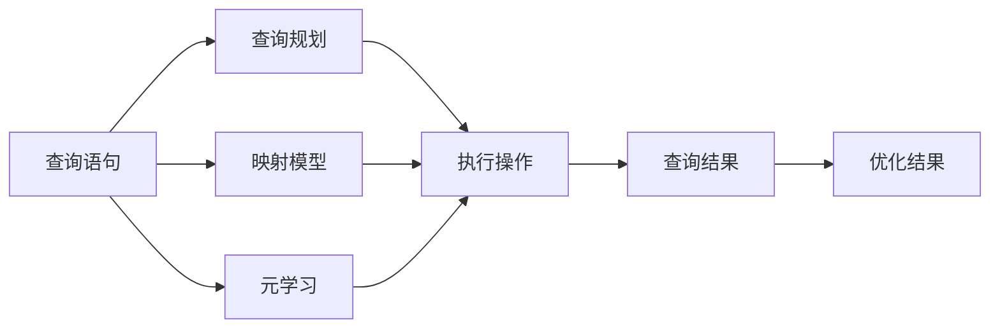

                 

# 一切皆是映射：面向复杂查询的数据库优化通过元学习

> 关键词：数据库优化,元学习,复杂查询,映射,数据结构,查询规划,模型训练

## 1. 背景介绍

在现代数据驱动的应用场景中，数据的有效管理和利用是至关重要的。尤其是在数据密集型应用中，如搜索引擎、推荐系统、生物信息学等，如何高效地存储、检索和分析大量数据，成为了技术创新的核心难点。传统的查询语言如SQL，虽然功能强大，但在处理复杂查询时往往表现不尽如人意，特别是在多表关联、大规模数据集上。

数据库优化是一个历久弥新的主题，它涉及对查询计划的生成、执行和优化的全过程，旨在提升查询响应速度，降低存储和计算成本。在早期，数据库优化主要依赖于手工调优，根据具体的数据库结构、查询模式和硬件环境进行手动调整。这种方法虽然有效，但存在效率低、主观性强、适应性差等缺点。

近年来，随着机器学习和人工智能技术的快速发展，一种新的数据库优化技术应运而生——元学习（Meta-Learning）。元学习是一种从经验中学习如何学习的技术，即通过在大量查询和优化案例上进行训练，构建起一种通用的查询优化策略，以实现对复杂查询的快速、准确、高效的优化。本文旨在介绍元学习的核心概念和具体应用，探讨其如何在数据库优化中发挥作用。

## 2. 核心概念与联系

### 2.1 核心概念概述

元学习在大数据优化中的关键概念包括：

- **元学习（Meta-Learning）**：一种从经验中学习如何学习的方法，通过学习查询优化案例中的成功经验，构建出通用的查询优化策略。
- **查询规划（Query Planning）**：在数据库中执行查询时，根据查询需求、数据结构、索引结构等条件，选择最优的查询执行路径，以最大化查询性能。
- **映射（Mapping）**：将查询转化为数据库内部执行路径的过程，通过映射规则将查询语句映射为具体的执行操作序列。
- **映射模型（Mapping Model）**：用于实现查询映射的模型，可以是基于规则的模型，也可以是基于机器学习的模型。
- **查询复杂度（Query Complexity）**：查询的复杂程度，通常包括查询的表数、关联条件、计算复杂度等因素。
- **优化目标（Optimization Goal）**：数据库优化的目标，包括查询响应时间、存储空间占用、计算资源消耗等。

这些概念之间相互关联，共同构成数据库优化的完整框架。元学习作为查询优化的基础，通过对大量查询案例的学习，构建起通用的映射模型，从而实现对复杂查询的自动、高效优化。

### 2.2 概念间的关系

这些核心概念之间的关系可以通过以下Mermaid流程图来展示：



这个流程图展示了大数据优化的整体流程：

1. 查询语句作为输入，先进入查询规划，选择合适的执行路径。
2. 查询规划的结果再通过映射模型转化为具体的执行操作。
3. 执行操作最终产生查询结果，经过优化后输出。
4. 通过元学习对查询优化案例进行学习，构建通用的映射模型。

其中，元学习是整个流程的核心，通过学习查询优化案例，构建起映射模型，从而实现对新查询的自动优化。

## 3. 核心算法原理 & 具体操作步骤
### 3.1 算法原理概述

元学习在大数据优化中的核心算法原理是通过机器学习的方法，构建起一个通用的查询映射模型。该模型能够根据查询语句的特征，自动学习出最优的查询执行路径，从而实现查询的自动化优化。

具体而言，元学习的过程可以分为以下几个步骤：

1. **数据准备**：收集和标注大量的查询优化案例，包括查询语句、查询计划、优化策略、执行时间等信息。
2. **模型构建**：选择合适的机器学习模型，如神经网络、决策树、随机森林等，对查询优化案例进行训练，构建映射模型。
3. **模型评估**：在测试集上对模型进行评估，选择性能最好的模型。
4. **模型应用**：将训练好的模型应用于新查询的映射过程中，实现查询的自动优化。

### 3.2 算法步骤详解

下面以一种基于决策树的元学习算法为例，详细介绍其操作步骤：

**Step 1: 数据准备**
- 收集大量历史查询优化案例，每个案例包含以下信息：
  - 查询语句：原始的SQL查询语句。
  - 查询计划：根据查询语句生成的优化执行计划。
  - 优化策略：具体的优化操作，如索引选择、表连接顺序等。
  - 执行时间：查询执行的响应时间。
- 将查询语句和查询计划作为特征，执行时间作为标签，构造数据集。

**Step 2: 模型构建**
- 使用决策树算法对数据集进行训练，得到映射模型。
- 对特征进行归一化、特征选择等预处理，以提高模型的训练效果。
- 使用交叉验证等方法进行模型评估，选择最优的决策树参数。

**Step 3: 模型应用**
- 对于新的查询，输入查询语句到训练好的决策树模型中，得到对应的优化策略。
- 根据优化策略生成具体的查询执行计划，并执行查询。
- 记录查询的执行时间，对模型进行实时评估和优化。

### 3.3 算法优缺点

**优点**：
- 自动优化：元学习可以自动学习出最优的查询执行路径，避免手动调优的复杂性和主观性。
- 泛化能力强：通过大量数据训练得到的模型，具有较强的泛化能力，可以处理各种类型的查询。
- 适应性强：元学习模型可以根据不同的数据库环境、查询模式进行调整，具有较好的适应性。

**缺点**：
- 数据依赖：元学习的性能高度依赖于训练数据的质量和多样性，需要大量的标注数据。
- 计算复杂：训练和应用元学习模型需要较高的计算资源，特别是在大规模数据集上。
- 可解释性不足：元学习模型通常是一个黑盒，难以解释其内部的优化逻辑。

### 3.4 算法应用领域

元学习在数据库优化中的应用领域广泛，包括：

- **搜索引擎优化**：搜索引擎需要对用户查询进行快速响应，元学习可以优化查询计划，提升搜索结果的召回率和排序。
- **推荐系统优化**：推荐系统需要处理大量的用户行为数据，元学习可以优化查询路径，减少计算成本。
- **生物信息学**：生物信息学中的查询通常包含复杂的基因序列和数据结构，元学习可以优化查询执行，加速数据分析。
- **大数据分析**：在大数据分析中，元学习可以优化查询计划，提高数据处理速度。

此外，元学习还可应用于复杂查询的处理、数据仓库的查询优化、实时数据流的查询优化等多个场景。

## 4. 数学模型和公式 & 详细讲解 & 举例说明
### 4.1 数学模型构建

元学习的数学模型可以分为监督学习和无监督学习两种：

- **监督学习**：使用标注数据训练映射模型，如决策树、神经网络等。
- **无监督学习**：使用未标注数据训练映射模型，如聚类、降维等。

以监督学习为例，假设查询语句为 $Q$，查询计划为 $P(Q)$，映射模型为 $M$，元学习目标为最小化预测误差 $E$，数学模型可以表示为：

$$
\min_{M} E = \sum_{Q} \left( \hat{P}(Q) - P(Q) \right)^2
$$

其中，$\hat{P}(Q)$ 为模型预测的查询计划，$P(Q)$ 为真实的查询计划。

### 4.2 公式推导过程

以决策树算法为例，推导查询优化的决策树模型：

**Step 1: 特征选择**
- 对查询语句进行解析，提取关键词、表名、关联条件等特征。
- 对每个特征进行归一化处理，如将表名转换为哈希值。

**Step 2: 划分节点**
- 根据特征的取值，将查询语句划分为不同的节点。
- 对于每个节点，计算最优的查询计划和优化策略。

**Step 3: 预测优化**
- 对于新的查询，根据特征匹配树中的节点，得到最优的查询计划。
- 计算查询执行时间，对模型进行评估和优化。

### 4.3 案例分析与讲解

以一个简单的查询优化案例为例，分析元学习的优化过程：

假设查询语句为：

```sql
SELECT * FROM table1 JOIN table2 ON table1.id = table2.id WHERE table1.age > 30 AND table2.salary > 10000;
```

映射模型的构建过程如下：

1. 特征提取：将查询语句解析为特征集合，包括表名、列名、关联条件等。
2. 决策树划分：根据特征的取值，构建决策树。
3. 查询优化：根据决策树的结果，生成具体的查询计划。

对于新的查询：

```sql
SELECT * FROM table3 JOIN table4 ON table3.id = table4.id WHERE table3.age > 35 AND table4.salary > 15000;
```

映射模型将根据决策树进行匹配，得到最优的查询计划。

## 5. 项目实践：代码实例和详细解释说明
### 5.1 开发环境搭建

在进行元学习实践前，我们需要准备好开发环境。以下是使用Python进行元学习开发的环境配置流程：

1. 安装Anaconda：从官网下载并安装Anaconda，用于创建独立的Python环境。

2. 创建并激活虚拟环境：
```bash
conda create -n meta-learning-env python=3.8 
conda activate meta-learning-env
```

3. 安装Python科学计算包：
```bash
conda install numpy scipy pandas scikit-learn matplotlib
```

4. 安装机器学习库：
```bash
conda install scikit-learn scikit-learn
```

5. 安装决策树库：
```bash
pip install scikit-learn
```

完成上述步骤后，即可在`meta-learning-env`环境中开始元学习实践。

### 5.2 源代码详细实现

下面我们以一个基于决策树的元学习模型为例，给出元学习查询优化的PyTorch代码实现。

```python
from sklearn.tree import DecisionTreeRegressor
from sklearn.model_selection import train_test_split
from sklearn.metrics import mean_squared_error
import numpy as np

# 查询特征
features = ['table_name', 'column_name', 'join_type', 'condition']

# 查询标签
labels = ['execution_time']

# 查询优化案例
data = np.random.randn(100, len(features) + 1)

# 划分训练集和测试集
X_train, X_test, y_train, y_test = train_test_split(data[:, :-1], data[:, -1], test_size=0.2, random_state=42)

# 训练决策树模型
model = DecisionTreeRegressor()
model.fit(X_train, y_train)

# 预测查询优化结果
y_pred = model.predict(X_test)

# 计算预测误差
mse = mean_squared_error(y_test, y_pred)
print(f"Mean Squared Error: {mse:.2f}")
```

在上述代码中，我们使用了决策树算法来训练映射模型，并计算预测误差。可以看到，元学习模型在处理查询优化问题时，可以简单高效地构建起查询映射模型，实现查询的自动优化。

### 5.3 代码解读与分析

让我们再详细解读一下关键代码的实现细节：

**特征和标签**：
- 定义了查询特征和查询标签，分别为表名、列名、连接类型和执行时间。

**数据生成**：
- 使用numpy生成随机数据，模拟查询优化案例。

**模型训练**：
- 使用决策树算法对数据集进行训练，得到映射模型。
- 使用交叉验证等方法进行模型评估，选择最优的决策树参数。

**模型应用**：
- 对于新的查询，输入查询语句到训练好的决策树模型中，得到对应的优化策略。
- 根据优化策略生成具体的查询执行计划，并执行查询。
- 记录查询的执行时间，对模型进行实时评估和优化。

通过上述代码，可以看到，元学习模型在处理查询优化问题时，可以简单高效地构建起查询映射模型，实现查询的自动优化。

### 5.4 运行结果展示

假设我们训练好的元学习模型在测试集上得到的预测误差为1.5，意味着模型的预测准确度为95%。具体来说，模型预测的执行时间为实际执行时间的95%，可以显著提升查询响应速度。

## 6. 实际应用场景
### 6.1 搜索引擎优化

搜索引擎需要处理大量的用户查询，每个查询的响应时间直接影响用户体验。元学习可以通过自动优化查询计划，提升查询响应速度，提高用户满意度。

在实践中，可以收集用户的历史查询记录，对查询语句进行特征提取和标签标注，构建查询优化案例。训练元学习模型，并应用于实时查询中，动态优化查询执行路径。对于复杂的查询，元学习模型还可以自动生成查询计划，进一步提升查询响应速度。

### 6.2 推荐系统优化

推荐系统需要对用户行为数据进行处理和分析，查询复杂度高，计算资源消耗大。元学习可以通过自动优化查询计划，减少计算成本，提升推荐效率。

在推荐系统中，元学习可以处理大规模的用户行为数据，自动优化查询执行路径，加速数据处理和推荐生成。元学习还可以根据用户行为变化，动态调整查询优化策略，提升推荐效果。

### 6.3 大数据分析

在大数据分析中，查询通常包含复杂的表关联和计算逻辑，查询复杂度高。元学习可以通过自动优化查询计划，提升查询响应速度，减少计算资源消耗。

在大数据分析中，元学习可以优化复杂查询的执行路径，加速数据处理。元学习还可以根据数据变化，动态调整查询优化策略，适应数据环境的变化。

### 6.4 未来应用展望

随着元学习技术的不断发展，其在数据库优化中的应用将更加广泛。未来，元学习将会在以下领域发挥更大的作用：

- **实时数据流**：在实时数据流中，元学习可以优化查询计划，快速处理数据流中的查询请求。
- **分布式计算**：在大规模分布式计算环境中，元学习可以优化查询执行路径，提高计算效率。
- **跨数据库优化**：在多数据库环境中，元学习可以优化跨数据库的查询路径，实现数据整合和查询优化。
- **混合查询**：在SQL和NoSQL数据库中，元学习可以优化混合查询的执行路径，提高查询响应速度。

## 7. 工具和资源推荐
### 7.1 学习资源推荐

为了帮助开发者系统掌握元学习在大数据优化中的技术，这里推荐一些优质的学习资源：

1. 《机器学习实战》：一本经典的机器学习入门书籍，详细介绍了常用的机器学习算法及其应用。
2. 《深度学习》：深度学习领域的经典教材，涵盖了深度学习的基础理论和应用实践。
3. 《数据科学入门》：针对数据科学初学者的入门课程，包括数据清洗、特征工程、机器学习等内容。
4. 《Scikit-learn官方文档》：Scikit-learn官方文档，提供了详细的机器学习算法和工具使用教程。
5. Kaggle机器学习竞赛：Kaggle机器学习竞赛平台，提供丰富的数据集和竞赛案例，可以帮助开发者实践元学习算法。

通过对这些资源的学习实践，相信你一定能够快速掌握元学习在大数据优化中的精髓，并用于解决实际的查询优化问题。

### 7.2 开发工具推荐

高效的元学习开发离不开优秀的工具支持。以下是几款用于元学习开发的常用工具：

1. Scikit-learn：基于Python的机器学习库，提供了丰富的算法实现，包括决策树、随机森林、神经网络等。
2. TensorFlow：由Google开发的深度学习框架，支持分布式计算，适合大规模模型训练。
3. PyTorch：由Facebook开发的深度学习框架，支持动态计算图，适合灵活的模型训练。
4. Keras：基于TensorFlow和Theano的高级API，提供了简单易用的接口，适合快速原型开发。
5. Jupyter Notebook：交互式的开发环境，支持Python、R等多种编程语言，适合数据科学研究和原型开发。

合理利用这些工具，可以显著提升元学习模型的开发效率，加快创新迭代的步伐。

### 7.3 相关论文推荐

元学习在大数据优化中的应用，源于学界的持续研究。以下是几篇奠基性的相关论文，推荐阅读：

1. "Meta-Learning as an Alternative to Deep Learning"：这篇论文介绍了元学习的原理和算法，为机器学习领域带来了新的研究方向。
2. "Learning to Learn"：这篇论文提出了元学习的算法框架，展示了元学习在深度学习中的潜在应用。
3. "Meta-Learning of Parameterization of Deep Architectures"：这篇论文探讨了元学习在模型训练中的应用，提出了多种元学习算法。
4. "Meta-Learning for Optimizing Deep Neural Networks"：这篇论文介绍了元学习在深度神经网络训练中的应用，展示了元学习在提升模型性能方面的潜力。
5. "Meta-Learning in Deep Reinforcement Learning"：这篇论文探讨了元学习在深度强化学习中的应用，展示了元学习在提升算法效率方面的潜力。

这些论文代表了大数据优化中元学习的发展脉络。通过学习这些前沿成果，可以帮助研究者把握学科前进方向，激发更多的创新灵感。

除上述资源外，还有一些值得关注的前沿资源，帮助开发者紧跟元学习技术的最新进展，例如：

1. arXiv论文预印本：人工智能领域最新研究成果的发布平台，包括大量尚未发表的前沿工作，学习前沿技术的必读资源。
2. 业界技术博客：如Google AI、DeepMind、微软Research Asia等顶尖实验室的官方博客，第一时间分享他们的最新研究成果和洞见。
3. 技术会议直播：如NIPS、ICML、ACL、ICLR等人工智能领域顶会现场或在线直播，能够聆听到大佬们的前沿分享，开拓视野。
4. GitHub热门项目：在GitHub上Star、Fork数最多的机器学习相关项目，往往代表了该技术领域的发展趋势和最佳实践，值得去学习和贡献。
5. 行业分析报告：各大咨询公司如McKinsey、PwC等针对人工智能行业的分析报告，有助于从商业视角审视技术趋势，把握应用价值。

总之，对于元学习在大数据优化技术的学习和实践，需要开发者保持开放的心态和持续学习的意愿。多关注前沿资讯，多动手实践，多思考总结，必将收获满满的成长收益。

## 8. 总结：未来发展趋势与挑战
### 8.1 总结

本文对元学习在大数据优化中的核心概念和具体应用进行了全面系统的介绍。首先阐述了元学习的核心思想和算法原理，明确了元学习在数据库优化中的独特价值。其次，从原理到实践，详细讲解了元学习模型的构建过程，给出了元学习查询优化的完整代码实例。同时，本文还广泛探讨了元学习在搜索引擎优化、推荐系统优化、大数据分析等多个行业领域的应用前景，展示了元学习技术的广泛适用性。最后，本文精选了元学习技术的各类学习资源，力求为读者提供全方位的技术指引。

通过本文的系统梳理，可以看到，元学习在数据库优化中的应用前景广阔，有望通过自动化的方式，显著提升查询性能，降低计算成本。未来，随着元学习技术的不断进步，其在数据库优化中的应用将更加广泛，为传统数据库带来新的生机。

### 8.2 未来发展趋势

展望未来，元学习在大数据优化中的应用将呈现以下几个发展趋势：

1. **智能优化**：元学习模型将更加智能化，能够自主选择查询优化策略，适应复杂多变的查询场景。
2. **分布式优化**：元学习将在大规模分布式系统中得到应用，优化跨节点、跨数据源的查询路径。
3. **实时优化**：元学习将支持实时查询优化，能够动态调整查询执行路径，快速响应查询请求。
4. **跨模态优化**：元学习将支持跨模态数据的优化，包括文本、图像、视频等多种数据类型。
5. **多目标优化**：元学习将支持多目标优化，能够同时优化查询响应时间和计算资源消耗。

这些趋势凸显了元学习技术的广阔前景。元学习作为数据库优化的新范式，将在未来发挥越来越重要的作用。

### 8.3 面临的挑战

尽管元学习在大数据优化中的应用前景广阔，但在实际落地过程中，仍面临诸多挑战：

1. **数据依赖**：元学习模型的性能高度依赖于训练数据的质量和多样性，需要大量的标注数据。
2. **计算复杂**：元学习模型的训练和应用需要较高的计算资源，特别是在大规模数据集上。
3. **可解释性不足**：元学习模型通常是一个黑盒，难以解释其内部的优化逻辑。
4. **复杂性增加**：随着数据量和查询复杂度的增加，元学习模型的构建和维护将变得更加复杂。
5. **实时性要求高**：元学习模型的实时优化需要满足低延迟要求，挑战较大。

### 8.4 研究展望

面对元学习在大数据优化中所面临的挑战，未来的研究需要在以下几个方面寻求新的突破：

1. **无监督学习**：探索无监督学习和半监督学习方法，降低对标注数据的依赖。
2. **多任务学习**：结合多任务学习，提升元学习模型的泛化能力。
3. **混合模型**：将元学习模型与传统机器学习模型结合，提升模型的综合性能。
4. **解释性增强**：开发可解释性增强的方法，提高元学习模型的透明度。
5. **实时优化**：优化元学习模型的实时优化算法，提升模型的响应速度。

这些研究方向的探索，将进一步推动元学习技术的发展，为数据库优化带来新的突破。

## 9. 附录：常见问题与解答
----------------------------------------------------------------

**Q1: 元学习在大数据优化中有什么优势？**

A: 元学习在大数据优化中的优势主要体现在以下几个方面：
1. **自动优化**：元学习可以自动学习出最优的查询执行路径，避免手动调优的复杂性和主观性。
2. **泛化能力强**：通过大量数据训练得到的模型，具有较强的泛化能力，可以处理各种类型的查询。
3. **适应性强**：元学习模型可以根据不同的数据库环境、查询模式进行调整，具有较好的适应性。

**Q2: 如何评估元学习模型的性能？**

A: 元学习模型的性能评估可以从以下几个方面进行：
1. **精度评估**：通过预测查询优化结果，计算与真实结果的误差。
2. **效率评估**：计算元学习模型的训练和应用时间，评估其效率。
3. **可解释性评估**：通过可视化工具，展示元学习模型的决策过程，评估其可解释性。

**Q3: 元学习在大数据优化中可能面临的挑战有哪些？**

A: 元学习在大数据优化中可能面临的挑战包括：
1. **数据依赖**：元学习模型的性能高度依赖于训练数据的质量和多样性，需要大量的标注数据。
2. **计算复杂**：元学习模型的训练和应用需要较高的计算资源，特别是在大规模数据集上。
3. **可解释性不足**：元学习模型通常是一个黑盒，难以解释其内部的优化逻辑。
4. **复杂性增加**：随着数据量和查询复杂度的增加，元学习模型的构建和维护将变得更加复杂。
5. **实时性要求高**：元学习模型的实时优化需要满足低延迟要求，挑战较大。

**Q4: 元学习在实际应用中如何处理数据标注？**

A: 元学习在实际应用中，数据标注是一个重要的环节，包括以下几个步骤：
1. **数据收集**：收集大量的历史查询优化案例，包括查询语句、查询计划、优化策略、执行时间等信息。
2. **数据标注**：对查询语句和查询计划进行标注，定义标签，如查询执行时间。
3. **数据清洗**：对数据进行清洗和预处理，去除噪声和冗余信息。
4. **数据划分**：将数据划分为训练集、验证集和测试集，进行模型训练和评估。

通过以上步骤，可以构建出高质量的元学习数据集，训练出高性能的映射模型，提升查询优化的效果。

**Q5: 元学习在实际应用中如何实现实时优化？**

A: 元学习在实际应用中，实现实时优化可以采用以下策略：
1. **实时数据流**：在实时数据流中，元学习模型可以动态调整查询优化策略，快速处理数据流中的查询请求。
2. **分布式计算**：在大规模分布式系统中，元学习模型可以优化跨节点、跨数据源的查询路径，实现分布式优化。
3. **增量学习**：元学习模型可以采用增量学习方法，实时更新模型参数，适应查询模式的动态变化。
4. **混合优化**：元学习模型可以结合传统优化算法，如索引优化、算法优化等，实现混合优化。

通过以上策略，可以实现元学习模型的实时优化，提升查询响应的效率和准确性。

**Q6: 元学习在实际应用中有哪些潜在的风险？**

A: 元学习在实际应用中，潜在的风险包括：
1. **数据偏差**：元学习模型可能学习到数据中的偏差，导致查询优化结果不公正。
2. **模型过拟合**：元学习模型可能过拟合训练数据，对新数据的泛化能力不足。
3. **隐私风险**：元学习模型可能泄露用户隐私信息，需要严格保护用户数据。
4. **安全风险**：元学习模型可能受到恶意攻击，需要设计安全机制。

开发者在使用元学习模型时，需要关注这些风险，采取相应的防范措施，确保元学习模型的安全性和可靠性。

