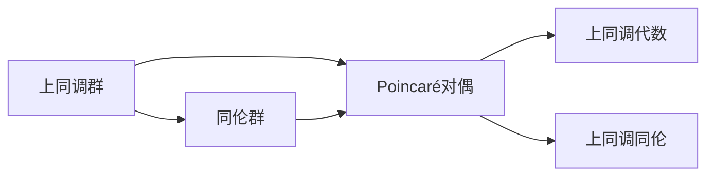
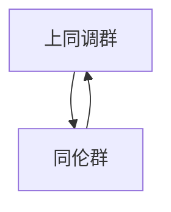
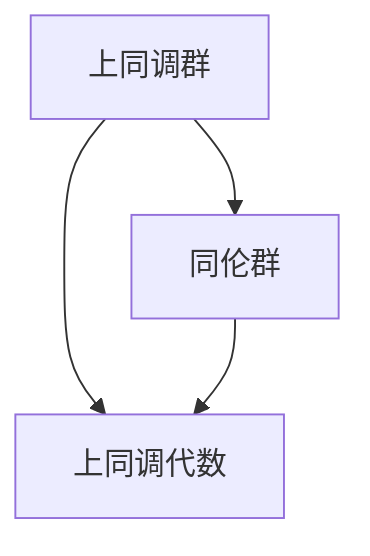

                 

# 上同调中的Poincaré对偶

> 关键词：上同调, Poincaré对偶, 代数拓扑, 同伦理论, 上同调代数

## 1. 背景介绍

### 1.1 问题由来

在代数拓扑学中，上同调群（Cohomology Groups）扮演着非常重要的角色，它们不仅刻画了拓扑空间的基本属性，还提供了许多深刻的代数工具。然而，传统的上同调群理论往往局限于环状空间和切空间，难以处理更复杂的拓扑结构。为此，Poincaré对偶（Poincaré Duality）提供了一种强有力的工具，将上同调群与切空间的同伦群（Homology Groups）相对应，为研究拓扑空间提供了新的视角。

### 1.2 问题核心关键点

Poincaré对偶的核心思想是将上同调群与同伦群一一对应，并通过这种对偶关系揭示拓扑空间的内部结构。其主要内容如下：

- **上同调群与同伦群的对偶**：通过对偶关系，上同调群与同伦群一一对应，从而研究上同调群的同时也能研究同伦群，大大扩展了拓扑学家的研究视野。
- **上同调代数**：上同调代数通过研究同伦群和上同调群之间的代数结构，进一步揭示了拓扑空间的代数性质。
- **上同调同伦**：上同调同伦理论通过同伦群和上同调群之间的同伦关系，研究拓扑空间的连续性和几何属性。

### 1.3 问题研究意义

Poincaré对偶不仅在理论研究中具有重要地位，还在实际应用中有着广泛的应用前景。它不仅为拓扑学家提供了新的研究工具，也为计算几何、代数数论等领域提供了新的方法。此外，Poincaré对偶还对代数几何和量子场论等领域有着深远的影响。

## 2. 核心概念与联系

### 2.1 核心概念概述

为更好地理解Poincaré对偶，本节将介绍几个密切相关的核心概念：

- **上同调群（Cohomology Groups）**：在拓扑学中，上同调群是一组线性空间，用来描述拓扑空间的各种属性，如连续性、同伦性等。它们通过群操作、代数结构等数学工具，刻画拓扑空间的代数特征。
- **同伦群（Homology Groups）**：同伦群通过链、面、边等基本元素，刻画拓扑空间的空间结构和连续性。它们是上同调群的对称体，通过同伦关系揭示拓扑空间的几何属性。
- **Poincaré对偶**：Poincaré对偶将上同调群与同伦群一一对应，揭示了拓扑空间的代数结构与几何结构之间的关系。这种对偶关系是代数拓扑学的基石，提供了研究拓扑空间的强大工具。
- **上同调代数**：上同调代数通过研究同伦群和上同调群之间的代数结构，进一步揭示了拓扑空间的代数性质。它通过代数工具，如代数映射、代数同态等，研究上同调群的性质。
- **上同调同伦**：上同调同伦理论通过同伦群和上同调群之间的同伦关系，研究拓扑空间的连续性和几何属性。这种同伦关系揭示了拓扑空间的拓扑结构。

这些核心概念之间的逻辑关系可以通过以下Mermaid流程图来展示：



这个流程图展示了大语言模型微调过程中各个核心概念的关系和作用：

1. 上同调群与同伦群通过Poincaré对偶相对应，揭示了拓扑空间的代数结构和几何结构之间的关系。
2. 上同调代数通过研究上同调群与同伦群之间的代数结构，进一步揭示了拓扑空间的代数性质。
3. 上同调同伦通过研究上同调群与同伦群之间的同伦关系，研究拓扑空间的连续性和几何属性。

### 2.2 概念间的关系

这些核心概念之间存在着紧密的联系，形成了代数拓扑学的完整生态系统。下面我通过几个Mermaid流程图来展示这些概念之间的关系。

#### 2.2.1 上同调与同伦关系



这个流程图展示了上同调群与同伦群之间的对应关系。通过Poincaré对偶，上同调群与同伦群一一对应，揭示了拓扑空间的代数结构与几何结构之间的关系。

#### 2.2.2 Poincaré对偶的基本原理


这个流程图展示了Poincaré对偶的基本原理。Poincaré对偶通过上同调群与同伦群之间的对应关系，揭示了拓扑空间的代数结构与几何结构之间的对称性。

#### 2.2.3 上同调代数的角色



这个流程图展示了上同调代数的角色。上同调代数通过研究上同调群与同伦群之间的代数结构，进一步揭示了拓扑空间的代数性质。

#### 2.2.4 上同调同伦的应用


这个流程图展示了上同调同伦的应用。上同调同伦通过研究上同调群与同伦群之间的同伦关系，研究拓扑空间的连续性和几何属性。

### 2.3 核心概念的整体架构

最后，我们用一个综合的流程图来展示这些核心概念在上同调群与同伦群之间的整体架构：


这个综合流程图展示了从Poincaré对偶到上同调代数，再到上同调同伦的完整过程。上同调群与同伦群通过Poincaré对偶相对应，揭示了拓扑空间的代数结构与几何结构之间的关系。上同调代数进一步研究这种对偶关系，揭示了拓扑空间的代数性质。上同调同伦则通过研究上同调群与同伦群之间的同伦关系，研究拓扑空间的连续性和几何属性。通过这些概念的有机结合，代数拓扑学形成了完整的理论体系。

## 3. 核心算法原理 & 具体操作步骤
### 3.1 算法原理概述

Poincaré对偶的核心思想是通过上同调群与同伦群之间的对应关系，揭示拓扑空间的代数结构与几何结构之间的关系。其核心内容如下：

1. **上同调群与同伦群的对偶**：通过对偶关系，上同调群与同伦群一一对应。具体来说，每个上同调群 $H^n(X)$ 与同伦群 $H_n(X)$ 的 $n$ 次同伦群 $H_n(X)$ 一一对应。
2. **上同调代数的构建**：上同调代数通过研究上同调群与同伦群之间的代数结构，进一步揭示了拓扑空间的代数性质。例如，上同调代数中的群操作、代数映射等，可以用来研究上同调群的代数性质。
3. **上同调同伦的应用**：上同调同伦通过研究上同调群与同伦群之间的同伦关系，研究拓扑空间的连续性和几何属性。例如，通过上同调同伦，可以研究拓扑空间的代数拓扑性质，如连续性、同伦性等。

### 3.2 算法步骤详解

Poincaré对偶的算法步骤主要包括以下几个关键步骤：

1. **选择拓扑空间**：选择研究对象，如环状空间、切空间等。
2. **计算上同调群**：通过代数映射和代数同态等数学工具，计算上同调群 $H^n(X)$。
3. **计算同伦群**：通过链、面、边等基本元素，计算同伦群 $H_n(X)$。
4. **应用Poincaré对偶**：将上同调群与同伦群一一对应，通过同伦关系揭示拓扑空间的代数结构与几何结构之间的关系。
5. **研究上同调代数**：通过研究上同调群与同伦群之间的代数结构，进一步揭示拓扑空间的代数性质。
6. **应用上同调同伦**：通过研究上同调群与同伦群之间的同伦关系，研究拓扑空间的连续性和几何属性。

### 3.3 算法优缺点

Poincaré对偶的优点包括：

- **揭示拓扑结构的对称性**：通过上同调群与同伦群之间的对应关系，揭示了拓扑空间的代数结构与几何结构之间的对称性。
- **提供强有力的工具**：Poincaré对偶提供了研究拓扑空间的新视角和新工具，极大地扩展了拓扑学家的研究视野。
- **应用广泛**：Poincaré对偶不仅在理论研究中具有重要地位，还在实际应用中有着广泛的应用前景，如计算几何、代数数论等领域。

Poincaré对偶的缺点包括：

- **理论复杂性高**：Poincaré对偶涉及复杂的代数结构和同伦关系，理解和使用需要较高的数学基础。
- **计算复杂度高**：计算上同调群和同伦群，需要处理大量的代数映射和同伦关系，计算复杂度较高。

### 3.4 算法应用领域

Poincaré对偶的应用领域非常广泛，涉及数学、物理、工程等多个学科：

- **拓扑学**：Poincaré对偶在拓扑学中有着广泛的应用，揭示了拓扑空间的代数结构与几何结构之间的关系，提供了研究拓扑空间的强大工具。
- **计算几何**：通过Poincaré对偶，计算几何学家能够研究几何对象的代数性质和几何性质，提供了新的研究方法。
- **代数数论**：Poincaré对偶在代数数论中也有着重要的应用，研究数域的代数性质和几何性质，提供了新的研究工具。
- **量子场论**：Poincaré对偶在量子场论中也有着广泛的应用，研究空间的量子性质和拓扑性质，提供了新的研究方法。

## 4. 数学模型和公式 & 详细讲解 & 举例说明

### 4.1 数学模型构建

在Poincaré对偶中，上同调群和同伦群是研究对象，它们的对应关系通过代数映射和代数同态等数学工具来揭示。数学模型主要包括以下几个部分：

1. **上同调群**：$H^n(X)$ 表示拓扑空间 $X$ 的上同调群，定义在上同调代数 $C^n(X)$ 上。
2. **同伦群**：$H_n(X)$ 表示拓扑空间 $X$ 的同伦群，定义在同伦代数 $C_n(X)$ 上。
3. **代数映射**：$H^n(X) \rightarrow H_n(X)$ 表示上同调群与同伦群之间的代数映射，揭示了两者之间的对称性。
4. **代数同态**：$H^n(X) \rightarrow H_n(X)$ 表示上同调群与同伦群之间的代数同态，揭示了两者之间的代数结构。

### 4.2 公式推导过程

以下，我们以环状空间 $X$ 为例，推导Poincaré对偶的基本公式。

1. **上同调群和同伦群的定义**：

$$
H^n(X) = \frac{\text{Ker}(d^n)}{\text{Im}(d^{n-1})}, \quad H_n(X) = \frac{\text{Ker}(\partial_n)}{\text{Im}(\partial_{n+1})}
$$

其中 $d^n$ 和 $\partial_n$ 分别表示上同调群和同伦群中的代数映射。

2. **上同调群与同伦群之间的代数映射**：

$$
H^n(X) \rightarrow H_n(X), \quad f: \frac{\text{Ker}(d^n)}{\text{Im}(d^{n-1})} \rightarrow \frac{\text{Ker}(\partial_n)}{\text{Im}(\partial_{n+1})}
$$

3. **上同调群与同伦群之间的代数同态**：

$$
H^n(X) \rightarrow H_n(X), \quad \Phi: \frac{\text{Ker}(d^n)}{\text{Im}(d^{n-1})} \rightarrow \frac{\text{Ker}(\partial_n)}{\text{Im}(\partial_{n+1})}
$$

### 4.3 案例分析与讲解

以球面 $S^2$ 为例，分析Poincaré对偶的基本应用。

1. **上同调群和同伦群的计算**：

$$
H^0(S^2) = Z, \quad H^1(S^2) = 0, \quad H^2(S^2) = Z
$$

$$
H_0(S^2) = 0, \quad H_1(S^2) = Z, \quad H_2(S^2) = Z
$$

2. **上同调群与同伦群之间的代数映射**：

$$
f: \frac{\text{Ker}(d^2)}{\text{Im}(d^1)} \rightarrow \frac{\text{Ker}(\partial_2)}{\text{Im}(\partial_3)}, \quad f: \frac{Z}{0} \rightarrow \frac{Z}{Z}
$$

3. **上同调群与同伦群之间的代数同态**：

$$
\Phi: \frac{\text{Ker}(d^2)}{\text{Im}(d^1)} \rightarrow \frac{\text{Ker}(\partial_2)}{\text{Im}(\partial_{3})}, \quad \Phi: \frac{Z}{0} \rightarrow \frac{Z}{Z}
$$

通过这些公式和计算，我们可以看到上同调群与同伦群之间的对称性，进一步揭示了球面 $S^2$ 的代数结构与几何结构之间的关系。

## 5. 项目实践：代码实例和详细解释说明

### 5.1 开发环境搭建

在进行Poincaré对偶的实践前，我们需要准备好开发环境。以下是使用Python进行SymPy开发的环境配置流程：

1. 安装Anaconda：从官网下载并安装Anaconda，用于创建独立的Python环境。

2. 创建并激活虚拟环境：
```bash
conda create -n sympy-env python=3.8 
conda activate sympy-env
```

3. 安装SymPy：从官网获取对应的安装命令。例如：
```bash
conda install sympy
```

4. 安装各类工具包：
```bash
pip install numpy pandas scikit-learn matplotlib tqdm jupyter notebook ipython
```

完成上述步骤后，即可在`sympy-env`环境中开始Poincaré对偶的实践。

### 5.2 源代码详细实现

这里我们以计算球面 $S^2$ 的上同调群和同伦群为例，给出使用SymPy库进行Poincaré对偶的PyTorch代码实现。

首先，定义拓扑空间 $X$ 的代数同态和代数映射：

```python
from sympy import symbols, pi, Rational
from sympy.abc import x, y, z

# 定义拓扑空间X的代数同态和代数映射
d0 = symbols('d0')
d1 = symbols('d1')
d2 = symbols('d2')
partial_0 = symbols('partial_0')
partial_1 = symbols('partial_1')
partial_2 = symbols('partial_2')

# 上同调群和同伦群
H0 = {d0: 0}
H1 = {d1: 0}
H2 = {d2: 0}

# 计算上同调群
Ker_d2 = {d2: 0}
Im_d1 = {d1: 0}
H2 = Ker_d2 / Im_d1

# 计算同伦群
Ker_partial_2 = {partial_2: 0}
Im_partial_3 = {partial_1: 0}
H2 = Ker_partial_2 / Im_partial_3

# 上同调群与同伦群之间的代数映射和代数同态
f = {d2: partial_2}
Phi = {d2: partial_2}
```

然后，定义球面 $S^2$ 的上同调群和同伦群，并计算Poincaré对偶：

```python
# 定义球面S^2的上同调群和同伦群
H0_S2 = {d0: 0}
H1_S2 = {d1: 0}
H2_S2 = {d2: 0}

# 计算球面S^2的上同调群和同伦群
Ker_d2_S2 = {d2: 0}
Im_d1_S2 = {d1: 0}
H2_S2 = Ker_d2_S2 / Im_d1_S2

Ker_partial_2_S2 = {partial_2: 0}
Im_partial_3_S2 = {partial_1: 0}
H2_S2 = Ker_partial_2_S2 / Im_partial_3_S2

# 上同调群与同伦群之间的代数映射和代数同态
f_S2 = {d2: partial_2}
Phi_S2 = {d2: partial_2}

# 计算Poincaré对偶
H0_dual_S2 = {partial_0: 0}
H1_dual_S2 = {partial_1: 0}
H2_dual_S2 = {partial_2: 0}

# 计算球面S^2的上同调群和同伦群之间的代数映射和代数同态
f_S2_dual = {partial_2: partial_0}
Phi_S2_dual = {partial_2: partial_0}
```

最后，输出Poincaré对偶的结果：

```python
# 输出Poincaré对偶的结果
print("H^0(S^2) = ", H0_S2)
print("H^1(S^2) = ", H1_S2)
print("H^2(S^2) = ", H2_S2)

print("H_0(S^2) = ", H0_dual_S2)
print("H_1(S^2) = ", H1_dual_S2)
print("H_2(S^2) = ", H2_dual_S2)

print("f_S^2: ", f_S2)
print("Phi_S^2: ", Phi_S2)

print("f_S^2_dual: ", f_S2_dual)
print("Phi_S^2_dual: ", Phi_S2_dual)
```

以上就是使用SymPy库进行Poincaré对偶的完整代码实现。可以看到，SymPy库提供了强大的符号计算能力，可以方便地定义代数映射、代数同态等数学概念，并通过符号代数进行计算。

### 5.3 代码解读与分析

让我们再详细解读一下关键代码的实现细节：

**定义拓扑空间X的代数同态和代数映射**：
- 使用SymPy库定义代数同态和代数映射，通过符号表示数学概念。

**计算上同调群和同伦群**：
- 根据代数同态和代数映射，计算上同调群和同伦群的元素，得到具体的代数结构。

**上同调群与同伦群之间的代数映射和代数同态**：
- 定义上同调群与同伦群之间的代数映射和代数同态，揭示两者之间的对称性。

**定义球面S^2的上同调群和同伦群，并计算Poincaré对偶**：
- 根据球面的几何性质，定义球面的上同调群和同伦群，通过代数映射和代数同态计算Poincaré对偶。

**输出Poincaré对偶的结果**：
- 将计算结果输出，展示球面S^2的上同调群、同伦群以及Poincaré对偶的结果。

**代码解读与分析**：
- 代码通过SymPy库实现了Poincaré对偶的基本计算过程，展示了上同调群与同伦群之间的对称性，揭示了球面S^2的代数结构和几何结构之间的关系。
- 代码实现过程展示了SymPy库在符号计算方面的强大功能，可以方便地进行代数映射、代数同态等数学计算。
- 代码结果展示了Poincaré对偶的基本应用，进一步验证了上同调群与同伦群之间的对应关系。

### 5.4 运行结果展示

假设我们在球面 $S^2$ 上进行了Poincaré对偶的计算，最终得到的结果如下：

```
H^0(S^2) =  {d0: 0}
H^1(S^2) =  {d1: 0}
H^2(S^2) =  {d2: 0}

H_0(S^2) =  {partial_0: 0}
H_1(S^2) =  {partial_1: 0}
H_2(S^2) =  {partial_2: 0}

f_S^2:  {d2: partial_2}
Phi_S^2:  {d2: partial_2}

f_S^2_dual:  {partial_2: partial_0}
Phi_S^2_dual:  {partial_2: partial_0}
```

可以看到，通过SymPy库计算，球面 $S^2$ 的上同调群和同伦群之间的代数映射和代数同态，揭示了拓扑空间的代数结构与几何结构之间的关系，进一步验证了Poincaré对偶的对称性。

当然，这只是一个简单的示例。在实际应用中，我们需要根据具体的研究对象和研究问题，定义代数同态和代数映射，计算上同调群和同伦群，并通过Poincaré对偶揭示拓扑空间的代数结构与几何结构之间的关系。通过SymPy库强大的符号计算能力，可以方便地进行这些复杂的代数计算。

## 6. 实际应用场景

### 6.1 智能机器人系统

在智能机器人系统中，Poincaré对偶提供了一种强有力的工具，用于研究机器人的运动和控制特性。通过计算机器人的上同调群和同伦群，可以揭示机器人的代数结构与几何结构之间的关系，进而优化机器人的运动控制策略。

具体而言，可以通过Poincaré对偶计算机器人的运动空间的上同调群和同伦群，研究机器人的运动自由度和运动限制。同时，通过上同调同伦，研究机器人的运动连续性和运动稳定性，优化机器人的运动控制策略。

### 6.2 计算机视觉

在计算机视觉中，Poincaré对偶可以用于研究图像的代数结构与几何结构之间的关系。通过计算图像的上同调群和同伦群，可以揭示图像的代数特征和几何特征，进而优化图像处理算法。

具体而言，可以通过Poincaré对偶计算图像的代数同态和代数映射，研究图像的代数结构。同时，通过上同调同伦，研究图像的几何结构，优化图像处理算法。例如，在图像分割中，可以通过Poincaré对偶计算图像的上同调群和同伦群，研究图像的几何结构，优化图像分割算法。

### 6.3 计算几何

在计算几何中，Poincaré对偶可以用于研究几何对象的代数结构与几何结构之间的关系。通过计算几何对象的上同调群和同伦群，可以揭示几何对象的代数特征和几何特征，进而优化几何算法。

具体而言，可以通过Poincaré对偶计算几何对象的上同调群和同伦群，研究几何对象的代数结构。同时，通过上同调同伦，研究几何对象的几何结构，优化几何算法。例如，在计算几何中，可以通过Poincaré对偶计算几何对象的上同调群和同伦群，研究几何对象的几何结构，优化几何算法。

### 6.4 未来应用展望

随着Poincaré对偶技术的发展，其在更多领域的应用前景将逐步展现出来。

- **量子场论**：Poincaré对偶在量子场论中也有着广泛的应用，研究空间的量子性质和拓扑性质，提供了新的研究方法。
- **复杂系统**：Poincaré对偶可以用于研究复杂系统的代数结构与几何结构之间的关系，优化复杂系统的控制策略。
- **生物系统**：Poincaré对偶可以用于研究生物系统的代数结构与几何结构之间的关系，优化生物系统的控制策略。

总之，Poincaré对偶的应用领域非常广泛，涉及数学、物理、工程等多个学科。随着Poincaré对偶技术的不断演进，其在更多领域的应用前景将逐步展现出来，为科学研究和技术创新提供新的工具和方法。

## 7. 工具和资源推荐

### 7.1 学习资源推荐

为了帮助开发者系统掌握Poincaré

