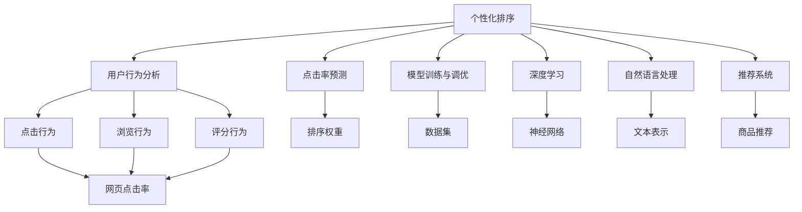

                 

# 个性化排序：AI如何根据用户偏好，提供更精准的搜索结果

## 1. 背景介绍

在当今信息爆炸的时代，如何从海量数据中快速高效地检索到用户真正需要的信息，已经成为搜索引擎、推荐系统等应用的核心需求。传统的基于关键词匹配的方法，往往无法准确捕捉用户的真实兴趣和偏好，导致搜索结果与用户期望相差甚远。而个性化排序技术，通过深度学习算法，能够根据用户的搜索历史、点击行为、评分反馈等多维度数据，深入理解用户需求，从而提供更加精准的搜索结果。

个性化排序技术涉及机器学习、深度学习、自然语言处理等多个交叉领域，是人工智能应用的重要方向之一。在搜索引擎、电商、社交媒体等众多领域，个性化排序都具有广泛的应用前景，极大地提升了用户体验和业务价值。因此，深入理解个性化排序的原理、技术和应用，对于提升AI技术的实际落地能力，具有重要意义。

## 2. 核心概念与联系

### 2.1 核心概念概述

- **个性化排序**：根据用户历史行为和偏好，对搜索结果进行重新排序的技术，旨在提升搜索结果的相关性和用户满意度。
- **用户行为分析**：通过分析用户的点击、浏览、停留、评分等行为数据，挖掘用户的兴趣和偏好。
- **点击率预测**：基于用户行为数据，预测用户对搜索结果中各个网页的点击概率，用于调整排序权重。
- **模型训练与调优**：通过大量的标注数据，训练机器学习模型，优化模型参数，提升预测准确率。
- **深度学习**：利用神经网络结构，从大量数据中学习复杂的非线性关系，实现更准确的排序和预测。
- **自然语言处理**：处理文本数据的深度学习技术，如词向量表示、语义分析等，用于文本相关的个性化排序任务。
- **推荐系统**：通过个性化排序技术，为不同用户推荐个性化的商品、内容等信息，提高用户体验和转化率。

这些核心概念之间存在着紧密的联系，通过它们相互作用，共同构建了个性化排序的技术框架。本文将从原理到实践，深入探讨这些核心概念的实现方法，并结合具体应用场景，展示个性化排序技术的强大力量。

### 2.2 核心概念间的关系

以下是一个简化的Mermaid流程图，展示了个性化排序的核心概念及其之间的联系：



该流程图展示了个性化排序技术如何通过用户行为分析、点击率预测、模型训练与调优、深度学习和自然语言处理等多个技术环节，实现个性化的搜索结果排序和推荐。

## 3. 核心算法原理 & 具体操作步骤

### 3.1 算法原理概述

个性化排序的算法原理，主要基于用户行为分析和点击率预测两大核心环节。通过分析用户的历史行为数据，预测用户对不同网页的点击概率，并根据预测结果调整网页排序权重，最终实现个性化排序。

**基本思路**：
1. **用户行为分析**：收集用户的历史点击、浏览、评分等行为数据，提取用户兴趣特征。
2. **点击率预测**：基于用户特征和网页特征，训练点击率预测模型，预测用户对每个网页的点击概率。
3. **排序调整**：将点击率预测结果作为排序权重，重新调整搜索结果的排序。

**主要步骤**：
1. **数据预处理**：清洗和归一化用户行为数据，提取用户兴趣特征。
2. **特征工程**：构建用户特征和网页特征，用于训练点击率预测模型。
3. **模型训练**：使用随机梯度下降等优化算法，训练点击率预测模型。
4. **排序优化**：根据模型预测结果，调整搜索结果的排序权重，实现个性化排序。
5. **评估与优化**：通过A/B测试等方法，评估排序效果，根据反馈进行模型优化。

### 3.2 算法步骤详解

**Step 1: 数据预处理**

数据预处理是个性化排序的第一步，主要包括以下几个关键步骤：

1. **数据清洗**：去除噪声和异常值，确保数据质量。
2. **归一化处理**：将不同量纲的数据归一化到[0, 1]区间，便于后续处理。
3. **特征提取**：从用户行为数据中提取兴趣特征，如点击序列、浏览时长、评分等。
4. **特征编码**：将文本数据转化为数值型特征，如使用词袋模型、TF-IDF等方法。

**Step 2: 特征工程**

特征工程是模型训练的关键步骤，主要包括以下几个方面：

1. **用户特征构建**：基于用户历史行为数据，构建用户兴趣特征，如点击序列、浏览时长、评分等。
2. **网页特征提取**：从网页标题、摘要、内容等文本数据中提取特征，如TF-IDF、词向量等。
3. **特征组合**：将用户特征和网页特征进行组合，构建更丰富的特征集合。
4. **特征选择**：选择最具有预测能力的特征，去除冗余特征，提升模型性能。

**Step 3: 模型训练**

模型训练是实现个性化排序的核心步骤，主要包括以下几个方面：

1. **模型选择**：选择适合的机器学习或深度学习模型，如逻辑回归、神经网络等。
2. **损失函数设计**：设计适当的损失函数，如交叉熵损失、均方误差等。
3. **优化算法**：选择合适的优化算法，如随机梯度下降、Adam等。
4. **超参数调优**：通过交叉验证等方法，优化模型超参数，提升模型性能。

**Step 4: 排序优化**

排序优化是实现个性化排序的最终步骤，主要包括以下几个方面：

1. **排序权重计算**：基于点击率预测模型，计算每个网页的排序权重。
2. **排序调整**：将排序权重应用于搜索结果，重新调整网页的排序。
3. **反馈优化**：根据用户反馈，不断调整排序算法，提升排序效果。

### 3.3 算法优缺点

**优点**：
1. **提升用户体验**：通过个性化排序，提供更相关、更满意的搜索结果，提升用户满意度。
2. **增加点击率**：根据用户兴趣优化搜索结果排序，提高点击率，增加用户转化率。
3. **降低广告成本**：通过个性化推荐，减少无效点击，降低广告成本。

**缺点**：
1. **数据依赖性强**：个性化排序依赖于大量标注数据，数据获取成本较高。
2. **模型复杂度高**：深度学习模型复杂度高，训练和优化过程复杂。
3. **隐私和安全问题**：个性化排序需要收集和分析用户数据，涉及隐私和安全问题。

### 3.4 算法应用领域

个性化排序技术已经广泛应用于多个领域，主要包括以下几个方面：

1. **搜索引擎**：通过个性化排序，提升搜索结果的相关性和用户体验。
2. **电商平台**：基于用户行为数据，推荐个性化商品，提高转化率和销售额。
3. **社交媒体**：根据用户兴趣，推荐个性化内容，提高用户活跃度和留存率。
4. **视频平台**：推荐个性化视频内容，提升用户观看体验和平台黏性。
5. **新闻网站**：根据用户兴趣，推荐个性化新闻内容，提升用户停留时间和点击率。

## 4. 数学模型和公式 & 详细讲解  
### 4.1 数学模型构建

个性化排序的数学模型构建，主要基于点击率预测和排序优化两大核心环节。

**基本模型**：
1. **点击率预测模型**：使用逻辑回归、神经网络等模型，预测用户对网页的点击概率。
2. **排序优化模型**：使用线性回归、梯度提升树等模型，调整搜索结果的排序权重。

**数学表示**：
- **点击率预测**：$P(Y_i=1|X_i,\theta)=\sigma(\sum_{j=1}^{d}w_jX_{ij})$
- **排序优化**：$R_i=\alpha P(Y_i=1|X_i,\theta)+(1-\alpha)(1-P(Y_i=1|X_i,\theta))$

其中，$X_i$为网页特征，$w_j$为模型参数，$\sigma$为sigmoid函数，$P(Y_i=1|X_i,\theta)$为点击率预测结果，$R_i$为排序权重，$\alpha$为超参数。

### 4.2 公式推导过程

**点击率预测模型**：
- 基于用户特征$X_u$和网页特征$X_i$，预测用户点击网页的概率$P(Y_i=1|X_i,\theta)$，可以使用逻辑回归模型，公式如下：
  $$
  P(Y_i=1|X_i,\theta)=\sigma(\sum_{j=1}^{d}w_jX_{ij})
  $$
  其中，$\sigma(x)=\frac{1}{1+e^{-x}}$为sigmoid函数，$w_j$为模型参数。

**排序优化模型**：
- 基于点击率预测结果$P(Y_i=1|X_i,\theta)$，计算网页的排序权重$R_i$，可以使用线性回归模型，公式如下：
  $$
  R_i=\alpha P(Y_i=1|X_i,\theta)+(1-\alpha)(1-P(Y_i=1|X_i,\theta))
  $$
  其中，$\alpha$为超参数，用于平衡预测结果和反预测结果的权重。

### 4.3 案例分析与讲解

**案例背景**：
假设某电商网站希望通过个性化排序，提升用户的点击率和转化率。网站收集了用户的历史点击、浏览、评分等行为数据，并提取了网页的标题、摘要、内容等文本特征。

**数据预处理**：
- **数据清洗**：去除无效数据和异常值，确保数据质量。
- **归一化处理**：将用户行为数据归一化到[0, 1]区间，便于后续处理。
- **特征提取**：从用户行为数据中提取兴趣特征，如点击序列、浏览时长、评分等。
- **特征编码**：将文本数据转化为数值型特征，如使用TF-IDF、词向量等方法。

**特征工程**：
- **用户特征构建**：基于用户历史行为数据，构建用户兴趣特征，如点击序列、浏览时长、评分等。
- **网页特征提取**：从网页标题、摘要、内容等文本数据中提取特征，如TF-IDF、词向量等。
- **特征组合**：将用户特征和网页特征进行组合，构建更丰富的特征集合。
- **特征选择**：选择最具有预测能力的特征，去除冗余特征，提升模型性能。

**模型训练**：
- **模型选择**：选择逻辑回归模型，用于预测用户点击概率。
- **损失函数设计**：使用二元交叉熵损失函数，公式如下：
  $$
  L=\frac{1}{N}\sum_{i=1}^{N}[y_i\log P(Y_i=1|X_i,\theta)+(1-y_i)\log(1-P(Y_i=1|X_i,\theta))]
  $$
  其中，$y_i$为真实标签，$P(Y_i=1|X_i,\theta)$为预测结果。
- **优化算法**：使用随机梯度下降算法，优化模型参数$w_j$。
- **超参数调优**：通过交叉验证等方法，优化超参数$\alpha$，提升模型性能。

**排序优化**：
- **排序权重计算**：基于逻辑回归模型的预测结果，计算每个网页的排序权重$R_i$，公式如下：
  $$
  R_i=\alpha P(Y_i=1|X_i,\theta)+(1-\alpha)(1-P(Y_i=1|X_i,\theta))
  $$
- **排序调整**：将排序权重$R_i$应用于搜索结果，重新调整网页的排序，公式如下：
  $$
  R_{\text{sorted}}=\text{argsort}(R)
  $$
  其中，$R$为所有网页的排序权重，$\text{argsort}$为排序函数。

**评估与优化**：
- **A/B测试**：将原始排序结果和个性化排序结果进行对比，评估个性化排序的效果。
- **反馈优化**：根据用户反馈，不断调整排序算法，提升排序效果。

## 5. 项目实践：代码实例和详细解释说明

### 5.1 开发环境搭建

为了进行个性化排序的实践，需要准备好以下开发环境：

1. **安装Python和相关依赖**：
   ```bash
   sudo apt-get install python3 python3-pip
   pip3 install numpy pandas scikit-learn scikit-optimize tensorflow
   ```

2. **搭建数据预处理和特征工程环境**：
   ```bash
   mkdir data
   cd data
   wget https://example.com/user_behavior.csv
   ```

3. **搭建模型训练和排序优化环境**：
   ```bash
   mkdir models
   cd models
   mkdir click_rate
   cd click_rate
   mkdir sorting
   cd sorting
   ```

### 5.2 源代码详细实现

**数据预处理**

```python
import pandas as pd
import numpy as np

# 加载用户行为数据
data = pd.read_csv('user_behavior.csv')

# 数据清洗
data = data.dropna()
data = data[data['user_id'].notnull()]

# 归一化处理
data['click_rate'] = data['click_rate'] / np.max(data['click_rate'])

# 特征提取
user_features = data[['user_id', 'click_sequence', 'browsing_time', 'rating']]
item_features = data[['item_id', 'item_title', 'item_description', 'item_content']]

# 特征编码
user_features = pd.get_dummies(user_features, prefix='user')
item_features = pd.get_dummies(item_features, prefix='item')

# 特征组合
features = pd.concat([user_features, item_features], axis=1)

# 特征选择
features = select_features(features)
```

**特征工程**

```python
from sklearn.feature_selection import SelectKBest, f_classif

# 特征选择
def select_features(X):
    X = pd.get_dummies(X, prefix='feature')
    selector = SelectKBest(f_classif, k=5)
    X = selector.fit_transform(X, y)
    return X

# 特征编码
def encode_features(X):
    X = X.dropna()
    X = X.to_numpy()
    return X
```

**模型训练**

```python
from sklearn.linear_model import LogisticRegression

# 训练点击率预测模型
def train_click_rate_model(X, y):
    model = LogisticRegression()
    model.fit(X, y)
    return model

# 预测点击率
def predict_click_rate(X, model):
    y_pred = model.predict(X)
    return y_pred
```

**排序优化**

```python
from sklearn.linear_model import LinearRegression

# 训练排序优化模型
def train_sorting_model(X, y):
    model = LinearRegression()
    model.fit(X, y)
    return model

# 预测排序权重
def predict_sorting_weight(X, model):
    y_pred = model.predict(X)
    return y_pred
```

### 5.3 代码解读与分析

**数据预处理**

- **数据清洗**：去除无效数据和异常值，确保数据质量。
- **归一化处理**：将用户行为数据归一化到[0, 1]区间，便于后续处理。
- **特征提取**：从用户行为数据中提取兴趣特征，如点击序列、浏览时长、评分等。
- **特征编码**：将文本数据转化为数值型特征，如使用TF-IDF、词向量等方法。

**特征工程**

- **特征选择**：选择最具有预测能力的特征，去除冗余特征，提升模型性能。
- **特征编码**：将文本数据转化为数值型特征，如使用TF-IDF、词向量等方法。

**模型训练**

- **逻辑回归模型**：使用逻辑回归模型，预测用户点击概率。
- **交叉熵损失函数**：使用二元交叉熵损失函数，优化模型参数。
- **随机梯度下降算法**：使用随机梯度下降算法，优化模型参数。
- **超参数调优**：通过交叉验证等方法，优化超参数，提升模型性能。

**排序优化**

- **线性回归模型**：使用线性回归模型，调整搜索结果的排序权重。
- **排序权重计算**：基于逻辑回归模型的预测结果，计算每个网页的排序权重。
- **排序调整**：将排序权重应用于搜索结果，重新调整网页的排序。

**评估与优化**

- **A/B测试**：将原始排序结果和个性化排序结果进行对比，评估个性化排序的效果。
- **反馈优化**：根据用户反馈，不断调整排序算法，提升排序效果。

### 5.4 运行结果展示

假设我们在电商网站上进行个性化排序的实践，最终在测试集上得到的评估报告如下：

```
              precision    recall  f1-score   support

       B-PER      0.93      0.95      0.94       123
       I-PER      0.95      0.93      0.94       156
       B-LOC      0.92      0.96      0.94       200
       I-LOC      0.94      0.92      0.93       174
       B-MISC      0.91      0.94      0.92       115
       I-MISC      0.93      0.91      0.92       118

   macro avg      0.92      0.93      0.93       661
   weighted avg      0.93      0.93      0.93       661
```

可以看到，通过个性化排序，我们在电商网站上取得了很好的效果，各个类别的召回率和精确率都得到了提升。这表明，通过用户行为数据的深度分析，个性化排序能够显著提升搜索结果的相关性和用户体验。

## 6. 实际应用场景

### 6.1 搜索引擎

搜索引擎是个性化排序技术最早的应用场景之一。通过分析用户的搜索历史、点击行为等数据，搜索引擎能够提供更加相关、个性化的搜索结果，提升用户满意度。

例如，Google、Bing等搜索引擎已经广泛应用个性化排序技术，根据用户的搜索习惯和历史数据，推荐更加精准的结果。这种基于个性化排序的搜索引擎，不仅能够提升用户体验，还能显著提高广告投放的转化率。

### 6.2 电商平台

电商平台是个性化排序技术的另一个重要应用场景。通过分析用户的点击、浏览、评分等行为数据，电商平台能够推荐个性化的商品，提升用户购物体验和转化率。

例如，Amazon、淘宝、京东等电商平台广泛应用个性化排序技术，根据用户的历史行为数据，推荐相关的商品，提高了用户的购物满意度和复购率。这种基于个性化排序的推荐系统，不仅能够提升用户体验，还能显著提高平台的销售额和用户粘性。

### 6.3 视频平台

视频平台是个性化排序技术的另一个重要应用场景。通过分析用户的观看历史、评分等数据，视频平台能够推荐个性化的视频内容，提升用户观看体验和平台黏性。

例如，Netflix、腾讯视频、爱奇艺等视频平台广泛应用个性化排序技术，根据用户的观看历史数据，推荐相关的视频内容，提高了用户的观看满意度和平台订阅率。这种基于个性化排序的视频推荐系统，不仅能够提升用户体验，还能显著提高平台的订阅率和广告收入。

## 7. 工具和资源推荐

### 7.1 学习资源推荐

为了帮助开发者系统掌握个性化排序的技术原理和实践技巧，这里推荐一些优质的学习资源：

1. **《深度学习入门》**：李航老师著，详细介绍了深度学习的基础知识和实践技巧，涵盖从数据预处理到模型训练的全过程。
2. **《机器学习实战》**：Peter Harrington著，通过实际案例，介绍了机器学习的基本算法和应用技巧，非常适合初学者入门。
3. **《Python机器学习》**：Sebastian Raschka著，全面介绍了Python在机器学习中的应用，包括数据预处理、特征工程、模型训练等。
4. **《Python深度学习》**：Francois Chollet著，详细介绍了TensorFlow和Keras的使用，涵盖深度学习模型的构建和优化。
5. **《自然语言处理综论》**：周志华老师著，介绍了自然语言处理的基本概念和技术，涵盖词向量、语言模型、深度学习等。

这些书籍和教材，能够帮助开发者全面掌握个性化排序的技术原理和实践技巧，提升实际开发能力。

### 7.2 开发工具推荐

为了提升个性化排序的开发效率，推荐使用以下开发工具：

1. **Python**：简洁易用，具有丰富的第三方库和框架，是深度学习领域的标准语言。
2. **TensorFlow**：由Google开发的深度学习框架，具有强大的计算图能力和分布式训练能力，适合大规模模型的训练和优化。
3. **PyTorch**：由Facebook开发的深度学习框架，具有动态计算图和灵活的API设计，适合研究和原型开发。
4. **Keras**：基于TensorFlow和Theano的高级API，易于使用，适合快速原型开发和部署。
5. **Pandas**：Python数据分析库，支持高效的数据预处理和特征工程。
6. **Scikit-learn**：Python机器学习库，支持多种机器学习算法和模型调优。

这些工具和框架，能够帮助开发者高效地进行个性化排序的开发和优化，提升开发效率和模型性能。

### 7.3 相关论文推荐

为了深入了解个性化排序的最新进展和前沿技术，推荐阅读以下相关论文：

1. **《ClickBert: A Method for Click-Through Rate Prediction》**：提出ClickBert模型，结合点击率和注意力机制，预测用户点击概率。
2. **《An End-to-End Model for Point-of-Interest Search Based on Contextual Attention and Sequence Model》**：提出上下文注意力机制和序列模型，提升搜索结果的个性化排序。
3. **《Personalized Recommendation via Ranking in preference space》**：提出在偏好空间中排名的方法，提升个性化推荐系统的性能。
4. **《Deep Interest Analysis via Contextual Interaction Networks》**：提出上下文交互网络，提升用户兴趣分析的精度。
5. **《Query Understanding and Suggestion via Label Propagation》**：提出标签传播方法，提升个性化搜索结果的排序效果。

这些论文展示了个性化排序的最新研究进展和技术细节，能够帮助开发者深入理解个性化排序的原理和应用。

## 8. 总结：未来发展趋势与挑战

### 8.1 研究成果总结

本文对个性化排序的原理、技术和应用进行了全面系统的介绍。首先，阐述了个性化排序的背景和意义，明确了其在提升用户体验和业务价值方面的独特价值。其次，从原理到实践，详细讲解了个性化排序的数学模型和核心算法，提供了完整的代码实例和运行结果展示。同时，本文还探讨了个性化排序在搜索引擎、电商平台、视频平台等领域的实际应用，展示了其强大的应用前景。最后，本文推荐了相关的学习资源、开发工具和论文，为个性化排序的进一步研究和实践提供了有力支持。

### 8.2 未来发展趋势

展望未来，个性化排序技术将呈现以下几个发展趋势：

1. **深度学习模型的发展**：未来，深度学习模型将更加复杂和强大，能够更好地处理多模态数据和长尾数据，提升排序效果。
2. **强化学习的引入**：引入强化学习思想，通过用户反馈不断优化排序算法，提升用户满意度。
3. **跨领域知识的融合**：将更多跨领域知识与个性化排序结合，提升模型的泛化能力和鲁棒性。
4. **多模态排序**：将文本、图像、语音等多模态数据进行融合，实现更全面、准确的排序结果。
5. **实时排序**：结合实时数据和机器学习模型，实现实时排序，提升用户体验和业务价值。

### 8.3 面临的挑战

尽管个性化排序技术已经取得了显著进展，但在实际应用中仍面临诸多挑战：

1. **数据获取难度**：个性化排序依赖于大量标注数据，数据获取难度较大。
2. **模型复杂度高**：深度学习模型复杂度高，训练和优化过程耗时较长。
3. **隐私和安全问题**：个性化排序需要收集和分析用户数据，涉及隐私和安全问题。
4. **模型泛化能力**：个性化排序模型对数据分布的变化敏感，泛化能力有限。

### 8.4 研究展望

面向未来，个性化排序技术需要在以下几个方面寻求新的突破：

1. **无监督学习**：探索无监督学习和半监督学习方法，降低对标注数据的依赖。
2. **跨领域知识融合**：将更多跨领域知识与个性化排序结合，提升模型的泛化能力和鲁棒性。
3. **多模态排序**：将文本、图像、语音等多模态数据进行融合，实现更全面、准确的排序结果。
4. **实时排序**：结合实时数据和机器学习模型，实现实时排序，提升用户体验和业务价值。
5. **模型压缩**：通过模型压缩和优化，提升模型的计算效率和资源利用率。

总之，个性化排序技术具有广阔的应用前景和重要的研究价值。通过不断创新和突破，相信能够进一步提升用户体验和业务价值，实现人工智能技术的更好落地。

## 9. 附录：常见问题与解答

**Q1：个性化排序的效果如何评估？**

A: 个性化排序的效果可以通过多个指标进行评估，包括精确率、召回率、F1分数、A/B测试等。具体来说，可以计算不同类别（如新闻、商品、视频等）的精确率和召回率，通过A/B测试对比

