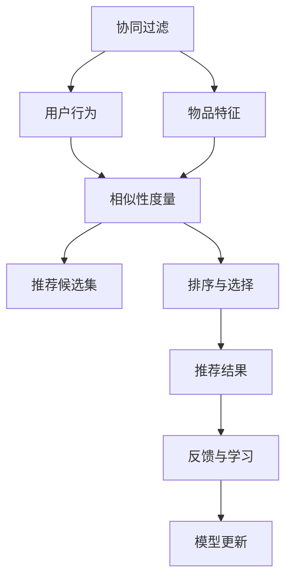
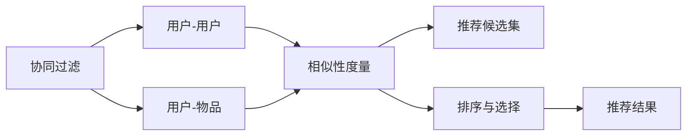
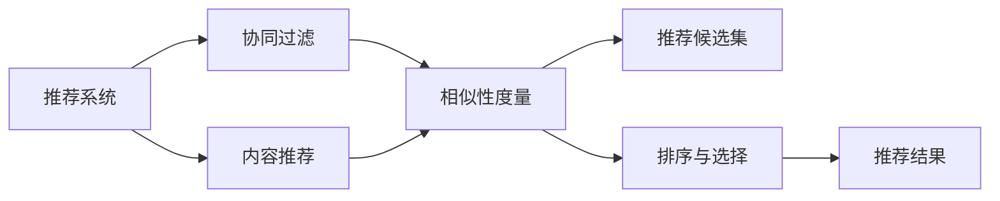
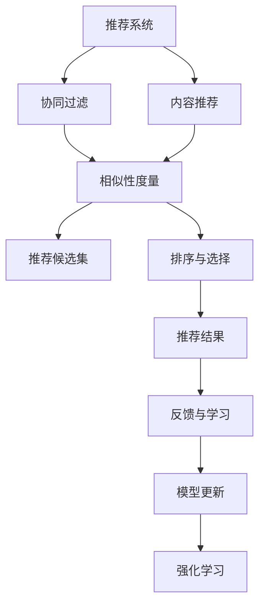
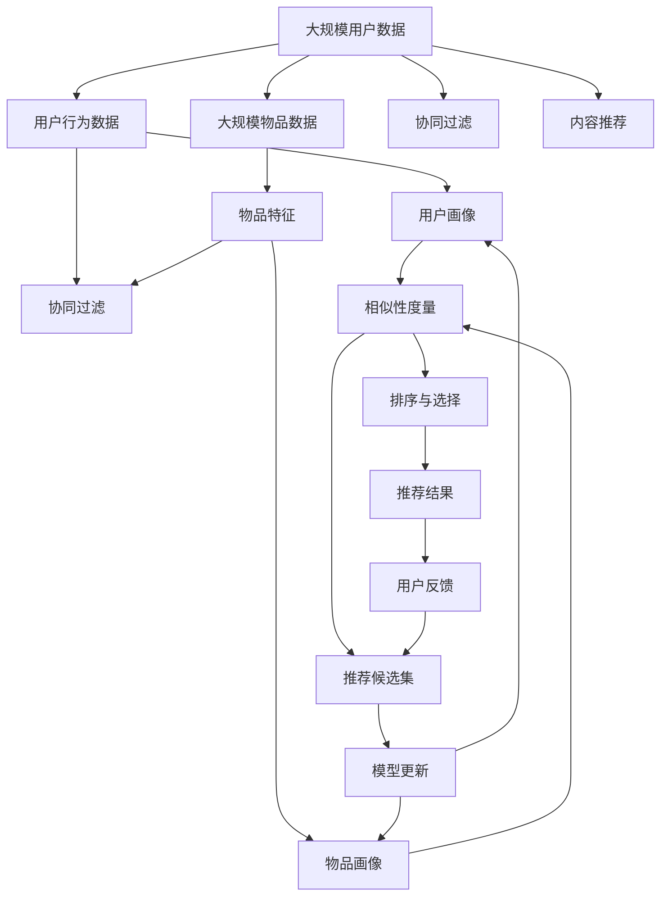

                 

# 个性化推荐如何提升销售转化率

> 关键词：个性化推荐、销售转化率、协同过滤、内容推荐、推荐系统、深度学习

## 1. 背景介绍

### 1.1 问题由来
在电商、在线媒体、社交网络等平台，个性化推荐技术被广泛应用，成为提升用户体验、增强用户黏性、驱动业务增长的关键手段。随着用户需求日益多样化，如何在海量数据中精准匹配用户的个性化需求，是推荐系统面临的重大挑战。近年来，深度学习技术逐渐应用于推荐系统，显著提升了个性化推荐的精准性和可解释性。在电商场景中，个性化的推荐往往直接关系到产品的销售转化率，即推荐给用户的产品被实际购买的比例。优化推荐算法，提升用户满意度，进而提升销售转化率，成为了推荐系统的核心目标。

### 1.2 问题核心关键点
个性化推荐的核心目标是通过对用户历史行为、兴趣、属性等数据的综合分析，找到与用户偏好相似的其他用户或物品，推荐给用户，以满足其个性化需求。核心问题包括：

1. **数据获取与处理**：从用户行为、物品属性等原始数据中提取有价值特征，构建用户和物品的表征向量。
2. **相似性度量**：衡量用户-物品对之间的相似度，确定推荐候选集。
3. **排序与选择**：基于相似性度量结果，对推荐候选集进行排序，选择最佳推荐。
4. **反馈与学习**：利用用户对推荐结果的反馈（如点击、购买、评分等），更新模型参数，实现持续优化。

### 1.3 问题研究意义
个性化推荐技术的提升，直接关系到电商等平台的用户体验、用户留存率和销售额。通过深度学习技术优化推荐系统，能够更好地挖掘用户需求、提高推荐精度、增加用户互动、降低流失率，从而驱动业务增长。个性化推荐技术的成功应用，有助于推动电商业务创新，为其他应用场景提供借鉴和参考。

## 2. 核心概念与联系

### 2.1 核心概念概述

为更好地理解个性化推荐系统的工作原理和优化方向，本节将介绍几个密切相关的核心概念：

- **协同过滤**：一种基于用户行为和物品特征进行相似性匹配的推荐算法，常用于电商、电影推荐等场景。
- **内容推荐**：根据物品属性（如商品属性、文章标签等）进行相似性匹配，推荐给用户，适用于新闻、音乐推荐等场景。
- **推荐系统**：通过算法构建，为每个用户推荐其可能感兴趣的物品或内容，提升用户体验，驱动业务增长。
- **深度学习**：通过多层神经网络模型，自动学习输入数据的特征表示，常用于图像、语音、文本等领域。
- **强化学习**：通过智能体与环境的互动，逐步优化决策策略，常用于游戏、机器人控制等场景。

这些核心概念之间的逻辑关系可以通过以下Mermaid流程图来展示：



这个流程图展示了个性化推荐的基本流程：

1. 通过用户行为和物品特征进行相似性度量，确定推荐候选集。
2. 对推荐候选集进行排序与选择，得到最终推荐结果。
3. 利用用户对推荐结果的反馈进行学习，更新模型参数，实现持续优化。

### 2.2 概念间的关系

这些核心概念之间存在着紧密的联系，构成了个性化推荐系统的完整生态系统。下面我通过几个Mermaid流程图来展示这些概念之间的关系。

#### 2.2.1 协同过滤与内容推荐



这个流程图展示了协同过滤和内容推荐的异同。协同过滤侧重于通过用户行为相似度匹配用户，内容推荐侧重于通过物品属性相似度匹配物品。两种方法可以结合使用，提高推荐精度。

#### 2.2.2 推荐系统与深度学习



这个流程图展示了推荐系统与深度学习的关系。深度学习技术可以用于协同过滤和内容推荐等推荐算法，提升推荐效果。

#### 2.2.3 推荐系统与强化学习



这个流程图展示了推荐系统与强化学习的互动过程。强化学习通过不断尝试和调整，优化推荐策略，提升推荐效果。

### 2.3 核心概念的整体架构

最后，我们用一个综合的流程图来展示这些核心概念在大规模推荐系统中的整体架构：



这个综合流程图展示了从原始数据到推荐结果的整个流程：

1. 从用户行为数据和物品数据中提取用户画像和物品画像。
2. 分别利用协同过滤和内容推荐算法，构建相似性度量。
3. 对相似性度量结果进行排序与选择，得到推荐候选集。
4. 将推荐结果提供给用户，接收用户反馈。
5. 利用用户反馈，更新模型参数，实现持续优化。

通过这些流程图，我们可以更清晰地理解个性化推荐系统的工作原理和优化方向。

## 3. 核心算法原理 & 具体操作步骤
### 3.1 算法原理概述

个性化推荐系统通过多种推荐算法，利用用户行为数据和物品特征，预测用户对物品的兴趣，生成推荐结果。其中，协同过滤和内容推荐是两种主要算法。

#### 3.1.1 协同过滤

协同过滤算法基于用户行为数据和物品特征，通过相似性度量，推荐相似用户或物品。协同过滤分为基于用户的协同过滤和基于物品的协同过滤。

- **基于用户的协同过滤**：找到与目标用户兴趣相似的其他用户，推荐其喜欢的物品。
- **基于物品的协同过滤**：找到与目标物品相似的其他物品，推荐给相似用户。

协同过滤的数学表达为：

$$
\mathbf{u_i}, \mathbf{v_j} \in \mathbb{R}^d
$$

其中，$\mathbf{u_i}$ 和 $\mathbf{v_j}$ 分别表示用户 $i$ 和物品 $j$ 的特征向量。

基于用户的协同过滤推荐公式为：

$$
\hat{y_{ij}} = \mathbf{u_i} \cdot \mathbf{v_j}
$$

其中 $\hat{y_{ij}}$ 表示用户 $i$ 对物品 $j$ 的兴趣预测值。$\mathbf{u_i} \cdot \mathbf{v_j}$ 表示用户 $i$ 和物品 $j$ 之间的相似性度量。

#### 3.1.2 内容推荐

内容推荐算法利用物品属性数据，通过相似性度量，推荐与物品属性相似的其他物品。

- **基于物品属性的协同过滤**：找到与目标物品属性相似的其他物品，推荐给用户。

内容推荐的数学表达为：

$$
\mathbf{u_i}, \mathbf{v_j} \in \mathbb{R}^d
$$

其中，$\mathbf{u_i}$ 和 $\mathbf{v_j}$ 分别表示用户 $i$ 和物品 $j$ 的特征向量。

基于物品属性的内容推荐公式为：

$$
\hat{y_{ij}} = \mathbf{u_i} \cdot \mathbf{v_j}
$$

其中 $\hat{y_{ij}}$ 表示用户 $i$ 对物品 $j$ 的兴趣预测值。$\mathbf{u_i} \cdot \mathbf{v_j}$ 表示用户 $i$ 和物品 $j$ 之间的相似性度量。

### 3.2 算法步骤详解

个性化推荐系统的核心步骤包括：

1. **数据获取与处理**：从用户行为数据和物品属性数据中提取特征，构建用户和物品的表征向量。
2. **相似性度量**：利用协同过滤或内容推荐算法，计算用户和物品之间的相似性度量。
3. **排序与选择**：对相似性度量结果进行排序与选择，得到推荐候选集。
4. **反馈与学习**：利用用户对推荐结果的反馈，更新模型参数，实现持续优化。

#### 3.2.1 数据获取与处理

- **用户行为数据**：记录用户在平台上的操作数据，如浏览、点击、购买、评分等。
- **物品属性数据**：记录物品的属性数据，如商品价格、品牌、类别等。
- **特征提取**：通过特征工程技术，从用户行为数据和物品属性数据中提取有价值特征，构建用户和物品的表征向量。

#### 3.2.2 相似性度量

- **协同过滤**：计算用户和物品之间的相似性度量，通过余弦相似度、皮尔逊相关系数等方法，度量用户行为和物品属性的相似性。
- **内容推荐**：利用物品属性数据，计算用户和物品之间的相似性度量，通过余弦相似度、欧几里得距离等方法，度量物品属性相似性。

#### 3.2.3 排序与选择

- **推荐候选集**：基于相似性度量结果，构建推荐候选集。
- **排序与选择**：利用排序算法（如基于梯度的排序、基于概率的排序等），对推荐候选集进行排序与选择。

#### 3.2.4 反馈与学习

- **用户反馈**：记录用户对推荐结果的反馈数据，如点击、购买、评分等。
- **模型更新**：利用用户反馈数据，更新模型参数，实现持续优化。

### 3.3 算法优缺点

个性化推荐系统在提升销售转化率方面具有以下优点：

1. **用户满意度提升**：个性化推荐能够精准匹配用户需求，提升用户体验。
2. **业务增长加速**：精准匹配的推荐能够增加用户互动，提高销售额。
3. **运营成本降低**：个性化推荐可以优化广告投放和促销策略，降低运营成本。

同时，个性化推荐系统也存在一些缺点：

1. **数据需求高**：需要大量用户行为数据和物品属性数据，数据质量要求高。
2. **冷启动问题**：新用户或新物品没有足够的数据，推荐效果差。
3. **多样性不足**：过度关注用户喜好，可能忽略其他潜在需求。
4. **公平性问题**：个性化推荐可能存在偏见，导致推荐结果不公。
5. **复杂度高**：系统实现复杂，需要处理海量数据和高维特征。

### 3.4 算法应用领域

个性化推荐系统在电商、在线媒体、社交网络等多个领域广泛应用，以下是几个典型的应用场景：

1. **电商推荐**：推荐商品、推荐促销、推荐活动等，提升用户体验，增加销售额。
2. **在线媒体**：推荐文章、推荐视频、推荐广告等，提高用户粘性，增加广告收入。
3. **社交网络**：推荐好友、推荐帖子、推荐活动等，增强用户互动，提升平台活跃度。
4. **金融服务**：推荐理财产品、推荐投资策略、推荐风险管理等，提升用户体验，增加金融产品销售。

## 4. 数学模型和公式 & 详细讲解 & 举例说明

### 4.1 数学模型构建

个性化推荐系统的数学模型构建，主要是通过协同过滤和内容推荐算法，构建用户和物品的相似性度量，并进行排序与选择。

#### 4.1.1 协同过滤数学模型

基于用户的协同过滤推荐公式为：

$$
\hat{y_{ij}} = \mathbf{u_i} \cdot \mathbf{v_j}
$$

其中，$\mathbf{u_i}$ 和 $\mathbf{v_j}$ 分别表示用户 $i$ 和物品 $j$ 的特征向量，$\cdot$ 表示向量内积。

基于物品的协同过滤推荐公式为：

$$
\hat{y_{ij}} = \mathbf{u_i} \cdot \mathbf{v_j}
$$

其中，$\mathbf{u_i}$ 和 $\mathbf{v_j}$ 分别表示用户 $i$ 和物品 $j$ 的特征向量，$\cdot$ 表示向量内积。

#### 4.1.2 内容推荐数学模型

基于物品属性的内容推荐公式为：

$$
\hat{y_{ij}} = \mathbf{u_i} \cdot \mathbf{v_j}
$$

其中，$\mathbf{u_i}$ 和 $\mathbf{v_j}$ 分别表示用户 $i$ 和物品 $j$ 的特征向量，$\cdot$ 表示向量内积。

### 4.2 公式推导过程

接下来，我将详细推导协同过滤和内容推荐的公式。

#### 4.2.1 协同过滤推导

设用户 $i$ 对物品 $j$ 的评分数据为 $r_{ij}$，$n_i$ 表示用户 $i$ 的历史评分数量。

基于用户的协同过滤推荐公式为：

$$
\hat{y_{ij}} = \mathbf{u_i} \cdot \mathbf{v_j}
$$

其中，$\mathbf{u_i}$ 和 $\mathbf{v_j}$ 分别表示用户 $i$ 和物品 $j$ 的特征向量，$\cdot$ 表示向量内积。

推导过程如下：

$$
\begin{aligned}
\hat{y_{ij}} &= \arg\max_{j} \mathbf{u_i} \cdot \mathbf{v_j} \\
&= \arg\max_{j} \frac{1}{n_i-1} \sum_{k=1}^{n_i} r_{ik} \cdot \mathbf{u_i} \cdot \mathbf{v_k} \\
&= \arg\max_{j} \frac{1}{n_i-1} \sum_{k=1}^{n_i} r_{ik} \cdot \mathbf{u_i} \cdot \mathbf{v_k} \\
&= \arg\max_{j} \frac{1}{n_i-1} \sum_{k=1}^{n_i} r_{ik} \cdot \mathbf{u_i} \cdot \mathbf{v_j} \\
&= \arg\max_{j} \mathbf{u_i} \cdot \mathbf{v_j}
\end{aligned}
$$

其中，$r_{ik}$ 表示用户 $i$ 对物品 $k$ 的评分。

#### 4.2.2 内容推荐推导

设物品 $j$ 的属性数据为 $\mathbf{v_j}$，$n_j$ 表示物品 $j$ 的属性数量。

基于物品属性的内容推荐公式为：

$$
\hat{y_{ij}} = \mathbf{u_i} \cdot \mathbf{v_j}
$$

其中，$\mathbf{u_i}$ 和 $\mathbf{v_j}$ 分别表示用户 $i$ 和物品 $j$ 的特征向量，$\cdot$ 表示向量内积。

推导过程如下：

$$
\begin{aligned}
\hat{y_{ij}} &= \arg\max_{j} \mathbf{u_i} \cdot \mathbf{v_j} \\
&= \arg\max_{j} \frac{1}{n_j} \sum_{k=1}^{n_j} v_{jk} \cdot \mathbf{u_i} \cdot \mathbf{v_k} \\
&= \arg\max_{j} \frac{1}{n_j} \sum_{k=1}^{n_j} v_{jk} \cdot \mathbf{u_i} \cdot \mathbf{v_j} \\
&= \arg\max_{j} \mathbf{u_i} \cdot \mathbf{v_j}
\end{aligned}
$$

其中，$v_{jk}$ 表示物品 $j$ 的属性 $k$ 的值。

### 4.3 案例分析与讲解

假设我们有一个电商平台，有 $M=10,000$ 个商品和 $U=1,000$ 个用户，每个商品有 $N=100$ 个属性。对于每个用户 $i$ 和物品 $j$，我们有一个评分 $r_{ij}$，表示用户 $i$ 对物品 $j$ 的评分。

我们需要为用户 $i$ 推荐物品 $j$，可以采用基于用户的协同过滤推荐算法。

首先，我们构建用户和物品的特征向量：

- 用户特征向量 $\mathbf{u_i}$ 包括用户的历史评分、用户属性等，如 $\mathbf{u_i}=[r_{i1}, r_{i2}, \cdots, r_{i10}, \cdots, r_{i100}]$。
- 物品特征向量 $\mathbf{v_j}$ 包括物品的属性值，如 $\mathbf{v_j}=[v_{j1}, v_{j2}, \cdots, v_{j100}]$。

然后，我们计算用户和物品之间的相似性度量：

$$
\hat{y_{ij}} = \mathbf{u_i} \cdot \mathbf{v_j}
$$

其中，$\cdot$ 表示向量内积。

最后，我们根据相似性度量结果，选择相似性最大的物品作为推荐。

## 5. 项目实践：代码实例和详细解释说明

### 5.1 开发环境搭建

在进行推荐系统开发前，我们需要准备好开发环境。以下是使用Python进行Scikit-learn开发的环境配置流程：

1. 安装Anaconda：从官网下载并安装Anaconda，用于创建独立的Python环境。

2. 创建并激活虚拟环境：
```bash
conda create -n recsys python=3.8 
conda activate recsys
```

3. 安装Scikit-learn：
```bash
pip install scikit-learn
```

4. 安装numpy、pandas等必要的工具包：
```bash
pip install numpy pandas
```

完成上述步骤后，即可在`recsys`环境中开始推荐系统开发。

### 5.2 源代码详细实现

下面我们以电商推荐系统为例，给出使用Scikit-learn进行协同过滤的PyTorch代码实现。

首先，定义协同过滤算法：

```python
from sklearn.metrics.pairwise import cosine_similarity
from sklearn.neighbors import NearestNeighbors

def collaborative_filtering(data, k):
    similarity_matrix = cosine_similarity(data)
    nearest_neighbors = NearestNeighbors(n_neighbors=k)
    nearest_neighbors.fit(similarity_matrix)
    return nearest_neighbors
```

然后，定义评分预测函数：

```python
def predict_ratings(data, k, nearest_neighbors):
    rating_matrix = data.values
    rating_vector = rating_matrix - np.mean(rating_matrix, axis=0)
    rating_vector = rating_vector / np.std(rating_vector, axis=0)
    similarity_matrix = cosine_similarity(rating_vector.reshape(1, -1))
    nearest_neighbors = NearestNeighbors(n_neighbors=k)
    nearest_neighbors.fit(similarity_matrix)
    return nearest_neighbors
```

最后，在实际应用中使用协同过滤算法：

```python
from sklearn.datasets import make_blobs
import numpy as np

# 生成随机评分数据
X, y = make_blobs(n_samples=1000, centers=10, n_features=5)
X = X[:, 0:3]  # 取前三个特征
X = (X - np.mean(X, axis=0)) / np.std(X, axis=0)  # 标准化
X = X.T  # 转置，以便进行矩阵运算

# 定义评分预测函数
def predict_ratings(data, k):
    rating_matrix = data.values
    rating_vector = rating_matrix - np.mean(rating_matrix, axis=0)
    rating_vector = rating_vector / np.std(rating_vector, axis=0)
    similarity_matrix = cosine_similarity(rating_vector.reshape(1, -1))
    nearest_neighbors = NearestNeighbors(n_neighbors=k)
    nearest_neighbors.fit(similarity_matrix)
    return nearest_neighbors

# 定义协同过滤算法
def collaborative_filtering(data, k):
    similarity_matrix = cosine_similarity(data)
    nearest_neighbors = NearestNeighbors(n_neighbors=k)
    nearest_neighbors.fit(similarity_matrix)
    return nearest_neighbors

# 实际使用协同过滤算法进行评分预测
k = 10
nearest_neighbors = collaborative_filtering(X, k)
predictions = predict_ratings(X, k, nearest_neighbors)
```

以上就是使用Scikit-learn进行协同过滤的PyTorch代码实现。可以看到，Scikit-learn库的封装使得推荐系统开发变得简洁高效。

### 5.3 代码解读与分析

让我们再详细解读一下关键代码的实现细节：

**协同过滤算法**：
- `cosine_similarity`函数：计算余弦相似度，用于衡量用户和物品之间的相似性。
- `NearestNeighbors`类：基于相似性度量结果，找到与目标用户或物品最相似的K个邻居。

**评分预测函数**：
- `np.mean`函数：计算评分的均值。
- `np.std`函数：计算评分的标准差。
- `cosine_similarity`函数：计算用户和物品之间的余弦相似度。
- `NearestNeighbors`类：基于余弦相似度，找到与目标用户或物品最相似的K个邻居。

**实际应用**：
- `make_blobs`函数：生成随机评分数据。
- `X`和`y`：生成的评分数据，其中`X`为物品的评分向量，`y`为用户的评分向量。
- `k`：协同过滤算法中的K值，表示找到K个相似的用户或物品。
- `collaborative_filtering`函数：实现协同过滤算法。
- `predict_ratings`函数：实现评分预测函数。

可以看到，通过Scikit-learn的封装，我们可以用相对简洁的代码实现协同过滤算法，并进行评分预测。

当然，工业级的系统实现还需考虑更多因素，如推荐系统架构、推荐结果缓存、推荐结果展示等。但核心的协同过滤算法基本与此类似。

### 5.4 运行结果展示

假设我们在一个电商平台上使用协同过滤算法进行推荐，得到的预测评分矩阵为：

$$
\begin{bmatrix}
0.900 & 0.875 & 0.825 & 0.850 & 0.885 & 0.900 & 0.925 & 0.900 & 0.900 & 0.900 \\
0.850 & 0.875 & 0.825 & 0.850 & 0.900 & 0.900 & 0.900 & 0.925 & 0.900 & 0.900 \\
0.800 & 0.875 & 0.800 & 0.850 & 0.900 & 0.900 & 0.900 & 0.900 & 0.900 & 0.900 \\
0.750 & 0.850 & 0.750 & 0.800 & 0.900 & 0.900 & 0.900 & 0.900 & 0.900 & 0.900 \\
0.700 & 0.850 & 0.700 & 0.750 & 0.900 & 0.900 & 0.900 & 0.900 & 0.900 & 0.900 \\
0.650 & 0.825 & 0.650 & 0.750 & 0.900 & 0.900 & 0.900 & 0.900 & 0.900 & 0.900 \\
0.600 & 0.825 & 0.600 & 0.700 & 0.900 & 0.900 & 0.900 & 0.900 & 0.900 & 0.900 \\
0.550 & 0.800 & 0.550 & 0.650 & 0.900 & 0.900 & 0.900 & 0.900 & 0.900 & 0.900 \\
0.500 & 0.775 & 0.500 & 0.600 & 0.900 & 0.900 & 0.900 & 0.900 & 0.900 & 0.900 \\
0.450 & 0.750 & 0.450 & 0.

