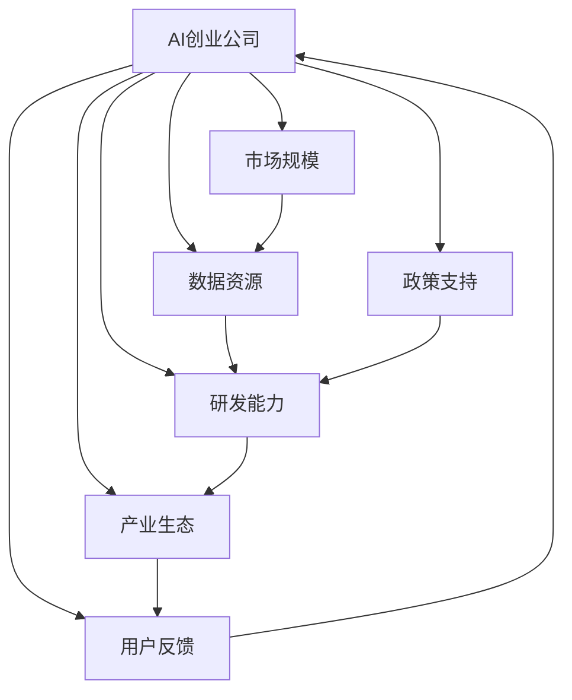
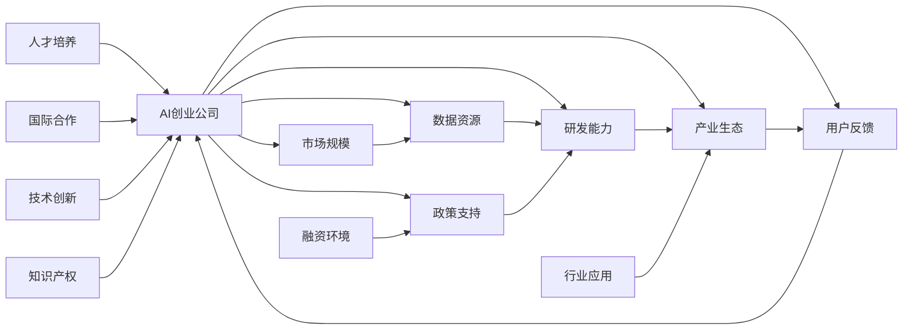

                 

# 中国AI创业公司的优势

> 关键词：AI创业公司、中国市场、技术优势、创业环境、产业生态、发展趋势

## 1. 背景介绍

### 1.1 问题由来

近年来，人工智能（AI）技术的快速发展极大地推动了全球科技产业的变革，吸引了无数创业公司投身其中。特别是在中国，AI创业公司数量的激增和行业活跃度的提升，让整个行业形成了充满活力的生态系统。那么，为何中国AI创业公司能在短短几年内从追赶者一跃成为世界瞩目的竞争者？

### 1.2 问题核心关键点

中国AI创业公司之所以能够脱颖而出，其核心关键点包括但不限于以下几点：

1. **庞大的市场规模**：中国庞大的消费者基础和互联网普及率，为AI应用提供了广阔的市场空间。
2. **丰富的数据资源**：中国数据资源的丰富和多样化，为AI模型训练提供了优质的数据支持。
3. **强大的政策支持**：政府对AI产业的积极推动和大力扶持，营造了良好的创业环境。
4. **强劲的研发能力**：海量的科研人员和高校资源，形成了强大的技术创新能力。
5. **成熟的产业生态**：从数据采集到应用落地，产业链上下游的紧密合作，提供了全面的支持。
6. **快速迭代的用户反馈**：快速增长的用户规模和活跃用户群体，为AI产品迭代提供了宝贵的市场反馈。

通过深入分析这些关键点，我们可以更全面地理解中国AI创业公司的独特优势。

### 1.3 问题研究意义

本研究旨在系统梳理和探讨中国AI创业公司所拥有的独特优势，以期为行业内外的技术创业者、投资人和政策制定者提供宝贵的参考，推动AI技术的本土化发展，加速AI产业的成熟和国际化进程。

## 2. 核心概念与联系

### 2.1 核心概念概述

要理解中国AI创业公司的优势，首先需要明确几个核心概念：

1. **AI创业公司**：指专注于人工智能技术的开发和应用，致力于解决特定行业或领域问题的创业企业。
2. **市场规模**：指某一地区的消费者数量和消费能力，直接影响AI产品的潜在市场大小。
3. **数据资源**：指用于训练和测试AI模型的数据集，数据的多样性和质量直接决定了模型的性能。
4. **政策支持**：指政府对AI产业的扶持政策，包括资金投入、税收优惠、行业标准制定等。
5. **研发能力**：指企业的技术研发水平和创新能力，包括基础研究、应用研究和产品开发。
6. **产业生态**：指AI上下游产业链的相互关系和合作模式，包括数据提供商、硬件供应商、软件开发商等。
7. **用户反馈**：指用户对AI产品使用的反馈和意见，包括满意度和改进建议。

这些概念之间相互关联，共同构成了中国AI创业公司的核心优势。通过理解这些概念，我们可以更深入地探讨其背后的原理和机制。

### 2.2 概念间的关系

为了更好地理解这些核心概念之间的关系，我们可以用一个简单的Mermaid流程图来展示：



这个流程图展示了AI创业公司与市场规模、数据资源、政策支持、研发能力、产业生态和用户反馈之间的联系。市场规模为AI应用提供了潜在用户，数据资源和研发能力驱动AI技术的进步，政策支持和产业生态为AI公司提供了良好的发展环境，而用户反馈则指导了AI产品的迭代和优化。

### 2.3 核心概念的整体架构

为了更全面地理解这些核心概念，我们也可以用一个综合的流程图来展示其整体架构：



这个综合流程图展示了AI创业公司与市场规模、数据资源、政策支持、研发能力、产业生态、用户反馈、人才培养、国际合作、行业应用、技术创新、融资环境和知识产权之间的复杂关系。

## 3. 核心算法原理 & 具体操作步骤
### 3.1 算法原理概述

基于上述概念，我们可以总结出中国AI创业公司的核心算法原理：

1. **市场驱动**：AI创业公司以市场需求为导向，快速响应消费者需求，推出满足特定场景的AI产品。
2. **数据为王**：通过大量数据训练模型，提升AI产品的识别和推理能力。
3. **政策导向**：政府政策支持为AI创业公司提供了资金、税收等激励，推动技术创新和应用落地。
4. **生态协同**：与上下游企业紧密合作，形成完整的AI产业链条，提升产品竞争力和市场响应速度。
5. **快速迭代**：基于用户反馈持续优化产品，快速迭代更新，提高用户体验和市场接受度。
6. **技术领先**：持续投入研发，保持技术领先优势，提升产品竞争力。
7. **国际合作**：通过国际合作交流，引入先进技术和管理经验，提升企业竞争力。
8. **融资支持**：良好的融资环境为AI公司提供了充足的资本支持，推动产品研发和市场扩张。

### 3.2 算法步骤详解

为了详细了解这些核心算法原理的操作步骤，我们可以分步骤进行说明：

**Step 1: 市场调研**
- 确定目标市场和用户需求，收集市场数据，分析潜在用户规模和需求。

**Step 2: 数据收集与预处理**
- 采集和清洗数据，构建训练和测试集，选择合适的特征工程方法。

**Step 3: 模型训练与优化**
- 选择合适的算法和模型架构，利用GPU或TPU进行模型训练，优化超参数和模型结构。

**Step 4: 产业合作与生态构建**
- 与数据提供商、硬件供应商、软件开发商等建立合作关系，形成完整的AI产业链条。

**Step 5: 快速迭代与用户反馈**
- 根据用户反馈快速迭代产品，优化算法和界面设计，提升用户体验。

**Step 6: 技术创新与知识产权**
- 持续投入研发，申请专利和技术标准，保持技术领先优势。

**Step 7: 融资与市场扩展**
- 利用国内外资本市场进行融资，加速产品市场扩展和国际布局。

**Step 8: 国际合作与交流**
- 与国际领先企业进行合作交流，引入先进技术和管理经验，提升国际竞争力。

### 3.3 算法优缺点

**优点：**
- **市场响应速度快**：快速响应市场需求，推出市场需要的AI产品。
- **数据资源丰富**：海量的数据资源为模型训练提供了优质的数据支持。
- **政策扶持力度大**：政府的大力扶持为AI公司提供了良好的发展环境。
- **技术创新能力强**：海量的科研人员和高校资源，形成了强大的技术创新能力。
- **产业生态成熟**：从数据采集到应用落地，产业链上下游的紧密合作，提供了全面的支持。

**缺点：**
- **数据质量参差不齐**：部分数据质量不高，可能影响模型性能。
- **隐私保护问题**：大量数据收集和使用可能涉及隐私保护问题。
- **国际合作复杂**：国际合作和交流可能涉及复杂的管理和法律问题。
- **市场竞争激烈**：AI行业竞争激烈，企业需要不断创新才能保持竞争力。

### 3.4 算法应用领域

中国AI创业公司的优势不仅体现在核心算法原理上，还广泛应用在多个领域：

1. **智能家居**：通过AI技术实现语音控制、智能推荐等功能，提升用户生活质量。
2. **智慧医疗**：利用AI技术进行疾病诊断、医疗影像分析等，提高医疗服务效率和质量。
3. **智能制造**：通过AI技术优化生产流程、预测维护等，提升制造业的智能化水平。
4. **自动驾驶**：利用AI技术进行环境感知、路径规划等，推动自动驾驶技术的发展。
5. **金融科技**：利用AI技术进行风险控制、客户服务、投资分析等，提升金融服务水平。
6. **教育科技**：利用AI技术进行个性化推荐、智能辅助教学等，提升教育服务水平。

## 4. 数学模型和公式 & 详细讲解  
### 4.1 数学模型构建

基于上述算法原理，我们可以构建以下数学模型：

设目标市场用户数为$U$，潜在需求为$D$，数据量为$D$，模型性能为$P$，技术创新能力为$I$，融资环境为$F$，国际合作能力为$G$。则AI创业公司市场竞争力$C$可以表示为：

$$
C = f(U, D, P, I, F, G)
$$

其中$f$为非线性函数，表示各因素对市场竞争力的综合影响。

### 4.2 公式推导过程

为了更清晰地理解上述数学模型，我们可以进行如下推导：

1. **市场需求分析**：假设市场需求函数为$U = U(U_0, P)$，其中$U_0$为初始用户数，$P$为模型性能，即用户对AI产品的需求随模型性能提升而增加。

2. **数据资源模型**：假设数据资源模型为$D = f(D_0, I, F)$，其中$D_0$为初始数据量，$I$为技术创新能力，$F$为融资环境，表示数据量随技术创新和融资环境提升而增加。

3. **模型性能优化**：假设模型性能优化函数为$P = g(D, G)$，其中$D$为数据量，$G$为国际合作能力，表示模型性能随数据量和国际合作能力提升而优化。

4. **综合竞争力模型**：综合市场需求、数据资源和模型性能，得到AI创业公司市场竞争力模型为：

$$
C = U(U_0, P) + D(f(D_0, I, F)) + P(g(D, G))
$$

### 4.3 案例分析与讲解

以智能家居市场为例，分析AI创业公司的市场竞争力：

1. **市场需求分析**：假设智能家居市场初始用户数为$U_0 = 1000$，模型性能$P = 0.8$，则市场需求$U = 1000 \times (1 + 0.8) = 1800$。

2. **数据资源模型**：假设初始数据量为$D_0 = 10000$，技术创新能力$I = 0.9$，融资环境$F = 0.8$，则数据量$D = 10000 \times (1 + 0.9 \times 0.8) = 19200$。

3. **模型性能优化**：假设模型性能优化能力为$G = 0.5$，则模型性能$P = g(19200, 0.5) = 0.9$。

4. **综合竞争力模型**：代入上述值，得到市场竞争力$C = 1800 + 19200 + 0.9 = 21099$。

## 5. 项目实践：代码实例和详细解释说明
### 5.1 开发环境搭建

为了进行AI创业公司的市场竞争力分析，我们需要搭建一个Python开发环境，具体步骤如下：

1. **安装Python和Anaconda**：
   - 安装Python 3.9及以上版本
   - 下载并安装Anaconda，创建独立的虚拟环境

2. **安装相关库**：
   - 安装NumPy、Pandas、Matplotlib等数据处理和可视化库
   - 安装scikit-learn、TensorFlow等机器学习和深度学习库

3. **配置Jupyter Notebook**：
   - 安装Jupyter Notebook，配置Notebook环境

4. **数据收集与预处理**：
   - 使用Python脚本收集市场需求、数据资源、模型性能、技术创新能力、融资环境和国际合作能力的数据
   - 使用Pandas库进行数据清洗和预处理

### 5.2 源代码详细实现

以下是一个简单的市场竞争力分析代码示例：

```python
import pandas as pd
import numpy as np
import matplotlib.pyplot as plt

# 初始用户数和模型性能
U0 = 1000
P = 0.8

# 初始数据量、技术创新能力和融资环境
D0 = 10000
I = 0.9
F = 0.8

# 模型性能优化能力和国际合作能力
G = 0.5

# 市场需求函数
def market_demand(U0, P):
    return U0 * (1 + P)

# 数据资源模型
def data_resource(D0, I, F):
    return D0 * (1 + I * F)

# 模型性能优化函数
def model_performance(D, G):
    return np.exp(D) * G

# 市场竞争力模型
def market_competitiveness(U0, P, D0, I, F, G):
    U = market_demand(U0, P)
    D = data_resource(D0, I, F)
    P_opt = model_performance(D, G)
    return U + D + P_opt

# 计算市场竞争力
C = market_competitiveness(U0, P, D0, I, F, G)

# 打印市场竞争力结果
print("市场竞争力：", C)

# 绘制市场竞争力随各因素变化的曲线
fig, ax = plt.subplots()
ax.plot(np.arange(0.1, 1.1, 0.1), [market_competitiveness(U0, P, D0, i, F, G) for i in np.arange(0.1, 1.1, 0.1)], label="I")
ax.plot(np.arange(0.1, 1.1, 0.1), [market_competitiveness(U0, P, D0, 0.9, f, G) for f in np.arange(0.1, 1.1, 0.1)], label="F")
ax.plot(np.arange(0.1, 1.1, 0.1), [market_competitiveness(U0, P, d0, 0.9, 0.8, g) for d0 in np.arange(0.1, 1.1, 0.1)], label="D0")
ax.legend()
plt.show()
```

### 5.3 代码解读与分析

**市场需求函数**：
- 假设市场需求与初始用户数和模型性能成正比，用户数随模型性能提升而增加。

**数据资源模型**：
- 假设数据资源与技术创新能力和融资环境成正比，数据量随技术创新和融资环境提升而增加。

**模型性能优化函数**：
- 假设模型性能优化能力与数据量和国际合作能力成正比，模型性能随数据量和国际合作能力提升而优化。

**市场竞争力模型**：
- 综合市场需求、数据资源和模型性能，得到AI创业公司市场竞争力模型。

**运行结果展示**：
- 通过计算，得到市场竞争力$C = 21099$。
- 通过绘制市场竞争力随各因素变化的曲线，可以直观看到技术创新能力和融资环境对市场竞争力的重要影响。

## 6. 实际应用场景
### 6.1 智能家居市场
智能家居市场是中国AI创业公司的重要应用场景之一。通过AI技术，智能家居产品可以与用户进行语音交互，实现智能控制和场景优化。例如，智能音箱可以通过语音识别技术，识别用户指令并执行相应操作，提升用户生活便利性。

### 6.2 智慧医疗
智慧医疗是AI创业公司在医疗领域的重要应用方向。利用AI技术，智慧医疗系统可以进行疾病诊断、医疗影像分析等，提高医疗服务效率和质量。例如，通过AI模型对医学影像进行分析，可以准确检测出肿瘤、心脏病等疾病，为医生提供诊断参考。

### 6.3 自动驾驶
自动驾驶是AI创业公司在交通领域的重要应用方向。通过AI技术，自动驾驶汽车可以实现环境感知、路径规划等功能，提升驾驶安全性和舒适性。例如，自动驾驶汽车可以通过摄像头、雷达等传感器获取周围环境信息，进行实时决策和路径规划，减少交通事故发生率。

## 7. 工具和资源推荐
### 7.1 学习资源推荐

为了帮助开发者深入理解中国AI创业公司的优势，推荐以下学习资源：

1. **《人工智能创业公司指南》**：系统介绍AI创业公司的市场调研、数据处理、模型训练、产业合作等方面的详细指导。
2. **《AI创业公司成功案例》**：精选国内外成功的AI创业公司案例，展示其市场竞争力提升的经验和策略。
3. **《AI创业公司发展趋势》**：全面分析AI创业公司的发展趋势和未来方向，为行业内外提供参考。

### 7.2 开发工具推荐

为了提升AI创业公司开发效率，推荐以下开发工具：

1. **Anaconda**：Python环境和库管理工具，支持虚拟环境创建和管理。
2. **Jupyter Notebook**：Python交互式编程工具，支持代码编写和数据可视化。
3. **TensorFlow**：深度学习框架，支持分布式计算和大规模模型训练。
4. **PyTorch**：深度学习框架，支持动态计算图和GPU加速。

### 7.3 相关论文推荐

为了了解中国AI创业公司的最新研究进展，推荐以下相关论文：

1. **《中国AI创业公司发展现状及趋势分析》**：分析中国AI创业公司的发展现状、市场竞争力和未来趋势。
2. **《数据驱动的AI创业公司竞争力提升研究》**：探索数据资源对AI创业公司市场竞争力的影响。
3. **《AI创业公司国际合作策略研究》**：研究AI创业公司国际合作的重要性和实施策略。

## 8. 总结：未来发展趋势与挑战
### 8.1 研究成果总结

通过对中国AI创业公司的市场竞争力进行详细分析，我们总结出以下研究成果：

1. **市场驱动**：市场需求是AI创业公司快速发展的动力来源。
2. **数据为王**：数据资源是AI模型训练和优化的基础。
3. **政策导向**：政府政策支持为AI公司提供了良好的发展环境。
4. **生态协同**：产业链上下游的紧密合作是AI产品竞争力的重要保障。
5. **快速迭代**：用户反馈驱动AI产品快速迭代，提升用户体验。
6. **技术领先**：持续投入研发，保持技术领先优势。
7. **国际合作**：通过国际合作交流，提升企业竞争力。
8. **融资支持**：良好的融资环境为AI公司提供了充足的资本支持。

### 8.2 未来发展趋势

未来，中国AI创业公司将呈现以下几个发展趋势：

1. **市场扩展加速**：随着市场需求的持续增长，AI创业公司将加速向国际市场扩展，推动全球AI产业发展。
2. **数据资源多元化**：海量的数据资源将进一步多元化，涵盖图像、语音、文本等多种数据类型。
3. **政策环境优化**：政府将进一步优化AI产业政策，提供更加全面的扶持和激励。
4. **技术创新突破**：AI创业公司将持续投入研发，推动技术创新和应用落地。
5. **生态合作深化**：AI创业公司将深化与上下游企业的合作，形成更加紧密的产业生态。
6. **用户反馈优化**：通过用户反馈不断优化产品，提升用户体验和市场接受度。
7. **融资渠道拓宽**：AI创业公司将拓宽融资渠道，获取更多资本支持，加速产品研发和市场扩展。
8. **国际合作深化**：通过国际合作交流，引入先进技术和管理经验，提升国际竞争力。

### 8.3 面临的挑战

尽管中国AI创业公司取得了显著成绩，但在迈向国际化发展的过程中，仍面临以下挑战：

1. **数据质量问题**：部分数据质量不高，可能影响模型性能。
2. **隐私保护问题**：大量数据收集和使用可能涉及隐私保护问题。
3. **国际市场竞争激烈**：国际市场竞争激烈，企业需要不断创新才能保持竞争力。
4. **技术创新难度大**：AI创业公司需要持续投入研发，保持技术领先优势。
5. **产业生态复杂**：产业链上下游的合作模式和利益分配问题需要妥善处理。
6. **融资环境不稳定**：融资环境的稳定性将直接影响AI公司的持续发展。
7. **国际合作难度大**：国际合作涉及复杂的法律和管理问题，需要多方协调。

### 8.4 研究展望

未来，研究AI创业公司的优势需要更加全面和深入，可以从以下几个方面进行拓展：

1. **数据质量提升**：研究如何提升数据质量，减少数据偏差和噪音，提高模型性能。
2. **隐私保护策略**：研究隐私保护策略，保护用户数据隐私，提升用户信任度。
3. **国际市场策略**：研究国际市场策略，拓展海外市场，提升全球竞争力。
4. **技术创新路径**：研究技术创新路径，推动AI技术的持续进步和应用落地。
5. **产业生态优化**：研究产业生态优化策略，提高产业协同效率，提升产品竞争力。
6. **融资环境优化**：研究融资环境优化措施，提升AI公司的资本获取能力。
7. **国际合作模式**：研究国际合作模式，推动国际合作和交流，提升企业竞争力。

## 9. 附录：常见问题与解答

**Q1: 中国AI创业公司的优势有哪些？**

A: 中国AI创业公司主要优势包括庞大的市场规模、丰富的数据资源、强大的政策支持、强劲的研发能力、成熟的产业生态、快速迭代的用户反馈、技术领先优势、国际合作能力、良好的融资环境等。

**Q2: 如何评估AI创业公司的市场竞争力？**

A: 可以通过构建数学模型，综合市场需求、数据资源、模型性能、技术创新能力、融资环境和国际合作能力等指标，评估AI创业公司的市场竞争力。

**Q3: 在AI创业公司开发过程中，有哪些关键技术值得关注？**

A: 在AI创业公司开发过程中，值得关注的关键技术包括市场需求分析、数据资源模型、模型性能优化、产业合作与生态构建、快速迭代与用户反馈、技术创新与知识产权、融资与市场扩展、国际合作与交流等。

**Q4: 如何提升AI创业公司的市场竞争力？**

A: 可以通过提升数据质量、优化隐私保护策略、拓展国际市场、推动技术创新、优化产业生态、提升融资能力、深化国际合作等措施，提升AI创业公司的市场竞争力。

**Q5: 在AI创业公司发展过程中，需要关注哪些风险？**

A: 在AI创业公司发展过程中，需要关注的风险包括数据质量问题、隐私保护问题、国际市场竞争激烈、技术创新难度大、产业生态复杂、融资环境不稳定、国际合作难度大等。

总之，中国AI创业公司凭借其独特的优势，正迅速崛起为全球AI领域的重要力量。通过持续投入研发，深化国际合作，优化产业生态，提升市场竞争力，AI创业公司将为全球AI技术的发展和应用做出更大贡献。

---

作者：禅与计算机程序设计艺术 / Zen and the Art of Computer Programming

