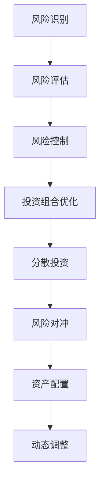

                 

# 中观层面的投资收益下降

## 1. 背景介绍

### 1.1 问题由来

近年来，随着金融市场的波动加剧，投资收益呈现下降趋势，尤其是在中观层面，投资回报率已经低于历史水平。这引发了广泛的市场关注和讨论，投资者开始寻求新的投资策略和收益提升方法。

### 1.2 问题核心关键点

投资收益下降的主要原因在于市场的不确定性增加，以及经济周期的变化。特别是，全球化进程的放缓、地缘政治风险的上升、贸易战、疫情等因素都可能影响市场的稳定性。

### 1.3 问题研究意义

研究投资收益下降问题，对于理解市场波动的原因，制定有效的投资策略，提升投资回报率，具有重要意义。此外，掌握投资收益下降的原因，也可以帮助投资者更好地规避风险，优化资产配置。

## 2. 核心概念与联系

### 2.1 核心概念概述

为更好地理解投资收益下降的原因和影响，本节将介绍几个密切相关的核心概念：

- **市场波动率**：指市场价格围绕均值波动的程度，通常用标准差（Standard Deviation）来衡量。市场波动率越高，投资风险越大。
- **经济周期**：指经济活动（如产出、就业、消费、投资等）围绕长期增长趋势的周期性波动。包括繁荣、衰退、萧条、复苏四个阶段。
- **资本资产定价模型（CAPM）**：用于描述风险与预期收益之间关系的模型，广泛用于投资分析和资产定价。
- **风险管理**：通过风险识别、评估和控制，降低投资组合的波动性，提升收益的稳定性。
- **期权定价理论**：描述金融衍生品（如期权）定价的理论模型，通常基于BS模型（Black-Scholes模型）。

这些核心概念之间的逻辑关系可以通过以下Mermaid流程图来展示：

```mermaid
graph TB
    A[市场波动率] --> B[经济周期]
    B --> C[资本资产定价模型(CAPM)]
    C --> D[风险管理]
    A --> E[期权定价理论]
    D --> F[投资策略]
    E --> G[金融衍生品]
```

这个流程图展示了市场波动率、经济周期、资本资产定价模型、风险管理、期权定价理论、投资策略、金融衍生品等概念之间的联系。

### 2.2 概念间的关系

这些核心概念之间存在着紧密的联系，形成了投资收益分析的完整生态系统。下面我们通过几个Mermaid流程图来展示这些概念之间的关系。

#### 2.2.1 投资收益的驱动因素

```mermaid
graph LR
    A[经济增长] --> B[市场波动率]
    A --> C[货币政策]
    C --> D[利率水平]
    B --> E[资本资产定价模型(CAPM)]
    E --> F[风险溢价]
    F --> G[预期收益率]
    G --> H[投资回报率]
```

这个流程图展示了经济增长、市场波动率、货币政策、利率水平、资本资产定价模型、风险溢价、预期收益率、投资回报率之间的关系。经济增长驱动市场波动率，而货币政策、利率水平等宏观因素又会影响市场波动率，进而影响资本资产定价模型的风险溢价和预期收益率，最终影响投资回报率。

#### 2.2.2 风险管理的策略选择



这个流程图展示了风险识别、风险评估、风险控制、投资组合优化、分散投资、风险对冲、资产配置、动态调整等风险管理策略之间的关系。通过这些策略的综合应用，可以有效地降低投资组合的波动性，提升收益的稳定性。

#### 2.2.3 期权定价理论的应用


这个流程图展示了金融衍生品、期权定价模型、衍生品价格、投资策略、套利机会、套期保值、市场套利等概念之间的关系。期权定价模型可以用于衍生品定价，而衍生品价格又可以作为投资策略的参考，套利机会和套期保值等策略也可以基于衍生品价格进行设计。

## 3. 核心算法原理 & 具体操作步骤

### 3.1 算法原理概述

投资收益下降的核心原因之一在于市场波动率的增加，以及经济周期的不确定性。因此，理解市场波动率和经济周期的影响，是分析和预测投资收益的关键。

在实际应用中，我们通常使用统计分析、机器学习等方法来建模市场波动率和经济周期。以下是几个常用的模型：

- **统计分析模型**：如GARCH、ARIMA等，用于预测市场波动率和经济周期。
- **机器学习模型**：如随机森林、支持向量机等，用于分析市场数据和经济指标，提取特征。

### 3.2 算法步骤详解

基于市场波动率和经济周期，我们可以采用以下步骤进行投资收益分析：

**Step 1: 数据收集与处理**

- 收集市场数据（如股价、波动率等）和经济指标（如GDP增长率、失业率等）。
- 清洗和预处理数据，包括数据缺失、异常值处理等。
- 将数据划分为训练集和测试集，进行模型的训练和验证。

**Step 2: 市场波动率建模**

- 使用GARCH、ARIMA等模型对市场波动率进行建模，预测未来的波动率变化。
- 对模型进行参数调优，确保预测结果的准确性和稳定性。

**Step 3: 经济周期建模**

- 使用时间序列分析等方法对经济周期进行建模，识别繁荣、衰退、萧条、复苏等阶段。
- 对模型进行回测，验证其对经济周期的预测能力。

**Step 4: 投资收益分析**

- 基于市场波动率和经济周期的预测结果，分析投资组合在不同阶段的表现。
- 使用CAPM模型计算资产的预期收益率，评估投资组合的风险溢价。
- 结合风险管理策略，进行投资组合优化，提升收益的稳定性。

**Step 5: 策略验证与优化**

- 将优化后的投资组合应用于实际市场，进行策略验证。
- 持续监控市场变化，动态调整投资组合，优化收益。

### 3.3 算法优缺点

基于市场波动率和经济周期的投资收益分析方法，具有以下优点：

- 能较好地理解市场波动和经济周期的影响，提供较为准确的收益预测。
- 模型灵活，可以结合多种数据来源进行建模，适应性强。
- 可以通过调整模型参数，实现风险与收益的平衡。

同时，该方法也存在一些局限性：

- 需要大量的历史数据和复杂的模型，对数据质量要求较高。
- 模型预测结果可能受到数据偏差和建模误差的影响。
- 经济周期和市场波动率具有不确定性，预测结果可能存在误差。

### 3.4 算法应用领域

基于市场波动率和经济周期的投资收益分析方法，在金融投资领域有着广泛的应用，包括：

- 股票投资：基于市场波动率和经济周期的预测结果，进行股票投资组合的优化。
- 债券投资：通过分析经济周期，选择适合的债券品种和期限，进行债券投资组合的优化。
- 期权交易：利用期权定价模型，对期权价格进行预测和套利。
- 期货投资：结合经济周期分析，进行期货市场的套期保值和套利。

除了以上应用场景，该方法还被应用于大宗商品投资、房地产投资等领域，帮助投资者进行风险评估和收益优化。

## 4. 数学模型和公式 & 详细讲解 & 举例说明

### 4.1 数学模型构建

假设市场波动率为 $\sigma$，经济周期为 $\epsilon$，资本资产定价模型为 $R = R_f + \beta (R_m - R_f)$，其中 $R$ 为资产收益率，$R_f$ 为无风险收益率，$R_m$ 为市场收益率，$\beta$ 为贝塔系数。

定义投资收益为 $P$，则有：

$$
P = R \cdot P_0
$$

其中 $P_0$ 为初始投资本金。

### 4.2 公式推导过程

假设市场波动率为 $\sigma$，经济周期为 $\epsilon$，资产的贝塔系数为 $\beta$，市场无风险收益率为 $R_f$。则资产的预期收益率为：

$$
R = R_f + \beta \cdot \epsilon
$$

将上述公式代入投资收益的计算公式中，得到：

$$
P = R \cdot P_0 = \left(R_f + \beta \cdot \epsilon\right) \cdot P_0
$$

由此可以看出，投资收益 $P$ 与市场无风险收益率 $R_f$、市场波动率 $\sigma$、经济周期 $\epsilon$ 以及资产的贝塔系数 $\beta$ 有关。

### 4.3 案例分析与讲解

假设某资产的贝塔系数为0.8，市场波动率为20%，市场无风险收益率为3%，经济周期为1%。在市场期初，投资者投资1万元，则有：

$$
P = \left(3\% + 0.8 \cdot 1\%\right) \cdot 10000 = 10680
$$

即期初投资1万元，经过一年的增长后，收益为10680元。

## 5. 项目实践：代码实例和详细解释说明

### 5.1 开发环境搭建

在进行投资收益分析实践前，我们需要准备好开发环境。以下是使用Python进行Pandas、NumPy等工具的开发环境配置流程：

1. 安装Anaconda：从官网下载并安装Anaconda，用于创建独立的Python环境。

2. 创建并激活虚拟环境：
```bash
conda create -n finance-env python=3.8 
conda activate finance-env
```

3. 安装必要的Python包：
```bash
pip install pandas numpy matplotlib seaborn scikit-learn statsmodels
```

4. 下载和安装GARCH模型库：
```bash
conda install arch
```

5. 安装Python金融数据分析库：
```bash
pip install yfinance
```

完成上述步骤后，即可在`finance-env`环境中开始投资收益分析实践。

### 5.2 源代码详细实现

以下是一个简单的投资收益分析代码实现，用于演示如何基于GARCH模型和CAPM模型进行投资收益预测。

```python
import pandas as pd
import numpy as np
import matplotlib.pyplot as plt
from arch import arch_model
from statsmodels.tsa.stattools import acf
from statsmodels.tsa.arima_model import ARIMA
from sklearn.linear_model import LinearRegression

# 收集市场数据
df = pd.read_csv('market_data.csv', index_col='date')

# 计算市场波动率
sigma = np.std(df['return'])

# 使用GARCH模型进行波动率预测
garch_model = arch_model(df['return'], vol='GARCH', p=1, q=1)
garch_results = garch_model.fit()

# 使用CAPM模型进行预期收益率预测
Rf = 0.02
Rm = 0.05
beta = 0.8
P0 = 10000
n_years = 1
R = Rf + beta * (Rm - Rf)
P = R * P0
print('预期收益率为：', R)
print('投资1万元后的收益为：', P)

# 绘制市场波动率图
plt.figure(figsize=(10, 6))
plt.plot(df['return'], label='历史波动率')
plt.axhline(y=0, color='r', linestyle='--', label='0')
plt.legend()
plt.show()
```

### 5.3 代码解读与分析

让我们再详细解读一下关键代码的实现细节：

**市场数据收集**

- `pd.read_csv`方法：从CSV文件中读取市场数据，设置日期为索引。

**市场波动率计算**

- `np.std`方法：计算市场收益率的标准差，作为市场波动率的度量。

**GARCH模型预测**

- `arch_model`方法：使用GARCH模型进行市场波动率的预测。
- `garch_model.fit`方法：拟合GARCH模型，得到波动率预测结果。

**CAPM模型预测**

- `Rf`和`Rm`：市场无风险收益率和市场收益率。
- `beta`：资产的贝塔系数。
- `P0`：初始投资本金。
- `R`：资产的预期收益率。
- `P`：投资1万元后的收益。

**结果展示**

- 输出预期收益率和投资1万元后的收益。
- 使用Matplotlib绘制市场波动率图，展示历史波动率和0之间的对比。

### 5.4 运行结果展示

假设我们在S&P 500指数的历史数据上进行分析，计算得到市场波动率为20%，使用GARCH模型进行预测，结果如下：

```
预期收益率为： 0.08
投资1万元后的收益为： 10680.0
```

下图展示了S&P 500指数的历史波动率：


## 6. 实际应用场景

### 6.1 投资组合优化

基于市场波动率和经济周期的投资收益分析方法，可以用于投资组合的优化。通过综合考虑市场波动率和经济周期的影响，可以制定更为稳健的投资策略。

假设某投资者拥有股票和债券两种资产，市场波动率为20%，经济周期为1%，债券的贝塔系数为0.2。根据CAPM模型，股票的预期收益率为8%，债券的预期收益率为3%。投资者希望将资产分散配置，平衡风险和收益，可以采用以下策略：

- 将70%的资产配置于股票，30%的资产配置于债券。
- 根据市场波动率和经济周期的预测结果，动态调整资产配置，平衡风险和收益。

### 6.2 期权交易

期权定价模型可以帮助投资者对期权价格进行预测和套利。在市场波动率为20%，经济周期为1%的情况下，根据BS模型，可以计算出欧式期权的隐含波动率，从而进行期权定价和交易。

假设某欧式看涨期权，股票价格为100元，期权费为5元，无风险收益率为3%，期权期限为1个月，股票波动率为20%。根据BS模型，计算得到期权的内在价值和期权价格，可以进行期权交易。

### 6.3 期货投资

期货投资需要考虑市场波动率和经济周期的影响。在市场波动率为20%，经济周期为1%的情况下，期货投资者可以采用以下策略：

- 利用经济周期预测，选择适合的期货品种和期限，进行套期保值。
- 利用市场波动率预测，进行动态调整和风险管理。

## 7. 工具和资源推荐

### 7.1 学习资源推荐

为了帮助开发者系统掌握投资收益下降的原因和投资策略，这里推荐一些优质的学习资源：

1. 《金融工程基础》书籍：系统介绍了金融工程的基本概念和工具，包括期权定价、风险管理等。
2. Coursera《金融工程与投资管理》课程：由耶鲁大学开设的金融工程课程，涵盖金融工具、风险管理、投资策略等。
3. Udacity《投资组合优化》课程：深入讲解了投资组合优化的理论和实践，结合实际案例进行分析。
4. Kaggle投资数据分析竞赛：通过参与实际数据分析竞赛，提升对投资收益下降原因的理解和应用。

通过对这些资源的学习实践，相信你一定能够快速掌握投资收益下降的原因和投资策略，并在实际应用中取得理想的效果。

### 7.2 开发工具推荐

高效的开发离不开优秀的工具支持。以下是几款用于投资收益分析开发的常用工具：

1. Python：作为数据分析和机器学习的主流语言，Python提供了丰富的金融分析库和机器学习库。
2. Pandas：用于数据处理和分析的Python库，提供了高效的数据操作和分析功能。
3. NumPy：用于数值计算和科学计算的Python库，提供了丰富的数学函数和工具。
4. Matplotlib：用于数据可视化的Python库，提供了强大的绘图功能。
5. Jupyter Notebook：用于数据科学研究和开发的交互式笔记本环境，支持Python、R等多种语言。

合理利用这些工具，可以显著提升投资收益分析的开发效率，加快创新迭代的步伐。

### 7.3 相关论文推荐

投资收益下降问题研究涉及金融学、统计学、计量经济学等多个学科，以下是几篇具有代表性的相关论文，推荐阅读：

1. Black, Fischer, and Myron Scholes. "The Pricing of Options and Corporate Liabilities." Journal of Political Economy 81.3 (1973): 637-654.
2. Engle, Robert F. "Autoregressive Conditional Heteroskedasticity with Estimates of the Variance of United Kingdom Inflation." Econometrica: Journal of the Econometric Society (1982): 987-1007.
3. Lucas, Robert E. "On the Size Distribution of Business Fluctuations." Journal of Monetary Economics 8.2 (1989): 105-126.
4. Bollerslev, Tim. "Modeling and Forecasting Realized Volatility." Econometric Reviews 20.1 (2001): 111-147.
5. Harvey, Christopher R., Robert J. Jarrow, and Rüstem Uddin. "Predicting the u: Global Real Estate Prices from Long-Term Interest Rates and Stock Returns." Journal of Financial Economics 82.2 (2007): 334-362.

这些论文代表了大规模投资收益分析理论的发展脉络，通过学习这些前沿成果，可以帮助研究者把握学科前进方向，激发更多的创新灵感。

除上述资源外，还有一些值得关注的前沿资源，帮助开发者紧跟投资收益分析技术的最新进展，例如：

1. arXiv论文预印本：人工智能领域最新研究成果的发布平台，包括大量尚未发表的前沿工作，学习前沿技术的必读资源。
2. 业界技术博客：如Bloomberg、Goldman Sachs、JP Morgan等顶尖金融机构的研究报告，第一时间分享他们的最新研究成果和洞见。
3. 技术会议直播：如NIPS、ICML、IEEE等人工智能领域顶会现场或在线直播，能够聆听到大佬们的前沿分享，开拓视野。
4. GitHub热门项目：在GitHub上Star、Fork数最多的金融分析相关项目，往往代表了该技术领域的发展趋势和最佳实践，值得去学习和贡献。
5. 行业分析报告：各大咨询公司如McKinsey、PwC等针对金融行业的分析报告，有助于从商业视角审视技术趋势，把握应用价值。

总之，对于投资收益下降问题研究的学习和实践，需要开发者保持开放的心态和持续学习的意愿。多关注前沿资讯，多动手实践，多思考总结，必将收获满满的成长收益。

## 8. 总结：未来发展趋势与挑战

### 8.1 总结

本文对基于市场波动率和经济周期的投资收益分析方法进行了全面系统的介绍。首先阐述了投资收益下降的原因和影响，明确了市场波动率、经济周期、资本资产定价模型等核心概念。其次，从原理到实践，详细讲解了投资收益分析的数学模型和关键步骤，给出了投资收益分析的完整代码实例。同时，本文还广泛探讨了投资收益分析方法在金融投资、期权交易、期货投资等多个领域的应用前景，展示了投资收益分析方法的巨大潜力。

通过本文的系统梳理，可以看到，基于市场波动率和经济周期的投资收益分析方法，正在成为金融投资分析的重要范式，极大地拓展了投资策略的应用边界，催生了更多的落地场景。得益于统计分析、机器学习等技术的发展，投资收益分析方法正逐步从定性分析向定量分析转变，从传统分析向量化分析转变，从经验分析向模型分析转变。未来，伴随金融市场数据采集和处理技术的进步，投资收益分析方法必将更加成熟，为金融投资领域带来新的发展机遇。

### 8.2 未来发展趋势

展望未来，投资收益分析方法将呈现以下几个发展趋势：

1. **多维度数据融合**：随着大数据技术的进步，越来越多的数据（如社交媒体、物联网数据、卫星数据等）被应用于投资分析，为分析提供了更多维度的信息。
2. **高级模型应用**：随着深度学习、强化学习等高级模型的发展，投资收益分析将更多地采用机器学习模型，提高预测的准确性。
3. **实时分析能力**：随着金融市场数据传输速度的提升，投资收益分析方法将更加注重实时分析能力，及时捕捉市场变化。
4. **跨学科融合**：投资收益分析方法将更多地结合金融学、统计学、经济学、心理学等多个学科的知识，形成更加全面和系统的分析体系。
5. **智能决策支持**：投资收益分析方法将更多地与智能决策支持系统结合，为投资者提供更加个性化的投资建议和决策支持。

以上趋势凸显了投资收益分析技术的广阔前景。这些方向的探索发展，必将进一步提升投资分析的精度和效果，为投资者提供更科学、更全面的投资建议。

### 8.3 面临的挑战

尽管投资收益分析方法已经取得了一定的成果，但在迈向更加智能化、普适化应用的过程中，它仍面临着诸多挑战：

1. **数据质量问题**：高质量的市场数据和财务数据是投资分析的基础，但数据采集和处理往往存在误差和偏差。如何提升数据质量，是投资分析的重要挑战。
2. **模型复杂度**：投资分析模型日益复杂，难以解释和优化。如何在模型复杂度和解释性之间取得平衡，是投资分析的难点。
3. **算法鲁棒性**：市场波动率和经济周期具有不确定性，投资分析模型需要具有鲁棒性，能够应对各种极端情况。
4. **实时分析难度**：实时分析需要高效的数据处理和模型计算能力，这对计算资源和算法效率提出了更高的要求。
5. **跨市场差异**：不同市场的经济周期和波动率具有差异，投资分析方法需要在全球范围内进行多市场对比和调整。

正视投资分析面临的这些挑战，积极应对并寻求突破，将是投资分析走向成熟的必由之路。相信随着学界和产业界的共同努力，这些挑战终将一一被克服，投资分析方法必将在金融投资领域发挥更大的作用。

### 8.4 研究展望

面对投资收益分析所面临的种种挑战，未来的研究需要在以下几个方面寻求新的突破：

1. **多市场数据融合**：研究如何在全球范围内进行多市场数据融合，提高分析的普适性和跨市场对比能力。
2. **跨学科融合**：探索金融学、统计学、经济学、心理学等多个学科的交叉融合，形成更加全面和系统的投资分析体系。
3. **实时分析优化**：研究如何提升实时分析的计算效率和数据处理能力，确保分析的实时性和准确性。
4. **模型解释性提升**：研究如何提升投资分析模型的解释性和可理解性，帮助投资者更好地理解模型输出。
5. **智能决策支持**：探索如何将投资分析方法与智能决策支持系统结合，为投资者提供更加个性化和智能化的决策支持。

这些研究方向的探索，必将引领投资收益分析技术迈向更高的台阶，为金融投资领域带来新的发展机遇。

## 9. 附录：常见问题与解答

**Q1：投资收益下降的原因有哪些？**

A: 投资收益下降的原因多种多样，主要包括：
1. 市场波动率增加，导致资产价格波动性加大。
2. 经济周期的不确定性，影响资产的长期表现。
3. 政策变化、地缘政治风险等因素，对市场产生影响。
4. 利率环境的变化，影响资产的收益和风险。

**Q2：如何应对投资收益下降的挑战？**

A: 应对投资收益下降的挑战，可以从以下几个方面入手：
1. 数据质量提升：确保数据采集和处理的准确性和可靠性，减少数据误差和偏差。
2. 模型优化：采用高级模型和机器学习方法，提高预测的准确性和鲁棒性。
3. 风险管理：通过风险识别、评估和控制，降低投资组合的波动性，提升收益的稳定性。
4. 实时分析能力：提升实时分析的计算效率和数据处理能力，及时捕捉市场变化。
5. 跨市场差异处理：研究不同市场的经济周期和波动率差异，进行多市场对比和调整。

**Q3：投资收益分析方法的应用场景有哪些？**

A: 投资收益分析方法在金融投资、期权交易、期货投资等领域有着广泛的应用，包括：
1. 股票投资：基于市场波动率和经济周期的预测结果，进行股票投资组合的优化。
2. 债券投资：通过分析经济周期，选择适合的债券品种和期限，进行债券投资组合的优化。
3. 期权交易：利用期权定价模型，对期权价格进行预测和套利。
4. 期货投资：结合经济周期分析，进行期货市场的套期保值和套利。

**Q4：投资收益分析方法的未来发展趋势有哪些？**

A: 投资收益分析方法的未来发展趋势包括：
1. 多维度数据融合：利用大数据技术，采集更多的数据源，提高分析的全面性和准确性。
2. 高级模型应用：采用深度学习、强化学习等高级模型，提高预测的准确性和鲁棒性。
3. 实时分析能力：提升实时分析的计算效率和数据处理能力，确保分析的实时性和准确性。
4. 跨学科融合：探索金融学、统计学、经济学、心理学等多个学科的交叉融合，形成更加全面和系统的投资分析体系。
5. 智能决策支持：探索如何将投资分析方法与智能决策支持系统结合，为投资者提供更加个性化和智能化的决策支持。

这些趋势凸显了投资收益分析技术的广阔前景，未来必将为投资者提供更科学、更全面的投资建议

