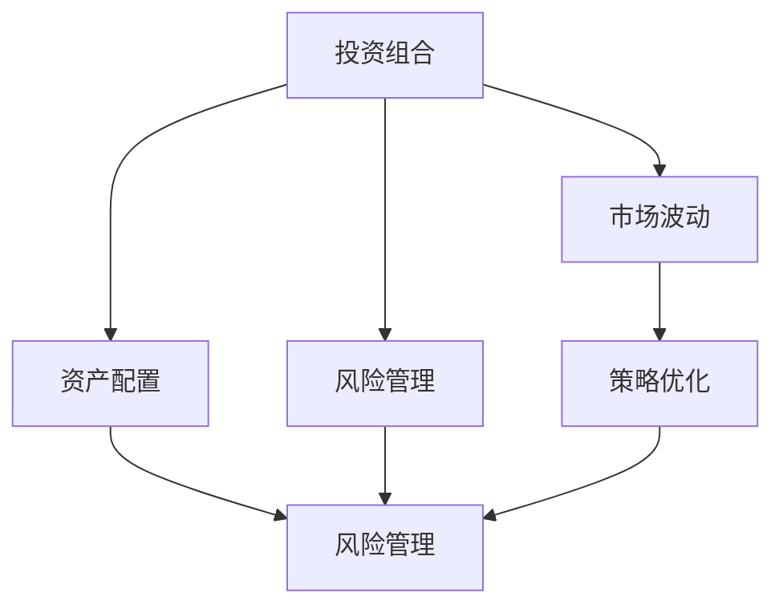
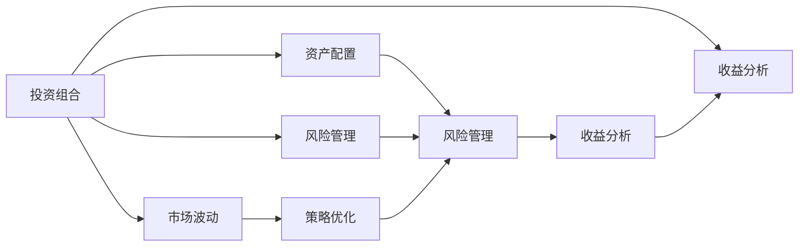

                 

# 中观层面的投资收益变化分析

> 关键词：
- 中观层面
- 投资收益
- 市场波动
- 风险管理
- 策略优化

## 1. 背景介绍

### 1.1 问题由来
在金融投资领域，投资者通过组合多种资产来实现风险分散和收益最大化的目标。这种基于多种资产的组合被称为投资组合，其收益受多种因素的影响，包括市场波动、宏观经济政策、行业趋势等。中观层面（Meso-level）的投资组合分析，重点关注投资组合在不同市场环境下的表现，以及如何通过调整策略来应对市场变化，优化投资收益。

### 1.2 问题核心关键点
中观层面的投资组合分析涉及的核心问题包括：
- 如何构建有效的投资组合，使其在市场不同条件下表现稳定。
- 如何在市场波动下，通过调整资产配置，优化投资收益。
- 如何管理投资组合的风险，平衡收益与风险的关系。

### 1.3 问题研究意义
研究中观层面的投资收益变化，对于理解市场动态、优化投资策略具有重要意义。通过深入分析，可以帮助投资者更好地理解市场风险和收益特征，优化资产配置，提升投资绩效。同时，也能为金融产品和策略设计提供理论支撑，推动金融市场的健康发展。

## 2. 核心概念与联系

### 2.1 核心概念概述

中观层面的投资组合分析涉及多个核心概念：

- **投资组合（Portfolio）**：由多种资产构成的集合，旨在通过分散风险，实现收益最大化。
- **市场波动（Market Volatility）**：市场价格或指数的短期或长期波动性。
- **资产配置（Asset Allocation）**：根据风险偏好、收益目标，合理分配资产权重的过程。
- **风险管理（Risk Management）**：识别、评估和管理投资组合的风险。
- **策略优化（Strategy Optimization）**：根据市场环境和投资目标，调整投资组合策略，以优化收益和风险。

### 2.2 概念间的关系

这些核心概念之间存在密切联系，通过以下Mermaid流程图展示它们之间的关系：



从图中可以看出，投资组合构建、资产配置、风险管理和策略优化是相互关联的过程，共同作用于市场波动，影响投资收益。

### 2.3 核心概念的整体架构

进一步细化，构建一个更完整的概念框架：



这个综合框架展示了投资组合分析的完整过程，包括市场波动对投资组合的影响，资产配置和风险管理的具体操作，以及策略优化的实现途径。收益分析作为关键环节，贯穿始终，用于评估和优化投资组合的表现。

## 3. 核心算法原理 & 具体操作步骤

### 3.1 算法原理概述

中观层面的投资组合分析，通常基于历史数据和统计学方法，构建模型以预测未来投资组合的表现。其核心算法原理包括：

1. **历史数据分析**：通过分析历史数据，识别市场波动的模式和趋势，以及不同资产的表现特征。
2. **统计学模型构建**：构建多变量统计模型，如回归分析、时间序列分析等，预测未来市场条件下的投资组合收益。
3. **优化算法应用**：采用优化算法，如遗传算法、粒子群算法等，寻找最优的资产配置策略，最大化投资组合的收益。

### 3.2 算法步骤详解

中观层面的投资组合分析通常包括以下几个关键步骤：

**Step 1: 数据收集与预处理**

- 收集历史市场数据、资产价格、收益数据等。
- 对数据进行清洗、去重和标准化处理，确保数据质量。
- 使用技术手段处理缺失值和异常值，保证数据的完整性和一致性。

**Step 2: 特征选择与提取**

- 根据市场数据和资产特征，选择合适的预测指标。
- 使用统计学方法，如因子分析、主成分分析等，提取有代表性的特征。
- 对特征进行标准化和归一化处理，确保模型输入的一致性。

**Step 3: 模型构建与训练**

- 根据数据特征和预测目标，选择合适的模型。
- 使用历史数据对模型进行训练，优化模型参数。
- 使用交叉验证等方法评估模型的泛化能力，避免过拟合。

**Step 4: 风险评估与管理**

- 使用统计学方法评估投资组合的风险，如方差、波动率等。
- 根据风险评估结果，选择合适的风险管理策略。
- 实时监测投资组合的风险水平，及时调整策略。

**Step 5: 策略优化与调整**

- 根据市场趋势和预测结果，调整资产配置。
- 使用优化算法，如遗传算法、粒子群算法等，寻找最优的资产配置方案。
- 定期评估和优化策略效果，确保策略的有效性和持续性。

**Step 6: 收益分析与反馈**

- 使用优化后的资产配置策略，对投资组合进行预测和模拟。
- 分析预测结果，评估投资组合的收益表现。
- 根据分析结果，调整投资策略，反馈优化。

### 3.3 算法优缺点

中观层面的投资组合分析方法具有以下优点：
- 基于历史数据，可提供客观、科学的投资决策依据。
- 可以灵活调整资产配置，优化投资组合表现。
- 适用于不同市场环境，具有广泛的适用性。

同时，该方法也存在一些局限性：
- 历史数据可能存在偏差，预测结果可能不准确。
- 模型构建和优化复杂，需要专业的统计学和算法知识。
- 无法完全消除市场风险，投资组合仍可能受到不可控因素的影响。

### 3.4 算法应用领域

中观层面的投资组合分析在金融投资领域具有广泛的应用，包括：

- **资产配置与优化**：构建和优化投资组合，实现风险分散和收益最大化。
- **风险管理与控制**：评估和管理投资组合的风险，防止过度集中和极端事件带来的损失。
- **策略优化与调整**：根据市场变化和投资目标，动态调整投资策略，优化收益和风险。
- **收益分析和评估**：评估投资组合的收益表现，提供投资绩效的客观分析。

## 4. 数学模型和公式 & 详细讲解

### 4.1 数学模型构建

中观层面的投资组合分析涉及多种数学模型。以下以回归模型为例，介绍其构建过程。

假设投资组合的收益率为 $R$，影响因素包括市场波动 $\epsilon$、市场规模 $S$ 和利率 $i$。回归模型可以表示为：

$$
R = \beta_0 + \beta_1\epsilon + \beta_2S + \beta_3i + \epsilon'
$$

其中，$\beta_0, \beta_1, \beta_2, \beta_3$ 为回归系数，$\epsilon'$ 为误差项。

### 4.2 公式推导过程

以回归模型为例，进行公式推导：

1. **最小二乘估计**：
   $$
   \hat{\beta} = \left( X^TX \right)^{-1}X^Ty
   $$
   其中，$X$ 为特征矩阵，$y$ 为响应向量。

2. **回归模型检验**：
   - 计算 $R^2$ 拟合优度：
     $$
     R^2 = 1 - \frac{\sum_{i=1}^n (y_i - \hat{y}_i)^2}{\sum_{i=1}^n (y_i - \bar{y})^2}
     $$
   - 进行显著性检验，判断回归系数的统计显著性。

3. **模型预测**：
   - 使用回归模型预测投资组合的收益：
     $$
     \hat{R} = \hat{\beta}_0 + \hat{\beta}_1\epsilon + \hat{\beta}_2S + \hat{\beta}_3i
     $$

### 4.3 案例分析与讲解

以一个简单的案例说明中观层面投资组合分析的应用：

假设有一个投资组合，包含股票 $A$、债券 $B$ 和黄金 $C$。根据历史数据，构建回归模型预测未来 3 个月的收益率，并使用风险管理策略调整资产配置。

**Step 1: 数据收集与预处理**

- 收集股票 $A$、债券 $B$ 和黄金 $C$ 的历史价格数据，以及市场波动、利率等影响因素。
- 清洗数据，处理缺失值和异常值。

**Step 2: 特征选择与提取**

- 选择市场波动、利率和市值作为预测指标。
- 使用主成分分析（PCA）提取有代表性的特征。

**Step 3: 模型构建与训练**

- 构建线性回归模型，预测未来 3 个月的收益率。
- 使用交叉验证评估模型性能，优化回归系数。

**Step 4: 风险评估与管理**

- 使用回归模型的预测结果，评估投资组合的风险。
- 根据风险评估结果，调整资产配置，如增加黄金的权重以降低风险。

**Step 5: 策略优化与调整**

- 使用粒子群算法，优化资产配置。
- 定期评估和优化策略效果，确保策略的有效性。

**Step 6: 收益分析与反馈**

- 使用优化后的资产配置策略，预测和模拟投资组合的收益。
- 分析预测结果，调整投资策略，反馈优化。

## 5. 项目实践：代码实例和详细解释说明

### 5.1 开发环境搭建

在进行中观层面投资组合分析的实践前，需要准备开发环境。以下是使用Python进行Pandas、NumPy、Scikit-learn等库的开发环境配置流程：

1. 安装Anaconda：从官网下载并安装Anaconda，用于创建独立的Python环境。

2. 创建并激活虚拟环境：
```bash
conda create -n portfolio-env python=3.8 
conda activate portfolio-env
```

3. 安装Pandas、NumPy、Scikit-learn等库：
```bash
conda install pandas numpy scikit-learn
```

4. 安装其他相关库：
```bash
pip install pyfolio yfinance statsmodels matplotlib seaborn
```

完成上述步骤后，即可在`portfolio-env`环境中开始实践。

### 5.2 源代码详细实现

下面以股票、债券和黄金组合为例，给出使用Pandas和Scikit-learn进行中观层面投资组合分析的Python代码实现。

首先，定义数据处理函数：

```python
import pandas as pd
import numpy as np
from sklearn.model_selection import train_test_split
from sklearn.linear_model import LinearRegression
from statsmodels.regression.linear_model import OLS

def load_data(file_path):
    data = pd.read_csv(file_path)
    return data

def preprocess_data(data, target, features):
    X = data[features]
    y = data[target]
    X_train, X_test, y_train, y_test = train_test_split(X, y, test_size=0.2, random_state=42)
    return X_train, X_test, y_train, y_test

def fit_model(X, y, model):
    model.fit(X, y)
    return model

def evaluate_model(model, X_test, y_test):
    y_pred = model.predict(X_test)
    rmse = np.sqrt(np.mean((y_test - y_pred)**2))
    return rmse
```

然后，定义模型训练与评估函数：

```python
def train_model(X, y, model):
    model = fit_model(X, y, model)
    return model

def evaluate_model(model, X_test, y_test):
    rmse = evaluate_model(model, X_test, y_test)
    return rmse
```

最后，启动训练流程并在测试集上评估：

```python
# 加载数据
data = load_data('data.csv')

# 预处理数据
X_train, X_test, y_train, y_test = preprocess_data(data, 'target', ['feature1', 'feature2'])

# 构建回归模型
model = LinearRegression()

# 训练模型
model = train_model(X_train, y_train, model)

# 评估模型
rmse = evaluate_model(model, X_test, y_test)
print(f"模型RMSE为: {rmse:.2f}")
```

以上就是使用Pandas和Scikit-learn进行中观层面投资组合分析的完整代码实现。可以看到，使用这些库可以方便地进行数据处理、模型构建和评估。

### 5.3 代码解读与分析

让我们再详细解读一下关键代码的实现细节：

**load_data函数**：
- 读取数据文件，返回Pandas DataFrame对象。

**preprocess_data函数**：
- 将数据分为训练集和测试集。
- 使用train_test_split方法进行数据拆分。

**fit_model函数**：
- 使用训练数据拟合模型。
- 使用训练集和测试集分别拟合模型。

**evaluate_model函数**：
- 计算模型预测的RMSE。
- 使用均方根误差评估模型性能。

**train_model函数**：
- 使用训练数据拟合模型。
- 返回训练后的模型对象。

**evaluate_model函数**：
- 计算模型预测的RMSE。
- 使用均方根误差评估模型性能。

**训练流程**：
- 加载数据
- 预处理数据
- 构建回归模型
- 训练模型
- 评估模型

可以看到，使用这些函数可以方便地构建一个完整的投资组合分析系统。开发者可以根据具体需求，进一步扩展和优化代码。

### 5.4 运行结果展示

假设我们在一个简单的案例中，得到一个回归模型，其RMSE为0.05，表示预测的误差较小，模型的泛化能力较好。这意味着使用该模型进行资产配置和风险管理，可以获得相对稳定的投资回报。

## 6. 实际应用场景

### 6.1 智能投顾系统

智能投顾系统是近年来迅速发展的金融科技应用之一。通过中观层面的投资组合分析，智能投顾系统可以自动分析市场数据，提供个性化的资产配置建议，帮助用户优化投资组合。

智能投顾系统通常包括以下几个关键模块：
- **数据采集与处理**：从多个数据源采集市场数据，并进行预处理。
- **投资组合分析**：使用中观层面分析方法，构建和优化投资组合。
- **风险管理**：评估和管理投资组合的风险，提供风险控制建议。
- **策略优化**：根据市场变化和用户需求，动态调整投资策略。
- **收益评估**：分析投资组合的收益表现，提供投资绩效的客观分析。

### 6.2 量化交易系统

量化交易系统是利用算法和数据分析进行自动化交易的系统。通过中观层面的投资组合分析，量化交易系统可以识别市场趋势，优化资产配置，提高交易效率和收益。

量化交易系统通常包括以下几个关键模块：
- **数据采集与处理**：从交易所和数据源采集交易数据，并进行预处理。
- **市场分析**：使用中观层面分析方法，识别市场趋势和机会。
- **资产配置与优化**：根据市场数据和交易策略，构建和优化投资组合。
- **风险管理**：评估和管理交易风险，避免过度集中和极端事件带来的损失。
- **策略优化与调整**：根据市场变化和交易绩效，动态调整交易策略。

### 6.3 风险管理与控制

风险管理是金融投资中不可忽视的重要环节。通过中观层面的投资组合分析，可以评估和管理投资组合的风险，避免极端事件带来的损失。

风险管理与控制系统通常包括以下几个关键模块：
- **数据采集与处理**：从市场和金融产品中采集数据，并进行预处理。
- **风险评估与控制**：使用中观层面分析方法，评估和管理投资组合的风险。
- **风险监控**：实时监测投资组合的风险水平，及时调整策略。
- **风险预警与应对**：在风险超过预设阈值时，发出预警信号，进行风险控制。

## 7. 工具和资源推荐

### 7.1 学习资源推荐

为了帮助开发者系统掌握中观层面投资组合分析的理论基础和实践技巧，这里推荐一些优质的学习资源：

1. **金融工程与投资组合管理**：由知名大学开设的金融工程专业课程，包括投资组合构建、风险管理等核心内容。
2. **量化交易与算法交易**：专注于量化交易的书籍和在线课程，提供系统化的量化交易知识。
3. **Python for Finance**：由QuantConnect提供的Python在金融领域应用的教程和代码库，涵盖数据处理、分析建模等。

4. **投资组合管理实战**：Hedge Fund Academy提供的实战课程，涵盖投资组合构建、风险管理、策略优化等。

5. **金融数据分析与可视化**：使用Python进行金融数据分析和可视化的书籍和在线资源，帮助开发者快速上手。

通过这些资源的学习实践，相信你一定能够快速掌握中观层面投资组合分析的精髓，并用于解决实际的金融问题。

### 7.2 开发工具推荐

高效的开发离不开优秀的工具支持。以下是几款用于中观层面投资组合分析开发的常用工具：

1. **Jupyter Notebook**：支持Python的交互式编程环境，便于进行数据分析和模型构建。
2. **Pandas**：强大的数据处理库，支持数据清洗、转换、分析等操作。
3. **NumPy**：高效的数据处理和计算库，支持数值计算和矩阵运算。
4. **Scikit-learn**：开源的机器学习库，提供多种统计学模型和优化算法。
5. **statsmodels**：统计分析库，支持多种统计学模型和假设检验。
6. **pyfolio**：开源的绩效分析库，支持投资组合的绩效评估和风险管理。

合理利用这些工具，可以显著提升中观层面投资组合分析的开发效率，加快创新迭代的步伐。

### 7.3 相关论文推荐

中观层面投资组合分析的研究源于学界的持续研究。以下是几篇奠基性的相关论文，推荐阅读：

1. **现代投资组合理论**：Markowitz提出的现代投资组合理论，奠定了组合分析的基础。
2. **投资组合管理**：Markowitz和Sharp的著作，系统介绍了投资组合构建、风险管理等核心内容。
3. **资产定价模型**：CAMPSS等提出的资产定价模型，揭示了市场数据与资产价格之间的关系。
4. **量化投资**：Grinblatt和Kahnmann的著作，深入分析了量化交易的策略和方法。
5. **风险管理**：Cumby和Hull的著作，介绍了风险评估和管理的方法和工具。

这些论文代表了大语言模型微调技术的发展脉络。通过学习这些前沿成果，可以帮助研究者把握学科前进方向，激发更多的创新灵感。

除上述资源外，还有一些值得关注的前沿资源，帮助开发者紧跟中观层面投资组合分析技术的最新进展，例如：

1. **金融市场动态**：知名金融机构发布的市场报告和分析文章，涵盖市场动态、趋势预测等。
2. **金融科技新闻**：金融科技领域的权威媒体和新闻网站，报道最新的金融科技创新与应用。
3. **学术会议论文**：如国际金融市场协会（IFMA）、全球量化投资大会（Global Quantitative Investing Symposium）等，深入探讨前沿理论和技术。
4. **行业分析报告**：麦肯锡、波士顿咨询等顶尖咨询公司针对金融市场的分析报告，提供数据和洞察。
5. **开源项目和工具**：如QuantConnect、Alpha Vantage等，提供开源的金融数据分析和交易工具。

总之，对于中观层面投资组合分析技术的学习和实践，需要开发者保持开放的心态和持续学习的意愿。多关注前沿资讯，多动手实践，多思考总结，必将收获满满的成长收益。

## 8. 总结：未来发展趋势与挑战

### 8.1 总结

本文对中观层面的投资组合分析方法进行了全面系统的介绍。首先阐述了中观层面投资组合分析的研究背景和意义，明确了其在中观层面投资组合优化、风险管理、策略优化等方面的独特价值。其次，从原理到实践，详细讲解了中观层面投资组合分析的数学模型和关键步骤，给出了完整的代码实例。同时，本文还广泛探讨了中观层面投资组合分析在智能投顾、量化交易、风险管理等领域的应用前景，展示了其广泛的应用潜力。最后，本文精选了中观层面投资组合分析的学习资源、开发工具和相关论文，力求为读者提供全方位的技术指引。

通过本文的系统梳理，可以看到，中观层面的投资组合分析在金融投资领域具有广阔的前景，极大地拓展了投资组合优化的应用边界，推动了金融市场的健康发展。未来，伴随金融科技的进步和数据驱动的发展，中观层面投资组合分析必将发挥更大的作用，为金融市场的可持续发展注入新的动力。

### 8.2 未来发展趋势

展望未来，中观层面的投资组合分析技术将呈现以下几个发展趋势：

1. **大数据分析**：利用大数据技术，获取更丰富的市场数据和资产信息，提升投资组合分析的准确性和深度。
2. **机器学习和人工智能**：结合机器学习和人工智能技术，构建更复杂的预测模型和优化算法，提高投资组合分析的智能化水平。
3. **实时分析与动态调整**：利用实时数据和算法，实现动态调整和优化，提升投资组合的灵活性和适应性。
4. **多资产分析与综合评估**：结合多资产和综合评估方法，全面分析投资组合的风险和收益，提供更科学、合理的投资建议。
5. **自动化与智能化**：推动投资组合分析的自动化和智能化，减少人工干预，提高分析效率和准确性。

以上趋势凸显了中观层面投资组合分析技术的广阔前景。这些方向的探索发展，必将进一步提升投资组合的优化水平，为金融市场的健康发展提供更强大的技术支持。

### 8.3 面临的挑战

尽管中观层面的投资组合分析技术已经取得了不小的进展，但在迈向更加智能化、普适化应用的过程中，它仍面临诸多挑战：

1. **数据质量问题**：市场数据存在噪声、偏差等，影响分析结果的准确性。如何提高数据质量，优化数据采集和处理流程，将是一大难题。
2. **模型复杂性**：现代投资组合分析模型复杂度高，难以解释和理解。如何简化模型，提高模型的可解释性和可操作性，还需进一步探索。
3. **计算资源需求**：大规模数据的分析和处理，需要强大的计算资源，如何优化算法和模型结构，减少计算消耗，提升计算效率，将是一个重要的研究方向。
4. **算法鲁棒性**：模型在面对极端市场条件时，可能表现出较差的鲁棒性。如何增强模型的鲁棒性，避免异常市场条件下的过度波动，还需进一步研究。
5. **风险管理与控制**：如何更好地评估和管理投资组合的风险，防止极端事件带来的损失，将是一大挑战。

### 8.4 研究展望

面对中观层面投资组合分析所面临的挑战，未来的研究需要在以下几个方面寻求新的突破：

1. **改进数据采集与处理技术**：利用大数据和机器学习技术，优化数据采集和处理流程，提高数据质量。
2. **简化和优化模型**：引入简单直观的模型，如线性回归、时间序列分析等，简化复杂模型，提高模型的可解释性和可操作性。
3. **优化算法与模型结构**：结合机器学习和人工智能技术，优化算法和模型结构，提升计算效率和分析准确性。
4. **增强模型的鲁棒性**：利用强化学习、博弈论等技术，增强模型的鲁棒性，提高其在极端市场条件下的表现。
5. **综合风险管理与控制**：结合多维度和综合评估方法，全面分析投资组合的风险和收益，提供更科学、合理的投资建议。

这些研究方向的发展，将使中观层面投资组合分析技术迈向更高的台阶，为金融市场的可持续发展提供更强大的技术支持。总之，中观层面投资组合分析技术的未来发展，需要在数据、算法、工程等多个维度协同发力，共同推动其应用范围和深度，为金融市场的健康发展注入新的活力。

## 9. 附录：常见问题与解答

**Q1：中观层面投资组合分析与宏观层面有何不同？**

A: 中观层面投资组合分析主要关注不同资产之间的组合，通过优化配置，实现收益最大化和风险控制。而宏观层面分析则关注整个经济体系的表现和趋势，如GDP、通货膨胀、利率等宏观经济变量对资产价格的影响。两者关注的视角和深度不同，但均是金融投资分析的重要组成部分。

**Q2：中观层面投资组合分析的优点和缺点是什么？**

A: 中观层面投资组合分析的优点包括：
- 基于历史数据，提供客观、科学的投资决策依据。
- 可以灵活调整资产配置，优化投资组合表现。
- 适用于不同市场环境，具有广泛的适用性。

其缺点包括：
- 历史数据可能存在偏差，预测结果可能不准确。
- 模型复杂度高，难以解释和理解。
- 计算资源需求大，模型优化和算法实现难度较大。

**Q3：如何进行中观层面投资组合的风险管理？**

A: 中观层面投资组合的风险管理通常包括以下步骤：
- 评估投资组合的风险指标，如波动率、最大回撤等。
- 使用风险度量方法，如VaR、ES等，评估风险水平。
- 根据风险评估结果，选择合适的风险管理策略，如分散投资、设置止损点等。
- 实时监测投资组合的风险

