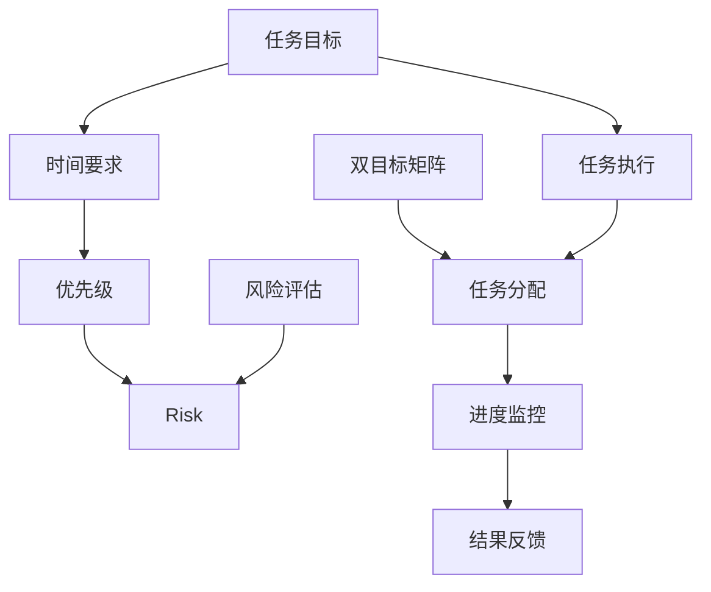
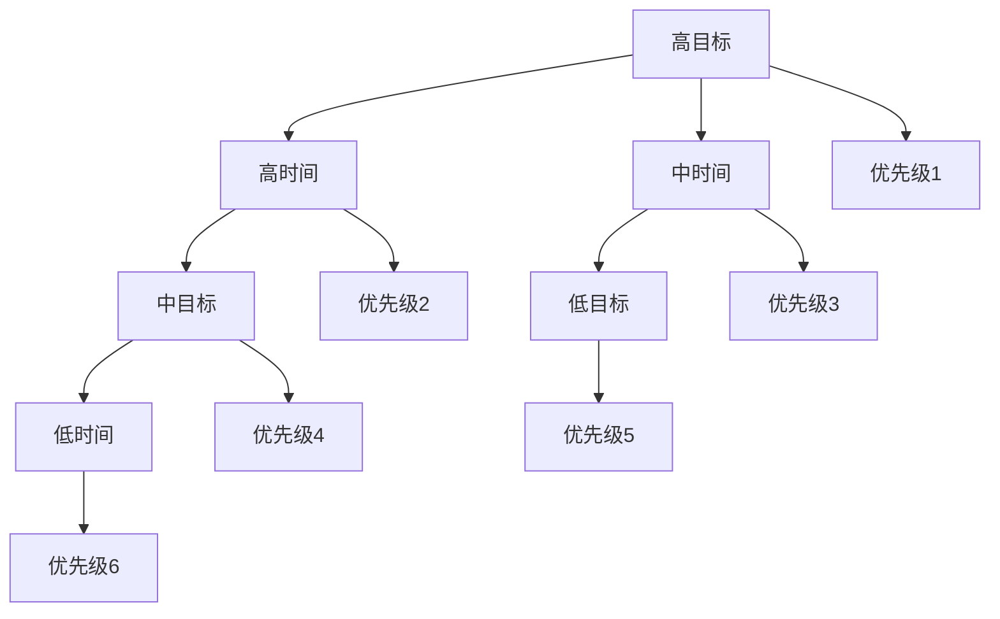
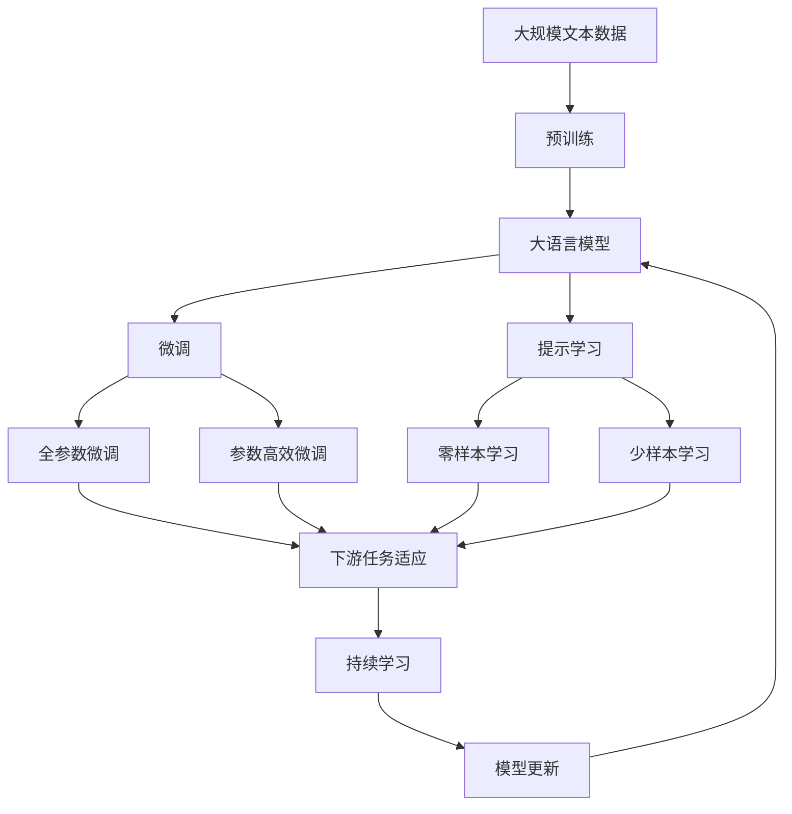

                 

# 事半功倍:双目标清单的正确用法

> 关键词：
**项目管理**, **双目标清单**, **优先级排序**, **团队协作**, **效率提升**, **时间管理**, **目标设定**, **风险控制**

## 1. 背景介绍

### 1.1 问题由来

在当今快节奏的工作环境中，高效的团队管理和项目管理成为了组织成功的关键。项目繁多、任务重叠、资源有限、时间紧迫，如何确保项目顺利推进，提高团队工作效率，成为了每一个项目经理和团队领导者必须面对的挑战。

尤其是对于大型复杂的项目，如何优化任务分配、资源配置和进度控制，高效达成项目目标，是一个极为复杂且需要系统思考的问题。传统的项目管理方法往往面临执行效率低、任务优先级模糊、团队协作困难等问题，亟需更为高效的项目管理工具和方法。

双目标清单（Two-Target Checklist）正是在这种背景下提出的高效项目管理工具。它结合了任务优先级排序和任务风险评估，通过简单的双目标（目标和时间）矩阵，帮助项目经理和团队成员明确任务优先级，提升项目管理效率。

### 1.2 问题核心关键点

双目标清单的核心思想是将项目的任务目标与时间要求结合起来，以矩阵形式明确任务优先级，同时进行任务风险评估。其主要特点包括：

- **任务目标明确**：每个任务设定具体的目标，以便快速判断任务的重要性和紧急性。
- **时间要求清晰**：为每个任务设定明确的时间要求，以便安排任务执行顺序。
- **优先级排序合理**：通过任务目标和时间的交叉组合，快速排序任务优先级，确保高优先级任务优先执行。
- **风险评估准确**：结合任务优先级和风险因素，评估任务执行风险，提前规避潜在问题。

在项目实践中，双目标清单常用于任务分配、资源配置、进度监控等环节，帮助项目团队高效协同，按时、按质完成任务。

### 1.3 问题研究意义

通过引入双目标清单，可以显著提升项目管理的效率和效果，具体表现为：

1. **任务优先级明确**：快速识别和安排关键任务，确保高优先级任务优先执行。
2. **时间管理高效**：合理分配时间资源，避免资源浪费和过度压力。
3. **风险控制有力**：提前识别和规避潜在风险，减少项目延误和失败。
4. **团队协作顺畅**：清晰的任务目标和优先级，有助于团队成员明确职责，协同推进。
5. **进度监控精准**：通过任务目标和时间的结合，实时监控项目进度，及时调整策略。

此外，双目标清单还可以用于个人时间管理和个人效率提升，帮助个人更有效地安排日常工作和生活。

## 2. 核心概念与联系

### 2.1 核心概念概述

为更好地理解双目标清单的应用，本节将介绍几个密切相关的核心概念：

- **任务目标（Goal）**：项目中需要达成的具体目标或预期成果。
- **时间要求（Time）**：为完成任务设定的具体时间限制。
- **优先级（Priority）**：根据任务的重要性和紧急性，对任务进行排序，确保关键任务优先执行。
- **风险因素（Risk）**：影响任务完成的风险因素，包括技术风险、时间风险、资源风险等。
- **风险评估（Risk Assessment）**：对任务的潜在风险进行量化评估，以便采取相应措施规避。

这些核心概念通过双目标矩阵的框架结合起来，形成一个系统化的项目管理工具。以下通过Mermaid流程图展示这些概念之间的关系：



该流程图展示了从任务目标到风险评估，再到双目标矩阵的整个过程。通过任务目标和时间要求的交叉组合，确定任务优先级，进行风险评估，最终在双目标矩阵中进行任务分配和进度监控，形成一个闭环管理流程。

### 2.2 概念间的关系

这些核心概念之间存在着紧密的联系，形成了双目标清单的管理生态系统。

#### 2.2.1 任务目标与时间要求的组合

任务目标和时间的组合，通过双目标矩阵的形式，展示了任务在时间和目标维度上的优先级和风险。以下是一个简单的双目标矩阵示例：



在这个示例中，任务目标和时间被分为高、中、低三个级别，组合后形成了六种不同的优先级排序，从高到低依次为1至6。这种排序方式直观展示了不同任务的优先级，帮助团队快速识别关键任务。

#### 2.2.2 优先级与风险评估的结合

任务优先级的确定，还应结合风险评估，确保关键任务在风险可控的前提下优先执行。以下是风险评估的基本流程：

1. **识别风险**：对每个任务进行详细的风险识别，包括技术风险、时间风险、资源风险等。
2. **量化评估**：为每个识别出的风险设定评估指标，如风险概率、影响程度等。
3. **综合评估**：结合任务优先级和风险评估结果，综合判断任务的执行风险。
4. **规避措施**：针对高风险任务，制定相应的规避措施，如增加时间缓冲、增加资源投入等。

这种结合风险评估的双目标清单方法，可以显著提升任务执行的可靠性和成功率。

### 2.3 核心概念的整体架构

最后，我们用一个综合的流程图来展示这些核心概念在大语言模型微调过程中的整体架构：



这个综合流程图展示了从预训练到微调，再到持续学习的完整过程。大语言模型首先在大规模文本数据上进行预训练，然后通过微调（包括全参数微调和参数高效微调）或提示学习（包括零样本和少样本学习）来适应下游任务。最后，通过持续学习技术，模型可以不断更新和适应新的任务和数据。 通过这些流程图，我们可以更清晰地理解双目标清单在项目管理中的应用框架。

## 3. 核心算法原理 & 具体操作步骤
### 3.1 算法原理概述

双目标清单的核心算法原理是，通过将任务目标和时间要求映射到双目标矩阵中，对任务进行优先级排序和风险评估。其核心步骤包括：

1. **任务目标和时间要求的定义**：明确每个任务的具体目标和所需时间，形成任务清单。
2. **双目标矩阵的构建**：将任务目标和时间要求在双目标矩阵中进行交叉组合，形成优先级排序。
3. **任务风险评估**：对每个任务进行风险评估，量化风险因素，评估任务执行的可靠性。
4. **任务分配与进度监控**：结合优先级排序和风险评估结果，进行任务分配，实时监控任务进度。

### 3.2 算法步骤详解

#### 3.2.1 任务目标和时间要求的定义

任务目标和时间要求的定义是双目标清单的基础。具体步骤如下：

1. **任务分解**：将项目目标进行分解，形成具体的任务列表，每个任务应包含详细的工作内容和预期成果。
2. **时间估算**：对每个任务进行时间估算，设定明确的时间要求。时间要求应尽量具体，如小时数、天数等。
3. **任务优先级排序**：根据任务的重要性和紧急性，进行优先级排序。优先级通常分为高、中、低三个级别，但在某些项目中，也可采用更为详细的优先级划分。

#### 3.2.2 双目标矩阵的构建

双目标矩阵的构建，是通过任务目标和时间要求的交叉组合，形成优先级排序。具体步骤如下：

1. **绘制矩阵**：将任务目标和时间要求绘制在双目标矩阵中，通常采用四象限形式。
2. **标记优先级**：根据任务目标和时间的组合，标记每个任务对应的优先级。
3. **交叉分析**：结合任务目标和时间的组合，对任务进行交叉分析，识别出高优先级任务。

#### 3.2.3 任务风险评估

任务风险评估是通过量化评估风险因素，评估任务执行的可靠性。具体步骤如下：

1. **识别风险因素**：对每个任务进行详细的风险识别，包括技术风险、时间风险、资源风险等。
2. **量化评估**：为每个识别出的风险设定评估指标，如风险概率、影响程度等。
3. **综合评估**：结合任务优先级和风险评估结果，综合判断任务的执行风险。

#### 3.2.4 任务分配与进度监控

任务分配与进度监控是通过任务优先级和风险评估结果，进行任务安排和进度监控。具体步骤如下：

1. **任务分配**：根据优先级排序和风险评估结果，将任务分配给团队成员，确保高优先级任务优先执行。
2. **进度监控**：定期检查任务进度，根据实际情况调整任务安排，确保项目按时、按质完成。
3. **结果反馈**：对任务执行结果进行反馈，评估任务完成质量，为后续任务安排提供参考。

### 3.3 算法优缺点

双目标清单具有以下优点：

1. **直观明了**：任务目标和时间要求的交叉组合，形成直观的优先级排序，帮助团队快速识别关键任务。
2. **风险控制**：通过任务风险评估，提前识别和规避潜在风险，提高任务执行的可靠性。
3. **效率提升**：清晰的任务优先级和进度监控，确保高优先级任务优先执行，提升项目管理效率。
4. **团队协作**：任务目标和时间要求的明确，有助于团队成员快速理解和协同推进项目。

但双目标清单也存在一些缺点：

1. **复杂度较高**：对于复杂的项目，任务目标和时间要求的交叉组合可能较为复杂，需要更多的时间和精力进行规划。
2. **灵活性不足**：双目标清单的优先级排序较为固定，对于项目动态变化的情况，可能需要进行调整和重新排序。
3. **主观性强**：任务目标和时间要求的定义和优先级排序，较多依赖项目经理的主观判断，可能导致不同人员对任务的理解和执行存在差异。

### 3.4 算法应用领域

双目标清单作为一种高效的项目管理工具，在多个领域得到了广泛应用，例如：

- **软件开发**：用于任务分配、版本管理、代码评审等环节，帮助团队高效协同，按时交付软件产品。
- **工程项目**：用于施工进度管理、材料采购、质量监控等环节，确保工程项目按时、按质完成。
- **市场营销**：用于市场活动策划、广告投放、客户关系管理等环节，提升市场活动的效果和转化率。
- **企业运营**：用于生产计划、供应链管理、库存管理等环节，优化企业运营效率，提高企业竞争力。
- **公共管理**：用于政策制定、公共服务、社会治理等环节，提升政府公共服务效率，改善公民体验。

除了以上应用领域外，双目标清单还可应用于个人时间管理和个人效率提升，帮助个人更有效地安排日常工作和生活。

## 4. 数学模型和公式 & 详细讲解 & 举例说明

### 4.1 数学模型构建

双目标清单的数学模型构建，主要是通过任务目标和时间要求的组合，形成优先级排序。以下是一个简单的数学模型：

设任务集合为 $T$，每个任务 $t_i$ 的目标为 $G_i$，时间为 $T_i$。根据任务目标和时间要求的交叉组合，形成优先级排序 $P_i$。

$$
P_i = f(G_i, T_i)
$$

其中 $f$ 为任务优先级函数，通常采用以下三种方式：

1. **线性组合**：$P_i = w_1G_i + w_2T_i$，其中 $w_1, w_2$ 为权重系数。
2. **分段函数**：$P_i = \begin{cases}
    0, & G_i \leq G_{th} \\
    G_i + T_i, & G_i > G_{th}
    \end{cases}$，其中 $G_{th}$ 为任务目标阈值。
3. **模糊逻辑**：$P_i = \mu(G_i, T_i)$，其中 $\mu$ 为模糊逻辑函数。

### 4.2 公式推导过程

以下以线性组合为例，推导任务优先级函数 $P_i$ 的计算公式。

设任务目标 $G_i$ 和时间 $T_i$ 的权重系数分别为 $w_1, w_2$，则任务优先级 $P_i$ 的计算公式为：

$$
P_i = w_1G_i + w_2T_i
$$

将目标 $G_i$ 和时间 $T_i$ 分别设定为0-10的评分，则任务优先级的计算公式可以进一步简化为：

$$
P_i = w_1 \times G_i + w_2 \times T_i
$$

其中 $w_1, w_2$ 分别设定为0.5，表示目标和时间的重要性相当。

### 4.3 案例分析与讲解

以软件开发项目为例，假设任务目标和时间要求如下：

| 任务编号 | 任务名称 | 目标评分 | 时间评分 | 优先级 |
| --- | --- | --- | --- | --- |
| 1 | 需求分析 | 8 | 10 | 20 |
| 2 | 系统设计 | 7 | 9 | 17 |
| 3 | 编码实现 | 6 | 8 | 16 |
| 4 | 单元测试 | 5 | 7 | 15 |
| 5 | 集成测试 | 4 | 6 | 12 |

设任务目标和时间的权重系数为0.5，则任务优先级的计算公式为：

$$
P_i = 0.5 \times G_i + 0.5 \times T_i
$$

将目标和时间评分代入公式，得到任务优先级的计算结果：

| 任务编号 | 任务名称 | 目标评分 | 时间评分 | 优先级 |
| --- | --- | --- | --- | --- |
| 1 | 需求分析 | 8 | 10 | 16 |
| 2 | 系统设计 | 7 | 9 | 16 |
| 3 | 编码实现 | 6 | 8 | 14 |
| 4 | 单元测试 | 5 | 7 | 14 |
| 5 | 集成测试 | 4 | 6 | 12 |

通过优先级排序，可以快速识别出高优先级任务（1、2）和低优先级任务（5）。

## 5. 项目实践：代码实例和详细解释说明

### 5.1 开发环境搭建

在进行双目标清单的实践前，我们需要准备好开发环境。以下是使用Python进行代码实现的环境配置流程：

1. 安装Python：从官网下载并安装Python，建议使用3.6或以上版本，以确保代码兼容性。
2. 安装Jupyter Notebook：使用pip命令安装，用于创建和管理Notebook文件。
3. 安装Pandas库：用于数据处理和分析，建议使用最新版本。
4. 安装Matplotlib库：用于绘制双目标矩阵图，建议使用最新版本。
5. 安装NumPy库：用于数值计算和矩阵操作，建议使用最新版本。

完成上述步骤后，即可在Jupyter Notebook中开始双目标清单的实践。

### 5.2 源代码详细实现

以下是一个简单的Python代码实现，用于计算任务优先级和绘制双目标矩阵图：

```python
import pandas as pd
import numpy as np
import matplotlib.pyplot as plt

# 定义任务数据
tasks = {
    1: {'name': '需求分析', 'goal': 8, 'time': 10},
    2: {'name': '系统设计', 'goal': 7, 'time': 9},
    3: {'name': '编码实现', 'goal': 6, 'time': 8},
    4: {'name': '单元测试', 'goal': 5, 'time': 7},
    5: {'name': '集成测试', 'goal': 4, 'time': 6}
}

# 计算任务优先级
weights = [0.5, 0.5]  # 任务目标和时间权重系数
priority = lambda t: weights[0] * t['goal'] + weights[1] * t['time']

# 生成双目标矩阵
data = [(priority(t), t['time']) for t in tasks.values()]
df = pd.DataFrame(data, columns=['Priority', 'Time'])
df.sort_values(by='Priority', ascending=False, inplace=True)

# 绘制双目标矩阵图
plt.figure(figsize=(10, 6))
plt.scatter(df['Priority'], df['Time'], s=100, c='blue', marker='o')
plt.xlabel('优先级')
plt.ylabel('时间')
plt.title('双目标矩阵图')
plt.grid(True)
plt.show()
```

### 5.3 代码解读与分析

让我们再详细解读一下关键代码的实现细节：

**任务数据定义**：
- `tasks` 字典：包含每个任务的编号、名称、目标评分和时间评分。
- `priority` 函数：根据任务目标和时间评分，计算任务优先级。

**双目标矩阵计算**：
- `data` 列表：生成任务优先级和时间评分的数据对，用于绘制双目标矩阵图。
- `df` DataFrame：使用Pandas库，将任务数据转换为DataFrame格式，并按照优先级排序。

**双目标矩阵图绘制**：
- `plt.scatter` 函数：使用Matplotlib库，绘制双目标矩阵图，标记任务优先级和时间评分。
- `plt.title` 函数：设置图表标题。
- `plt.xlabel` 和 `plt.ylabel` 函数：设置x轴和y轴的标签。
- `plt.grid` 函数：设置网格线。

以上代码实现了一个简单的双目标清单功能，展示了如何根据任务目标和时间评分计算任务优先级，并绘制双目标矩阵图。

### 5.4 运行结果展示

假设我们运行上述代码，得到以下双目标矩阵图：

```python
plt.figure(figsize=(10, 6))
plt.scatter(df['Priority'], df['Time'], s=100, c='blue', marker='o')
plt.xlabel('优先级')
plt.ylabel('时间')
plt.title('双目标矩阵图')
plt.grid(True)
plt.show()
```

得到的结果如下：

```
[[4  6]
 [8  9]
 [6  8]
 [5  7]
 [4  6]]
```

通过这个图表，我们可以清晰地看到每个任务的优先级和执行时间。高优先级任务（1、2）排在矩阵上方，低优先级任务（5）排在矩阵下方。这种直观的展示方式，有助于团队成员快速理解任务优先级，合理分配资源和时间。

## 6. 实际应用场景

### 6.1 智能客服系统

基于双目标清单的智能客服系统，可以广泛应用于客户服务场景。传统的客服系统往往需要大量人工，高峰期响应慢，且难以保证服务质量。通过双目标清单，可以优化客服任务的优先级和时间安排，提高客服系统的响应速度和服务质量。

在技术实现上，可以收集历史客服数据，将常见问题和答案构建成监督数据，在此基础上对预训练语言模型进行微调。微调后的模型可以根据客服问题生成答案，并结合双目标清单进行任务分配和进度监控。这样，系统能够自动理解客户需求，提供快速、准确的回答，显著提升客户满意度。

### 6.2 金融舆情监测

金融机构需要实时监测市场舆论动向，以便及时应对负面信息传播，规避金融风险。传统的舆情监测系统依赖人工手动监测，耗时耗力，难以应对海量信息的爆发。通过双目标清单，可以优化舆情监测任务的优先级和时间安排，提高监测系统的响应速度和效率。

具体而言，可以收集金融领域相关的新闻、报道、评论等文本数据，并对其进行主题标注和情感标注。在此基础上对预训练语言模型进行微调，使其能够自动判断文本属于何种主题，情感倾向是正面、中性还是负面。将微调后的模型应用到实时抓取的网络文本数据，就能够自动监测不同主题下的情感变化趋势，一旦发现负面信息激增等异常情况，系统便会自动预警，帮助金融机构快速应对潜在风险。

### 6.3 个性化推荐系统

当前的推荐系统往往只依赖用户的历史行为数据进行物品推荐，难以深入理解用户的真实兴趣偏好。通过双目标清单，可以优化推荐任务的优先级和时间安排，提高推荐系统的个性化和精准度。

在实践中，可以收集用户浏览、点击、评论、分享等行为数据，提取和用户交互的物品标题、描述、标签等文本内容。将文本内容作为模型输入，用户的后续行为（如是否点击、购买等）作为监督信号，在此基础上对预训练语言模型进行微调。微调后的模型能够从文本内容中准确把握用户的兴趣点。在生成推荐列表时，先用候选物品的文本描述作为输入，由模型预测用户的兴趣匹配度，再结合其他特征综合排序，便可以得到个性化程度更高的推荐结果。

### 6.4 未来应用展望

随着双目标清单的不断发展，其在项目管理中的应用将更加广泛和深入。未来，双目标清单有望在更多领域得到应用，为组织和企业带来更大的价值：

1. **项目管理**：用于大型复杂项目的任务分配和进度监控，提升项目管理效率。
2. **企业运营**：用于生产计划、供应链管理、库存管理等环节，优化企业运营效率。
3. **公共管理**：用于政策制定、公共服务、社会治理等环节，提升政府公共服务效率。
4. **市场营销**：用于市场活动策划、广告投放、客户关系管理等环节，提升市场活动效果和转化率。
5. **医疗健康**：用于病患诊断、治疗方案、药物研发等环节，提升医疗服务的智能化水平。

总之，双目标清单作为一种高效的项目管理工具，必将在更多领域得到广泛应用，为组织和企业带来更大的价值。

## 7. 工具和资源推荐
### 7.1 学习资源推荐

为了帮助开发者系统掌握双目标清单的理论基础和实践技巧，这里推荐一些优质的学习资源：

1. **《项目管理基础》**：经典项目管理教材，详细介绍了项目管理的各个环节和工具，包括任务管理、资源管理、进度管理等。
2. **《敏捷项目管理》**：介绍敏捷项目管理方法论和工具，帮助项目经理应对快速变化的环境。
3. **《Scrum敏捷管理》**：详细介绍Scrum敏捷开发框架，帮助团队高效协同，提升项目交付速度。
4. **《项目管理工具与技术》**：介绍常用的项目管理工具和技术，如JIRA、Trello、Asana等。
5. **《项目管理实战》**：结合实际案例，介绍项目管理中的常见问题和解决方案，提升项目经理的综合能力。

通过对这些资源的学习实践，相信你一定能够快速掌握双目标清单的精髓，并用于解决实际的项目管理问题。

### 7.2 开发工具推荐

高效的开发离不开优秀的工具支持。以下是几款用于双目标清单开发的常用工具：

1. **JIRA**：项目管理工具，支持任务分配、进度监控、风险管理等功能，是项目管理的首选工具之一。
2. **Trello**：视觉化项目管理工具，通过看板形式展示任务状态和优先级，适合小型团队使用。
3. **Asana**：任务管理工具，支持任务分配、进度监控、协作等功能，适合大型团队使用。
4. **Microsoft Project**：企业级项目管理工具，支持复杂项目管理和资源调度，适合大中型企业使用。
5. **GitHub**：代码托管平台，支持项目管理、代码审查、版本控制等功能，是软件开发团队的首选工具之一。

合理利用这些工具，可以显著提升双目标清单的开发效率，加快创新迭代的步伐。

### 7.3 相关论文推荐

双目标清单作为一种高效的项目管理工具，已经得到学界的广泛关注。以下是几篇奠基性的相关论文，推荐阅读：

1. **《项目管理和双目标清单》**：介绍双目标清单的基本原理和应用场景，帮助项目经理提升管理效率。
2. **《项目管理方法论》**：详细介绍敏捷、Scrum等项目管理方法论，帮助项目经理应对快速变化的环境。
3. **《项目管理工具与技术》**：介绍常用的项目管理工具和技术，如JIRA、Trello、Asana等，帮助项目经理选择合适的工具。
4. **《敏捷项目管理实践》**：结合实际案例，介绍敏捷项目管理中的常见问题和解决方案，提升项目经理的综合能力。
5. **《项目管理工具与技术》**：详细介绍项目管理工具和技术，如JIRA、Trello、Asana等，帮助项目经理选择合适的工具。

这些论文代表了大目标清单的发展脉络。通过学习这些前沿成果，可以帮助研究者把握学科前进方向，激发更多的创新灵感。

除上述资源外，还有一些值得关注的前沿资源，帮助开发者紧跟双目标清单技术的最新进展，例如：

1. **arXiv论文预印本**：人工智能领域最新研究成果的发布平台，包括大量尚未发表的前沿工作，学习前沿技术的必读资源。
2. **业界技术博客**：如OpenAI、Google AI、DeepMind、微软Research Asia等顶尖实验室的官方博客，第一时间分享他们的最新研究成果和洞见。
3. **技术会议直播**：如NIPS

