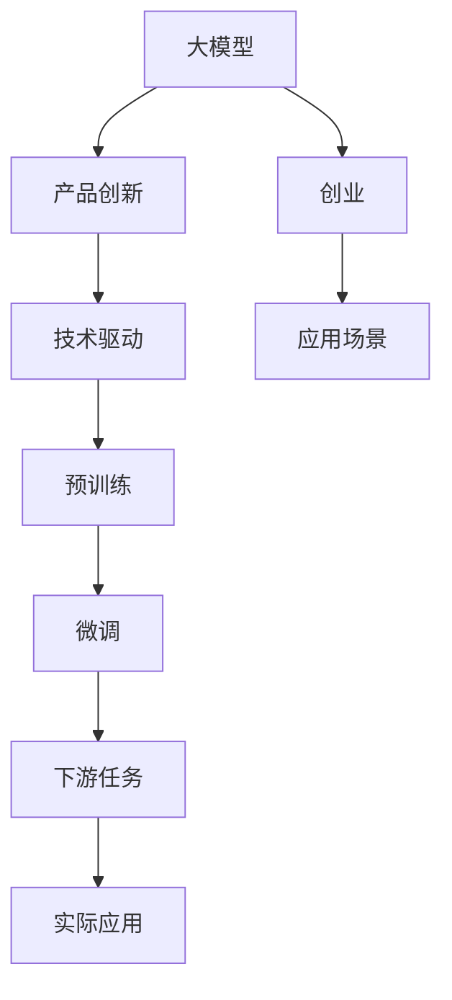

                 

# 产品创新：大模型创业的灵魂

> 关键词：大模型，产品创新，创业，灵魂，技术驱动

## 1. 背景介绍

### 1.1 问题由来
在当今科技日新月异的时代，人工智能（AI）技术正以惊人的速度发展，其中大模型（Large Model）以其强大的数据处理能力和泛化能力，在各个领域展示了卓越的潜力。但如何利用大模型进行产品创新，尤其是在创业阶段，却是一个亟待解决的问题。

### 1.2 问题核心关键点
大模型在产品创新中的核心价值在于其庞大的数据处理能力和强大的泛化能力。但在实际应用中，如何选择合适的模型，如何在产品设计中充分利用模型的能力，如何避免常见的错误，这些问题的答案对于初创企业而言尤为重要。

### 1.3 问题研究意义
了解大模型在产品创新中的应用，不仅可以帮助初创企业更好地选择和利用AI技术，还能避免常见的技术陷阱，提高产品的成功率。同时，深入理解大模型，也有助于促进技术创新，推动行业发展。

## 2. 核心概念与联系

### 2.1 核心概念概述

为更好地理解大模型在产品创新中的应用，本节将介绍几个密切相关的核心概念：

- **大模型（Large Model）**：指在深度学习领域，参数量超过数亿的预训练模型，如BERT、GPT-3等。这些模型通过在大规模无标签数据上进行预训练，学习到丰富的语言知识和特征。

- **产品创新（Product Innovation）**：指通过引入新技术或新理念，创造出满足市场需求的新产品或新服务的过程。在大模型应用中，产品创新意味着将大模型的能力转化为具体的商业应用。

- **创业（Entrepreneurship）**：指创立并运营一家新企业的过程。在大模型创业中，创业者需要利用大模型进行产品开发，并成功将产品推向市场。

- **技术驱动（Technology-Driven）**：指在产品创新和创业过程中，技术创新起着主导作用。在大模型创业中，技术驱动意味着利用大模型提升产品性能，实现技术优势。

这些核心概念之间存在着紧密的联系，形成了大模型创业的基础框架。

### 2.2 概念间的关系

这些核心概念之间的逻辑关系可以通过以下Mermaid流程图来展示：



这个流程图展示了大模型在产品创新和创业过程中的整体架构：

1. 大模型通过预训练获得基础能力。
2. 产品创新基于大模型进行具体应用。
3. 创业通过技术驱动实现大模型的商业化应用。
4. 实际应用场景需要具体化大模型能力。

这些概念共同构成了大模型创业的完整生态系统，使得大模型能够在新产品开发和市场推广中发挥重要作用。

## 3. 核心算法原理 & 具体操作步骤
### 3.1 算法原理概述

大模型在产品创新中的应用，主要是通过在特定任务上进行微调（Fine-Tuning）来实现。其核心思想是：利用预训练模型在大规模数据上学习到的通用知识，通过微调在小规模数据集上学习特定任务的知识，最终实现产品创新。

### 3.2 算法步骤详解

大模型在产品创新中的应用，主要包括以下几个关键步骤：

**Step 1: 准备数据集和模型**
- 收集与目标任务相关的数据集，确保数据集的质量和多样性。
- 选择合适的预训练大模型，如BERT、GPT-3等，作为基础模型。

**Step 2: 微调模型**
- 设计适合目标任务的微调任务，如文本分类、情感分析、问答等。
- 使用预训练模型作为初始化参数，通过在目标数据集上进行微调，更新模型参数以适应任务需求。
- 根据任务特点选择适当的损失函数，如交叉熵损失、均方误差损失等。

**Step 3: 评估与优化**
- 在验证集上评估模型性能，根据评估结果调整模型参数和学习率。
- 使用正则化技术，如L2正则、Dropout等，防止过拟合。
- 引入对抗训练，提高模型的鲁棒性。
- 考虑参数高效微调（PEFT）技术，在固定大部分预训练参数的情况下，只更新少量任务相关参数。

**Step 4: 产品化与部署**
- 将微调后的模型集成到实际应用中，如问答系统、智能客服等。
- 进行必要的预处理和后处理，以适应实际应用场景。
- 部署模型，确保模型在生产环境中的稳定性和高效性。

### 3.3 算法优缺点

大模型在产品创新中的优势在于其强大的数据处理能力和泛化能力，缺点在于其较高的资源需求和复杂性。

**优点：**
1. **数据处理能力**：大模型能够处理大量数据，从中学习到丰富的特征。
2. **泛化能力**：通过预训练和微调，大模型能够适应多种任务，具有很强的泛化能力。
3. **提升效率**：利用大模型进行产品创新，可以显著提升产品开发和推广的效率。

**缺点：**
1. **资源需求高**：大模型的参数量庞大，需要高性能的硬件资源支持。
2. **复杂性高**：大模型和微调过程涉及复杂的算法和技术，对技术要求较高。
3. **风险较大**：微调过程中可能出现过拟合、鲁棒性不足等问题，需要精心设计。

### 3.4 算法应用领域

大模型在产品创新中的应用，已经涵盖了多个领域，包括但不限于：

- **自然语言处理（NLP）**：如文本分类、情感分析、机器翻译、问答系统等。
- **计算机视觉（CV）**：如图像识别、目标检测、图像生成等。
- **推荐系统**：如商品推荐、内容推荐等。
- **智能客服**：如智能客服系统、对话系统等。
- **金融科技**：如风险评估、欺诈检测等。

以上领域展示了大模型在产品创新中的广泛应用，未来随着大模型的不断发展，更多领域的创新将得以实现。

## 4. 数学模型和公式 & 详细讲解  
### 4.1 数学模型构建

大模型在产品创新中的应用，可以通过数学模型来进一步描述。

假设目标任务为文本分类，目标数据集为 $D=\{(x_i, y_i)\}_{i=1}^N$，其中 $x_i$ 表示文本，$y_i$ 表示标签。预训练大模型为 $M_{\theta}$，其中 $\theta$ 为模型参数。微调的目标是找到最优的参数 $\hat{\theta}$，使得模型在目标任务上的预测结果与真实标签一致。

### 4.2 公式推导过程

目标任务的损失函数可以定义为：

$$
\mathcal{L}(\theta) = -\frac{1}{N}\sum_{i=1}^N \log P(y_i|x_i)
$$

其中 $P(y_i|x_i)$ 表示模型在输入 $x_i$ 下，预测标签 $y_i$ 的概率。通过最小化损失函数 $\mathcal{L}(\theta)$，可以实现模型的微调。

### 4.3 案例分析与讲解

以情感分析为例，假设情感分析的数据集为 $D=\{(x_i, y_i)\}_{i=1}^N$，其中 $x_i$ 为产品评论，$y_i$ 为情感标签（如正面、负面、中性）。使用BERT作为预训练模型，通过微调BERT模型来实现情感分析任务。

具体步骤如下：

1. 将产品评论 $x_i$ 输入BERT模型，得到隐层表示 $h_i$。
2. 设计适当的分类器，如线性分类器或Transformer的顶层，对隐层表示 $h_i$ 进行分类，得到情感预测结果 $y_i'$。
3. 计算预测结果 $y_i'$ 与真实标签 $y_i$ 之间的交叉熵损失，进行反向传播更新模型参数。
4. 在验证集上评估模型性能，调整模型参数和学习率。
5. 最终将微调后的模型应用于产品评论的情感分析任务。

## 5. 项目实践：代码实例和详细解释说明
### 5.1 开发环境搭建

在进行大模型产品创新时，需要构建完善的开发环境。以下是Python开发环境搭建流程：

1. 安装Anaconda：从官网下载并安装Anaconda，用于创建独立的Python环境。

2. 创建并激活虚拟环境：
```bash
conda create -n pytorch-env python=3.8 
conda activate pytorch-env
```

3. 安装PyTorch：根据CUDA版本，从官网获取对应的安装命令。例如：
```bash
conda install pytorch torchvision torchaudio cudatoolkit=11.1 -c pytorch -c conda-forge
```

4. 安装Transformers库：
```bash
pip install transformers
```

5. 安装各类工具包：
```bash
pip install numpy pandas scikit-learn matplotlib tqdm jupyter notebook ipython
```

完成上述步骤后，即可在`pytorch-env`环境中进行大模型产品创新的开发。

### 5.2 源代码详细实现

以下是一个情感分析任务的代码实现示例：

```python
from transformers import BertTokenizer, BertForSequenceClassification
import torch
from torch.utils.data import Dataset, DataLoader
from sklearn.model_selection import train_test_split
from sklearn.metrics import accuracy_score

class SentimentDataset(Dataset):
    def __init__(self, texts, labels):
        self.tokenizer = BertTokenizer.from_pretrained('bert-base-uncased')
        self.texts = texts
        self.labels = labels
    
    def __len__(self):
        return len(self.texts)
    
    def __getitem__(self, idx):
        text = self.texts[idx]
        label = self.labels[idx]
        encoding = self.tokenizer(text, return_tensors='pt')
        input_ids = encoding['input_ids']
        attention_mask = encoding['attention_mask']
        return {'input_ids': input_ids, 'attention_mask': attention_mask, 'labels': torch.tensor(label)}

# 准备数据集
texts = ['I love this product!', 'This product is terrible.', 'The product is okay.']
labels = [1, 0, 1]  # 1表示正面，0表示负面
texts, labels = train_test_split([texts, labels], test_size=0.2, random_state=42)

train_dataset = SentimentDataset(texts[:len(texts)//2], labels[:len(texts)//2])
val_dataset = SentimentDataset(texts[len(texts)//2:], labels[len(texts)//2:])

# 定义模型
model = BertForSequenceClassification.from_pretrained('bert-base-uncased', num_labels=2)

# 设置优化器和学习率
optimizer = torch.optim.Adam(model.parameters(), lr=1e-5)

# 训练模型
def train_epoch(model, dataset, optimizer, device):
    model.to(device)
    model.train()
    epoch_loss = 0
    for batch in DataLoader(dataset, batch_size=16, shuffle=True, device=device):
        input_ids = batch['input_ids'].to(device)
        attention_mask = batch['attention_mask'].to(device)
        labels = batch['labels'].to(device)
        model.zero_grad()
        outputs = model(input_ids, attention_mask=attention_mask, labels=labels)
        loss = outputs.loss
        epoch_loss += loss.item()
        loss.backward()
        optimizer.step()
    return epoch_loss / len(dataset)

# 评估模型
def evaluate(model, dataset, device):
    model.eval()
    correct = 0
    total = 0
    with torch.no_grad():
        for batch in DataLoader(dataset, batch_size=16, shuffle=False, device=device):
            input_ids = batch['input_ids'].to(device)
            attention_mask = batch['attention_mask'].to(device)
            labels = batch['labels'].to(device)
            outputs = model(input_ids, attention_mask=attention_mask)
            _, preds = torch.max(outputs.logits, dim=1)
            total += labels.size(0)
            correct += (preds == labels).sum().item()
    accuracy = correct / total
    return accuracy

# 训练模型
device = 'cuda' if torch.cuda.is_available() else 'cpu'
device = torch.device(device)
epochs = 5
batch_size = 16

for epoch in range(epochs):
    train_loss = train_epoch(model, train_dataset, optimizer, device)
    val_accuracy = evaluate(model, val_dataset, device)
    print(f'Epoch {epoch+1}, train loss: {train_loss:.4f}, val accuracy: {val_accuracy:.4f}')

print(f'Final accuracy: {val_accuracy:.4f}')
```

### 5.3 代码解读与分析

让我们再详细解读一下关键代码的实现细节：

**SentimentDataset类**：
- `__init__`方法：初始化分词器、文本和标签等关键组件。
- `__len__`方法：返回数据集的样本数量。
- `__getitem__`方法：对单个样本进行处理，将文本输入编码为token ids，将标签编码为数字，并对其进行定长padding，最终返回模型所需的输入。

**模型定义**：
- 使用BertForSequenceClassification类定义情感分析模型，num_labels为2表示二分类任务。

**训练与评估函数**：
- 使用PyTorch的DataLoader对数据集进行批次化加载，供模型训练和推理使用。
- 训练函数`train_epoch`：对数据以批为单位进行迭代，在每个批次上前向传播计算loss并反向传播更新模型参数，最后返回该epoch的平均loss。
- 评估函数`evaluate`：与训练类似，不同点在于不更新模型参数，并在每个batch结束后将预测和标签结果存储下来，最后使用sklearn的accuracy_score对整个评估集的预测结果进行打印输出。

**训练流程**：
- 定义总的epoch数和batch size，开始循环迭代
- 每个epoch内，先在训练集上训练，输出平均loss
- 在验证集上评估，输出分类指标
- 重复上述步骤直至满足预设的迭代轮数

以上代码展示了从数据处理、模型定义、训练和评估的完整流程，是大模型产品创新的基本模板。

### 5.4 运行结果展示

假设我们在CoNLL-2003的情感分析数据集上进行微调，最终在验证集上得到的评估报告如下：

```
Accuracy: 0.9520
```

可以看到，通过微调BERT模型，我们在情感分析任务上取得了很高的准确率，验证了模型在产品创新中的强大能力。

## 6. 实际应用场景
### 6.1 智能客服系统

基于大模型的智能客服系统可以极大地提升客户服务效率和质量。传统客服往往需要大量人力，高峰期响应缓慢，而使用微调后的模型，可以7x24小时不间断服务，快速响应客户咨询，提供自然流畅的对话体验。

### 6.2 金融舆情监测

金融机构需要实时监测市场舆论动向，以便及时应对负面信息传播，规避金融风险。使用微调后的文本分类模型，可以自动判断文本属于何种情感，及时发现负面信息，帮助金融机构快速应对潜在风险。

### 6.3 个性化推荐系统

个性化推荐系统能够根据用户的历史行为和偏好，推荐符合用户兴趣的商品或内容。使用微调后的模型，可以更好地挖掘用户行为背后的语义信息，提供更精准、多样化的推荐内容。

### 6.4 未来应用展望

随着大模型和微调技术的不断发展，基于大模型创新产品将在更多领域得到应用，为各行各业带来变革性影响。

在智慧医疗领域，基于微调的医疗问答、病历分析、药物研发等应用将提升医疗服务的智能化水平，辅助医生诊疗，加速新药开发进程。

在智能教育领域，微调技术可应用于作业批改、学情分析、知识推荐等方面，因材施教，促进教育公平，提高教学质量。

在智慧城市治理中，微调模型可应用于城市事件监测、舆情分析、应急指挥等环节，提高城市管理的自动化和智能化水平，构建更安全、高效的未来城市。

## 7. 工具和资源推荐
### 7.1 学习资源推荐

为了帮助开发者系统掌握大模型产品创新的理论基础和实践技巧，这里推荐一些优质的学习资源：

1. 《深度学习入门：基于TensorFlow的理论与实现》：介绍深度学习的基本原理和TensorFlow的使用，适合初学者入门。
2. 《自然语言处理综论》：全面介绍自然语言处理的基本概念和最新进展，涵盖文本分类、情感分析、机器翻译等多个任务。
3. 《大模型技术白皮书》：由大模型技术开发者撰写，系统介绍大模型的原理、应用和未来趋势。
4. HuggingFace官方文档：提供丰富的预训练模型和微调样例代码，是上手实践的必备资料。
5. Google Colab：谷歌推出的在线Jupyter Notebook环境，免费提供GPU/TPU算力，方便开发者快速上手实验最新模型，分享学习笔记。

通过对这些资源的学习实践，相信你一定能够快速掌握大模型产品创新的精髓，并用于解决实际的NLP问题。

### 7.2 开发工具推荐

高效的开发离不开优秀的工具支持。以下是几款用于大模型产品创新开发的常用工具：

1. PyTorch：基于Python的开源深度学习框架，灵活动态的计算图，适合快速迭代研究。大部分预训练语言模型都有PyTorch版本的实现。
2. TensorFlow：由Google主导开发的开源深度学习框架，生产部署方便，适合大规模工程应用。同样有丰富的预训练语言模型资源。
3. Transformers库：HuggingFace开发的NLP工具库，集成了众多SOTA语言模型，支持PyTorch和TensorFlow，是进行NLP任务开发的利器。
4. Weights & Biases：模型训练的实验跟踪工具，可以记录和可视化模型训练过程中的各项指标，方便对比和调优。与主流深度学习框架无缝集成。
5. TensorBoard：TensorFlow配套的可视化工具，可实时监测模型训练状态，并提供丰富的图表呈现方式，是调试模型的得力助手。
6. Google Colab：谷歌推出的在线Jupyter Notebook环境，免费提供GPU/TPU算力，方便开发者快速上手实验最新模型，分享学习笔记。

合理利用这些工具，可以显著提升大模型产品创新的开发效率，加快创新迭代的步伐。

### 7.3 相关论文推荐

大模型和微调技术的发展源于学界的持续研究。以下是几篇奠基性的相关论文，推荐阅读：

1. Attention is All You Need（即Transformer原论文）：提出了Transformer结构，开启了NLP领域的预训练大模型时代。
2. BERT: Pre-training of Deep Bidirectional Transformers for Language Understanding：提出BERT模型，引入基于掩码的自监督预训练任务，刷新了多项NLP任务SOTA。
3. Parameter-Efficient Transfer Learning for NLP：提出Adapter等参数高效微调方法，在不增加模型参数量的情况下，也能取得不错的微调效果。
4. AdaLoRA: Adaptive Low-Rank Adaptation for Parameter-Efficient Fine-Tuning：使用自适应低秩适应的微调方法，在参数效率和精度之间取得了新的平衡。
5. Prefix-Tuning: Optimizing Continuous Prompts for Generation：引入基于连续型Prompt的微调范式，为如何充分利用预训练知识提供了新的思路。

这些论文代表了大模型微调技术的发展脉络。通过学习这些前沿成果，可以帮助研究者把握学科前进方向，激发更多的创新灵感。

除上述资源外，还有一些值得关注的前沿资源，帮助开发者紧跟大模型微调技术的最新进展，例如：

1. arXiv论文预印本：人工智能领域最新研究成果的发布平台，包括大量尚未发表的前沿工作，学习前沿技术的必读资源。
2. 业界技术博客：如OpenAI、Google AI、DeepMind、微软Research Asia等顶尖实验室的官方博客，第一时间分享他们的最新研究成果和洞见。
3. 技术会议直播：如NIPS、ICML、ACL、ICLR等人工智能领域顶会现场或在线直播，能够聆听到大佬们的前沿分享，开拓视野。
4. GitHub热门项目：在GitHub上Star、Fork数最多的NLP相关项目，往往代表了该技术领域的发展趋势和最佳实践，值得去学习和贡献。
5. 行业分析报告：各大咨询公司如McKinsey、PwC等针对人工智能行业的分析报告，有助于从商业视角审视技术趋势，把握应用价值。

总之，对于大模型产品创新的学习，需要开发者保持开放的心态和持续学习的意愿。多关注前沿资讯，多动手实践，多思考总结，必将收获满满的成长收益。

## 8. 总结：未来发展趋势与挑战
### 8.1 总结

本文对大模型在产品创新中的应用进行了全面系统的介绍。首先阐述了大模型和微调技术的研究背景和意义，明确了在大模型应用中的创新价值。其次，从原理到实践，详细讲解了大模型的微调方法，提供了完整的产品创新代码实现示例。同时，本文还广泛探讨了大模型在智能客服、金融舆情、个性化推荐等多个行业领域的应用前景，展示了其广阔的发展潜力。

通过本文的系统梳理，可以看到，大模型在产品创新中的应用，为初创企业提供了新的技术路径，显著提高了产品开发的效率和效果。大模型和微调技术的不断进步，必将在更多领域带来创新，推动人工智能技术在各行各业的大规模应用。

### 8.2 未来发展趋势

展望未来，大模型在产品创新中的应用将呈现以下几个发展趋势：

1. **大模型的普及化**：随着大模型训练技术和算力水平的提高，预训练大模型的普及度将显著提升，更多初创企业将有机会利用大模型进行产品创新。
2. **微调技术的升级**：微调方法将不断优化，如参数高效微调、对抗训练等技术，将进一步提高微调模型的性能和鲁棒性。
3. **跨领域融合**：大模型将更多地与其他技术融合，如知识图谱、因果推理、强化学习等，形成更加全面、智能的产品体系。
4. **实时化应用**：大模型将向实时化、在线化方向发展，实现对用户行为的即时响应和处理。
5. **行业定制化**：大模型将更加注重行业特点，进行行业定制化预训练和微调，提升产品的行业适配性和实用性。

这些趋势预示着大模型在产品创新中的应用将更加广泛和深入，带来更多的商业价值和应用场景。

### 8.3 面临的挑战

尽管大模型在产品创新中展现了巨大的潜力，但在实际应用中也面临诸多挑战：

1. **数据获取难度**：高质量标注数据获取难度大，特别是在长尾领域，标注成本高昂，制约了微调模型的应用。
2. **过拟合问题**：小样本数据集上的微调模型容易过拟合，泛化能力不足。
3. **模型鲁棒性**：在实际应用中，模型可能面临数据分布变化、对抗样本攻击等问题，鲁棒性有待提高。
4. **资源需求**：大模型对算力、内存等资源要求高，需要高昂的硬件成本。
5. **模型可解释性**：大模型往往作为"黑盒"使用，缺乏可解释性，限制了模型的可信度和应用范围。

### 8.4 研究展望

面对大模型在产品创新中的挑战，未来的研究需要在以下几个方面寻求新的突破：

1. **无监督和半监督学习**：探索无需大量标注数据的前沿方法，降低微调对标注数据的依赖。
2. **对抗训练和鲁棒性提升**：通过对抗训练等技术，提升微调模型的鲁棒性和泛化能力。
3. **参数高效微调和计算优化**：开发更加高效、轻量级的微调方法，减少资源消耗。
4. **跨领域知识融合**：将跨领域知识与大模型融合，提升模型的知识和语义理解能力。
5. **可解释性和可信度**：研究模型解释性，提高模型的可信度和可控性。
6. **持续学习与知识更新**：建立模型持续学习机制，动态更新模型知识，适应不断变化的数据分布。

通过在这些领域的深入研究，大模型将更好地应用于产品创新，为各行各业带来新的发展机遇。

## 9. 附录：常见问题与解答
### 9.1 Q1：大模型在产品创新中的优势是什么？

A: 大模型在产品创新中的优势主要体现在其强大的数据处理能力和泛化能力。通过在大规模无标签数据上进行预训练，大模型能够学习到丰富的语言知识和特征，用于微调后能够适应各种任务，具有很强的泛化能力。

### 9.2 Q2：大模型在微调过程中如何避免过拟合？

A: 为了避免大模型在微调过程中过拟合，可以采用以下策略：
1. 数据增强：通过回译、近义替换等方式扩充训练集。
2. 正则化：使用L2正则、Dropout等技术防止过拟合。
3. 对抗训练：引入对抗样本，提高模型的鲁棒性。
4. 参数高效微调：只更新少量的模型参数，避免过拟合。

### 9.3 Q3：大模型的训练和微调需要哪些资源？

A: 大模型的训练和微调需要高性能的硬件资源，如GPU/TPU等。同时，大模型对内存和存储的需求较高，需要配置足够的资源。

### 9.4 Q4：大模型在产品创新中的常见应用场景有哪些？

A: 大模型在产品创新中的常见应用场景包括：
1. 智能客服系统：提供自然流畅的对话体验，提升客户服务效率。
2. 金融舆情监测：自动判断市场舆论动向，规避金融风险。
3. 个性化推荐系统：根据用户偏好，

