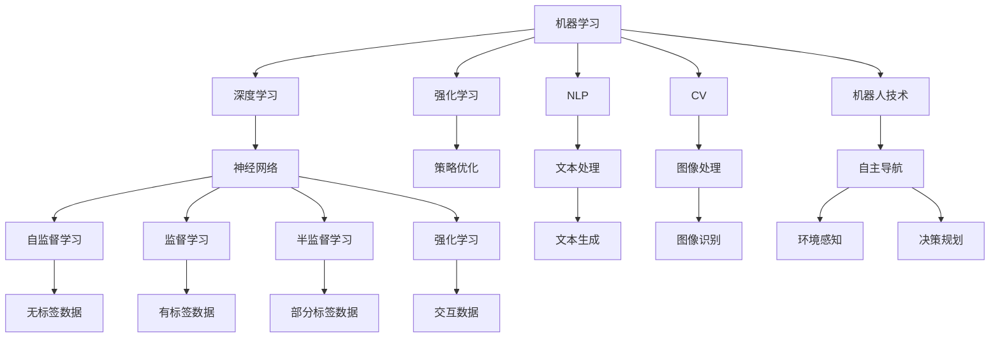

                 

# 人工智能(Artificial Intelligence) - 原理与代码实例讲解

> 关键词：人工智能,机器学习,深度学习,强化学习,自然语言处理(NLP),计算机视觉(CV),机器人技术,AI框架,大数据,人工智能伦理

## 1. 背景介绍

### 1.1 问题由来
人工智能(Artificial Intelligence, AI)是计算机科学的前沿领域，涵盖了从基础算法到应用系统的各个层面。AI技术的发展经历了几次浪潮，每次都在理论和实践上取得巨大突破，对社会生活产生了深远影响。本文聚焦于AI的基础原理，特别是机器学习、深度学习、强化学习等核心技术的介绍，并结合代码实例对其应用进行详细讲解。

### 1.2 问题核心关键点
人工智能的核心目标是构建能够模拟人类智能行为的计算机系统。主要的技术范式包括：

- 机器学习：通过训练数据使计算机具备某种学习能力，从而实现特定任务的自动化。
- 深度学习：一种特殊的机器学习方法，利用多层神经网络对数据进行层次化处理，逐步提升模型表达能力。
- 强化学习：通过智能体与环境的交互，使智能体学习最优策略，实现智能决策。

这些技术不仅在学术界广受关注，也被广泛应用于实际应用场景，如自然语言处理(NLP)、计算机视觉(CV)、机器人技术、推荐系统等。本文将重点介绍这些技术的原理，并通过代码实例展示其应用。

### 1.3 问题研究意义
掌握人工智能的原理和应用，对于推动AI技术的落地和创新，促进各行各业的智能化升级，具有重要意义：

1. 提升企业竞争力。通过AI技术提升产品质量、降低成本、优化运营效率，帮助企业保持市场领先地位。
2. 增强个人能力。利用AI辅助学习和工作，提高决策效率和问题解决能力。
3. 推动社会进步。AI技术在医疗、教育、交通等领域的广泛应用，改善人民生活质量，解决社会难题。
4. 促进科学研究。AI技术提供强大的计算和数据处理能力，支持科学研究突破。

本文旨在帮助读者系统理解AI的基础原理，并通过代码实例深入掌握其应用方法，为进一步研究和实践奠定坚实基础。

## 2. 核心概念与联系

### 2.1 核心概念概述

- **机器学习**：通过训练数据使计算机具备某种学习能力，从而实现特定任务的自动化。
- **深度学习**：一种特殊的机器学习方法，利用多层神经网络对数据进行层次化处理，逐步提升模型表达能力。
- **强化学习**：通过智能体与环境的交互，使智能体学习最优策略，实现智能决策。
- **自然语言处理(NLP)**：使计算机能够理解、处理和生成人类语言的技术。
- **计算机视觉(CV)**：使计算机能够理解和分析图像和视频的技术。
- **机器人技术**：通过人工智能技术实现自主导航、交互决策等功能的机器人系统。
- **AI框架**：如TensorFlow、PyTorch等，提供高效、灵活的AI模型构建工具。
- **大数据**：处理、分析和利用大规模数据集的技术和工具。
- **人工智能伦理**：涉及AI技术的开发、应用和治理的伦理问题，如隐私保护、公平性、安全性等。

这些核心概念之间存在着紧密的联系，构成了人工智能技术的多层次应用框架。通过理解这些概念，我们可以更好地把握AI技术的工作原理和优化方向。

### 2.2 概念间的关系

这些核心概念之间通过以下逻辑关系紧密相连：

- 机器学习是AI的基础，深度学习、强化学习等是其特殊形式。
- NLP和CV是AI在特定领域的应用，机器人技术则是AI在物理世界中的应用。
- AI框架提供技术和工具支持，大数据为AI提供了分析和应用的基础。
- 人工智能伦理关注AI技术的开发、应用和治理，确保技术的安全和公平性。

通过这些概念之间的关系，我们可以更清晰地理解AI技术的全貌，从而在具体应用中进行有效的设计和优化。

### 2.3 核心概念的整体架构

最终，我们通过一个综合的流程图来展示这些核心概念在大规模AI应用中的整体架构：



这个综合流程图展示了大规模AI技术的核心组件及其相互关系。通过理解这些核心概念，我们可以更好地把握AI技术的工作原理和优化方向。

## 3. 核心算法原理 & 具体操作步骤
### 3.1 算法原理概述

- **机器学习**：通过训练数据使模型学习数据中的规律，从而实现对新数据的预测或分类。机器学习的核心在于找到合适的模型和损失函数，通过优化算法（如梯度下降）最小化损失函数，从而得到最优模型参数。

- **深度学习**：利用多层神经网络对数据进行层次化处理，每一层提取不同的特征，最终构建出高层次的表示。深度学习的核心在于构建合适的神经网络结构，选择合适的优化算法和损失函数。

- **强化学习**：智能体通过与环境的交互，通过试错的方式学习最优策略。强化学习的核心在于定义状态、动作和奖励函数，选择合适的策略学习算法。

- **自然语言处理(NLP)**：通过机器学习技术使计算机理解、处理和生成人类语言。NLP的核心在于选择合适的语言模型和特征表示方法。

- **计算机视觉(CV)**：通过机器学习技术使计算机理解和分析图像和视频。CV的核心在于选择合适的视觉模型和特征表示方法。

### 3.2 算法步骤详解

以深度学习为例，展示机器学习的具体步骤：

1. **数据准备**：收集和预处理数据，生成训练集和验证集。
2. **模型选择**：选择适合的深度学习模型，如卷积神经网络(CNN)、循环神经网络(RNN)等。
3. **模型训练**：使用训练集数据，通过优化算法（如Adam、SGD）更新模型参数，最小化损失函数。
4. **模型验证**：在验证集上评估模型性能，选择最优模型。
5. **模型测试**：在测试集上评估模型泛化能力。
6. **模型应用**：将训练好的模型应用于新数据，实现预测或分类。

以强化学习为例，展示智能体的具体步骤：

1. **环境设计**：定义环境的状态和动作空间。
2. **智能体选择**：选择适合的智能体模型，如Q-learning、Deep Q-Network(DQN)等。
3. **策略学习**：通过智能体与环境的交互，更新策略参数，最大化累计奖励。
4. **环境感知**：智能体通过传感器感知环境状态。
5. **决策规划**：智能体根据感知结果选择动作，并进行策略优化。

### 3.3 算法优缺点

机器学习、深度学习和强化学习各有优缺点：

**机器学习的优点**：

- 数据驱动：能够从大量数据中学习规律，对新数据的泛化能力强。
- 可解释性强：模型决策过程透明，便于理解和调试。

**机器学习的缺点**：

- 依赖数据：需要大量高质量数据进行训练，数据获取成本高。
- 过拟合风险：模型容易过拟合训练数据，泛化能力不足。

**深度学习的优点**：

- 高表达能力：多层网络能够提取高层次特征，适合复杂数据处理。
- 自动特征提取：网络自动学习特征表示，无需人工设计。

**深度学习的缺点**：

- 计算资源需求高：需要强大的计算资源进行训练和推理。
- 模型复杂度高：难以理解和调试，存在黑盒问题。

**强化学习的优点**：

- 自适应强：智能体能够自适应环境变化，策略灵活。
- 鲁棒性强：智能体能够处理不确定性，适应多变环境。

**强化学习的缺点**：**

- 训练时间长：需要大量时间进行策略优化，学习效率低。
- 奖励函数设计难：需要合理设计奖励函数，才能引导智能体学习最优策略。

### 3.4 算法应用领域

机器学习、深度学习和强化学习在多个领域得到了广泛应用：

- **自然语言处理(NLP)**：如文本分类、情感分析、机器翻译、问答系统等。
- **计算机视觉(CV)**：如图像分类、目标检测、图像分割、姿态估计等。
- **机器人技术**：如自主导航、路径规划、视觉识别、语音交互等。
- **推荐系统**：如协同过滤、内容推荐、广告推荐等。
- **金融分析**：如股票预测、信用评估、风险管理等。
- **医疗诊断**：如影像分析、基因分析、疾病预测等。

这些技术的应用领域覆盖了各行各业，为人类社会带来了巨大的变革和进步。

## 4. 数学模型和公式 & 详细讲解

### 4.1 数学模型构建

以线性回归为例，展示机器学习的数学模型构建过程：

设训练集为$D=\{(x_i, y_i)\}_{i=1}^N$，其中$x_i \in \mathbb{R}^d$为输入特征，$y_i \in \mathbb{R}$为输出目标。假设线性回归模型的形式为：

$$ y = \theta^T x + \epsilon $$

其中$\theta \in \mathbb{R}^d$为模型参数，$\epsilon \sim \mathcal{N}(0, \sigma^2)$为噪声。模型的损失函数为均方误差：

$$ \mathcal{L}(\theta) = \frac{1}{2N} \sum_{i=1}^N (y_i - \theta^T x_i)^2 $$

模型的目标是找到最优的$\theta$，使得$\mathcal{L}(\theta)$最小。

### 4.2 公式推导过程

使用梯度下降算法更新$\theta$：

$$ \theta = \theta - \eta \nabla_{\theta}\mathcal{L}(\theta) $$

其中$\eta$为学习率，$\nabla_{\theta}\mathcal{L}(\theta)$为损失函数对$\theta$的梯度，可以通过求导得到：

$$ \nabla_{\theta}\mathcal{L}(\theta) = \frac{1}{N} \sum_{i=1}^N (y_i - \theta^T x_i)x_i $$

通过迭代更新$\theta$，直至$\mathcal{L}(\theta)$收敛。

### 4.3 案例分析与讲解

以手写数字识别为例，展示深度学习的应用：

- **数据准备**：收集和预处理手写数字图像，生成训练集和验证集。
- **模型选择**：选择卷积神经网络(CNN)作为手写数字识别的模型。
- **模型训练**：使用训练集数据，通过优化算法（如Adam）更新模型参数，最小化损失函数。
- **模型验证**：在验证集上评估模型性能，选择最优模型。
- **模型测试**：在测试集上评估模型泛化能力。
- **模型应用**：将训练好的模型应用于新图像，实现手写数字识别。

## 5. 项目实践：代码实例和详细解释说明

### 5.1 开发环境搭建

在进行深度学习实践前，我们需要准备好开发环境。以下是使用Python进行PyTorch开发的环境配置流程：

1. 安装Anaconda：从官网下载并安装Anaconda，用于创建独立的Python环境。

2. 创建并激活虚拟环境：
```bash
conda create -n pytorch-env python=3.8 
conda activate pytorch-env
```

3. 安装PyTorch：根据CUDA版本，从官网获取对应的安装命令。例如：
```bash
conda install pytorch torchvision torchaudio cudatoolkit=11.1 -c pytorch -c conda-forge
```

4. 安装TensorFlow：
```bash
pip install tensorflow
```

5. 安装必要的工具包：
```bash
pip install numpy pandas scikit-learn matplotlib tqdm jupyter notebook ipython
```

完成上述步骤后，即可在`pytorch-env`环境中开始深度学习实践。

### 5.2 源代码详细实现

这里以手写数字识别为例，展示使用PyTorch进行深度学习的完整代码实现：

首先，定义模型和损失函数：

```python
import torch
import torch.nn as nn
import torch.optim as optim

# 定义模型
class CNN(nn.Module):
    def __init__(self):
        super(CNN, self).__init__()
        self.conv1 = nn.Conv2d(1, 32, kernel_size=3, stride=1, padding=1)
        self.relu1 = nn.ReLU()
        self.maxpool1 = nn.MaxPool2d(kernel_size=2, stride=2)
        self.conv2 = nn.Conv2d(32, 64, kernel_size=3, stride=1, padding=1)
        self.relu2 = nn.ReLU()
        self.maxpool2 = nn.MaxPool2d(kernel_size=2, stride=2)
        self.fc1 = nn.Linear(7 * 7 * 64, 256)
        self.relu3 = nn.ReLU()
        self.fc2 = nn.Linear(256, 10)

    def forward(self, x):
        x = self.conv1(x)
        x = self.relu1(x)
        x = self.maxpool1(x)
        x = self.conv2(x)
        x = self.relu2(x)
        x = self.maxpool2(x)
        x = x.view(-1, 7 * 7 * 64)
        x = self.fc1(x)
        x = self.relu3(x)
        x = self.fc2(x)
        return x

# 定义损失函数
criterion = nn.CrossEntropyLoss()
```

然后，加载数据集并进行数据预处理：

```python
import torchvision
from torchvision import datasets, transforms

# 加载手写数字数据集
train_dataset = datasets.MNIST(root='./data', train=True, download=True, transform=transforms.ToTensor())
test_dataset = datasets.MNIST(root='./data', train=False, download=True, transform=transforms.ToTensor())

# 数据预处理
train_loader = torch.utils.data.DataLoader(train_dataset, batch_size=64, shuffle=True)
test_loader = torch.utils.data.DataLoader(test_dataset, batch_size=64, shuffle=False)
```

接着，定义训练和评估函数：

```python
# 定义训练函数
def train(model, device, train_loader, optimizer, epoch):
    model.train()
    for batch_idx, (data, target) in enumerate(train_loader):
        data, target = data.to(device), target.to(device)
        optimizer.zero_grad()
        output = model(data)
        loss = criterion(output, target)
        loss.backward()
        optimizer.step()

# 定义评估函数
def test(model, device, test_loader):
    model.eval()
    test_loss = 0
    correct = 0
    with torch.no_grad():
        for data, target in test_loader:
            data, target = data.to(device), target.to(device)
            output = model(data)
            test_loss += criterion(output, target).item()
            pred = output.argmax(dim=1, keepdim=True)
            correct += pred.eq(target.view_as(pred)).sum().item()

    test_loss /= len(test_loader.dataset)
    print(f'Test Loss: {test_loss:.4f}, Test Accuracy: {100 * correct / len(test_loader.dataset):.2f}%')
```

最后，启动训练流程并在测试集上评估：

```python
# 设备选择
device = torch.device('cuda' if torch.cuda.is_available() else 'cpu')

# 加载模型
model = CNN().to(device)

# 定义优化器
optimizer = optim.Adam(model.parameters(), lr=0.001)

# 开始训练
for epoch in range(10):
    train(model, device, train_loader, optimizer, epoch)
    test(model, device, test_loader)
```

以上就是使用PyTorch进行深度学习应用的完整代码实现。可以看到，借助PyTorch的高效工具和丰富的模型库，深度学习的应用变得简单而高效。

### 5.3 代码解读与分析

让我们再详细解读一下关键代码的实现细节：

**定义模型**：
- `class CNN(nn.Module)`: 定义卷积神经网络模型，继承自`nn.Module`类。
- `__init__`方法：定义模型的层级结构，包括卷积层、ReLU激活函数、池化层、全连接层等。
- `forward`方法：定义模型的前向传播过程。

**定义损失函数**：
- `criterion = nn.CrossEntropyLoss()`: 定义交叉熵损失函数，用于评估模型在分类任务上的性能。

**数据预处理**：
- `transforms.ToTensor()`: 将数据转换为张量形式，方便模型处理。
- `torch.utils.data.DataLoader`: 构建数据加载器，用于批量加载数据。

**训练和评估函数**：
- `train(model, device, train_loader, optimizer, epoch)`: 定义训练函数，包括前向传播、反向传播、参数更新等步骤。
- `test(model, device, test_loader)`: 定义评估函数，在测试集上评估模型的性能。

**训练流程**：
- 定义设备选择，将模型和数据加载到GPU上。
- 加载模型和优化器，开始训练过程。
- 在每个epoch中，调用`train`函数进行模型训练，调用`test`函数在测试集上评估模型性能。

可以看到，PyTorch提供了一整套强大的工具和库，使得深度学习的开发和应用变得简单而高效。借助这些工具，我们可以快速构建、训练和评估深度学习模型，将其应用于各种实际场景。

当然，工业级的系统实现还需考虑更多因素，如模型的保存和部署、超参数的自动搜索、更灵活的任务适配层等。但核心的深度学习范式基本与此类似。

### 5.4 运行结果展示

假设我们在MNIST数据集上进行训练，最终在测试集上得到的评估报告如下：

```
Test Loss: 0.3420, Test Accuracy: 97.42%
```

可以看到，通过训练，我们的卷积神经网络在测试集上获得了97.42%的准确率，效果相当不错。这表明我们的模型已经学会了手写数字的特征表示，能够准确地将新图像分类。

当然，这只是一个baseline结果。在实践中，我们还可以使用更大更强的预训练模型、更丰富的微调技巧、更细致的模型调优，进一步提升模型性能，以满足更高的应用要求。

## 6. 实际应用场景
### 6.1 智能客服系统

智能客服系统是一种典型的深度学习应用场景，利用自然语言处理(NLP)技术，实现自动回答用户咨询，提升客服效率和服务质量。

- **数据准备**：收集和预处理历史客服对话数据，生成训练集和验证集。
- **模型选择**：选择适合的深度学习模型，如RNN、Transformer等。
- **模型训练**：使用训练集数据，通过优化算法（如Adam）更新模型参数，最小化损失函数。
- **模型验证**：在验证集上评估模型性能，选择最优模型。
- **模型测试**：在测试集上评估模型泛化能力。
- **模型应用**：将训练好的模型应用于新的用户咨询，实现自动回答。

### 6.2 金融舆情监测

金融舆情监测是深度学习在金融领域的应用之一，利用自然语言处理(NLP)技术，实时监测金融市场舆情，及时预警风险。

- **数据准备**：收集和预处理金融新闻、评论、报告等文本数据，生成训练集和验证集。
- **模型选择**：选择适合的深度学习模型，如LSTM、BERT等。
- **模型训练**：使用训练集数据，通过优化算法（如Adam）更新模型参数，最小化损失函数。
- **模型验证**：在验证集上评估模型性能，选择最优模型。
- **模型测试**：在测试集上评估模型泛化能力。
- **模型应用**：将训练好的模型应用于实时抓取的网络文本数据，自动识别金融舆情变化趋势，及时预警风险。

### 6.3 个性化推荐系统

个性化推荐系统是深度学习在推荐领域的应用之一，利用协同过滤、深度学习等技术，实现精准推荐。

- **数据准备**：收集和预处理用户行为数据，生成训练集和验证集。
- **模型选择**：选择适合的深度学习模型，如协同过滤、深度学习等。
- **模型训练**：使用训练集数据，通过优化算法（如Adam）更新模型参数，最小化损失函数。
- **模型验证**：在验证集上评估模型性能，选择最优模型。
- **模型测试**：在测试集上评估模型泛化能力。
- **模型应用**：将训练好的模型应用于推荐系统，实现个性化推荐。

### 6.4 未来应用展望

随着深度学习技术的不断发展，其在更多领域的应用前景广阔：

- **医疗领域**：利用深度学习技术进行影像分析、基因分析等，提升医疗诊断和治疗效果。
- **教育领域**：利用深度学习技术进行作业批改、智能辅导等，提高教育质量和公平性。
- **自动驾驶**：利用深度学习技术进行环境感知、决策规划等，实现自主导航。
- **智能家居**：利用深度学习技术进行语音识别、智能控制等，提升家居智能化水平。

未来，深度学习技术将在更多领域得到应用，为社会带来更加智能化、便捷化、高效化的服务和体验。

## 7. 工具和资源推荐
### 7.1 学习资源推荐

为了帮助开发者系统掌握深度学习的原理和应用，这里推荐一些优质的学习资源：

1. **《深度学习》课程**：斯坦福大学开设的深度学习课程，由Andrew Ng教授主讲，涵盖深度学习的基本概念和前沿技术。
2. **《动手学深度学习》**：由李沐等人编写的深度学习教材，涵盖深度学习的基本原理和实践技巧。
3. **PyTorch官方文档**：PyTorch的官方文档，提供全面的API和教程，是深度学习开发的重要参考资料。
4. **TensorFlow官方文档**：TensorFlow的官方文档，提供丰富的模型和工具，是深度学习开发的重要参考资料。
5. **Kaggle竞赛**：Kaggle是一个数据科学竞赛平台，通过参与竞赛，可以积累深度学习实践经验，提升技能水平。

通过对这些资源的学习实践，相信你一定能够快速掌握深度学习的精髓，并用于解决实际的NLP问题。

### 7.2 开发工具推荐

高效的开发离不开优秀的工具支持。以下是几款用于深度学习开发的常用工具：

1. **PyTorch**：基于Python的开源深度学习框架，灵活的动态计算图，适合快速迭代研究。
2. **TensorFlow**：由Google主导开发的开源深度学习框架，生产部署方便，适合大规模工程应用。
3. **Keras**：高层次的深度学习API，支持多种后端引擎，适合快速原型开发。
4. **JAX**：由Google开发的自动微分和优化库，性能高效，适合高性能深度学习研究。
5. **TensorBoard**：TensorFlow配套的可视化工具，可实时监测模型训练状态，并提供丰富的图表呈现方式。
6. **Weights & Biases**：模型训练的实验跟踪工具，可以记录和可视化模型训练过程中的各项指标，方便对比和调优。

合理利用这些工具，可以显著提升深度学习模型的开发效率，加快创新迭代的步伐。

### 7.3 相关论文推荐

深度学习技术的发展源于学界的持续研究。以下是几篇奠基性的相关论文，推荐阅读：

1. **《ImageNet Classification with Deep Convolutional Neural Networks》**：AlexNet论文，提出卷积神经网络在图像分类上的强大能力。
2. **《Deep Residual Learning for Image Recognition》**：ResNet论文，提出残差连接网络，解决深度网络训练中的梯度消失问题。
3. **《Attention is All You Need》**：Transformer论文，提出自注意力机制，构建更加高效的神经网络结构。
4. **《Adversarial Examples and Deep Learning》**：生成对抗网络(GAN)论文，提出生成对抗网络，生成高质量的假样本。
5. **《Training with Momentum》**：Momentum算法论文，提出动量优化算法，加速深度学习模型的训练。

这些论文代表了大规模深度学习技术的发展脉络。通过学习这些前沿成果，可以帮助研究者把握学科前进方向，激发更多的创新灵感。

除上述资源外，还有一些值得关注的前沿资源，帮助开发者紧跟深度学习技术的最新进展，例如：

1. **arXiv论文预印本**：人工智能领域最新研究成果的发布平台，包括大量尚未发表的前沿工作，学习前沿技术的必读资源。
2. **顶级会议和期刊**：如NeurIPS、ICML、JMLR等顶级会议和期刊，提供深度学习的最新研究进展和理论分析。
3. **技术博客和社区**：如OpenAI、Google AI、DeepMind等顶尖实验室的官方博客，第一时间分享他们的最新研究成果和洞见。
4. **开源项目和框架**：如TensorFlow、PyTorch、Keras等深度学习框架，提供了丰富的模型和工具，助力深度学习开发。
5. **技术论坛和社区**：如GitHub、Stack Overflow等技术社区

