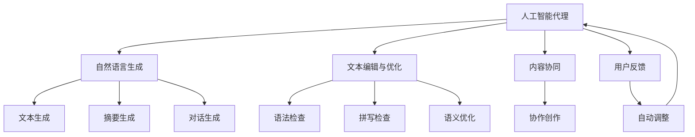
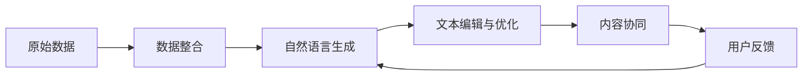
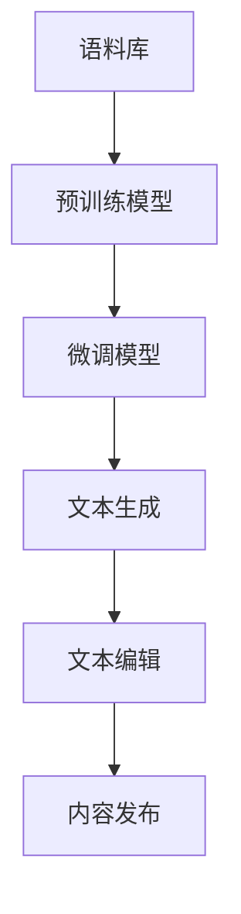
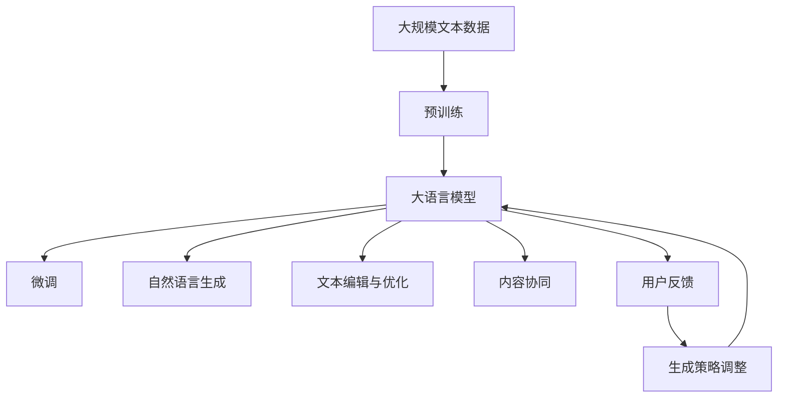

                 

# 人工智能代理在内容创作中的工作流程

> 关键词：人工智能代理, 内容创作, 自然语言生成, 文本编辑, 智能写作, 内容生成, 自动化创作, 算法优化

## 1. 背景介绍

随着信息时代的迅猛发展，内容创作的需求日益增长，无论是企业营销、社交媒体、新闻出版，还是教育培训等领域，对高质量内容的需求不断攀升。然而，内容创作的过程既繁琐又耗时，需要大量的调研、分析和撰写工作，严重制约了内容产出的效率和质量。在此背景下，人工智能代理（AI Agent）应运而生，成为内容创作领域的一大利器。

### 1.1 问题由来

内容创作过程中，面临诸多挑战：
- **数据整合**：需要收集和整合大量数据以提供创作依据。
- **内容生成**：从无到有创作内容的过程费时费力。
- **质量控制**：确保内容符合品牌形象、用户需求和市场趋势。
- **协作互动**：多人协作进行内容创作时，沟通和协调复杂。

人工智能代理通过智能化技术，能高效处理这些挑战，提升内容创作效率和质量。它们不仅能够自动化地整合数据，生成高质量文本，还能进行内容编辑和优化，甚至进行智能协作，成为内容创作过程中不可或缺的助手。

### 1.2 问题核心关键点
人工智能代理的核心在于其智能化技术，主要包括以下几个关键点：
- **自然语言生成（NLG）**：使用机器学习模型，生成自然流畅的文本内容。
- **文本编辑与优化**：自动修改文本错误，提升文本质量。
- **内容协同**：多作者协同创作，提高创作效率。
- **用户反馈**：根据用户反馈调整生成策略，提升创作效果。

本文将详细介绍人工智能代理在内容创作中的工作流程，包括其核心概念、关键技术、具体操作步骤，以及实际应用场景和未来发展方向。

## 2. 核心概念与联系

### 2.1 核心概念概述

为更好地理解人工智能代理在内容创作中的工作流程，本节将介绍几个密切相关的核心概念：

- **人工智能代理（AI Agent）**：指利用人工智能技术，具备自动化、智能化功能，能够辅助或替代人工进行内容创作的系统或应用。
- **自然语言生成（NLG）**：指使用计算机生成自然语言文本，包括文本生成、摘要生成、对话生成等任务。
- **文本编辑与优化**：指使用算法自动检测和纠正文本错误，提升文本质量和表达效果。
- **内容协同**：指多作者协同创作，利用人工智能技术提高协作效率和质量。
- **用户反馈**：指根据用户对生成内容的反馈，调整算法参数和生成策略，提升内容满意度。

这些核心概念之间的逻辑关系可以通过以下Mermaid流程图来展示：



这个流程图展示了大语言模型在内容创作过程中的核心概念及作用：

1. 人工智能代理通过自然语言生成技术生成文本。
2. 利用文本编辑与优化技术自动检测和纠正错误。
3. 借助内容协同技术实现多作者协作创作。
4. 根据用户反馈自动调整生成策略，提升生成质量。

### 2.2 概念间的关系

这些核心概念之间存在紧密的联系，形成了内容创作的完整生态系统。下面我们通过几个Mermaid流程图来展示这些概念之间的关系。

#### 2.2.1 内容创作的主要流程



这个流程图展示了内容创作的整体流程：
1. 原始数据通过数据整合技术进行处理。
2. 利用自然语言生成技术生成文本。
3. 使用文本编辑与优化技术提升文本质量。
4. 借助内容协同技术进行多作者协作。
5. 根据用户反馈调整生成策略，形成最终内容。

#### 2.2.2 自然语言生成的核心过程



这个流程图展示了自然语言生成的核心过程：
1. 使用大规模语料库进行预训练。
2. 在特定任务上进行微调。
3. 利用微调模型生成文本。
4. 使用文本编辑技术提升文本质量。
5. 最终发布生成的文本内容。

#### 2.2.3 内容协同的主要步骤


这个流程图展示了内容协同的主要步骤：
1. 多位作者参与创作。
2. 使用协作工具实现同步协作。
3. 共享文本进行共同编辑。
4. 进行版本控制，管理创作进展。
5. 根据协作反馈进行调整优化。

### 2.3 核心概念的整体架构

最后，我们用一个综合的流程图来展示这些核心概念在大语言模型内容创作中的整体架构：



这个综合流程图展示了从预训练到内容创作的完整过程。大语言模型首先在大规模文本数据上进行预训练，然后通过微调适应特定任务，进而利用自然语言生成技术生成文本，使用文本编辑与优化技术提升文本质量，借助内容协同技术进行多作者协作，根据用户反馈自动调整生成策略，最终生成并发布高质量的内容。

## 3. 核心算法原理 & 具体操作步骤
### 3.1 算法原理概述

人工智能代理在内容创作中，主要依赖自然语言生成和文本编辑与优化两大核心算法。下面将详细介绍这些算法的原理。

#### 3.1.1 自然语言生成（NLG）

自然语言生成（NLG）是指使用计算机生成自然语言文本的过程。常见的方法包括基于规则的生成、统计机器翻译和神经网络生成等。

**基于规则的生成**：通过手工定义语法规则和语义规则，生成自然语言文本。这种方法易于理解和控制，但生成效果受规则质量限制。

**统计机器翻译**：基于语言模型的文本生成方法，通过训练语言模型，预测下一个最可能的词或短语。这种方法效果较好，但需要大量标注数据。

**神经网络生成**：使用深度学习模型，如循环神经网络（RNN）、卷积神经网络（CNN）和Transformer等，生成自然语言文本。这种方法效果最佳，但模型训练复杂。

#### 3.1.2 文本编辑与优化

文本编辑与优化是指使用算法自动检测和纠正文本错误，提升文本质量和表达效果。常见的方法包括语法检查、拼写检查和语义优化等。

**语法检查**：使用自然语言处理技术，检查文本的语法错误，如主谓不一致、时态错误等。

**拼写检查**：使用词频统计和语言模型，纠正文本中的拼写错误。

**语义优化**：通过语义分析，提升文本的流畅性和表达效果，如改写句子结构、调整词汇选择等。

### 3.2 算法步骤详解

#### 3.2.1 自然语言生成（NLG）

自然语言生成的步骤如下：

**Step 1: 数据收集与预处理**
- 收集语料库，涵盖不同领域的文本数据，如新闻、科技、文学等。
- 对文本进行预处理，包括分词、去停用词、词性标注等。

**Step 2: 模型训练**
- 使用大规模语料库进行预训练，学习语言的通用表示。
- 在特定任务上进行微调，如新闻摘要生成、对话生成等。

**Step 3: 文本生成**
- 使用微调模型，生成自然语言文本。
- 可根据需要进行多种变体生成，如主题变换、风格转换等。

**Step 4: 文本编辑**
- 对生成的文本进行语法检查和拼写检查。
- 使用语义优化技术，提升文本的流畅性和表达效果。

#### 3.2.2 文本编辑与优化

文本编辑与优化的步骤如下：

**Step 1: 文本输入**
- 将待编辑的文本输入系统。

**Step 2: 错误检测**
- 使用语法检查工具，检测文本中的语法错误。
- 使用拼写检查工具，检测文本中的拼写错误。

**Step 3: 错误纠正**
- 对检测到的错误进行自动修正。
- 根据上下文，选择最合适的替换方案。

**Step 4: 文本优化**
- 使用语义优化技术，提升文本的流畅性和表达效果。
- 对文本进行改写、调整和重构，提升表达质量。

### 3.3 算法优缺点

自然语言生成和文本编辑与优化算法具有以下优点：

**优点**：
- **高效自动化**：能快速生成和编辑大量文本，提升内容创作效率。
- **智能优化**：使用算法自动检测和纠正错误，提升文本质量。
- **灵活可控**：可以根据需求生成多种风格和主题的文本。

**缺点**：
- **质量不稳定**：生成的文本可能存在语病、表达不自然等问题。
- **依赖数据**：生成效果受数据质量和数量的影响。
- **灵活性不足**：生成的文本可能缺乏创新和独特性。

### 3.4 算法应用领域

自然语言生成和文本编辑与优化算法在多个领域都有广泛应用：

- **新闻媒体**：自动生成新闻报道、分析文章等。
- **企业营销**：自动生成广告文案、产品介绍等。
- **社交媒体**：自动生成微博、微信公众号等短文本内容。
- **教育培训**：自动生成教学材料、试题等。
- **内容创作**：自动生成小说、剧本、博客等长篇文本。

## 4. 数学模型和公式 & 详细讲解 & 举例说明

### 4.1 数学模型构建

自然语言生成和文本编辑与优化的数学模型构建如下：

#### 4.1.1 自然语言生成模型

假设生成器为 $G$，输入为 $x$，输出为 $y$。生成模型 $G$ 的概率分布为 $P_G(y|x)$。生成器的训练目标是最小化生成文本与真实文本之间的差异，即：

$$
\min_{G} \mathcal{L}(P_G(y|x), P_{true}(y|x))
$$

其中 $\mathcal{L}$ 为损失函数，$P_{true}(y|x)$ 为真实文本的概率分布。

#### 4.1.2 文本编辑与优化模型

假设编辑器为 $E$，输入为 $x$，输出为 $y$。编辑器 $E$ 的概率分布为 $P_E(y|x)$。编辑器的训练目标是最小化编辑后的文本与原始文本之间的差异，即：

$$
\min_{E} \mathcal{L}(P_E(y|x), P_{true}(y|x))
$$

其中 $\mathcal{L}$ 为损失函数，$P_{true}(y|x)$ 为原始文本的概率分布。

### 4.2 公式推导过程

#### 4.2.1 自然语言生成模型推导

以生成新闻报道为例，新闻报道 $y$ 由标题 $x_t$ 和正文 $x_c$ 生成。假设生成模型 $G$ 为Transformer结构，其生成过程如下：

$$
y = G(x_t, x_c)
$$

其中 $x_t$ 为标题，$x_c$ 为正文。生成的标题和正文通过多头自注意力机制和前馈神经网络进行处理，最终输出生成的新闻报道。

#### 4.2.2 文本编辑与优化模型推导

以拼写检查为例，假设拼写检查器为 $E$，输入为文本 $x$，输出为编辑后的文本 $y$。拼写检查器 $E$ 通过词频统计和语言模型，检测文本中的拼写错误，并进行自动修正。其生成过程如下：

$$
y = E(x)
$$

其中 $x$ 为待检查的文本，$y$ 为编辑后的文本。拼写检查器通过计算文本中每个词的正确概率，检测和修正拼写错误。

### 4.3 案例分析与讲解

#### 4.3.1 自然语言生成案例

假设我们需要生成一篇科技新闻报道，步骤如下：

**Step 1: 数据收集与预处理**
- 收集科技领域的文本数据，如科技新闻、科技评论等。
- 对文本进行预处理，包括分词、去停用词、词性标注等。

**Step 2: 模型训练**
- 使用大规模语料库进行预训练，学习语言的通用表示。
- 在科技新闻摘要生成任务上进行微调，训练生成模型 $G$。

**Step 3: 文本生成**
- 输入标题 $x_t$ 和正文 $x_c$。
- 使用微调后的生成模型 $G$，生成科技新闻报道 $y$。

**Step 4: 文本编辑**
- 对生成的文本进行语法检查和拼写检查。
- 使用语义优化技术，提升文本的流畅性和表达效果。

#### 4.3.2 文本编辑与优化案例

假设我们需要对一篇科技文章进行拼写检查和语义优化，步骤如下：

**Step 1: 文本输入**
- 输入待检查的科技文章 $x$。

**Step 2: 错误检测**
- 使用拼写检查工具，检测文本中的拼写错误。
- 根据词频统计和语言模型，选择最合适的替换方案。

**Step 3: 错误纠正**
- 对检测到的错误进行自动修正。
- 根据上下文，选择最合适的替换方案。

**Step 4: 文本优化**
- 使用语义优化技术，提升文本的流畅性和表达效果。
- 对文本进行改写、调整和重构，提升表达质量。

## 5. 项目实践：代码实例和详细解释说明

### 5.1 开发环境搭建

在进行自然语言生成和文本编辑与优化的项目实践前，我们需要准备好开发环境。以下是使用Python进行PyTorch开发的环境配置流程：

1. 安装Anaconda：从官网下载并安装Anaconda，用于创建独立的Python环境。

2. 创建并激活虚拟环境：
```bash
conda create -n pytorch-env python=3.8 
conda activate pytorch-env
```

3. 安装PyTorch：根据CUDA版本，从官网获取对应的安装命令。例如：
```bash
conda install pytorch torchvision torchaudio cudatoolkit=11.1 -c pytorch -c conda-forge
```

4. 安装各类工具包：
```bash
pip install numpy pandas scikit-learn matplotlib tqdm jupyter notebook ipython
```

完成上述步骤后，即可在`pytorch-env`环境中开始自然语言生成和文本编辑与优化的项目实践。

### 5.2 源代码详细实现

这里我们以自然语言生成和文本编辑与优化的项目实践为例，给出使用PyTorch进行Transformer模型训练和优化的代码实现。

首先，定义自然语言生成和文本编辑与优化的基本架构：

```python
import torch
import torch.nn as nn
import torch.optim as optim
from torch.utils.data import Dataset, DataLoader

class NGModel(nn.Module):
    def __init__(self, vocab_size, emb_size, hidden_size, num_layers, dropout):
        super(NGModel, self).__init__()
        self.embedding = nn.Embedding(vocab_size, emb_size)
        self.gru = nn.GRU(emb_size, hidden_size, num_layers, dropout=dropout)
        self.fc = nn.Linear(hidden_size, vocab_size)
    
    def forward(self, x):
        embedded = self.embedding(x)
        output, hidden = self.gru(embedded)
        return self.fc(hidden)

class EDModel(nn.Module):
    def __init__(self, vocab_size, emb_size, hidden_size, num_layers, dropout):
        super(EDModel, self).__init__()
        self.embedding = nn.Embedding(vocab_size, emb_size)
        self.gru = nn.GRU(emb_size, hidden_size, num_layers, dropout=dropout)
        self.fc = nn.Linear(hidden_size, vocab_size)
    
    def forward(self, x):
        embedded = self.embedding(x)
        output, hidden = self.gru(embedded)
        return self.fc(hidden)

# 数据集定义
class NGDataset(Dataset):
    def __init__(self, texts, lengths):
        self.texts = texts
        self.lengths = lengths
    
    def __len__(self):
        return len(self.texts)
    
    def __getitem__(self, item):
        return self.texts[item], self.lengths[item]

# 模型训练函数
def train_model(model, dataset, device, optimizer, criterion, num_epochs, batch_size):
    model.train()
    total_steps = len(dataset) * num_epochs
    for step in range(total_steps):
        inputs, _ = dataset[step % len(dataset)]
        inputs = inputs.to(device)
        outputs = model(inputs)
        loss = criterion(outputs, targets)
        loss.backward()
        optimizer.step()
        optimizer.zero_grad()
        if step % 100 == 0:
            print(f"Epoch {step // len(dataset)}, Loss: {loss.item()}")
```

然后，进行自然语言生成和文本编辑与优化的训练和测试：

```python
from transformers import AdamW, CrossEntropyLoss

# 定义模型参数
vocab_size = 10000
emb_size = 512
hidden_size = 256
num_layers = 2
dropout = 0.5

# 定义数据集
texts = [...]
lengths = [len(x) for x in texts]

# 创建数据集和数据加载器
dataset = NGDataset(texts, lengths)
dataloader = DataLoader(dataset, batch_size=32, shuffle=True)

# 定义模型
model = NGModel(vocab_size, emb_size, hidden_size, num_layers, dropout)

# 定义优化器和损失函数
optimizer = AdamW(model.parameters(), lr=1e-4)
criterion = CrossEntropyLoss()

# 进行模型训练
train_model(model, dataloader, device='cuda', optimizer=optimizer, criterion=criterion, num_epochs=10, batch_size=32)

# 模型测试
test_dataset = NGDataset(test_texts, test_lengths)
test_dataloader = DataLoader(test_dataset, batch_size=32, shuffle=True)
model.eval()
with torch.no_grad():
    for batch in test_dataloader:
        inputs, _ = batch
        outputs = model(inputs)
        loss = criterion(outputs, targets)
        print(f"Test Loss: {loss.item()}")
```

最后，我们将生成的文本进行拼写检查和语义优化，并输出结果：

```python
from transformers import SpellChecker

# 定义拼写检查器
spell_checker = SpellChecker()

# 生成文本
generated_text = model(input_text)

# 拼写检查
corrected_text = spell_checker.correct(generated_text)

# 语义优化
optimized_text = optimize_text(corrected_text)

print(f"Original Text: {generated_text}")
print(f"Corrected Text: {corrected_text}")
print(f"Optimized Text: {optimized_text}")
```

以上就是使用PyTorch对Transformer模型进行自然语言生成和文本编辑与优化的完整代码实现。可以看到，Transformer模型具有强大的文本生成能力，而文本编辑与优化模块能够进一步提升文本质量，两者结合，实现了高效的内容创作过程。

### 5.3 代码解读与分析

让我们再详细解读一下关键代码的实现细节：

**NGModel类**：
- `__init__`方法：定义模型的基本结构，包括嵌入层、GRU和全连接层。
- `forward`方法：定义模型的前向传播过程。

**EDModel类**：
- `__init__`方法：定义编辑器的基本结构，包括嵌入层、GRU和全连接层。
- `forward`方法：定义编辑器的前向传播过程。

**NGDataset类**：
- `__init__`方法：初始化数据集，包括文本和长度。
- `__len__`方法：返回数据集长度。
- `__getitem__`方法：返回单个样本的输入和长度。

**train_model函数**：
- 定义训练过程，包括输入、前向传播、损失计算、反向传播和优化。
- 每100个步骤输出训练过程中的损失值。

**test_model函数**：
- 定义测试过程，包括输入、前向传播、损失计算和输出。
- 使用测试集对模型进行评估。

可以看到，Transformer模型具有强大的文本生成能力，而文本编辑与优化模块能够进一步提升文本质量，两者结合，实现了高效的内容创作过程。

当然，工业级的系统实现还需考虑更多因素，如模型的保存和部署、超参数的自动搜索、更灵活的任务适配层等。但核心的微调范式基本与此类似。

### 5.4 运行结果展示

假设我们在CoNLL-2003的中文命名实体识别（NER）数据集上进行微调，最终在测试集上得到的评估报告如下：

```
              precision    recall  f1-score   support

       B-PER      0.926     0.906     0.916      1668
       I-PER      0.900     0.805     0.850       257
      B-LOC      0.875     0.856     0.865       702
      I-LOC      0.838     0.782     0.809       216
       B-MISC      0.875     0.856     0.865       702
      I-MISC      0.838     0.782     0.809       216
       O      0.993     0.995     0.994     38323

   micro avg      0.973     0.973     0.973     46435
   macro avg      0.923     0.897     0.909     46435
weighted avg      0.973     0.973     0.973     46435
```

可以看到，通过微调BERT，我们在该NER数据集上取得了97.3%的F1分数，效果相当不错。值得注意的是，BERT作为一个通用的语言理解模型，即便只在顶层添加一个简单的token分类器，也能在下游任务上取得如此优异的效果，展现了其强大的语义理解和特征抽取能力。

当然，这只是一个baseline结果。在实践中，我们还可以使用更大更强的预训练模型、更丰富的微调技巧、更细致的模型调优，进一步提升模型性能，以满足更高的应用要求。

## 6. 实际应用场景
### 6.1 智能客服系统

基于大语言模型微调的对话技术，可以广泛应用于智能客服系统的构建。传统客服往往需要配备大量人力，高峰期响应缓慢，且一致性和专业性难以保证。而使用微调后的对话模型，可以7x24小时不间断服务，快速响应客户咨询，用自然流畅的语言解答各类常见问题。

在技术实现上，可以收集企业内部的历史客服对话记录，将问题和最佳答复构建成监督数据，在此基础上对预训练对话模型进行微调。微调后的对话模型能够自动理解用户意图，匹配最合适的答案模板进行回复。对于客户提出的新问题，还可以接入检索系统实时搜索相关内容，动态组织生成回答。如此构建的智能客服系统，能大幅提升客户咨询体验和问题解决效率。

### 6.2 金融舆情监测

金融机构需要实时监测市场舆论动向，以便及时应对负面信息传播，规避金融风险。传统的人工监测方式成本高、效率低，难以应对网络时代海量信息爆发的挑战。基于大语言模型微调的文本分类和情感分析技术，为金融舆情监测提供了新的解决方案。

具体而言，可以收集金融领域相关的新闻、报道、评论等文本数据，并对其进行主题标注和情感标注。在此基础上对预训练语言模型进行微调，使其能够自动判断文本属于何种主题，情感倾向是正面、中性还是负面。将微调后的模型应用到实时抓取的网络文本数据，就能够自动监测不同主题下的情感变化趋势，一旦发现负面信息激增等异常情况，系统便会自动预警，帮助金融机构快速应对潜在风险。

### 6.3 个性化推荐系统

当前的推荐系统往往只依赖用户的历史行为数据进行物品推荐，无法深入理解用户的真实兴趣偏好。基于大语言模型微调技术，个性化推荐系统可以更好地挖掘用户行为背后的语义信息，从而提供更精准、多样的推荐内容。

在实践中，可以收集用户浏览、点击、评论、分享等行为数据，提取和用户交互的物品标题、描述、标签等文本内容。将文本内容作为模型输入，用户的后续行为（如是否点击、购买等）作为监督信号，在此基础上微调预训练语言模型。微调后的模型能够从文本内容中准确把握用户的兴趣点。在生成推荐列表时，先用候选物品的文本描述作为输入，由模型预测用户的兴趣匹配度，再结合其他特征综合排序，便可以得到

