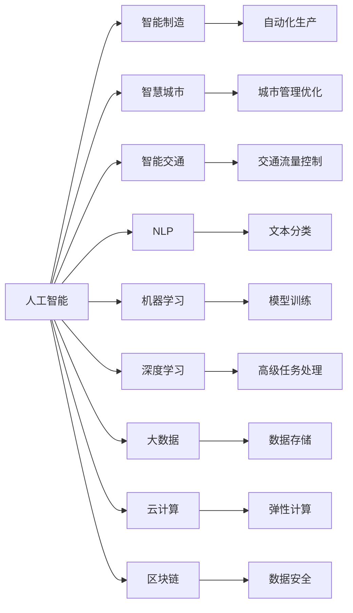
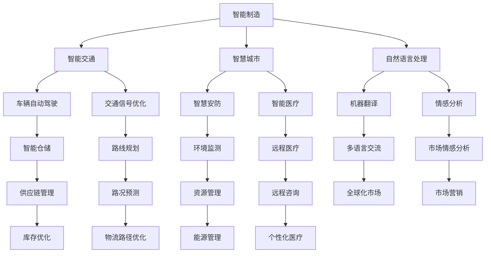
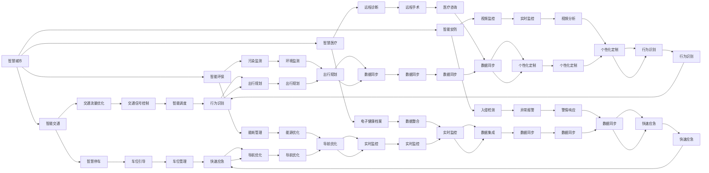
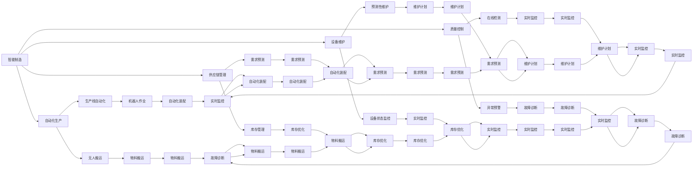
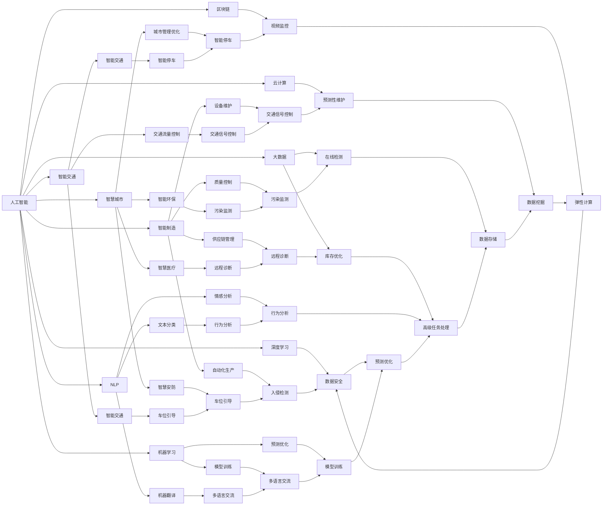

                 

# 人工智能在产业中的创新应用

> 关键词：人工智能,产业应用,创新,自动化,智能化,智能制造,智慧城市,智能交通,自然语言处理,机器学习,深度学习,大数据,云计算,区块链

## 1. 背景介绍

### 1.1 问题由来
随着人工智能(AI)技术的飞速发展，其在各个产业中的应用已经从理论探索转向实际落地。AI的创新应用不仅极大地提升了生产效率，还带来了商业模式和组织架构的变革。从智能制造到智慧城市，再到智能交通，AI正在改变我们生活的方方面面。

人工智能通过模拟人类思维，实现了自动化的流程优化和决策支持，使得企业在成本控制、质量管理、客户服务等方面取得了显著的提升。然而，在实际应用中，如何高效利用AI技术，解决具体产业的痛点，仍是一个需要深入探索的问题。

### 1.2 问题核心关键点
AI在产业中的创新应用，核心关键点包括：
1. **数据驱动**：AI系统的核心在于数据，数据的获取、清洗、处理、分析对AI应用的效果有决定性影响。
2. **模型选择**：不同AI模型适用于不同的应用场景，选择合适的模型是提高AI应用效果的关键。
3. **算法优化**：AI模型的训练和优化是提升模型性能的关键步骤。
4. **应用集成**：将AI模型与现有系统集成，实现无缝对接。
5. **技术应用**：具体到每个行业的应用场景，需要结合业务需求进行技术实现。

### 1.3 问题研究意义
研究AI在产业中的创新应用，对于提升产业竞争力、优化资源配置、促进经济增长具有重要意义：
1. 降低运营成本：AI自动化替代了大量繁琐的人工操作，提高了生产效率。
2. 提升决策质量：AI系统能分析海量数据，提供精确的决策支持。
3. 创新商业模式：AI技术的应用重塑了传统行业的业务流程，带来了新的商业模式。
4. 强化客户体验：AI系统能提供个性化的服务，提升客户满意度。
5. 助力数字化转型：AI推动了传统企业的数字化转型，促进了企业信息化的进程。

## 2. 核心概念与联系

### 2.1 核心概念概述

为了更好地理解AI在产业中的创新应用，我们首先介绍几个关键概念：

- **人工智能(AI)**：利用计算机和算法模拟人类智能，包括感知、学习、推理等能力。AI包括机器学习、深度学习、自然语言处理等多种技术。
- **智能制造**：结合AI和物联网(IoT)技术，实现生产过程的自动化、智能化，提高生产效率和产品质量。
- **智慧城市**：利用AI技术优化城市管理，提升城市运行效率和居民生活质量。
- **智能交通**：通过AI技术优化交通流量，提高道路通行效率，减少交通事故。
- **自然语言处理(NLP)**：让机器能够理解、处理人类语言，包括文本分类、机器翻译、对话系统等。
- **机器学习(ML)**：AI中的核心技术，通过学习数据中的模式和规律，不断提升模型的预测和决策能力。
- **深度学习(Deep Learning)**：ML的一种高级形式，通过多层次神经网络处理数据，实现更复杂的任务。
- **大数据(Big Data)**：海量数据的收集、存储和分析，是AI应用的重要数据基础。
- **云计算(Cloud Computing)**：提供计算资源的弹性扩展，支持大规模AI模型的训练和部署。
- **区块链(Blockchain)**：一种去中心化的信任机制，可以确保AI系统的数据安全性和透明性。

这些概念之间有着紧密的联系，形成了AI在产业中的创新应用生态系统。以下是一个Mermaid流程图，展示这些核心概念的相互关系：



### 2.2 概念间的关系

这些核心概念之间存在着紧密的联系，形成了AI在产业中的创新应用框架。以下通过几个Mermaid流程图来展示这些概念之间的关系。

#### 2.2.1 AI的创新应用框架



这个流程图展示了AI在智能制造、智慧城市、智能交通等多个产业中的应用，以及这些应用如何相互关联，形成完整的生态系统。

#### 2.2.2 AI在智慧城市中的应用



这个流程图展示了智慧城市中多个子系统的关系，以及AI技术如何帮助提升城市的运行效率和管理水平。

#### 2.2.3 AI在智能制造中的应用



这个流程图展示了智能制造中的自动化生产、质量控制、设备维护等多个环节，以及AI如何通过自动化和智能化提升生产效率。

### 2.3 核心概念的整体架构

最后，我们用一个综合的流程图来展示这些核心概念在大规模AI应用中的整体架构：



这个综合流程图展示了AI在各个产业中的具体应用，以及这些应用如何通过数据、模型、算法等关键要素相互协作，形成完整的产业创新生态系统。

## 3. 核心算法原理 & 具体操作步骤
### 3.1 算法原理概述

AI在产业中的创新应用，核心在于算法原理和操作步骤的设计与实施。以下我们将详细介绍这些关键内容。

#### 3.1.1 算法原理概述

AI在产业中的应用，主要基于以下算法原理：

1. **数据驱动**：AI系统需要大量的数据进行训练，通过数据分析挖掘出其中的规律和模式。这些数据可以来自多个渠道，如传感器、社交媒体、用户行为等。

2. **模型选择**：选择合适的模型是提高AI应用效果的关键。不同模型适用于不同的应用场景，如机器学习、深度学习、自然语言处理等。

3. **算法优化**：AI模型的训练和优化是提升模型性能的关键步骤。常见的算法优化技术包括正则化、Dropout、梯度裁剪等。

4. **应用集成**：将AI模型与现有系统集成，实现无缝对接。这需要考虑系统兼容性、数据接口等问题。

5. **技术应用**：具体到每个行业的应用场景，需要结合业务需求进行技术实现。这需要跨学科的知识和技能。

#### 3.1.2 算法步骤详解

AI在产业中的应用，主要包含以下几个步骤：

1. **需求分析**：确定业务需求和目标，明确AI应用的场景和范围。

2. **数据收集**：从多个渠道收集数据，包括结构化数据、非结构化数据、实时数据等。

3. **数据预处理**：对数据进行清洗、归一化、特征提取等预处理，确保数据质量。

4. **模型选择与设计**：根据业务需求选择合适的模型，并进行模型设计。

5. **模型训练与优化**：使用训练数据对模型进行训练，并通过优化算法提升模型性能。

6. **模型评估与测试**：对模型进行评估和测试，确保其满足业务需求。

7. **模型部署与应用**：将模型部署到实际应用环境中，进行实时数据分析和决策支持。

8. **监控与维护**：对模型进行持续监控和维护，确保其性能和稳定性。

#### 3.1.3 算法优缺点

AI在产业中的应用，具有以下优点和缺点：

**优点**：

1. **提高效率**：AI自动化替代了大量繁琐的人工操作，提高了生产效率和决策速度。

2. **优化决策**：AI系统能分析海量数据，提供精确的决策支持。

3. **改善体验**：AI系统能提供个性化的服务，提升客户体验。

4. **创新应用**：AI技术的应用重塑了传统行业的业务流程，带来了新的商业模式。

5. **增强竞争力**：AI技术的应用提升了企业的竞争力和市场地位。

**缺点**：

1. **数据依赖**：AI系统的核心在于数据，数据的获取、清洗、处理、分析对AI应用的效果有决定性影响。

2. **技术门槛**：AI技术的应用需要跨学科的知识和技能，技术门槛较高。

3. **安全风险**：AI系统的数据和模型可能存在安全风险，需要采取相应的安全措施。

4. **伦理问题**：AI技术的应用可能带来伦理问题，如隐私保护、偏见歧视等。

#### 3.1.4 算法应用领域

AI在产业中的应用，涉及多个领域，具体如下：

1. **智能制造**：结合AI和物联网技术，实现生产过程的自动化、智能化，提高生产效率和产品质量。

2. **智慧城市**：利用AI技术优化城市管理，提升城市运行效率和居民生活质量。

3. **智能交通**：通过AI技术优化交通流量，提高道路通行效率，减少交通事故。

4. **智能医疗**：利用AI技术提升诊断和治疗的准确性，改善医疗服务的质量。

5. **金融科技**：利用AI技术进行风险评估、客户服务、交易监控等，提升金融服务的效率和安全性。

6. **零售电商**：利用AI技术进行需求预测、库存管理、个性化推荐等，提升销售效率和客户体验。

7. **教育培训**：利用AI技术进行智能推荐、自动化评估、学习分析等，提升教育培训的效果。

## 4. 数学模型和公式 & 详细讲解 & 举例说明
### 4.1 数学模型构建

AI在产业中的应用，涉及到多个数学模型和公式。以下我们将详细介绍这些内容。

#### 4.1.1 数学模型构建

AI在产业中的应用，主要基于以下数学模型：

1. **线性回归模型**：用于预测连续型变量，如销售预测、价格预测等。

2. **逻辑回归模型**：用于分类任务，如信用评分、情感分析等。

3. **决策树模型**：用于分类和回归任务，易于解释和理解。

4. **随机森林模型**：用于分类和回归任务，减少模型过拟合。

5. **支持向量机模型**：用于分类和回归任务，在高维空间中表现良好。

6. **神经网络模型**：用于处理复杂的非线性关系，如图像识别、语音识别等。

7. **深度学习模型**：如卷积神经网络(CNN)、循环神经网络(RNN)、长短时记忆网络(LSTM)等，用于处理更复杂的任务。

#### 4.1.2 公式推导过程

以下我们将详细介绍这些数学模型的公式推导过程。

**线性回归模型**：

$$
y = \beta_0 + \beta_1 x_1 + \beta_2 x_2 + ... + \beta_n x_n + \epsilon
$$

其中，$y$为预测值，$x_1, x_2, ..., x_n$为自变量，$\beta_0, \beta_1, ..., \beta_n$为模型参数，$\epsilon$为误差项。

**逻辑回归模型**：

$$
P(y=1) = \frac{1}{1+e^{-z}}
$$

其中，$z = \beta_0 + \beta_1 x_1 + \beta_2 x_2 + ... + \beta_n x_n$，$y=1$表示正类。

**决策树模型**：

$$
if (x_1 <= c_1) then:
    predict = decision_tree.subtree_1(x_2)
else:
    predict = decision_tree.subtree_2(x_2)
$$

其中，$x_1, x_2$为节点，$c_1$为分割点，$decision_tree.subtree_1$和$decision_tree.subtree_2$为子树。

**随机森林模型**：

$$
y = \frac{1}{N} \sum_{i=1}^{N} y_i
$$

其中，$y_i$为单个决策树模型的预测结果，$N$为决策树的数量。

**支持向量机模型**：

$$
y = \sum_{i=1}^{N} \alpha_i y_i K(x_i, x) + b
$$

其中，$K(x_i, x)$为核函数，$\alpha_i$为拉格朗日乘数，$y_i$为标签，$b$为偏置项。

**神经网络模型**：

$$
a_i = f(w_i^T x + b_i)
$$

其中，$a_i$为神经元输出，$w_i$为权重，$b_i$为偏置项，$f$为激活函数。

**深度学习模型**：

$$
z = \sum_{i=1}^{n} w_{i,j}a_j + b_i
$$

其中，$z$为神经元输出，$w_{i,j}$为权重，$a_j$为上一层神经元输出，$b_i$为偏置项。

### 4.3 案例分析与讲解

以下我们将详细介绍这些数学模型在实际应用中的案例分析。

**案例1：线性回归模型在销售预测中的应用**：

假设我们有一个电子商务平台的销售数据，包括时间、广告投入、营销策略等，我们想要预测未来一段时间内的销售情况。

1. **数据准备**：收集销售数据，包括时间、广告投入、营销策略等。

2. **特征提取**：提取关键特征，如广告投入、营销策略等。

3. **模型训练**：使用线性回归模型进行训练，得到预测模型。

4. **模型评估**：使用验证集评估模型效果，调整模型参数。

5. **模型应用**：使用训练好的模型进行销售预测。

**案例2：逻辑回归模型在情感分析中的应用**：

假设我们有一个社交媒体平台，想要对用户评论进行情感分析，判断评论是正面、负面还是中性。

1. **数据准备**：收集社交媒体评论数据。

2. **特征提取**：提取关键特征，如情感词、情感强度等。

3. **模型训练**：使用逻辑回归模型进行训练，得到预测模型。

4. **模型评估**：使用验证集评估模型效果，调整模型参数。

5. **模型应用**：使用训练好的模型进行情感分析。

## 5. 项目实践：代码实例和详细解释说明
### 5.1 开发环境搭建

在进行AI在产业中的应用实践前，我们需要准备好开发环境。以下是使用Python进行TensorFlow开发的环境配置流程：

1. 安装Anaconda：从官网下载并安装Anaconda，用于创建独立的Python环境。

2. 创建并激活虚拟环境：
```bash
conda create -n tf-env python=3.8 
conda activate tf-env
```

3. 安装TensorFlow：根据CUDA版本，从官网获取对应的安装命令。例如：
```bash
pip install tensorflow
```

4. 安装各类工具包：
```bash
pip install numpy pandas scikit-learn matplotlib tqdm jupyter notebook ipython
```

完成上述步骤后，即可在`tf-env`环境中开始AI在产业中的应用实践。

### 5.2 源代码详细实现

这里我们以智能制造中的预测性维护为例，给出使用TensorFlow进行AI模型训练的Python代码实现。

首先，定义预测性维护的数据处理函数：

```python
import tensorflow as tf
from tensorflow.keras import layers

def load_data(filename):
    # 加载传感器数据，生成训练集和测试集
    # ...

def build_model(input_shape):
    # 构建神经网络模型，包括输入层、隐藏层、输出层等
    # ...

def train_model(model, train_data, test_data):
    # 定义优化器和损失函数
    optimizer = tf.keras.optimizers.Adam(learning_rate=0.001)
    loss = tf.keras.losses.BinaryCrossentropy()

    # 定义训练过程
    model.compile(optimizer=optimizer, loss=loss, metrics=['accuracy'])
    model.fit(train_data, epochs=10, validation_data=test_data)

def evaluate_model(model, test_data):
    # 在测试集上评估模型效果
    # ...

# 加载数据
train_data, test_data = load_data('train.csv'), load_data('test.csv')

# 定义模型
input_shape = (100, 100)
model = build_model(input_shape)

# 训练模型
train_model(model, train_data, test_data)

# 评估模型
evaluate_model(model, test_data)
```

然后，定义模型和优化器：

```python
import tensorflow as tf
from tensorflow.keras import layers

def load_data(filename):
    # 加载传感器数据，生成训练集和测试集
    # ...

def build_model(input_shape):
    # 构建神经网络模型，包括输入层、隐藏层、输出层等
    # ...

def train_model(model, train_data, test_data):
    # 定义优化器和损失函数
    optimizer = tf.keras.optimizers.Adam(learning_rate=0.001)
    loss = tf.keras.losses.BinaryCrossentropy()

    # 定义训练过程
    model.compile(optimizer=optimizer, loss=loss, metrics=['accuracy'])
    model.fit(train_data, epochs=10, validation_data=test_data)

def evaluate_model(model, test_data):
    # 在测试集上评估模型效果
    # ...

# 加载数据
train_data, test_data = load_data('train.csv'), load_data('test.csv')

# 定义模型

