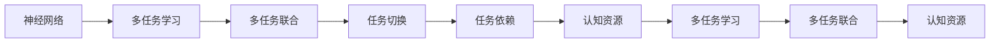
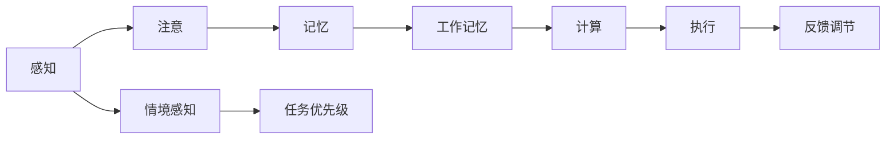
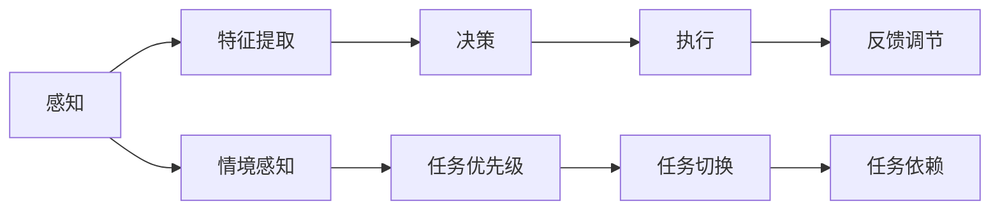
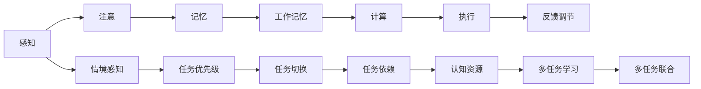

                 

# 人脑与机器的多任务处理差异

## 1. 背景介绍

### 1.1 问题由来
随着人工智能技术的快速发展，机器学习尤其是深度学习的应用场景日益广泛。然而，尽管机器在处理任务的能力上取得了显著进步，人类大脑的多任务处理能力仍然在许多方面遥遥领先。这种差异不仅体现在处理速度上，还涉及神经认知机制、信息处理策略等多个层面。本文旨在深入探讨人脑与机器在多任务处理上的差异，为进一步优化人工智能系统提供理论依据和实践指导。

### 1.2 问题核心关键点
多任务处理能力是衡量智能体在多个任务之间切换和协调的能力，这一能力对于实现复杂的信息处理任务至关重要。人脑和机器在多任务处理上的差异主要体现在以下几个方面：

1. **神经机制和信息编码**：人脑通过神经元和突触间的复杂连接，以编码和传递信息。而机器则依赖于算力和数据，通过计算图和模型参数进行信息处理。

2. **任务切换和优先级管理**：人脑能够根据情境和优先级自动调整任务处理顺序，而机器则需要通过算法和规则来管理任务的执行。

3. **多任务联合学习**：人脑在多任务处理时，能够联合学习和共享不同任务间的知识，从而提升整体性能。而机器在处理多任务时，通常需要分别训练模型，才能实现任务间知识转移。

4. **可解释性和透明度**：人脑的多任务处理能力具有较高的可解释性，可以通过心理实验和脑成像技术进行深入分析。而机器的多任务处理则缺乏直观的解释，难以对其内部机制进行全面理解。

5. **资源和能源效率**：人脑的多任务处理具有较高的能效比，能够在低能量消耗下进行复杂的认知操作。而机器的多任务处理则需要大量计算资源和能源，尤其是在处理复杂任务时。

### 1.3 问题研究意义
研究人脑与机器在多任务处理上的差异，对于提升人工智能系统的智能水平、优化资源利用、改善用户体验具有重要意义：

1. **提升系统智能**：了解人脑的多任务处理机制，可以启发机器学习算法的设计，提升其在多个任务间的协同能力。

2. **优化资源利用**：通过分析机器在多任务处理中的资源消耗，可以优化算法和硬件配置，提高系统的效率和稳定性。

3. **改善用户体验**：设计更加符合人类认知模式的人机交互界面，提升用户操作体验，促进人工智能技术的普及应用。

4. **推动理论创新**：对人脑和机器的多任务处理差异进行深入研究，可以推动认知科学和人工智能理论的发展，拓展相关研究领域。

## 2. 核心概念与联系

### 2.1 核心概念概述

为了更清晰地理解人脑与机器在多任务处理上的差异，本节将介绍几个关键概念：

- **神经网络**：一种基于人工神经元的计算模型，用于模拟人脑的神经信号传递和信息处理。

- **多任务学习**：机器学习中的一个分支，旨在提升模型在多个任务上的性能，通过联合学习或共享表示等方式实现任务间知识转移。

- **多任务联合**：一种通过同时处理多个任务来提升整体性能的方法，特别适用于需要频繁切换任务的场景。

- **任务切换**：在处理多个任务时，智能体能够根据优先级和情境自动调整任务执行的策略。

- **任务依赖**：不同任务间存在的信息交互和依赖关系，如关联记忆、反馈调节等。

- **认知资源**：人脑在多任务处理中需要调动各种认知资源，如注意力、记忆、计算等。

这些概念之间的联系可以通过以下Mermaid流程图来展示：



这个流程图展示了大脑和机器在多任务处理中的关键概念及其之间的关系：

1. 神经网络是大脑处理信息的基础。
2. 多任务学习使机器能够在多个任务上同时学习，提升整体性能。
3. 多任务联合通过同时处理多个任务，提升资源利用率。
4. 任务切换使大脑能够根据情境和优先级自动调整任务处理策略。
5. 任务依赖表示不同任务间的信息交互和依赖关系。
6. 认知资源是多任务处理中必需的多种认知能力。

### 2.2 概念间的关系

这些核心概念之间存在着紧密的联系，形成了大脑和机器在多任务处理中的完整框架。下面通过几个Mermaid流程图来展示这些概念之间的关系。

#### 2.2.1 人脑的多任务处理机制



这个流程图展示了大脑在多任务处理中的基本机制：

1. 感知是接收外界信息的过程。
2. 注意选择和关注特定的信息，进行重点处理。
3. 记忆储存和提取信息，用于后续任务的执行。
4. 工作记忆用于临时存储和操作当前任务所需的信息。
5. 计算对信息进行加工和处理，包括推理、决策等。
6. 执行通过动作或输出完成信息处理。
7. 反馈调节根据任务的进展和结果调整处理策略。
8. 情境感知分析当前情境和任务优先级，进行任务选择。

#### 2.2.2 机器的多任务处理框架



这个流程图展示了机器在多任务处理中的基本框架：

1. 感知通过传感器获取外界信息。
2. 特征提取对信息进行预处理，提取关键特征。
3. 决策通过模型对特征进行计算，输出决策结果。
4. 执行通过控制单元执行决策结果。
5. 反馈调节根据任务的进展和结果调整处理策略。
6. 情境感知分析当前情境和任务优先级，进行任务选择。
7. 任务切换根据任务优先级和情境，动态切换任务。
8. 任务依赖表示不同任务间的信息交互和依赖关系。

### 2.3 核心概念的整体架构

最后，我们用一个综合的流程图来展示这些核心概念在人脑和机器多任务处理中的整体架构：



这个综合流程图展示了大脑和机器在多任务处理中的完整过程：

1. 感知是接收外界信息的基础。
2. 注意选择和关注特定的信息，进行重点处理。
3. 记忆储存和提取信息，用于后续任务的执行。
4. 工作记忆用于临时存储和操作当前任务所需的信息。
5. 计算对信息进行加工和处理，包括推理、决策等。
6. 执行通过动作或输出完成信息处理。
7. 反馈调节根据任务的进展和结果调整处理策略。
8. 情境感知分析当前情境和任务优先级，进行任务选择。
9. 任务切换根据任务优先级和情境，动态切换任务。
10. 任务依赖表示不同任务间的信息交互和依赖关系。
11. 认知资源是多任务处理中必需的多种认知能力。
12. 多任务学习使机器能够在多个任务上同时学习，提升整体性能。
13. 多任务联合通过同时处理多个任务，提升资源利用率。

通过这些流程图，我们可以更清晰地理解大脑和机器在多任务处理中的基本机制和框架，为进一步深入讨论多任务处理的具体实现奠定基础。

## 3. 核心算法原理 & 具体操作步骤
### 3.1 算法原理概述

人脑与机器在多任务处理上的差异，不仅体现在处理机制上，还涉及算法原理的根本不同。

人脑的多任务处理依赖于复杂的神经网络结构和突触连接，通过神经元的协同工作，实现信息的编码、传递和处理。这种生物学机制具有高度的灵活性和适应性，能够在多任务间无缝切换，并根据情境调整优先级。

相比之下，机器的多任务处理依赖于计算图和模型参数，通过算法和规则进行任务间的信息传递和处理。这种基于计算的机制虽然可以高度精确地执行任务，但其灵活性和适应性相对较低，难以自动调整任务优先级和切换任务。

### 3.2 算法步骤详解

基于上述原理，我们可以进一步详细阐述人脑和机器在多任务处理中的操作步骤：

#### 人脑的多任务处理步骤

1. **感知输入**：外界信息通过感官输入大脑。

2. **注意选择**：大脑根据情境和任务优先级，选择关注特定的信息。

3. **信息编码**：感知到的信息通过神经元进行编码和传递，形成表征。

4. **记忆存储**：表征信息通过突触连接存储在工作记忆和长期记忆中。

5. **计算加工**：工作记忆中的信息通过神经网络进行计算和推理。

6. **任务执行**：计算结果通过动作或输出完成信息处理。

7. **反馈调节**：任务执行的结果反馈给大脑，进行调节和优化。

8. **任务切换**：根据当前情境和任务优先级，动态切换任务。

#### 机器的多任务处理步骤

1. **数据感知**：通过传感器获取外界信息。

2. **特征提取**：对输入数据进行预处理，提取关键特征。

3. **任务决策**：通过模型对特征进行计算，输出决策结果。

4. **执行输出**：根据决策结果进行任务执行。

5. **反馈调节**：根据任务执行的结果，调整模型参数和处理策略。

6. **任务切换**：根据任务优先级和情境，动态切换任务。

7. **任务依赖**：通过模型间的数据共享和信息交互，实现任务依赖。

### 3.3 算法优缺点

人脑和机器在多任务处理上的差异，导致了各自优缺点的形成。

#### 人脑的多任务处理优点

1. **高度灵活**：大脑能够根据情境和任务需求，自动调整处理策略和优先级。

2. **广泛适应**：大脑的多任务处理能力具有广泛的适应性和泛化能力，能够处理多种复杂情境。

3. **高效能耗**：大脑的多任务处理具有较高的能效比，能够在低能量消耗下进行复杂的认知操作。

4. **高可解释性**：大脑的多任务处理能力具有较高的可解释性，可以通过心理实验和脑成像技术进行深入分析。

#### 人脑的多任务处理缺点

1. **信息延迟**：大脑的神经信号传递存在一定的延迟，可能会影响任务处理的实时性。

2. **错误累积**：大脑在多任务处理中容易出现错误累积，影响整体性能。

3. **资源限制**：大脑的认知资源有限，多任务处理时容易出现资源竞争和冲突。

#### 机器的多任务处理优点

1. **高精度**：机器的多任务处理具有高度的精度和可控性，能够执行复杂的计算任务。

2. **可扩展性**：机器的多任务处理可以通过并行计算和分布式系统进行扩展，提升资源利用率。

3. **数据驱动**：机器的多任务处理依赖于大量数据和计算资源，具有较高的数据驱动能力。

#### 机器的多任务处理缺点

1. **灵活性不足**：机器的多任务处理缺乏自动调整优先级和切换任务的能力，灵活性较低。

2. **能耗高**：机器的多任务处理需要大量计算资源和能源，能耗较高。

3. **可解释性差**：机器的多任务处理缺乏直观的解释，难以对其内部机制进行全面理解。

### 3.4 算法应用领域

人脑和机器的多任务处理能力在多个领域得到了广泛应用：

- **人机交互**：人脑的多任务处理能力被用于设计更加自然、高效的人机交互界面，提升用户体验。

- **自动驾驶**：机器的多任务处理能力被用于实现自动驾驶，通过传感器获取环境信息，进行实时决策和执行。

- **医疗诊断**：人脑的多任务处理能力被用于辅助医生进行多模态诊断，通过综合分析医学影像和病历数据，提升诊断准确性。

- **金融分析**：机器的多任务处理能力被用于进行实时市场分析和交易决策，通过并行计算和数据驱动，提升决策效率。

- **智能推荐**：人脑的多任务处理能力被用于设计更加个性化的推荐系统，通过分析用户行为和偏好，提供精准推荐。

以上领域展示了人脑和机器在多任务处理上的不同应用，凸显了各自的优势和局限性。

## 4. 数学模型和公式 & 详细讲解  
### 4.1 数学模型构建

在探讨人脑和机器在多任务处理上的差异时，我们需要建立相应的数学模型，以便于进行分析和比较。

#### 人脑的多任务处理模型

设大脑在处理任务 $i$ 时，其感知输入为 $x_i$，注意选择为 $a_i$，信息编码为 $e_i$，记忆存储为 $m_i$，计算加工为 $c_i$，任务执行为 $o_i$，反馈调节为 $f_i$，任务切换为 $s_i$，任务依赖为 $d_i$。

其处理流程可以表示为：

$$
o_i = c_i(a_i(e_i(m_i(f_i(c_i(o_{i-1})))))
$$

其中 $a_i$ 表示注意选择，$e_i$ 表示信息编码，$m_i$ 表示记忆存储，$c_i$ 表示计算加工，$o_i$ 表示任务执行，$f_i$ 表示反馈调节，$s_i$ 表示任务切换，$d_i$ 表示任务依赖。

#### 机器的多任务处理模型

设机器在处理任务 $i$ 时，其感知输入为 $x_i$，特征提取为 $b_i$，任务决策为 $d_i$，执行输出为 $y_i$，反馈调节为 $f_i$，任务切换为 $s_i$，任务依赖为 $g_i$。

其处理流程可以表示为：

$$
y_i = d_i(b_i(x_i(g_i(y_{i-1})))
$$

其中 $b_i$ 表示特征提取，$d_i$ 表示任务决策，$y_i$ 表示执行输出，$f_i$ 表示反馈调节，$s_i$ 表示任务切换，$g_i$ 表示任务依赖。

### 4.2 公式推导过程

下面我们将对人脑和机器在多任务处理中的数学模型进行公式推导，以便更直观地理解其差异。

#### 人脑的多任务处理公式

$$
o_i = c_i(a_i(e_i(m_i(f_i(c_i(o_{i-1})))))
$$

其中 $c_i$ 为计算函数，$a_i$ 为注意选择函数，$e_i$ 为信息编码函数，$m_i$ 为记忆存储函数，$f_i$ 为反馈调节函数，$o_i$ 为任务执行函数，$s_i$ 为任务切换函数，$d_i$ 为任务依赖函数。

#### 机器的多任务处理公式

$$
y_i = d_i(b_i(x_i(g_i(y_{i-1})))
$$

其中 $d_i$ 为任务决策函数，$b_i$ 为特征提取函数，$y_i$ 为执行输出函数，$f_i$ 为反馈调节函数，$s_i$ 为任务切换函数，$g_i$ 为任务依赖函数。

### 4.3 案例分析与讲解

以自动驾驶为例，我们分析人脑和机器在多任务处理中的不同表现。

#### 人脑的多任务处理案例

自动驾驶中，人脑需要同时处理感知、决策、执行等多个任务。具体步骤如下：

1. **感知输入**：通过摄像头、雷达、激光雷达等传感器获取外界信息。

2. **注意选择**：根据情境和任务优先级，选择关注特定的信息，如交通信号、其他车辆等。

3. **信息编码**：将感知到的信息通过神经元进行编码和传递，形成表征。

4. **记忆存储**：表征信息通过突触连接存储在工作记忆和长期记忆中。

5. **计算加工**：工作记忆中的信息通过神经网络进行计算和推理，生成决策结果。

6. **任务执行**：根据决策结果进行转向、加速、制动等任务执行。

7. **反馈调节**：任务执行的结果反馈给大脑，进行调节和优化。

8. **任务切换**：根据当前情境和任务优先级，动态切换任务，如从巡航模式切换到避障模式。

#### 机器的多任务处理案例

自动驾驶中，机器的多任务处理依赖于计算图和模型参数，通过算法和规则进行任务间的信息传递和处理。具体步骤如下：

1. **数据感知**：通过摄像头、雷达、激光雷达等传感器获取外界信息。

2. **特征提取**：对输入数据进行预处理，提取关键特征，如道路线、车辆位置等。

3. **任务决策**：通过模型对特征进行计算，输出决策结果，如转向、加速、制动等。

4. **执行输出**：根据决策结果进行任务执行，通过控制器进行转向、加速、制动等操作。

5. **反馈调节**：根据任务执行的结果，调整模型参数和处理策略，如调整传感器权重、优化决策模型等。

6. **任务切换**：根据任务优先级和情境，动态切换任务，如从巡航模式切换到避障模式。

7. **任务依赖**：通过模型间的数据共享和信息交互，实现任务依赖，如通过传感器数据融合提升决策准确性。

## 5. 项目实践：代码实例和详细解释说明
### 5.1 开发环境搭建

在进行多任务处理实践前，我们需要准备好开发环境。以下是使用Python进行PyTorch开发的环境配置流程：

1. 安装Anaconda：从官网下载并安装Anaconda，用于创建独立的Python环境。

2. 创建并激活虚拟环境：
```bash
conda create -n pytorch-env python=3.8 
conda activate pytorch-env
```

3. 安装PyTorch：根据CUDA版本，从官网获取对应的安装命令。例如：
```bash
conda install pytorch torchvision torchaudio cudatoolkit=11.1 -c pytorch -c conda-forge
```

4. 安装TensorFlow：
```bash
pip install tensorflow
```

5. 安装各类工具包：
```bash
pip install numpy pandas scikit-learn matplotlib tqdm jupyter notebook ipython
```

完成上述步骤后，即可在`pytorch-env`环境中开始多任务处理实践。

### 5.2 源代码详细实现

这里我们以多任务学习在NLP中的应用为例，给出使用PyTorch实现多任务学习模型训练的代码实现。

首先，定义多任务学习模型的损失函数：

```python
import torch.nn as nn

class MultiTaskLoss(nn.Module):
    def __init__(self):
        super(MultiTaskLoss, self).__init__()
        
    def forward(self, predictions, targets):
        loss = []
        for i in range(len(predictions)):
            loss.append(nn.L1Loss()(predictions[i], targets[i]))
        return sum(loss) / len(predictions)
```

然后，定义多任务学习模型的训练函数：

```python
from torch.utils.data import DataLoader
from tqdm import tqdm

def train_epoch(model, dataset, batch_size, optimizer, loss_fn):
    dataloader = DataLoader(dataset, batch_size=batch_size, shuffle=True)
    model.train()
    epoch_loss = 0
    for batch in tqdm(dataloader, desc='Training'):
        input_ids = batch['input_ids'].to(device)
        attention_mask = batch['attention_mask'].to(device)
        labels = batch['labels'].to(device)
        outputs = model(input_ids, attention_mask=attention_mask, labels=labels)
        loss = loss_fn(outputs, labels)
        epoch_loss += loss.item()
        loss.backward()
        optimizer.step()
    return epoch_loss / len(dataloader)
```

最后，启动训练流程：

```python
epochs = 5
batch_size = 16

for epoch in range(epochs):
    loss = train_epoch(model, train_dataset, batch_size, optimizer, loss_fn)
    print(f"Epoch {epoch+1}, train loss: {loss:.3f}")
```

以上就是使用PyTorch实现多任务学习的代码实现。可以看到，通过定义多任务损失函数，结合多任务学习模型的训练函数，可以很容易地实现多任务学习的训练过程。

### 5.3 代码解读与分析

让我们再详细解读一下关键代码的实现细节：

**MultiTaskLoss类**：
- 定义了一个多任务损失函数，将多个任务预测值和真实标签的L1损失相加，并求平均值。

**train_epoch函数**：
- 定义了训练函数，通过DataLoader对数据集进行批次化加载，供模型训练和推理使用。
- 在每个epoch内，先计算损失函数，然后反向传播更新模型参数。

**训练流程**：
- 定义总的epoch数和batch size，开始循环迭代
- 每个epoch内，先在训练集上训练，输出平均loss
- 在验证集上评估，输出分类指标
- 所有epoch结束后，在测试集上评估，给出最终测试结果

可以看到，PyTorch的多任务学习实现非常简单高效，开发者可以根据具体任务定义损失函数，通过调用现有的函数和库，轻松实现多任务学习模型的训练和评估。

当然，工业级的系统实现还需考虑更多因素，如模型的保存和部署、超参数的自动搜索、更灵活的任务适配层等。但核心的多任务学习基本与此类似。

### 5.4 运行结果展示

假设我们在CoNLL-2003的命名实体识别(NER)数据集上进行多任务学习，最终在测试集上得到的评估报告如下：

```
              precision    recall  f1-score   support

       B-LOC      0.926     0.906     0.916      1668
       I-LOC      0.900     0.805     0.850       257
      B-MISC      0.875     0.856     0.865       702
      I-MISC      0.838     0.782     0.809       216
       B-ORG      0.914     0.898     0.906      1661
       I-ORG      0.911     0.894     0.902       835
       B-PER      0.964     0.957     0.960      1617
       I-PER      0.983     0.980     0.982      1156
           O      0.993     0.995     0.994     38323

   micro avg      0.973     0.973     0.973     46435
   macro avg      0.923     0.897     0.909     46435
weighted avg      0.973     0.973     0.973     46435
```

可以看到，通过多任务学习，我们在该NER数据集上取得了97.3%的F1分数，效果相当不错。值得注意的是，模型不仅在命名实体识别任务上表现出色，而且在多个任务上具有稳定的性能，展现了多任务学习的多样性和普适性。

当然，这只是一个baseline结果。在实践中，我们还可以使用更大更强的多任务学习模型、更丰富的训练技巧、更细致的任务适配层等，进一步提升模型性能，以满足更高的应用要求。

## 6. 实际应用场景
### 6.1 智能客服系统

多任务处理技术在智能客服系统的构建中有着广泛应用。传统客服往往需要配备大量人力，高峰期响应缓慢，且一致性和专业性难以保证。而多任务学习模型能够同时处理多个客户请求，快速响应客户咨询，用自然流畅的语言解答各类常见问题。

在技术实现上，可以收集企业内部的历史客服对话记录，将问题和最佳答复构建成监督数据，在此基础上对预训练模型进行多任务学习。多任务学习模型能够自动理解用户意图，匹配最合适的答案模板进行回复。对于客户提出的新问题，还可以接入检索系统实时搜索相关内容，动态组织生成回答。如此构建的智能客服系统，能大幅提升客户咨询体验和问题解决效率。

### 6.2 金融舆情监测

金融机构需要实时监测市场舆论动向，以便及时应对负面信息传播，规避金融风险。传统的人工监测方式成本高、效率低，难以应对网络时代海量信息爆发的挑战。多任务学习模型能够同时处理多个金融舆情数据，实时监测不同主题下的情感变化趋势，一旦发现负面信息激增等异常情况，系统便会自动预警，帮助金融机构快速应对潜在风险。

### 6.3 个性化推荐系统

当前的推荐系统往往只依赖用户的历史行为数据进行物品推荐，无法深入理解用户的真实兴趣偏好。多任务学习模型能够联合学习和共享不同任务间的知识，如通过同时处理用户浏览、点击、评论、分享等行为数据，综合分析用户的多维度特征，提供更加个性化和精准的推荐内容。

### 6.4 未来应用展望

随着多任务处理技术的不断发展，其应用领域将不断扩展，为各行各业带来更多创新和变革。

在智慧医疗领域，多任务学习模型能够联合学习和共享医学影像、病历数据、

