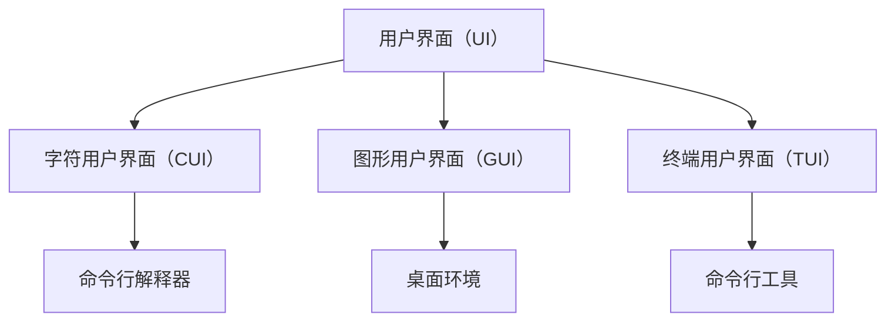

                 

# 从CUI到GUI再到TUI的变革

## 1. 背景介绍

随着计算机科学的发展，用户界面（UI）经历了从字符用户界面（CUI）到图形用户界面（GUI），再到如今日益兴起的终端用户界面（TUI）的变革。

### 1.1 字符用户界面（CUI）
字符用户界面（CUI）起源于早期计算机的诞生。在1960年代，计算机设备昂贵，仅限于大型机房内部使用。当时计算机的处理能力有限，只能输出最简单的文本信息，因此用户的交互界面完全由字符组成。用户通过输入命令来控制计算机执行相应的操作。CUI的典型例子是UNIX系统的命令行界面。

### 1.2 图形用户界面（GUI）
随着硬件设备和计算机技术的进步，个人计算机（PC）逐渐普及，图形用户界面（GUI）应运而生。GUI使用图形元素如窗口、菜单、按钮等代替纯文本界面，使得操作更直观、更易用。图形界面的开端可以追溯到1970年代，但真正成熟的GUI是在1980年代中期开始的，如苹果公司的Macintosh和微软公司的Windows操作系统。

### 1.3 终端用户界面（TUI）
尽管GUI带来了便利，但并不是所有用户都愿意放弃在命令行下的操作习惯。特别在数据科学、软件开发、运维等领域，命令行界面仍然是许多用户的首选。同时，新的计算机交互方式如Web应用的兴起，也推动了TUI的发展。通过命令行工具，开发者和运维人员可以更高效地管理服务器、监控系统状态、执行自动化任务。

## 2. 核心概念与联系

### 2.1 核心概念概述

为了更好地理解从CUI到GUI再到TUI的变革，本节将介绍几个密切相关的核心概念：

- **用户界面（UI）**：用户界面是用户与计算机交互的平台，通过图形、文本、声音、图像等元素呈现给用户，供用户进行输入和交互。

- **字符用户界面（CUI）**：CUI基于字符和文本，用户通过命令行与计算机交互，输入简单的命令进行文件操作、程序执行等。

- **图形用户界面（GUI）**：GUI基于图形元素，用户通过点击、拖拽等操作与计算机交互，更直观、易用。

- **终端用户界面（TUI）**：TUI基于命令行，用户通过输入命令与计算机交互，强调命令行的灵活性和可定制性。

- **桌面环境**：GUI的核心，通常包括窗口、菜单、工具栏、状态栏等图形元素，提供一个完整的操作环境。

- **命令行解释器**：TUI的核心，通过命令行接收用户输入，解析执行相应的命令，并输出结果。

### 2.2 概念间的关系

这些核心概念之间的逻辑关系可以通过以下Mermaid流程图来展示：



这个流程图展示了大语言模型微调过程中各个核心概念的关系和作用：

1. 用户界面（UI）是用户与计算机交互的平台。
2. 字符用户界面（CUI）通过命令行提供基本的文件操作和程序执行。
3. 图形用户界面（GUI）通过图形元素提供更直观的操作界面。
4. 终端用户界面（TUI）通过命令行提供高效的操作灵活性。
5. 命令行解释器是TUI的核心，解析用户输入的命令。
6. 桌面环境是GUI的核心，提供完整的操作环境。
7. 命令行工具是TUI的核心，提供高效的操作灵活性。

## 3. 核心算法原理 & 具体操作步骤

### 3.1 算法原理概述

从CUI到GUI再到TUI的变革，本质上是一个交互方式和设计理念的演进过程。其核心在于如何更高效、更直观地实现用户与计算机的交互。

### 3.2 算法步骤详解

#### 3.2.1 从CUI到GUI
从CUI到GUI的演进，主要在于图形元素的引入，使得用户可以更直观地操作计算机。步骤主要包括：

1. **界面设计**：设计易于理解的图形界面元素，如窗口、菜单、按钮等。
2. **交互逻辑**：实现图形元素的交互逻辑，如点击、拖拽等。
3. **系统集成**：将图形界面与操作系统和应用软件集成，形成完整的操作环境。

#### 3.2.2 从GUI到TUI
从GUI到TUI的演进，主要在于命令行的引入，使得用户可以更灵活地操作计算机。步骤主要包括：

1. **命令设计**：设计简洁、易记的命令行，供用户进行操作。
2. **命令解析**：实现命令行解析器，解析用户输入的命令，执行相应的操作。
3. **交互优化**：优化命令行工具，支持高亮、自动补全、历史记录等功能，提高用户效率。

### 3.3 算法优缺点

CUI、GUI和TUI各有其优点和缺点：

**CUI的优点和缺点**：
- **优点**：简单易用，占用资源少，易于定制。
- **缺点**：用户界面单调，操作复杂，不易理解。

**GUI的优点和缺点**：
- **优点**：直观易用，操作简单，视觉效果良好。
- **缺点**：占用资源多，界面复杂，有时容易误操作。

**TUI的优点和缺点**：
- **优点**：灵活高效，易于定制，占用资源少。
- **缺点**：界面单调，操作复杂，需要一定的学习和使用成本。

### 3.4 算法应用领域

CUI、GUI和TUI在各自领域都有广泛的应用：

- **CUI**：主要用于UNIX系统、命令行工具、文本编辑器等，适合对命令熟悉的用户。
- **GUI**：主要用于桌面操作系统（如Windows、macOS、Linux等），图形应用程序（如Office、Photoshop等）。
- **TUI**：主要用于数据科学、软件开发、运维等领域，适合需要高效、灵活操作的用户。

## 4. 数学模型和公式 & 详细讲解 & 举例说明

### 4.1 数学模型构建

从CUI到GUI再到TUI的变革，涉及用户界面设计的多个方面，包括图形界面元素设计、命令设计、交互逻辑等。这些设计过程可以通过数学模型进行建模和优化。

### 4.2 公式推导过程

#### 4.2.1 GUI设计模型
设计GUI界面时，通常需要考虑以下指标：

- **易用性**：界面的直观程度，用户的操作习惯等。
- **可访问性**：不同用户（如视觉障碍者、色盲等）的操作便利性。
- **效率**：用户的操作效率，如响应时间、执行速度等。

这些指标可以量化为数学模型：

$$
UI_Ease = f(Design, Usability, Accessibility)
$$

其中 $Design$ 为设计方案，$Usability$ 为易用性，$Accessibility$ 为可访问性。

#### 4.2.2 TUI设计模型
设计TUI命令行时，通常需要考虑以下指标：

- **简洁性**：命令的简洁程度，用户的学习成本等。
- **灵活性**：命令的灵活性，满足不同用户的需求等。
- **可扩展性**：命令的可扩展性，支持更多的操作等。

这些指标可以量化为数学模型：

$$
TUI_Efficiency = f(Design, Flexibility, Extensibility)
$$

其中 $Design$ 为设计方案，$Flexibility$ 为灵活性，$Extensibility$ 为可扩展性。

### 4.3 案例分析与讲解

#### 4.3.1 GUI设计案例
假设设计一个简单的文本编辑器的GUI界面。我们可以考虑以下设计方案：

- **设计方案**：界面包括菜单栏、工具栏、编辑区、状态栏等元素。
- **易用性**：用户可以通过菜单栏和工具栏访问常用功能，编辑区支持拖放、选中、复制、粘贴等操作。
- **可访问性**：界面支持高对比度模式、放大模式等，方便视觉障碍者使用。

通过以上指标，我们可以构建GUI设计的数学模型：

$$
UI_Ease = f(MENU, TOOLBAR, TEXTAREA, STATUSBAR, HIGH_CONTRAST, ZOOMABLE)
$$

#### 4.3.2 TUI设计案例
假设设计一个简单的数据管理工具的TUI命令行。我们可以考虑以下设计方案：

- **设计方案**：命令行包括添加、删除、编辑、查询等命令。
- **简洁性**：命令简洁易懂，如 `add`、`rm`、`edit`、`query` 等。
- **灵活性**：命令支持选项和参数，如 `add -name "John"`、`query -date "2021-01-01"`。
- **可扩展性**：支持自定义命令，如 `command add -alias jn`。

通过以上指标，我们可以构建TUI设计的数学模型：

$$
TUI_Efficiency = f(COMMANDS, OPTIONS, ALIASES, CUSTOM_COMMANDS)
$$

## 5. 项目实践：代码实例和详细解释说明

### 5.1 开发环境搭建

在进行项目实践前，我们需要准备好开发环境。以下是使用Python进行PyTorch开发的环境配置流程：

1. 安装Anaconda：从官网下载并安装Anaconda，用于创建独立的Python环境。

2. 创建并激活虚拟环境：
```bash
conda create -n pytorch-env python=3.8 
conda activate pytorch-env
```

3. 安装PyTorch：根据CUDA版本，从官网获取对应的安装命令。例如：
```bash
conda install pytorch torchvision torchaudio cudatoolkit=11.1 -c pytorch -c conda-forge
```

4. 安装TensorFlow：
```bash
pip install tensorflow
```

5. 安装各类工具包：
```bash
pip install numpy pandas scikit-learn matplotlib tqdm jupyter notebook ipython
```

完成上述步骤后，即可在`pytorch-env`环境中开始项目实践。

### 5.2 源代码详细实现

这里我们以设计一个简单的命令行工具为例，实现TUI的功能。

```python
import sys

def add_task(task):
    print(f"Task added: {task}")

def delete_task(task):
    print(f"Task deleted: {task}")

def list_tasks():
    print("Tasks:")
    print("----------------------------")
    for task in tasks:
        print(task)

def main():
    tasks = []
    while True:
        cmd = input("Enter command: ")
        if cmd == "add":
            task = input("Enter task name: ")
            add_task(task)
        elif cmd == "delete":
            task = input("Enter task name: ")
            delete_task(task)
        elif cmd == "list":
            list_tasks()
        else:
            print("Unknown command")

if __name__ == "__main__":
    main()
```

### 5.3 代码解读与分析

让我们再详细解读一下关键代码的实现细节：

**add_task和delete_task函数**：
- 根据用户输入的命令，执行添加或删除任务的操作，并输出相应的提示信息。

**list_tasks函数**：
- 列出所有任务，方便用户查看和管理。

**main函数**：
- 无限循环，等待用户输入命令，根据不同的命令执行相应的操作。
- 如果用户输入未知命令，则提示错误信息。

**运行结果展示**：
假设我们在命令行运行上述代码，可以体验到简单的TUI功能：

```
Enter command: add
Enter task name: Meeting
Task added: Meeting
Enter command: list
Tasks:
----------------------------
Meeting
Enter command: delete
Enter task name: Meeting
Task deleted: Meeting
Enter command: list
Tasks:
----------------------------
```

以上代码实现展示了简单的TUI命令解析和交互逻辑。开发者可以根据具体需求，进一步完善和扩展功能，以适应不同的应用场景。

## 6. 实际应用场景

### 6.1 数据科学
在数据科学领域，TUI是最常用的交互方式。数据科学家需要处理和分析大量数据，命令行工具提供高效的灵活性和可定制性。常见的TUI工具包括RStudio、Jupyter Notebook等。

### 6.2 软件开发
软件开发人员通常需要快速迭代和测试代码。命令行工具支持高效的代码管理和构建，如Git、Maven等。开发者可以在命令行中执行各种操作，如代码编译、测试、部署等。

### 6.3 运维管理
运维人员需要监控和维护服务器，命令行工具提供高效的操作和自动化脚本执行。常见的TUI工具包括Ansible、Kubernetes等。运维人员可以通过命令行工具进行远程登录、系统配置、日志监控等操作。

### 6.4 未来应用展望
随着云计算和大数据技术的发展，TUI的应用将进一步扩展。例如，通过云计算平台提供的命令行界面，用户可以方便地管理和操作云资源，如虚拟机、存储、网络等。

## 7. 工具和资源推荐

### 7.1 学习资源推荐

为了帮助开发者系统掌握从CUI到GUI再到TUI的变革，这里推荐一些优质的学习资源：

1. **《用户界面设计基础》**：深入讲解UI设计的基本原理和最佳实践，适合初学者和中级开发者。

2. **《命令行工具的全面指南》**：详细介绍各种命令行工具的用法和配置，适合需要高效操作命令行界面的用户。

3. **《Python GUI编程入门》**：介绍使用Python开发GUI界面的流程和技巧，适合Python开发者。

4. **《Web应用开发实战》**：讲解Web应用开发的流程和工具，适合开发Web应用的用户。

5. **《Windows命令行高级教程》**：详细介绍Windows命令行工具的使用，适合Windows用户。

### 7.2 开发工具推荐

高效的开发离不开优秀的工具支持。以下是几款用于从CUI到GUI再到TUI开发的常用工具：

1. **Visual Studio Code**：轻量级代码编辑器，支持多种编程语言，适合开发TUI和GUI。

2. **Emacs**：强大的文本编辑器，支持各种插件和扩展，适合开发TUI和GUI。

3. **Vim**：经典的文本编辑器，支持各种插件和扩展，适合开发TUI和GUI。

4. **PyCharm**：Python IDE，支持智能代码提示、调试等功能，适合开发TUI和GUI。

5. **Sublime Text**：轻量级文本编辑器，支持多种插件和扩展，适合开发TUI和GUI。

### 7.3 相关论文推荐

从CUI到GUI再到TUI的变革，涉及多方面的研究，以下是几篇奠基性的相关论文，推荐阅读：

1. **《用户界面设计的心理学基础》**：探讨用户界面设计的基本原理和心理学基础，适合UI设计师。

2. **《命令行解释器的设计原则》**：详细介绍命令行解释器的设计原则和实现技巧，适合命令行工具开发者。

3. **《Web应用的用户界面设计》**：讲解Web应用的用户界面设计方法和最佳实践，适合Web开发者。

4. **《交互设计的基本原则》**：介绍交互设计的基本原则和方法，适合UI设计师和开发者。

5. **《GUI开发的挑战和解决方案》**：探讨GUI开发中的挑战和解决方案，适合GUI开发者。

这些论文代表了从CUI到GUI再到TUI变革的核心内容，是学习和实践的重要参考资料。

## 8. 总结：未来发展趋势与挑战

### 8.1 总结

本文对从CUI到GUI再到TUI的变革过程进行了全面系统的介绍。首先阐述了CUI、GUI和TUI的发展历程和基本概念，明确了这些技术在交互方式和设计理念上的演进。其次，从原理到实践，详细讲解了GUI设计和TUI开发的数学模型和关键步骤，给出了完整的代码实例。同时，本文还广泛探讨了TUI在数据科学、软件开发、运维管理等领域的应用前景，展示了TUI范式的巨大潜力。最后，本文精选了相关学习资源和开发工具，力求为开发者提供全方位的技术指引。

通过本文的系统梳理，可以看到，从CUI到GUI再到TUI的变革，是计算机科学和人工智能领域的重大进步。这些技术的发展，使得计算机的交互方式更加灵活、直观，用户可以更高效、更自然地操作计算机。未来，随着技术的不断进步，计算机的交互方式还将进一步变革，为人类社会带来更多的便利和创新。

### 8.2 未来发展趋势

展望未来，从CUI到GUI再到TUI的变革将呈现以下几个发展趋势：

1. **多模态交互**：未来的交互方式将不仅限于文本和图形，还将结合语音、手势、眼动等多种模态，实现更自然、更全面的交互。

2. **自然语言处理**：结合自然语言处理技术，用户可以通过语音命令直接操作计算机，提高交互的便捷性和智能化程度。

3. **智能推荐**：通过分析用户的行为和偏好，智能推荐最适合的操作界面和交互方式，提升用户体验。

4. **个性化定制**：根据用户的学习习惯和操作习惯，提供个性化的交互界面和操作方式，提高用户效率。

5. **跨平台兼容性**：实现不同平台和设备之间的无缝切换和兼容，提高跨平台使用的便捷性。

6. **增强现实和虚拟现实**：结合增强现实和虚拟现实技术，实现更沉浸式的交互体验，提供更加真实的操作环境。

这些趋势展示了从CUI到GUI再到TUI的变革，将不断推向新的高度，为人类社会带来更先进、更便捷的计算机交互方式。

### 8.3 面临的挑战

尽管从CUI到GUI再到TUI的变革已经取得了显著进展，但在迈向更加智能化、普适化应用的过程中，仍面临诸多挑战：

1. **交互界面设计**：如何设计出更直观、更易用、更高效的界面，需要更多的用户研究和设计实践。

2. **用户学习成本**：新的交互方式需要用户重新学习和适应，如何降低学习成本，提高用户的接受度，需要更多的教育和培训。

3. **界面一致性**：不同平台和设备之间的界面一致性问题，如何实现无缝切换和兼容，需要更多的技术攻关。

4. **可扩展性和灵活性**：如何设计出可扩展、灵活的界面，满足不同用户和应用的需求，需要更多的设计和开发工作。

5. **数据安全和隐私**：新的交互方式可能涉及更多的用户数据和隐私信息，如何保障数据安全和隐私，需要更多的法规和技术手段。

6. **技术整合和协同**：如何将新的交互方式与已有技术进行整合和协同，需要更多的技术支持和资源投入。

这些挑战展示了从CUI到GUI再到TUI的变革，并非一蹴而就，需要各方共同努力，不断探索和创新。

### 8.4 研究展望

面对从CUI到GUI再到TUI的变革所面临的挑战，未来的研究需要在以下几个方面寻求新的突破：

1. **用户研究与设计**：通过更多的用户研究和设计实践，探索用户对新交互方式的接受度和使用习惯，设计出更符合用户需求的界面。

2. **教育与培训**：开发更多的教育资源和培训课程，帮助用户快速适应新的交互方式，提高用户体验。

3. **技术整合与协同**：将新的交互方式与已有技术进行整合和协同，实现更加全面、高效的操作体验。

4. **数据安全和隐私**：制定和完善相关的法规和技术手段，保障用户数据和隐私的安全。

这些研究方向将引领从CUI到GUI再到TUI的变革，推动计算机交互方式向更先进、更便捷的方向发展，为人类社会带来更多的创新和便利。

## 9. 附录：常见问题与解答

**Q1：如何设计一个直观易用的GUI界面？**

A: 设计一个直观易用的GUI界面，需要考虑以下几个方面：
1. **界面设计原则**：遵循一致性、简洁性、自描述性等原则。
2. **用户研究**：通过用户调研和测试，了解用户的使用习惯和需求。
3. **原型设计**：通过快速原型设计，验证界面设计的可行性和用户反馈。
4. **迭代优化**：根据用户反馈，不断迭代优化界面设计，提升用户体验。

**Q2：命令行工具的实现需要注意哪些关键点？**

A: 实现命令行工具，需要注意以下几个关键点：
1. **命令设计**：设计简洁、易记的命令，方便用户操作。
2. **命令行解析**：实现高效的命令行解析器，支持参数和选项。
3. **交互优化**：支持高亮、自动补全、历史记录等功能，提高用户效率。
4. **错误处理**：提供友好的错误提示，帮助用户解决操作问题。

**Q3：如何设计一个灵活高效的TUI界面？**

A: 设计一个灵活高效的TUI界面，需要考虑以下几个方面：
1. **命令设计**：设计简洁、易记的命令，支持参数和选项。
2. **交互优化**：支持高亮、自动补全、历史记录等功能，提高用户效率。
3. **可扩展性**：支持自定义命令和扩展模块，提高界面的灵活性。
4. **多平台兼容性**：确保界面在不同平台和设备上的兼容性，提供一致的操作体验。

**Q4：TUI界面如何实现跨平台兼容性？**

A: 实现TUI界面的跨平台兼容性，需要考虑以下几个方面：
1. **跨平台架构**：使用跨平台架构，如React Native、Flutter等，实现跨平台开发。
2. **跨平台工具**：使用跨平台工具，如Apache Cordova、Electron等，实现跨平台部署。
3. **跨平台设计**：设计一致的UI和UX界面，确保用户在不同平台上的操作体验。
4. **跨平台测试**：在不同平台和设备上进行测试，确保界面的稳定性和兼容性。

**Q5：如何设计一个高可用性的TUI界面？**

A: 设计一个高可用性的TUI界面，需要考虑以下几个方面：
1. **可用性测试**：通过可用性测试，发现和解决用户使用中的问题。
2. **性能优化**：优化TUI界面的性能，减少延迟和卡顿，提高用户的使用体验。
3. **错误处理**：提供友好的错误提示，帮助用户解决操作问题。
4. **用户反馈**：收集用户反馈，不断优化界面设计和功能，提高用户满意度。

---

作者：禅与计算机程序设计艺术 / Zen and the Art of Computer Programming

