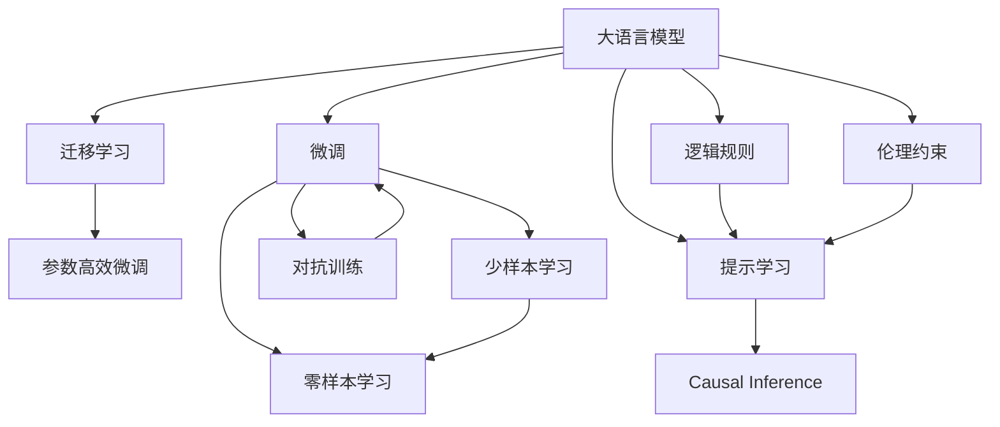

                 

# 从大语言模型迈向通用人工智能的四个步骤

## 1. 背景介绍

### 1.1 问题由来

近年来，人工智能领域迅速发展，深度学习技术取得了显著的进展。大语言模型（Large Language Models, LLMs），如GPT-3、BERT等，已经展示了在理解和生成语言方面的强大能力。这些模型通过在大规模无标签文本数据上进行预训练，学习到通用的语言知识和表示，并在各类自然语言处理（NLP）任务上取得了突破性的成果。

然而，这些通用的大语言模型在特定领域的特定任务上仍存在局限。尽管它们具备强大的语义理解能力，但在适应不同领域的具体需求时，效果往往不尽如人意。因此，如何使大语言模型更“智能”，能更好地适应不同领域、不同任务的特定需求，成为了当前研究的一个重要方向。

### 1.2 问题核心关键点

在大语言模型的基础上，实现通用人工智能（AGI）的目标，需要解决以下几个核心问题：

1. **领域适应性**：如何让模型在特定领域内快速适应，避免在特定任务上出现过拟合或泛化能力不足的问题。
2. **跨领域迁移**：如何让模型在多个领域之间进行知识迁移，提升模型的通用性和适应性。
3. **高效训练**：如何在保持模型性能的同时，优化训练过程，减少资源消耗，提升模型训练效率。
4. **可解释性和安全性**：如何使模型输出具备可解释性，避免偏见和有害信息的输出，确保模型的可靠性和安全性。

解决这些问题，不仅需要先进的算法和技术，还需要对大语言模型的深刻理解，以及对领域知识和实际应用需求的深入了解。

## 2. 核心概念与联系

### 2.1 核心概念概述

在大语言模型迈向通用人工智能的过程中，涉及多个核心概念和技术，这些概念和技术之间相互关联，共同构建了实现AGI的基础框架。

- **大语言模型（LLM）**：通过在大规模无标签文本数据上进行预训练，学习通用的语言知识和表示。
- **微调（Fine-Tuning）**：在预训练模型的基础上，通过特定任务的数据集，对模型进行有监督学习，使其适应特定任务。
- **迁移学习（Transfer Learning）**：利用已有领域的数据和知识，帮助模型在新领域中快速适应和学习。
- **参数高效微调（PEFT）**：在微调过程中，只更新部分模型参数，保留大部分预训练权重，以提高效率和减少过拟合风险。
- **提示学习（Prompt Learning）**：通过在输入中添加特定提示模板，引导模型生成符合预期的输出，减少微调参数。
- **少样本学习（Few-shot Learning）**：在仅有少量标注数据的情况下，模型仍能准确预测新样本的类别。
- **零样本学习（Zero-shot Learning）**：在未见任何标注数据的情况下，模型仅凭任务描述即能执行新任务。
- **对抗训练（Adversarial Training）**：通过引入对抗样本，提升模型对输入数据的鲁棒性。
- **因果推断（Causal Inference）**：分析模型输出与输入之间的关系，理解模型决策的因果逻辑。
- **逻辑规则（Logical Rules）**：引入符号逻辑和规则，指导模型推理和决策。
- **伦理约束（Ethical Constraints）**：确保模型的输出符合伦理和道德标准，避免偏见和有害信息的输出。

这些概念和技术构成了从大语言模型迈向通用人工智能的基石。通过理解这些概念和技术，可以为实现AGI提供清晰的路径和方向。

### 2.2 概念间的关系

这些核心概念和技术之间的关系可以通过以下Mermaid流程图来展示：



这个流程图展示了从大语言模型到通用人工智能的路径，包括微调、迁移学习、参数高效微调、少样本学习、零样本学习、对抗训练、因果推断、逻辑规则和伦理约束等关键步骤和技术。

## 3. 核心算法原理 & 具体操作步骤

### 3.1 算法原理概述

从大语言模型到通用人工智能的四个步骤，每一步都有其独特的算法原理和具体操作步骤。以下是详细的描述：

#### 步骤1：预训练

预训练是大语言模型的核心步骤，目的是在大规模无标签数据上学习通用的语言知识和表示。预训练通常采用自监督学习方法，如掩码语言模型（Masked Language Modeling, MLM）、下一句预测（Next Sentence Prediction, NSP）等任务，使得模型能够学习到丰富的语言表示。

- **算法原理**：通过在大规模文本数据上训练语言模型，使其能够预测文本中的缺失部分或判断两个句子之间的关系，从而学习到语言的语义和结构信息。
- **具体操作步骤**：使用大规模无标签文本数据集，如维基百科、新闻、书籍等，进行预训练。常见的预训练模型包括BERT、GPT-2等。

#### 步骤2：微调

微调是在特定任务上对预训练模型进行有监督学习的过程，目的是使模型适应特定任务。微调通常采用全参数微调或参数高效微调（PEFT），以避免过拟合并提高效率。

- **算法原理**：在特定任务的数据集上，使用有标签的样本对预训练模型进行训练，使其输出与真实标签匹配。
- **具体操作步骤**：选择合适的微调方法（如全参数微调、PEFT），设置合适的学习率、正则化参数等。使用特定任务的数据集进行微调，并在验证集上进行评估，防止过拟合。

#### 步骤3：迁移学习

迁移学习是通过已有领域的知识，帮助模型在新领域中快速适应和学习。迁移学习可以分为领域内迁移和领域间迁移两种类型。

- **算法原理**：利用已有领域的知识，对模型进行有监督或无监督学习，使其在新领域中也能表现良好。
- **具体操作步骤**：选择一个相关领域的任务，并收集其数据集。在预训练模型的基础上，使用新领域的数据集进行迁移学习。可以通过微调或零样本学习等方式实现迁移。

#### 步骤4：持续学习

持续学习是在模型运行过程中不断学习新知识，以适应数据分布的变化。持续学习可以避免模型出现灾难性遗忘，保持模型的时效性和适应性。

- **算法原理**：通过不断更新模型参数，使其能够学习新知识，并逐渐适应新的数据分布。
- **具体操作步骤**：在模型运行过程中，收集新数据，使用增量学习算法对模型进行更新。可以使用在线学习、在线预测等方法，确保模型能够实时学习。

### 3.2 算法步骤详解

#### 步骤1：预训练

1. **数据准备**：收集大规模无标签文本数据集，如维基百科、新闻、书籍等。这些数据集应该具有广泛的领域覆盖和语言多样性。
2. **模型选择**：选择合适的预训练模型，如BERT、GPT-2等，这些模型已经在大规模数据集上进行了预训练。
3. **训练过程**：使用预训练任务（如掩码语言模型、下一句预测等）对模型进行训练。训练过程中，可以使用分布式训练和混合精度训练等技术，提高训练效率。
4. **评估与优化**：在训练过程中，使用验证集对模型进行评估，根据评估结果进行参数调优。

#### 步骤2：微调

1. **任务适配层**：根据特定任务设计适配层，如分类任务的线性分类器、生成任务的解码器等。
2. **超参数设置**：设置合适的学习率、批大小、迭代轮数等超参数。
3. **模型训练**：使用特定任务的数据集对模型进行微调。在训练过程中，使用对抗训练等技术，提高模型的鲁棒性。
4. **模型评估**：在验证集和测试集上评估微调后的模型性能，确保模型在新任务上的表现。

#### 步骤3：迁移学习

1. **领域选择**：选择一个相关领域的任务，并收集其数据集。确保新领域的数据集与预训练模型的语言和语境相似。
2. **知识迁移**：利用已有领域的知识，对预训练模型进行迁移学习。可以使用微调或零样本学习等方法，根据任务需求选择合适的方法。
3. **模型验证**：在新领域的数据集上验证迁移后的模型性能，确保模型在新领域的泛化能力。

#### 步骤4：持续学习

1. **新数据收集**：在模型运行过程中，持续收集新数据，确保模型能够不断学习新知识。
2. **模型更新**：使用增量学习算法对模型进行更新，以适应新数据的分布变化。
3. **评估与反馈**：在新数据上评估模型的性能，根据评估结果进行模型优化。使用反馈机制，确保模型能够持续学习并适应新环境。

### 3.3 算法优缺点

#### 优点：

1. **高效性**：预训练和微调过程可以大大减少标注数据的需求，提高模型训练的效率。
2. **泛化能力**：通过迁移学习和持续学习，模型可以在新领域和新任务上快速适应，提高泛化能力。
3. **灵活性**：参数高效微调和零样本学习等技术，使得模型在不同任务和数据集上具有更好的灵活性。

#### 缺点：

1. **数据依赖**：预训练和微调过程对标注数据的需求较大，尤其是在特定领域的任务中，可能难以获取足够的标注数据。
2. **鲁棒性不足**：模型可能对输入数据的微小扰动表现出过拟合或泛化能力不足的问题。
3. **计算资源需求高**：大规模模型的训练和微调需要高计算资源，可能对资源有限的场景构成挑战。
4. **可解释性差**：预训练和微调模型通常被视为“黑盒”，难以解释模型的内部决策过程。
5. **安全风险**：模型可能学习到有害信息或偏见，对社会的安全性和伦理道德构成威胁。

## 4. 数学模型和公式 & 详细讲解 & 举例说明

### 4.1 数学模型构建

从大语言模型到通用人工智能的四个步骤，涉及多个数学模型和公式。以下是对主要模型的详细构建和讲解：

#### 掩码语言模型（Masked Language Modeling, MLM）

掩码语言模型是BERT等预训练模型的核心任务之一，用于预测文本中的缺失部分。假设输入文本为 $x=(x_1, x_2, ..., x_n)$，模型预测每个 $x_i$ 的概率分布，即 $p(x_i|x_{<i})$，其中 $x_{<i}$ 表示 $x$ 的前 $i-1$ 个单词。

- **模型表示**：
  $$
  p(x_i|x_{<i}) = \frac{e^{W_{MLM} \cdot h_i(x_{<i})}}{\sum_{j=1}^n e^{W_{MLM} \cdot h_j(x_{<i})}}
  $$
  其中 $h_i(x_{<i})$ 表示输入文本 $x_{<i}$ 的表示向量。

- **优化目标**：
  $$
  \mathcal{L}_{MLM} = -\frac{1}{N}\sum_{i=1}^N \log p(x_i|x_{<i})
  $$

#### 对抗训练（Adversarial Training）

对抗训练是一种增强模型鲁棒性的技术，通过引入对抗样本，使模型对输入数据的变化更加鲁棒。假设输入数据 $x$，对抗样本为 $\tilde{x}$，对抗训练的目标是最大化对抗样本对模型输出的影响。

- **对抗样本生成**：
  $$
  \tilde{x} = x + \delta
  $$
  其中 $\delta$ 是扰动向量，满足 $\|\delta\| < \epsilon$。

- **优化目标**：
  $$
  \mathcal{L}_{AT} = \mathbb{E}_{\tilde{x}}[\mathcal{L}(M_{\theta}(\tilde{x}), y)]
  $$
  其中 $\mathcal{L}$ 是任务损失函数，$y$ 是真实标签。

### 4.2 公式推导过程

#### 掩码语言模型（MLM）

- **推导过程**：
  $$
  \begin{aligned}
  \mathcal{L}_{MLM} &= -\frac{1}{N}\sum_{i=1}^N \log p(x_i|x_{<i}) \\
  &= -\frac{1}{N}\sum_{i=1}^N \log \frac{e^{W_{MLM} \cdot h_i(x_{<i})}}{\sum_{j=1}^n e^{W_{MLM} \cdot h_j(x_{<i})}} \\
  &= \frac{1}{N}\sum_{i=1}^N -W_{MLM} \cdot h_i(x_{<i}) + \log \sum_{j=1}^n e^{W_{MLM} \cdot h_j(x_{<i})} \\
  &= -W_{MLM} \cdot h_i(x_{<i}) + \log \sum_{j=1}^n e^{W_{MLM} \cdot h_j(x_{<i})}
  \end{aligned}
  $$

#### 对抗训练（AT）

- **推导过程**：
  $$
  \begin{aligned}
  \mathcal{L}_{AT} &= \mathbb{E}_{\tilde{x}}[\mathcal{L}(M_{\theta}(\tilde{x}), y)] \\
  &= \mathbb{E}_{\tilde{x}}[-y \log M_{\theta}(\tilde{x}) + (1-y) \log (1-M_{\theta}(\tilde{x}))] \\
  &= -\mathbb{E}_{\tilde{x}}[y \log M_{\theta}(\tilde{x}) - (1-y) \log (1-M_{\theta}(\tilde{x}))
  \end{aligned}
  $$

### 4.3 案例分析与讲解

#### 案例分析：情感分类

假设我们要训练一个情感分类模型，将电影评论分为正面和负面两类。使用大规模电影评论数据集进行预训练，并使用特定领域的电影评论数据集进行微调。

1. **数据准备**：收集大规模电影评论数据集，并标注情感标签。
2. **预训练**：使用掩码语言模型（MLM）在预训练模型上进行训练。
3. **微调**：设计适配层，如线性分类器，使用电影评论数据集进行微调。设置合适的学习率和正则化参数，防止过拟合。
4. **对抗训练**：在微调过程中，引入对抗样本，提高模型的鲁棒性。

## 5. 项目实践：代码实例和详细解释说明

### 5.1 开发环境搭建

在进行大语言模型微调和通用人工智能的实践时，需要搭建适合的开发环境。以下是使用Python和PyTorch搭建开发环境的步骤：

1. **安装Python和Anaconda**：从官网下载并安装Anaconda，创建虚拟环境，激活虚拟环境。
2. **安装PyTorch**：使用CUDA版本安装PyTorch，并确保GPU支持。
3. **安装Transformers库**：使用pip安装Transformers库，用于加载和微调预训练模型。
4. **安装其他库**：安装必要的库，如numpy、pandas、scikit-learn、matplotlib、tqdm等。
5. **安装Jupyter Notebook**：安装Jupyter Notebook，用于编写和运行代码。

### 5.2 源代码详细实现

以下是一个使用PyTorch和Transformers库进行情感分类微调的示例代码：

```python
import torch
import transformers
from transformers import BertForSequenceClassification, BertTokenizer
from torch.utils.data import DataLoader, Dataset
from sklearn.model_selection import train_test_split
from tqdm import tqdm

class MovieReviewDataset(Dataset):
    def __init__(self, reviews, labels, tokenizer):
        self.reviews = reviews
        self.labels = labels
        self.tokenizer = tokenizer
        self.max_len = 128

    def __len__(self):
        return len(self.reviews)

    def __getitem__(self, item):
        review = self.reviews[item]
        label = self.labels[item]
        
        encoding = self.tokenizer(review, return_tensors='pt', max_length=self.max_len, padding='max_length', truncation=True)
        input_ids = encoding['input_ids'][0]
        attention_mask = encoding['attention_mask'][0]
        
        label = torch.tensor(self.labels[item], dtype=torch.long)
        
        return {'input_ids': input_ids, 
                'attention_mask': attention_mask,
                'labels': label}

tokenizer = BertTokenizer.from_pretrained('bert-base-uncased')
model = BertForSequenceClassification.from_pretrained('bert-base-uncased', num_labels=2)

train_dataset = MovieReviewDataset(train_reviews, train_labels, tokenizer)
dev_dataset = MovieReviewDataset(dev_reviews, dev_labels, tokenizer)
test_dataset = MovieReviewDataset(test_reviews, test_labels, tokenizer)

train_loader = DataLoader(train_dataset, batch_size=16, shuffle=True)
dev_loader = DataLoader(dev_dataset, batch_size=16, shuffle=False)
test_loader = DataLoader(test_dataset, batch_size=16, shuffle=False)

optimizer = transformers.AdamW(model.parameters(), lr=2e-5)

def train_epoch(model, data_loader, optimizer):
    model.train()
    total_loss = 0
    for batch in tqdm(data_loader, desc='Training'):
        input_ids = batch['input_ids'].to(device)
        attention_mask = batch['attention_mask'].to(device)
        labels = batch['labels'].to(device)
        model.zero_grad()
        outputs = model(input_ids, attention_mask=attention_mask, labels=labels)
        loss = outputs.loss
        total_loss += loss.item()
        loss.backward()
        optimizer.step()
    return total_loss / len(data_loader)

def evaluate(model, data_loader):
    model.eval()
    total_correct = 0
    total_loss = 0
    for batch in tqdm(data_loader, desc='Evaluating'):
        input_ids = batch['input_ids'].to(device)
        attention_mask = batch['attention_mask'].to(device)
        labels = batch['labels'].to(device)
        with torch.no_grad():
            outputs = model(input_ids, attention_mask=attention_mask)
            logits = outputs.logits
            total_loss += logits.mean().item()
            total_correct += torch.argmax(logits, dim=1).eq(labels).sum().item()
    return total_correct / len(data_loader), total_loss / len(data_loader)

device = torch.device('cuda') if torch.cuda.is_available() else torch.device('cpu')
model.to(device)

epochs = 5
batch_size = 16

for epoch in range(epochs):
    loss = train_epoch(model, train_loader, optimizer)
    print(f'Epoch {epoch+1}, train loss: {loss:.3f}')
    
    print(f'Epoch {epoch+1}, dev results:')
    acc, loss = evaluate(model, dev_loader)
    print(f'Accuracy: {acc:.2f}')

print(f'Test results:')
acc, loss = evaluate(model, test_loader)
print(f'Accuracy: {acc:.2f}')
```

### 5.3 代码解读与分析

以下是代码的详细解释和分析：

- **Dataset类**：定义了一个自定义的Dataset类，用于加载和处理电影评论数据。
- **tokenizer**：使用BertTokenizer进行文本预处理，将文本转换为token ids和attention mask。
- **model**：加载预训练的BertForSequenceClassification模型，并设置输出标签数量。
- **数据加载器**：使用DataLoader加载训练集、验证集和测试集，并进行批处理和打乱。
- **优化器**：使用AdamW优化器进行参数更新。
- **训练和评估函数**：定义了训练函数和评估函数，分别用于模型训练和验证。
- **模型和设备设置**：将模型和设备设置在GPU上，以加速计算。
- **训练和评估过程**：循环训练5个epoch，并在每个epoch结束时在验证集上评估模型性能。

## 6. 实际应用场景

### 6.1 智能客服系统

智能客服系统是通用人工智能在大语言模型中的应用之一，通过微调和迁移学习，可以使机器能够理解和处理复杂的客户咨询，提供精准的解决方案。

- **应用场景**：智能客服系统可以处理客户咨询，包括常见问题和复杂场景，提供24/7的服务。
- **技术实现**：收集历史客服对话记录，使用微调和迁移学习技术，训练模型理解和生成客户咨询回复。

### 6.2 金融舆情监测

金融舆情监测是另一个典型应用场景，通过情感分类和文本分析，实时监测金融市场的舆情变化。

- **应用场景**：金融机构需要实时监测市场舆论动向，及时应对负面信息传播，规避金融风险。
- **技术实现**：收集金融领域相关的新闻、报道、评论等文本数据，使用情感分类和情感分析技术，训练模型识别和分类舆情。

### 6.3 个性化推荐系统

个性化推荐系统是通用人工智能在电商和内容平台上的重要应用之一，通过推荐引擎向用户推荐商品或内容，提升用户体验。

- **应用场景**：个性化推荐系统可以推荐用户感兴趣的商品或内容，提高转化率和用户满意度。
- **技术实现**：收集用户行为数据，使用少样本学习和微调技术，训练推荐模型预测用户兴趣。

### 6.4 未来应用展望

随着大语言模型和通用人工智能技术的不断发展，未来将在更多领域得到应用，为传统行业带来变革性影响。

- **智慧医疗**：通过医疗问答、病历分析、药物研发等应用，提升医疗服务的智能化水平。
- **智能教育**：通过作业批改、学情分析、知识推荐等应用，因材施教，促进教育公平。
- **智慧城市治理**：通过事件监测、舆情分析、应急指挥等应用，提高城市管理的自动化和智能化水平。
- **企业生产**：通过自动化分析、智能调度、质量检测等应用，优化生产流程，提高生产效率。
- **社会治理**：通过舆情分析、情报监控、公共安全等应用，维护社会稳定和秩序。

## 7. 工具和资源推荐

### 7.1 学习资源推荐

为了帮助开发者系统掌握大语言模型和通用人工智能的理论基础和实践技巧，以下是一些优质的学习资源：

- **《Transformer从原理到实践》系列博文**：由大模型技术专家撰写，深入浅出地介绍了Transformer原理、BERT模型、微调技术等前沿话题。
- **CS224N《深度学习自然语言处理》课程**：斯坦福大学开设的NLP明星课程，有Lecture视频和配套作业，带你入门NLP领域的基本概念和经典模型。
- **《Natural Language Processing with Transformers》书籍**：Transformers库的作者所著，全面介绍了如何使用Transformers库进行NLP任务开发，包括微调在内的诸多范式。
- **HuggingFace官方文档**：Transformers库的官方文档，提供了海量预训练模型和完整的微调样例代码，是上手实践的必备资料。
- **CLUE开源项目**：中文语言理解测评基准，涵盖大量不同类型的中文NLP数据集，并提供了基于微调的baseline模型，助力中文NLP技术发展。

通过对这些资源的学习实践，相信你一定能够快速掌握大语言模型和通用人工智能的精髓，并用于解决实际的NLP问题。

### 7.2 开发工具推荐

高效的开发离不开优秀的工具支持。以下是几款用于大语言模型和通用人工智能微调开发的常用工具：

- **PyTorch**：基于Python的开源深度学习框架，灵活动态的计算图，适合快速迭代研究。大部分预训练语言模型都有PyTorch版本的实现。
- **TensorFlow**：由Google主导开发的开源深度学习框架，生产部署方便，适合大规模工程应用。同样有丰富的预训练语言模型资源。
- **Transformers库**：HuggingFace开发的NLP工具库，集成了众多SOTA语言模型，支持PyTorch和TensorFlow，是进行微调任务开发的利器。
- **Weights & Biases**：模型训练的实验跟踪工具，可以记录和可视化模型训练过程中的各项指标，方便对比和调优。与主流深度学习框架无缝集成。
- **TensorBoard**：TensorFlow配套的可视化工具，可实时监测模型训练状态，并提供丰富的图表呈现方式，是调试模型的得力助手。
- **Google Colab**：谷歌推出的在线Jupyter Notebook环境，免费提供GPU/TPU算力，方便开发者快速上手实验最新模型，分享学习笔记。

合理利用这些工具，可以显著提升大语言模型和通用人工智能的微调任务的开发效率，加快创新迭代的步伐。

### 7.3 相关论文推荐

大语言模型和通用人工智能的发展源于学界的持续研究。以下是几篇奠基性的相关论文，推荐阅读：

- **Attention is All You Need**：提出了Transformer结构，开启了NLP领域的预训练大模型时代。
- **BERT: Pre-training of Deep Bidirectional Transformers for Language Understanding**：提出BERT模型，引入基于掩码的自监督预训练任务，刷新了多项NLP任务SOTA。
- **Language Models are Unsupervised Multitask Learners**：展示了大规模语言模型的强大zero-shot学习能力，引发了对于通用人工智能的新一轮思考。
- **Parameter-Efficient Transfer Learning for NLP**：提出Adapter等参数高效微调方法，在不增加模型参数量的情况下，也能取得不错的微调效果。
- **Prefix-Tuning: Optimizing Continuous Prompts for Generation**：引入基于连续型Prompt的微调范式，为如何充分利用

