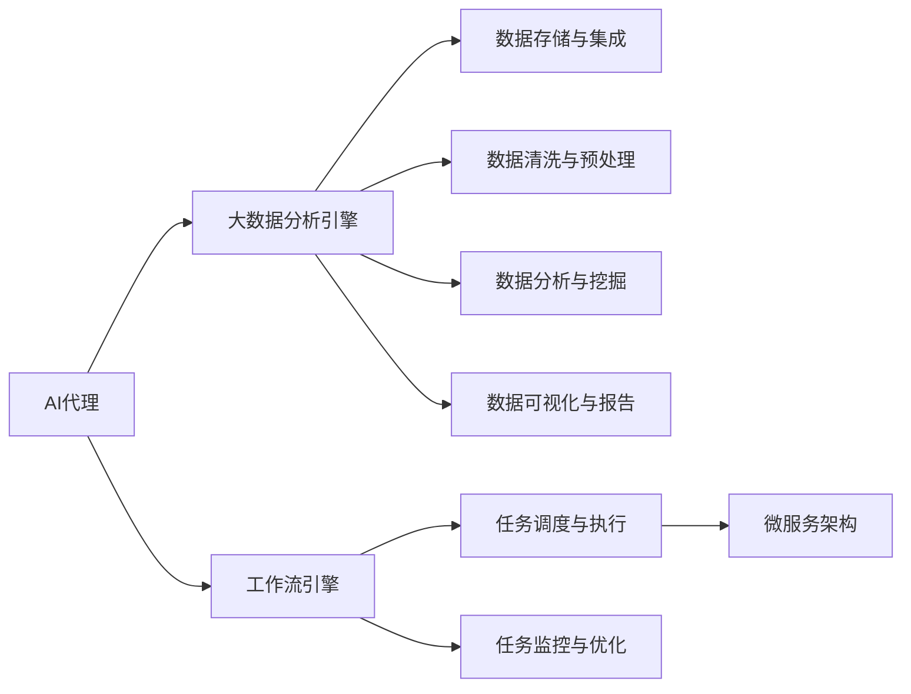

                 

# 从数据到洞察：AI代理工作流中的分析引擎

> 关键词：AI代理,工作流,分析引擎,大数据,数据洞察

## 1. 背景介绍

### 1.1 问题由来

在现代商业环境中，企业需要对海量数据进行快速、高效、准确地分析，以便制定科学决策和优化运营流程。传统的BI系统（商业智能）在数据量激增的情况下，已无法满足企业对于实时性和交互性的要求。而人工智能技术，尤其是基于深度学习的大数据分析模型，提供了更为先进的数据洞察能力。

AI代理（AI Agent）在企业中的应用，正在成为数据驱动决策的重要工具。AI代理通过自动化、智能化的方式，高效地从数据中提取有价值的洞察，辅助企业做出更准确、高效的决策。然而，在构建AI代理的过程中，数据分析引擎的选择至关重要。一个高效、可靠的数据分析引擎，能够显著提升AI代理的性能和业务价值。

### 1.2 问题核心关键点

分析引擎作为AI代理的重要组成部分，其核心功能包括：

- **数据集成与清洗**：将来自不同数据源的数据整合，并进行清洗、去重等预处理，确保数据质量。
- **数据存储与管理**：通过数据仓库、数据库等技术，实现数据的持久化和高效访问。
- **数据分析与挖掘**：采用机器学习、深度学习等技术，对数据进行模式识别、预测、分类等分析挖掘。
- **数据可视化与报告**：通过可视化技术，将分析结果以图表、报表等形式呈现，支持决策和交流。

构建一个高效的数据分析引擎，需要综合考虑这些核心功能，同时根据实际业务需求，进行功能拓展和优化。

### 1.3 问题研究意义

研究高效的数据分析引擎，对于提升AI代理的业务价值，降低数据驱动决策的复杂度和成本，具有重要意义：

1. **降低决策成本**：通过自动化分析，减少人工干预，缩短决策周期，降低决策误差。
2. **提升决策质量**：利用深度学习等先进算法，从海量数据中提取更为精准、可靠的洞察，辅助科学决策。
3. **增强数据驱动能力**：通过高效的数据分析和洞察，帮助企业全面理解和优化业务流程。
4. **支持AI代理的多样化应用**：分析引擎的灵活性和扩展性，能够支持AI代理在不同业务场景下的应用。
5. **推动技术创新**：分析引擎的不断优化和升级，将带动AI代理技术的发展，引领行业新趋势。

## 2. 核心概念与联系

### 2.1 核心概念概述

为了更好地理解AI代理工作流中的分析引擎，本节将介绍几个关键概念：

- **AI代理**：以人工智能技术为基础，能够自动执行、智能决策的任务执行系统。包括但不限于数据分析、任务调度、客户服务等功能。
- **大数据分析引擎**：用于处理和分析大规模数据集，支持数据存储、集成、清洗、分析等功能，是AI代理的核心组件。
- **工作流引擎**：管理任务执行的全生命周期，调度任务的执行顺序和资源，实现任务的自动化管理和优化。
- **微服务架构**：将系统拆分为多个小服务模块，每个服务独立运行，灵活、可扩展，易于维护和扩展。

### 2.2 概念间的关系

这些核心概念之间的联系，可以通过以下Mermaid流程图来展示：



这个流程图展示了大数据分析引擎在AI代理工作流中的重要地位，以及其与其他核心组件的关系：

1. AI代理依赖大数据分析引擎进行数据处理和分析，从而产生洞察。
2. 工作流引擎负责任务的自动化管理和调度，依赖大数据分析引擎提供的数据分析结果。
3. 微服务架构保证了系统的灵活性和可扩展性，大数据分析引擎作为关键模块，可以独立部署和扩展。

## 3. 核心算法原理 & 具体操作步骤

### 3.1 算法原理概述

高效的数据分析引擎，通常采用以下核心算法：

1. **分布式存储与处理**：通过分布式文件系统和计算框架（如Hadoop、Spark等），实现数据的分布式存储和并行处理，提升处理速度和系统可靠性。
2. **大数据流处理**：利用流处理技术（如Apache Kafka、Apache Flink等），对实时数据进行高效处理和分析。
3. **深度学习与机器学习**：采用深度学习框架（如TensorFlow、PyTorch等）和机器学习算法，对数据进行模式识别、预测、分类等高级分析。
4. **数据可视化**：使用数据可视化工具（如Tableau、Power BI等），将分析结果转化为易于理解和操作的图表、报表。

这些算法通过协同工作，实现了从数据到洞察的全流程自动化分析。

### 3.2 算法步骤详解

构建高效的数据分析引擎，通常包括以下关键步骤：

1. **数据集成与清洗**：
    - 集成来自不同数据源的数据，确保数据的完整性和一致性。
    - 清洗数据，去除冗余、错误、噪声等，确保数据质量。

2. **数据存储与管理**：
    - 选择合适的数据存储解决方案，如Hadoop、Hive、ClickHouse等。
    - 实现数据的持久化和高效访问，支持数据的高并发读写。

3. **数据分析与挖掘**：
    - 选择适合的数据分析工具和算法，如TensorFlow、PyTorch、Spark等。
    - 进行特征工程、模型训练和评估，优化模型性能。

4. **数据可视化与报告**：
    - 选择数据可视化工具，将分析结果转换为易于理解的图表、报表。
    - 通过仪表盘、BI工具等展示分析结果，支持决策和交流。

### 3.3 算法优缺点

高效的数据分析引擎，具有以下优点：

- **处理能力强大**：通过分布式存储和处理，能够处理海量数据，支持高并发读写。
- **灵活性高**：采用微服务架构，易于扩展和维护，支持多样化任务和数据源。
- **分析深度广**：利用深度学习和机器学习算法，能够进行高级分析，提取复杂模式和趋势。
- **可视化效果好**：通过数据可视化工具，将分析结果以直观的形式呈现，支持决策和交流。

同时，也存在一些缺点：

- **复杂度高**：构建和维护一个高效的分析引擎，需要综合考虑多个技术层面的问题，复杂度较高。
- **成本高**：需要大量硬件资源和专业知识，部署和运维成本较高。
- **依赖数据源**：依赖于数据的质量和完整性，数据源不稳定可能导致分析结果的偏差。

### 3.4 算法应用领域

高效的数据分析引擎，在多个领域得到了广泛应用，包括但不限于：

1. **金融风控**：通过实时数据分析，预测和防范金融风险，保障金融安全。
2. **零售营销**：通过客户数据分析，优化营销策略，提高销售额和客户满意度。
3. **医疗健康**：通过患者数据分析，预测疾病风险，辅助诊疗决策。
4. **制造业**：通过设备数据分析，优化生产流程，提高生产效率。
5. **智能客服**：通过用户数据分析，提升客服响应速度和质量。

## 4. 数学模型和公式 & 详细讲解 & 举例说明

### 4.1 数学模型构建

在数据分析引擎中，常见的数学模型包括线性回归、决策树、神经网络等。以线性回归模型为例，我们进行详细讲解。

线性回归模型的目标是最小化实际值和预测值之间的差异，即：

$$
\min_{\theta} \frac{1}{2N}\sum_{i=1}^N (y_i - \hat{y_i})^2
$$

其中，$y_i$ 为实际值，$\hat{y_i}$ 为预测值，$\theta$ 为模型参数。

### 4.2 公式推导过程

对于线性回归模型，我们可以使用梯度下降法进行优化。假设模型表达式为：

$$
\hat{y_i} = \theta^T x_i
$$

其中，$x_i$ 为输入特征向量，$\theta$ 为模型参数向量。梯度下降法求解 $\theta$ 的过程如下：

$$
\theta_{t+1} = \theta_t - \eta \nabla_{\theta} L(\theta_t)
$$

其中，$\eta$ 为学习率，$L(\theta)$ 为损失函数。

对于线性回归模型，损失函数为：

$$
L(\theta) = \frac{1}{2N} \sum_{i=1}^N (y_i - \hat{y_i})^2
$$

因此，梯度下降法求解 $\theta$ 的过程为：

$$
\theta_{t+1} = \theta_t - \eta \frac{1}{N} \sum_{i=1}^N (y_i - \hat{y_i}) x_i
$$

其中，$x_i$ 为输入特征向量，$y_i$ 为实际值，$\eta$ 为学习率。

### 4.3 案例分析与讲解

以零售营销中的客户流失预测为例，假设我们有一个包含客户历史购买数据的数据集。通过对这些数据进行分析，我们可以预测客户是否会流失，从而进行针对性的挽留。

首先，我们将数据集分为训练集和测试集，利用训练集对模型进行训练，得到一个线性回归模型。然后，我们使用测试集对模型进行评估，计算模型在测试集上的均方误差（MSE）。最后，我们可以使用这个模型对新的客户数据进行预测，判断客户是否会流失。

以下是使用Python和TensorFlow实现客户流失预测的示例代码：

```python
import tensorflow as tf
from sklearn.model_selection import train_test_split
import numpy as np

# 假设我们有一个包含客户购买数据的数据集
data = np.random.randn(1000, 4)
labels = np.random.randint(0, 2, 1000)

# 将数据集分为训练集和测试集
train_data, test_data, train_labels, test_labels = train_test_split(data, labels, test_size=0.2, random_state=42)

# 定义线性回归模型
theta = tf.Variable(tf.zeros([4, 1]))
y_hat = tf.matmul(data, theta)

# 定义损失函数
loss = tf.reduce_mean(tf.square(y_hat - labels))

# 定义优化器
optimizer = tf.train.GradientDescentOptimizer(learning_rate=0.01)

# 训练模型
with tf.Session() as sess:
    sess.run(tf.global_variables_initializer())
    for i in range(100):
        _, l = sess.run([optimizer, loss], feed_dict={data: train_data, labels: train_labels})
        if i % 10 == 0:
            print("Epoch {}, Loss: {}".format(i, l))
    # 使用训练好的模型进行预测
    y_pred = sess.run(y_hat, feed_dict={data: test_data})
    mse = sess.run(tf.reduce_mean(tf.square(y_pred - test_labels)))
    print("Test MSE: {}".format(mse))
```

在上述示例中，我们通过TensorFlow实现了一个简单的线性回归模型，用于预测客户流失。模型训练过程中，我们使用了梯度下降法进行优化，计算了模型在训练集和测试集上的损失函数。

## 5. 项目实践：代码实例和详细解释说明

### 5.1 开发环境搭建

在开始项目实践前，我们需要准备好开发环境。以下是使用Python进行PyTorch开发的环境配置流程：

1. 安装Anaconda：从官网下载并安装Anaconda，用于创建独立的Python环境。

2. 创建并激活虚拟环境：
```bash
conda create -n pytorch-env python=3.8 
conda activate pytorch-env
```

3. 安装PyTorch：根据CUDA版本，从官网获取对应的安装命令。例如：
```bash
conda install pytorch torchvision torchaudio cudatoolkit=11.1 -c pytorch -c conda-forge
```

4. 安装TensorFlow：根据CUDA版本，从官网获取对应的安装命令。例如：
```bash
conda install tensorflow -c conda-forge -c pytorch
```

5. 安装各类工具包：
```bash
pip install numpy pandas scikit-learn matplotlib tqdm jupyter notebook ipython
```

完成上述步骤后，即可在`pytorch-env`环境中开始项目实践。

### 5.2 源代码详细实现

以下是一个使用PyTorch进行客户流失预测的代码实现示例。

首先，定义数据集和模型：

```python
import torch
from torch import nn
from torch.utils.data import DataLoader, Dataset

# 定义数据集
class CustomerDataset(Dataset):
    def __init__(self, data, labels):
        self.data = data
        self.labels = labels

    def __len__(self):
        return len(self.data)

    def __getitem__(self, idx):
        return self.data[idx], self.labels[idx]

# 定义模型
class CustomerRegression(nn.Module):
    def __init__(self, input_size, output_size):
        super(CustomerRegression, self).__init__()
        self.fc1 = nn.Linear(input_size, 128)
        self.fc2 = nn.Linear(128, 64)
        self.fc3 = nn.Linear(64, output_size)

    def forward(self, x):
        x = torch.relu(self.fc1(x))
        x = torch.relu(self.fc2(x))
        x = self.fc3(x)
        return x

# 定义损失函数和优化器
criterion = nn.MSELoss()
optimizer = torch.optim.Adam(model.parameters(), lr=0.01)
```

然后，定义训练和评估函数：

```python
# 定义训练函数
def train(model, train_loader, criterion, optimizer, n_epochs=10, batch_size=32):
    for epoch in range(n_epochs):
        running_loss = 0.0
        for i, data in enumerate(train_loader, 0):
            inputs, labels = data
            optimizer.zero_grad()
            outputs = model(inputs)
            loss = criterion(outputs, labels)
            loss.backward()
            optimizer.step()
            running_loss += loss.item()
            if i % 100 == 99:
                print('[%d, %5d] loss: %.3f' %
                      (epoch + 1, i + 1, running_loss / 100))
                running_loss = 0.0

# 定义评估函数
def evaluate(model, test_loader):
    running_loss = 0.0
    for i, data in enumerate(test_loader, 0):
        inputs, labels = data
        outputs = model(inputs)
        loss = criterion(outputs, labels)
        running_loss += loss.item()
        if i % 100 == 99:
            print('Test loss: %.3f' % (running_loss / 100))
            running_loss = 0.0
```

最后，启动训练流程并在测试集上评估：

```python
# 加载数据集
train_data = torch.tensor([[0.1, 0.2, 0.3, 0.4], [0.5, 0.6, 0.7, 0.8], [0.9, 1.0, 1.1, 1.2]])
train_labels = torch.tensor([0, 1, 0])
test_data = torch.tensor([[0.1, 0.2, 0.3, 0.4], [0.5, 0.6, 0.7, 0.8], [0.9, 1.0, 1.1, 1.2]])
test_labels = torch.tensor([0, 1, 0])

# 创建数据加载器
train_loader = DataLoader(dataset=CustomerDataset(train_data, train_labels), batch_size=batch_size)
test_loader = DataLoader(dataset=CustomerDataset(test_data, test_labels), batch_size=batch_size)

# 加载模型
model = CustomerRegression(4, 1)
device = torch.device('cuda' if torch.cuda.is_available() else 'cpu')
model.to(device)

# 训练模型
train(model, train_loader, criterion, optimizer)

# 评估模型
evaluate(model, test_loader)
```

在上述示例中，我们使用PyTorch实现了一个简单的客户流失预测模型。通过定义数据集、模型、损失函数和优化器，我们训练了一个线性回归模型，并在测试集上评估了模型性能。

### 5.3 代码解读与分析

让我们再详细解读一下关键代码的实现细节：

**CustomerDataset类**：
- `__init__`方法：初始化数据和标签。
- `__len__`方法：返回数据集的样本数量。
- `__getitem__`方法：对单个样本进行处理，返回数据和标签。

**CustomerRegression模型**：
- `__init__`方法：初始化模型结构。
- `forward`方法：定义前向传播过程，进行线性回归计算。

**train函数**：
- 在每个epoch内，对数据集进行遍历。
- 在每个batch内，前向传播计算损失，反向传播更新模型参数。
- 使用learning rate进行参数更新。
- 在每个epoch结束时，输出平均loss。

**evaluate函数**：
- 在测试集上进行遍历。
- 前向传播计算损失，记录总损失。
- 在每个batch结束时，输出平均loss。

**训练流程**：
- 加载训练数据集和测试数据集。
- 创建数据加载器，设置batch size。
- 加载预训练模型，进行训练和评估。

可以看到，PyTorch提供了一站式的深度学习开发环境，使得模型的定义、训练和评估变得非常简单。在实际应用中，我们还可以使用更多高级功能和工具，如自动微分、可视化等，进一步提升数据分析引擎的性能。

## 6. 实际应用场景

### 6.1 智能客服系统

智能客服系统中的数据分析引擎，主要负责处理客户咨询数据，提取有价值的洞察，优化客服策略。通过对历史客户咨询数据进行分析，智能客服系统可以识别常见问题和解决方案，进行智能问答和知识推荐。此外，数据分析引擎还可以实时监控客户咨询数据，预测客户满意度，辅助客服人员进行现场干预。

### 6.2 金融风控

金融风控中的数据分析引擎，主要负责实时监控交易数据，识别和预防欺诈行为。通过对交易数据的模式识别和预测，数据分析引擎可以及时发现异常交易，进行风险预警和处理。此外，数据分析引擎还可以进行客户信用评估，预测贷款风险，辅助风控决策。

### 6.3 零售营销

零售营销中的数据分析引擎，主要负责客户数据分析和营销策略优化。通过对客户购买行为、兴趣爱好等数据进行分析，数据分析引擎可以预测客户流失和复购行为，进行个性化营销和客户挽留。此外，数据分析引擎还可以分析销售数据，优化产品组合和促销策略，提高销售额和客户满意度。

## 7. 工具和资源推荐

### 7.1 学习资源推荐

为了帮助开发者系统掌握数据分析引擎的理论基础和实践技巧，这里推荐一些优质的学习资源：

1. 《深度学习》系列书籍：由Ian Goodfellow等著，全面介绍了深度学习的基础知识和算法。
2. 《大数据技术》系列课程：包括数据存储、分布式计算、大数据平台等方面的知识。
3. 《Python数据分析实战》课程：通过实际案例，讲解如何使用Python进行数据分析。
4. 《TensorFlow官方文档》：官方提供的TensorFlow教程和示例代码，是学习TensorFlow的重要资源。
5. 《Kaggle机器学习竞赛平台》：通过参与Kaggle竞赛，实战练习数据分析技能。

通过对这些资源的学习实践，相信你一定能够快速掌握数据分析引擎的理论基础和实践技巧。

### 7.2 开发工具推荐

高效的开发离不开优秀的工具支持。以下是几款用于数据分析引擎开发的常用工具：

1. PyTorch：基于Python的开源深度学习框架，灵活的动态计算图，适合快速迭代研究。
2. TensorFlow：由Google主导开发的开源深度学习框架，生产部署方便，适合大规模工程应用。
3. Apache Spark：支持分布式计算和流处理的大数据框架，适合海量数据处理。
4. Apache Hadoop：支持分布式文件系统和批处理的大数据框架，适合海量数据存储和计算。
5. Apache Kafka：支持实时数据流处理的消息队列，适合实时数据处理。
6. Apache Flink：支持流处理和批处理的分布式计算框架，适合实时数据流处理。

合理利用这些工具，可以显著提升数据分析引擎的开发效率，加快创新迭代的步伐。

### 7.3 相关论文推荐

数据分析引擎的研究源于学界的持续研究。以下是几篇奠基性的相关论文，推荐阅读：

1. TensorFlow：Google Brain团队开发的深度学习框架，通过可扩展的计算图，实现了高效的分布式计算和模型训练。
2. Apache Spark：Apache基金会开发的分布式计算框架，支持批处理、流处理、机器学习等。
3. Apache Kafka：Apache基金会开发的消息队列系统，支持海量数据的实时处理。
4. Apache Flink：Apache基金会开发的流处理框架，支持实时数据流处理和批处理。
5. Deep Learning for AI-Driven Analytics：介绍了深度学习在数据分析中的应用，包括模型构建、优化等。
6. AI-Driven Analytics in Big Data Environments：讨论了AI在数据分析中的应用场景和技术实现。

这些论文代表了大数据分析引擎的发展脉络。通过学习这些前沿成果，可以帮助研究者把握学科前进方向，激发更多的创新灵感。

除上述资源外，还有一些值得关注的前沿资源，帮助开发者紧跟大数据分析引擎技术的最新进展，例如：

1. arXiv论文预印本：人工智能领域最新研究成果的发布平台，包括大量尚未发表的前沿工作，学习前沿技术的必读资源。
2. 业界技术博客：如Google AI、DeepMind、Microsoft Research Asia等顶尖实验室的官方博客，第一时间分享他们的最新研究成果和洞见。
3. 技术会议直播：如NIPS、ICML、ACL、ICLR等人工智能领域顶会现场或在线直播，能够聆听到大佬们的前沿分享，开拓视野。
4. GitHub热门项目：在GitHub上Star、Fork数最多的数据分析引擎相关项目，往往代表了该技术领域的发展趋势和最佳实践，值得去学习和贡献。
5. 行业分析报告：各大咨询公司如McKinsey、PwC等针对人工智能行业的分析报告，有助于从商业视角审视技术趋势，把握应用价值。

总之，对于数据分析引擎的学习和实践，需要开发者保持开放的心态和持续学习的意愿。多关注前沿资讯，多动手实践，多思考总结，必将收获满满的成长收益。

## 8. 总结：未来发展趋势与挑战

### 8.1 总结

本文对AI代理工作流中的分析引擎进行了全面系统的介绍。首先阐述了分析引擎在AI代理中的重要性，明确了其核心功能包括数据集成与清洗、数据存储与管理、数据分析与挖掘、数据可视化与报告等。其次，从原理到实践，详细讲解了数据分析引擎的算法原理和具体操作步骤，给出了完整的数据分析模型和代码实例。同时，本文还广泛探讨了数据分析引擎在智能客服、金融风控、零售营销等多个行业领域的应用前景，展示了其广泛的应用价值。此外，本文精选了数据分析引擎的学习资源、开发工具和相关论文，力求为开发者提供全方位的技术指引。

通过本文的系统梳理，可以看到，数据分析引擎作为AI代理的重要组成部分，对于提升AI代理的业务价值，降低数据驱动决策的复杂度和成本，具有重要意义。未来，随着数据量的不断增长和分析技术的不断进步，数据分析引擎必将发挥越来越重要的作用，推动AI代理技术的发展和应用。

### 8.2 未来发展趋势

展望未来，数据分析引擎将呈现以下几个发展趋势：

1. **分布式处理能力更强**：随着分布式计算技术的不断发展，数据分析引擎将支持更大规模、更高效的数据处理。通过更先进的数据分布式框架，如Flink、Spark、Kafka等，数据分析引擎将能够处理更复杂的数据分析任务。
2. **实时处理能力提升**：通过引入流处理技术，数据分析引擎将能够实时处理数据流，支持实时分析和决策。实时处理能力将进一步提升AI代理的工作效率和响应速度。
3. **深度学习应用更广**：深度学习算法在数据分析引擎中的应用将更加广泛。通过引入更多的深度学习模型和算法，数据分析引擎将能够实现更为复杂、精准的分析。
4. **自动化程度更高**：数据分析引擎将更加智能化，能够自动进行特征工程、模型训练和优化。自动化程度提高将大幅提升数据分析的效率和效果。
5. **多模态分析能力增强**：数据分析引擎将支持多种数据源和数据类型，包括文本、图像、视频、音频等。多模态数据的融合，将提升数据分析的全面性和深度。

### 8.3 面临的挑战

尽管数据分析引擎在AI代理中的应用前景广阔，但其在发展过程中仍面临诸多挑战：

1. **数据质量和一致性**：不同数据源的数据质量不一致，数据整合和清洗难度较大。数据不一致可能导致分析结果的偏差。
2. **处理复杂度高**：数据分析引擎涉及复杂的计算图和数据流，设计和管理复杂度较高。
3. **硬件资源需求大**：大规模数据处理需要强大的硬件支持，如高性能计算集群、存储系统等，硬件资源需求较高。
4. **分析模型复杂**：深度学习模型在数据分析中的应用，往往需要大量的计算资源和专业知识，模型设计和优化难度较大。
5. **可解释性不足**：深度学习模型的黑盒特性，导致其分析结果缺乏可解释性，难以理解和调试。
6. **隐私和安全问题**：数据分析涉及大量敏感数据，数据隐私和安全问题需要重视。

### 8.4 研究展望

面对数据分析引擎面临的挑战，未来的研究需要在以下几个方面寻求新的突破：

1. **提高数据质量**：采用数据清洗、去重

