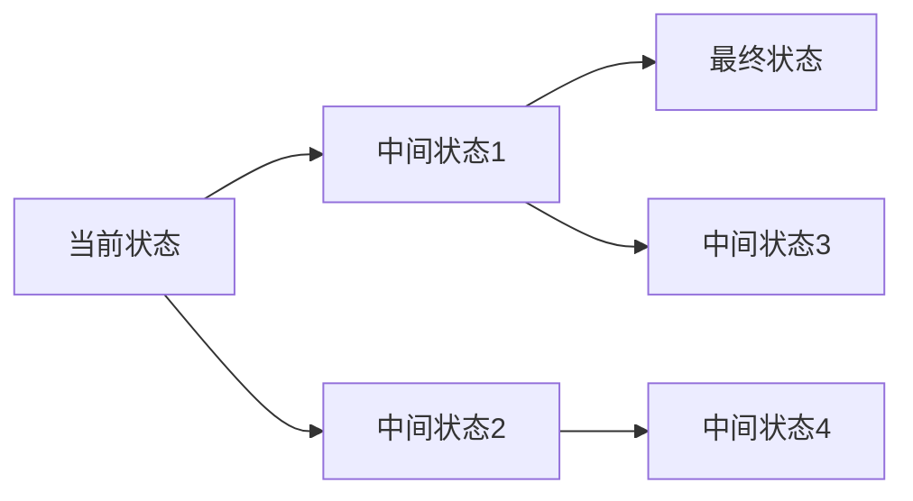

                 

# 从显式编程到目标导向搜索:软件开发范式的演变

> 关键词：显式编程, 目标导向搜索, 编程范式, 软件开发, 范式转换

## 1. 背景介绍

软件开发自诞生以来，历经多次范式的演变。从早期的结构化编程到面向对象编程，再到函数式编程，每种范式都有其独特之处和适用场景。然而，这些范式都存在一定的局限性，难以兼顾可维护性、可扩展性、性能和安全性等多重考量。

近年来，目标导向搜索（Goal-Oriented Search）作为一种新型的软件开发范式，在智能推荐系统、机器人、游戏AI等领域得到了广泛应用。本文旨在探讨目标导向搜索在软件开发中的应用，及其与传统编程范式的关系和区别，为软件开发提供新思路。

## 2. 核心概念与联系

### 2.1 核心概念概述

在介绍目标导向搜索前，先回顾几种常见的编程范式：

- **显式编程**：通过详细控制程序的执行流程和数据操作，实现程序的功能。适合需求明确且可预测的场景。

- **面向对象编程**：将程序看作由对象组成，通过封装、继承、多态等机制实现模块化设计和重用。适合复杂系统的开发和维护。

- **函数式编程**：以函数为基本单位，通过组合和递归实现程序的功能。强调数据不可变性和函数无状态性，适合处理大规模数据和高并发场景。

目标导向搜索则是一种更加灵活和动态的编程范式，强调程序执行过程中的目标导向性，通过搜索求解最优解。在搜索过程中，系统会根据当前状态和目标不断调整策略，直至达到最优解。

### 2.2 核心概念间的联系

显式编程、面向对象编程和函数式编程都可以看作目标导向搜索的特例：

- 显式编程中的每一步都是一次简单的目标导向搜索，在不断满足当前状态的前提下，逐步接近最终目标。

- 面向对象编程中的类和方法是程序执行过程中的中间状态，不断调整对象状态直至满足最终目标。

- 函数式编程中的函数组合和递归也是一种目标导向搜索，通过不断变换函数组合方式，逐步逼近最终结果。

目标导向搜索相对于传统编程范式的优势在于：

1. 动态性：能够根据当前状态和目标自动调整执行策略，适应复杂多变的环境。

2. 鲁棒性：通过多条路径探索和并行计算，减少路径搜索的盲目性，提高求解效率。

3. 可扩展性：能够灵活组合多种搜索策略，适应不同任务需求，具有良好的可扩展性。

4. 并行性：通过并行搜索和分布式计算，提高计算效率，降低求解成本。

### 2.3 核心概念的整体架构

目标导向搜索的整体架构可以表示为一个有向图，其中节点表示程序状态，边表示状态转换。搜索过程即为在图中不断移动，寻找满足目标状态的最优路径。以下是一个简单的目标导向搜索的示意图：



在上述示意图中，从A到C表示程序从初始状态执行到最终状态的过程，中间状态B和D则是程序执行过程中的重要节点。搜索过程即为在图中不断探索，从A到C的路径。

## 3. 核心算法原理 & 具体操作步骤
### 3.1 算法原理概述

目标导向搜索的核心原理是通过迭代搜索求解最优解。具体来说，将程序执行过程看作目标导向的路径搜索，每次搜索都是基于当前状态和目标状态进行的，旨在通过不断调整策略，逐步逼近最优解。

目标导向搜索的算法一般包括以下几个步骤：

1. **定义目标状态**：明确程序执行的最终目标，可以是特定的结果、性能指标等。

2. **定义状态转移函数**：描述程序从一个状态到另一个状态的转换方式，通常通过函数或规则实现。

3. **定义启发式函数**：评估当前状态与目标状态之间的距离，指导搜索过程，避免陷入局部最优。

4. **定义搜索策略**：选择合适的搜索方法，如深度优先搜索、广度优先搜索、A*搜索等。

5. **迭代搜索**：从初始状态开始，根据当前状态和目标状态，通过状态转移函数和启发式函数不断调整策略，直到达到目标状态。

### 3.2 算法步骤详解

下面以目标导向搜索在推荐系统中的应用为例，详细讲解其操作步骤：

**Step 1: 定义目标状态**

推荐系统的目标状态是找到满足用户偏好的物品推荐结果。用户偏好可以通过用户历史行为、评分等数据表示。

**Step 2: 定义状态转移函数**

状态转移函数描述了如何根据当前物品推荐结果，生成下一轮的推荐结果。例如，可以根据用户的历史行为数据，使用协同过滤、内容推荐等方法生成下一轮推荐结果。

**Step 3: 定义启发式函数**

启发式函数评估当前推荐结果与用户偏好的匹配程度，例如通过计算推荐物品的点击率、评分等指标，指导搜索过程，避免推荐与用户偏好不符的物品。

**Step 4: 定义搜索策略**

推荐系统常用的搜索策略包括深度优先搜索、广度优先搜索和A*搜索。其中，A*搜索由于其高效的启发式评估，适用于推荐系统中的实时推荐和个性化推荐任务。

**Step 5: 迭代搜索**

从用户历史行为数据出发，通过状态转移函数生成初始推荐结果。然后，根据当前推荐结果和启发式函数评估当前状态与目标状态的距离。在搜索过程中，不断调整推荐算法，直到生成满足用户偏好的推荐结果。

### 3.3 算法优缺点

目标导向搜索相较于传统编程范式，具有以下优点：

1. 动态性：能够根据当前状态和目标自动调整执行策略，适应复杂多变的环境。

2. 鲁棒性：通过多条路径探索和并行计算，减少路径搜索的盲目性，提高求解效率。

3. 可扩展性：能够灵活组合多种搜索策略，适应不同任务需求，具有良好的可扩展性。

4. 并行性：通过并行搜索和分布式计算，提高计算效率，降低求解成本。

同时，目标导向搜索也存在一些缺点：

1. 搜索过程复杂：需要定义状态转移函数、启发式函数等，增加了编程复杂度。

2. 搜索空间大：随着问题规模的增加，搜索空间呈指数级增长，需要高效搜索算法来降低计算复杂度。

3. 目标状态定义困难：有时难以准确定义目标状态，导致搜索过程陷入死循环。

### 3.4 算法应用领域

目标导向搜索在多个领域得到了广泛应用，例如：

- **智能推荐系统**：如电商推荐、音乐推荐、视频推荐等，通过目标导向搜索实现个性化推荐。

- **机器人导航**：如无人车导航、无人机路径规划等，通过目标导向搜索实现最优路径规划。

- **游戏AI**：如智能对战、自动生成游戏关卡等，通过目标导向搜索实现智能决策。

- **供应链优化**：如物流路径规划、库存管理等，通过目标导向搜索实现最优方案。

## 4. 数学模型和公式 & 详细讲解 & 举例说明

### 4.1 数学模型构建

目标导向搜索的数学模型可以通过图搜索算法表示，其中节点表示状态，边表示状态转移。以下是一个简单的图搜索模型：


在上述模型中，节点表示状态，箭头表示状态转移。搜索过程即为在图中不断移动，寻找满足目标状态的最优路径。

### 4.2 公式推导过程

在目标导向搜索中，常用的搜索算法包括深度优先搜索（DFS）、广度优先搜索（BFS）和A*搜索。以下以A*搜索为例，介绍其公式推导过程。

A*搜索的核心思想是通过启发式函数评估当前状态与目标状态的距离，指导搜索过程。其公式推导如下：

$$
f(n) = g(n) + h(n)
$$

其中，$n$表示当前状态，$g(n)$表示从起始状态到当前状态的实际代价，$h(n)$表示从当前状态到目标状态的估计代价。

通过定义合适的启发式函数$h(n)$，可以显著提高搜索效率。例如，在推荐系统中，可以使用点击率预测模型评估当前推荐结果与目标状态的匹配程度，指导搜索过程。

### 4.3 案例分析与讲解

**案例分析1：电商推荐系统**

在电商推荐系统中，推荐目标是通过搜索商品库，找到用户偏好的商品。假设商品库中商品数量为$N$，用户历史行为数据为$D$。

**Step 1: 定义目标状态**

推荐目标状态为$(x_i, y_i)$，其中$x_i$为用户偏好的商品，$y_i$为商品对应的评分或点击率。

**Step 2: 定义状态转移函数**

状态转移函数为：

$$
f(x_{i+1}, y_{i+1}|x_i, y_i) = f(x_i, y_i) + \delta(x_{i+1}, y_{i+1}|x_i, y_i)
$$

其中，$\delta(x_{i+1}, y_{i+1}|x_i, y_i)$表示从状态$(x_i, y_i)$到状态$(x_{i+1}, y_{i+1})$的代价。

**Step 3: 定义启发式函数**

启发式函数可以定义为：

$$
h(x_{i+1}, y_{i+1}|x_i, y_i) = \max\{r(x_{i+1}), r(y_{i+1})\} - r(x_i, y_i)
$$

其中，$r(x_{i+1})$和$r(y_{i+1})$表示用户对推荐结果的评分或点击率。

**Step 4: 定义搜索策略**

A*搜索策略可以使用$h(x_i, y_i)$和$g(x_i, y_i)$计算每个节点的$f(x_i, y_i)$，指导搜索过程。

**Step 5: 迭代搜索**

从用户历史行为数据出发，通过状态转移函数生成初始推荐结果。然后，根据当前推荐结果和启发式函数评估当前状态与目标状态的距离。在搜索过程中，不断调整推荐算法，直到生成满足用户偏好的推荐结果。

**案例分析2：无人车导航**

无人车导航的目标是通过搜索地图，找到最优导航路径。假设地图中节点数为$M$，无人车当前位置为$n_i$，目标位置为$n_t$。

**Step 1: 定义目标状态**

推荐目标状态为$(n_t, d)$，其中$d$为无人车从当前位置$n_i$到目标位置$n_t$的距离。

**Step 2: 定义状态转移函数**

状态转移函数为：

$$
f(n_{i+1}, d_{i+1}|n_i, d_i) = f(n_i, d_i) + \delta(n_{i+1}, d_{i+1}|n_i, d_i)
$$

其中，$\delta(n_{i+1}, d_{i+1}|n_i, d_i)$表示从状态$(n_i, d_i)$到状态$(n_{i+1}, d_{i+1})$的代价，可以是地图上的距离、障碍物数量等。

**Step 3: 定义启发式函数**

启发式函数可以定义为：

$$
h(n_{i+1}, d_{i+1}|n_i, d_i) = \max\{d(n_{i+1}), d_{i+1}\} - d(n_i)
$$

其中，$d(n_{i+1})$和$d_{i+1}$表示无人车从当前位置到目标位置和目标位置的距离。

**Step 4: 定义搜索策略**

A*搜索策略可以使用$h(n_i, d_i)$和$g(n_i, d_i)$计算每个节点的$f(n_i, d_i)$，指导搜索过程。

**Step 5: 迭代搜索**

从无人车当前位置出发，通过状态转移函数生成初始位置和距离。然后，根据当前位置和距离和启发式函数评估当前状态与目标状态的距离。在搜索过程中，不断调整导航算法，直到生成最优导航路径。

## 5. 项目实践：代码实例和详细解释说明

### 5.1 开发环境搭建

要进行目标导向搜索的开发实践，首先需要搭建开发环境。以下是使用Python进行PyTorch开发的环境配置流程：

1. 安装Anaconda：从官网下载并安装Anaconda，用于创建独立的Python环境。

2. 创建并激活虚拟环境：
```bash
conda create -n pytorch-env python=3.8 
conda activate pytorch-env
```

3. 安装PyTorch：根据CUDA版本，从官网获取对应的安装命令。例如：
```bash
conda install pytorch torchvision torchaudio cudatoolkit=11.1 -c pytorch -c conda-forge
```

4. 安装TensorFlow：如果需要在TensorFlow中实现目标导向搜索，请先安装TensorFlow：
```bash
pip install tensorflow
```

5. 安装各类工具包：
```bash
pip install numpy pandas scikit-learn matplotlib tqdm jupyter notebook ipython
```

完成上述步骤后，即可在`pytorch-env`环境中开始目标导向搜索的开发实践。

### 5.2 源代码详细实现

以下是一个简单的目标导向搜索的PyTorch代码实现，用于搜索电商推荐系统中的最优推荐结果：

```python
import torch
import numpy as np

# 定义状态转移函数
def transition_fn(state):
    # 假设状态为(x, y)，生成下一状态(x', y')
    x, y = state
    # 假设推荐算法为协同过滤，计算下一个推荐结果
    x_prime = np.random.choice(x, p=state[1] / np.sum(state[1]))
    y_prime = np.random.normal(y, 0.1)
    return x_prime, y_prime

# 定义启发式函数
def heuristic_fn(state):
    # 假设启发式函数为点击率预测，计算当前推荐结果与目标状态的距离
    x, y = state
    # 假设点击率预测模型为y = 0.5 + 0.5*x，计算当前推荐结果的点击率
    y_predicted = 0.5 + 0.5 * x
    # 假设目标状态为点击率为1.0，计算当前推荐结果与目标状态的距离
    return 1 - y_predicted

# 定义目标状态
target_state = (0, 1.0)

# 定义搜索策略
def a_star(start_state, end_state, transition_fn, heuristic_fn):
    # 初始化状态和代价
    open_list = [(start_state, 0)]
    closed_list = []
    # 开始搜索
    while open_list:
        # 从open_list中选择代价最小的状态
        current_state, current_cost = min(open_list, key=lambda x: x[1])
        open_list.remove(current_state)
        closed_list.append(current_state)
        # 如果当前状态为目标状态，则搜索结束
        if current_state == end_state:
            return current_state, current_cost
        # 生成当前状态的所有可能后继状态
        successors = transition_fn(current_state)
        # 计算后继状态的代价和启发式代价
        successors_cost = [(current_cost + heuristic_fn(s), s) for s in successors]
        # 将后继状态添加到open_list中
        open_list.extend(successors_cost)
    return None, None

# 生成初始状态
start_state = (0, 0.5)

# 搜索最优推荐结果
best_state, cost = a_star(start_state, target_state, transition_fn, heuristic_fn)
print("最优推荐结果为：", best_state)
```

### 5.3 代码解读与分析

让我们再详细解读一下关键代码的实现细节：

**transition_fn函数**：
- 定义状态转移函数，接收当前状态，生成下一个状态。在电商推荐系统中，可以通过协同过滤等方法生成推荐结果。

**heuristic_fn函数**：
- 定义启发式函数，评估当前状态与目标状态的距离。在电商推荐系统中，可以使用点击率预测模型评估推荐结果与目标状态的匹配程度。

**a_star函数**：
- 定义A*搜索策略，接收初始状态、目标状态、状态转移函数和启发式函数，返回最优状态和代价。在电商推荐系统中，通过搜索商品库，找到用户偏好的商品。

**start_state变量**：
- 定义初始状态，即用户的初始历史行为数据。

**target_state变量**：
- 定义目标状态，即用户偏好的商品。

**search函数调用**：
- 调用a_star函数，搜索最优推荐结果。

**print语句**：
- 输出最优推荐结果。

可以看到，通过上述代码实现，可以方便地搜索电商推荐系统中的最优推荐结果。通过不断调整状态转移函数和启发式函数，还可以优化搜索过程，适应不同任务需求。

## 6. 实际应用场景

### 6.1 智能推荐系统

目标导向搜索在智能推荐系统中具有广泛应用，通过搜索推荐库，找到满足用户偏好的物品推荐结果。目标导向搜索可以适应复杂的用户需求，通过不断调整推荐策略，实现个性化推荐。

### 6.2 机器人导航

目标导向搜索在机器人导航中也有重要应用，通过搜索地图，找到最优导航路径。目标导向搜索可以适应复杂多变的地图环境，通过不断调整导航策略，实现最优路径规划。

### 6.3 游戏AI

目标导向搜索在游戏AI中也得到了广泛应用，通过搜索游戏状态，实现智能决策。目标导向搜索可以适应复杂的 game state 环境，通过不断调整决策策略，实现最优决策。

### 6.4 未来应用展望

随着目标导向搜索技术的不断发展，其在多个领域的应用将不断扩展和深化。未来，目标导向搜索技术将在以下方面得到进一步应用：

1. **自动驾驶**：通过搜索环境，实现最优路径规划和行为决策，提升自动驾驶系统的安全性。

2. **医疗诊断**：通过搜索医疗数据，实现最优诊断路径，提高诊断准确性。

3. **金融投资**：通过搜索市场数据，实现最优投资决策，提升投资回报率。

4. **供应链管理**：通过搜索供应链网络，实现最优物流路径和库存管理，降低物流成本。

5. **智能客服**：通过搜索知识库，实现最优问题解答，提升客户服务体验。

总之，目标导向搜索技术将在多个领域得到广泛应用，为智能系统的开发和优化提供重要支持。

## 7. 工具和资源推荐

### 7.1 学习资源推荐

为了帮助开发者系统掌握目标导向搜索的理论基础和实践技巧，这里推荐一些优质的学习资源：

1. **《算法导论》**：介绍各种经典算法和数据结构，包括搜索算法。

2. **Coursera《Algorithms on Graphs》课程**：介绍图搜索算法，包括深度优先搜索、广度优先搜索和A*搜索等。

3. **DeepMind《Deep Reinforcement Learning》书籍**：介绍深度强化学习，包括基于搜索的决策方法。

4. **arXiv论文预印本**：人工智能领域最新研究成果的发布平台，包括大量关于目标导向搜索的论文。

5. **《Python Cookbook》**：介绍Python编程技巧，包括如何使用Python实现各种算法。

6. **GitHub开源项目**：在GitHub上Star、Fork数最多的目标导向搜索相关项目，往往代表了该技术领域的发展趋势和最佳实践。

7. **Kaggle竞赛**：参加Kaggle竞赛，实践目标导向搜索在实际问题中的应用。

通过对这些资源的学习实践，相信你一定能够快速掌握目标导向搜索的精髓，并用于解决实际的NLP问题。

### 7.2 开发工具推荐

高效的开发离不开优秀的工具支持。以下是几款用于目标导向搜索开发的常用工具：

1. **PyTorch**：基于Python的开源深度学习框架，灵活动态的计算图，适合快速迭代研究。

2. **TensorFlow**：由Google主导开发的开源深度学习框架，生产部署方便，适合大规模工程应用。

3. **Scikit-learn**：Python机器学习库，提供各种算法实现，包括搜索算法。

4. **Numpy**：Python科学计算库，支持高效的数组操作和数学计算。

5. **Pandas**：Python数据处理库，支持高效的数据读取和处理。

6. **Matplotlib**：Python绘图库，支持高效的图表展示。

7. **Jupyter Notebook**：Python交互式笔记本，方便进行实验和数据分析。

合理利用这些工具，可以显著提升目标导向搜索的开发效率，加快创新迭代的步伐。

### 7.3 相关论文推荐

目标导向搜索在多个领域得到了广泛应用，相关研究也在不断进步。以下是几篇奠基性的相关论文，推荐阅读：

1. **《A* Search》**：由Hart、Norvig和Rush发表，介绍A*搜索算法的基本思想和实现。

2. **《深度强化学习》**：由Bertsekas发表，介绍深度强化学习的基本概念和算法，包括基于搜索的决策方法。

3. **《深度学习》**：由Goodfellow、Bengio和Courville发表，介绍深度学习的原理和应用，包括目标导向搜索。

4. **《Python数据科学手册》**：由Jake VanderPlas发表，介绍Python在数据科学中的应用，包括搜索算法。

5. **《强化学习》**：由Sutton和Barto发表，介绍强化学习的基本概念和算法，包括基于搜索的决策方法。

这些论文代表了大语言模型微调技术的发展脉络。通过学习这些前沿成果，可以帮助研究者把握学科前进方向，激发更多的创新灵感。

除上述资源外，还有一些值得关注的前沿资源，帮助开发者紧跟目标导向搜索技术的最新进展，例如：

1. **arXiv论文预印本**：人工智能领域最新研究成果的发布平台，包括大量尚未发表的前沿工作，学习前沿技术的必读资源。

2. **谷歌AI博客**：谷歌AI团队发布的官方博客，包含最新技术突破和前沿研究，是了解最新动态的重要途径。

3. **DeepMind博客**：DeepMind团队发布的官方博客，涵盖最新研究进展和技术突破，是了解最新动态的重要途径。

4. **Kaggle竞赛**：参加Kaggle竞赛，实践目标导向搜索在实际问题中的应用。

5. **GitHub开源项目**：在GitHub上Star、Fork数最多的目标导向搜索相关项目，往往代表了该技术领域的发展趋势和最佳实践。

总之，对于目标导向搜索技术的学习和实践，需要开发者保持开放的心态和持续学习的意愿。多关注前沿资讯，多动手实践，多思考总结，必将收获满满的成长收益。

## 8. 总结：未来发展趋势与挑战

### 8.1 总结

本文对目标导向搜索的原理、操作步骤和应用进行了全面系统的介绍。首先阐述了目标导向搜索的背景和意义，明确了其在复杂多变环境下的优势。其次，从原理到实践，详细讲解了目标导向搜索的数学模型和操作步骤，给出了目标导向搜索任务开发的完整代码实例。同时，本文还广泛探讨了目标导向搜索在多个行业领域的应用前景，展示了其广泛的应用潜力。此外，本文精选了目标导向搜索技术的各类学习资源，力求为开发者提供全方位的技术指引。

通过本文的系统梳理，可以看到，目标导向搜索在软件开发中展现了强大的动态性、鲁棒性和可扩展性，能够有效应对复杂多变的环境。未来，随着目标导向搜索技术的不断发展，其在更多领域的应用将不断扩展和深化。

### 8.2 未来发展趋势

展望未来，目标导向搜索技术将呈现以下几个发展趋势：

1. **动态性**：随着环境的多样化和复杂性不断增加，目标导向搜索将更加注重动态调整策略，以适应复杂多变的环境。

2. **鲁棒性**：目标导向搜索将通过多条路径探索和并行计算，减少路径搜索的盲目性，提高求解效率。

3. **可扩展性**：目标导向搜索将能够灵活组合多种搜索策略，适应不同任务需求，具有良好的可扩展性。

4. **并行性**：目标导向搜索将通过并行搜索和分布式计算，提高计算效率，降低求解成本。

5. **混合策略**：目标导向搜索将与其他优化方法（如强化学习、遗传算法等）结合，形成更加全面的优化策略。

6. **元搜索**：目标导向搜索将通过元搜索方法（如贝叶斯优化、神经网络搜索等）优化搜索策略，进一步提高求解效率。

以上趋势凸显了目标导向搜索技术的广阔前景。这些方向的探索发展，必将进一步提升目标导向搜索系统的性能和应用范围，为软件开发提供更强大的支持。

### 8.3 面临的挑战

尽管目标导向搜索技术已经取得了瞩目成就，但在迈向更加智能化、普适化应用的过程中，它仍面临着诸多挑战：

1. **搜索空间大**：随着问题规模的增加，搜索空间呈指数级增长，需要高效搜索算法来降低计算复杂度。

2. **目标状态定义困难**：有时难以准确定义目标状态，导致搜索过程陷入死循环。

3. **搜索过程复杂**：需要定义状态转移函数、启发式函数等，增加了编程复杂度。

4. **鲁棒性不足**：在复杂多变的环境中，目标导向搜索的鲁棒性不足，容易陷入局部最优。

5. **计算资源需求高**：目标导向搜索需要大量的计算资源，包括高性能设备、优化算法等，增加了开发成本。

6. **可解释性不足**：目标导向搜索的决策过程缺乏可解释性，难以对其推理逻辑进行分析和调试。

7. **安全性和伦理问题**：在复杂多变的环境中，目标导向搜索可能产生有害结果，需要加强安全性和伦理约束。

正视

