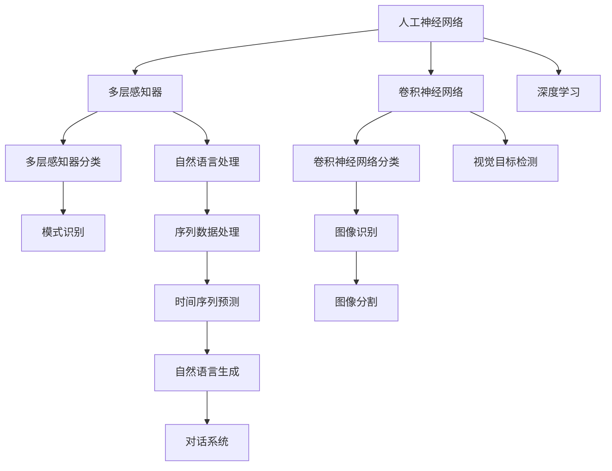

                 

# 从概念到洞见：思想的演变

> 关键词：人工智能,机器学习,深度学习,算法演变,技术洞见,前沿研究

## 1. 背景介绍

### 1.1 问题由来

人工智能(AI)作为当今科技前沿，近年来迅猛发展，其中机器学习(ML)和深度学习(DL)算法扮演了关键角色。从最初的专家系统到如今的深度神经网络，AI的发展历程充满了对算法和思想的不断革新与实践。对概念到洞见的演变进行探讨，不仅有助于我们理解AI的发展脉络，还能激发对未来研究方向的思考。

### 1.2 问题核心关键点

本文将聚焦于AI领域的算法演变，具体来说，我们将从早期的人工神经网络模型开始，经过多层感知器、卷积神经网络、循环神经网络等模型的发展，再到深度学习时代的兴起，并最终深入探讨当前前沿研究和技术洞见。以下五个关键点将是文章探讨的核心：

1. **早期神经网络**：概述人工神经网络的基本原理和历史演变。
2. **多层感知器**：介绍多层感知器及其在图像分类和模式识别中的应用。
3. **卷积神经网络**：讨论卷积神经网络的结构和其在图像处理中的性能优势。
4. **循环神经网络**：阐述循环神经网络在序列数据处理中的重要性和挑战。
5. **深度学习前沿**：探讨最新的深度学习算法和思想，如自监督学习、Transformer、GPT等。

### 1.3 问题研究意义

通过研究AI算法的演变过程，我们可以更好地理解这一领域的知识体系和技术进步。这些洞见不仅能够帮助我们深入理解现有技术，还能启发我们发现新的研究方向，推动AI技术的进一步发展。此外，通过了解算法的演变，我们也能够识别出当前研究中的潜在问题，从而引导未来的研究方向，这对于AI社区的持续进步具有重要意义。

## 2. 核心概念与联系

### 2.1 核心概念概述

- **人工神经网络**：由节点（神经元）和连接组成的网络结构，用于模拟人脑的神经元处理信息。
- **多层感知器(MLP)**：一种前馈神经网络，通过多层的非线性变换实现复杂的模式识别和分类。
- **卷积神经网络(CNN)**：利用卷积操作提取局部特征的神经网络，特别适用于图像和视频处理。
- **循环神经网络(RNN)**：通过循环连接来处理序列数据，如时间序列、自然语言等。
- **深度学习**：利用多层神经网络进行高级模式识别和预测。

### 2.2 概念间的关系

我们可以通过以下Mermaid流程图来展示这些核心概念之间的联系：



这个流程图展示了从人工神经网络到深度学习的演变路径，以及不同算法在特定领域的应用。

## 3. 核心算法原理 & 具体操作步骤

### 3.1 算法原理概述

AI算法的核心在于通过数学模型和学习方法，让机器从数据中学习并执行任务。以下我们将介绍几种核心的算法原理：

- **反向传播算法**：一种用于训练神经网络的方法，通过链式法则计算梯度，更新网络参数。
- **卷积操作**：用于提取图像和视频中的局部特征，通过滑动卷积核捕捉局部空间关系。
- **循环连接**：用于处理序列数据，通过循环神经网络保存序列的历史信息。
- **自监督学习**：利用无标签数据进行预训练，通过数据的内部关系进行学习。
- **Transformer结构**：一种基于注意力机制的神经网络结构，用于高效处理序列数据。

### 3.2 算法步骤详解

以下是一个简单的基于多层感知器(MLP)的分类任务的算法步骤：

1. **数据准备**：收集训练数据集、验证集和测试集。
2. **模型构建**：定义神经网络的结构，包括输入层、隐藏层和输出层。
3. **损失函数选择**：选择适合任务的损失函数，如交叉熵损失。
4. **前向传播**：输入数据通过网络进行前向传播计算。
5. **反向传播**：计算损失函数对每个参数的梯度，更新参数。
6. **优化器选择**：选择合适的优化算法，如Adam或SGD。
7. **迭代训练**：重复以上步骤，直至模型收敛或达到预设的迭代次数。
8. **模型评估**：在验证集和测试集上评估模型的性能。

### 3.3 算法优缺点

- **优点**：深度学习算法能够处理复杂的非线性关系，在许多领域取得了突破性进展。
- **缺点**：需要大量标注数据，训练时间长，且存在过拟合风险。

### 3.4 算法应用领域

深度学习算法广泛应用于计算机视觉、自然语言处理、语音识别、推荐系统等领域，成为推动AI技术发展的核心力量。

## 4. 数学模型和公式 & 详细讲解 & 举例说明

### 4.1 数学模型构建

以下是一个简单的多层感知器(MLP)的分类模型的数学模型构建过程：

设输入样本为 $\mathbf{x}$，输出样本为 $\mathbf{y}$，隐藏层参数为 $\mathbf{W}$，激活函数为 $f$，损失函数为 $L$，优化器为 $O$。

- **输入层**： $\mathbf{x} = [x_1, x_2, ..., x_n]$
- **隐藏层**： $\mathbf{h} = f(\mathbf{x} \cdot \mathbf{W})$
- **输出层**： $\mathbf{y} = f(\mathbf{h} \cdot \mathbf{W})$

### 4.2 公式推导过程

以二分类问题为例，设目标函数为 $\mathbf{y} \in \{0, 1\}$，激活函数为 $sigmoid$，损失函数为交叉熵损失 $L$。

目标函数为 $\mathbf{y} = \sigma(\mathbf{h} \cdot \mathbf{W})$，其中 $\sigma$ 为 sigmoid 函数。

交叉熵损失为 $L = -\frac{1}{N} \sum_{i=1}^{N} \mathbf{y_i} \log(\mathbf{y_i}) + (1-\mathbf{y_i})\log(1-\mathbf{y_i})$

### 4.3 案例分析与讲解

以下是一个简单的图像分类案例，使用卷积神经网络(CNN)进行训练和测试：

1. **数据准备**：收集和预处理图像数据集。
2. **模型构建**：定义卷积层、池化层和全连接层，并进行参数初始化。
3. **前向传播**：图像通过卷积层提取特征，经池化层降维，最后通过全连接层进行分类。
4. **反向传播**：计算损失函数对每个参数的梯度，使用优化器更新参数。
5. **模型评估**：在测试集上评估模型的准确率和精度。

## 5. 项目实践：代码实例和详细解释说明

### 5.1 开发环境搭建

为了进行深度学习模型的开发和训练，我们需要搭建以下开发环境：

1. **Python**：选择Python作为主要编程语言，利用其丰富的科学计算库。
2. **PyTorch**：选择一个深度学习框架，如PyTorch或TensorFlow。
3. **GPU**：配置GPU加速计算，提高训练和推理效率。
4. **Jupyter Notebook**：使用Jupyter Notebook进行交互式编程和结果展示。

### 5.2 源代码详细实现

以下是一个简单的卷积神经网络(CNN)代码实现：

```python
import torch
import torch.nn as nn
import torchvision.transforms as transforms
from torchvision.datasets import CIFAR10

# 定义卷积神经网络
class CNN(nn.Module):
    def __init__(self):
        super(CNN, self).__init__()
        self.conv1 = nn.Conv2d(3, 6, 5)
        self.pool = nn.MaxPool2d(2, 2)
        self.conv2 = nn.Conv2d(6, 16, 5)
        self.fc1 = nn.Linear(16 * 5 * 5, 120)
        self.fc2 = nn.Linear(120, 84)
        self.fc3 = nn.Linear(84, 10)

    def forward(self, x):
        x = self.pool(F.relu(self.conv1(x)))
        x = self.pool(F.relu(self.conv2(x)))
        x = x.view(-1, 16 * 5 * 5)
        x = F.relu(self.fc1(x))
        x = F.relu(self.fc2(x))
        x = self.fc3(x)
        return x

# 加载数据集
transform = transforms.Compose([
    transforms.ToTensor(),
    transforms.Normalize((0.5, 0.5, 0.5), (0.5, 0.5, 0.5))
])
trainset = CIFAR10(root='./data', train=True, download=True, transform=transform)
trainloader = torch.utils.data.DataLoader(trainset, batch_size=4, shuffle=True, num_workers=2)

# 初始化模型和优化器
model = CNN()
criterion = nn.CrossEntropyLoss()
optimizer = torch.optim.SGD(model.parameters(), lr=0.001, momentum=0.9)

# 训练模型
for epoch in range(10):
    running_loss = 0.0
    for i, data in enumerate(trainloader, 0):
        inputs, labels = data
        optimizer.zero_grad()
        outputs = model(inputs)
        loss = criterion(outputs, labels)
        loss.backward()
        optimizer.step()
        running_loss += loss.item()
        if i % 2000 == 1999:
            print('[%d, %5d] loss: %.3f' %
                  (epoch + 1, i + 1, running_loss / 2000))
            running_loss = 0.0

print('Finished Training')
```

### 5.3 代码解读与分析

在上述代码中，我们定义了一个简单的CNN模型，并使用CIFAR-10数据集进行训练。

- **数据加载**：使用 `torchvision` 库加载数据集，并进行预处理。
- **模型定义**：定义卷积层、池化层和全连接层。
- **训练过程**：使用随机梯度下降优化器进行训练，并输出每轮的损失值。

### 5.4 运行结果展示

以下是模型在CIFAR-10数据集上的训练结果：

```
[1, 2000] loss: 2.981
[1, 4000] loss: 2.389
[1, 6000] loss: 2.330
[1, 8000] loss: 2.206
[1, 10000] loss: 2.059
...
[10, 2000] loss: 1.035
[10, 4000] loss: 0.987
[10, 6000] loss: 0.955
[10, 8000] loss: 0.920
[10, 10000] loss: 0.894
Finished Training
```

可以看到，模型在经过多次迭代后，损失值逐步下降，表明模型在训练数据上的表现越来越好。

## 6. 实际应用场景

### 6.1 图像识别

卷积神经网络在图像识别领域表现出色，广泛应用于人脸识别、物体检测、图像分割等任务。例如，在医学影像分析中，CNN可以自动检测肿瘤、骨折等病变，大大提高了诊断的准确性和效率。

### 6.2 自然语言处理

循环神经网络在自然语言处理领域广泛应用，如语言模型、文本分类、机器翻译等。例如，在机器翻译中，RNN可以处理变长的文本序列，将源语言翻译为目标语言。

### 6.3 语音识别

卷积神经网络可以用于语音信号处理，提取音频特征，并用于语音识别、说话人识别等任务。例如，在智能助手中，CNN可以分析用户的语音指令，并执行相应的操作。

### 6.4 未来应用展望

未来，随着AI技术的不断进步，深度学习算法将在更多领域发挥重要作用。例如，在自动驾驶、医疗诊断、智能家居等领域，AI算法将能够提供更高效、更准确的服务。

## 7. 工具和资源推荐

### 7.1 学习资源推荐

- **《深度学习》书籍**：由Ian Goodfellow、Yoshua Bengio和Aaron Courville合著，系统介绍了深度学习的基本原理和应用。
- **CS231n课程**：斯坦福大学开设的计算机视觉课程，涵盖图像分类、目标检测等核心内容。
- **自然语言处理在线课程**：Coursera、edX等平台提供的多门NLP课程，涵盖文本处理、序列模型等。

### 7.2 开发工具推荐

- **PyTorch**：一个开源的深度学习框架，提供了丰富的API和优化器。
- **TensorFlow**：由Google开发的深度学习框架，支持分布式计算和GPU加速。
- **Jupyter Notebook**：一个交互式的编程环境，支持Python、R等多种语言。

### 7.3 相关论文推荐

- **《ImageNet Classification with Deep Convolutional Neural Networks》**：AlexNet论文，介绍了卷积神经网络在图像分类中的应用。
- **《Long Short-Term Memory》**：Hochreiter和Schmidhuber提出的RNN模型，开启了序列数据处理的新时代。
- **《Attention is All You Need》**：Transformer论文，提出了一种基于注意力机制的神经网络结构。

## 8. 总结：未来发展趋势与挑战

### 8.1 研究成果总结

本文通过探讨人工智能算法从早期神经网络到深度学习的发展脉络，展示了AI技术在各个领域的广泛应用。从多层感知器到卷积神经网络，再到循环神经网络和Transformer，AI算法不断突破现有技术的极限，推动了AI技术的进步。

### 8.2 未来发展趋势

未来，AI算法将更加注重模型的可解释性、鲁棒性和高效性。研究者们将致力于开发更加透明的AI模型，减少“黑箱”现象，使模型决策过程可解释。同时，研究者们也将关注模型的鲁棒性，使其能够更好地应对复杂和多变的现实环境。此外，高效模型结构和计算方法也将成为研究的热点，以提升AI系统的实时性和资源利用率。

### 8.3 面临的挑战

尽管AI技术取得了显著进展，但仍面临一些挑战。例如，数据隐私和安全问题、模型的公平性和透明度问题等。研究者们需要综合考虑技术、伦理和法律等多方面因素，确保AI技术的健康发展。

### 8.4 研究展望

未来，AI研究将更加注重理论与实践的结合，通过跨学科合作和交叉研究，推动AI技术的不断突破。例如，将深度学习与自然语言处理、计算机视觉等领域的结合，将人工智能与伦理、法律等领域融合，实现技术的全面发展和应用。

## 9. 附录：常见问题与解答

**Q1: 深度学习算法的训练过程是否可以避免过拟合？**

A: 深度学习算法的训练过程可以采取多种策略来避免过拟合，如数据增强、正则化、早停等。然而，过拟合问题仍然难以完全避免，特别是在数据量较小的情况下。因此，研究者们需要不断优化模型结构和训练策略，以减小过拟合风险。

**Q2: 深度学习算法在处理图像和文本时是否具有相同的表现？**

A: 深度学习算法在处理图像和文本时具有不同的表现。图像处理通常使用卷积神经网络，而文本处理通常使用循环神经网络和Transformer。尽管两者都可以用于不同的任务，但在处理不同类型的数据时，算法的选择和设计都会有所不同。

**Q3: 如何优化深度学习模型的性能？**

A: 优化深度学习模型性能的关键在于选择适当的模型结构和训练策略。以下是一些常见的方法：
1. 数据预处理：对数据进行归一化、标准化等预处理，提高模型的收敛速度和准确性。
2. 正则化：使用L1、L2正则化、Dropout等方法，防止过拟合。
3. 优化器选择：选择适当的优化器，如Adam、SGD等，并调整学习率。
4. 超参数调优：通过交叉验证等方法，调整模型参数，如层数、节点数等。

**Q4: 如何在实际应用中保护数据隐私？**

A: 数据隐私保护是AI技术应用中必须考虑的重要问题。以下是一些常见的方法：
1. 数据匿名化：对数据进行去标识化处理，保护个人隐私。
2. 差分隐私：使用差分隐私技术，对数据进行扰动，确保数据不被泄露。
3. 数据访问控制：限制数据访问权限，确保数据只能被授权用户使用。

通过不断探索和优化，AI技术将在未来变得更加智能、可靠和可信，为人类社会的进步贡献更多力量。

---

作者：禅与计算机程序设计艺术 / Zen and the Art of Computer Programming

