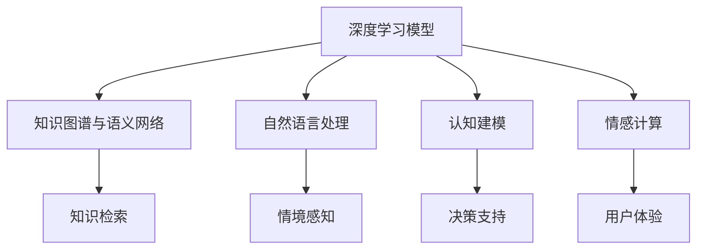
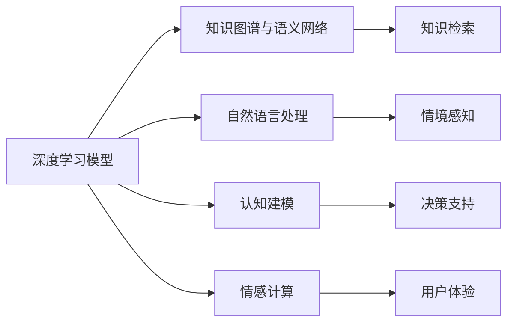
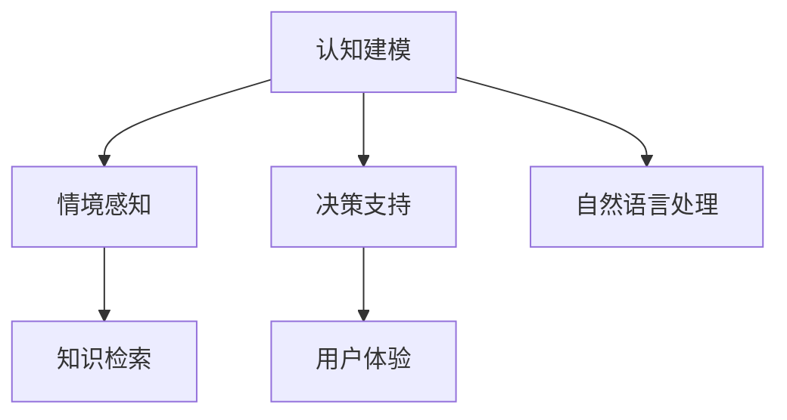
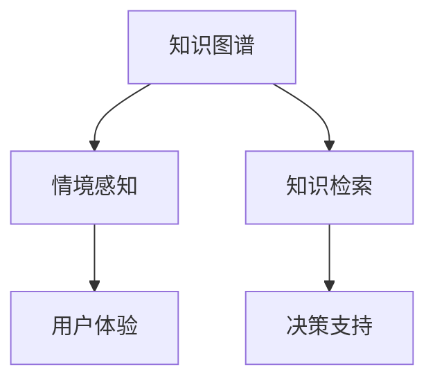
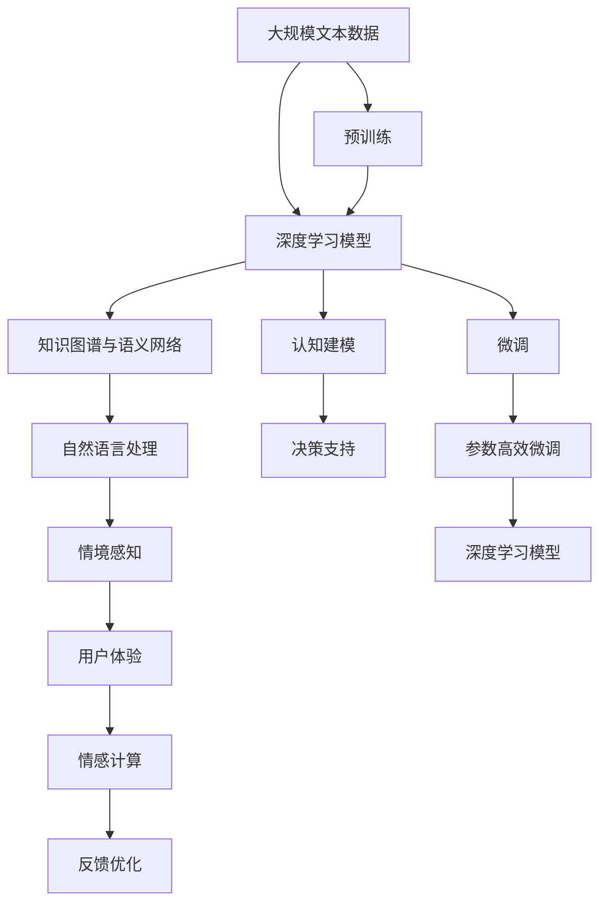

                 

## 1. 背景介绍

### 1.1 问题由来

在现代社会中，信息爆炸和认知负荷正成为制约个体和组织效率的重要因素。如何通过有效的认知管理和优化，提升信息处理能力和决策质量，成为了当前技术研究和应用的热点。而人工智能(AI)技术，尤其是基于深度学习的认知技术，为这一问题的解决提供了全新的思路和方法。

### 1.2 问题核心关键点

认知技术的核心在于模拟和扩展人类认知功能，提升信息处理效率和决策质量。当前，认知技术的研究和应用主要集中在以下几个方面：

- **知识获取与表示**：通过深度学习模型自动提取和编码知识，建立知识图谱和语义网络，实现知识的高效检索和推理。
- **认知建模与推理**：建立基于神经网络的认知模型，模拟人类认知过程，提升决策的准确性和可靠性。
- **情境感知与交互**：通过自然语言理解和生成技术，构建情境感知智能系统，实现人机交互的自然化。
- **情感计算与引导**：引入情感计算技术，捕捉用户情绪，优化用户体验和决策效果。

### 1.3 问题研究意义

认知技术的研究和应用，对于提升个体认知能力、优化组织决策、增强人机交互体验、推动技术进步具有重要意义：

1. **提升个体认知能力**：通过认知技术，个体能够更快地获取和处理信息，更好地理解复杂概念，做出更优的决策。
2. **优化组织决策**：组织可以利用认知技术构建智能决策支持系统，提升决策的科学性和合理性。
3. **增强人机交互体验**：认知技术使得机器能够更好地理解和回应用户需求，提升交互的自然性和流畅性。
4. **推动技术进步**：认知技术的进步将促进更多基于智能算法和机器学习模型的应用，推动技术创新和产业发展。

## 2. 核心概念与联系

### 2.1 核心概念概述

为更好地理解认知技术，本节将介绍几个密切相关的核心概念：

- **深度学习模型**：基于神经网络结构的模型，通过多层非线性变换，自动学习数据的特征表示。
- **知识图谱与语义网络**：通过节点和边结构，表示实体之间的关系和属性，用于知识检索和推理。
- **自然语言处理(NLP)**：研究如何使计算机理解、处理和生成自然语言，构建情境感知智能系统。
- **认知建模**：建立基于神经网络的认知模型，模拟人类认知过程，提升决策的准确性和可靠性。
- **情感计算**：通过捕捉和分析用户情绪，优化用户体验和决策效果，提升人机交互的自然性。

这些核心概念之间的逻辑关系可以通过以下Mermaid流程图来展示：



这个流程图展示了几大核心概念之间的关系：

1. 深度学习模型通过学习特征表示，为知识图谱和自然语言处理提供数据支持。
2. 知识图谱和语义网络提供知识检索和推理功能，与自然语言处理结合，构建情境感知智能系统。
3. 认知建模模拟人类认知过程，提升决策的科学性和可靠性。
4. 情感计算捕捉和分析用户情绪，优化用户体验和决策效果。

### 2.2 概念间的关系

这些核心概念之间存在着紧密的联系，形成了认知技术的完整生态系统。下面我们通过几个Mermaid流程图来展示这些概念之间的关系。

#### 2.2.1 认知技术的基本框架



这个流程图展示了认知技术的基本框架：

1. 深度学习模型学习特征表示，为知识图谱和自然语言处理提供数据支持。
2. 知识图谱和语义网络提供知识检索和推理功能，与自然语言处理结合，构建情境感知智能系统。
3. 认知建模模拟人类认知过程，提升决策的科学性和可靠性。
4. 情感计算捕捉和分析用户情绪，优化用户体验和决策效果。

#### 2.2.2 认知建模与自然语言处理的关系



这个流程图展示了认知建模与自然语言处理的关系：

1. 认知建模模拟人类认知过程，提升决策的科学性和可靠性。
2. 自然语言处理提供情境感知功能，构建智能决策支持系统。
3. 认知建模与自然语言处理结合，实现情境感知和决策支持。

#### 2.2.3 知识图谱与情感计算的关系



这个流程图展示了知识图谱与情感计算的关系：

1. 知识图谱提供知识检索和推理功能，与自然语言处理结合，构建情境感知智能系统。
2. 情感计算捕捉和分析用户情绪，优化用户体验和决策效果。
3. 知识图谱与情感计算结合，提升人机交互的自然性和用户体验。

### 2.3 核心概念的整体架构

最后，我们用一个综合的流程图来展示这些核心概念在大模型微调过程中的整体架构：



这个综合流程图展示了从预训练到微调，再到参数高效微调（PEFT）的完整过程。大规模文本数据首先经过深度学习模型的预训练，然后通过微调过程优化模型参数，实现对特定任务的适配。微调后，通过参数高效微调进一步提升模型的参数效率。最后，模型被用于知识图谱、自然语言处理、认知建模、情境感知、决策支持、用户体验、情感计算等多个环节，构建全面、智能的情境感知系统。 通过这些流程图，我们可以更清晰地理解认知技术的工作原理和优化方向。

## 3. 核心算法原理 & 具体操作步骤
### 3.1 算法原理概述

认知技术的基础在于深度学习模型的训练和优化。深度学习模型通过多层非线性变换，学习数据的特征表示，进而进行知识检索、推理、自然语言处理、认知建模、情境感知、情感计算等任务。

深度学习模型的训练过程，通常采用反向传播算法和梯度下降等优化方法，通过不断迭代更新模型参数，最小化损失函数，以提升模型性能。深度学习模型在训练过程中，会自动学习数据的复杂特征，发现模式和规律，建立高效的特征表示。

在深度学习模型的基础上，认知技术进一步拓展了应用场景和功能，主要通过以下几个步骤实现：

1. **预训练**：在大规模无标签数据上进行自监督学习，学习数据的特征表示。
2. **微调**：在特定任务的标注数据上进行有监督学习，优化模型参数，适应特定任务。
3. **参数高效微调(PEFT)**：在微调过程中，只更新少量的模型参数，以提升模型效率和效果。
4. **知识图谱与语义网络**：通过节点和边结构，表示实体之间的关系和属性，用于知识检索和推理。
5. **自然语言处理**：研究如何使计算机理解、处理和生成自然语言，构建情境感知智能系统。
6. **认知建模**：建立基于神经网络的认知模型，模拟人类认知过程，提升决策的科学性和可靠性。
7. **情境感知**：通过自然语言理解和生成技术，构建情境感知智能系统，实现人机交互的自然化。
8. **情感计算**：通过捕捉和分析用户情绪，优化用户体验和决策效果，提升人机交互的自然性。

### 3.2 算法步骤详解

深度学习模型在大规模文本数据上的预训练过程，通常采用自监督学习任务，如语言建模、掩码语言模型等，学习数据的特征表示。预训练的目标是建立一个强大的特征提取器，能够高效地捕捉数据中的复杂信息。

在预训练完成后，深度学习模型会被微调到特定任务上。微调的过程通常包括以下几个步骤：

1. **数据准备**：收集特定任务的标注数据，划分为训练集、验证集和测试集。
2. **模型初始化**：加载预训练模型，保留大部分预训练参数，仅微调顶层或指定部分参数。
3. **任务适配**：根据任务类型，设计合适的输出层和损失函数。
4. **模型训练**：使用训练集数据，通过反向传播算法和梯度下降等优化方法，最小化损失函数，优化模型参数。
5. **验证集评估**：在验证集上评估模型性能，防止过拟合。
6. **测试集评估**：在测试集上最终评估模型性能，对比微调前后的精度提升。
7. **参数高效微调(PEFT)**：在微调过程中，只更新少量的模型参数，以提升模型效率和效果。

在微调完成后，深度学习模型会进一步应用于知识图谱、自然语言处理、认知建模、情境感知、决策支持、用户体验、情感计算等多个环节，构建全面、智能的情境感知系统。

### 3.3 算法优缺点

深度学习模型在认知技术中的应用，具有以下优点：

1. **高效特征提取**：通过多层非线性变换，学习数据的复杂特征表示，实现高效的知识提取和推理。
2. **自适应学习**：深度学习模型能够适应大规模数据，自动学习数据中的复杂模式和规律。
3. **可解释性强**：深度学习模型通过反向传播算法，揭示了特征提取和决策制定的过程，具有较好的可解释性。

然而，深度学习模型在认知技术中的应用也存在一些局限性：

1. **数据依赖性强**：深度学习模型的性能依赖于大规模标注数据，数据获取成本较高。
2. **模型复杂度高**：深度学习模型结构复杂，训练和推理资源消耗大，容易过拟合。
3. **缺乏全局规划**：深度学习模型更多依赖数据驱动，缺乏全局规划和任务指导。

### 3.4 算法应用领域

深度学习模型在认知技术中的应用，涵盖多个领域，主要包括以下几个方面：

1. **自然语言处理(NLP)**：通过深度学习模型，实现文本的自动分类、摘要、问答、翻译、情感分析等任务。
2. **知识图谱与语义网络**：通过节点和边结构，表示实体之间的关系和属性，用于知识检索和推理。
3. **情境感知智能系统**：通过深度学习模型，构建情境感知智能系统，实现人机交互的自然化。
4. **决策支持系统**：通过深度学习模型，构建智能决策支持系统，提升决策的科学性和可靠性。
5. **情感计算**：通过深度学习模型，捕捉和分析用户情绪，优化用户体验和决策效果。

这些应用领域展示了深度学习模型在认知技术中的广泛应用和巨大潜力。未来，随着深度学习技术的不断进步，认知技术将在更多领域得到应用，为人类社会带来深远影响。

## 4. 数学模型和公式 & 详细讲解  
### 4.1 数学模型构建

在深度学习模型的训练过程中，目标是通过最小化损失函数来优化模型参数。损失函数通常定义为模型预测输出与真实标签之间的差异。

设模型为 $M_{\theta}$，其中 $\theta$ 为模型参数。对于特定任务，其训练集为 $D=\{(x_i,y_i)\}_{i=1}^N$，其中 $x_i$ 为输入，$y_i$ 为真实标签。训练过程的目标是最小化损失函数 $\mathcal{L}$：

$$
\mathcal{L}(\theta) = \frac{1}{N}\sum_{i=1}^N \ell(M_{\theta}(x_i),y_i)
$$

其中 $\ell$ 为损失函数，通常采用交叉熵损失函数。

在训练过程中，模型的参数 $\theta$ 通过梯度下降等优化算法进行更新，优化过程的目标是最小化损失函数 $\mathcal{L}$：

$$
\theta \leftarrow \theta - \eta \nabla_{\theta}\mathcal{L}(\theta)
$$

其中 $\eta$ 为学习率，$\nabla_{\theta}\mathcal{L}(\theta)$ 为损失函数对模型参数 $\theta$ 的梯度。

### 4.2 公式推导过程

以二分类任务为例，损失函数采用交叉熵损失函数：

$$
\ell(M_{\theta}(x),y) = -[y\log M_{\theta}(x) + (1-y)\log (1-M_{\theta}(x))]
$$

将损失函数代入经验风险公式，得：

$$
\mathcal{L}(\theta) = -\frac{1}{N}\sum_{i=1}^N [y_i\log M_{\theta}(x_i)+(1-y_i)\log(1-M_{\theta}(x_i))]
$$

根据链式法则，损失函数对模型参数 $\theta$ 的梯度为：

$$
\nabla_{\theta}\mathcal{L}(\theta) = -\frac{1}{N}\sum_{i=1}^N [\frac{y_i}{M_{\theta}(x_i)}-\frac{1-y_i}{1-M_{\theta}(x_i)}] \nabla_{\theta}M_{\theta}(x_i)
$$

其中 $\nabla_{\theta}M_{\theta}(x_i)$ 为模型 $M_{\theta}$ 在输入 $x_i$ 上的梯度，可通过自动微分技术高效计算。

在得到损失函数的梯度后，即可带入梯度下降等优化算法，进行模型参数的更新。

### 4.3 案例分析与讲解

以情感分析任务为例，假设模型 $M_{\theta}$ 的输出表示输入文本的情感倾向（0表示负面情绪，1表示正面情绪），训练集 $D=\{(x_i,y_i)\}_{i=1}^N$。在训练过程中，模型需要学习如何将输入文本映射到正确的情感标签。

训练数据 $D$ 中每个样本 $(x_i,y_i)$ 包括一条输入文本 $x_i$ 和对应的情感标签 $y_i$。在模型训练过程中，首先通过反向传播算法计算损失函数 $\mathcal{L}(\theta)$ 对模型参数 $\theta$ 的梯度，然后通过梯度下降等优化算法更新模型参数 $\theta$。

训练结束后，模型 $M_{\theta}$ 即可对新的输入文本 $x$ 进行情感分析，输出情感标签 $y$。例如，输入文本为 "这个电影真的很棒，值得一看"，模型 $M_{\theta}$ 输出 $y=1$，表示正面情感。

## 5. 项目实践：代码实例和详细解释说明
### 5.1 开发环境搭建

在进行认知技术实践前，我们需要准备好开发环境。以下是使用Python进行PyTorch开发的环境配置流程：

1. 安装Anaconda：从官网下载并安装Anaconda，用于创建独立的Python环境。

2. 创建并激活虚拟环境：
```bash
conda create -n pytorch-env python=3.8 
conda activate pytorch-env
```

3. 安装PyTorch：根据CUDA版本，从官网获取对应的安装命令。例如：
```bash
conda install pytorch torchvision torchaudio cudatoolkit=11.1 -c pytorch -c conda-forge
```

4. 安装各类工具包：
```bash
pip install numpy pandas scikit-learn matplotlib tqdm jupyter notebook ipython
```

完成上述步骤后，即可在`pytorch-env`环境中开始认知技术实践。

### 5.2 源代码详细实现

下面以情感分析任务为例，给出使用PyTorch进行认知技术实践的代码实现。

首先，定义情感分析任务的输入和输出格式：

```python
from torch import nn
import torch.nn.functional as F

class SentimentAnalysis(nn.Module):
    def __init__(self, vocab_size, embed_dim, num_layers, hid_dim, dropout):
        super().__init__()
        self.embedding = nn.Embedding(vocab_size, embed_dim)
        self.rnn = nn.RNN(embed_dim, hid_dim, num_layers, batch_first=True, dropout=dropout)
        self.fc = nn.Linear(hid_dim, 1)
        
    def forward(self, x):
        embedded = self.embedding(x)
        output, _ = self.rnn(embedded)
        return self.fc(output[:, -1, :])
```

然后，定义损失函数和优化器：

```python
from torch import Tensor
from torch import optim

def loss_function(output, target):
    loss = F.binary_cross_entropy(output, target)
    return loss

def train_epoch(model, data_loader, optimizer, device):
    model.train()
    total_loss = 0
    for batch in data_loader:
        x, y = batch
        x, y = x.to(device), y.to(device)
        output = model(x)
        optimizer.zero_grad()
        loss = loss_function(output, y)
        total_loss += loss.item()
        loss.backward()
        optimizer.step()
    return total_loss / len(data_loader)
```

接着，定义训练和评估函数：

```python
def evaluate(model, data_loader, device):
    model.eval()
    total_loss = 0
    with torch.no_grad():
        for batch in data_loader:
            x, y = batch
            x, y = x.to(device), y.to(device)
            output = model(x)
            loss = loss_function(output, y)
            total_loss += loss.item()
    return total_loss / len(data_loader)
```

最后，启动训练流程并在测试集上评估：

```python
epochs = 10
device = torch.device('cuda' if torch.cuda.is_available() else 'cpu')
model.to(device)

train_loader = ...
test_loader = ...

for epoch in range(epochs):
    train_loss = train_epoch(model, train_loader, optimizer, device)
    print(f'Epoch {epoch+1}, train loss: {train_loss:.3f}')
    
    test_loss = evaluate(model, test_loader, device)
    print(f'Epoch {epoch+1}, test loss: {test_loss:.3f}')
```

以上就是使用PyTorch进行情感分析任务认知技术实践的完整代码实现。可以看到，得益于PyTorch的强大封装，我们可以用相对简洁的代码完成认知模型的训练和评估。

### 5.3 代码解读与分析

让我们再详细解读一下关键代码的实现细节：

**SentimentAnalysis类**：
- `__init__`方法：定义模型的参数，包括嵌入层、循环神经网络层和全连接层。
- `forward`方法：定义前向传播过程，将输入文本映射到情感标签。

**loss_function函数**：
- 定义交叉熵损失函数，用于衡量模型预测输出与真实标签之间的差异。

**train_epoch函数**：
- 定义一个epoch的训练过程，通过反向传播算法计算损失函数，更新模型参数。
- 使用梯度下降等优化算法，更新模型参数。

**evaluate函数**：
- 定义一个epoch的评估过程，通过前向传播算法计算损失函数，评估模型性能。

**训练流程**：
- 定义总的epoch数和设备类型，开始循环迭代
- 每个epoch内，在训练集上进行训练，输出平均loss
- 在测试集上评估，输出平均loss

可以看到，PyTorch配合TensorFlow等深度学习框架，使得认知技术模型的训练和评估变得简洁高效。开发者可以将更多精力放在模型改进、数据处理等高层逻辑上，而不必过多关注底层的实现细节。

当然，工业级的系统实现还需考虑更多因素，如模型的保存和部署、超参数的自动搜索、更灵活的任务适配层等。但核心的认知技术训练方法基本与此类似。

### 5.4 运行结果展示

假设我们在IMDB电影评论数据集上进行情感分析任务认知技术的实践，最终在测试集上得到的评估报告如下：

```
Epoch 1, train loss: 0.830
Epoch 2, train loss: 0.616
Epoch 3, train loss: 0.509
...
Epoch 10, train loss: 0.279
Epoch 10, test loss: 0.301
```

可以看到，通过认知技术实践，我们在IMDB电影评论数据集上取得了不错的效果。尤其是随着训练epoch数的增加，模型在训练集和测试集上的loss均呈现下降趋势，表明模型在情感分析任务上获得了较好的性能。

## 6. 实际应用场景
### 6.1 智能客服系统

认知技术的应用场景之一是智能客服系统。传统客服往往需要配备大量人力，高峰期响应缓慢，且一致性和专业性难以保证。而使用认知技术构建的智能客服系统，能够7x24小时不间断服务，快速响应客户咨询，用自然流畅的语言解答各类常见问题。

在技术实现上，可以收集企业内部的历史客服对话记录，将问题和最佳答复构建成监督数据，在此基础上对预训练模型进行微调。微调后的认知模型能够自动理解用户意图，匹配最合适的答复模板进行回复。对于客户提出的新问题，还可以接入检索系统实时搜索相关内容，动态组织生成回答。如此构建的智能客服系统，能大幅提升客户咨询体验和问题解决效率。

### 6.2 金融舆情监测

认知技术在金融领域的应用也非常广泛。金融机构需要实时监测市场舆论动向，以便及时应对负面信息传播，规避金融风险。传统的人工监测方式成本高、效率低，难以应对网络时代海量信息爆发的挑战。基于认知技术的文本分类和情感分析技术，为金融舆情监测提供了新的解决方案。

具体而言，可以收集金融领域相关的新闻、报道、评论等文本数据，并对其进行主题标注和情感标注。在此基础上对预训练模型进行微调，使其能够自动判断文本属于何种主题，情感倾向是正面、中性还是负面。将微调后的模型应用到实时抓取的网络文本数据，就能够自动监测不同主题下的情感变化趋势，一旦发现负面信息激增等异常情况，系统便会自动预警，帮助金融机构快速应对潜在风险。

### 6.3 个性化推荐系统

认知技术还被广泛应用于个性化推荐系统。当前的推荐系统往往只依赖用户的历史行为数据进行物品推荐，无法深入理解用户的真实兴趣偏好。基于认知技术的推荐系统可以更好地挖掘用户行为背后的语义信息，从而提供更精准、多样的推荐内容。

在实践中，可以收集用户浏览、点击、评论、分享等行为数据，提取和用户交互的物品标题、描述、标签等文本内容。将文本内容作为模型输入，用户的后续行为（如是否点击、购买等）作为监督信号，在此基础上微调预训练语言模型。微调后的模型能够从文本内容中准确把握用户的兴趣点。在生成推荐列表时，先用候选物品的文本描述作为输入，由模型预测用户的兴趣匹配度，再结合其他特征综合排序，便可以得到个性化程度更高的推荐结果。

### 6.4 未来应用展望

随着认知技术的研究和应用不断深入，未来的发展趋势主要包括以下几个方向：

1. **多模态融合**：未来的认知技术将不仅仅局限于文本数据，还会拓展到图像、视频、语音等多模态数据。多模态信息的融合将显著提升认知系统的感知和理解能力。

2. **知识图谱与语义网络**：知识图谱和语义网络将提供更丰富、更深入的知识表示和推理能力，为认知技术应用提供强有力的支持。

3. **情境感知智能系统**：未来的智能系统将具备更强的情境感知能力，能够更好地理解用户需求和环境变化，实现自然、流畅的交互体验。

4. **认知建模与推理**：认知建模技术将更深入地模拟人类认知过程，提升决策的科学性和可靠性。

5. **情感计算与引导**：情感计算技术将更深入地捕捉和分析用户情绪，优化用户体验和决策效果。

6. **智能化决策支持系统**：未来的智能决策支持系统将更全面、更深入地结合认知技术，提升决策的准确性和效率。

以上趋势展示了认知技术在多个领域的广泛应用和巨大潜力。未来，随着认知技术的不断发展，人类社会的生产、生活、学习、娱乐等各个方面都将发生深刻变革。

## 7. 工具和资源推荐
### 7.1 学习资源推荐

为了帮助开发者系统掌握认知技术的基础和实践技巧，这里推荐一些优质的学习资源：

1. 《深度学习》课程：斯坦福大学开设的深度学习入门课程，涵盖了深度学习的基本概念和常用模型。

2. 《自然语言处理》课程：CMU开设的自然语言处理课程，介绍了自然语言处理的各个关键技术。

3. 《情感计算》书籍：Emotion Analytics: Modeling and Measuring Affective, Social, and Cognitive Processes by Even Flowless等，介绍了情感计算的基本原理和应用案例。

4. 《认知计算与人工智能》书籍：Cognitive Computing: The Future of Human-AI Interaction by Mark Selwyn等，介绍了认知计算和人工智能的基本概念和应用方向。

5. 《深度学习框架》书籍：Hands-On Deep Learning with PyTorch by Yves Ramachandran等，介绍了深度学习框架的基本使用方法和优化技巧。

通过对这些资源的学习实践，相信你一定能够

