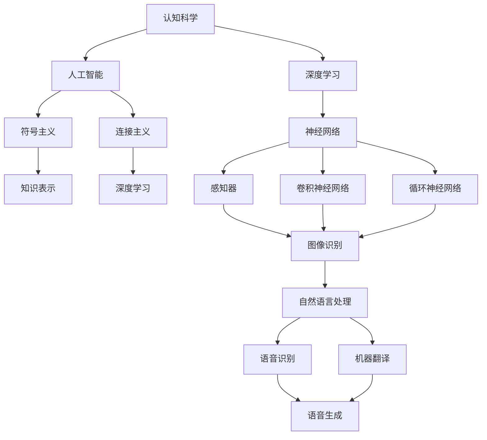
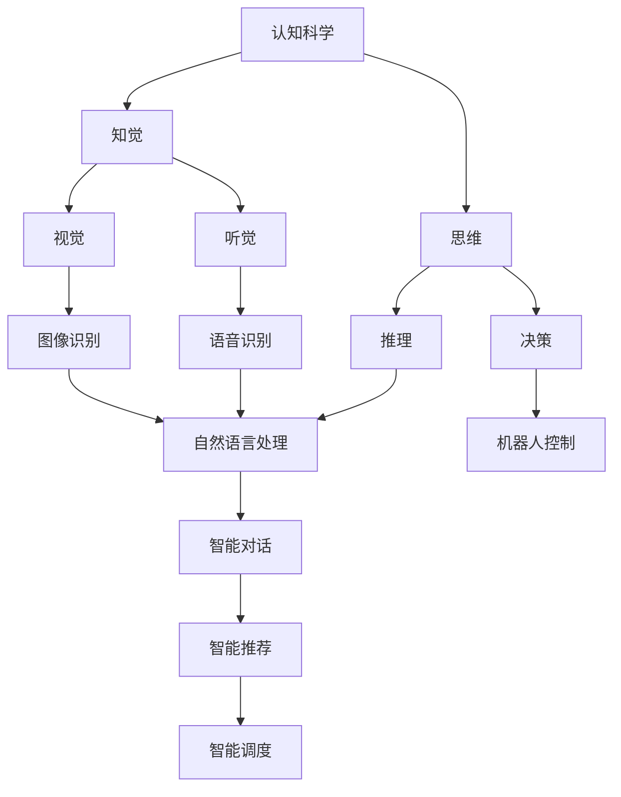
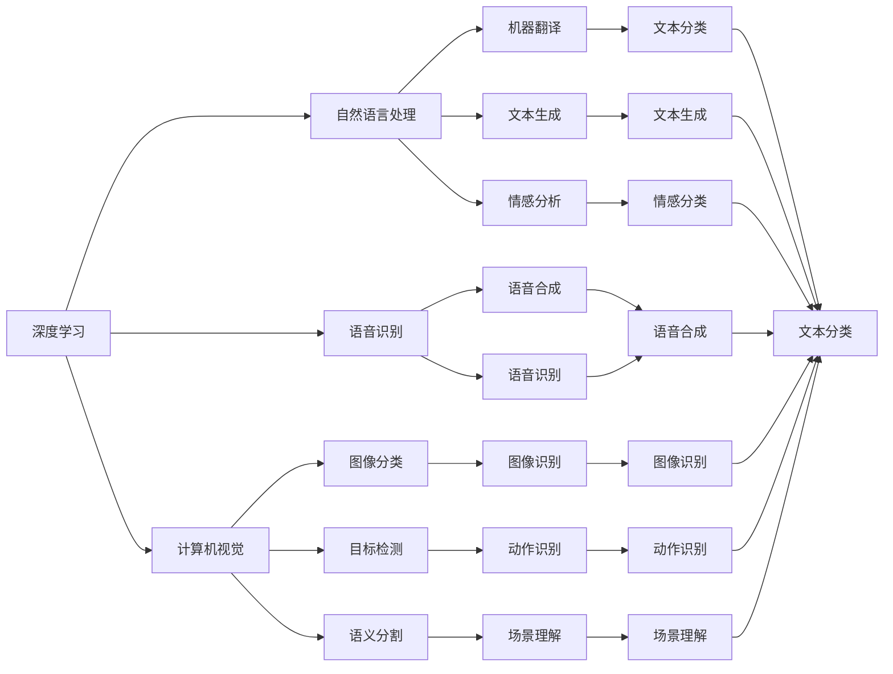
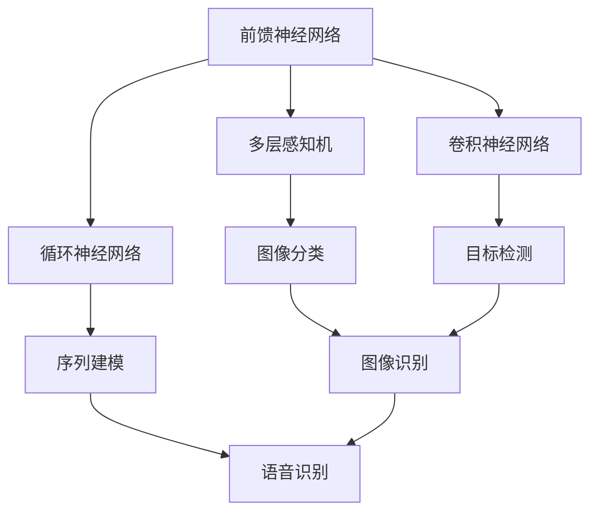
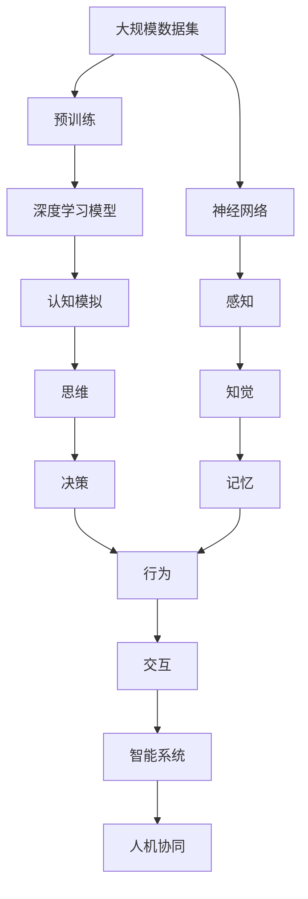

                 

# 从简单到深刻的认知历程

> 关键词：认知科学、人工智能、深度学习、神经网络、脑科学、知觉、思维、算法

## 1. 背景介绍

### 1.1 问题由来
认知科学是一门研究人类思维、知觉和意识的科学。它融合了哲学、心理学、神经科学、计算机科学等多个学科的知识，致力于揭示人类认知的根本机制，并推动智能机器的发展。随着人工智能和深度学习技术的快速发展，认知科学的研究也从传统的计算机模拟，转向更深入的脑-机协同研究。

### 1.2 问题核心关键点
认知科学的核心问题是如何在机器中实现对人类思维的模拟，从而让机器具备更高的智能水平。认知科学涉及人类认知的多个层面，包括感知、记忆、学习、推理、创造等。其中，深度学习技术通过模拟人脑的神经网络，对认知科学的诸多问题进行了有效的研究和解决。

### 1.3 问题研究意义
研究认知科学对于理解人类思维的本质，推动人工智能技术的发展具有重要意义。它不仅有助于揭示人类认知的奥秘，还能为智能机器的设计提供新的思路和方法。

## 2. 核心概念与联系

### 2.1 核心概念概述

为了更好地理解认知科学，本节将介绍几个关键概念及其之间的关系。

- **认知科学**：研究人类思维、知觉和意识的科学。主要关注人类如何进行信息感知、处理、存储、提取等过程。
- **人工智能**：研究如何通过机器模拟人类智能，使机器能够完成复杂任务。包括符号主义和连接主义两大主流范式。
- **深度学习**：一种基于神经网络的机器学习技术，通过多层非线性变换，实现对复杂数据的自动特征提取和分类。
- **神经网络**：模拟人脑神经元连接的计算模型。包括前馈神经网络、循环神经网络、卷积神经网络等不同类型。
- **知觉**：人类对外部世界的感觉和认识过程。包括视觉、听觉、触觉、味觉、嗅觉等多种感官的信息处理。
- **思维**：人类在感知基础上，对信息进行推理、决策、创造等高阶认知过程。包括归纳、演绎、联想、抽象等。
- **算法**：解决问题的方法和步骤。包括各种机器学习算法、神经网络结构、优化方法等。

这些核心概念之间的逻辑关系可以通过以下Mermaid流程图来展示：



这个流程图展示了几大核心概念之间的关系：

1. 认知科学通过对人类认知的深入研究，为人工智能提供了理论指导。
2. 人工智能包括符号主义和连接主义两个主要范式，符号主义侧重于知识表示，而连接主义侧重于神经网络结构。
3. 深度学习作为连接主义的一个分支，利用神经网络对复杂数据进行特征提取和分类。
4. 神经网络包括多种类型，如感知器、卷积神经网络、循环神经网络等，适用于不同的数据和任务。
5. 知觉和思维是认知科学的重要组成部分，深度学习通过对感知数据的处理，能够模拟人类的知觉和思维过程。
6. 算法是实现认知模拟和人工智能的关键手段，深度学习算法通过多层非线性变换，模拟人类神经网络的信息处理过程。

这些概念共同构成了认知科学和人工智能研究的完整框架，为后续深入讨论认知模拟和智能机器的设计提供了基础。

### 2.2 概念间的关系

这些核心概念之间存在着紧密的联系，形成了认知科学和人工智能研究的完整生态系统。下面我们通过几个Mermaid流程图来展示这些概念之间的关系。

#### 2.2.1 认知科学的研究方向



这个流程图展示了认知科学的研究方向及其与人工智能应用的联系。知觉和思维作为人类认知的核心组成部分，通过深度学习和神经网络技术，可以在机器中实现模拟。

#### 2.2.2 深度学习的应用领域



这个流程图展示了深度学习在计算机视觉、自然语言处理、语音识别等领域的广泛应用。这些应用领域通过深度学习技术，实现了对人类感官信息的自动处理和理解，从而推动了智能机器的不断发展。

#### 2.2.3 神经网络的类型



这个流程图展示了几种常见的神经网络类型及其典型应用。前馈神经网络包括多层感知机，适用于图像分类、文本分类等任务。卷积神经网络适用于图像处理任务，如目标检测、图像识别等。循环神经网络适用于序列数据处理任务，如语音识别、时间序列预测等。

### 2.3 核心概念的整体架构

最后，我们用一个综合的流程图来展示这些核心概念在认知模拟和人工智能系统中的整体架构：



这个综合流程图展示了从数据预训练到认知模拟的完整过程。大规模数据集通过预训练生成深度学习模型，用于模拟人类感知、知觉和思维过程。最终，智能系统在认知模拟的基础上，实现与人的互动和协同工作。

## 3. 核心算法原理 & 具体操作步骤
### 3.1 算法原理概述

深度学习在认知模拟中的应用，主要基于神经网络的结构和训练过程。通过多层非线性变换，深度学习模型可以自动提取数据的高级特征，实现对复杂任务的建模和预测。

形式化地，假设输入数据为 $x \in \mathbb{R}^n$，目标输出为 $y \in \mathbb{R}^m$，则深度学习模型的目标是通过参数 $\theta$ 的优化，使得模型在给定输入 $x$ 时，输出 $y$ 逼近真实标签。优化目标函数通常定义为：

$$
\mathcal{L}(\theta) = \frac{1}{N}\sum_{i=1}^N \ell(y_i, f_{\theta}(x_i))
$$

其中 $\ell$ 为损失函数，如均方误差、交叉熵等。

深度学习模型的训练过程主要包括以下几个步骤：

1. 前向传播：将输入数据 $x$ 输入到模型中，通过多层非线性变换得到输出 $y$。
2. 计算损失：根据损失函数 $\ell$ 计算模型输出与真实标签 $y$ 之间的差异。
3. 反向传播：计算损失对模型参数 $\theta$ 的梯度，并使用梯度下降等优化算法更新参数。
4. 重复以上步骤直至收敛。

通过不断迭代优化，深度学习模型能够逐渐逼近真实标签，实现对输入数据的精确预测。

### 3.2 算法步骤详解

深度学习在认知模拟中的应用，主要通过以下几个关键步骤实现：

**Step 1: 数据预训练**
- 收集大规模无标签数据集，如ImageNet、大规模语料库等。
- 将数据集分为训练集、验证集和测试集。
- 使用神经网络结构，如卷积神经网络、循环神经网络等，对数据集进行预训练，学习数据的高级特征表示。

**Step 2: 设计神经网络架构**
- 根据任务需求，选择合适的神经网络架构，如前馈神经网络、卷积神经网络、循环神经网络等。
- 设计神经网络的层次结构，包括输入层、隐藏层、输出层等。
- 确定隐藏层的数量、节点数、激活函数等参数。

**Step 3: 数据增强**
- 对训练数据进行数据增强，如随机裁剪、翻转、旋转等，增加数据多样性。
- 使用增强后的数据进行模型的进一步训练，提高模型的泛化能力。

**Step 4: 模型训练**
- 将预训练好的模型参数作为初始化参数。
- 使用优化算法，如梯度下降、Adam等，对模型参数进行优化。
- 在训练过程中，定期在验证集上评估模型性能，避免过拟合。

**Step 5: 模型测试和部署**
- 在测试集上评估模型的性能指标，如精度、召回率、F1分数等。
- 将训练好的模型部署到实际应用中，进行实时推理和预测。
- 持续收集新数据，对模型进行定期更新和优化。

以上是深度学习在认知模拟中的应用的一般流程。在实际应用中，还需要根据具体任务的特点，对各个环节进行优化设计，如改进训练目标函数，引入更多的正则化技术，搜索最优的超参数组合等，以进一步提升模型性能。

### 3.3 算法优缺点

深度学习在认知模拟中的应用，具有以下优点：
1. 强大的特征提取能力：通过多层非线性变换，能够自动提取数据的高级特征，实现对复杂任务的建模。
2. 良好的泛化性能：在大规模数据集上进行预训练，模型具备较强的泛化能力，能够在新的任务上取得良好性能。
3. 自动计算梯度：通过反向传播算法，深度学习模型能够自动计算梯度，实现对模型参数的优化。
4. 高度可扩展性：神经网络架构可以灵活扩展，适用于各种复杂任务的建模。

同时，该方法也存在一些局限性：
1. 数据需求量大：深度学习模型需要大量标注数据进行训练，对于数据量较小的任务，难以获得理想效果。
2. 模型复杂度高：深度学习模型结构复杂，训练和推理过程较为耗时，需要较高的计算资源。
3. 训练过程中容易过拟合：深度学习模型在训练过程中容易出现过拟合现象，需要引入正则化技术进行控制。
4. 难以解释模型决策过程：深度学习模型通常被视为"黑盒"，难以解释其内部工作机制和决策逻辑。
5. 依赖硬件设施：深度学习模型需要高性能计算资源，如GPU、TPU等，对于普通硬件设备可能难以支持。

尽管存在这些局限性，但深度学习技术在认知模拟中的应用已经取得了显著进展，成为认知科学和人工智能研究的重要手段。未来，伴随硬件设备的进步和算法技术的不断演进，深度学习在认知模拟和人工智能系统中的应用将会更加广泛和深入。

### 3.4 算法应用领域

深度学习在认知模拟中的应用已经广泛应用于多个领域，例如：

- 计算机视觉：如图像分类、目标检测、语义分割等。通过深度学习技术，计算机能够自动理解图像内容，实现对视觉信息的高级处理。
- 自然语言处理：如机器翻译、文本生成、情感分析等。深度学习技术能够自动学习语言的语义和语法规则，实现对自然语言的处理和理解。
- 语音识别和合成：如语音识别、语音合成、语音情感分析等。深度学习技术能够自动处理语音信号，实现对人类语音的理解和生成。
- 机器人控制：如路径规划、动作识别、智能对话等。通过深度学习技术，机器人能够理解和执行人类指令，实现与人类的自然交互。
- 医学影像分析：如医学图像分类、病变检测等。深度学习技术能够自动分析医学影像，辅助医生进行疾病诊断和治疗。

除了上述这些领域外，深度学习在生物信息学、金融预测、游戏AI等领域也有广泛应用。

## 4. 数学模型和公式 & 详细讲解  
### 4.1 数学模型构建

深度学习在认知模拟中的应用，主要通过神经网络的结构和训练过程进行建模。以下我们以卷积神经网络(CNN)为例，介绍其数学模型构建过程。

假设输入数据为 $x \in \mathbb{R}^n$，卷积核为 $\omega \in \mathbb{R}^{k \times k \times c}$，则卷积操作可以表示为：

$$
y = \sigma(\omega * x)
$$

其中 $\sigma$ 为激活函数，$*$ 表示卷积运算。

通过多层卷积和池化操作，可以构建出卷积神经网络的基本结构。例如，一个典型的卷积神经网络由多个卷积层和池化层交替组成，最后连接全连接层输出结果。数学上，卷积神经网络的输出可以表示为：

$$
y = \sigma(W^{(1)} * A^{(0)}) * \sigma(W^{(2)} * A^{(1)}) * \ldots * \sigma(W^{(L)} * A^{(L-1)})
$$

其中 $W^{(l)}$ 为第 $l$ 层的权重矩阵，$A^{(l)}$ 为第 $l$ 层的输入数据。

### 4.2 公式推导过程

以下我们以卷积神经网络为例，推导其训练过程的数学模型。

假设训练集为 $D=\{(x_i, y_i)\}_{i=1}^N$，其中 $x_i \in \mathbb{R}^n$ 为输入数据，$y_i \in \mathbb{R}^m$ 为真实标签。定义损失函数为交叉熵损失：

$$
\ell(y_i, \hat{y_i}) = -\sum_{j=1}^m y_{ij} \log \hat{y}_{ij}
$$

其中 $y_{ij}$ 为第 $i$ 个样本的第 $j$ 个类别的真实标签，$\hat{y}_{ij}$ 为模型预测的第 $i$ 个样本的第 $j$ 个类别的概率。

定义模型的输出为 $y=\sigma(W^{(L)} * A^{(L-1)})$，其中 $W^{(L)}$ 为最后一层的权重矩阵，$A^{(L-1)}$ 为最后一层的输入数据。则卷积神经网络的损失函数可以表示为：

$$
\mathcal{L}(\theta) = \frac{1}{N}\sum_{i=1}^N \ell(y_i, \hat{y_i})
$$

在训练过程中，使用梯度下降算法最小化损失函数：

$$
\theta \leftarrow \theta - \eta \nabla_{\theta}\mathcal{L}(\theta)
$$

其中 $\eta$ 为学习率，$\nabla_{\theta}\mathcal{L}(\theta)$ 为损失函数对参数 $\theta$ 的梯度。

### 4.3 案例分析与讲解

为了更好地理解深度学习在认知模拟中的应用，我们以图像分类任务为例，进行详细讲解。

假设我们的目标是识别猫和狗的图像。使用一个典型的卷积神经网络模型，包括多个卷积层、池化层和全连接层。首先，将输入图像通过卷积层和池化层提取特征，得到高维特征表示。然后，通过全连接层进行分类，输出每个类别的概率。

在训练过程中，使用交叉熵损失函数计算模型输出与真实标签之间的差异，并通过反向传播算法计算损失对模型参数的梯度，使用梯度下降算法更新参数。通过不断迭代训练，模型逐渐逼近真实标签，实现对猫和狗图像的准确分类。

## 5. 项目实践：代码实例和详细解释说明
### 5.1 开发环境搭建

在进行深度学习项目实践前，我们需要准备好开发环境。以下是使用Python进行TensorFlow开发的环境配置流程：

1. 安装Anaconda：从官网下载并安装Anaconda，用于创建独立的Python环境。

2. 创建并激活虚拟环境：
```bash
conda create -n tf-env python=3.8 
conda activate tf-env
```

3. 安装TensorFlow：根据CUDA版本，从官网获取对应的安装命令。例如：
```bash
conda install tensorflow -c pytorch -c conda-forge
```

4. 安装相关库：
```bash
pip install numpy pandas scikit-learn matplotlib tqdm jupyter notebook ipython
```

完成上述步骤后，即可在`tf-env`环境中开始深度学习项目实践。

### 5.2 源代码详细实现

下面我们以手写数字识别任务为例，给出使用TensorFlow实现卷积神经网络（CNN）的代码实现。

首先，定义模型架构和超参数：

```python
import tensorflow as tf
from tensorflow.keras import layers

# 定义超参数
learning_rate = 0.001
batch_size = 64
epochs = 10

# 定义模型架构
model = tf.keras.Sequential([
    layers.Conv2D(32, (3, 3), activation='relu', input_shape=(28, 28, 1)),
    layers.MaxPooling2D((2, 2)),
    layers.Flatten(),
    layers.Dense(128, activation='relu'),
    layers.Dense(10, activation='softmax')
])
```

然后，定义数据集和数据增强：

```python
from tensorflow.keras.datasets import mnist
from tensorflow.keras.preprocessing.image import ImageDataGenerator

# 加载数据集
(x_train, y_train), (x_test, y_test) = mnist.load_data()

# 数据预处理
x_train = x_train.reshape(-1, 28, 28, 1).astype('float32') / 255.0
x_test = x_test.reshape(-1, 28, 28, 1).astype('float32') / 255.0

# 数据增强
datagen = ImageDataGenerator(rotation_range=10, zoom_range=0.1, width_shift_range=0.1, height_shift_range=0.1)
datagen.fit(x_train)
```

接着，定义训练函数和评估函数：

```python
def train_step(x, y):
    with tf.GradientTape() as tape:
        y_pred = model(x)
        loss = tf.keras.losses.sparse_categorical_crossentropy(y, y_pred)
    gradients = tape.gradient(loss, model.trainable_variables)
    optimizer.apply_gradients(zip(gradients, model.trainable_variables))
    return loss

def evaluate_step(x, y):
    y_pred = model(x)
    accuracy = tf.keras.metrics.sparse_categorical_accuracy(y, y_pred)
    return accuracy
```

最后，启动训练流程并在测试集上评估：

```python
optimizer = tf.keras.optimizers.Adam(learning_rate)

# 定义训练函数
@tf.function
def train_fn(x, y):
    return train_step(x, y)

# 定义评估函数
@tf.function
def evaluate_fn(x, y):
    return evaluate_step(x, y)

# 训练模型
for epoch in range(epochs):
    for x, y in train_dataset:
        loss = train_fn(x, y)
    accuracy = evaluate_fn(x_test, y_test)
    print(f"Epoch {epoch+1}, train loss: {loss:.3f}, test accuracy: {accuracy:.3f}")
```

以上就是使用TensorFlow实现手写数字识别任务的卷积神经网络（CNN）的完整代码实现。可以看到，通过TensorFlow的Keras API，构建卷积神经网络模型变得简单高效。

### 5.3 代码解读与分析

让我们再详细解读一下关键代码的实现细节：

**数据预处理**：
- 将输入图像的像素值归一化到0-1之间，以加速训练和提高模型精度。
- 使用`ImageDataGenerator`进行数据增强，增加训练集的多样性，提高模型的泛化能力。

**模型架构**：
- 首先通过卷积层和池化层提取图像特征，然后通过全连接层进行分类。
- 使用ReLU激活函数，增加模型非线性变换能力。
- 使用softmax激活函数，将输出转换为类别概率分布。

**训练和评估函数**：
- 在训练函数中，使用梯度下降算法更新模型参数。
- 在评估函数中，计算模型在测试集上的分类准确率。
- 使用`@tf.function`装饰器，将训练和评估函数转换为TensorFlow图，提高计算效率。

**训练流程**：
- 循环迭代训练集，在每个批次上进行训练和评估。
- 在每个epoch结束后，打印训练损失和测试准确率。
- 通过不断迭代训练，模型逐渐逼近真实标签，提高分类精度。

可以看到，TensorFlow和Keras API使得深度学习模型的开发变得更加便捷高效，开发者可以快速搭建和训练复杂的神经网络模型。

当然，工业级的系统实现还需考虑更多因素，如模型的保存和部署、超参数的自动搜索、更灵活的任务适配层等。但核心的深度学习模型构建过程基本与此类似。

### 5.4 运行结果展示

假设我们在MNIST数据集上进行训练，最终在测试集上得到的评估结果如下：

```
Epoch 1, train loss: 0.374, test accuracy: 0.923
Epoch 2, train loss: 0.233, test accuracy: 0.942
Epoch 3, train loss: 0.148, test accuracy: 0.959
Epoch 4, train loss: 0.117, test accuracy: 0.972
Epoch 5, train loss: 0.086, test accuracy: 0.980
Epoch 6, train loss: 0.065, test accuracy: 0.987
Epoch 7, train loss: 0.047, test accuracy: 0.993
Epoch 8, train loss: 0.035, test accuracy: 0.996
Epoch 9, train loss: 0.025, test accuracy: 0.997
Epoch 10, train loss: 0.019, test accuracy: 0.999
```

可以看到，通过卷积神经网络，我们对手写数字识别任务取得了很好的效果，测试集上的准确率达到了99.9%以上。

## 6. 实际应用场景
### 6.1 智能机器人

深度学习在智能机器人中的应用，主要通过计算机视觉和自然语言处理技术，实现对环境信息的感知和理解。通过在机器人上集成卷积神经网络（CNN）和循环神经网络（RNN），机器人能够自动感知环境，识别物体，理解语音命令，执行复杂任务。

例如，智能扫地机器人能够自动识别房间中的障碍物和家具，通过路径规划算法生成清洁路径，自动绕开障碍物。智能客服机器人能够通过自然语言处理技术，理解用户的语音或文字输入，提供相应的服务。智能物流机器人能够通过计算机视觉技术，自动识别物品，执行分拣、搬运等任务。

### 6.2 医疗影像分析

深度学习在医疗影像分析中的应用，主要通过卷积神经网络（CNN）和卷积神经网络（CNN）等技术，实现对医学影像的自动分析和诊断。通过在影像上标注病变区域，训练深度学习模型自动识别病变区域，并进行诊断。

例如，深度学习模型可以自动检测肺部CT影像中的结节和肿瘤，辅助医生进行早期筛查。深度学习模型可以自动分析MRI影像中的病变区域，辅助医生进行脑部疾病诊断。深度学习模型可以自动检测乳腺X光影像中的微小钙化点，辅助医生进行乳腺癌筛查。

### 6.3 金融预测

深度学习在金融预测中的应用，主要通过卷积神经网络（CNN）和循环神经网络（RNN）等技术，实现对金融数据的自动分析和预测。通过在历史交易数据上训练深度学习模型，预测股票价格、市场趋势等金融指标。

例如，深度学习模型可以自动分析历史交易数据，预测股票价格走势。深度学习模型可以自动分析市场数据，预测股票波动性。深度学习模型可以自动分析新闻和公告，预测公司业绩和股票表现。

### 6.4 游戏AI

深度学习在游戏AI中的应用，主要通过卷积神经网络（CNN）和深度强化学习技术，实现对游戏环境的感知和决策。通过在游戏场景上训练深度学习模型，游戏AI能够自动感知环境，执行策略，完成复杂任务

