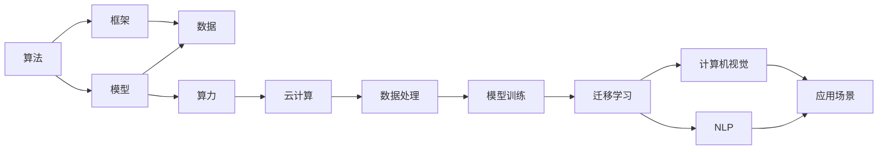

                 

## 1. 背景介绍

人工智能(AI)技术正迅速改变着我们的生活和工作方式。从自动驾驶到智能推荐，从语音识别到图像处理，AI的应用已经渗透到社会的各个角落。然而，尽管AI技术的进步令人瞩目，但许多人对其背后的核心原理和运行机制仍感到陌生。本文将通过“从算法到算力”的全景视角，深入剖析AI技术的发展脉络，探讨其核心原理、具体应用以及面临的挑战，旨在帮助读者理解AI技术的本质，并激发对其未来发展的思考。

## 2. 核心概念与联系

### 2.1 核心概念概述

- **算法(Algorithm)**：人工智能的核心在于算法。算法是解决问题的详细步骤，它定义了机器学习模型如何处理数据和生成输出。从线性回归到深度学习，从强化学习到对抗网络，算法的多样性和复杂性反映了AI技术的广泛应用。

- **算力(Computational Power)**：算力是指用于计算和处理数据的硬件资源。从CPU到GPU，从TPU到FPGA，算力的提升为复杂算法提供了实现基础，使得AI技术得以从理论走向实际。

- **数据(Data)**：数据是AI技术的“原材料”。无论是监督学习、无监督学习还是强化学习，数据的质量和数量直接影响了模型的性能。

- **模型(Model)**：模型是算法在特定任务上的具体实现。从简单的线性回归到复杂的神经网络，模型结构的多样性使得AI技术能够应对各种不同类型的问题。

- **框架(Framework)**：框架是一组工具和库，旨在简化模型的开发和部署。如TensorFlow、PyTorch、Keras等，它们提供了高效的数据处理、模型构建和训练能力。

- **云计算(Cloud Computing)**：云计算提供了可扩展的计算资源和存储服务，使得AI技术的开发和应用更加灵活和高效。

- **深度学习(Deep Learning)**：深度学习是一种基于神经网络的算法，能够自动提取数据的高级特征，是当前AI技术中最具代表性的一部分。

- **迁移学习(Transfer Learning)**：迁移学习是指利用已有知识来解决新问题的技术，能够有效减少新问题的标注数据需求，提高模型的泛化能力。

- **自然语言处理(Natural Language Processing, NLP)**：NLP是AI技术的一个重要分支，旨在使计算机能够理解、处理和生成人类语言。

- **计算机视觉(Computer Vision)**：计算机视觉是AI技术中的另一重要分支，涉及图像和视频数据的理解和分析。

这些核心概念构成了AI技术的基础，相互之间存在着紧密的联系和相互作用，共同推动了AI技术的发展。

### 2.2 核心概念的关系

以下是一个Mermaid流程图，展示了核心概念之间的关系：



这个流程图展示了AI技术的核心概念及其相互关系：

1. 算法是模型的基础，模型则是算法在特定任务上的具体实现。
2. 框架提供了模型开发的工具和库，加速了模型的构建和训练。
3. 数据是模型的输入，算力则是模型的计算资源。
4. 云计算提供了可扩展的计算资源，使得模型的训练和应用更加高效。
5. 迁移学习、NLP和计算机视觉等技术都是AI技术的核心分支，为不同应用场景提供了具体的解决方案。
6. 应用场景则是AI技术的最终目标，各种技术手段最终是为了解决实际问题。

## 3. 核心算法原理 & 具体操作步骤

### 3.1 算法原理概述

AI算法的核心在于通过数据训练模型，使其能够对新数据进行预测或决策。这一过程包括数据预处理、模型训练、模型评估和模型部署等步骤。

- **数据预处理**：数据预处理包括数据清洗、特征提取和归一化等步骤，目的是提高数据质量和一致性，为模型训练提供良好的输入。

- **模型训练**：模型训练是AI算法的核心步骤，通过反向传播等技术，模型在训练数据上进行优化，学习到数据中的特征和规律。

- **模型评估**：模型评估用于衡量模型在新数据上的表现，包括准确率、召回率、F1分数等指标。

- **模型部署**：模型部署将训练好的模型应用到实际场景中，提供预测或决策服务。

### 3.2 算法步骤详解

以下是一个典型的AI算法执行流程，以深度学习为例：

1. **数据收集与预处理**：收集与任务相关的数据，进行清洗、标注和预处理。

2. **模型选择与构建**：选择适合的深度学习模型，如卷积神经网络(CNN)、循环神经网络(RNN)、变压器(Transformer)等，并进行模型构建。

3. **模型训练**：使用训练数据对模型进行优化，通常使用随机梯度下降(SGD)等优化算法。

4. **模型评估**：使用测试数据对模型进行评估，计算各种性能指标。

5. **模型调整**：根据评估结果调整模型结构、超参数等，进行模型微调或重训练。

6. **模型部署**：将训练好的模型部署到实际应用中，提供预测或决策服务。

### 3.3 算法优缺点

深度学习的优点包括：

- **自动特征提取**：深度学习能够自动学习数据的高级特征，无需人工干预。
- **泛化能力强**：深度学习模型在大规模数据上的泛化能力较强，能够适应复杂的数据分布。

但深度学习也存在以下缺点：

- **计算资源需求高**：深度学习模型通常参数量大，需要大量计算资源进行训练。
- **模型解释性差**：深度学习模型常被视为“黑盒”，难以解释其内部工作机制。
- **过拟合风险高**：深度学习模型容易过拟合，尤其是在数据量较小的情况下。

### 3.4 算法应用领域

AI算法在各个领域都有广泛的应用：

- **医疗**：AI算法在医学影像分析、疾病预测、个性化治疗等领域有重要应用。
- **金融**：AI算法在股票预测、风险管理、客户行为分析等方面有显著效果。
- **自动驾驶**：AI算法在自动驾驶车辆的位置感知、路径规划、决策等方面发挥着重要作用。
- **推荐系统**：AI算法在电商、新闻、社交网络等领域的推荐系统中有广泛应用。
- **智能家居**：AI算法在智能音箱、智能灯光、智能安防等方面提高了家居设备的智能化水平。

## 4. 数学模型和公式 & 详细讲解 & 举例说明

### 4.1 数学模型构建

以下是一个简单的线性回归数学模型：

$$y = \theta_0 + \theta_1x_1 + \theta_2x_2 + \cdots + \theta_nx_n + \epsilon$$

其中，$y$ 是输出，$x_i$ 是输入特征，$\theta_i$ 是模型参数，$\epsilon$ 是噪声。

### 4.2 公式推导过程

线性回归的公式推导过程如下：

1. 最小二乘法：求解使预测值与真实值之间的差异平方和最小的模型参数。
2. 正则化：添加L2正则项，防止模型过拟合。
3. 梯度下降：通过反向传播计算梯度，更新模型参数。

### 4.3 案例分析与讲解

以深度学习中的卷积神经网络(CNN)为例，CNN在图像识别任务中表现出色。CNN的核心在于卷积层和池化层，通过这些层可以有效地提取图像中的局部特征。

## 5. 项目实践：代码实例和详细解释说明

### 5.1 开发环境搭建

要搭建深度学习项目，需要以下环境：

1. Python 3.x：深度学习框架大多基于Python实现。
2. GPU/TPU：训练深度学习模型需要高性能的计算资源。
3. TensorFlow或PyTorch：流行的深度学习框架，提供了丰富的API和工具。
4. Jupyter Notebook：交互式编程环境，方便调试和展示结果。

### 5.2 源代码详细实现

以下是一个简单的深度学习模型实现：

```python
import tensorflow as tf

# 定义模型结构
model = tf.keras.Sequential([
    tf.keras.layers.Dense(64, activation='relu', input_shape=(784,)),
    tf.keras.layers.Dense(10, activation='softmax')
])

# 编译模型
model.compile(optimizer='adam', loss='categorical_crossentropy', metrics=['accuracy'])

# 训练模型
model.fit(x_train, y_train, epochs=10, batch_size=32, validation_data=(x_test, y_test))

# 评估模型
test_loss, test_acc = model.evaluate(x_test, y_test)

print('Test accuracy:', test_acc)
```

### 5.3 代码解读与分析

这段代码中，我们使用了TensorFlow搭建了一个简单的全连接神经网络，用于手写数字识别。首先定义了模型结构，包括一个隐藏层和一个输出层。然后编译模型，选择了Adam优化器和交叉熵损失函数。接下来，使用训练数据对模型进行训练，并在测试数据上进行评估。

### 5.4 运行结果展示

训练完毕后，我们可以使用测试数据对模型进行评估，输出模型的准确率。

## 6. 实际应用场景

### 6.1 智能医疗

AI在医疗领域有广泛的应用，包括医学影像分析、疾病预测、个性化治疗等。例如，AI算法可以通过分析医学影像，识别出肿瘤、心脏病等疾病，提供早期诊断和治疗建议。

### 6.2 金融科技

AI在金融领域可以用于股票预测、风险管理、客户行为分析等。例如，AI算法可以分析市场数据，预测股票价格变化，帮助投资者做出更明智的投资决策。

### 6.3 自动驾驶

AI在自动驾驶领域中用于车辆的位置感知、路径规划、决策等方面。例如，AI算法可以识别道路标志、车辆、行人等，生成车辆的导航路径。

### 6.4 推荐系统

AI在推荐系统中有广泛应用，如电商、新闻、社交网络等。例如，AI算法可以根据用户的浏览历史、购买记录等数据，推荐用户可能感兴趣的商品或内容。

### 6.5 智能家居

AI在智能家居中用于控制灯光、安防、娱乐设备等。例如，AI算法可以根据用户的语音指令，控制智能音箱、智能灯光等设备。

## 7. 工具和资源推荐

### 7.1 学习资源推荐

1. 《深度学习》by Ian Goodfellow：全面介绍了深度学习的原理和实践。
2. Coursera 的深度学习课程：由斯坦福大学Andrew Ng教授主讲，讲解了深度学习的基础理论和应用。
3. GitHub深度学习项目：包含大量的深度学习代码和模型，可以参考学习。

### 7.2 开发工具推荐

1. TensorFlow：Google开发的深度学习框架，提供丰富的API和工具。
2. PyTorch：Facebook开发的深度学习框架，易用性高，适合研究和开发。
3. Jupyter Notebook：交互式编程环境，方便调试和展示结果。

### 7.3 相关论文推荐

1. AlexNet：ImageNet大规模视觉识别竞赛的冠军模型，开创了深度学习的先河。
2. AlphaGo：Google DeepMind开发的围棋AI，展示了深度学习在策略博弈中的潜力。
3. GPT-3：OpenAI开发的语言生成模型，展示了深度学习在自然语言处理中的应用。

## 8. 总结：未来发展趋势与挑战

### 8.1 研究成果总结

AI技术在过去几年中取得了显著进展，推动了各个行业的变革。深度学习、自然语言处理、计算机视觉等技术已经得到了广泛应用，带来了巨大的商业价值。

### 8.2 未来发展趋势

未来AI技术将呈现以下几个趋势：

1. **自监督学习**：自监督学习通过无标注数据训练模型，能够减少标注数据的需求，提高模型的泛化能力。
2. **迁移学习**：迁移学习能够利用已有知识解决新问题，减少新问题的标注数据需求，提高模型的泛化能力。
3. **小样本学习**：小样本学习通过在少量标注数据上进行训练，能够快速适应新问题，提高模型的泛化能力。
4. **联邦学习**：联邦学习通过分布式训练，能够在保护隐私的前提下，利用多方的数据进行模型训练。
5. **知识图谱**：知识图谱通过建立实体之间的关系，提供结构化的知识，帮助AI模型更好地理解复杂问题。

### 8.3 面临的挑战

AI技术在快速发展的同时，也面临着以下挑战：

1. **数据隐私**：AI模型需要大量的数据进行训练，数据隐私和安全问题亟需解决。
2. **算法透明性**：AI算法的黑盒特性带来了透明度问题，需要更可解释的AI模型。
3. **伦理道德**：AI技术的应用带来了伦理道德问题，如就业替代、数据偏见等，需要建立相应的伦理规范。

### 8.4 研究展望

未来AI技术需要在这几个方面进行深入研究：

1. **数据隐私保护**：研究如何保护用户数据隐私，防止数据泄露和滥用。
2. **算法透明性**：研究如何设计更可解释的AI模型，提高算法的透明性和可理解性。
3. **伦理道德规范**：建立AI技术的伦理道德规范，确保AI技术的应用符合社会价值观和伦理道德。
4. **多模态融合**：研究如何融合不同模态的数据，提升AI系统的综合能力。
5. **跨领域应用**：研究AI技术在不同领域的应用，推动AI技术的广泛应用。

## 9. 附录：常见问题与解答

**Q1：深度学习模型如何避免过拟合？**

A: 深度学习模型可以通过以下方法避免过拟合：

- 数据增强：通过对训练数据进行扩充，如旋转、翻转、缩放等，增加数据的多样性。
- 正则化：使用L1、L2正则化、Dropout等技术，限制模型的复杂度。
- 早期停止：在验证集上监测模型性能，当性能不再提升时停止训练。
- 批标准化：对每个批次的数据进行标准化，提高模型的泛化能力。

**Q2：深度学习模型的训练时间如何优化？**

A: 深度学习模型的训练时间可以通过以下方法优化：

- 使用GPU/TPU等高性能计算资源，加速训练过程。
- 使用模型并行、数据并行等技术，提高计算效率。
- 使用小批量梯度下降、梯度累积等策略，减少内存占用。
- 使用混合精度训练，加速计算过程。

**Q3：什么是迁移学习？**

A: 迁移学习是指利用已有知识来解决新问题的技术。它通过在源任务上训练模型，然后将模型应用于目标任务，减少目标任务标注数据的需求，提高模型的泛化能力。

**Q4：深度学习模型如何解释内部工作机制？**

A: 深度学习模型通常被视为黑盒，难以解释其内部工作机制。一种解决方案是通过可视化技术，如梯度可视化、激活可视化等，帮助理解模型的决策过程。此外，研究者也在探索如何设计更可解释的模型结构，如可解释神经网络(Interpretable Neural Networks)等。

**Q5：深度学习模型的应用前景如何？**

A: 深度学习模型在各个领域都有广泛的应用前景。例如，在医疗领域，深度学习可以用于医学影像分析、疾病预测等；在金融领域，深度学习可以用于股票预测、风险管理等；在自动驾驶领域，深度学习可以用于车辆的位置感知、路径规划等。未来，深度学习技术将进一步扩展其应用范围，推动各个行业的数字化转型升级。

