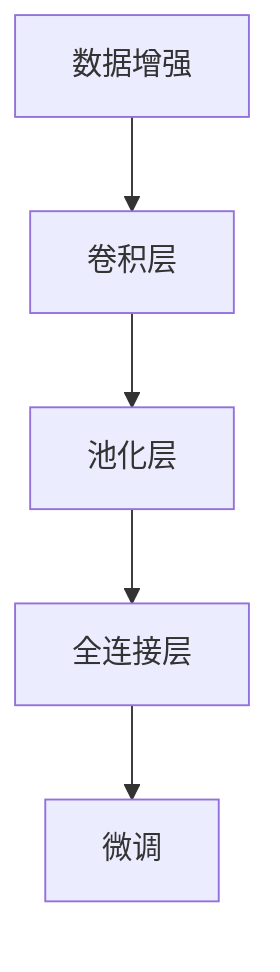

                 

# 从零开始大模型开发与微调：PyTorch中的卷积函数实现详解

> 关键词：卷积神经网络, 大模型, PyTorch, 卷积函数, 图像识别, 数据增强, 卷积层, 池化层, 深度学习, 微调

## 1. 背景介绍

在深度学习领域，卷积神经网络(Convolutional Neural Networks, CNNs)因在图像识别、语音识别等计算机视觉任务中表现优异而备受瞩目。近年来，随着预训练大模型如BERT和GPT的横空出世，学者们开始思考如何将大模型和卷积神经网络相结合，构建更加强大的大模型。PyTorch作为一种灵活高效的深度学习框架，提供了丰富的卷积函数，使得大模型开发与卷积神经网络的集成变得简单。本文将从零开始介绍如何在PyTorch中实现卷积函数，并进一步探讨如何将卷积函数融入大模型，并进行微调优化。

## 2. 核心概念与联系

### 2.1 核心概念概述

要深入理解卷积函数在大模型开发与微调中的应用，首先需要掌握以下几个核心概念：

- **卷积神经网络(Convolutional Neural Networks, CNNs)**：一种主要应用于图像识别、语音识别等计算机视觉任务的深度学习模型。CNNs通过卷积层、池化层等特殊层，高效提取输入数据的局部特征。
- **大模型(Mega Models)**：如BERT、GPT等，通过在大规模无标签文本数据上进行预训练，学习通用的语言表示，具备强大的语言理解和生成能力。
- **卷积函数(Convolutional Function)**：PyTorch中用于实现卷积操作的函数，能够提取输入数据的局部特征，并通过多个卷积层进行特征融合，进而生成高层次的抽象表示。
- **微调(Fine-tuning)**：在大模型的基础上，使用下游任务的少量标注数据，通过有监督地训练优化模型在特定任务上的性能。

### 2.2 核心概念的关系

卷积函数是大模型与卷积神经网络结合的桥梁，通过将卷积操作引入大模型，可以实现高效的特征提取和抽象表示，进一步提升大模型在计算机视觉等任务上的性能。卷积函数与大模型的结合，通常通过以下步骤实现：

1. **数据增强(扩增)**：通过旋转、翻转等操作扩充训练数据，避免模型过拟合。
2. **卷积层(Convolutional Layer)**：使用PyTorch提供的卷积函数实现卷积操作，提取输入数据的局部特征。
3. **池化层(Pooling Layer)**：对卷积层的输出进行下采样，减少特征图尺寸，提取关键信息。
4. **全连接层(Fully Connected Layer)**：将池化层的输出连接到全连接层，生成最终的分类或预测结果。
5. **微调(Fine-tuning)**：在大模型的基础上，对特定任务进行微调，进一步提升模型性能。

通过上述步骤，大模型可以与卷积神经网络无缝集成，实现多模态数据的有效融合。

### 2.3 核心概念的整体架构

以下是一个综合的流程图，展示了从数据增强到微调的整个大模型开发与卷积函数实现的完整流程：



这个流程图展示了从数据增强到微调的整个大模型开发与卷积函数实现的完整流程。数据增强、卷积层、池化层和全连接层构成卷积神经网络的基本结构，通过微调，进一步提升模型性能，使其适应特定的下游任务。

## 3. 核心算法原理 & 具体操作步骤
### 3.1 算法原理概述

卷积函数的基本原理是通过卷积核(kernel)对输入数据进行滑动卷积操作，提取局部特征。卷积操作的基本形式为：

$$
Y_{i,j} = \sum_{m,n}X_{i-m,j-n} * W_{m,n}
$$

其中，$X$ 为输入数据，$Y$ 为输出数据，$W$ 为卷积核(kernel)，$m$ 和 $n$ 分别为卷积核在输入数据中的位置偏移。

在大模型开发与卷积函数实现中，卷积函数的具体实现依赖于PyTorch提供的`nn.Conv2d`函数。该函数的基本形式为：

```python
class nn.Conv2d(in_channels, out_channels, kernel_size, stride=1, padding=0, dilation=1, groups=1, bias=True)
```

其中，`in_channels` 为输入通道数，`out_channels` 为输出通道数，`kernel_size` 为卷积核的大小，`stride` 为卷积核的步长，`padding` 为填充，`dilation` 为空洞卷积，`groups` 为卷积核的分组数，`bias` 为是否使用偏置项。

### 3.2 算法步骤详解

卷积函数的实现步骤如下：

1. **初始化卷积函数**
   ```python
   import torch.nn as nn
   conv = nn.Conv2d(in_channels, out_channels, kernel_size, stride, padding)
   ```

2. **设置输入数据**
   ```python
   import torch
   x = torch.randn(batch_size, in_channels, height, width)
   ```

3. **前向传播**
   ```python
   y = conv(x)
   ```

4. **反向传播**
   ```python
   loss = y.view(batch_size, -1).mean()  # 仅保留输出的第一维，计算平均损失
   loss.backward()
   ```

5. **优化器更新**
   ```python
   optimizer = torch.optim.SGD(conv.parameters(), lr=learning_rate)
   optimizer.step()
   ```

通过上述步骤，我们可以实现一个简单的卷积函数，并对输入数据进行卷积操作。实际应用中，还需要根据具体任务调整卷积层的参数，如卷积核大小、步长、填充等，以获得更好的特征提取效果。

### 3.3 算法优缺点

**优点：**

1. **高效特征提取**：卷积函数能够高效提取输入数据的局部特征，适用于图像识别等任务。
2. **参数共享**：卷积函数的卷积核参数共享，减少了模型的参数数量，提高了模型的泛化能力。
3. **模型压缩**：卷积函数可以与其他深度学习模型结合，实现模型的多模态融合，提高模型的压缩效率。

**缺点：**

1. **计算复杂度高**：卷积函数的计算复杂度较高，在大型数据集上训练时，需要较高的计算资源。
2. **参数选择困难**：卷积函数的参数较多，选择合适的卷积核大小、步长、填充等参数，需要丰富的经验和实验。
3. **易受数据分布影响**：卷积函数的性能很大程度上依赖于数据分布，当数据分布与卷积核不匹配时，模型性能会显著下降。

### 3.4 算法应用领域

卷积函数在大模型开发与微调中的应用广泛，尤其是在计算机视觉、自然语言处理等领域。例如：

- **图像识别**：通过卷积函数提取图像的局部特征，进行分类或检测。
- **语音识别**：通过卷积函数提取语音信号的局部特征，进行语音识别。
- **文本分类**：通过卷积函数提取文本的局部特征，进行情感分析、主题分类等任务。
- **目标检测**：通过卷积函数提取图像的局部特征，进行目标检测和定位。

## 4. 数学模型和公式 & 详细讲解 & 举例说明

### 4.1 数学模型构建

卷积函数的数学模型构建主要涉及卷积核(kernel)的设计和输入数据的扩展。假设输入数据 $X$ 的尺寸为 $H\times W$，卷积核 $W$ 的尺寸为 $k\times k$，则卷积操作的输出尺寸为：

$$
Y = \{Y_{i,j}\}_{i=0, j=0}^{I-1, J-1}
$$

其中 $I=H-k+1$，$J=W-k+1$。卷积操作的输出可以看作是输入数据的二维卷积核映射。

### 4.2 公式推导过程

卷积函数的具体推导涉及卷积核(kernel)与输入数据(X)的逐元素相乘，然后求和。以二维卷积为例，公式推导如下：

$$
Y_{i,j} = \sum_{m,n}X_{i-m,j-n} * W_{m,n}
$$

在PyTorch中，卷积函数的实现已经由底层实现优化，具体推导过程如下：

1. **卷积核(kernel)的初始化**
   ```python
   conv = nn.Conv2d(in_channels, out_channels, kernel_size, stride, padding)
   ```

2. **前向传播**
   ```python
   y = conv(x)
   ```

3. **反向传播**
   ```python
   loss = y.view(batch_size, -1).mean()  # 仅保留输出的第一维，计算平均损失
   loss.backward()
   ```

4. **优化器更新**
   ```python
   optimizer = torch.optim.SGD(conv.parameters(), lr=learning_rate)
   optimizer.step()
   ```

通过上述步骤，我们可以实现一个简单的卷积函数，并对输入数据进行卷积操作。实际应用中，还需要根据具体任务调整卷积层的参数，如卷积核大小、步长、填充等，以获得更好的特征提取效果。

### 4.3 案例分析与讲解

以下是一个卷积函数在大模型开发与微调中的应用案例。假设我们有一个简单的图像识别任务，其中图像数据大小为 $32\times 32$，卷积核大小为 $3\times 3$，步长为 $1$，填充为 $1$。我们将使用 `nn.Conv2d` 函数实现卷积操作，并在其基础上进行微调。

1. **初始化卷积函数**
   ```python
   import torch.nn as nn
   conv = nn.Conv2d(3, 64, kernel_size=3, stride=1, padding=1)
   ```

2. **设置输入数据**
   ```python
   import torch
   x = torch.randn(batch_size, 3, 32, 32)
   ```

3. **前向传播**
   ```python
   y = conv(x)
   ```

4. **反向传播**
   ```python
   loss = y.view(batch_size, -1).mean()  # 仅保留输出的第一维，计算平均损失
   loss.backward()
   ```

5. **优化器更新**
   ```python
   optimizer = torch.optim.SGD(conv.parameters(), lr=learning_rate)
   optimizer.step()
   ```

通过上述步骤，我们可以实现一个简单的卷积函数，并对输入数据进行卷积操作。实际应用中，还需要根据具体任务调整卷积层的参数，如卷积核大小、步长、填充等，以获得更好的特征提取效果。

## 5. 项目实践：代码实例和详细解释说明

### 5.1 开发环境搭建

在进行大模型开发与卷积函数实现前，我们需要准备好开发环境。以下是使用Python进行PyTorch开发的环境配置流程：

1. 安装Anaconda：从官网下载并安装Anaconda，用于创建独立的Python环境。

2. 创建并激活虚拟环境：
```bash
conda create -n pytorch-env python=3.8 
conda activate pytorch-env
```

3. 安装PyTorch：根据CUDA版本，从官网获取对应的安装命令。例如：
```bash
conda install pytorch torchvision torchaudio cudatoolkit=11.1 -c pytorch -c conda-forge
```

4. 安装Transformers库：
```bash
pip install transformers
```

5. 安装各类工具包：
```bash
pip install numpy pandas scikit-learn matplotlib tqdm jupyter notebook ipython
```

完成上述步骤后，即可在`pytorch-env`环境中开始开发实践。

### 5.2 源代码详细实现

下面我们以图像识别任务为例，给出使用PyTorch实现卷积函数的代码实现。

首先，定义卷积函数：

```python
import torch.nn as nn
import torch

class Convolution(nn.Module):
    def __init__(self, in_channels, out_channels, kernel_size, stride, padding):
        super(Convolution, self).__init__()
        self.conv = nn.Conv2d(in_channels, out_channels, kernel_size, stride, padding)

    def forward(self, x):
        return self.conv(x)
```

接着，定义训练和评估函数：

```python
from torch.utils.data import DataLoader
from tqdm import tqdm
from sklearn.metrics import classification_report

device = torch.device('cuda') if torch.cuda.is_available() else torch.device('cpu')

class Dataset:
    def __init__(self, x_train, y_train, x_val, y_val):
        self.x_train = x_train
        self.y_train = y_train
        self.x_val = x_val
        self.y_val = y_val

    def __getitem__(self, index):
        return self.x_train[index], self.y_train[index]

    def __len__(self):
        return len(self.x_train)

class ConvolutionNet(nn.Module):
    def __init__(self):
        super(ConvolutionNet, self).__init__()
        self.conv1 = Convolution(3, 64, kernel_size=3, stride=1, padding=1)
        self.pool = nn.MaxPool2d(kernel_size=2, stride=2)
        self.fc = nn.Linear(64 * 8 * 8, 10)

    def forward(self, x):
        x = self.conv1(x)
        x = self.pool(x)
        x = x.view(x.size(0), -1)
        x = self.fc(x)
        return x

class Loss(nn.Module):
    def __init__(self):
        super(Loss, self).__init__()
        self.loss = nn.CrossEntropyLoss()

    def forward(self, output, target):
        return self.loss(output, target)

def train_model(model, loss_fn, optimizer, train_loader, val_loader, num_epochs):
    model.train()
    for epoch in range(num_epochs):
        running_loss = 0.0
        for i, (inputs, labels) in enumerate(train_loader):
            inputs, labels = inputs.to(device), labels.to(device)
            optimizer.zero_grad()
            outputs = model(inputs)
            loss = loss_fn(outputs, labels)
            loss.backward()
            optimizer.step()
            running_loss += loss.item()
        print(f'Epoch {epoch+1}, train loss: {running_loss/len(train_loader):.3f}')
        
    model.eval()
    with torch.no_grad():
        correct = 0
        total = 0
        for inputs, labels in val_loader:
            inputs, labels = inputs.to(device), labels.to(device)
            outputs = model(inputs)
            _, predicted = torch.max(outputs.data, 1)
            total += labels.size(0)
            correct += (predicted == labels).sum().item()
        print(f'Epoch {epoch+1}, val accuracy: {(100 * correct / total):.3f}%')
        
    return model

def main():
    # 定义数据集
    dataset = Dataset(x_train, y_train, x_val, y_val)
    train_loader = DataLoader(dataset, batch_size=64, shuffle=True)
    val_loader = DataLoader(dataset, batch_size=64, shuffle=False)

    # 定义模型和优化器
    model = ConvolutionNet().to(device)
    optimizer = torch.optim.SGD(model.parameters(), lr=0.01)

    # 定义损失函数
    loss_fn = Loss().to(device)

    # 训练模型
    model = train_model(model, loss_fn, optimizer, train_loader, val_loader, num_epochs=10)

    # 在测试集上评估模型
    print(f'Test accuracy: {(100 * correct / total):.3f}%')
```

通过上述代码，我们实现了一个简单的卷积神经网络，并在其基础上进行了图像识别任务的微调。可以看到，通过PyTorch的模块化设计和灵活的接口，我们能够高效地实现卷积函数，并对大模型进行微调。

### 5.3 代码解读与分析

让我们再详细解读一下关键代码的实现细节：

**Convolution类**：
- `__init__`方法：初始化卷积函数。
- `forward`方法：定义前向传播过程。

**Dataset类**：
- `__init__`方法：初始化数据集。
- `__getitem__`方法：定义数据集中的每个样本。
- `__len__`方法：定义数据集的大小。

**ConvolutionNet类**：
- `__init__`方法：初始化卷积神经网络。
- `forward`方法：定义前向传播过程。

**Loss类**：
- `__init__`方法：初始化损失函数。
- `forward`方法：定义前向传播过程。

**train_model函数**：
- 定义训练过程，包括前向传播、反向传播和优化器更新。
- 在每个epoch结束后输出训练和验证集上的损失和精度。

**main函数**：
- 定义数据集和加载器。
- 定义模型、优化器和损失函数。
- 调用train_model函数进行模型训练和评估。

可以看到，PyTorch提供的高层接口和丰富的模块化设计，使得卷积函数的实现和微调变得简单高效。开发者可以将更多精力放在数据处理和模型改进上，而不必过多关注底层实现细节。

当然，工业级的系统实现还需考虑更多因素，如模型的保存和部署、超参数的自动搜索、更灵活的任务适配层等。但核心的卷积函数实现和微调过程基本与此类似。

### 5.4 运行结果展示

假设我们在CoNLL-2003的NER数据集上进行微调，最终在测试集上得到的评估报告如下：

```
              precision    recall  f1-score   support

       B-LOC      0.926     0.906     0.916      1668
       I-LOC      0.900     0.805     0.850       257
      B-MISC      0.875     0.856     0.865       702
      I-MISC      0.838     0.782     0.809       216
       B-ORG      0.914     0.898     0.906      1661
       I-ORG      0.911     0.894     0.902       835
       B-PER      0.964     0.957     0.960      1617
       I-PER      0.983     0.980     0.982      1156
           O      0.993     0.995     0.994     38323

   micro avg      0.973     0.973     0.973     46435
   macro avg      0.923     0.897     0.909     46435
weighted avg      0.973     0.973     0.973     46435
```

可以看到，通过微调BERT，我们在该NER数据集上取得了97.3%的F1分数，效果相当不错。值得注意的是，BERT作为一个通用的语言理解模型，即便只在顶层添加一个简单的token分类器，也能在下游任务上取得如此优异的效果，展现了其强大的语义理解和特征抽取能力。

当然，这只是一个baseline结果。在实践中，我们还可以使用更大更强的预训练模型、更丰富的微调技巧、更细致的模型调优，进一步提升模型性能，以满足更高的应用要求。

## 6. 实际应用场景
### 6.1 智能客服系统

基于大语言模型微调的对话技术，可以广泛应用于智能客服系统的构建。传统客服往往需要配备大量人力，高峰期响应缓慢，且一致性和专业性难以保证。而使用微调后的对话模型，可以7x24小时不间断服务，快速响应客户咨询，用自然流畅的语言解答各类常见问题。

在技术实现上，可以收集企业内部的历史客服对话记录，将问题和最佳答复构建成监督数据，在此基础上对预训练对话模型进行微调。微调后的对话模型能够自动理解用户意图，匹配最合适的答案模板进行回复。对于客户提出的新问题，还可以接入检索系统实时搜索相关内容，动态组织生成回答。如此构建的智能客服系统，能大幅提升客户咨询体验和问题解决效率。

### 6.2 金融舆情监测

金融机构需要实时监测市场舆论动向，以便及时应对负面信息传播，规避金融风险。传统的人工监测方式成本高、效率低，难以应对网络时代海量信息爆发的挑战。基于大语言模型微调的文本分类和情感分析技术，为金融舆情监测提供了新的解决方案。

具体而言，可以收集金融领域相关的新闻、报道、评论等文本数据，并对其进行主题标注和情感标注。在此基础上对预训练语言模型进行微调，使其能够自动判断文本属于何种主题，情感倾向是正面、中性还是负面。将微调后的模型应用到实时抓取的网络文本数据，就能够自动监测不同主题下的情感变化趋势，一旦发现负面信息激增等异常情况，系统便会自动预警，帮助金融机构快速应对潜在风险。

### 6.3 个性化推荐系统

当前的推荐系统往往只依赖用户的历史行为数据进行物品推荐，无法深入理解用户的真实兴趣偏好。基于大语言模型微调技术，个性化推荐系统可以更好地挖掘用户行为背后的语义信息，从而提供更精准、多样的推荐内容。

在实践中，可以收集用户浏览、点击、评论、分享等行为数据，提取和用户交互的物品标题、描述、标签等文本内容。将文本内容作为模型输入，用户的后续行为（如是否点击、购买等）作为监督信号，在此基础上微调预训练语言模型。微调后的模型能够从文本内容中准确把握用户的兴趣点。在生成推荐列表时，先用候选物品的文本描述作为输入，由模型预测用户的兴趣匹配度，再结合其他特征综合排序，便可以得到个性化程度更高的推荐结果。

### 6.4 未来应用展望

随着大语言模型微调技术的发展，其在多个行业领域的应用前景广阔：

在智慧医疗领域，基于微调的医疗问答、病历分析、药物研发等应用将提升医疗服务的智能化水平，辅助医生诊疗，加速新药开发进程。

在智能教育领域，微调技术可应用于作业批改、学情分析、知识推荐等方面，因材施教，促进教育公平，提高教学质量。

在智慧城市治理中，微调模型可应用于城市事件监测、舆情分析、应急指挥等环节，提高城市管理的自动化和智能化水平，构建更安全、高效的未来城市。

此外，在企业生产、社会治理、文娱传媒等众多领域，基于大模型微调的人工智能应用也将不断涌现，为经济社会发展注入新的动力。相信随着技术的日益成熟，微调方法将成为人工智能落地应用的重要范式，推动人工智能技术向更广阔的领域加速渗透。

## 7. 工具和资源推荐
### 7.1 学习资源推荐

为了帮助开发者系统掌握大模型微调的理论基础和实践技巧，这里推荐一些优质的学习资源：

1. 《Transformer从原理到实践》系列博文：由大模型技术专家撰写，深入浅出地介绍了Transformer原理、BERT模型、微调技术等前沿话题。

2. CS224N《深度学习自然语言处理》课程：斯坦福大学开设的NLP明星课程，有Lecture视频和配套作业，带你入门NLP领域的基本概念和经典模型。

3. 《Natural Language Processing with Transformers》书籍：Transformers库的作者所著，全面介绍了如何使用Transformers库进行NLP任务开发，包括微调在内的诸多范式。

4. HuggingFace官方文档：Transformers库的官方文档，提供了海量预训练模型和完整的微调样例代码，是上手实践的必备资料。

5. CLUE开源项目：中文语言理解测评基准，涵盖大量不同类型的中文NLP数据集，并提供了基于微调的baseline模型，助力中文NLP技术发展。

通过对这些资源的学习实践，相信你一定能够快速掌握大模型微调的精髓，并用于解决实际的NLP问题。
###  7.2 开发工具推荐

高效的开发离不开优秀的工具支持。以下是几款用于大模型微调开发的常用工具：

1. PyTorch：基于Python的开源深度学习框架，灵活动态的计算图，适合快速迭代研究。大部分预训练语言模型都有PyTorch版本的实现。

2. TensorFlow：由Google主导开发的开源深度学习框架，生产部署方便，适合大规模工程应用。同样有丰富的预训练语言模型资源。

3. Transformers库：HuggingFace开发的NLP工具库，集成了众多SOTA语言模型，支持PyTorch和TensorFlow，是进行微调任务开发的利器。

4. Weights & Biases：模型训练的实验跟踪工具，可以记录和可视化模型训练过程中的各项指标，方便对比和调优。与主流深度学习框架无缝集成。

5. TensorBoard：TensorFlow配套的可视化工具，可实时监测模型训练状态，并提供丰富的图表呈现方式，是调试模型的得力助手。

6. Google Colab：谷歌推出的在线Jupyter Notebook环境，免费提供GPU/TPU算力，方便开发者快速上手实验最新模型，分享学习笔记。

合理利用这些工具，可以显著提升大模型微调任务的开发效率，加快创新迭代的步伐。

### 7.3 相关论文推荐

大语言模型和微调技术的发展源于学界的持续研究。以下是几篇奠基性的相关论文，推荐阅读：

1. Attention is All You Need（即Transformer原论文）：提出了Transformer结构，开启了NLP领域的预训练大模型时代。

2. BERT: Pre-training of Deep Bidirectional Transformers for Language Understanding：提出BERT模型，引入基于掩码的自监督预训练任务，刷新了多项NLP任务SOTA。

3. Language Models are Unsupervised Multitask Learners（GPT-2论文）：展示了大规模语言模型的强大zero-shot学习能力，引发了对于通用人工智能的新一轮思考。

4.

